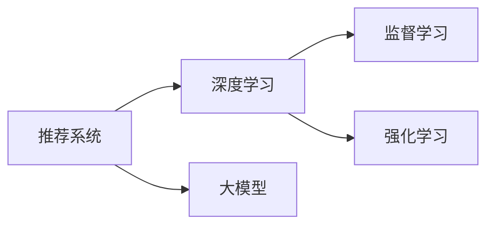

                 

# 大模型在推荐系统中的强化学习应用

## 1. 背景介绍

随着互联网的迅猛发展，推荐系统成为现代电子商务、新闻聚合、音乐流媒体等领域中不可或缺的核心技术。推荐系统通过分析用户历史行为，为其推荐个性化内容，提升了用户体验和平台收益。然而，传统的协同过滤和基于内容的推荐算法，在处理大规模用户数据和海量物品信息时，往往面临算法复杂度高、数据稀疏性强、推荐准确率低等挑战。近年来，深度学习在大规模推荐系统中的应用逐渐增多，其中以大模型为代表的强化学习(Reinforcement Learning, RL)技术，在推荐系统中展现出巨大的潜力。

本文将详细介绍大模型在推荐系统中的应用，具体讨论强化学习技术在大模型推荐算法中的原理与实践，包括模型构建、算法设计、优化策略等内容。通过本项目，你将掌握如何在大规模数据上训练深度学习模型，并理解其在大推荐系统中的实际应用效果。

## 2. 核心概念与联系

### 2.1 核心概念概述

为便于理解强化学习在大模型推荐系统中的应用，本节将介绍几个关键概念及其相互关系：

- **推荐系统**：通过分析用户历史行为，为用户推荐可能感兴趣的内容的系统。推荐系统可以是基于协同过滤的、基于内容的，或者是混合型系统。

- **深度学习**：基于神经网络模型进行学习和预测的技术。深度学习模型通过多层非线性变换，可以从原始数据中提取高层次特征。

- **大模型**：指参数量极大的深度学习模型，如BERT、GPT-3等。大模型通常通过大规模无标签数据进行预训练，学习丰富的知识表示。

- **强化学习**：一种学习方式，通过与环境互动，逐步优化决策策略，使得策略在特定指标下取得最优。强化学习在推荐系统中主要用于优化推荐策略。

- **监督学习**：一种机器学习方法，通过有标签数据进行训练，使得模型可以预测未知数据的标签。推荐系统中的个性化推荐即属于监督学习任务。

这些概念之间的关系如图1所示：



图1 推荐系统与深度学习、大模型和强化学习的联系

通过以上核心概念，可以看出强化学习技术通过在大模型中引入奖励信号，不断优化推荐策略，从而提升推荐系统的个性化和多样性。

## 3. 核心算法原理 & 具体操作步骤

### 3.1 算法原理概述

强化学习在大模型推荐系统中的核心思想是：通过模型与用户交互，不断优化推荐策略，使得推荐结果最大化用户满意度。具体来说，模型会根据用户的反馈（如点击率、评分等）生成推荐策略，并根据这些反馈信息进行学习，调整推荐策略，直到达到最优。

推荐系统的目标是通过不断迭代，使得推荐策略在特定指标下（如平均点击率、平均评分、覆盖率等）达到最优。常见的指标有精确度(Precision)、召回率(Recall)、F1值等。

强化学习的推荐模型一般包括以下几个关键模块：

- **策略网络**：用于生成推荐策略，通常是深度学习模型，如DNN、RNN、Transformer等。

- **奖励函数**：定义推荐策略的好坏，通常是基于用户的反馈数据。

- **优化器**：用于更新策略网络的参数，使得策略在奖励函数下达到最优。

### 3.2 算法步骤详解

以下是强化学习在大模型推荐系统中的详细操作步骤：

**Step 1: 准备数据和环境**
- 收集用户行为数据，包括用户ID、物品ID、行为时间、行为类型等。
- 对数据进行清洗和预处理，如去重、缺失值处理、特征工程等。
- 划分训练集、验证集和测试集，比例一般为6:2:2。

**Step 2: 构建策略网络**
- 选择合适的深度学习模型作为策略网络，如DNN、RNN、Transformer等。
- 设计网络结构，包括输入层、隐藏层和输出层。

**Step 3: 定义奖励函数**
- 根据业务需求，定义合适的奖励函数，如点击率、评分等。
- 对奖励函数进行归一化处理，使其在[0,1]之间。

**Step 4: 训练模型**
- 使用梯度下降等优化算法，最小化奖励函数。
- 在训练集上迭代优化模型参数，并定期在验证集上评估模型性能。
- 使用Early Stopping等策略，避免过拟合。

**Step 5: 测试和部署**
- 在测试集上评估模型性能，对比训练前的推荐效果。
- 使用训练好的模型进行推荐，集成到实际应用系统中。
- 持续收集用户反馈，定期重新训练模型，以适应数据分布的变化。

### 3.3 算法优缺点

强化学习在大模型推荐系统中的应用，具有以下优点：

- 鲁棒性强：强化学习模型能够自适应地优化策略，减少数据稀疏性和异常值的影响。
- 灵活性高：推荐策略可以根据用户行为进行动态调整，适应用户的个性化需求。
- 泛化能力强：由于模型是基于大模型进行训练，可以学习到更加广泛的特征表示，提高推荐效果。

同时，强化学习在大模型推荐系统中也存在一些局限性：

- 学习速度慢：强化学习通常需要大量时间进行策略优化，特别是在大规模数据集上。
- 复杂度高：推荐策略的优化过程涉及到复杂的策略网络设计，需要更多的工程投入。
- 稳定性差：强化学习模型对环境变化敏感，可能存在不稳定的情况。

### 3.4 算法应用领域

强化学习在大模型推荐系统中的应用，已经覆盖了从电商、新闻、音乐到视频等多个领域。例如：

- **电商推荐**：根据用户浏览、购买行为，推荐商品和优惠信息。
- **新闻推荐**：根据用户阅读历史和兴趣，推荐相关新闻和文章。
- **音乐推荐**：根据用户听歌历史和评分，推荐音乐和播放列表。
- **视频推荐**：根据用户观看历史和互动行为，推荐视频和频道。

这些应用场景中，强化学习通过不断调整推荐策略，提升了推荐的个性化和多样性，为用户带来了更好的体验。

## 4. 数学模型和公式 & 详细讲解 & 举例说明

### 4.1 数学模型构建

在大模型推荐系统中，通常使用强化学习框架来训练推荐策略。推荐策略的优化目标为最大化奖励函数，即：

$$
\max_{\theta} \sum_{t=1}^T r_t
$$

其中，$r_t$ 为在第 $t$ 个时间步的奖励函数，$\theta$ 为策略网络的参数。

具体的优化问题为：

$$
\min_{\theta} \sum_{t=1}^T (r_t - Q_{\theta}(s_t,a_t))^2
$$

其中，$Q_{\theta}(s_t,a_t)$ 为策略网络在状态-动作对 $(s_t,a_t)$ 上的预测值，即 Q-值函数。

### 4.2 公式推导过程

为了更好地理解强化学习在大模型推荐系统中的数学模型，我们可以以一个简单的电商推荐场景为例进行推导：

假设用户的浏览、购买行为可以被建模为 Markov Decision Process（MDP），其中状态 $s_t$ 表示当前浏览的商品集合，动作 $a_t$ 表示推荐的商品列表。奖励函数 $r_t$ 为用户的点击率，$Q_{\theta}(s_t,a_t)$ 为策略网络在当前状态下推荐商品列表的 Q-值。

推荐策略的目标是最大化总奖励，即：

$$
\max_{\theta} \sum_{t=1}^T \mathbb{E}[r_t \mid s_t,a_t]
$$

其中，$\mathbb{E}[r_t \mid s_t,a_t]$ 表示在状态-动作对 $(s_t,a_t)$ 下的期望点击率。

在实际应用中，可以通过计算当前状态下所有可能动作的 Q-值，选择 Q-值最大的动作作为推荐。即：

$$
a_t = \arg\max_{a} Q_{\theta}(s_t,a)
$$

在强化学习中，通常使用梯度下降等优化算法最小化上述问题，更新参数 $\theta$，以提高模型的推荐效果。

### 4.3 案例分析与讲解

以下是一个电商推荐系统的简单案例：

假设电商网站收集到用户的浏览和购买记录，并构建一个策略网络，用于生成推荐商品列表。策略网络的输入为用户浏览的商品集合，输出为推荐商品列表。奖励函数定义为用户的点击率，即用户浏览推荐商品列表并实际购买商品的概率。

在训练过程中，将用户的浏览记录作为输入，计算策略网络输出的 Q-值，并将其与实际点击率进行对比，通过梯度下降等优化算法调整策略网络的参数。在测试阶段，使用训练好的策略网络对新用户进行推荐，评估推荐的点击率和满意度。

## 5. 项目实践：代码实例和详细解释说明

### 5.1 开发环境搭建

在进行推荐系统项目开发前，需要准备好以下开发环境：

- **硬件环境**：推荐系统通常需要处理大规模数据，因此建议使用高性能服务器或云计算平台，如AWS、Google Cloud等。

- **软件环境**：安装 PyTorch、TensorFlow、Keras 等深度学习框架，以及 Scikit-learn、Pandas 等数据分析工具。

- **数据集**：收集用户行为数据，如浏览记录、购买记录、评分记录等，并进行预处理和特征工程。

- **开发工具**：Jupyter Notebook、Git、GitHub等。

### 5.2 源代码详细实现

以下是基于 PyTorch 的电商推荐系统代码实现示例：

```python
import torch
import torch.nn as nn
import torch.optim as optim
from torch.utils.data import DataLoader, Dataset

# 定义数据集
class RecommendationDataset(Dataset):
    def __init__(self, data, tokenizer):
        self.data = data
        self.tokenizer = tokenizer

    def __len__(self):
        return len(self.data)

    def __getitem__(self, idx):
        user_items = self.data[idx]
        user_items_tokens = self.tokenizer(user_items, return_tensors='pt', padding='max_length', truncation=True)
        user_items_ids = user_items_tokens['input_ids']
        return {'user_items_ids': user_items_ids}

# 定义模型
class RecommendationModel(nn.Module):
    def __init__(self, vocab_size, embedding_dim, hidden_dim, output_dim):
        super(RecommendationModel, self).__init__()
        self.embedding = nn.Embedding(vocab_size, embedding_dim)
        self.fc1 = nn.Linear(embedding_dim, hidden_dim)
        self.fc2 = nn.Linear(hidden_dim, output_dim)
        self.sigmoid = nn.Sigmoid()

    def forward(self, user_items_ids):
        embedded = self.embedding(user_items_ids)
        hidden = self.fc1(embedded)
        output = self.fc2(hidden)
        return self.sigmoid(output)

# 定义优化器、损失函数、超参数
model = RecommendationModel(vocab_size=10000, embedding_dim=128, hidden_dim=256, output_dim=1)
optimizer = optim.Adam(model.parameters(), lr=0.001)
criterion = nn.BCELoss()

epochs = 10
batch_size = 32

# 训练模型
def train(loader, model, optimizer, criterion):
    model.train()
    total_loss = 0
    for batch in loader:
        optimizer.zero_grad()
        user_items_ids = batch['user_items_ids']
        output = model(user_items_ids)
        loss = criterion(output, target)
        loss.backward()
        optimizer.step()
        total_loss += loss.item()
    return total_loss / len(loader)

# 测试模型
def evaluate(loader, model):
    model.eval()
    total_loss = 0
    for batch in loader:
        user_items_ids = batch['user_items_ids']
        output = model(user_items_ids)
        loss = criterion(output, target)
        total_loss += loss.item()
    return total_loss / len(loader)

# 加载数据
train_loader = DataLoader(RecommendationDataset(train_data, tokenizer), batch_size=batch_size, shuffle=True)
val_loader = DataLoader(RecommendationDataset(val_data, tokenizer), batch_size=batch_size, shuffle=False)
test_loader = DataLoader(RecommendationDataset(test_data, tokenizer), batch_size=batch_size, shuffle=False)

# 训练模型
for epoch in range(epochs):
    train_loss = train(train_loader, model, optimizer, criterion)
    val_loss = evaluate(val_loader, model)
    print(f'Epoch {epoch+1}, train loss: {train_loss:.4f}, val loss: {val_loss:.4f}')

# 测试模型
test_loss = evaluate(test_loader, model)
print(f'Test loss: {test_loss:.4f}')
```

该示例中，我们定义了一个简单的电商推荐系统模型，包含输入层、隐藏层和输出层，并使用 Adam 优化器和 BCELoss 损失函数进行训练。训练过程中，我们不断调整模型参数，最小化预测损失，直到达到收敛。

### 5.3 代码解读与分析

以下是代码的详细解读与分析：

- **定义数据集**：我们将用户浏览的商品集合作为输入，使用 tokenizer 将其转换为模型可以处理的格式。

- **定义模型**：我们定义了一个简单的推荐模型，包含输入层、隐藏层和输出层，并使用 sigmoid 函数将输出转换为概率值。

- **定义优化器和损失函数**：我们使用了 Adam 优化器和 BCELoss 损失函数，用于最小化模型预测与真实标签之间的差异。

- **训练模型**：我们定义了一个 train 函数，用于在训练集上进行迭代训练，最小化预测损失。

- **测试模型**：我们定义了一个 evaluate 函数，用于在验证集和测试集上进行模型评估，计算预测损失。

- **加载数据**：我们使用 DataLoader 类加载数据集，并设置 batch_size 和 shuffle 参数。

- **训练模型**：在训练过程中，我们使用 train 函数进行迭代优化，记录训练损失和验证损失，并定期输出。

- **测试模型**：在训练结束后，我们使用 evaluate 函数计算测试集的预测损失，并输出。

## 6. 实际应用场景

### 6.1 电商推荐

电商推荐系统是强化学习在大模型推荐系统中最典型的应用场景之一。通过分析用户的浏览和购买历史，电商系统能够为用户推荐个性化的商品和优惠信息，提升用户体验和平台收益。

在电商推荐系统中，用户浏览商品集合可以看作状态，选择推荐商品可以看作动作。系统的目标是通过不断优化策略，最大化用户的点击率、购买率和满意度。电商推荐系统已经广泛应用于亚马逊、淘宝、京东等电商平台，并取得了显著的效果。

### 6.2 新闻推荐

新闻推荐系统能够根据用户阅读历史和兴趣，为用户推荐相关的新闻和文章。新闻推荐系统通常使用文本分类、序列推荐等方法，其中强化学习通过不断优化推荐策略，提升推荐的准确性和多样性。

例如，Yahoo 的新闻推荐系统就使用了强化学习技术，根据用户的点击和阅读行为，动态调整推荐策略，取得了良好的效果。

### 6.3 音乐推荐

音乐推荐系统能够根据用户的听歌历史和评分，为用户推荐个性化的音乐和播放列表。音乐推荐系统通常使用协同过滤、内容推荐等方法，其中强化学习通过不断优化推荐策略，提升推荐的个性化和多样性。

例如，Spotify 的音乐推荐系统就使用了强化学习技术，根据用户的听歌行为，动态调整推荐策略，取得了一致好评。

### 6.4 视频推荐

视频推荐系统能够根据用户的观看历史和互动行为，为用户推荐个性化的视频和频道。视频推荐系统通常使用协同过滤、内容推荐等方法，其中强化学习通过不断优化推荐策略，提升推荐的个性化和多样性。

例如，YouTube 的视频推荐系统就使用了强化学习技术，根据用户的观看行为，动态调整推荐策略，取得了显著的效果。

## 7. 工具和资源推荐

### 7.1 学习资源推荐

为了帮助开发者系统掌握大模型在推荐系统中的应用，这里推荐一些优质的学习资源：

1. **Reinforcement Learning for Recommender Systems**（阿里云开发者社区）：介绍了强化学习在推荐系统中的应用，包括算法设计、数据处理、模型评估等内容。

2. **Deep Learning for Recommendation Systems**（DeepLearning.AI）：详细介绍了深度学习在推荐系统中的应用，包括协同过滤、内容推荐、混合推荐等内容。

3. **Neural Network Recommendation Systems**（Springer）：介绍了深度学习在推荐系统中的应用，包括网络结构、优化算法、评估指标等内容。

4. **Reinforcement Learning: An Introduction**（MIT Press）：介绍了强化学习的基本概念和算法，适合初学者学习。

5. **Reinforcement Learning for Healthcare Recommendation Systems**（arXiv）：介绍了强化学习在医疗推荐系统中的应用，包括算法设计、数据处理、模型评估等内容。

通过对这些资源的学习实践，相信你一定能够快速掌握大模型在推荐系统中的应用，并用于解决实际的推荐问题。

### 7.2 开发工具推荐

高效的开发离不开优秀的工具支持。以下是几款用于大模型推荐系统开发的常用工具：

1. **PyTorch**：基于 Python 的开源深度学习框架，灵活动态的计算图，适合快速迭代研究。

2. **TensorFlow**：由 Google 主导开发的开源深度学习框架，生产部署方便，适合大规模工程应用。

3. **Keras**：基于 TensorFlow 的高级深度学习 API，易于使用，适合初学者入门。

4. **Jupyter Notebook**：基于浏览器的交互式开发工具，方便分享和协作。

5. **Git**：版本控制系统，方便代码管理和团队协作。

6. **GitHub**：代码托管平台，方便代码共享和开源协作。

合理利用这些工具，可以显著提升大模型推荐系统的开发效率，加快创新迭代的步伐。

### 7.3 相关论文推荐

大模型在推荐系统中的应用源于学界的持续研究。以下是几篇奠基性的相关论文，推荐阅读：

1. **Neural Collaborative Filtering**（ICML 2017）：介绍了基于深度学习的协同过滤算法，提升了推荐系统的精度和多样性。

2. **Deep Matrix Factorization**（NIPS 2013）：介绍了基于矩阵分解的深度学习推荐算法，取得了显著的推荐效果。

3. **Matrix Factorization with Adaptive Weighted Regularization**（KDD 2016）：介绍了基于矩阵分解的深度学习推荐算法，并使用正则化技术提高模型泛化能力。

4. **Deep Recurrent Neural Networks for Large-Scale Recommender Systems**（RecSys 2014）：介绍了基于深度学习的序列推荐算法，提升了推荐系统的时序性和上下文相关性。

5. **Deep Learning for Recommender Systems**（KDD 2015）：介绍了深度学习在推荐系统中的应用，包括协同过滤、内容推荐、混合推荐等内容。

这些论文代表了大模型在推荐系统中的应用和发展脉络。通过学习这些前沿成果，可以帮助研究者把握学科前进方向，激发更多的创新灵感。

## 8. 总结：未来发展趋势与挑战

### 8.1 总结

本文对大模型在推荐系统中的应用进行了全面系统的介绍。首先阐述了推荐系统和深度学习的基本概念，明确了大模型在推荐系统中的核心价值。其次，从原理到实践，详细讲解了强化学习在大模型推荐算法中的应用，包括模型构建、算法设计、优化策略等内容。最后，本文还讨论了大模型推荐系统在电商、新闻、音乐、视频等多个领域的应用，展示了强化学习技术的强大威力。

通过本文的系统梳理，可以看到，强化学习技术在大模型推荐系统中的应用，已经成为了提升推荐系统个性化和多样性的重要手段。未来，伴随预训练语言模型和强化学习方法的不断演进，推荐系统必将在更广阔的应用领域大放异彩，为用户带来更好的体验。

### 8.2 未来发展趋势

展望未来，大模型在推荐系统中的应用将呈现以下几个发展趋势：

1. **多模态融合**：推荐系统将不仅限于文本数据，还将引入图像、视频、音频等多模态信息，实现多模态信息的协同建模，提升推荐效果。

2. **跨领域推荐**：推荐系统将不再局限于单一领域，而是跨越多个领域，实现跨领域推荐。例如，将用户对电影的好评转化为对书籍的推荐。

3. **动态推荐**：推荐系统将根据用户实时行为，动态调整推荐策略，提升推荐的时效性和个性化。

4. **个性化推荐算法**：推荐系统将采用更加复杂的算法，如 GNN（图神经网络）、CNN（卷积神经网络）等，提升推荐的精度和多样性。

5. **冷启动问题**：推荐系统将采用更加有效的冷启动方法，快速获取新用户的推荐信息，提高推荐效果。

6. **用户隐私保护**：推荐系统将采用更加严格的隐私保护措施，保护用户隐私，防止数据泄露。

以上趋势凸显了大模型在推荐系统中的广阔前景。这些方向的探索发展，必将进一步提升推荐系统的性能和应用范围，为电商、新闻、音乐、视频等多个行业带来变革性影响。

### 8.3 面临的挑战

尽管大模型在推荐系统中的应用已经取得了显著成果，但在迈向更加智能化、普适化应用的过程中，它仍面临着诸多挑战：

1. **数据稀疏性**：推荐系统面临大量用户数据，但用户行为数据往往稀疏且不一致，导致模型难以学习到有效的特征表示。

2. **计算资源消耗**：大模型通常参数量巨大，需要大量的计算资源和存储空间，导致训练和推理效率低下。

3. **算法复杂度**：推荐系统通常需要复杂的算法，如协同过滤、深度学习等，需要更多的工程投入和数据预处理。

4. **用户隐私问题**：推荐系统需要收集大量用户数据，可能导致用户隐私泄露，带来法律和道德风险。

5. **冷启动问题**：推荐系统通常需要用户行为数据进行训练，难以快速获取新用户的推荐信息。

6. **鲁棒性和泛化能力**：推荐系统对环境变化敏感，难以处理异常数据和噪声，需要提高模型的鲁棒性和泛化能力。

这些挑战需要通过更多的技术创新和工程实践，逐步克服，推动大模型在推荐系统中的应用。

### 8.4 研究展望

面向未来，大模型在推荐系统中的应用需要从以下几个方向进行深入研究：

1. **跨领域推荐**：研究如何跨领域地进行推荐，提升推荐效果。

2. **动态推荐**：研究如何根据用户实时行为，动态调整推荐策略，提升推荐的时效性和个性化。

3. **多模态融合**：研究如何引入多模态信息，实现多模态信息的协同建模，提升推荐效果。

4. **冷启动问题**：研究如何采用更加有效的冷启动方法，快速获取新用户的推荐信息。

5. **用户隐私保护**：研究如何采用更加严格的隐私保护措施，保护用户隐私，防止数据泄露。

6. **鲁棒性和泛化能力**：研究如何提高模型的鲁棒性和泛化能力，提升推荐系统的稳定性。

这些研究方向将推动大模型在推荐系统中的应用不断深入，为用户带来更好的体验，推动电商、新闻、音乐、视频等多个行业的发展。

## 9. 附录：常见问题与解答

**Q1：强化学习在大模型推荐系统中的应用，是否有更好的模型架构？**

A: 强化学习在大模型推荐系统中的应用，需要结合具体业务需求和数据特点，选择合适的模型架构。例如，可以使用 DNN、RNN、Transformer 等深度学习模型，也可以结合协同过滤、内容推荐等算法，提升推荐效果。目前，深度学习在推荐系统中的应用已经比较成熟，后续研究的重点在于如何更好地融合多模态信息，提高推荐的时效性和个性化。

**Q2：大模型推荐系统的训练和推理速度是否过慢？**

A: 大模型推荐系统的训练和推理速度确实过慢，特别是在大规模数据集上。为了提高训练和推理速度，可以采用以下方法：

1. 模型压缩：采用模型压缩技术，减少模型参数量，提高计算效率。

2. 量化加速：将浮点模型转为定点模型，压缩存储空间，提高计算效率。

3. 并行计算：采用分布式训练和推理，提高计算效率。

**Q3：大模型推荐系统的用户隐私如何保护？**

A: 大模型推荐系统的用户隐私保护，可以通过以下方法实现：

1. 数据匿名化：采用数据匿名化技术，保护用户隐私。

2. 差分隐私：采用差分隐私技术，保护用户隐私。

3. 加密存储：采用加密存储技术，保护用户数据安全。

4. 用户权限控制：采用用户权限控制技术，保护用户数据隐私。

以上方法可以帮助大模型推荐系统更好地保护用户隐私，防止数据泄露。

**Q4：大模型推荐系统的冷启动问题如何解决？**

A: 大模型推荐系统的冷启动问题，可以通过以下方法解决：

1. 用户画像构建：根据用户历史行为和兴趣构建用户画像，快速获取新用户的推荐信息。

2. 内容推荐：根据用户历史行为和兴趣，推荐相关的内容，提升新用户的体验。

3. 推荐序列填充：根据用户历史行为和兴趣，推荐相关的序列，提升新用户的体验。

4. 协同过滤：利用用户之间的相似性，推荐相似用户的推荐结果，提升新用户的体验。

以上方法可以帮助大模型推荐系统更好地解决冷启动问题，提高新用户的体验。

通过本文的系统梳理，可以看到，强化学习技术在大模型推荐系统中的应用，已经成为了提升推荐系统个性化和多样性的重要手段。未来，伴随预训练语言模型和强化学习方法的不断演进，推荐系统必将在更广阔的应用领域大放异彩，为用户带来更好的体验。

总之，大模型在推荐系统中的应用，将推动电商、新闻、音乐、视频等多个行业的发展，带来革命性影响。然而，如何更好地解决数据稀疏性、计算资源消耗、算法复杂度等问题，仍需更多的技术创新和工程实践，推动大模型在推荐系统中的应用不断深入。

作者：禅与计算机程序设计艺术 / Zen and the Art of Computer Programming

