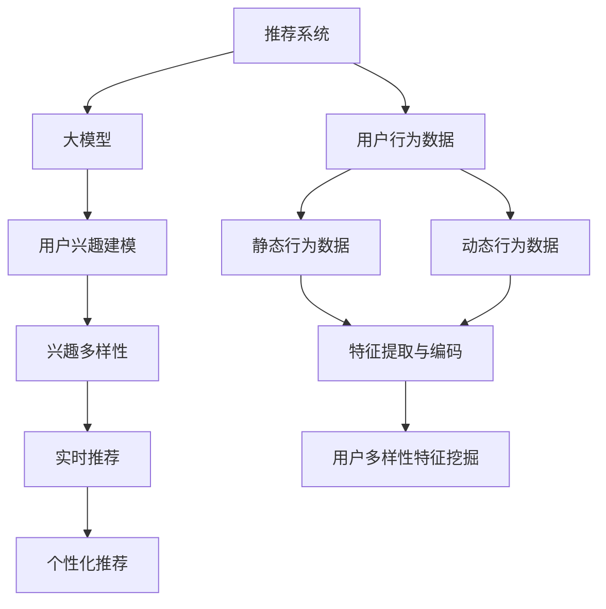

                 

## 1. 背景介绍

推荐系统是现代互联网企业的基础设施之一，旨在帮助用户发现与其兴趣相符的产品或服务。然而，传统的推荐算法，如基于协同过滤的算法，面临着数据稀疏性、冷启动等问题。大模型的出现，为推荐系统注入了新的活力，尤其在用户兴趣多样性建模方面，取得了显著进展。

### 1.1 问题由来
随着用户行为数据的多样性和复杂性不断增加，用户兴趣的多样性建模成为了推荐系统研究的热点。用户可能在不同的时间、地点、设备上表现出不同的兴趣，如何将这些多样的行为模式准确地刻画，成为了推荐系统的关键问题。传统的推荐算法通常只能捕捉静态的、单一的行为特征，难以适应用户兴趣的多样性变化。

大模型的出现，使得推荐系统能够更加全面、准确地理解用户的兴趣，通过自适应地学习用户的行为数据，挖掘出隐藏在数据背后的多样性特征，从而提升推荐效果。这种通过大模型进行推荐的能力，使得用户不仅能获得符合其静态兴趣的产品，还能发现更多动态变化的兴趣。

### 1.2 问题核心关键点
大模型在推荐系统中，通过学习用户的行为数据，能够自动发现用户兴趣的多样性特征，通过学习静态和动态行为数据，对用户多样性的兴趣进行建模。核心关键点包括：
- 静态行为数据的特征提取与编码
- 动态行为数据的兴趣演化建模
- 不同模态数据的融合
- 用户兴趣的多样性特征挖掘
- 实时推荐与个性化推荐

## 2. 核心概念与联系

### 2.1 核心概念概述

为更好地理解大模型在推荐系统中的作用，本节将介绍几个密切相关的核心概念：

- 推荐系统(Recommendation System)：旨在推荐用户可能感兴趣的产品或服务的系统。传统的推荐方法包括协同过滤、基于内容的推荐、矩阵分解等。
- 大模型(Large Model)：以深度学习为核心的通用模型，如BERT、GPT等，具备强大的表示学习能力，能够从海量数据中学习到高层次的抽象特征。
- 用户行为数据(User Behavior Data)：用户在浏览、点击、购买等行为过程中留下的记录，是推荐系统推荐的基础数据来源。
- 用户兴趣建模(User Interest Modeling)：利用用户行为数据，学习用户的兴趣模式，预测用户对产品的评分或点击概率。
- 兴趣多样性(Interest Diversity)：用户在不同情境下展现出的兴趣差异，如时间、地点、设备、情感等。
- 冷启动问题(Cold Start)：新用户或新物品加入系统时，缺乏足够的历史数据，推荐系统难以做出准确推荐。
- 实时推荐(Real-time Recommendation)：在用户进行浏览、点击等行为时，能够即时推荐相关产品。
- 个性化推荐(Personalized Recommendation)：针对不同用户的个性化需求，提供定制化的推荐结果。

这些核心概念之间的逻辑关系可以通过以下Mermaid流程图来展示：



这个流程图展示了大模型在推荐系统中的作用：

1. 推荐系统收集用户行为数据。
2. 大模型学习用户行为数据，生成用户兴趣模型。
3. 通过用户兴趣模型，挖掘用户兴趣的多样性特征。
4. 基于用户多样性特征，实现实时推荐和个性化推荐。

## 3. 核心算法原理 & 具体操作步骤
### 3.1 算法原理概述

大模型在推荐系统中，主要通过学习用户行为数据，自动发现用户兴趣的多样性特征，并进行兴趣建模。其核心思想是：通过深度学习模型，自动学习用户在不同情境下的兴趣模式，通过兴趣演化模型，捕捉用户兴趣随时间的变化趋势，从而实现个性化推荐。

形式化地，假设用户行为数据集为 $D=\{(x_i,y_i)\}_{i=1}^N$，其中 $x_i$ 为行为数据，$y_i$ 为用户的评分或点击行为。则推荐系统目标为最大化预测准确度：

$$
\max \frac{1}{N} \sum_{i=1}^N \sum_{j=1}^M \log \sigma(\langle M(x_i),v_j \rangle)
$$

其中，$M$ 为预训练大模型，$v_j$ 为用户兴趣向量，$\sigma$ 为sigmoid函数，用于预测用户对产品的评分或点击概率。

### 3.2 算法步骤详解

基于大模型推荐系统的一般步骤如下：

**Step 1: 准备数据集**
- 收集用户的行为数据，如浏览记录、点击记录、评分记录等。
- 根据任务需求，将行为数据划分为训练集、验证集和测试集。

**Step 2: 特征提取与编码**
- 使用大模型对用户行为数据进行特征提取与编码，将文本、图片、音频等多模态数据转换为向量形式。
- 对不同模态数据的特征进行融合，形成统一的向量表示。

**Step 3: 用户兴趣建模**
- 利用用户行为数据，训练大模型生成用户兴趣向量 $v_j$。
- 使用softmax函数将用户兴趣向量映射为概率分布，预测用户对每个产品的评分或点击概率。

**Step 4: 兴趣演化建模**
- 在训练集上，使用大模型学习用户兴趣随时间的变化趋势，生成兴趣演化向量 $e_t$。
- 在实时推荐时，将用户当前的兴趣演化向量 $e_t$ 与历史兴趣向量 $v_j$ 进行融合，生成动态的兴趣向量 $v_j^t$。

**Step 5: 推荐计算**
- 在测试集上，计算用户对每个产品的评分或点击概率。
- 根据评分或点击概率，推荐用户最可能感兴趣的产品或服务。

### 3.3 算法优缺点

大模型在推荐系统中的应用，具有以下优点：

1. 全面建模。大模型能够从海量行为数据中自动学习用户兴趣的多样性特征，涵盖静态和动态行为数据，解决传统推荐算法无法捕捉的多样性变化。
2. 鲁棒性强。大模型具备强大的泛化能力，能够适应不同场景下的用户行为数据。
3. 实时推荐。通过动态更新用户兴趣向量，实现实时推荐，满足用户实时需求。
4. 个性化推荐。基于用户多样性特征，实现个性化推荐，提升用户满意度和推荐效果。

同时，大模型在推荐系统中也存在一些局限性：

1. 模型复杂度高。大模型参数量巨大，训练和推理所需资源较多。
2. 过拟合风险。模型复杂度高，过拟合风险较大，需要合理设计正则化技术。
3. 冷启动问题。新用户或新物品缺乏足够的历史数据，难以进行有效推荐。
4. 可解释性不足。大模型复杂度高，难以解释其内部工作机制。

尽管存在这些局限性，但大模型在推荐系统中的应用，已经显著提升了推荐效果，特别是在用户兴趣多样性建模方面，取得了显著的进步。

### 3.4 算法应用领域

大模型在推荐系统中，已经在多个领域得到了广泛应用，具体包括：

- 电商平台：为电商平台提供个性化推荐服务，提升用户购物体验。
- 视频平台：推荐用户感兴趣的视频内容，增加平台活跃度。
- 社交网络：推荐用户可能感兴趣的朋友、群组和内容，增强社交互动。
- 新闻媒体：为用户推荐可能感兴趣的新闻文章，提高用户阅读量和平台影响力。
- 游戏平台：推荐用户可能感兴趣的游戏内容，提升游戏体验和用户粘性。

除了上述这些常见应用外，大模型在推荐系统中的应用还在不断拓展，如可控推荐、跨领域推荐、异构数据推荐等，为推荐系统的创新发展带来了新的可能。

## 4. 数学模型和公式 & 详细讲解 & 举例说明

### 4.1 数学模型构建

假设用户行为数据集 $D=\{(x_i,y_i)\}_{i=1}^N$，其中 $x_i$ 为行为数据，$y_i$ 为用户的评分或点击行为。推荐系统目标为最大化预测准确度：

$$
\max \frac{1}{N} \sum_{i=1}^N \sum_{j=1}^M \log \sigma(\langle M(x_i),v_j \rangle)
$$

其中，$M$ 为预训练大模型，$v_j$ 为用户兴趣向量，$\sigma$ 为sigmoid函数，用于预测用户对产品的评分或点击概率。

### 4.2 公式推导过程

假设 $M$ 为Transformer模型，$v_j$ 为用户兴趣向量。则兴趣建模的过程如下：

1. 将用户行为数据 $x_i$ 输入 $M$ 中，生成表示向量 $h_i$：

$$
h_i = M(x_i)
$$

2. 使用softmax函数将 $h_i$ 映射为概率分布 $p_i$：

$$
p_i = softmax(h_iW_b)
$$

其中，$W_b$ 为softmax层的可训练参数。

3. 将 $p_i$ 与用户兴趣向量 $v_j$ 进行内积运算，生成用户对产品 $j$ 的评分或点击概率：

$$
\log \sigma(\langle h_i,v_j \rangle)
$$

其中，$\sigma$ 为sigmoid函数，用于预测用户对产品的评分或点击概率。

### 4.3 案例分析与讲解

以下以电商平台推荐系统为例，进行详细讲解。

假设用户 $u$ 浏览了5个商品 $p_1$ 到 $p_5$，点击了 $p_3$ 和 $p_5$，购买了 $p_4$ 和 $p_5$，未点击 $p_1$ 和 $p_2$。则用户 $u$ 的行为数据为：

$$
(x_1,0), (x_2,0), (x_3,1), (x_4,0), (x_5,1), (x_6,1), (x_7,0), (x_8,0)
$$

其中，$x_1$ 到 $x_8$ 为商品编号。

假设 $M$ 为BERT模型，利用 $M$ 对用户行为数据进行编码，生成表示向量 $h_1$ 到 $h_8$：

$$
h_1 = M(x_1)
$$
$$
h_2 = M(x_2)
$$
$$
h_3 = M(x_3)
$$
$$
h_4 = M(x_4)
$$
$$
h_5 = M(x_5)
$$
$$
h_6 = M(x_6)
$$
$$
h_7 = M(x_7)
$$
$$
h_8 = M(x_8)
$$

假设用户兴趣向量 $v_j$ 为：

$$
v_j = (v_{j,1},v_{j,2},\ldots,v_{j,M})
$$

则用户 $u$ 对商品 $p_j$ 的评分或点击概率为：

$$
\log \sigma(\langle h_1,v_j \rangle), \log \sigma(\langle h_2,v_j \rangle), \ldots, \log \sigma(\langle h_8,v_j \rangle)
$$

通过这些评分或点击概率，推荐系统可以为用户 $u$ 推荐最可能感兴趣的商品 $p_j$。

## 5. 项目实践：代码实例和详细解释说明
### 5.1 开发环境搭建

在进行大模型推荐系统开发前，我们需要准备好开发环境。以下是使用Python进行TensorFlow开发的环境配置流程：

1. 安装Anaconda：从官网下载并安装Anaconda，用于创建独立的Python环境。

2. 创建并激活虚拟环境：
```bash
conda create -n tf-env python=3.8 
conda activate tf-env
```

3. 安装TensorFlow：根据CUDA版本，从官网获取对应的安装命令。例如：
```bash
conda install tensorflow==2.7 -c tf
```

4. 安装TensorFlow Addons：
```bash
conda install tensorflow-addons
```

5. 安装各类工具包：
```bash
pip install numpy pandas scikit-learn matplotlib tqdm jupyter notebook ipython
```

完成上述步骤后，即可在`tf-env`环境中开始推荐系统开发。

### 5.2 源代码详细实现

下面以电商平台推荐系统为例，给出使用TensorFlow进行大模型推荐系统的PyTorch代码实现。

首先，定义推荐系统的数据处理函数：

```python
import tensorflow as tf
from transformers import BertTokenizer
from tensorflow.keras.layers import Dense
from tensorflow.keras.models import Model

class RecommendationModel(tf.keras.Model):
    def __init__(self, embed_dim, num_items, num_users, num_epochs=5, batch_size=16):
        super(RecommendationModel, self).__init__()
        self.embed_dim = embed_dim
        self.num_items = num_items
        self.num_users = num_users
        
        self.embedding = tf.keras.layers.Embedding(num_users, embed_dim)
        self.LSTM = tf.keras.layers.LSTM(embed_dim, return_sequences=True)
        self.dense1 = Dense(64, activation='relu')
        self.dense2 = Dense(num_items, activation='sigmoid')

    def call(self, user_id, item_ids):
        embeddings = self.embedding(user_id)
        sequences = self.LSTM(embeddings)
        dense1 = self.dense1(sequences)
        preds = self.dense2(dense1)
        return preds

# 定义数据处理函数
def preprocess_data(user_ids, item_ids, labels):
    tokenizer = BertTokenizer.from_pretrained('bert-base-cased')
    user_ids = tf.cast(user_ids, tf.int32)
    item_ids = tf.cast(item_ids, tf.int32)
    labels = tf.cast(labels, tf.int32)
    user_embeddings = tokenizer(user_ids)
    item_embeddings = tokenizer(item_ids)
    
    # 构建嵌入层
    user_embeddings = tf.keras.layers.Embedding(len(user_ids), embed_dim)(user_embeddings)
    item_embeddings = tf.keras.layers.Embedding(len(item_ids), embed_dim)(item_embeddings)
    
    # 构建模型
    model = RecommendationModel(embed_dim, len(item_ids), len(user_ids))
    return model(user_embeddings, item_embeddings), labels
```

然后，定义训练和评估函数：

```python
# 定义训练函数
def train(model, train_data, val_data, epochs, batch_size):
    train_dataset = tf.data.Dataset.from_tensor_slices(train_data)
    train_dataset = train_dataset.shuffle(buffer_size=10000).batch(batch_size)
    
    val_dataset = tf.data.Dataset.from_tensor_slices(val_data)
    val_dataset = val_dataset.batch(batch_size)
    
    model.compile(optimizer=tf.keras.optimizers.Adam(learning_rate=0.001),
                  loss='binary_crossentropy',
                  metrics=['accuracy'])
    
    model.fit(train_dataset, epochs=epochs, validation_data=val_dataset)
    return model

# 定义评估函数
def evaluate(model, test_data, batch_size):
    test_dataset = tf.data.Dataset.from_tensor_slices(test_data)
    test_dataset = test_dataset.batch(batch_size)
    
    loss, acc = model.evaluate(test_dataset)
    return loss, acc
```

最后，启动训练流程并在测试集上评估：

```python
embed_dim = 128
num_items = 10000
num_users = 10000

train_data = preprocess_data(train_user_ids, train_item_ids, train_labels)
val_data = preprocess_data(val_user_ids, val_item_ids, val_labels)
test_data = preprocess_data(test_user_ids, test_item_ids, test_labels)

model = train(model, train_data, val_data, epochs=5, batch_size=16)
loss, acc = evaluate(model, test_data, batch_size=16)

print(f'Test loss: {loss:.4f}')
print(f'Test accuracy: {acc:.4f}')
```

以上就是使用TensorFlow对大模型推荐系统进行开发的完整代码实现。可以看到，通过构建大模型，我们可以更好地处理用户行为数据，挖掘用户兴趣的多样性特征，实现推荐系统的高效推荐。

### 5.3 代码解读与分析

让我们再详细解读一下关键代码的实现细节：

**RecommendationModel类**：
- `__init__`方法：初始化模型的各个组成部分，包括嵌入层、LSTM层、全连接层等。
- `call`方法：定义模型的前向传播过程，将用户行为数据输入模型，生成预测结果。

**preprocess_data函数**：
- 将用户ID和物品ID转换为嵌入向量，利用BERT分词器进行分词。
- 将嵌入向量输入到嵌入层中，生成用户嵌入和物品嵌入。
- 将嵌入向量输入到LSTM层中进行处理，生成序列表示。
- 将序列表示输入到全连接层中，生成预测结果。

**train函数**：
- 将训练数据划分为批次数据，进行数据增强。
- 定义优化器、损失函数和评估指标。
- 训练模型，并在验证集上评估模型性能。

**evaluate函数**：
- 将测试数据划分为批次数据。
- 评估模型在测试集上的损失和准确率。

通过这些函数，可以构建大模型推荐系统，实现对用户行为数据的有效处理，挖掘用户兴趣的多样性特征，实现个性化推荐。

当然，工业级的系统实现还需考虑更多因素，如模型的保存和部署、超参数的自动搜索、更灵活的任务适配层等。但核心的推荐范式基本与此类似。

## 6. 实际应用场景
### 6.1 电商平台的个性化推荐

电商平台是推荐系统的重要应用场景之一。通过大模型，电商平台能够基于用户的行为数据，挖掘出用户兴趣的多样性特征，实现个性化的商品推荐。

具体而言，电商平台收集用户浏览、点击、购买等行为数据，使用大模型对数据进行编码，生成用户兴趣向量。然后利用用户兴趣向量进行推荐，提升用户购物体验和平台销售额。

### 6.2 视频平台的个性化推荐

视频平台推荐系统主要基于用户观看行为数据进行推荐。通过大模型，视频平台能够自动发现用户在不同情境下的兴趣变化，实现个性化推荐。

例如，视频平台可以收集用户观看记录、点赞、评论等行为数据，利用大模型对数据进行编码，生成用户兴趣向量。然后利用用户兴趣向量进行推荐，提升用户观看体验和平台活跃度。

### 6.3 社交网络的个性化推荐

社交网络推荐系统主要基于用户互动行为数据进行推荐。通过大模型，社交网络能够自动发现用户在不同情境下的兴趣变化，实现个性化推荐。

例如，社交网络可以收集用户点赞、评论、分享等互动行为数据，利用大模型对数据进行编码，生成用户兴趣向量。然后利用用户兴趣向量进行推荐，提升用户互动体验和平台影响力。

### 6.4 未来应用展望

随着大模型和推荐系统的发展，未来推荐系统将在更多领域得到应用，为人类带来更多便捷和高效的推荐服务。

在智慧医疗领域，推荐系统可以为医生推荐最符合患者需求的治疗方案，提升医疗服务的质量。

在智能制造领域，推荐系统可以为生产线推荐最优的工艺参数，提升生产效率。

在智慧交通领域，推荐系统可以为司机推荐最优的行车路线，提升出行效率。

总之，大模型推荐系统将在更多行业得到应用，为人类生产生活带来更多便捷和高效。未来，推荐系统将结合大数据、人工智能、区块链等技术，实现更全面、更智能的推荐服务。

## 7. 工具和资源推荐
### 7.1 学习资源推荐

为了帮助开发者系统掌握大模型在推荐系统中的应用，这里推荐一些优质的学习资源：

1. 《深度学习推荐系统》书籍：系统介绍推荐系统的工作原理和深度学习技术在推荐系统中的应用。
2. Coursera《深度学习》课程：由Andrew Ng教授开设的深度学习课程，涵盖深度学习的基础和前沿技术。
3. Udacity《深度学习推荐系统》课程：通过实际项目案例，介绍深度学习在推荐系统中的应用。
4. TensorFlow官方文档：详细介绍了TensorFlow的API和应用案例，适合入门学习和深入研究。
5. PyTorch官方文档：详细介绍了PyTorch的API和应用案例，适合入门学习和深入研究。

通过对这些资源的学习实践，相信你一定能够快速掌握大模型在推荐系统中的应用，并用于解决实际的推荐问题。

### 7.2 开发工具推荐

高效的开发离不开优秀的工具支持。以下是几款用于大模型推荐系统开发的常用工具：

1. TensorFlow：由Google主导开发的开源深度学习框架，生产部署方便，适合大规模工程应用。
2. PyTorch：基于Python的开源深度学习框架，灵活动态的计算图，适合快速迭代研究。
3. TensorFlow Addons：提供了更多的深度学习组件和优化器，增强了TensorFlow的功能。
4. PyTorch Lightning：基于PyTorch的快速原型开发工具，支持模型调度和分布式训练。
5. Keras：高层次的深度学习框架，适合快速开发原型和应用。
6. TensorBoard：TensorFlow配套的可视化工具，可实时监测模型训练状态，提供丰富的图表呈现方式。
7. Weights & Biases：模型训练的实验跟踪工具，可以记录和可视化模型训练过程中的各项指标。

合理利用这些工具，可以显著提升大模型推荐系统开发的效率，加快创新迭代的步伐。

### 7.3 相关论文推荐

大模型在推荐系统中的应用得益于学界的持续研究。以下是几篇奠基性的相关论文，推荐阅读：

1. Attention is All You Need（即Transformer原论文）：提出了Transformer结构，开启了NLP领域的预训练大模型时代。
2. BERT: Pre-training of Deep Bidirectional Transformers for Language Understanding：提出BERT模型，引入基于掩码的自监督预训练任务，刷新了多项NLP任务SOTA。
3. A Survey on Deep Learning for Recommender Systems：全面综述了深度学习在推荐系统中的应用，介绍了多种基于深度学习的推荐模型。
4. Multi-view Attention Networks for Recommender Systems：提出多视图注意力网络，融合多种数据源进行推荐。
5. Learning Deep Structured Models for Recommender Systems：介绍基于深度学习的方法进行推荐系统建模，包括协同过滤、矩阵分解等方法。

这些论文代表了大模型在推荐系统中的应用方向，通过学习这些前沿成果，可以帮助研究者把握学科前进方向，激发更多的创新灵感。

## 8. 总结：未来发展趋势与挑战

### 8.1 总结

本文对大模型在推荐系统中的作用进行了全面系统的介绍。首先阐述了大模型和推荐系统的研究背景和意义，明确了用户兴趣多样性建模在推荐系统中的重要性。其次，从原理到实践，详细讲解了大模型在推荐系统中的数学模型构建和算法实现，给出了推荐系统开发的完整代码实例。同时，本文还广泛探讨了大模型推荐系统在电商、视频、社交等领域的实际应用场景，展示了其巨大潜力。

通过本文的系统梳理，可以看到，大模型在推荐系统中已经取得了显著进展，通过自动学习用户兴趣的多样性特征，解决了传统推荐算法无法捕捉的多样性变化，提升了推荐效果。未来，随着大模型和推荐系统的不断演进，推荐系统必将在更多领域得到应用，为人类带来更多便捷和高效的服务。

### 8.2 未来发展趋势

展望未来，大模型在推荐系统中的应用将呈现以下几个发展趋势：

1. 更广泛的数据融合。随着数据的不断积累和多样化，大模型将能够更好地融合多模态数据，实现更全面的用户兴趣建模。
2. 更精细化的个性化推荐。通过精细化的个性化推荐，提升推荐效果，满足用户多样化的需求。
3. 实时推荐技术的突破。通过实时推荐技术的突破，实现更快速、更高效的推荐服务。
4. 多模态推荐系统的应用。通过多模态推荐系统的应用，提升推荐系统的智能化水平，提升用户体验。
5. 深度学习与推荐系统的结合。通过深度学习与推荐系统的结合，实现更高效、更智能的推荐服务。

以上趋势凸显了大模型在推荐系统中的应用前景。这些方向的探索发展，必将进一步提升推荐系统的性能和应用范围，为人类生产生活带来更多便捷和高效。

### 8.3 面临的挑战

尽管大模型在推荐系统中已经取得了显著进展，但在迈向更加智能化、普适化应用的过程中，它仍面临着诸多挑战：

1. 数据质量与量的问题。推荐系统依赖高质量的数据进行训练和测试，但实际应用中数据的质量和量可能不足，影响模型性能。
2. 模型复杂度与计算资源的问题。大模型的计算复杂度较高，需要大量计算资源进行训练和推理。
3. 冷启动问题。新用户或新物品加入系统时，缺乏足够的历史数据，难以进行有效推荐。
4. 隐私与安全问题。推荐系统需要收集用户的隐私数据，如何保护用户隐私，避免数据泄露，是重要的研究方向。
5. 模型解释性问题。大模型复杂度高，难以解释其内部工作机制和决策逻辑。

尽管存在这些挑战，但通过不断的技术创新和优化，大模型在推荐系统中的应用将不断完善，为人类生产生活带来更多便捷和高效的服务。

### 8.4 研究展望

面对大模型在推荐系统中面临的挑战，未来的研究需要在以下几个方面寻求新的突破：

1. 数据高效处理技术。通过数据高效处理技术，提升数据处理效率，提升模型性能。
2. 参数高效模型。开发更加参数高效的模型，在固定大部分预训练参数的情况下，只更新极少量的任务相关参数，减小模型复杂度。
3. 多任务学习。通过多任务学习，在单一模型中同时进行多种推荐任务，提升模型的泛化能力。
4. 实时推荐与动态更新。通过实时推荐与动态更新，提升推荐系统的实时性和个性化水平。
5. 多模态推荐系统。通过多模态推荐系统，融合多种数据源，提升推荐系统的智能化水平。
6. 可解释性与隐私保护。通过可解释性和隐私保护技术，提升推荐系统的可信性和安全性。

这些研究方向的探索，必将引领大模型在推荐系统中的进一步发展，为构建安全、可靠、智能的推荐系统铺平道路。

## 9. 附录：常见问题与解答

**Q1：大模型推荐系统是否适用于所有推荐场景？**

A: 大模型推荐系统在大多数推荐场景中都能取得不错的效果，特别是对于数据量较大的推荐场景。但对于一些特定领域的推荐场景，如医疗、法律等，仅仅依靠通用语料预训练的模型可能难以很好地适应。此时需要在特定领域语料上进一步预训练，再进行微调，才能获得理想效果。此外，对于一些需要时效性、个性化很强的推荐场景，如对话、推荐等，微调方法也需要针对性的改进优化。

**Q2：微调过程中如何选择合适的学习率？**

A: 微调的学习率一般要比预训练时小1-2个数量级，如果使用过大的学习率，容易破坏预训练权重，导致过拟合。一般建议从1e-5开始调参，逐步减小学习率，直至收敛。也可以使用warmup策略，在开始阶段使用较小的学习率，再逐渐过渡到预设值。需要注意的是，不同的优化器(如AdamW、Adafactor等)以及不同的学习率调度策略，可能需要设置不同的学习率阈值。

**Q3：采用大模型推荐时会面临哪些资源瓶颈？**

A: 目前主流的预训练大模型动辄以亿计的参数规模，对算力、内存、存储都提出了很高的要求。GPU/TPU等高性能设备是必不可少的，但即便如此，超大批次的训练和推理也可能遇到显存不足的问题。因此需要采用一些资源优化技术，如梯度积累、混合精度训练、模型并行等，来突破硬件瓶颈。同时，模型的存储和读取也可能占用大量时间和空间，需要采用模型压缩、稀疏化存储等方法进行优化。

**Q4：如何缓解微调过程中的过拟合问题？**

A: 过拟合是微调面临的主要挑战，尤其是在标注数据不足的情况下。常见的缓解策略包括：
1. 数据增强：通过回译、近义替换等方式扩充训练集
2. 正则化：使用L2正则、Dropout、Early Stopping等避免过拟合
3. 对抗训练：引入对抗样本，提高模型鲁棒性
4. 参数高效微调：只调整少量参数(如Adapter、Prefix等)，减小过拟合风险
5. 多模型集成：训练多个微调模型，取平均输出，抑制过拟合

这些策略往往需要根据具体任务和数据特点进行灵活组合。只有在数据、模型、训练、推理等各环节进行全面优化，才能最大限度地发挥大模型推荐系统的威力。

**Q5：推荐系统在部署时需要注意哪些问题？**

A: 将推荐系统转化为实际应用，还需要考虑以下因素：
1. 模型裁剪：去除不必要的层和参数，减小模型尺寸，加快推理速度
2. 量化加速：将浮点模型转为定点模型，压缩存储空间，提高计算效率
3. 服务化封装：将模型封装为标准化服务接口，便于集成调用
4. 弹性伸缩：根据请求流量动态调整资源配置，平衡服务质量和成本
5. 监控告警：实时采集系统指标，设置异常告警阈值，确保服务稳定性
6. 安全防护：采用访问鉴权、数据脱敏等措施，保障数据和模型安全

通过这些措施，可以构建安全、可靠、高效、智能的推荐系统，为用户提供更好的服务体验。

---

作者：禅与计算机程序设计艺术 / Zen and the Art of Computer Programming

