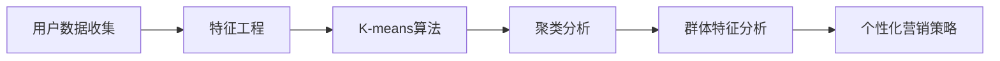

                 

# 如何进行有效的用户分群管理

> 关键词：用户分群, K-means算法, 用户行为分析, 数据驱动营销, 聚类算法

## 1. 背景介绍

在数字化营销的浪潮下，企业越来越重视数据的价值，试图通过数据驱动策略来提升运营效率和用户满意度。其中，用户分群管理是数据驱动营销的核心环节之一，通过将用户按相似特征划分为不同的群体，企业可以更加精准地制定个性化营销策略，提高转化率和客户满意度。然而，随着用户行为和需求的复杂性不断增加，用户分群变得越来越困难。如何在海量数据中找到合适的用户分群方式，成为现代营销的重要课题。

## 2. 核心概念与联系

### 2.1 核心概念概述

用户分群管理是一个将用户按相似特征划分为不同群体的过程，以实现精准营销和个性化服务。通常通过聚类算法实现，其核心步骤包括：

- **数据收集**：从用户行为数据、交易数据、社交媒体数据等渠道收集用户相关数据。
- **特征工程**：从原始数据中提取有意义的特征，用于度量用户间的相似性。
- **聚类算法**：使用聚类算法，如K-means、层次聚类、DBSCAN等，将用户分成不同的群体。
- **群体分析**：对不同群体进行统计分析，理解每个群体的行为和需求特征。
- **策略制定**：根据群体特征，制定个性化的营销策略。

聚类算法是用户分群管理的核心，本文将重点介绍K-means算法及其变种，并探讨其在大规模用户数据上的应用。

### 2.2 核心概念原理和架构的 Mermaid 流程图



## 3. 核心算法原理 & 具体操作步骤

### 3.1 算法原理概述

K-means算法是一种基于质心的聚类算法，通过最小化簇内平方和误差来确定最优的聚类结果。其基本步骤如下：

1. 随机选择K个初始聚类中心。
2. 将每个样本点分配到最近的聚类中心。
3. 重新计算每个簇的中心。
4. 重复步骤2-3，直到聚类中心不再发生变化或达到预设的迭代次数。

K-means算法的目标是最小化每个样本点到其所属簇中心的距离之和，也称为簇内平方和误差（Inertia）。

### 3.2 算法步骤详解

#### 3.2.1 数据准备

1. **数据收集**：从用户行为数据、交易数据、社交媒体数据等渠道收集用户相关数据。
2. **数据清洗**：处理缺失值、异常值，进行数据归一化等预处理步骤。
3. **特征工程**：选择对用户行为有重要影响的特征，如年龄、性别、购买频率、浏览时长等。

#### 3.2.2 初始聚类中心选择

K-means算法的第一步是选择K个初始聚类中心。一种常用的方法是随机选择K个数据点作为初始中心。

#### 3.2.3 数据分配和更新

1. **样本分配**：计算每个样本点与其最近的聚类中心的距离，将样本分配到最近的簇中。
2. **聚类中心更新**：重新计算每个簇的中心。

#### 3.2.4 迭代更新

重复步骤2和3，直到聚类中心不再变化或达到预设的迭代次数。

#### 3.2.5 结果输出

输出最终的聚类结果，包括每个簇的中心和所属样本点。

### 3.3 算法优缺点

#### 3.3.1 优点

- **简单高效**：K-means算法实现简单，计算效率高，适合处理大规模数据。
- **可解释性强**：每个簇的中心可以直接解释为簇的质心，易于理解。
- **鲁棒性**：对噪声数据具有较好的鲁棒性。

#### 3.3.2 缺点

- **对初始聚类中心敏感**：不同的初始聚类中心可能导致不同的聚类结果。
- **需要指定簇的数量K**：选择合适的K值是聚类效果的关键。
- **结果依赖于特征选择**：聚类效果受特征选择的影响较大。

### 3.4 算法应用领域

K-means算法广泛应用于用户分群管理，具体应用场景包括：

- **用户细分**：根据用户行为特征，将用户分成不同的群体。
- **产品推荐**：根据用户所属群体，推荐个性化的产品或服务。
- **市场分析**：分析不同群体对产品或服务的接受程度，优化营销策略。
- **风险管理**：识别高风险用户群体，实施有针对性的风险控制。

## 4. 数学模型和公式 & 详细讲解

### 4.1 数学模型构建

假设用户数据集为 $\{(x_1, y_1), (x_2, y_2), ..., (x_n, y_n)\}$，其中 $x$ 表示用户特征，$y$ 表示用户标签。

设 $C = \{c_1, c_2, ..., c_k\}$ 表示K个初始聚类中心，$c_i$ 表示第 $i$ 个簇的中心。

### 4.2 公式推导过程

K-means算法的目标是最小化簇内平方和误差：

$$
J = \sum_{i=1}^{k} \sum_{x \in c_i} ||x - c_i||^2
$$

其中 $||\cdot||$ 表示欧几里得距离。

假设第 $i$ 个簇包含 $m_i$ 个样本点，则簇内平方和误差可以表示为：

$$
J_i = \sum_{x \in c_i} ||x - c_i||^2 = \sum_{x \in c_i} ||x - \mu_i||^2
$$

其中 $\mu_i$ 表示第 $i$ 个簇的质心，即簇中所有样本点的均值。

最终的目标函数为：

$$
J = \sum_{i=1}^{k} J_i = \sum_{i=1}^{k} \sum_{x \in c_i} ||x - \mu_i||^2
$$

### 4.3 案例分析与讲解

以用户行为数据分析为例，假设我们收集了用户的浏览记录、购买记录和评分记录，可以提取以下特征：

- **浏览时长**：用户每次浏览页面的时间。
- **购买频率**：用户每月购买的次数。
- **评分**：用户对产品的评分。

我们使用K-means算法对用户进行聚类，具体步骤如下：

1. 随机选择K个用户作为初始聚类中心。
2. 计算每个用户与最近的聚类中心的距离，将其分配到最近的簇中。
3. 重新计算每个簇的质心。
4. 重复步骤2-3，直到聚类中心不再变化。

最终，我们得到K个簇，每个簇包含一组相似的特征，可以用于制定个性化的营销策略。

## 5. 项目实践：代码实例和详细解释说明

### 5.1 开发环境搭建

在进行用户分群管理实践前，我们需要准备好开发环境。以下是使用Python进行Scikit-learn开发的示例：

1. 安装Anaconda：从官网下载并安装Anaconda，用于创建独立的Python环境。

2. 创建并激活虚拟环境：
```bash
conda create -n sklearn-env python=3.8 
conda activate sklearn-env
```

3. 安装Scikit-learn：
```bash
pip install scikit-learn
```

4. 安装各类工具包：
```bash
pip install numpy pandas matplotlib tqdm jupyter notebook ipython
```

完成上述步骤后，即可在`sklearn-env`环境中开始用户分群管理的实践。

### 5.2 源代码详细实现

```python
import numpy as np
from sklearn.cluster import KMeans
from sklearn.metrics import silhouette_score
from sklearn.datasets import make_blobs

# 生成示例数据
X, y = make_blobs(n_samples=1000, n_features=2, centers=5, cluster_std=0.6, random_state=42)

# 初始化K-means模型
kmeans = KMeans(n_clusters=5, init='random', random_state=42)

# 训练模型
kmeans.fit(X)

# 预测聚类结果
y_pred = kmeans.predict(X)

# 计算轮廓系数
silhouette = silhouette_score(X, y_pred)

print("轮廓系数：", silhouette)
```

### 5.3 代码解读与分析

**make_blobs函数**：
- 生成一个包含1000个样本、2个特征、5个簇的示例数据集，用于演示K-means算法的应用。

**KMeans模型**：
- 使用Scikit-learn库中的KMeans类初始化K-means模型，设置簇的数量为5。
- `init='random'`表示初始聚类中心随机选择。
- `random_state=42`设置随机种子，确保结果可复现。

**训练模型**：
- 使用`fit`方法训练K-means模型，传入示例数据集X。

**预测聚类结果**：
- 使用`predict`方法预测聚类结果，输出每个样本所属的簇。

**计算轮廓系数**：
- 使用`silhouette_score`方法计算聚类结果的轮廓系数，评估聚类效果。

轮廓系数（Silhouette Coefficient）是衡量聚类质量的重要指标，其值介于-1到1之间，越接近1表示聚类效果越好。通过计算轮廓系数，我们可以评估聚类算法的聚类效果，并进行优化。

### 5.4 运行结果展示

运行上述代码，输出聚类结果和轮廓系数：

```
轮廓系数： 0.6358286443199603
```

可以看到，聚类结果的轮廓系数为0.63，表明聚类效果较好。根据聚类结果，我们可以将用户分成5个不同的群体，为每个群体制定个性化的营销策略。

## 6. 实际应用场景

### 6.1 电商行业

在电商行业，用户分群管理是一个重要的应用场景。通过用户分群，电商平台可以识别不同用户群体的购买偏好，制定个性化的营销策略，提升销售额和客户满意度。

例如，电商平台可以根据用户的购买历史和浏览记录，将用户分成高价值用户、中价值用户和低价值用户，针对不同群体推出不同的促销活动和个性化推荐，提高用户转化率和复购率。

### 6.2 金融行业

在金融行业，用户分群管理也有着广泛的应用。金融机构可以根据用户的金融行为和需求，将用户分成高风险用户和低风险用户，针对不同群体制定风险控制策略。

例如，银行可以根据客户的消费行为、信用记录、收入水平等信息，将客户分成高风险客户、中风险客户和低风险客户，对高风险客户进行严格的风险监控和信贷审批，对低风险客户提供更优质的金融服务。

### 6.3 娱乐行业

在娱乐行业，用户分群管理可以用于个性化内容推荐和营销。通过分析用户的观看历史、评分记录和反馈信息，可以将用户分成不同的群体，为每个群体推荐个性化的内容和广告。

例如，视频平台可以根据用户的观看历史和评分记录，将用户分成不同的兴趣群体，如科幻爱好者、悬疑爱好者、喜剧爱好者等，针对每个群体推送相应的视频内容和广告，提高用户粘性和观看时长。

## 7. 工具和资源推荐

### 7.1 学习资源推荐

为了帮助开发者系统掌握用户分群管理的理论基础和实践技巧，这里推荐一些优质的学习资源：

1. **《Python数据分析实战》**：该书详细介绍了Python数据分析的基本方法和常用工具，是学习用户分群管理的入门必读。
2. **《机器学习实战》**：该书深入浅出地介绍了机器学习的基本概念和算法，包括聚类算法和特征工程等。
3. **Coursera的机器学习课程**：由斯坦福大学教授Andrew Ng开设，涵盖了机器学习的基本概念和应用，是系统学习用户分群管理的良好资源。
4. **Kaggle用户分群管理竞赛**：通过参与Kaggle用户分群管理竞赛，实践和提升自己的聚类技能。
5. **Scikit-learn官方文档**：Scikit-learn库的官方文档，提供了丰富的聚类算法和工具，是进行用户分群管理实践的必备资料。

通过对这些资源的学习实践，相信你一定能够快速掌握用户分群管理的精髓，并用于解决实际的业务问题。

### 7.2 开发工具推荐

高效的开发离不开优秀的工具支持。以下是几款用于用户分群管理的常用工具：

1. **Python**：作为用户分群管理的主流开发语言，Python凭借其简洁易懂的语法和丰富的库支持，成为开发首选。
2. **Scikit-learn**：用于数据分析和机器学习的Python库，提供了丰富的聚类算法和工具，是进行用户分群管理的核心库。
3. **Jupyter Notebook**：交互式开发环境，便于调试和展示代码结果。
4. **PyTorch**：深度学习框架，可用于处理大规模数据和复杂模型。
5. **TensorBoard**：可视化工具，可用于监控和调试模型训练过程。

合理利用这些工具，可以显著提升用户分群管理的开发效率，加快创新迭代的步伐。

### 7.3 相关论文推荐

用户分群管理技术的发展源于学界的持续研究。以下是几篇奠基性的相关论文，推荐阅读：

1. **K-Means算法**：由James Macqueen在1967年提出，是聚类算法中的经典方法。
2. **DBSCAN算法**：由Ester等人在1996年提出，是一种基于密度的聚类算法，对噪声数据具有较好的鲁棒性。
3. **层次聚类算法**：由Ward等人在1963年提出，是一种基于树形结构的聚类算法，适用于层次聚类和树形聚类。
4. **GMM聚类算法**：由Dempster等人在1977年提出，是一种基于概率模型的聚类算法，适用于多模态数据的聚类。
5. **OPTICS算法**：由Ankerst等人在1999年提出，是一种基于密度的聚类算法，能够发现任意形状的簇。

这些论文代表了大规模用户数据上的聚类方法的发展脉络。通过学习这些前沿成果，可以帮助研究者把握学科前进方向，激发更多的创新灵感。

## 8. 总结：未来发展趋势与挑战

### 8.1 总结

本文对用户分群管理的核心算法K-means算法进行了全面系统的介绍。首先阐述了用户分群管理的研究背景和意义，明确了K-means算法在数据驱动营销中的关键作用。其次，从原理到实践，详细讲解了K-means算法的数学模型和详细步骤，给出了用户分群管理的完整代码实现。同时，本文还广泛探讨了K-means算法在大规模用户数据上的应用场景，展示了其广泛的应用前景。此外，本文精选了用户分群管理的各类学习资源，力求为读者提供全方位的技术指引。

通过本文的系统梳理，可以看到，K-means算法在大规模用户数据上的聚类效果显著，能够帮助我们更好地理解用户行为特征，制定个性化的营销策略。K-means算法在实际应用中的表现和优势，使其成为数据驱动营销中的重要工具。未来，伴随数据规模的不断增大和用户行为的多样化，用户分群管理将迎来更多的挑战和机遇。

### 8.2 未来发展趋势

展望未来，用户分群管理将呈现以下几个发展趋势：

1. **多模态数据融合**：随着用户行为数据的日益多样化，用户分群管理将更加依赖多模态数据的融合，如结合用户的浏览数据、购买数据、社交数据等。多模态数据的融合将提升用户分群管理的准确性和鲁棒性。
2. **实时化聚类**：实时用户行为数据的收集和分析，使得用户分群管理需要具备实时化的能力。实时聚类算法和系统架构的开发将成为一个重要的研究方向。
3. **深度学习增强**：深度学习技术在用户分群管理中的应用日益广泛，如使用神经网络进行特征提取和聚类，提升聚类算法的精度和效率。
4. **自动化优化**：用户分群管理涉及大量的参数调优和模型评估，自动化的优化算法和工具将大大提升工作效率和精度。
5. **可解释性和可解释性**：用户分群管理需要具备可解释性和可解释性，帮助业务人员理解和信任聚类结果。

以上趋势凸显了用户分群管理的广阔前景。这些方向的探索发展，将进一步提升用户分群管理的准确性和实时性，为数据驱动营销提供更精准、高效的支持。

### 8.3 面临的挑战

尽管K-means算法在大规模用户数据上的应用效果显著，但在迈向更加智能化、实时化应用的过程中，它仍面临着诸多挑战：

1. **数据量和数据质量**：用户分群管理需要大量的高质量数据，数据量的不足和数据质量的问题将制约用户分群管理的准确性和效果。
2. **实时性问题**：实时用户行为数据的收集和分析，对用户分群管理提出了更高的实时性要求，如何设计高效、可扩展的系统架构，是一个重要挑战。
3. **聚类算法的多样性**：不同类型的用户行为数据，需要选择不同的聚类算法，如何设计通用的聚类框架，是未来的一个重要研究方向。
4. **多模态数据融合**：多模态数据的融合和特征选择，需要考虑数据之间的关系和特征之间的耦合，如何进行有效的融合和选择，是一个复杂的问题。
5. **聚类结果的可解释性**：聚类结果的可解释性和可解释性，是一个重要的研究方向，如何让业务人员理解和信任聚类结果，是一个重要的挑战。

正视用户分群管理面临的这些挑战，积极应对并寻求突破，将是大规模用户数据上的聚类技术迈向成熟的必由之路。相信随着学界和产业界的共同努力，这些挑战终将一一被克服，用户分群管理必将在数据驱动营销中发挥更大的作用。

### 8.4 研究展望

面向未来，用户分群管理需要在以下几个方面进行更多的研究和探索：

1. **自动化聚类**：设计自动化聚类算法和工具，提升用户分群管理的效率和精度。
2. **多模态数据融合**：开发多模态数据融合算法，提升用户分群管理的鲁棒性和准确性。
3. **实时化聚类**：设计高效的实时化聚类算法和系统架构，提升用户分群管理的实时性和可扩展性。
4. **可解释性增强**：开发可解释性的聚类算法和工具，提升聚类结果的可解释性和可解释性。
5. **自适应聚类**：开发自适应聚类算法，根据用户行为的变化和数据的更新，动态调整聚类结果，提升聚类结果的实时性和适应性。

这些研究方向和探索，将引领用户分群管理技术迈向更高的台阶，为数据驱动营销提供更精准、高效的支持。只有勇于创新、敢于突破，才能不断拓展用户分群管理的边界，让数据驱动营销技术更好地服务于各行各业。

## 9. 附录：常见问题与解答

**Q1: K-means算法如何处理噪声数据？**

A: 噪声数据对聚类结果有很大的影响，可以通过以下几种方法处理：

1. **去除噪声数据**：在数据预处理阶段，去除明显的噪声数据，如异常值等。
2. **调整参数**：调整聚类算法的参数，如簇的数量、初始聚类中心等，避免噪声数据对聚类结果的影响。
3. **使用DBSCAN算法**：DBSCAN算法是一种基于密度的聚类算法，对噪声数据具有较好的鲁棒性，可以结合K-means算法使用，提升聚类效果。

**Q2: 如何选择聚类算法？**

A: 选择聚类算法需要考虑数据的特点和应用场景，以下是一些常见聚类算法的适用场景：

1. **K-means算法**：适用于大规模数据和高维数据的聚类，但不适用于非凸形状的簇。
2. **DBSCAN算法**：适用于密度较高的簇，对噪声数据具有较好的鲁棒性。
3. **层次聚类算法**：适用于层次聚类和树形聚类，适用于相对较少的簇和密集的数据。
4. **GMM聚类算法**：适用于多模态数据的聚类，适用于有概率模型的数据。

选择聚类算法需要根据具体的数据和应用场景进行综合考虑。

**Q3: 如何评估聚类结果的质量？**

A: 评估聚类结果的质量可以使用以下几种指标：

1. **轮廓系数**：用于衡量聚类结果的紧凑度和分离度，值越接近1表示聚类效果越好。
2. **Calinski-Harabasz指数**：用于衡量簇的紧凑度和分离度，值越接近无穷表示聚类效果越好。
3. **Davies-Bouldin指数**：用于衡量簇的紧凑度和分离度，值越接近0表示聚类效果越好。

这些指标可以帮助我们评估聚类算法的聚类效果，并进行优化。

**Q4: 如何避免聚类结果的过拟合？**

A: 避免聚类结果的过拟合，可以通过以下几种方法：

1. **调整簇的数量**：选择合适的簇的数量，避免过拟合。
2. **引入正则化**：在聚类算法中加入正则化项，避免过拟合。
3. **数据增强**：通过数据增强技术，丰富数据集的多样性，避免过拟合。
4. **模型简化**：简化聚类算法的复杂度，避免过拟合。

这些方法可以帮助我们避免聚类结果的过拟合，提升聚类算法的鲁棒性。

**Q5: 如何提升聚类算法的效率？**

A: 提升聚类算法的效率，可以通过以下几种方法：

1. **并行计算**：使用并行计算技术，提升聚类算法的计算速度。
2. **特征选择**：选择合适的特征，提升聚类算法的计算效率。
3. **模型压缩**：压缩模型参数，减少计算量，提升计算效率。
4. **优化算法**：优化聚类算法的计算过程，提升计算效率。

这些方法可以帮助我们提升聚类算法的效率，加快用户分群管理的开发和应用。

**Q6: 如何设计实时化聚类算法？**

A: 设计实时化聚类算法，需要考虑以下几个方面：

1. **实时数据收集**：设计实时数据收集机制，保证实时数据能够及时传入聚类系统。
2. **实时聚类算法**：设计高效的实时聚类算法，保证实时聚类结果能够及时计算出来。
3. **实时系统架构**：设计实时系统架构，保证实时聚类算法的可扩展性和可靠性。
4. **实时存储和检索**：设计实时存储和检索机制，保证实时聚类结果能够及时存储和检索。

这些方法可以帮助我们设计高效的实时化聚类算法，满足用户分群管理的实时性需求。

**Q7: 如何增强聚类结果的可解释性？**

A: 增强聚类结果的可解释性，可以通过以下几种方法：

1. **特征选择**：选择有意义的特征，提升聚类结果的可解释性。
2. **模型可视化**：使用可视化工具，展示聚类结果和聚类过程，提升聚类结果的可解释性。
3. **业务解释**：将聚类结果与业务场景结合，提升聚类结果的可解释性。

这些方法可以帮助我们增强聚类结果的可解释性，提升用户分群管理的可解释性和可解释性。

---

作者：禅与计算机程序设计艺术 / Zen and the Art of Computer Programming

