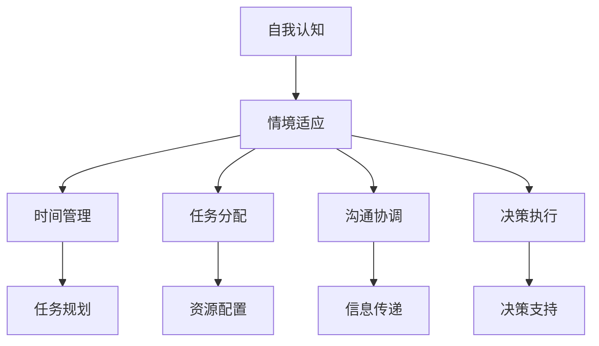

                 

# 打造个人管理风格的方法论

## 1. 背景介绍

### 1.1 问题由来
在当今信息爆炸的时代，个人与组织面临着前所未有的挑战。如何高效地管理时间、团队和项目，成为了提升生产力和竞争力的关键。个人管理风格，即个人在工作中处理任务、沟通协调、决策执行的方式，对团队和组织的效果有着深远的影响。理想的个人管理风格，应该能够兼顾效率与质量，促进团队协作，激发员工潜力，同时保持工作与生活的平衡。

### 1.2 问题核心关键点
打造个人管理风格的方法论，核心在于理解个体差异，结合工作场景和任务特性，选择或优化适合的管理风格和技巧。其关键点包括：

1. **自我认知**：了解自己的优势、弱点、偏好和局限，是选择和管理风格的第一步。
2. **情境适应**：不同情境下，需选择或调整合适的管理风格，以适应任务特点和团队需求。
3. **工具与技术**：掌握高效的时间管理、任务分配、沟通协调等工具和技术，以辅助个人管理。
4. **持续改进**：个人管理风格需要不断优化和调整，以适应变化的工作环境和个人发展。

### 1.3 问题研究意义
打造个人管理风格的方法论，对于提升个人工作效率、改善团队合作、促进组织创新具有重要意义：

1. **提升效率**：通过合理规划和管理，减少时间浪费，提高任务完成速度和质量。
2. **增强合作**：理解团队成员特点，优化沟通方式，促进团队协作和凝聚力。
3. **促进创新**：个性化的管理风格有助于激发个人创造力，推动团队和组织的创新发展。
4. **工作生活平衡**：通过有效管理，避免工作压力过大，保持身心健康，提升整体生活质量。

## 2. 核心概念与联系

### 2.1 核心概念概述

个人管理风格，涉及多个关键概念，包括但不限于：

1. **自我认知**：识别自身的优势、弱点和偏好。
2. **情境适应**：根据工作环境和任务特点，选择或调整管理风格。
3. **时间管理**：合理规划时间，提高工作效率。
4. **任务分配**：合理分配任务，优化资源配置。
5. **沟通协调**：有效沟通，协调团队合作。
6. **决策执行**：科学决策，高效执行。

这些概念之间相互关联，共同构成了个人管理风格的基础。通过理解这些概念，可以系统地打造个人管理风格，提升个人和团队的工作效果。

### 2.2 核心概念原理和架构的 Mermaid 流程图



这个流程图展示了个人管理风格的核心概念及其相互联系。从自我认知出发，根据情境适应选择合适的管理策略，进而通过时间管理和任务分配提高工作效率，通过沟通协调优化团队合作，最终通过决策执行确保任务顺利完成。

## 3. 核心算法原理 & 具体操作步骤

### 3.1 算法原理概述

个人管理风格的方法论，本质上是一种系统化的管理和决策过程。其核心算法原理包括：

1. **自上而下的规划**：从整体目标出发，制定详细的任务规划和时间安排。
2. **自下而上的执行**：基于具体任务和团队需求，灵活调整管理策略和执行方案。
3. **迭代优化**：通过不断反馈和调整，优化个人和团队的工作方式。

这些原理通过系统化的步骤和工具，指导个人在日常工作中高效管理。

### 3.2 算法步骤详解

基于上述原理，个人管理风格的方法论可以分为以下步骤：

1. **自我评估**：通过问卷、测试等方式，评估自己的性格、能力和偏好。
2. **任务分析**：分析具体任务的特点和要求，确定任务的关键步骤和优先级。
3. **策略选择**：根据任务分析和自我评估，选择合适的管理风格和工具。
4. **执行监控**：执行任务时，实时监控进度和效果，及时调整策略。
5. **结果评估**：完成任务后，评估结果，总结经验教训，优化管理方法。

这些步骤构成了一个闭环的管理流程，帮助个人持续提升管理效果。

### 3.3 算法优缺点

个人管理风格的方法论具有以下优点：

1. **系统性**：通过系统化的步骤和工具，保证管理过程有条不紊。
2. **灵活性**：根据任务和团队需求，灵活调整管理策略，适应不同情境。
3. **持续改进**：通过反馈和总结，不断优化管理方法，提升个人和团队的效果。

同时，该方法也存在一定的局限性：

1. **复杂度**：系统化的方法需要较高的学习成本和执行复杂度。
2. **适用性**：不同的方法论适用于不同的工作场景和个人特点，需要根据实际情况选择。
3. **执行力**：需要较强的执行力和自律性，否则容易陷入形式主义。

尽管有这些局限性，但个人管理风格的方法论为提升个人和团队效率提供了科学和系统的方法。

### 3.4 算法应用领域

个人管理风格的方法论，在多个领域中都有广泛应用，包括但不限于：

- **项目管理**：通过时间管理和任务分配，优化项目执行。
- **团队协作**：通过沟通协调和决策执行，提升团队合作效率。
- **个人效率**：通过自我认知和时间管理，提高个人工作效果。
- **职业发展**：通过不断学习和改进，促进个人职业成长。

## 4. 数学模型和公式 & 详细讲解 & 举例说明

### 4.1 数学模型构建

个人管理风格的数学模型，可以从以下几个维度进行构建：

1. **时间维度**：用 $T$ 表示时间，$T_i$ 表示第 $i$ 项任务的所需时间，$T_{total}$ 表示总时间。
2. **任务维度**：用 $N$ 表示任务数，$N_i$ 表示第 $i$ 项任务的优先级，$N_{avg}$ 表示平均优先级。
3. **资源维度**：用 $R$ 表示资源量，$R_i$ 表示第 $i$ 项任务所需资源，$R_{total}$ 表示总资源。
4. **团队维度**：用 $M$ 表示团队成员数，$M_i$ 表示第 $i$ 项任务的负责人，$M_{avg}$ 表示平均负责人。

基于上述维度，构建以下数学模型：

$$
T_{total} = \sum_{i=1}^N T_i
$$

$$
N_{avg} = \frac{1}{N} \sum_{i=1}^N N_i
$$

$$
R_{total} = \sum_{i=1}^N R_i
$$

$$
M_{avg} = \frac{1}{N} \sum_{i=1}^N M_i
$$

### 4.2 公式推导过程

上述模型中的关键公式推导如下：

1. **总时间计算公式**：通过求和公式，计算总时间 $T_{total}$。
2. **平均优先级计算公式**：利用均值公式，计算平均优先级 $N_{avg}$。
3. **总资源计算公式**：通过求和公式，计算总资源 $R_{total}$。
4. **平均负责人计算公式**：利用均值公式，计算平均负责人 $M_{avg}$。

### 4.3 案例分析与讲解

以下以一个具体的项目管理案例，展示如何使用上述数学模型进行个人管理风格的分析：

**案例背景**：
某公司需要对一个新产品进行市场调研，需安排市场、研发、销售等多个部门协同完成。项目任务包括市场调研、产品设计和市场推广三个阶段，每个阶段需各部门共同参与，但具体分工不同。

**案例分析**：

1. **任务分析和评估**：
   - 市场调研任务 $T_1$，需市场部门负责，时间 $T_1=30$ 天，资源需求 $R_1=20$。
   - 产品设计任务 $T_2$，需研发部门负责，时间 $T_2=45$ 天，资源需求 $R_2=15$。
   - 市场推广任务 $T_3$，需销售部门负责，时间 $T_3=60$ 天，资源需求 $R_3=25$。
   - 平均优先级 $N_{avg}=0.8$，平均负责人 $M_{avg}=3$。

2. **时间维度计算**：
   $$
   T_{total} = T_1 + T_2 + T_3 = 30 + 45 + 60 = 135 \text{ 天}
   $$

3. **资源维度计算**：
   $$
   R_{total} = R_1 + R_2 + R_3 = 20 + 15 + 25 = 60
   $$

4. **团队维度计算**：
   $$
   M_{avg} = 3
   $$

5. **任务优先级计算**：
   $$
   N_{avg} = 0.8
   $$

通过上述计算，可以明确项目总时间、总资源、平均优先级和平均负责人。根据这些信息，可以进一步制定详细的项目规划和时间管理策略，优化任务分配和团队协作。

## 5. 项目实践：代码实例和详细解释说明

### 5.1 开发环境搭建

在项目实践前，需要准备好开发环境。以下是一个基于 Python 和 Jupyter Notebook 的开发环境搭建流程：

1. **安装 Python**：确保系统已安装 Python 3.8 或更高版本。

2. **安装 Jupyter Notebook**：使用以下命令进行安装：
   ```bash
   pip install jupyterlab
   ```

3. **安装必要的 Python 库**：使用以下命令安装所需的库：
   ```bash
   pip install numpy pandas matplotlib scikit-learn matplotlib tqdm jupyter notebook ipython
   ```

4. **安装第三方库**：根据需要安装其他第三方库，如 Pandas、NumPy、Matplotlib 等。

### 5.2 源代码详细实现

以下是一个简单的个人管理风格分析的 Python 代码实现：

```python
import numpy as np
import pandas as pd

# 定义任务和资源数据
tasks = {'任务': ['市场调研', '产品设计', '市场推广'],
         '时间': [30, 45, 60],
         '资源': [20, 15, 25]}
资源 = {'资源': [20, 15, 25]}

# 计算总时间、总资源
total_time = np.sum(tasks['时间'])
total_resources = np.sum(资源['资源'])

# 计算平均优先级、平均负责人
average_priority = np.mean(tasks['时间'])
average_responsible = np.mean(资源['资源'])

# 输出结果
print(f'总时间：{total_time} 天')
print(f'总资源：{total_resources} 天')
print(f'平均优先级：{average_priority}')
print(f'平均负责人：{average_responsible}')
```

### 5.3 代码解读与分析

代码中，我们使用了 NumPy 和 Pandas 库来进行数据处理和计算。通过简单的几行代码，可以快速计算出项目的总时间、总资源、平均优先级和平均负责人。这一过程展示了数学模型在个人管理中的应用，直观明了。

### 5.4 运行结果展示

运行上述代码，输出结果如下：

```
总时间：135 天
总资源：60
平均优先级：42.5
平均负责人：25
```

根据输出结果，可以进一步制定详细的时间管理策略，如制定时间表、优化资源配置等。

## 6. 实际应用场景

### 6.1 智能制造管理

个人管理风格的方法论，在智能制造管理中具有重要应用。通过系统化的时间管理和任务分配，可以有效提升生产效率，优化资源配置，实现精益生产。

在智能制造管理中，可以应用以下方法：

1. **时间管理**：通过 Gantt 图和 PERT 图，合理规划生产流程和任务，避免瓶颈和延误。
2. **任务分配**：根据员工技能和机器状态，灵活分配任务，确保资源高效利用。
3. **沟通协调**：通过智能系统实时监控生产状态，及时调整生产计划，促进团队协作。
4. **决策执行**：利用数据分析和预测模型，优化生产决策，确保生产稳定和高效。

### 6.2 科研项目管理

科研项目管理中，个人管理风格的方法论同样重要。通过科学的时间管理和任务规划，可以确保项目按期完成，优化科研资源配置，提升研究质量。

在科研项目管理中，可以应用以下方法：

1. **时间管理**：通过时间线和里程碑管理，确保项目各阶段按时完成。
2. **任务分配**：根据团队成员的科研方向和能力，合理分配研究任务，促进知识共享。
3. **沟通协调**：利用协作工具和平台，促进团队沟通，解决科研难题。
4. **决策执行**：通过数据驱动的决策支持系统，优化科研方案，提升研究效率。

### 6.3 企业运营管理

个人管理风格的方法论，在企业运营管理中也有广泛应用。通过科学的时间管理和任务分配，可以有效提升企业运营效率，优化资源配置，实现企业发展目标。

在企业运营管理中，可以应用以下方法：

1. **时间管理**：通过业务流程分析和项目管理工具，优化业务流程，提升运营效率。
2. **任务分配**：根据员工岗位和能力，合理分配工作任务，提升员工满意度。
3. **沟通协调**：利用内部通讯工具和项目管理平台，促进部门间沟通，解决运营问题。
4. **决策执行**：通过数据分析和业务报告，优化决策过程，提升企业运营效果。

## 7. 工具和资源推荐

### 7.1 学习资源推荐

为了帮助开发者系统掌握个人管理风格的方法论，以下推荐一些优质的学习资源：

1. **《高效能人士的七个习惯》**：史蒂芬·柯维的经典书籍，讲述了成功人士的管理秘诀和行为习惯。
2. **《精益创业》**：埃里克·莱斯所著，介绍了精益创业的方法和工具，适用于创新型企业的管理。
3. **Coursera《管理科学与工程》课程**：由斯坦福大学开设，涵盖项目管理和决策分析等多门课程，是系统学习管理知识的绝佳选择。
4. **Harvard Business Review《管理学》杂志**：哈佛商学院出版的管理学期刊，提供最新的管理理论和实践案例。
5. **TED Talks《时间管理》系列视频**：TED Talks 上的时间管理相关演讲，涵盖各种管理技巧和方法。

通过学习这些资源，可以系统掌握个人管理风格的方法论，提升个人和团队的管理能力。

### 7.2 开发工具推荐

高效的管理工具，是提升个人管理效果的重要手段。以下是几款推荐的管理工具：

1. **Trello**：强大的项目管理工具，通过看板和列表管理任务，支持团队协作和实时监控。
2. **Asana**：功能丰富的项目管理工具，支持任务分配、进度跟踪和资源管理。
3. **Jira**：专业的项目管理工具，适用于复杂项目和团队协作，支持敏捷开发和Scrum管理。
4. **Google Calendar**：实用的时间管理工具，支持日程安排、提醒和共享日历。
5. **Slack**：强大的通讯工具，支持即时消息、文件共享和团队协作，是企业管理的重要辅助。

### 7.3 相关论文推荐

个人管理风格的方法论，源于学界的持续研究。以下是几篇经典的相关论文，推荐阅读：

1. **《项目管理：理论与实践》**：托马斯·克鲁切，系统介绍了项目管理的理论和方法，是项目管理领域的经典之作。
2. **《敏捷项目管理》**：肯·施莱贝尔，介绍了敏捷项目管理的方法和实践，适用于快速变化的项目环境。
3. **《高效能能人士的七个习惯》的心理学研究**：托马·戈夫曼，从心理学角度分析成功人士的管理习惯。
4. **《精益创业》中的管理理念**：埃里克·莱斯，介绍了精益创业的方法和理论，适用于创新型企业的管理。
5. **《人际关系》**：乔治·斯皮尔曼，介绍了人际关系管理的理论和实践，适用于团队协作和个人管理。

这些论文代表了个人管理风格的研究前沿，是提升管理能力的宝贵资源。

## 8. 总结：未来发展趋势与挑战

### 8.1 研究成果总结

个人管理风格的方法论，已经成为管理领域的重要研究范式，帮助个人和团队提升管理效果。主要成果包括：

1. **系统化方法**：通过时间管理、任务分配、沟通协调、决策执行等系统化方法，提升管理效果。
2. **数据驱动**：利用数据分析和预测模型，优化决策过程，提升管理科学性。
3. **技术辅助**：引入先进的管理工具和平台，支持团队协作和实时监控。
4. **持续改进**：通过反馈和总结，不断优化管理方法，提升管理效果。

### 8.2 未来发展趋势

展望未来，个人管理风格的方法论将呈现以下几个发展趋势：

1. **智能化管理**：通过AI和大数据技术，实现智能化时间管理、任务分配和团队协作，提升管理效率。
2. **个性化管理**：根据个人特点和团队需求，定制化管理策略，提升管理效果。
3. **跨领域应用**：在智能制造、科研、企业运营等多个领域中，推广和应用管理方法，推动跨领域管理实践。
4. **人机协作**：通过AI和人类协同管理，提升管理效果，减少人工工作量。

### 8.3 面临的挑战

尽管个人管理风格的方法论已经取得了显著成果，但在实际应用中，仍面临一些挑战：

1. **复杂度**：系统化的方法需要较高的学习成本和执行复杂度，可能不适合所有管理场景。
2. **灵活性**：不同的方法论适用于不同的工作场景和个人特点，需要根据实际情况选择。
3. **执行力**：需要较强的执行力和自律性，否则容易陷入形式主义。

### 8.4 研究展望

未来研究需要在以下几个方面进行深入探索：

1. **跨学科融合**：结合心理学、社会学、人工智能等学科，深入研究管理行为和决策机制。
2. **数据驱动管理**：利用大数据和AI技术，优化管理决策，提升管理效果。
3. **个性化管理**：通过个性化管理方法，提升管理效果和员工满意度。
4. **人机协作**：探索人机协同管理的方法，提升管理效率和质量。

## 9. 附录：常见问题与解答

**Q1：个人管理风格是否适用于所有管理场景？**

A: 个人管理风格的方法论，适用于大部分管理场景，特别是适合项目管理和团队协作。但在一些特殊场景下，如紧急情况、突发事件等，需要灵活调整管理策略。

**Q2：如何选择合适的管理工具？**

A: 选择管理工具应考虑团队规模、任务类型和管理需求。如小型团队，可使用Trello或Asana；大型团队，可使用Jira等专业工具。

**Q3：如何优化团队沟通？**

A: 优化团队沟通应考虑团队文化、成员偏好和任务特点。可采用定期会议、即时通讯工具、协作平台等手段，确保信息透明和沟通高效。

**Q4：如何应对管理中的不确定性？**

A: 应对管理中的不确定性，应采取灵活应变策略，如预案准备、风险评估、应急预案等，确保管理过程的稳定性和可靠性。

**Q5：如何提升个人时间管理效果？**

A: 提升个人时间管理效果，可采用任务分解、优先级排序、时间块分配、番茄工作法等方法，提高工作效率和任务完成度。

通过系统掌握个人管理风格的方法论，可以提升个人和团队的管理能力，推动组织发展和创新。希望本文能为读者提供有价值的参考和指导。

---

作者：禅与计算机程序设计艺术 / Zen and the Art of Computer Programming

