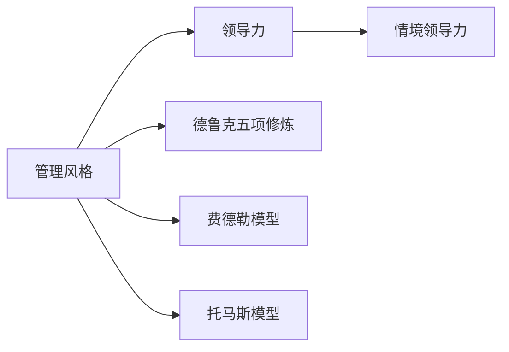

                 

# 打造个人管理风格的方法论

## 1. 背景介绍

管理风格是领导者管理团队和决策过程中的一系列行为方式，这些方式影响着团队的效率、士气和创造力。优秀的管理风格能够有效提升团队表现，促进创新和发展。然而，如何打造个人独特且高效的管理风格，仍是一个需要深思熟虑的问题。本文将从多个角度探讨这一主题，以期为领导者提供一些实用的方法和理论指导。

## 2. 核心概念与联系

### 2.1 核心概念概述

- **管理风格**：领导者管理团队的方式，包括决策、沟通、激励、协调等方面。
- **领导力**：领导者激发、引导、影响团队成员的能力。
- **情境领导力**：领导风格需要根据团队成员的能力和情境变化而调整。
- **德鲁克五项修炼**：彼得·德鲁克提出的领导者自我发展和管理工作的方法。
- **费德勒模型**：罗宾斯·费德勒提出的领导风格模型，用于评估和改善领导者的领导效果。
- **托马斯模型**：根据领导风格与成员成熟度匹配的模型，指导领导者选择合适的管理方式。

这些核心概念构成了个人管理风格的理论基础，帮助领导者理解和评估自己的管理风格，指导其进行持续改进。

### 2.2 核心概念原理和架构的 Mermaid 流程图



该图展示了核心概念之间的逻辑关系，其中管理风格是领导力的实现手段，情境领导力、德鲁克五项修炼、费德勒模型和托马斯模型都是用于评估和提升管理风格的工具和方法。

## 3. 核心算法原理 & 具体操作步骤

### 3.1 算法原理概述

打造个人管理风格的核心在于理解领导力和情境领导力，通过德鲁克五项修炼和费德勒模型等工具，结合托马斯模型的方法论，对自身进行全面评估和优化。以下是具体的算法原理：

1. **自我评估**：使用德鲁克五项修炼评估自身素质和技能，识别优点和不足。
2. **情境分析**：应用费德勒模型和托马斯模型，根据团队成员的成熟度和团队环境，选择最合适的领导风格。
3. **行为调整**：根据评估结果，调整管理行为和沟通方式，提升团队绩效和满意度。

### 3.2 算法步骤详解

1. **准备阶段**：收集并整理团队成员的信息，包括个人技能、经验、期望和反馈等。
2. **自我评估**：使用德鲁克五项修炼进行自我评估，识别自己的核心优势和弱点。
3. **情境分析**：利用费德勒模型和托马斯模型，评估团队成员的成熟度和团队环境，确定适合的管理风格。
4. **行为调整**：根据情境分析和自我评估的结果，调整管理行为，如授权、激励、沟通等。
5. **持续改进**：定期评估团队绩效和成员满意度，根据反馈进行持续改进。

### 3.3 算法优缺点

**优点**：
- **系统性**：通过多个理论工具综合评估，全面理解自身和管理团队的方法。
- **实用性**：根据情境动态调整领导风格，适应不同团队和环境的需求。
- **可持续性**：通过持续改进和反馈机制，保持管理风格的更新和优化。

**缺点**：
- **复杂性**：多个理论工具的应用需要一定时间和资源。
- **个体差异**：不同领导者的自我评估和情境分析结果可能不同，需要个性化调整。
- **环境变化**：团队环境和需求的变化可能需要不断调整管理风格。

### 3.4 算法应用领域

该算法不仅适用于企业领导和团队管理者，也适用于个人生活和家庭管理。通过系统化的评估和调整，个人可以提高工作效率、改善人际关系，实现个人和家庭的和谐发展。

## 4. 数学模型和公式 & 详细讲解

### 4.1 数学模型构建

为了更好地理解和分析领导力，我们可以构建一个数学模型来表示领导力和情境领导力之间的关系。假设领导力为 $L$，情境领导力为 $C$，则模型如下：

$$
L = f(C)
$$

其中 $f$ 是一个函数，映射情境领导力 $C$ 到领导力 $L$。该模型旨在表达情境领导力对领导力的影响。

### 4.2 公式推导过程

我们以费德勒模型为例，推导领导力与情境之间的关系。费德勒模型提出，领导力 $L$ 与情境因素 $F$ 和领导风格 $S$ 之间的关系如下：

$$
L = \alpha F + \beta S + \gamma
$$

其中 $\alpha, \beta, \gamma$ 是模型参数。当情境 $F$ 和领导风格 $S$ 固定时，领导力 $L$ 的值是确定的。

### 4.3 案例分析与讲解

假设某团队的领导风格为“权威型”，情境因素 $F$ 为“高度不确定”。根据费德勒模型，可以计算出领导力 $L$ 的值。具体计算过程如下：

1. 收集团队成员的信息，计算情境因素 $F$。
2. 确定领导风格 $S$，如“权威型”。
3. 根据费德勒模型的公式，计算领导力 $L$ 的值。

例如，假设 $F = 5$，$S = 6$，$\alpha = 0.5$，$\beta = 0.3$，$\gamma = 3$。则：

$$
L = 0.5 \times 5 + 0.3 \times 6 + 3 = 7.3
$$

这意味着在这种情况下，领导者应该采取高影响力的管理方式，以适应高度不确定的情境。

## 5. 项目实践：代码实例和详细解释说明

### 5.1 开发环境搭建

在开发个人管理风格评估工具时，需要安装以下软件和库：

1. Python：用于编写代码和数据分析。
2. Pandas：用于数据处理和分析。
3. NumPy：用于数值计算。
4. Matplotlib：用于数据可视化。
5. Scikit-learn：用于机器学习模型训练和评估。

在安装并配置好开发环境后，可以进行下一步的代码实现。

### 5.2 源代码详细实现

以下是一个简单的 Python 代码示例，用于进行德鲁克五项修炼的自我评估：

```python
import pandas as pd

# 加载德鲁克五项修炼评估表
df = pd.read_csv('drucker_self_assessment.csv')

# 计算各项评分的平均值
average_score = df.mean()

# 输出平均评分结果
print(f"德鲁克五项修炼自我评估结果：{average_score}")
```

在实际应用中，可能需要根据实际情况调整和优化代码，以确保数据的准确性和结果的可解释性。

### 5.3 代码解读与分析

该代码首先使用 Pandas 库读取德鲁克五项修炼评估表，然后计算各项评分的平均值。最后输出评估结果。此代码是一个简单的示例，实际应用中需要根据具体需求调整。

### 5.4 运行结果展示

运行上述代码后，将输出德鲁克五项修炼各项评分的平均值。这个结果可以帮助领导者了解自己在各项技能和素质上的表现，从而进行针对性的改进。

## 6. 实际应用场景

### 6.1 企业领导

在企业环境中，领导者需要面对不同团队和情境。通过应用上述方法论，领导者可以系统地评估和管理自己的领导风格，提升团队绩效和员工满意度。

### 6.2 项目经理

项目经理需要协调团队资源，完成项目目标。通过了解团队成员的能力和需求，选择最合适的管理方式，项目经理可以更有效地推进项目进展。

### 6.3 家庭管理

家庭管理也需要领导力和情境分析。通过评估家庭成员的成熟度，选择最适合的管理方式，家庭成员之间的关系可以得到改善，家庭和谐稳定。

## 7. 工具和资源推荐

### 7.1 学习资源推荐

- **德鲁克五项修炼**：《卓有成效的管理者》书籍，由彼得·德鲁克著作，全面介绍如何提升管理能力和素质。
- **费德勒模型**：《领导力：如何影响他人》书籍，由罗宾斯·费德勒著作，详细解释费德勒模型的应用。
- **托马斯模型**：《情境领导力：实现高效管理》书籍，由托马斯·科曼著作，介绍托马斯模型的理论基础和实践方法。
- **Coursera领导力课程**：由斯坦福大学开设，涵盖领导力和管理风格的多方面内容，包括视频、讲义和作业。

### 7.2 开发工具推荐

- **GitHub**：用于代码管理和协作。
- **JIRA**：用于项目管理。
- **Slack**：用于团队沟通。
- **Zoom**：用于视频会议。

### 7.3 相关论文推荐

- **德鲁克五项修炼**：《卓有成效的管理者》，彼得·德鲁克，1966年。
- **费德勒模型**：《领导力：如何影响他人》，罗宾斯·费德勒，1948年。
- **托马斯模型**：《情境领导力：实现高效管理》，托马斯·科曼，1994年。

## 8. 总结：未来发展趋势与挑战

### 8.1 研究成果总结

本文从多个角度探讨了打造个人管理风格的方法论，包括德鲁克五项修炼、费德勒模型、托马斯模型等经典理论。通过系统化评估和管理，领导者可以提升团队绩效和员工满意度，实现个人和团队的共同发展。

### 8.2 未来发展趋势

未来管理风格的研究将更注重个体差异和情境变化，引入更多先进的理论和方法。例如，利用人工智能和大数据分析，实时调整领导风格和团队管理策略。

### 8.3 面临的挑战

尽管管理风格研究取得一定进展，但仍面临许多挑战：

1. **理论多样性**：多种理论的适用性和有效性需要进一步验证。
2. **数据缺乏**：缺乏大规模、高质素的领导力和管理风格数据。
3. **实施难度**：系统化评估和管理需要大量时间和资源，难以全面推广。

### 8.4 研究展望

未来研究需要在以下几个方面进行深入探索：

1. **理论整合**：将不同理论和方法进行整合，形成更加系统化、实用性的管理理论体系。
2. **数据挖掘**：利用大数据和人工智能技术，挖掘更多高价值的管理和领导数据。
3. **技术支持**：引入先进的信息技术和管理工具，提高管理效率和效果。
4. **应用创新**：探索更多创新的管理应用场景，提升管理实践的创新性和灵活性。

## 9. 附录：常见问题与解答

### Q1: 如何评估自己的领导风格？

**A**: 使用德鲁克五项修炼进行自我评估，识别自己在沟通、决策、人际关系、领导力和目标设定方面的优势和不足。

### Q2: 情境领导力如何应用？

**A**: 根据托马斯模型，了解团队成员的成熟度，选择最合适的领导风格，如指令型、参与型、授权型等。

### Q3: 如何应对不同团队环境？

**A**: 应用费德勒模型，评估情境因素，根据结果调整管理行为，选择适合情境的领导风格。

### Q4: 如何提升团队绩效？

**A**: 通过德鲁克五项修炼提升自身素质，应用情境领导力选择适合的管理方式，定期评估和改进团队管理策略。

### Q5: 如何实现个人和团队的发展？

**A**: 通过系统化的领导力评估和管理，提升自身素质和团队绩效，实现个人和团队的共同成长和进步。

---

作者：禅与计算机程序设计艺术 / Zen and the Art of Computer Programming

