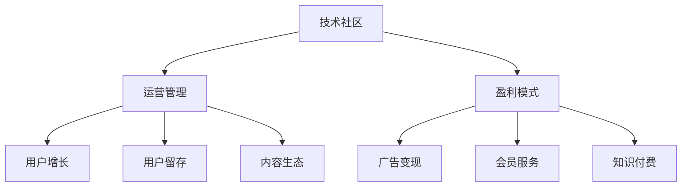

                 

# 技术社区运营：从管理到盈利模式

> 关键词：技术社区, 运营管理, 盈利模式, 用户增长, 用户留存, 内容生态, 广告变现, 会员服务, 知识付费

## 1. 背景介绍

### 1.1 问题由来
随着互联网技术的发展，技术社区作为一种知识共享和社区协作的平台，成为越来越多开发者和技术人员沟通交流的首选场所。技术社区不仅能满足开发者对技术资讯的需求，还能通过社区氛围推动技术和产品创新。然而，优秀的技术社区并不好找，如何高效运营技术社区，打造可持续发展的社区生态，成为了当下技术社区建设的重要课题。

### 1.2 问题核心关键点
一个成功的技术社区通常具备以下几个关键点：
1. **高质量的内容**：社区必须提供高质量的技术文章、代码分享、项目讨论等。
2. **活跃的社区氛围**：通过持续的用户互动和活动组织，保持社区的活跃度。
3. **有效的盈利模式**：通过合理的商业模式，实现社区的可持续发展。
4. **持续的用户增长和留存**：采用有效的运营策略，吸引更多高质量用户，并提高用户粘性。
5. **完善的内容生态**：形成良好的内容创作、分享、消费循环，促进技术交流和创新。

本文将从技术社区的管理和盈利模式两个方面，探讨如何高效运营技术社区，实现社区的可持续发展和盈利。

### 1.3 问题研究意义
高效运营技术社区，不仅有助于提升技术交流和创新效率，还能为技术公司提供宝贵的用户资源和品牌影响力。通过系统的运营策略和盈利模式，技术社区可以实现商业化和用户价值提升的双重目标，成为企业的重要资产。

## 2. 核心概念与联系

### 2.1 核心概念概述

为更好地理解技术社区运营和盈利模式，本节将介绍几个密切相关的核心概念：

- **技术社区**：以技术交流和协作为主题的在线平台，如GitHub、Stack Overflow等。
- **运营管理**：对技术社区进行有效的用户管理、内容管理、活动组织等。
- **盈利模式**：通过商业化手段实现社区的长期发展，包括广告变现、会员服务、知识付费等。
- **用户增长**：通过运营策略吸引更多高质量用户，实现社区规模的扩大。
- **用户留存**：通过运营手段提高用户的粘性，防止用户流失。
- **内容生态**：社区内形成高质量内容创作、分享、消费的良性循环。
- **广告变现**：通过广告收入实现社区的商业化。
- **会员服务**：提供专属服务，如高级功能、优先支持等，实现高价值用户转化。
- **知识付费**：通过付费内容、咨询、课程等形式实现盈利。

这些核心概念之间的逻辑关系可以通过以下Mermaid流程图来展示：



这个流程图展示了几大核心概念及其之间的关系：

1. 技术社区是运营管理的对象，盈利模式是其商业化的手段。
2. 运营管理通过用户增长、用户留存、内容生态等手段，提升社区质量。
3. 盈利模式包括广告变现、会员服务、知识付费等，实现社区的长期发展。

## 3. 核心算法原理 & 具体操作步骤
### 3.1 算法原理概述

技术社区的运营管理与盈利模式涉及多个领域的知识，包括社区心理学、市场营销、内容管理、用户行为分析等。以下将从管理角度，详细介绍社区运营的核心算法原理和具体操作步骤。

### 3.2 算法步骤详解

**Step 1: 用户画像建立**

1. **数据收集**：收集用户在社区内的活动数据，如访问次数、发帖频率、评论互动等。
2. **数据分析**：通过统计分析，识别出活跃用户、贡献用户、新手用户等不同用户群体的特征。
3. **用户画像**：根据不同用户群体的行为特征，构建用户画像，为个性化运营提供依据。

**Step 2: 内容推荐系统**

1. **内容库建立**：构建社区内的内容库，包括文章、代码库、项目讨论等。
2. **内容评估**：使用自然语言处理等技术，对内容进行质量评估，筛选优质内容。
3. **推荐算法**：基于用户画像和内容质量，构建推荐算法，为不同用户推荐感兴趣的内容。

**Step 3: 活动组织与推广**

1. **活动策划**：定期组织技术讲座、编程竞赛、开源项目等活动，提升社区活跃度。
2. **推广渠道**：通过社交媒体、邮件列表、合作伙伴等渠道，推广社区活动。
3. **参与激励**：提供积分、徽章、证书等激励措施，鼓励用户积极参与。

**Step 4: 用户互动与反馈**

1. **互动机制**：设计互动机制，如评论、点赞、打赏等，增强用户粘性。
2. **反馈收集**：通过调查问卷、用户访谈等手段，收集用户反馈。
3. **反馈应用**：根据用户反馈，持续改进社区运营策略。

### 3.3 算法优缺点

技术社区运营管理的算法具有以下优点：
1. **提升用户粘性**：通过个性化推荐和互动机制，提高用户粘性，防止用户流失。
2. **优化内容质量**：通过内容评估和推荐算法，筛选优质内容，提升社区内容质量。
3. **促进用户参与**：通过活动组织和推广，吸引更多用户参与，增加社区活跃度。
4. **获取用户反馈**：通过用户反馈收集和应用，持续改进运营策略。

同时，该算法也存在一定的局限性：
1. **资源投入大**：数据收集和分析需要大量人力和技术支持。
2. **算法复杂度**：内容推荐算法、活动策划需要复杂的技术支持。
3. **依赖数据质量**：用户数据和内容数据的质量直接影响算法的准确性。
4. **用户隐私保护**：如何保护用户隐私，防止数据滥用，需要严格的数据管理和隐私保护措施。

### 3.4 算法应用领域

技术社区运营管理的算法广泛应用于以下领域：

- **社交网络平台**：如Facebook、LinkedIn等，通过用户画像、内容推荐等手段，提升平台活跃度和用户粘性。
- **电子商务平台**：如Amazon、淘宝等，通过商品推荐、用户评论等手段，提升用户购物体验和满意度。
- **在线教育平台**：如Coursera、Udemy等，通过课程推荐、学习互动等手段，提高用户学习效果和满意度。
- **健康管理平台**：如MyFitnessPal、Fitbit等，通过健康数据推荐、活动激励等手段，提升用户健康管理效果。
- **金融服务平台**：如支付宝、微信支付等，通过金融产品推荐、支付优化等手段，提升用户金融服务体验。

## 4. 数学模型和公式 & 详细讲解 & 举例说明（备注：数学公式请使用latex格式，latex嵌入文中独立段落使用 $$，段落内使用 $)
### 4.1 数学模型构建

本节将使用数学语言对技术社区运营管理的核心算法进行更加严格的刻画。

假设社区内用户数量为 $N$，内容库数量为 $M$，每个用户访问内容的概率为 $p$，每个用户每周的平均访问次数为 $k$，每个内容被访问的概率为 $q$，内容的质量为 $h$，推荐算法的推荐精度为 $r$。

构建用户画像的数学模型如下：

$$
P(u) = \sum_{i=1}^{N} p_i x_i + \sum_{j=1}^{M} q_j h_j
$$

其中 $p_i$ 为第 $i$ 个用户的访问概率，$x_i$ 为第 $i$ 个用户的行为特征，$q_j$ 为第 $j$ 个内容的质量，$h_j$ 为第 $j$ 个内容的质量评分。

### 4.2 公式推导过程

根据上述数学模型，可以得到：

$$
P(u) = \sum_{i=1}^{N} p_i x_i + \sum_{j=1}^{M} q_j h_j
$$

假设内容的质量 $h_j$ 服从正态分布 $N(\mu, \sigma^2)$，其中 $\mu$ 为质量均值，$\sigma^2$ 为质量方差。内容的质量评分 $q_j$ 可以根据质量 $h_j$ 进行标准化，得到：

$$
q_j = \frac{h_j - \mu}{\sigma}
$$

用户的行为特征 $x_i$ 也可以标准化，得到：

$$
x_i = \frac{x_i - \bar{x}}{s}
$$

其中 $\bar{x}$ 为特征均值，$s$ 为特征标准差。

最终，用户画像的概率分布为：

$$
P(u) = \sum_{i=1}^{N} p_i x_i + \sum_{j=1}^{M} q_j h_j
$$

### 4.3 案例分析与讲解

假设社区内有一个新的技术文章发布，系统自动将其推荐给所有用户。为了评估推荐效果，我们需要对用户画像进行统计分析。假设社区有 1000 个活跃用户，每个用户每周平均访问内容 3 次，每个用户访问每个内容的质量评分均为 5。

根据上述数学模型，可以计算每个用户被推荐文章的概率为：

$$
P(u) = \frac{5}{3} = 1.67
$$

这意味着平均每个用户都会被推荐该文章。为了进一步提高推荐效果，可以考虑引入推荐算法，如协同过滤、矩阵分解等，根据用户的历史行为和内容质量，进行个性化推荐。例如，通过协同过滤算法，可以得到每个用户对推荐文章的概率分布，从而提高推荐的精准度。

## 5. 项目实践：代码实例和详细解释说明
### 5.1 开发环境搭建

在进行技术社区运营管理的实践前，我们需要准备好开发环境。以下是使用Python进行社区管理实践的环境配置流程：

1. 安装Anaconda：从官网下载并安装Anaconda，用于创建独立的Python环境。

2. 创建并激活虚拟环境：
```bash
conda create -n tech-community-env python=3.8 
conda activate tech-community-env
```

3. 安装相关库：
```bash
pip install pandas numpy scikit-learn numpy pandas
```

4. 安装Flask：用于构建社区网站，提供用户互动和内容展示功能。
```bash
pip install flask
```

5. 安装SQLAlchemy：用于管理社区数据，包括用户、内容、活动等。
```bash
pip install sqlalchemy
```

完成上述步骤后，即可在`tech-community-env`环境中开始社区管理实践。

### 5.2 源代码详细实现

下面我们以GitHub社区为例，给出使用Flask构建技术社区的网站，并实现用户管理和内容推荐的代码实现。

首先，定义用户和内容的数据模型：

```python
from flask_sqlalchemy import SQLAlchemy
from flask_login import UserMixin

db = SQLAlchemy()
class User(db.Model, UserMixin):
    id = db.Column(db.Integer, primary_key=True)
    username = db.Column(db.String(50), unique=True, nullable=False)
    password_hash = db.Column(db.String(255), nullable=False)
    posts = db.relationship('Post', backref='author', lazy=True)
    
class Post(db.Model):
    id = db.Column(db.Integer, primary_key=True)
    title = db.Column(db.String(255), nullable=False)
    content = db.Column(db.Text, nullable=False)
    user_id = db.Column(db.Integer, db.ForeignKey('user.id'), nullable=False)
```

然后，定义用户注册和登录的视图函数：

```python
from flask import render_template, redirect, url_for
from flask_login import login_user, login_required, logout_user

@app.route('/register', methods=['GET', 'POST'])
def register():
    if request.method == 'POST':
        username = request.form['username']
        password = request.form['password']
        user = User(username=username)
        db.session.add(user)
        db.session.commit()
        return redirect(url_for('login'))
    return render_template('register.html')

@app.route('/login', methods=['GET', 'POST'])
def login():
    if request.method == 'POST':
        username = request.form['username']
        password = request.form['password']
        user = User.query.filter_by(username=username).first()
        if user and check_password_hash(user.password_hash, password):
            login_user(user)
            return redirect(url_for('index'))
        return redirect(url_for('login'))
    return render_template('login.html')

@app.route('/logout')
@login_required
def logout():
    logout_user()
    return redirect(url_for('index'))
```

接着，定义内容推荐的页面视图：

```python
@app.route('/content')
@login_required
def content():
    post = Post.query.order_by(Post.date.desc()).first()
    return render_template('content.html', post=post)
```

最后，启动Flask服务：

```python
if __name__ == '__main__':
    app.run(debug=True)
```

以上就是使用Flask构建技术社区网站的基本代码实现。可以看到，通过Flask的Web框架和SQLAlchemy的数据库管理，可以轻松实现用户注册、登录和内容推荐等功能。

### 5.3 代码解读与分析

让我们再详细解读一下关键代码的实现细节：

**数据模型**：
- `User`模型：表示社区用户，包括用户名、密码、发布的文章等。
- `Post`模型：表示社区文章，包括标题、内容、发布者等。

**视图函数**：
- `register`函数：处理用户注册请求，将用户信息存储到数据库中。
- `login`函数：处理用户登录请求，验证用户名和密码后登录用户。
- `logout`函数：处理用户退出请求，从数据库中删除用户会话。

**内容推荐**：
- `content`函数：获取最新的文章，并将其渲染到HTML页面。

可以看到，Flask框架和SQLAlchemy库大大简化了社区网站的管理和开发过程。开发者可以将更多精力集中在社区功能和运营策略的实现上。

当然，工业级的系统实现还需考虑更多因素，如用户权限管理、数据加密、安全防护等。但核心的运营管理算法和代码实现流程基本与此类似。

## 6. 实际应用场景
### 6.1 社交网络平台

社交网络平台如Facebook、Twitter等，通过用户画像和推荐算法，提升用户粘性和活跃度。Facebook的推荐算法主要包括内容推荐和关系推荐，通过分析用户的行为数据和社交关系，向用户推荐可能感兴趣的内容和好友。这种个性化的推荐方式，不仅增加了用户停留时间，还促进了社区的互动和内容生产。

### 6.2 电子商务平台

电子商务平台如Amazon、淘宝等，通过用户画像和推荐算法，提升用户购物体验和满意度。Amazon的推荐算法主要包括商品推荐和用户行为预测，通过分析用户的浏览、购买历史和行为数据，向用户推荐可能感兴趣的商品和活动。这种基于用户数据的推荐方式，不仅提高了用户的购物效率，还增加了平台的销售额和用户忠诚度。

### 6.3 在线教育平台

在线教育平台如Coursera、Udemy等，通过用户画像和内容推荐，提高用户学习效果和满意度。Coursera的推荐算法主要包括课程推荐和学习路径优化，通过分析用户的学习行为和历史数据，向用户推荐可能感兴趣的课程和专项课程。这种个性化的推荐方式，不仅提升了用户的课程完成率，还促进了平台的课程多样性和用户忠诚度。

### 6.4 金融服务平台

金融服务平台如支付宝、微信支付等，通过用户画像和推荐算法，提升用户金融服务体验。支付宝的推荐算法主要包括金融产品推荐和支付优化，通过分析用户的消费行为和金融产品使用情况，向用户推荐可能感兴趣的金融产品和服务。这种个性化的推荐方式，不仅提高了用户的金融服务体验，还增加了平台的用户黏性和收入。

## 7. 工具和资源推荐
### 7.1 学习资源推荐

为了帮助开发者系统掌握技术社区运营管理的理论基础和实践技巧，这里推荐一些优质的学习资源：

1. 《社区运营手册》系列博文：由社区运营专家撰写，详细介绍社区运营的各个环节，包括用户管理、内容管理、活动组织等。

2. 《用户体验设计》课程：斯坦福大学开设的UI/UX课程，涵盖用户行为分析、设计心理学等，有助于理解用户需求和社区体验。

3. 《社交媒体分析》书籍：介绍社交网络平台的用户行为分析和数据挖掘技术，帮助开发者优化社区推荐算法。

4. 《数据科学》课程：Coursera和edX等平台提供的数据科学课程，涵盖数据分析、机器学习等知识，有助于提升社区运营的数据驱动能力。

5. HuggingFace官方文档：Transformers库的官方文档，提供了丰富的预训练语言模型和微调样例，有助于提升社区内容质量。

通过对这些资源的学习实践，相信你一定能够快速掌握技术社区运营管理的精髓，并用于解决实际的社区运营问题。

### 7.2 开发工具推荐

高效的开发离不开优秀的工具支持。以下是几款用于技术社区运营管理的常用工具：

1. Flask：基于Python的开源Web框架，灵活的路由管理和模板渲染，适用于快速开发社区网站。

2. SQLAlchemy：Python的数据库ORM库，支持多种数据库，方便数据管理和查询。

3. Elasticsearch：高性能的全文搜索引擎，适用于社区内容检索和推荐算法。

4. Redis：高并发、高可用性的内存数据库，适用于社区活动管理和缓存。

5. Sentry：监控和错误报告工具，实时监测社区系统健康，提供快速定位和修复功能。

6. New Relic：性能监控和分析工具，帮助开发者优化社区系统性能。

合理利用这些工具，可以显著提升技术社区运营管理的开发效率，加快创新迭代的步伐。

### 7.3 相关论文推荐

技术社区运营管理的理论研究涉及多个领域，包括社会学、市场营销、用户心理学等。以下是几篇奠基性的相关论文，推荐阅读：

1. Social Media Sentiment Analysis：介绍社交网络平台的情感分析技术，帮助开发者理解用户情感和社区氛围。

2. Recommendation Systems in E-commerce：介绍电子商务平台的推荐算法，帮助开发者提升用户购物体验。

3. Learning to Recommend at Scale：介绍大规模推荐系统的构建，帮助开发者优化社区推荐算法。

4. User Growth Hacking：介绍用户增长策略，帮助开发者吸引更多高质量用户。

5. Data-Driven Community Management：介绍数据驱动的社区运营策略，帮助开发者提升社区运营效果。

这些论文代表了大规模社区运营管理的理论进展，通过学习这些前沿成果，可以帮助研究者把握学科前进方向，激发更多的创新灵感。

## 8. 总结：未来发展趋势与挑战
### 8.1 总结

本文对技术社区的运营管理和盈利模式进行了全面系统的介绍。首先阐述了技术社区的重要性和运营管理的核心关键点，明确了运营管理在提升社区活跃度和用户体验方面的独特价值。其次，从算法原理和操作步骤，详细讲解了技术社区运营的核心算法和具体操作步骤，给出了社区管理实践的完整代码实例。同时，本文还广泛探讨了运营管理算法在多个行业领域的应用前景，展示了运营管理范式的巨大潜力。此外，本文精选了运营管理的各类学习资源，力求为读者提供全方位的技术指引。

通过本文的系统梳理，可以看到，技术社区运营管理已经成为社区建设的重要组成部分，极大地提升了社区的活跃度和用户体验。高效运营管理不仅能提升社区的价值，还能实现商业化的可持续发展，为技术公司带来可观的商业收益。

### 8.2 未来发展趋势

展望未来，技术社区运营管理将呈现以下几个发展趋势：

1. **个性化推荐系统**：随着深度学习和大数据技术的发展，社区推荐算法将更加精准高效，能够提供个性化的内容推荐和活动组织。
2. **数据驱动的运营管理**：通过数据分析和数据驱动的运营策略，提升社区运营的效果和效率，实现数据驱动的持续优化。
3. **社区生态的闭环**：社区运营管理将更加注重内容创作、分享、消费的闭环，形成良好的内容生态，提升社区的用户粘性和价值。
4. **跨领域应用**：技术社区运营管理的理念和算法将被广泛应用于其他领域，如医疗、金融、教育等，提升各领域的用户互动和运营效果。
5. **用户心理学的研究**：通过用户心理学的研究，优化社区运营策略，提升用户满意度和粘性。
6. **技术进步**：AI、大数据、区块链等新兴技术的发展，将为社区运营管理带来新的机会和挑战，提升社区的智能化水平和安全性。

以上趋势凸显了技术社区运营管理的广阔前景。这些方向的探索发展，必将进一步提升社区运营的智能化和高效化，推动技术社区向更加可持续和商业化的方向发展。

### 8.3 面临的挑战

尽管技术社区运营管理已经取得了显著成就，但在迈向更加智能化、普适化应用的过程中，它仍面临着诸多挑战：

1. **资源投入大**：高质量的社区管理和运营需要大量的人力、技术资源，包括数据分析、算法优化等。
2. **数据隐私和安全**：社区用户的隐私保护和数据安全是运营管理的核心挑战，需要严格的数据管理和隐私保护措施。
3. **用户激励机制**：如何设计有效的用户激励机制，提高用户粘性和活跃度，是社区运营的关键问题。
4. **算法复杂度**：社区推荐算法和活动组织算法需要复杂的技术支持，如何提升算法的效率和精度是技术社区运营管理的重要课题。
5. **内容质量控制**：如何保持社区内容的高质量，避免低质内容的泛滥，需要有效的社区治理和内容审核机制。

### 8.4 研究展望

面向未来，技术社区运营管理的研究需要在以下几个方面寻求新的突破：

1. **自动化运营管理**：开发自动化的社区管理工具，提升运营效率和效果。
2. **智能化社区运营**：引入AI和大数据技术，实现智能化的社区运营和管理。
3. **区块链技术**：利用区块链技术提升社区的透明性和安全性，保障用户权益。
4. **跨领域协作**：通过跨领域协作，推动技术社区的广泛应用和创新。
5. **新模型和新算法**：探索新的算法模型和算法框架，提升社区运营管理的效率和效果。

这些研究方向的探索，必将引领技术社区运营管理技术迈向更高的台阶，为技术社区和各行业带来新的发展机遇。

## 9. 附录：常见问题与解答

**Q1：如何评估社区运营效果？**

A: 社区运营效果可以通过多个指标进行评估，包括用户活跃度、内容质量、用户留存率等。具体而言：
1. **用户活跃度**：通过统计用户访问次数、发帖数量、评论互动等，评估社区的活跃程度。
2. **内容质量**：通过评估内容的质量、阅读量、点赞数等，衡量社区的内容生态。
3. **用户留存率**：通过统计新用户注册率、用户留存率、流失率等，评估社区的用户粘性。

**Q2：社区运营中如何处理用户反馈？**

A: 用户反馈是社区运营的重要参考，可以通过以下步骤处理用户反馈：
1. **收集反馈**：通过调查问卷、用户访谈等方式，收集用户对社区的建议和意见。
2. **分析反馈**：对收集到的反馈进行分类、统计和分析，识别出主要问题和改进点。
3. **改进措施**：根据反馈结果，制定改进措施，优化社区功能和运营策略。
4. **反馈闭环**：在改进措施实施后，及时向用户反馈改进效果，形成反馈闭环。

**Q3：社区推荐算法如何优化？**

A: 社区推荐算法的优化可以从以下几个方面入手：
1. **数据质量**：提升社区数据的准确性和完整性，优化数据预处理和特征工程。
2. **算法优化**：优化推荐算法模型和算法参数，提升推荐精度和效率。
3. **模型评估**：通过A/B测试等方法，评估推荐算法的效果和用户体验。
4. **用户反馈**：根据用户反馈，不断优化推荐算法，提升用户满意度和粘性。

**Q4：如何设计社区激励机制？**

A: 社区激励机制的设计需要考虑多个因素，包括用户需求、平台目标、资源投入等。具体而言：
1. **用户需求**：了解用户的需求和期望，设计有效的激励措施，满足用户需求。
2. **平台目标**：设计激励机制时，需要考虑平台的运营目标，如用户增长、内容生产、品牌推广等。
3. **资源投入**：合理评估激励机制的资源投入，避免资源浪费。
4. **激励形式**：设计多样化的激励形式，如积分、徽章、证书等，提升用户参与度。

**Q5：如何提升社区内容质量？**

A: 社区内容质量的控制可以从以下几个方面入手：
1. **内容审核**：设立内容审核机制，对发布的内容进行审核和筛选，避免低质内容泛滥。
2. **内容推荐**：通过社区推荐算法，推荐高质量的内容，提升用户阅读体验。
3. **用户评价**：建立用户评价机制，让用户对内容进行评价和打分，反馈社区内容质量。
4. **内容激励**：设计内容激励机制，鼓励用户创作高质量内容，提升社区内容质量。

这些问题的解答，有助于开发者更好地理解和应对技术社区运营管理中的常见问题，提升社区的运营效果和用户满意度。

---

作者：禅与计算机程序设计艺术 / Zen and the Art of Computer Programming

