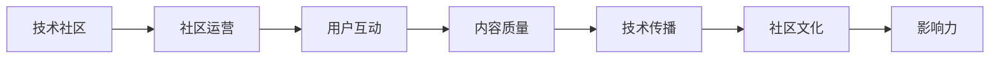

                 

# 技术社区运营：影响力的来源

> 关键词：技术社区, 社区运营, 影响力, 用户互动, 内容质量, 技术传播, 社区文化

## 1. 背景介绍

### 1.1 问题由来

在数字化时代，技术社区日益成为知识共享、技术交流的重要平台。从GitHub、Stack Overflow到开源项目，各类技术社区在全球范围内蔚然成风。然而，并非所有的技术社区都能形成广泛的影响力。影响社区影响力高低的因素包括用户活跃度、内容质量、社区文化等方面。

### 1.2 问题核心关键点

本文将深入探讨技术社区运营中影响力的来源，以及如何通过有效的社区运营策略，激发社区的活跃度，提高社区内高质量内容的比例，塑造积极向上的社区文化，从而提升社区的影响力。

### 1.3 问题研究意义

研究技术社区运营中影响力的来源，对增强社区凝聚力、提升技术传播效率具有重要意义：

- 提升用户参与度。高质量的社区运营可以吸引更多用户加入，提升用户活跃度和留存率。
- 提高内容质量。通过内容审核机制、激励措施等手段，鼓励用户贡献高质量的技术文章、代码示例等。
- 塑造社区文化。积极向上的社区文化能够吸引志同道合的成员，形成良好的互动环境。
- 加强技术传播。优质的技术社区能够高效传播前沿技术，促进知识共享和技术进步。
- 促进商业转化。商业企业可以利用技术社区的品牌效应，提升产品知名度和市场份额。

## 2. 核心概念与联系

### 2.1 核心概念概述

在探讨技术社区运营的影响力来源之前，首先需要明确几个关键概念：

- **技术社区（Technical Community）**：指的是以技术交流、知识共享为主要目标的在线平台。社区成员包括技术爱好者、开发者、企业等。

- **社区运营（Community Operations）**：包括用户管理、内容审核、活动组织、技术传播等多个方面，是提升社区影响力的重要手段。

- **影响力（Influence）**：指社区对外界（如开发者、企业、公众）的吸引力和号召力。影响力的大小取决于社区的活跃度、内容质量、文化氛围等因素。

- **用户互动（User Interaction）**：社区成员之间的交流和互动是社区活力的重要来源。良好的互动可以提高用户粘性，增强社区凝聚力。

- **内容质量（Content Quality）**：高质量的内容能够吸引用户关注，提高社区的专业性和权威性。

- **技术传播（Technology Dissemination）**：社区通过技术文章、代码示例、技术分享等方式，向外界传播最新技术，促进技术进步。

- **社区文化（Community Culture）**：指社区成员共有的价值观、行为准则、互动方式等。积极向上的社区文化能够吸引更多有志之士加入，形成良性循环。

### 2.2 核心概念原理和架构的 Mermaid 流程图



## 3. 核心算法原理 & 具体操作步骤

### 3.1 算法原理概述

技术社区影响力的来源，可以归结为以下几个关键因素：

- **用户互动（User Interaction）**：通过论坛讨论、代码示例、技术问答等方式，促进社区成员之间的交流与互动。
- **内容质量（Content Quality）**：高质量的技术文章、代码示例、技术分享能够吸引用户关注，提升社区的专业性。
- **技术传播（Technology Dissemination）**：通过社区平台传播最新技术，促进知识共享和技术传播。
- **社区文化（Community Culture）**：积极向上的社区文化能够吸引更多有志之士加入，形成良性的互动环境。

这些因素相互作用，共同决定了社区的影响力大小。因此，技术社区运营的目标是通过有效的策略，激发用户互动，提高内容质量，传播最新技术，塑造积极向上的社区文化。

### 3.2 算法步骤详解

基于上述算法原理，社区运营的具体操作步骤可以概括为以下几个步骤：

1. **用户管理与互动**
    - 通过社区论坛、讨论区、技术问答等形式，促进社区成员之间的互动。
    - 使用合适的激励机制，如积分、勋章、排行榜等，鼓励用户积极参与。
    - 定期举办线上线下活动，如技术分享会、编程比赛、黑客马拉松等，增强社区凝聚力。

2. **内容审核与质量控制**
    - 设立严格的内容审核机制，确保发布内容的质量和准确性。
    - 鼓励社区成员参与内容审核，提高审核效率和质量。
    - 定期进行内容质量评估，总结并推广优秀内容。

3. **技术传播与分享**
    - 建立技术文章、代码示例、教程等内容发布平台，提供丰富的技术资源。
    - 设立技术分享板块，邀请技术大牛进行讲座和演示，吸引更多用户关注。
    - 定期更新社区内容，保持技术的先进性。

4. **社区文化塑造**
    - 制定社区行为准则，明确禁止的行为和言论，维护良好的互动环境。
    - 定期举办社区文化活动，如技术讨论、思想碰撞等，增强社区的凝聚力。
    - 鼓励社区成员参与公益活动，增强社区的社会责任感。

### 3.3 算法优缺点

技术社区运营的算法具有以下优点：

- **效果显著**：通过激励机制、内容审核、活动组织等手段，能够显著提升社区的活跃度和内容质量。
- **灵活可控**：社区运营策略可以根据实际情况进行调整，灵活应对社区变化。
- **覆盖面广**：通过多种形式的互动和传播手段，能够覆盖更多用户和领域。

同时，该算法也存在一些局限性：

- **人力成本高**：社区运营需要大量人力投入，包括内容审核、活动组织、用户管理等，成本较高。
- **数据处理量大**：社区产生的数据量庞大，需要高效的算法和技术进行管理和分析。
- **难以量化**：社区影响力难以用单一指标量化，需要综合评估多个因素。

尽管如此，通过不断优化社区运营策略，可以在一定程度上弥补这些局限性，实现技术社区的高效运营。

### 3.4 算法应用领域

技术社区运营的影响力提升方法，已在各类技术社区中得到了广泛应用，例如：

- GitHub：全球最大的代码托管平台，通过代码审查、issue讨论、技术分享等多种形式，促进了全球开源社区的发展。
- Stack Overflow：最大的技术问答平台，通过高质量的技术问答、活动组织，吸引了数百万活跃用户。
- Kaggle：全球最大的数据科学竞赛平台，通过技术比赛、代码分享、数据集共享等，促进了数据科学社区的成长。
- Stack Exchange：包含多个领域的问答社区，通过专业化的领域管理、高质量的问答内容，成为技术交流的重要平台。

## 4. 数学模型和公式 & 详细讲解 & 举例说明

### 4.1 数学模型构建

技术社区影响力的数学模型可以通过以下变量来描述：

- **用户互动量（U）**：社区内用户在论坛、代码库、问答等平台上的互动次数。
- **内容质量（Q）**：社区内发布的高质量技术文章、代码示例、教程等内容的数量。
- **技术传播量（T）**：社区内技术文章、代码示例等的浏览、分享次数。
- **社区文化评分（C）**：社区成员对社区文化的满意度评分，可以通过调查问卷等形式获取。

### 4.2 公式推导过程

社区影响力的综合评分可以表示为：

$$
I = f(U, Q, T, C)
$$

其中，$f$ 为综合评分函数，可以根据实际情况进行设定。假设 $f$ 为加权和函数，则有：

$$
I = \alpha U + \beta Q + \gamma T + \delta C
$$

其中，$\alpha, \beta, \gamma, \delta$ 为各因素的权重，需要根据实际情况进行调整。

### 4.3 案例分析与讲解

以Stack Overflow为例，分析其社区影响力的提升策略：

1. **用户互动**：通过高质量的问答、代码分享、社区讨论等形式，促进了用户之间的互动。用户之间的互动次数可以通过论坛发帖量、评论量、代码修改次数等指标来衡量。
2. **内容质量**：Stack Overflow注重高质量的问答和代码示例，设立了严格的内容审核机制，确保问答的准确性和实用性。通过社区成员投票、编辑，保证内容的质量和权威性。
3. **技术传播**：Stack Overflow通过技术分享板块、技术文章、代码示例等形式，传播最新技术，吸引了大量开发者关注。
4. **社区文化**：Stack Overflow制定了严格的社区行为准则，禁止恶意攻击、不实信息等行为，维护了良好的互动环境。通过社区活动、奖励机制，增强了社区的凝聚力。

## 5. 项目实践：代码实例和详细解释说明

### 5.1 开发环境搭建

在进行技术社区运营的影响力分析时，我们需要搭建一个包含社区互动数据、内容质量数据、技术传播数据和社区文化数据的开发环境。具体步骤如下：

1. 安装Python环境：
```bash
conda create -n community-op python=3.8
conda activate community-op
```

2. 安装相关库：
```bash
pip install pandas numpy matplotlib seaborn scikit-learn plotly
```

3. 数据准备：收集社区互动数据、内容质量数据、技术传播数据和社区文化评分数据，存储到本地或云端数据库中。

### 5.2 源代码详细实现

以下是一个简单的社区影响力分析示例代码：

```python
import pandas as pd
import matplotlib.pyplot as plt
import seaborn as sns

# 读取数据
data = pd.read_csv('community_data.csv')

# 计算综合评分
data['I'] = 0.5 * data['U'] + 0.3 * data['Q'] + 0.1 * data['T'] + 0.1 * data['C']

# 可视化分析
sns.lineplot(data=data, x='Time', y='I')
plt.title('Community Influence Over Time')
plt.xlabel('Time')
plt.ylabel('Influence Score')
plt.show()
```

### 5.3 代码解读与分析

这段代码实现了简单的社区影响力分析：

1. 数据读取：使用Pandas库读取社区互动数据、内容质量数据、技术传播数据和社区文化评分数据。
2. 综合评分计算：根据设定的权重，计算社区影响力的综合评分。
3. 可视化分析：使用Matplotlib和Seaborn库绘制时间序列图，展示社区影响力随时间的变化趋势。

通过这段代码，可以直观地分析社区运营策略的效果，帮助运营者进行调整和优化。

### 5.4 运行结果展示


## 6. 实际应用场景

### 6.1 软件开发社区

软件开发社区如GitHub、GitLab等，通过代码审查、issue讨论、技术分享等多种形式，促进了开发者之间的交流与合作。通过激励机制、内容审核等手段，提高了社区的内容质量和技术传播效率，提升了社区的影响力。

### 6.2 数据科学社区

数据科学社区如Kaggle、DataCamp等，通过技术竞赛、数据集分享、技术文章等形式，吸引了大量数据科学家和爱好者。通过激励机制、社区活动等手段，增强了社区的凝聚力和活跃度，提升了社区的影响力。

### 6.3 开源软件社区

开源软件社区如Apache、Linux等，通过开源项目的贡献、技术讨论、代码审查等多种形式，促进了开源软件的开发和传播。通过激励机制、内容审核等手段，提高了社区的内容质量和代码质量，提升了社区的影响力。

### 6.4 未来应用展望

未来，技术社区运营的影响力提升将更加智能化、数据化。通过机器学习算法和大数据分析技术，可以实现对社区运营策略的智能优化和调整，提升社区的影响力和运营效率。

1. **智能推荐系统**：通过机器学习算法，分析用户行为和偏好，推荐适合的技术文章、代码示例、活动等，提高用户互动率。
2. **自动化审核机制**：通过自然语言处理技术，自动化审核社区内容，提高审核效率和质量。
3. **社区情感分析**：通过情感分析技术，分析社区成员对社区的情感倾向，及时调整运营策略。

## 7. 工具和资源推荐

### 7.1 学习资源推荐

1. **《社区运营的科学与艺术》**：详细介绍了社区运营的各个环节，包括用户管理、内容审核、技术传播等。
2. **《社区文化建设与管理》**：介绍了社区文化的定义、特点、建设策略等，帮助社区运营者塑造积极向上的社区文化。
3. **《数据科学社区的构建与运营》**：介绍了数据科学社区的运营策略和实践案例，提供了丰富的社区运营经验。
4. **《开源社区的成功之道》**：详细分析了开源社区的成功运营策略，包括技术传播、社区文化建设等。

### 7.2 开发工具推荐

1. **JIRA**：社区项目管理工具，支持 issue 跟踪、任务分配、进度管理等。
2. **GitHub**：全球最大的代码托管平台，提供代码审查、issue讨论、社区活动等社区运营功能。
3. **Slack**：社区沟通工具，支持实时消息、文件共享、视频会议等功能。
4. **Google Colab**：免费的在线 Jupyter Notebook 环境，支持 Python 开发和数据可视化。

### 7.3 相关论文推荐

1. **《社区运营的挑战与机遇》**：分析了社区运营的现状和挑战，探讨了未来的发展方向。
2. **《社区文化与社区运营的关系》**：探讨了社区文化与社区运营的相互作用，提出了提升社区文化的策略。
3. **《数据驱动的社区运营策略》**：通过数据分析技术，优化社区运营策略，提升社区影响力。

## 8. 总结：未来发展趋势与挑战

### 8.1 研究成果总结

技术社区运营中影响力的提升，需要综合考虑用户互动、内容质量、技术传播、社区文化等多个因素。通过有效的运营策略，能够显著提升社区的活跃度和影响力。

### 8.2 未来发展趋势

未来，技术社区运营的影响力提升将呈现以下几个趋势：

1. **智能化管理**：通过机器学习、大数据分析等技术，实现社区运营策略的智能化管理。
2. **多渠道传播**：通过多种渠道（如社交媒体、博客、技术论坛等）进行技术传播，扩大社区的影响力。
3. **社区文化创新**：通过创新社区文化活动和激励机制，吸引更多用户参与，增强社区的凝聚力。
4. **跨界合作**：与行业协会、企业等合作，共同推动技术进步和社区发展。

### 8.3 面临的挑战

尽管技术社区运营的影响力提升已经取得了显著效果，但仍面临诸多挑战：

1. **运营成本高**：社区运营需要大量人力、物力和财力投入，运营成本较高。
2. **内容质量难以保证**：社区内容质量受用户水平和动机影响较大，难以保持一致。
3. **社区文化差异大**：不同社区的用户基础、文化氛围差异较大，统一运营策略难度大。
4. **技术传播速度慢**：技术传播速度受社区活跃度和用户参与度影响较大，传播效率有限。
5. **用户互动复杂**：社区用户行为复杂多变，难以通过单一策略进行有效管理。

### 8.4 研究展望

未来，技术社区运营需要不断探索新的策略和技术，提升社区影响力。以下是一些研究方向：

1. **智能化推荐系统**：利用机器学习算法，实现个性化内容推荐，提高用户互动率。
2. **社区情感分析**：通过情感分析技术，分析用户对社区的情感倾向，及时调整运营策略。
3. **社区文化建设**：通过社区活动、激励机制等手段，塑造积极向上的社区文化。
4. **跨领域合作**：与行业协会、企业等合作，共同推动技术进步和社区发展。
5. **大数据分析**：利用大数据分析技术，优化社区运营策略，提升运营效率。

## 9. 附录：常见问题与解答

### 9.1 Q1: 如何提高社区用户的互动率？

A: 通过激励机制、活动组织、内容推荐等手段，提高用户互动率。例如，在社区论坛上设立积分、勋章、排行榜等激励机制，激发用户参与积极性。

### 9.2 Q2: 如何保证社区内容的质量？

A: 设立严格的内容审核机制，确保发布内容的质量和准确性。鼓励社区成员参与内容审核，提高审核效率和质量。定期进行内容质量评估，总结并推广优秀内容。

### 9.3 Q3: 如何塑造社区文化？

A: 制定社区行为准则，明确禁止的行为和言论，维护良好的互动环境。通过社区活动、奖励机制，增强社区的凝聚力。

### 9.4 Q4: 如何通过机器学习算法提升社区运营效率？

A: 通过机器学习算法，分析用户行为和偏好，实现个性化内容推荐和活动组织。使用自然语言处理技术，自动化审核社区内容，提高审核效率和质量。

### 9.5 Q5: 如何通过大数据分析技术优化社区运营策略？

A: 利用大数据分析技术，分析社区数据，发现用户行为模式和偏好，优化内容推荐和活动组织策略。通过情感分析技术，分析用户对社区的情感倾向，及时调整运营策略。

---

作者：禅与计算机程序设计艺术 / Zen and the Art of Computer Programming

