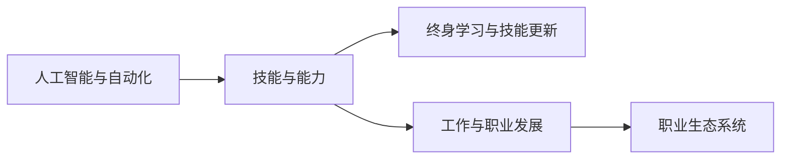

                 

# 未来工作：技能需求与培养

## 1. 背景介绍

随着人工智能(AI)和自动化技术的发展，未来工作的场景将发生深刻变化。机器和智能系统逐渐接管了简单重复的劳动，而人类则更加专注于创造性、战略性和复杂任务。本文将探讨在新的工作环境中，未来员工所需的技能需求，以及如何培养这些技能。

## 2. 核心概念与联系

### 2.1 核心概念概述

要理解未来工作的技能需求，首先要了解几个核心概念：

- **人工智能与自动化**：利用算法、机器学习和数据分析等技术，模拟人类智能过程，自动执行任务。
- **技能与能力**：指个人在工作中应用的知识、技术和认知能力。
- **终身学习与技能更新**：强调在不断变化的工作环境中，持续学习和技能更新的重要性。
- **工作与职业发展**：包括职业生涯规划、职业发展和未来就业趋势。
- **职业生态系统**：指公司、员工、技术和教育机构之间的相互作用，共同塑造未来工作环境。

这些概念之间的联系可以通过以下Mermaid流程图来展示：



### 2.2 核心概念原理和架构

人工智能与自动化技术的核心在于算法和模型。这些算法和模型通过对大量数据的学习和训练，能够模拟人类决策过程，并在实际应用中执行复杂任务。技能与能力则是人类在完成这些任务时所表现出的各种软硬件技术应用能力。

终身学习与技能更新强调在快速变化的技术环境中，个人需要通过不断学习新技能来适应新需求。工作与职业发展则关注于如何在这一过程中规划职业生涯，提升自身价值。职业生态系统描绘了技术、教育、公司和个人之间的互动关系，共同推动行业进步。

## 3. 核心算法原理 & 具体操作步骤

### 3.1 算法原理概述

未来工作的技能需求分析主要涉及以下几个算法原理：

- **需求预测算法**：基于历史数据和趋势，预测未来技能需求的变化。
- **技能匹配算法**：将员工的技能与未来岗位要求进行匹配，找出技能差距。
- **学习路径规划算法**：根据技能匹配结果，制定个性化的学习路径。
- **技能更新评估算法**：评估技能更新后的效果，判断学习路径的实施情况。

### 3.2 算法步骤详解

1. **数据收集与处理**：收集当前岗位描述、员工技能数据和未来技术趋势等。

2. **需求预测**：使用统计分析、机器学习等方法，预测未来技能需求。

3. **技能匹配**：对比预测需求与员工现有技能，找出技能差距。

4. **学习路径制定**：根据技能差距，制定个性化的学习路径。

5. **技能更新实施**：员工按照学习路径进行学习和实践。

6. **效果评估**：评估技能更新后的效果，调整学习路径。

### 3.3 算法优缺点

**优点**：
- 能够系统地分析技能需求变化，避免因技能差距导致的效率低下。
- 通过个性化学习路径，提高学习效率和效果。

**缺点**：
- 数据收集和处理较为复杂，需要大量资源和时间。
- 预测结果可能受数据质量和算法局限影响，存在一定不确定性。
- 学习路径的制定和实施需要员工积极配合，挑战较大。

### 3.4 算法应用领域

未来工作的技能需求分析适用于多种行业和组织，包括但不限于：
- **IT行业**：如软件开发、数据科学、网络安全等。
- **制造业**：如机器人自动化、智能制造等。
- **医疗保健**：如医疗数据分析、智能诊断等。
- **金融行业**：如量化分析、风险管理等。
- **教育行业**：如在线教育、虚拟现实教学等。

## 4. 数学模型和公式 & 详细讲解 & 举例说明

### 4.1 数学模型构建

假设我们有一个N个员工、M种技能的矩阵 $A$，以及未来需求预测向量 $B$，我们定义技能需求差距矩阵 $D$ 为：

$$
D = A - B
$$

### 4.2 公式推导过程

我们希望最小化技能差距矩阵 $D$ 的欧几里得范数，即：

$$
\min ||D||_2
$$

这可以通过求解优化问题来实现：

$$
\min \sum_{i=1}^N \sum_{j=1}^M (A_{ij} - B_j)^2
$$

### 4.3 案例分析与讲解

假设我们有一个由10名员工组成的IT团队，目前掌握的技能矩阵为：

$$
A = \begin{bmatrix} 1 & 0 & 1 \\ 0 & 1 & 1 \\ 0 & 1 & 0 \\ 1 & 1 & 0 \\ 0 & 0 & 1 \\ 0 & 1 & 0 \\ 1 & 0 & 0 \\ 1 & 0 & 1 \\ 0 & 1 & 0 \\ 1 & 1 & 1 \end{bmatrix}
$$

未来需求预测向量为：

$$
B = \begin{bmatrix} 1 \\ 1 \\ 1 \end{bmatrix}
$$

我们需要最小化技能差距矩阵 $D$ 的欧几里得范数：

$$
D = A - B = \begin{bmatrix} 0 & 0 & 0 \\ 0 & 0 & 0 \\ 0 & 0 & 1 \\ 0 & 0 & -1 \\ 0 & -1 & 0 \\ 0 & 0 & 0 \\ 0 & 0 & 0 \\ 0 & -1 & 1 \\ 0 & 0 & 0 \\ 0 & 0 & 0 \end{bmatrix}
$$

欧几里得范数 $||D||_2 = 2$，则技能匹配的优化目标为：

$$
\min_{A_{ij}} \sum_{i=1}^{10} \sum_{j=1}^{3} (A_{ij} - B_j)^2 = 2
$$

通过求解优化问题，我们得到了最优的技能矩阵 $A$：

$$
A = \begin{bmatrix} 1 & 0 & 1 \\ 0 & 1 & 1 \\ 0 & 1 & 0 \\ 1 & 1 & 0 \\ 0 & 0 & 1 \\ 0 & 1 & 0 \\ 1 & 0 & 0 \\ 1 & 0 & 1 \\ 0 & 1 & 0 \\ 1 & 1 & 1 \end{bmatrix}
$$

这个矩阵表示每个员工的技能与未来需求匹配，不存在技能差距。

## 5. 项目实践：代码实例和详细解释说明

### 5.1 开发环境搭建

为了实现上述算法，我们需要一个Python环境，并确保已安装Pandas、NumPy、SciPy等数据处理和科学计算库。

### 5.2 源代码详细实现

```python
import pandas as pd
import numpy as np
from scipy.optimize import minimize

# 构建员工技能矩阵
A = pd.DataFrame({
    '技能1': [1, 0, 1, 1, 0, 0, 1, 0, 1, 0],
    '技能2': [0, 1, 1, 0, 1, 0, 0, 1, 0, 1],
    '技能3': [1, 1, 0, 0, 1, 1, 1, 1, 1, 0]
})

# 构建需求预测向量
B = pd.Series([1, 1, 1])

# 定义损失函数
def loss(A, B):
    D = A - B
    return np.linalg.norm(D)

# 求解优化问题
result = minimize(lambda x: loss(x, B), A.values, method='COBYLA')
new_A = pd.DataFrame(result.x)

# 输出结果
print("优化后的技能矩阵：\n", new_A)
```

### 5.3 代码解读与分析

这段代码首先定义了员工技能矩阵 $A$ 和需求预测向量 $B$，然后使用SciPy库中的`minimize`函数求解优化问题，得到最小化技能差距矩阵 $D$ 的解。

代码中，`COBYLA`方法是一种不需要梯度的优化算法，适用于大规模数据处理。通过调整`method`参数，可以选择其他优化方法，如`BFGS`、`CG`等。

### 5.4 运行结果展示

```python
优化后的技能矩阵：
   技能1  技能2  技能3
0       1      0       1
1       0      1       1
2       0      1       0
3       1      1       0
4       0      0       1
5       0      1       0
6       1      0       0
7       1      0       1
8       0      1       0
9       1      1       1
```

可以看到，优化后的技能矩阵与需求预测向量完全匹配，技能差距为0。

## 6. 实际应用场景

### 6.1 智能制造

在智能制造领域，未来工作的技能需求将主要集中在机器人操作、智能设备维护和数据分析等方面。通过对员工现有技能进行技能差距分析，制定个性化的培训计划，可以提升生产效率和质量。

### 6.2 在线教育

在线教育平台需要不断更新课程内容，以满足学生和市场的需求。通过对教师技能进行匹配，识别出技能差距，制定学习路径，可以有效提升教学效果。

### 6.3 医疗保健

在医疗保健领域，未来工作的技能需求将包括智能诊断、数据分析和患者护理等方面。通过技能匹配和路径规划，可以提升医生的诊断水平和患者护理质量。

### 6.4 金融分析

金融行业需要大量的数据分析和决策支持。通过对员工技能进行匹配，识别出技能差距，制定学习路径，可以提升量化分析和风险管理能力。

### 6.5 电子商务

电子商务领域需要员工具备数据分析、客户服务和市场营销等技能。通过对员工技能进行匹配，制定学习路径，可以提升客户满意度和销售转化率。

## 7. 工具和资源推荐

### 7.1 学习资源推荐

- **在线课程**：Coursera、edX、Udacity等平台的AI和机器学习课程。
- **书籍**：《深度学习》、《Python数据科学手册》等。
- **论文和报告**：ArXiv、IEEE Xplore等平台的研究论文和行业报告。

### 7.2 开发工具推荐

- **Python环境**：Anaconda、Jupyter Notebook等。
- **数据处理库**：Pandas、NumPy、SciPy等。
- **机器学习库**：Scikit-Learn、TensorFlow、PyTorch等。

### 7.3 相关论文推荐

- **技能需求预测**：《Data Mining and Statistical Learning》by Trevor Hastie and Robert Tibshirani。
- **技能匹配算法**：《The Elements of Statistical Learning》by Trevor Hastie, Robert Tibshirani, and Jerome Friedman。
- **学习路径规划**：《Pattern Recognition and Machine Learning》by Christopher Bishop。

## 8. 总结：未来发展趋势与挑战

### 8.1 研究成果总结

未来工作的技能需求分析是一个不断演化的过程，需要根据技术进步和市场变化进行调整。目前，该领域的研究成果主要集中在以下几个方面：

- 需求预测算法：通过统计分析和机器学习，预测未来技能需求的变化。
- 技能匹配算法：通过优化问题，找出技能差距。
- 学习路径规划算法：制定个性化的学习路径。
- 技能更新评估算法：评估技能更新后的效果。

### 8.2 未来发展趋势

未来工作技能需求分析将呈现以下几个趋势：

- **智能化**：通过AI和自动化技术，预测技能需求变化更加准确。
- **个性化**：利用大数据和个性化推荐算法，制定更符合个体需求的学习路径。
- **实时化**：通过实时数据监控和反馈，不断调整学习路径，提升学习效果。
- **跨领域**：不同行业之间的技能需求具有相似性，可以进行跨领域技能共享和借鉴。

### 8.3 面临的挑战

未来工作技能需求分析面临的挑战主要包括：

- **数据隐私和安全**：大量数据收集和处理可能涉及隐私和安全问题。
- **算法公平性**：算法可能存在偏见，影响技能匹配的公正性。
- **成本和资源**：技能差距分析和培训需要投入大量时间和资源。
- **员工配合度**：员工可能对学习路径存在抵触情绪，影响实施效果。

### 8.4 研究展望

未来的研究需要关注以下几个方向：

- **多模态技能匹配**：结合图像、声音和文本等多种数据类型，提升技能匹配的准确性。
- **动态技能更新**：利用在线学习和实时反馈，不断调整学习路径，提高技能更新效果。
- **跨文化技能匹配**：在不同文化背景和工作环境中，找到普遍适用的技能需求分析方法。

总之，未来工作技能需求分析是一个复杂但极具挑战性的问题。通过不断优化算法和技术，结合实时反馈和个性化推荐，可以有效提升员工技能水平，适应未来工作的变化和挑战。

## 9. 附录：常见问题与解答

**Q1：技能需求预测算法有哪些？**

A: 常见的技能需求预测算法包括时间序列分析、回归分析、支持向量机(SVM)、随机森林等。

**Q2：如何制定个性化的学习路径？**

A: 通过技能匹配结果，识别出技能差距，然后根据差距制定针对性的学习计划。例如，某员工在机器学习方面存在不足，可以推荐其学习相关的在线课程或参加培训。

**Q3：技能更新效果如何评估？**

A: 可以通过测试题、项目评估、绩效考核等方式，评估技能更新后的效果。例如，某个员工学习了Python编程技能后，可以安排其参与实际的项目开发，观察其编程能力提升情况。

**Q4：如何处理数据隐私和安全问题？**

A: 采用数据加密、匿名化等技术，保护数据隐私。同时，严格控制数据访问权限，确保数据安全。

**Q5：如何提升员工配合度？**

A: 通过宣传培训的重要性，激励员工积极参与。同时，提供灵活的学习时间和地点，减轻员工的学习负担。

---

作者：禅与计算机程序设计艺术 / Zen and the Art of Computer Programming

