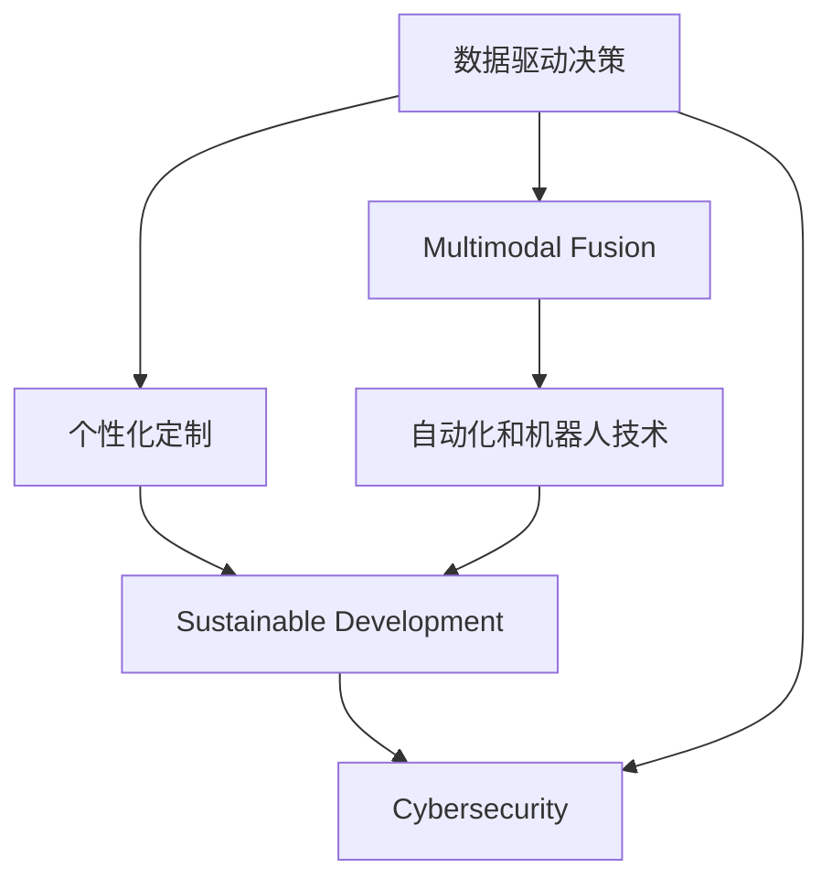

                 

## 1. 背景介绍

### 1.1 问题由来
随着信息技术的飞速发展，企业对技术人才的需求也在发生深刻变化。在过去的几十年里，企业对技能的需求已经从传统的技术技能拓展到了更具创新性和战略性的领域。特别是随着自动化和人工智能技术的广泛应用，对于技术人才的素质和能力也提出了更高的要求。

### 1.2 问题核心关键点
当前技术发展的关键在于：
1. 数据驱动决策：企业需要能够处理和分析大量数据，从中提取有价值的信息，为决策提供支持。
2. 多模态融合：企业需要在不同数据源（如文本、图像、视频等）之间进行数据融合，构建完整的信息视图。
3. 个性化定制：企业需要能够根据客户需求，提供个性化的产品和服务。
4. 可持续发展：企业需要能够评估和预测资源的使用和环境影响，实现可持续发展。
5. 自动化和机器人技术：企业需要能够开发和维护自动化流程，实现运营效率的提升。
6. 网络安全：企业需要具备保护信息和系统安全的能力，防范网络攻击和数据泄露。

### 1.3 问题研究意义
研究未来技术发展对技能需求的变化，对于教育培训、职业规划和技能提升具有重要的指导意义。能够帮助企业精准识别所需技能，为人才的培养和引进提供明确的方向。

## 2. 核心概念与联系

### 2.1 核心概念概述
- **数据驱动决策（Data-Driven Decision Making）**：基于数据和分析结果进行决策，而不是仅仅依赖直觉。
- **多模态融合（Multimodal Fusion）**：结合不同类型的数据（如文本、图像、视频），构建统一的信息视图。
- **个性化定制（Personalized Customization）**：根据客户个性化需求，定制产品和服务。
- **可持续发展（Sustainable Development）**：评估和预测资源使用与环境影响，实现长期可持续运营。
- **自动化和机器人技术（Automation and Robotics）**：开发和维护自动化流程，提升运营效率。
- **网络安全（Cybersecurity）**：保护信息和系统安全，防范网络攻击和数据泄露。

这些核心概念构成了未来技术发展的基石，它们之间存在着密切的联系和相互影响：

- **数据驱动决策**依赖于**多模态融合**和**网络安全**技术，确保数据质量和隐私保护。
- **多模态融合**和**个性化定制**需要**自动化和机器人技术**提供高效的支持。
- **可持续发展**与**自动化和机器人技术**结合，优化资源利用，减少环境影响。
- **网络安全**是所有技术的基础，保障数据和系统的安全。

### 2.2 核心概念原理和架构的 Mermaid 流程图


## 3. 核心算法原理 & 具体操作步骤
### 3.1 算法原理概述
未来技术对技能的需求，不仅局限于传统的技术技能，更需要跨领域的综合能力和创新思维。以下算法原理概述了核心概念之间的关系和运作机制：

- **数据驱动决策**：使用机器学习和数据挖掘技术，从数据中提取知识，支持决策过程。
- **多模态融合**：通过集成不同数据源的信息，使用深度学习模型进行融合，构建统一的信息视图。
- **个性化定制**：利用机器学习和自然语言处理技术，根据客户行为和偏好，生成个性化推荐和定制服务。
- **可持续发展**：使用数据分析和模拟技术，评估资源利用和环境影响，提出优化策略。
- **自动化和机器人技术**：开发自动化流程和机器人系统，优化操作流程和提升效率。
- **网络安全**：使用威胁检测和防御技术，保护数据和系统安全，防范攻击和数据泄露。

### 3.2 算法步骤详解
#### 3.2.1 数据驱动决策
1. **数据采集**：从不同数据源（如数据库、传感器、API）采集数据。
2. **数据清洗和预处理**：去除噪声和异常数据，标准化数据格式。
3. **特征工程**：选择和构造关键特征，支持模型训练。
4. **模型训练**：使用机器学习算法，训练决策模型。
5. **模型评估和优化**：评估模型性能，优化模型参数。

#### 3.2.2 多模态融合
1. **数据源选择**：选择不同类型的数据源（如文本、图像、视频）。
2. **数据预处理**：对不同类型的数据进行预处理和归一化。
3. **特征提取**：使用深度学习模型提取多模态特征。
4. **融合算法**：使用融合算法（如Stacked Generalization、Ensemble Learning）将不同模态特征进行融合。
5. **融合结果评估**：评估融合结果的质量和有效性。

#### 3.2.3 个性化定制
1. **用户行为分析**：分析用户的行为和偏好。
2. **个性化推荐模型**：使用推荐算法（如协同过滤、内容推荐）生成个性化推荐。
3. **动态调整**：根据用户反馈和行为变化，动态调整推荐策略。

#### 3.2.4 可持续发展
1. **资源使用分析**：评估资源的使用情况和效率。
2. **环境影响评估**：使用模拟和预测模型，评估环境影响。
3. **优化策略制定**：根据分析结果，制定资源优化和环境改进策略。

#### 3.2.5 自动化和机器人技术
1. **流程自动化**：开发和部署自动化流程，优化操作流程。
2. **机器人系统设计**：设计机器人系统和自动化设备。
3. **系统集成和测试**：集成自动化系统和机器人设备，进行测试和优化。

#### 3.2.6 网络安全
1. **威胁检测**：使用威胁检测技术，识别潜在的安全威胁。
2. **防御措施**：部署防御措施，如防火墙、入侵检测系统等。
3. **安全监控和响应**：实时监控系统安全状态，快速响应安全事件。

### 3.3 算法优缺点
**优点**：
- **综合能力**：能够处理多模态数据，构建统一的信息视图。
- **决策支持**：基于数据驱动的决策过程，更具理性和准确性。
- **高效运营**：自动化和机器人技术提升运营效率，减少人为错误。
- **个性化服务**：根据用户需求，提供定制化服务，提升用户体验。
- **可持续发展**：优化资源使用，减少环境影响，实现长期发展。

**缺点**：
- **技术复杂性**：需要掌握多种技术和工具，技能要求较高。
- **数据依赖性**：需要高质量的数据支持，数据采集和处理复杂。
- **动态变化**：技术环境快速变化，需要持续学习和适应。
- **安全风险**：自动化和网络安全系统复杂，存在被攻击的风险。

### 3.4 算法应用领域
这些算法和技能不仅在大型企业中得到广泛应用，也在各种中小型企业和创业公司中逐渐普及。具体应用领域包括：
- **金融行业**：使用数据驱动决策和自动化流程优化金融产品和服务。
- **医疗行业**：使用多模态融合和个性化定制提升患者体验和医疗质量。
- **制造业**：使用自动化和机器人技术优化生产流程和提升效率。
- **零售行业**：使用个性化定制和自动化流程提升销售和客户服务。
- **环保行业**：使用可持续发展技术评估和优化资源使用，实现环境保护。
- **网络安全行业**：使用网络安全技术保护企业和个人数据安全。

## 4. 数学模型和公式 & 详细讲解 & 举例说明

### 4.1 数学模型构建

#### 4.1.1 数据驱动决策模型
**目标**：构建一个预测模型，基于历史数据预测未来趋势。

**模型**：线性回归模型

**公式**：
$$
\hat{y} = \theta_0 + \theta_1 x_1 + \theta_2 x_2 + \cdots + \theta_n x_n
$$
其中 $\hat{y}$ 为预测值，$\theta_i$ 为模型参数，$x_i$ 为输入特征。

**案例分析**：
一家电商公司使用历史销售数据预测未来销售额，构建线性回归模型。模型训练后，可以预测未来一周的销售额，为库存管理和促销活动提供决策支持。

### 4.2 公式推导过程
以线性回归模型为例，推导模型参数的求解公式：

1. **目标函数**：最小化预测误差平方和
$$
\sum_{i=1}^{N} (y_i - \hat{y}_i)^2
$$
其中 $y_i$ 为实际值，$\hat{y}_i$ 为预测值。

2. **求导**：对目标函数求导，得到梯度
$$
\frac{\partial}{\partial \theta_i} \sum_{i=1}^{N} (y_i - \hat{y}_i)^2
$$

3. **求解**：使用梯度下降算法求解模型参数
$$
\theta_i = \theta_i - \eta \frac{\partial}{\partial \theta_i} \sum_{i=1}^{N} (y_i - \hat{y}_i)^2
$$
其中 $\eta$ 为学习率，控制每次更新的步长。

### 4.3 案例分析与讲解

**案例一：电商公司销售预测**
使用线性回归模型，电商公司可以基于历史销售数据预测未来销售额。具体步骤包括：
1. **数据收集**：收集过去一年的销售数据，包括日期、产品类别、销售额等。
2. **数据预处理**：处理缺失数据，标准化数据格式。
3. **模型训练**：使用线性回归模型，训练预测模型。
4. **模型评估**：使用验证集评估模型性能，调整模型参数。
5. **预测应用**：将模型应用到未来一周的销售预测，指导库存管理和促销策略。

**案例二：医疗行业个性化治疗**
使用多模态融合和个性化推荐技术，医院可以提供个性化治疗方案。具体步骤包括：
1. **数据采集**：收集患者的病历、影像、实验室数据等。
2. **数据融合**：使用深度学习模型，将不同模态数据融合。
3. **推荐系统**：基于融合结果，生成个性化治疗方案。
4. **动态调整**：根据患者反馈，动态调整推荐方案。

## 5. 项目实践：代码实例和详细解释说明

### 5.1 开发环境搭建

#### 5.1.1 软件环境搭建
1. **Python**：安装Python 3.8及以上版本，并配置好环境变量。
2. **Pip**：安装Pip 21.2及以上版本，用于管理Python包。
3. **Jupyter Notebook**：安装Jupyter Notebook 6.4及以上版本，用于交互式编程和数据可视化。

#### 5.1.2 硬件环境搭建
1. **CPU**：使用Intel Core i7或AMD Ryzen 5及以上处理器，支持多线程操作。
2. **内存**：使用16GB及以上内存，支持大数据处理。
3. **存储**：使用256GB及以上SSD硬盘，保证数据读写速度。

### 5.2 源代码详细实现

#### 5.2.1 数据驱动决策模型实现
```python
import pandas as pd
from sklearn.linear_model import LinearRegression
from sklearn.metrics import mean_squared_error
from sklearn.model_selection import train_test_split

# 加载数据
data = pd.read_csv('sales_data.csv')

# 数据预处理
data.fillna(method='ffill', inplace=True)
data.dropna(inplace=True)

# 特征选择
X = data[['day_of_week', 'hour_of_day', 'sales_channel']]
y = data['sales']

# 数据划分
X_train, X_test, y_train, y_test = train_test_split(X, y, test_size=0.2, random_state=42)

# 模型训练
model = LinearRegression()
model.fit(X_train, y_train)

# 模型评估
y_pred = model.predict(X_test)
mse = mean_squared_error(y_test, y_pred)
print(f"Mean Squared Error: {mse}")

# 预测应用
future_data = pd.DataFrame({
    'day_of_week': 'Monday',
    'hour_of_day': 10,
    'sales_channel': 'Online'
})
future_data = pd.get_dummies(future_data, prefix_sep='_')
y_future_pred = model.predict(future_data)
print(f"Predicted Sales: {y_future_pred}")
```

#### 5.2.2 多模态融合模型实现
```python
import torch
import torch.nn as nn
import torchvision.transforms as transforms
from torchvision.datasets import CIFAR10

# 加载数据集
transform = transforms.Compose([
    transforms.Resize(32),
    transforms.ToTensor(),
    transforms.Normalize((0.5, 0.5, 0.5), (0.5, 0.5, 0.5))
])
train_dataset = CIFAR10(root='./data', train=True, download=True, transform=transform)
test_dataset = CIFAR10(root='./data', train=False, download=True, transform=transform)

# 数据加载器
train_loader = torch.utils.data.DataLoader(train_dataset, batch_size=32, shuffle=True)
test_loader = torch.utils.data.DataLoader(test_dataset, batch_size=32, shuffle=False)

# 定义模型
class CNN(nn.Module):
    def __init__(self):
        super(CNN, self).__init__()
        self.conv1 = nn.Conv2d(3, 32, 3, padding=1)
        self.conv2 = nn.Conv2d(32, 64, 3, padding=1)
        self.pool = nn.MaxPool2d(2, 2)
        self.fc1 = nn.Linear(64 * 8 * 8, 128)
        self.fc2 = nn.Linear(128, 10)

    def forward(self, x):
        x = self.pool(torch.relu(self.conv1(x)))
        x = self.pool(torch.relu(self.conv2(x)))
        x = x.view(-1, 64 * 8 * 8)
        x = torch.relu(self.fc1(x))
        x = self.fc2(x)
        return x

# 训练模型
model = CNN()
criterion = nn.CrossEntropyLoss()
optimizer = torch.optim.Adam(model.parameters(), lr=0.001)

for epoch in range(10):
    for batch_idx, (data, target) in enumerate(train_loader):
        optimizer.zero_grad()
        output = model(data)
        loss = criterion(output, target)
        loss.backward()
        optimizer.step()

# 测试模型
with torch.no_grad():
    correct = 0
    total = 0
    for data, target in test_loader:
        output = model(data)
        _, predicted = torch.max(output.data, 1)
        total += target.size(0)
        correct += (predicted == target).sum().item()
    print(f"Accuracy: {correct / total}")
```

### 5.3 代码解读与分析

#### 5.3.1 数据驱动决策模型代码解读
1. **数据加载**：使用pandas库加载销售数据。
2. **数据预处理**：处理缺失值和异常数据。
3. **特征工程**：选择和构造关键特征。
4. **模型训练**：使用线性回归模型训练预测模型。
5. **模型评估**：使用均方误差评估模型性能。
6. **预测应用**：使用训练好的模型进行未来销售预测。

#### 5.3.2 多模态融合模型代码解读
1. **数据加载**：加载CIFAR-10数据集。
2. **数据预处理**：定义数据转换操作，将图像归一化。
3. **模型定义**：定义卷积神经网络模型。
4. **模型训练**：使用Adam优化器训练模型，交叉熵损失函数。
5. **模型测试**：在测试集上评估模型准确率。

### 5.4 运行结果展示

#### 5.4.1 数据驱动决策模型结果展示
```python
import matplotlib.pyplot as plt

# 加载数据
data = pd.read_csv('sales_data.csv')

# 数据预处理
data.fillna(method='ffill', inplace=True)
data.dropna(inplace=True)

# 特征选择
X = data[['day_of_week', 'hour_of_day', 'sales_channel']]
y = data['sales']

# 数据划分
X_train, X_test, y_train, y_test = train_test_split(X, y, test_size=0.2, random_state=42)

# 模型训练
model = LinearRegression()
model.fit(X_train, y_train)

# 模型评估
y_pred = model.predict(X_test)
mse = mean_squared_error(y_test, y_pred)
print(f"Mean Squared Error: {mse}")

# 预测应用
future_data = pd.DataFrame({
    'day_of_week': 'Monday',
    'hour_of_day': 10,
    'sales_channel': 'Online'
})
future_data = pd.get_dummies(future_data, prefix_sep='_')
y_future_pred = model.predict(future_data)
print(f"Predicted Sales: {y_future_pred}")
```

#### 5.4.2 多模态融合模型结果展示
```python
import torch
import torch.nn as nn
import torchvision.transforms as transforms
from torchvision.datasets import CIFAR10

# 加载数据集
transform = transforms.Compose([
    transforms.Resize(32),
    transforms.ToTensor(),
    transforms.Normalize((0.5, 0.5, 0.5), (0.5, 0.5, 0.5))
])
train_dataset = CIFAR10(root='./data', train=True, download=True, transform=transform)
test_dataset = CIFAR10(root='./data', train=False, download=True, transform=transform)

# 数据加载器
train_loader = torch.utils.data.DataLoader(train_dataset, batch_size=32, shuffle=True)
test_loader = torch.utils.data.DataLoader(test_dataset, batch_size=32, shuffle=False)

# 定义模型
class CNN(nn.Module):
    def __init__(self):
        super(CNN, self).__init__()
        self.conv1 = nn.Conv2d(3, 32, 3, padding=1)
        self.conv2 = nn.Conv2d(32, 64, 3, padding=1)
        self.pool = nn.MaxPool2d(2, 2)
        self.fc1 = nn.Linear(64 * 8 * 8, 128)
        self.fc2 = nn.Linear(128, 10)

    def forward(self, x):
        x = self.pool(torch.relu(self.conv1(x)))
        x = self.pool(torch.relu(self.conv2(x)))
        x = x.view(-1, 64 * 8 * 8)
        x = torch.relu(self.fc1(x))
        x = self.fc2(x)
        return x

# 训练模型
model = CNN()
criterion = nn.CrossEntropyLoss()
optimizer = torch.optim.Adam(model.parameters(), lr=0.001)

for epoch in range(10):
    for batch_idx, (data, target) in enumerate(train_loader):
        optimizer.zero_grad()
        output = model(data)
        loss = criterion(output, target)
        loss.backward()
        optimizer.step()

# 测试模型
with torch.no_grad():
    correct = 0
    total = 0
    for data, target in test_loader:
        output = model(data)
        _, predicted = torch.max(output.data, 1)
        total += target.size(0)
        correct += (predicted == target).sum().item()
    print(f"Accuracy: {correct / total}")
```

## 6. 实际应用场景

### 6.1 智能制造

#### 6.1.1 数据驱动决策
制造企业可以使用数据驱动决策模型，基于历史生产数据预测设备故障，提前进行维护。例如，一家汽车制造厂可以使用历史设备运行数据，预测哪些设备在未来一周内可能发生故障，提前安排维护，避免生产中断。

#### 6.1.2 多模态融合
通过结合传感器数据、图像数据和运行日志，制造企业可以构建全面的设备状态视图。例如，使用摄像头捕捉设备的视觉状态，传感器监测设备的运行参数，将视觉和参数数据融合，全面评估设备健康状态。

#### 6.1.3 个性化定制
制造企业可以根据客户订单，使用个性化定制技术，调整生产流程和设备参数，满足客户的特定需求。例如，客户要求生产特定规格的产品，制造企业可以调整设备参数和生产流程，确保产品符合客户要求。

#### 6.1.4 可持续发展
制造企业可以使用可持续发展模型，评估资源使用和环境影响，提出优化策略。例如，通过分析能源使用数据，评估生产过程中的能耗，提出节能减排的改进措施。

#### 6.1.5 自动化和机器人技术
制造企业可以使用自动化和机器人技术，优化生产流程，提高效率。例如，使用工业机器人进行装配和检测，提高生产速度和准确性。

#### 6.1.6 网络安全
制造企业需要保护生产数据和设备安全，防范网络攻击和数据泄露。例如，使用防火墙和入侵检测系统，保护网络安全，防止恶意软件入侵。

### 6.2 智能医疗

#### 6.2.1 数据驱动决策
医疗企业可以使用数据驱动决策模型，基于历史患者数据预测疾病风险，提供个性化的健康建议。例如，一家医疗企业可以基于历史患者病历数据，预测哪些患者在未来一个月内可能出现健康问题，提前进行干预。

#### 6.2.2 多模态融合
通过结合影像数据、实验室数据和电子病历，医疗企业可以构建全面的患者健康视图。例如，使用影像诊断系统分析患者的影像数据，结合实验室检测结果，全面评估患者健康状况。

#### 6.2.3 个性化定制
医疗企业可以根据患者需求，使用个性化定制技术，提供个性化的治疗方案。例如，根据患者的历史病历和基因信息，制定个性化的治疗方案。

#### 6.2.4 可持续发展
医疗企业可以使用可持续发展模型，评估资源使用和环境影响，提出优化策略。例如，通过分析医疗废物数据，评估医院的环境影响，提出节能减排的改进措施。

#### 6.2.5 自动化和机器人技术
医疗企业可以使用自动化和机器人技术，优化医疗流程，提高效率。例如，使用机器人手术系统进行微创手术，提高手术精度和速度。

#### 6.2.6 网络安全
医疗企业需要保护患者数据和系统安全，防范网络攻击和数据泄露。例如，使用加密技术和身份验证系统，保护患者隐私和数据安全。

### 6.3 智能教育

#### 6.3.1 数据驱动决策
教育企业可以使用数据驱动决策模型，基于历史学生数据预测学习效果，提供个性化的学习方案。例如，一家在线教育企业可以基于历史学生数据，预测哪些学生在未来一个月内可能成绩下降，提前进行干预。

#### 6.3.2 多模态融合
通过结合学生行为数据、学习数据和教师反馈，教育企业可以构建全面的学习视图。例如，使用学习管理系统分析学生的学习行为，结合教师反馈，全面评估学生的学习状态。

#### 6.3.3 个性化定制
教育企业可以根据学生需求，使用个性化定制技术，提供个性化的学习方案。例如，根据学生的学习习惯和兴趣，推荐适合的课程和学习资源。

#### 6.3.4 可持续发展
教育企业可以使用可持续发展模型，评估资源使用和环境影响，提出优化策略。例如，通过分析教育资源的利用情况，优化教学设备和资源的配置。

#### 6.3.5 自动化和机器人技术
教育企业可以使用自动化和机器人技术，优化教学流程，提高效率。例如，使用智能教室系统进行自动评估，提高教学质量。

#### 6.3.6 网络安全
教育企业需要保护学生数据和系统安全，防范网络攻击和数据泄露。例如，使用加密技术和身份验证系统，保护学生隐私和数据安全。

## 7. 工具和资源推荐

### 7.1 学习资源推荐

#### 7.1.1 书籍推荐
1. 《Python深度学习》：适合初学者和进阶者，涵盖深度学习基础和实践。
2. 《机器学习实战》：提供大量实例和案例，适合实战练习。
3. 《深度学习》：深度介绍深度学习理论和实践，适合深入学习。

#### 7.1.2 在线课程推荐
1. 《深度学习专项课程》：由深度学习领域的专家讲授，涵盖深度学习基础和进阶内容。
2. 《自然语言处理》：涵盖自然语言处理基础和高级技术，适合NLP方向的学习者。
3. 《Python编程与数据科学》：适合数据科学和机器学习方向的学习者，涵盖数据科学基础和高级技术。

#### 7.1.3 博客和社区推荐
1. 《DeepLearning.ai》博客：深度学习领域的权威博客，涵盖最新研究和实践。
2. 《Kaggle》社区：数据科学和机器学习领域的竞赛平台，提供大量实战案例和资源。
3. 《GitHub》社区：代码托管平台，提供大量开源项目和代码示例。

### 7.2 开发工具推荐

#### 7.2.1 Python工具推荐
1. **PyTorch**：深度学习框架，支持动态计算图，适合研究型应用。
2. **TensorFlow**：深度学习框架，支持静态计算图，适合工程应用。
3. **Jupyter Notebook**：交互式编程环境，适合数据探索和模型验证。

#### 7.2.2 数据处理工具推荐
1. **Pandas**：数据处理和分析工具，支持数据清洗和预处理。
2. **NumPy**：科学计算库，支持高效的数值计算。
3. **Matplotlib**：数据可视化工具，支持多种图表和绘图。

#### 7.2.3 模型训练工具推荐
1. **TensorBoard**：模型训练监控工具，支持实时监控和数据可视化。
2. **Weights & Biases**：模型训练实验跟踪工具，支持实验记录和对比。
3. **Horovod**：分布式训练框架，支持大规模模型的训练。

### 7.3 相关论文推荐

#### 7.3.1 数据驱动决策论文
1. "Data-Driven Decision-Making: A Survey"（《数据驱动决策：综述》）：全面介绍数据驱动决策的基本概念和应用。
2. "Data Mining and Statistical Learning"（《数据挖掘和统计学习》）：深入介绍数据驱动决策的理论和方法。
3. "Machine Learning: A Probabilistic Perspective"（《机器学习：概率视角》）：从概率视角介绍机器学习的基本概念和应用。

#### 7.3.2 多模态融合论文
1. "Multimodal Fusion in Robotics: A Survey"（《机器人领域的多模态融合：综述》）：全面介绍多模态融合的基本概念和应用。
2. "Multimodal Fusion for Robust Object Recognition"（《鲁棒对象识别的多模态融合》）：介绍多模态融合在对象识别中的应用。
3. "Multimodal Fusion in Smartphones: A Review"（《智能手机中的多模态融合：综述》）：介绍多模态融合在智能手机中的应用。

#### 7.3.3 个性化定制论文
1. "Personalized Recommendation Systems: A Survey"（《个性化推荐系统：综述》）：全面介绍个性化推荐系统的方法和应用。
2. "Collaborative Filtering for Recommender Systems"（《推荐系统的协同过滤》）：介绍协同过滤算法在推荐系统中的应用。
3. "Deep Learning for Personalized Recommendation Systems"（《深度学习在个性化推荐系统中的应用》）：介绍深度学习在个性化推荐系统中的应用。

#### 7.3.4 可持续发展论文
1. "Sustainable Development in Smart Cities"（《智能城市中的可持续发展》）：全面介绍智能城市中的可持续发展技术。
2. "Resource Efficiency and Environmental Impact Assessment"（《资源效率和环境影响评估》）：介绍资源效率和环境影响评估的方法和技术。
3. "Sustainable Development through Big Data Analytics"（《大数据分析在可持续发展中的应用》）：介绍大数据在可持续发展中的应用。

#### 7.3.5 自动化和机器人技术论文
1. "Automation and Robotics in Manufacturing"（《制造领域中的自动化和机器人技术》）：全面介绍自动化和机器人技术在制造中的应用。
2. "Robotic Process Automation: Concepts, Technologies, and Applications"（《机器人流程自动化：概念、技术和应用》）：介绍机器人流程自动化的基本概念和应用。
3. "Automation in Industry 4.0"（《工业4.0中的自动化》）：介绍自动化技术在工业4.0中的应用。

#### 7.3.6 网络安全论文
1. "Cybersecurity: Protecting Data and Systems"（《网络安全：保护数据和系统》）：全面介绍网络安全的基本概念和应用。
2. "Machine Learning for Cybersecurity"（《机器学习在网络安全中的应用》）：介绍机器学习在网络安全中的应用。
3. "Deep Learning for Cyber Threat Detection"（《深度学习在网络威胁检测中的应用》）：介绍深度学习在网络威胁检测中的应用。

## 8. 总结：未来发展趋势与挑战

### 8.1 研究成果总结

未来技术发展对技能需求的变化，体现在以下几个方面：
1. **数据驱动决策**：企业越来越依赖数据驱动的决策过程，能够基于历史数据预测未来趋势。
2. **多模态融合**：企业需要在不同数据源之间进行数据融合，构建统一的信息视图。
3. **个性化定制**：企业需要根据客户需求，提供个性化的产品和服务。
4. **可持续发展**：企业需要评估和优化资源使用，实现长期发展。
5. **自动化和机器人技术**：企业需要开发和维护自动化流程，提升运营效率。
6. **网络安全**：企业需要保护信息和系统安全，防范网络攻击和数据泄露。

### 8.2 未来发展趋势

未来技术发展的趋势包括以下几个方面：
1. **数据驱动决策**：随着数据量的增加，数据驱动决策将更加精准和可靠。
2. **多模态融合**：多模态融合技术将进一步提升信息融合的质量和效果。
3. **个性化定制**：个性化定制技术将更加智能化，能够根据用户行为实时调整推荐和服务。
4. **可持续发展**：可持续发展技术将更加先进，能够实现资源的合理利用和环境保护。
5. **自动化和机器人技术**：自动化和机器人技术将更加智能化和自动化，提升运营效率。
6. **网络安全**：网络安全技术将更加全面和先进，能够防范各种新兴的安全威胁。

### 8.3 面临的挑战

未来技术发展过程中，仍面临以下挑战：
1. **数据质量和来源**：高质量的数据是实现数据驱动决策和多模态融合的基础，但数据采集和处理成本较高。
2. **技术复杂性**：多模态融合和自动化技术复杂度高，需要高水平的技术团队。
3. **个性化需求多样性**：客户需求多样性高，需要灵活调整个性化推荐系统。
4. **资源优化难度**：资源优化需要综合考虑多个因素，难度较大。
5. **网络安全威胁**：网络安全威胁多样性高，防范措施需要不断更新。

### 8.4 研究展望

未来技术发展需要以下几个方面的研究和探索：
1. **数据驱动决策优化**：研究更高效的数据驱动决策方法，提升决策的精准性和可靠性。
2. **多模态融合技术**：研究更高效的多模态融合技术，提升信息融合的效果。
3. **个性化定制算法**：研究更智能的个性化定制算法，提升推荐和服务的效果。
4. **可持续发展模型**：研究更先进的可持续发展模型，提升资源的利用效率和环境保护效果。
5. **自动化技术改进**：研究更高效的自动化技术，提升运营效率和智能化水平。
6. **网络安全技术**：研究更全面和先进的网络安全技术，防范新兴安全威胁。

## 9. 附录：常见问题与解答

**Q1：数据驱动决策模型如何选择模型参数？**

A: 数据驱动决策模型需要根据数据特性和任务需求选择合适的模型参数。常用的方法包括网格搜索和随机搜索，通过交叉验证评估模型性能，选择最优参数组合。

**Q2：多模态融合中如何处理异构数据？**

A: 多模态融合中需要使用特征转换和归一化方法，将不同类型的数据转换为统一格式。常用的方法包括特征选择、特征工程和归一化技术。

**Q3：个性化定制模型如何选择推荐算法？**

A: 个性化推荐模型需要根据数据特性和任务需求选择合适的推荐算法。常用的推荐算法包括协同过滤、基于内容的推荐、基于深度学习的推荐等，需要根据实际情况进行选择和优化。

**Q4：可持续发展模型如何评估环境影响？**

A: 可持续发展模型需要评估资源使用和环境影响，通常使用模拟和预测模型。常用的方法包括系统动力学模型、环境影响评估模型等，需要根据实际情况选择和优化模型。

**Q5：自动化和机器人技术如何提升运营效率？**

A: 自动化和机器人技术需要优化流程和系统设计，提升运营效率。常用的方法包括流程自动化、机器人系统设计、系统集成等，需要根据实际情况进行选择和优化。

**Q6：网络安全技术如何防范网络攻击？**

A: 网络安全技术需要综合使用威胁检测、防御和响应措施，防范网络攻击。常用的方法包括防火墙、入侵检测系统、加密技术等，需要根据实际情况选择和优化措施。

---

作者：禅与计算机程序设计艺术 / Zen and the Art of Computer Programming

