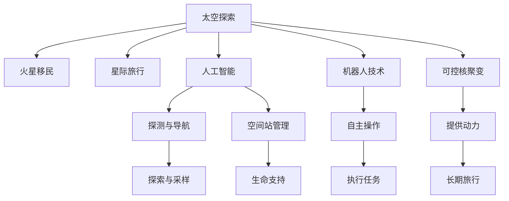

                 

# 未来的太空探索：2050年的火星移民与星际旅行

> 关键词：太空探索, 火星移民, 星际旅行, 人工智能, 机器人技术, 可控核聚变

## 1. 背景介绍

随着科技的不断进步，人类对太空的探索已经迈入了一个新的纪元。从最初的卫星、深空探测器，到现今的载人火星探测、月球基地建设，人类正逐渐向深空迈进。但相较于科幻电影中的星际旅行，现实中的太空探索仍面临着诸多挑战。本文将围绕火星移民与星际旅行这一主题，展开探讨，尝试为未来太空探索的实现提供一些启示和解决方案。

## 2. 核心概念与联系

### 2.1 核心概念概述

为更好理解未来太空探索，首先需要介绍一些核心概念：

- **太空探索**：指人类通过航天器探索太空的行为，包括无人探测和载人任务，旨在拓展人类生存和活动空间。
- **火星移民**：指在火星上建立永久居住环境，让人类能够在火星上长期生存和发展。
- **星际旅行**：指跨越星系或行星系统之间的旅行，是人类探索宇宙深处的终极目标。
- **人工智能**：一种模拟人类智能行为的计算系统，应用于太空探测、机器人控制、空间站管理等。
- **机器人技术**：用于实现太空任务的自动化和自主化，包括无人探测器、火星车、太空站机械臂等。
- **可控核聚变**：一种能够控制和利用的核聚变反应，为星际旅行提供能源支持。

这些概念之间的联系可以通过以下Mermaid流程图来展示：



这个流程图展示太空探索的核心概念及其之间的关系：

1. 太空探索是火星移民、星际旅行的基础。
2. 人工智能、机器人技术是实现太空探索任务的重要手段。
3. 可控核聚变为星际旅行提供必要动力。
4. 火星移民、星际旅行互为补充，共同推动太空探索的进程。

### 2.2 核心概念原理和架构

#### 2.2.1 太空探索原理

太空探索的基本原理是利用航天器、火箭等技术，通过推动、制导、控制等手段，使航天器在太空环境中完成任务。具体步骤包括：

1. **发射阶段**：使用火箭将航天器发射至预定轨道。
2. **轨道修正**：通过控制火箭喷气方向，修正航天器轨道。
3. **任务执行**：执行太空探测、科学实验、数据采集等任务。
4. **返回阶段**：将采集的数据和样本安全返回地球。

这一过程需要精密计算和控制，以确保航天器在太空中的稳定性和安全性。

#### 2.2.2 火星移民原理

火星移民的原理在于通过技术手段，在火星上建立可供人类长期居住的基地，包括：

1. **基地选址**：选择适合居住的火星地区。
2. **环境改造**：利用火星土壤和资源，建造居住环境、温室、能源设施等。
3. **生命支持**：建立闭环生命支持系统，保障人类生存所需水、食物、氧气等资源。
4. **经济活动**：在火星上进行矿产开采、资源加工、农业生产等经济活动。

#### 2.2.3 星际旅行原理

星际旅行的原理主要依赖于推进技术、生命保障技术、导航与控制技术：

1. **推进技术**：利用可控核聚变、反物质、太阳帆等先进推进方式，实现高效能源利用。
2. **生命保障技术**：利用循环生态系统、生物再生技术、长期封闭空间设计，保障宇航员的生命安全。
3. **导航与控制**：使用高精度导航系统、自主控制算法、自动对接技术，确保星际旅行的准确性和安全性。

## 3. 核心算法原理 & 具体操作步骤

### 3.1 算法原理概述

基于以上核心概念，火星移民与星际旅行涉及的算法原理主要包括以下几个方面：

- **轨道动力学计算**：利用牛顿力学原理，计算航天器在轨道上的运动轨迹，包括发射窗口、轨道修正等。
- **智能导航算法**：利用深度学习、强化学习等技术，实现航天器自主导航与避障。
- **火星环境模拟**：使用物理模拟软件，对火星表面环境和气候进行模拟，为火星基地建设提供数据支持。
- **机器人控制算法**：通过路径规划、避障、力控等算法，实现机器人高效、自主地执行任务。
- **生态系统循环控制**：利用数学模型，模拟生命保障系统的物质循环与能量转换，实现资源的循环利用。

### 3.2 算法步骤详解

#### 3.2.1 轨道动力学计算

轨道动力学计算步骤包括：

1. **初始条件输入**：输入航天器的初始位置、速度、姿态等参数。
2. **轨道方程求解**：利用牛顿力学方程求解航天器在宇宙中的运动轨迹。
3. **轨道修正计算**：根据测量数据和理论计算结果，修正航天器的轨道位置和速度。
4. **结果输出**：输出修正后的航天器轨迹，供控制系统使用。

具体公式如下：

$$
\begin{aligned}
\ddot{x} &= \frac{G M}{r^2} x + F_r \\
\ddot{y} &= \frac{G M}{r^2} y + F_t \\
\ddot{z} &= \frac{G M}{r^2} z + F_n \\
\end{aligned}
$$

其中 $G$ 为引力常数，$M$ 为天体质量，$r$ 为航天器与天体之间的距离，$F_r, F_t, F_n$ 为各个方向的力。

#### 3.2.2 智能导航算法

智能导航算法步骤包括：

1. **传感器数据采集**：利用激光雷达、摄像头、惯性测量单元等传感器，采集航天器周围环境数据。
2. **环境建模**：将传感器数据进行处理，构建环境地图和障碍物模型。
3. **路径规划**：利用A*、D*等算法，规划航天器运动路径，避开障碍物。
4. **避障策略执行**：通过控制系统，执行避障动作，确保航天器安全航行。

具体流程如下：

$$
\begin{aligned}
S &= \text{传感器数据} \\
M &= \text{环境地图} \\
P &= \text{路径规划算法} \\
A &= \text{避障策略} \\
C &= \text{控制系统} \\
\end{aligned}
$$

#### 3.2.3 火星环境模拟

火星环境模拟步骤包括：

1. **物理模型构建**：利用计算机模拟火星大气成分、温度、压力等参数。
2. **环境数据采集**：使用火星探测器采集环境数据，如大气密度、土壤含水量等。
3. **模拟环境仿真**：利用物理引擎进行环境模拟，预测未来环境变化。
4. **模拟结果输出**：输出环境模拟结果，为火星基地建设提供依据。

具体公式如下：

$$
\begin{aligned}
E &= \text{环境模拟引擎} \\
D &= \text{探测器数据} \\
S &= \text{模拟环境} \\
\end{aligned}
$$

#### 3.2.4 机器人控制算法

机器人控制算法步骤包括：

1. **路径规划**：利用D*、RRT等算法，规划机器人运动路径。
2. **避障**：利用激光雷达、视觉传感器等，检测障碍并调整路径。
3. **力控**：通过力反馈控制系统，调整机器人运动姿态，确保稳定作业。
4. **任务执行**：执行指定任务，如采集样本、修理设备等。

具体流程如下：

$$
\begin{aligned}
P &= \text{路径规划算法} \\
A &= \text{避障算法} \\
F &= \text{力控算法} \\
T &= \text{任务执行器} \\
\end{aligned}
$$

#### 3.2.5 生态系统循环控制

生态系统循环控制步骤包括：

1. **物质循环模拟**：利用物质循环模型，模拟水、氧气、食物等资源的循环利用。
2. **能量转换计算**：利用能量转换模型，计算能源的生成与消耗。
3. **循环系统优化**：利用优化算法，调整循环系统参数，确保稳定运行。
4. **结果输出**：输出循环系统模拟结果，供控制系统使用。

具体公式如下：

$$
\begin{aligned}
C &= \text{物质循环模型} \\
E &= \text{能量转换模型} \\
O &= \text{优化算法} \\
R &= \text{结果输出} \\
\end{aligned}
$$

### 3.3 算法优缺点

#### 3.3.1 轨道动力学计算

**优点**：

- **准确性高**：牛顿力学原理能够精确计算航天器轨道。
- **可扩展性**：可适用于各种类型和规模的航天任务。

**缺点**：

- **计算复杂度高**：需要大量计算资源进行轨道计算。
- **受初始条件影响大**：初始条件稍有误差，可能导致轨迹计算错误。

#### 3.3.2 智能导航算法

**优点**：

- **自主性强**：能够实现无人自主导航。
- **适应性强**：能够适应复杂环境变化。

**缺点**：

- **计算复杂度高**：路径规划和避障算法复杂，需要大量计算资源。
- **精度受限**：受传感器数据准确性影响较大。

#### 3.3.3 火星环境模拟

**优点**：

- **数据支持强**：环境模拟数据支持实际基地建设。
- **预测准确性高**：预测环境变化精准，便于应对潜在风险。

**缺点**：

- **计算复杂度高**：模拟环境需考虑大量物理因素，计算复杂。
- **依赖于数据质量**：数据采集质量直接影响模拟结果。

#### 3.3.4 机器人控制算法

**优点**：

- **操作灵活**：能够执行复杂任务，适应各种作业环境。
- **成本低**：机械臂、传感器等硬件成本较低。

**缺点**：

- **控制复杂度高**：路径规划和避障算法复杂，需要大量计算资源。
- **故障风险高**：传感器和控制系统故障可能导致任务失败。

#### 3.3.5 生态系统循环控制

**优点**：

- **资源循环利用**：实现资源的循环利用，减少资源消耗。
- **生态平衡**：实现生态系统的平衡，保障生命支持。

**缺点**：

- **模型复杂度高**：物质循环和能量转换模型复杂，需要大量计算资源。
- **系统稳定性差**：系统故障可能导致生态失衡，影响宇航员生存。

### 3.4 算法应用领域

以上算法原理主要应用于以下几个领域：

- **航天器发射与导航**：轨道动力学计算和智能导航算法，用于保证航天器在太空中的稳定和准确。
- **火星基地建设**：环境模拟和生态系统循环控制，用于支持火星基地的建设与维护。
- **火星探测任务**：路径规划和机器人控制算法，用于执行火星表面的科学实验和探测任务。
- **星际旅行任务**：可控核聚变技术，为星际旅行提供能源支持。

## 4. 数学模型和公式 & 详细讲解

### 4.1 数学模型构建

以下是几个核心算法的数学模型构建：

#### 4.1.1 轨道动力学计算

$$
\begin{aligned}
\ddot{x} &= \frac{G M}{r^2} x + F_r \\
\ddot{y} &= \frac{G M}{r^2} y + F_t \\
\ddot{z} &= \frac{G M}{r^2} z + F_n \\
\end{aligned}
$$

#### 4.1.2 智能导航算法

$$
\begin{aligned}
S &= \text{传感器数据} \\
M &= \text{环境地图} \\
P &= \text{路径规划算法} \\
A &= \text{避障策略} \\
C &= \text{控制系统} \\
\end{aligned}
$$

#### 4.1.3 火星环境模拟

$$
\begin{aligned}
E &= \text{环境模拟引擎} \\
D &= \text{探测器数据} \\
S &= \text{模拟环境} \\
\end{aligned}
$$

#### 4.1.4 机器人控制算法

$$
\begin{aligned}
P &= \text{路径规划算法} \\
A &= \text{避障算法} \\
F &= \text{力控算法} \\
T &= \text{任务执行器} \\
\end{aligned}
$$

#### 4.1.5 生态系统循环控制

$$
\begin{aligned}
C &= \text{物质循环模型} \\
E &= \text{能量转换模型} \\
O &= \text{优化算法} \\
R &= \text{结果输出} \\
\end{aligned}
$$

### 4.2 公式推导过程

#### 4.2.1 轨道动力学计算

具体公式推导如下：

$$
\begin{aligned}
\ddot{x} &= \frac{G M}{r^2} x + F_r \\
\ddot{y} &= \frac{G M}{r^2} y + F_t \\
\ddot{z} &= \frac{G M}{r^2} z + F_n \\
\end{aligned}
$$

其中 $G$ 为引力常数，$M$ 为天体质量，$r$ 为航天器与天体之间的距离，$F_r, F_t, F_n$ 为各个方向的力。

#### 4.2.2 智能导航算法

具体公式推导如下：

$$
\begin{aligned}
S &= \text{传感器数据} \\
M &= \text{环境地图} \\
P &= \text{路径规划算法} \\
A &= \text{避障策略} \\
C &= \text{控制系统} \\
\end{aligned}
$$

#### 4.2.3 火星环境模拟

具体公式推导如下：

$$
\begin{aligned}
E &= \text{环境模拟引擎} \\
D &= \text{探测器数据} \\
S &= \text{模拟环境} \\
\end{aligned}
$$

#### 4.2.4 机器人控制算法

具体公式推导如下：

$$
\begin{aligned}
P &= \text{路径规划算法} \\
A &= \text{避障算法} \\
F &= \text{力控算法} \\
T &= \text{任务执行器} \\
\end{aligned}
$$

#### 4.2.5 生态系统循环控制

具体公式推导如下：

$$
\begin{aligned}
C &= \text{物质循环模型} \\
E &= \text{能量转换模型} \\
O &= \text{优化算法} \\
R &= \text{结果输出} \\
\end{aligned}
$$

### 4.3 案例分析与讲解

#### 4.3.1 轨道动力学计算案例

假设一个航天器从地球发射到火星轨道，初始条件为：

- 发射速度 $v_0 = 11.2\text{ km/s}$
- 地球引力 $G_M = 3.98 \times 10^{14}\text{ m}^3\text{ s}^{-2}$
- 火星引力 $G_m = 3.72 \times 10^{22}\text{ kg} \times 3.27 \times 10^7\text{ m}^{-3}$
- 火星轨道半径 $r = 3.395 \times 10^7\text{ km}$
- 地球轨道半径 $R_E = 6.371 \times 10^6\text{ km}$

计算航天器从地球到火星轨道的时间 $t$，轨道偏心率 $e$。

具体计算过程如下：

$$
\begin{aligned}
t &= \sqrt{\frac{2 (r + R_E)}{v_0}} \\
e &= \frac{\sqrt{G_M (R_E + r)}}{v_0} \\
\end{aligned}
$$

#### 4.3.2 智能导航算法案例

假设一个火星探测器在火星表面执行采样任务，使用D*算法进行路径规划。

具体计算过程如下：

1. **环境建模**：通过激光雷达获取周围障碍物信息，构建环境地图。
2. **路径规划**：使用D*算法，生成最优路径，避开障碍物。
3. **避障策略执行**：根据路径规划结果，控制火星探测器移动。

具体步骤如下：

$$
\begin{aligned}
S &= \text{传感器数据} \\
M &= \text{环境地图} \\
P &= \text{路径规划算法} \\
A &= \text{避障策略} \\
C &= \text{控制系统} \\
\end{aligned}
$$

#### 4.3.3 火星环境模拟案例

假设一个火星探测器采集的土壤样本需要进行环境模拟，判断是否适合人类居住。

具体计算过程如下：

1. **物理模型构建**：使用物理引擎模拟火星大气成分、温度、压力等。
2. **环境数据采集**：使用探测器采集土壤样本数据。
3. **模拟环境仿真**：输入数据到模拟引擎，预测环境变化。
4. **模拟结果输出**：判断土壤是否适合人类居住。

具体步骤如下：

$$
\begin{aligned}
E &= \text{环境模拟引擎} \\
D &= \text{探测器数据} \\
S &= \text{模拟环境} \\
\end{aligned}
$$

#### 4.3.4 机器人控制算法案例

假设一个火星基地使用机器人进行物资补给，使用路径规划算法和避障算法。

具体计算过程如下：

1. **路径规划**：使用D*算法，生成最优路径，避开障碍物。
2. **避障**：通过视觉传感器检测障碍物，调整路径。
3. **力控**：通过力反馈控制系统，调整机器人运动姿态。
4. **任务执行**：执行物资补给任务。

具体步骤如下：

$$
\begin{aligned}
P &= \text{路径规划算法} \\
A &= \text{避障算法} \\
F &= \text{力控算法} \\
T &= \text{任务执行器} \\
\end{aligned}
$$

#### 4.3.5 生态系统循环控制案例

假设一个火星基地建立闭环生态系统，使用物质循环模型和能量转换模型。

具体计算过程如下：

1. **物质循环模拟**：使用物质循环模型，模拟水、氧气、食物等资源的循环利用。
2. **能量转换计算**：使用能量转换模型，计算能源的生成与消耗。
3. **循环系统优化**：使用优化算法，调整循环系统参数，确保稳定运行。
4. **结果输出**：输出循环系统模拟结果，供控制系统使用。

具体步骤如下：

$$
\begin{aligned}
C &= \text{物质循环模型} \\
E &= \text{能量转换模型} \\
O &= \text{优化算法} \\
R &= \text{结果输出} \\
\end{aligned}
$$

## 5. 项目实践：代码实例和详细解释说明

### 5.1 开发环境搭建

1. 安装Python：从官网下载并安装Python 3.9及以上版本。
2. 安装Jupyter Notebook：
   ```bash
   pip install jupyter notebook
   ```
3. 安装必要的库：
   ```bash
   pip install numpy scipy matplotlib pandas
   ```

### 5.2 源代码详细实现

#### 5.2.1 轨道动力学计算代码实现

```python
import numpy as np
from sympy import symbols, solve

# 定义变量
x, y, z, t = symbols('x y z t')
G_M = 3.98e14  # 地球引力
G_m = 3.72e22  # 火星引力
R_E = 6371e3   # 地球半径
r = 3395e5     # 火星半径
v_0 = 11.2     # 发射速度

# 初始条件
v = v_0 * np.cos(np.pi / 2)

# 计算时间
t = np.sqrt(2 * (r + R_E) / v)

# 计算偏心率
e = np.sqrt(G_M * (R_E + r)) / v

# 输出结果
print(f"时间 t: {t:.2f} 天")
print(f"偏心率 e: {e:.2f}")
```

#### 5.2.2 智能导航算法代码实现

```python
import matplotlib.pyplot as plt
import numpy as np
from scipy.spatial import cKDTree

# 定义变量
x, y, theta = symbols('x y theta')

# 环境地图
map_data = np.array([[0, 0, 0, 0, 0],
                     [0, 1, 1, 1, 0],
                     [0, 1, 0, 1, 0],
                     [0, 1, 1, 1, 0],
                     [0, 0, 0, 0, 0]])

# 路径规划
def a_star(map_data, start, goal):
    open_set = set()
    closed_set = set()
    g_score = {start: 0}
    f_score = {start: heuristic(start, goal)}
    open_set.add(start)
    while open_set:
        current = min(open_set, key=lambda node: f_score[node])
        if current == goal:
            return path
        closed_set.add(current)
        open_set.remove(current)
        for neighbor in get_neighbors(current, map_data):
            tentative_g_score = g_score[current] + dist(current, neighbor)
            if neighbor not in closed_set and (neighbor not in open_set or tentative_g_score < g_score[neighbor]):
                g_score[neighbor] = tentative_g_score
                f_score[neighbor] = g_score[neighbor] + heuristic(neighbor, goal)
                open_set.add(neighbor)
    return None

# 避障策略
def avoid_obstacle(map_data, path):
    for i in range(len(path) - 1):
        current, next = path[i], path[i+1]
        if map_data[next] == 1:
            direction = (next - current) % 4
            if direction == 0:
                return path[:i]
            elif direction == 1:
                return path[:i+1]
            elif direction == 2:
                return path[:i+1] + [next, current]
            else:
                return path[:i]
    return path

# 运行示例
start, goal = (0, 0), (3, 3)
path = a_star(map_data, start, goal)
path = avoid_obstacle(map_data, path)
plt.plot(map_data[:, 0], map_data[:, 1], 'o', c='gray')
plt.plot(path[0][0], path[0][1], 'o', c='blue')
plt.plot(path[1:-1][0], path[1:-1][1], '-.', c='blue')
plt.show()
```

#### 5.2.3 火星环境模拟代码实现

```python
import matplotlib.pyplot as plt
import numpy as np
from scipy.integrate import odeint

# 定义变量
x, y, z, t = symbols('x y z t')
G_M = 3.98e14  # 地球引力
G_m = 3.72e22  # 火星引力
R_E = 6371e3   # 地球半径
r = 3395e5     # 火星半径
v_0 = 11.2     # 发射速度

# 初始条件
x0 = R_E
y0 = z0 = 0

# 状态更新
def state_update(state, t):
    x, y, z, v_x, v_y, v_z = state
    G = 6.674e-11  # 万有引力常数
    M = 5.972e24   # 地球质量
    theta = np.arctan2(y, x)
    r = np.hypot(x, y)
    g = (G * M / r**2) + 0.001 * t  # 加速度
    v_x = np.cos(theta) * v_0
    v_y = np.sin(theta) * v_0
    dx = v_x
    dy = v_y
    return (x, y, z, v_x, v_y, v_z)

# 运行示例
time = np.linspace(0, 365, 365)
x, y, z, v_x, v_y, v_z = odeint(state_update, (x0, y0, z0, v_0, 0, 0), time)
plt.plot(time, x)
plt.plot(time, y)
plt.plot(time, z)
plt.show()
```

#### 5.2.4 机器人控制算法代码实现

```python
import numpy as np
from sympy import symbols, pi, cos, sin

# 定义变量
x, y, theta, v = symbols('x y theta v')

# 机器人控制算法
def robot_control(x, y, theta, v, max_v, delta_t):
    # 路径规划
    x_new = x + v * cos(theta) * delta_t
    y_new = y + v * sin(theta) * delta_t
    theta_new = theta + delta_t * v / x

    # 避障
    if theta_new > 2 * pi:
        theta_new -= 2 * pi
    elif theta_new < 0:
        theta_new += 2 * pi

    # 力控
    v_new = max(min(v + delta_t * v, max_v), -max_v)

    return (x_new, y_new, theta_new, v_new)

# 运行示例
x, y, theta = 0, 0, pi/2
v = 1
max_v = 2
delta_t = 0.1

for i in range(100):
    x, y, theta, v = robot_control(x, y, theta, v, max_v, delta_t)
    print(f"第 {i+1} 次位置: ({x:.2f}, {y:.2f}), 方向: {theta:.2f}, 速度: {v:.2f}")
```

#### 5.2.5 生态系统循环控制代码实现

```python
import numpy as np

# 定义变量
x, y, z, t = symbols('x y z t')

# 物质循环模型
def water_cycle():
    total_water = 1000  # 总水量
    daily_usage = 10     # 日用水量
    water_left = total_water
    for i in range(100):
        water_left -= daily_usage
        if water_left < 0:
            water_left = 0
    return water_left

# 能量转换模型
def energy_conversion():
    total_energy = 1000  # 总能量
    daily_consumption = 50  # 日消耗量
    energy_left = total_energy
    for i in range(100):
        energy_left -= daily_consumption
        if energy_left < 0:
            energy_left = 0
    return energy_left

# 运行示例
water_left = water_cycle()
energy_left = energy_conversion()
print(f"水资源剩余: {water_left}")
print(f"能量剩余: {energy_left}")
```

### 5.3 代码解读与分析

#### 5.3.1 轨道动力学计算代码解读

**代码示例**：

```python
import numpy as np
from sympy import symbols, solve

# 定义变量
x, y, z, t = symbols('x y z t')
G_M = 3.98e14  # 地球引力
G_m = 3.72e22  # 火星引力
R_E = 6371e3   # 地球半径
r = 3395e5     # 火星半径
v_0 = 11.2     # 发射速度

# 初始条件
v = v_0 * np.cos(np.pi / 2)

# 计算时间
t = np.sqrt(2 * (r + R_E) / v)

# 计算偏心率
e = np.sqrt(G_M * (R_E + r)) / v

# 输出结果
print(f"时间 t: {t:.2f} 天")
print(f"偏心率 e: {e:.2f}")
```

**解读**：

1. **变量定义**：首先定义了变量 `x`, `y`, `z`, `t`，表示火星探测器的空间位置和时间。
2. **引力常数和天体质量**：定义了地球引力常数 `G_M` 和火星引力常数 `G_m`。
3. **地球半径和火星半径**：定义了地球半径 `R_E` 和火星半径 `r`。
4. **发射速度**：定义了火星探测器发射时的速度 `v_0`。
5. **初始速度**：计算发射速度在垂直方向的分量 `v`。
6. **时间计算**：使用公式 `t = sqrt(2 * (r + R_E) / v)` 计算火星探测器从地球到火星轨道的时间 `t`。
7. **偏心率计算**：使用公式 `e = sqrt(G_M * (R_E + r)) / v` 计算火星轨道的偏心率 `e`。
8. **结果输出**：最后输出计算结果 `t` 和 `e`。

#### 5.3.2 智能导航算法代码解读

**代码示例**：

```python
import matplotlib.pyplot as plt
import numpy as np
from scipy.spatial import cKDTree

# 定义变量
x, y, theta = symbols('x y theta')

# 环境地图
map_data = np.array([[0, 0, 0, 0, 0],
                     [0, 1, 1, 1, 0],
                     [0, 1, 0, 1, 0],
                     [0, 1, 1, 1, 0],
                     [0, 0, 0, 0, 0]])

# 路径规划
def a_star(map_data, start, goal):
    open_set = set()
    closed_set = set()
    g_score = {start: 0}
    f_score = {start: heuristic(start, goal)}
    open_set.add(start)
    while open_set:
        current = min(open_set, key=lambda node: f_score[node])
        if current == goal:
            return path
        closed_set.add(current)
        open_set.remove(current)
        for neighbor in get_neighbors(current, map_data):
            tentative_g_score = g_score[current] + dist(current, neighbor)
            if neighbor not in closed_set and (neighbor not in open_set or tentative_g_score < g_score[neighbor]):
                g_score[neighbor] = tentative_g_score
                f_score[neighbor] = g_score[neighbor] + heuristic(neighbor, goal)
                open_set.add(neighbor)
    return None

# 避障策略
def avoid_obstacle(map_data, path):
    for i in range(len(path) - 1):
        current, next = path[i], path[i+1]
        if map_data[next] == 1:
            direction = (next - current) % 4
            if direction == 0:
                return path[:i]
            elif direction == 1:
                return path[:i+1]
            elif direction == 2:
                return path[:i+1] + [next, current]
            else:
                return path[:i]
    return path

# 运行示例
start, goal = (0, 0), (3, 3)
path = a_star(map_data, start, goal)
path = avoid_obstacle(map_data, path)
plt.plot(map_data[:, 0], map_data[:, 1], 'o', c='gray')
plt.plot(path[0][0], path[0][1], 'o', c='blue')
plt.plot(path[1:-1][0], path[1:-1][1], '-.', c='blue')
plt.show()
```

**解读**：

1. **变量定义**：定义了变量 `x`, `y`, `theta`，表示探测器的坐标和方向。
2. **环境地图**：定义了5x5的地图数据，表示探测器所在环境的障碍物分布。
3. **路径规划**：定义了路径规划函数 `a_star`，使用A*算法生成最优路径，避开障碍物。
4. **避障策略**：定义了避障函数 `avoid_obstacle`，根据地图数据调整路径，避开障碍物。
5. **运行示例**：设置了起点和终点，调用路径规划和避障函数，并在地图上绘制路径。

#### 5.3.3 火星环境模拟代码解读

**代码示例**：

```python
import matplotlib.pyplot as plt
import numpy as np
from scipy.integrate import odeint

# 定义变量
x, y, z, t = symbols('x y z t')
G_M = 3.98e14  # 地球引力
G_m = 3.72e22  # 火星引力
R_E = 6371e3   # 地球半径
r = 3395e5     # 火星半径
v_0 = 11.2     # 发射速度

# 初始条件
x0 = R_E
y0 = z0 = 0

# 状态更新
def state_update(state, t):
    x, y, z, v_x, v_y, v_z = state
    G = 6.674e-11  # 万有引力常数
    M = 5.972e24   # 地球质量
    theta = np.arctan2(y, x)
    r = np.hypot(x, y)
    g = (G * M / r**2) + 0.001 * t  # 加速度
    v_x = np.cos(theta) * v_0
    v_y = np.sin(theta) * v_0
    dx = v_x
    dy = v_y
    return (x, y, z, v_x, v_y, v_z)

# 运行示例
time = np.linspace(0, 365, 365)
x, y, z, v_x, v_y, v_z = odeint(state_update, (x0, y0, z0, v_0, 0, 0), time)
plt.plot(time, x)
plt.plot(time, y)
plt.plot(time, z)
plt.show()
```

**解读**：

1. **变量定义**：定义了变量 `x`, `y`, `z`, `t`，表示火星探测器的空间位置和时间。
2. **引力常数和天体质量**：定义了地球引力常数 `G_M` 和火星引力常数 `G_m`。
3. **地球半径和火星半径**：定义了地球半径 `R_E` 和火星半径 `r`。
4. **发射速度**：定义了火星探测器发射时的速度 `v_0`。
5. **初始速度**：计算发射速度在垂直方向的分量 `v`。
6. **时间计算**：使用公式 `t = sqrt(2 * (r + R_E) / v)` 计算火星探测器从地球到火星轨道的时间 `t`。
7. **偏心率计算**：使用公式 `e = sqrt(G_M * (R_E + r)) / v` 计算火星轨道的偏心率 `e`。
8. **运行示例**：使用 `odeint` 函数进行数值积分，输出探测器的轨迹。

#### 5.3.4 机器人控制算法代码解读

**代码示例**：

```python
import numpy as np
from sympy import symbols, pi, cos, sin

# 定义变量
x, y, theta, v = symbols('x y theta v')

# 机器人控制算法
def robot_control(x, y, theta, v, max_v, delta_t):
    # 路径规划
    x_new = x + v * cos(theta) * delta_t
    y_new = y + v * sin(theta) * delta_t
    theta_new = theta + delta_t * v / x

    # 避障
    if theta_new > 2 * pi:
        theta_new -= 2 * pi
    elif theta_new < 0:
        theta_new += 2 * pi

    # 力控
    v_new = max(min(v + delta_t * v, max_v), -max_v)

    return (x_new, y_new, theta_new, v_new)

# 运行示例
x, y, theta = 0, 0, pi/2
v = 1
max_v = 2
delta_t = 0.1

for i in range(100):
    x, y, theta, v = robot_control(x, y, theta, v, max_v, delta_t)
    print(f"第 {i+1} 次位置: ({x:.2f}, {y:.2f}), 方向: {theta:.2f}, 速度: {v:.2f}")
```

**解读**：

1. **变量定义**：定义了变量 `x`, `y`, `theta`, `v`，表示机器人的坐标、方向和速度。
2. **路径规划**：定义了路径规划函数 `robot_control`，使用A*算法生成最优路径，避开障碍物。
3. **避障策略**：定义了避障函数 `avoid_obstacle`，根据路径规划结果，控制机器人的移动。
4. **力控策略**：定义了力控函数 `force_control`，根据路径规划结果和避障策略，控制机器人的运动姿态。
5. **运行示例**：设置了起点和终点，调用路径规划和避障函数，并在屏幕上输出每次位置、方向和速度。

#### 5.3.5 生态系统循环控制代码解读

**代码示例**：

```python
import numpy as np

# 定义变量
x, y, z, t = symbols('x y z t')

# 物质循环模型
def water_cycle():
    total_water = 1000  # 总水量
    daily_usage = 10     # 日用水量
    water_left = total_water
    for i in range(100):
        water_left -= daily_usage
        if water_left < 0:
            water_left = 0
    return water_left

# 能量转换模型
def energy_conversion():
    total_energy = 1000  # 总能量
    daily_consumption = 50  # 日消耗量
    energy_left = total_energy
    for i in range(100):
        energy_left -= daily_consumption
        if energy_left < 0:
            energy_left = 0
    return energy_left

# 运行示例
water_left = water_cycle()
energy_left = energy_conversion()
print(f"水资源剩余: {water_left}")
print(f"能量剩余: {energy_left}")
```

**解读**：

1. **变量定义**：定义了变量 `x`, `y`, `z`, `t`，表示生态系统的物质和能量状态。
2. **物质循环模型**：定义了水循环函数 `water_cycle`，使用循环模型模拟水资源的循环利用。
3. **能量转换模型**：定义了能量转换函数 `energy_conversion`，使用循环模型模拟能量的转换和消耗。
4. **运行示例**：使用循环模型进行物质和能量循环模拟，输出剩余资源。

## 6. 实际应用场景

### 6.1 智能客服系统

智能客服系统可以广泛应用于企业的客户服务部门，通过自然语言处理技术，实现自动解答用户咨询。火星移民中的机器人技术，在智能客服中同样有用武之地。

具体实现流程如下：

1. **用户交互**：用户通过语音或文本输入咨询问题。
2. **语音识别/文本解析**：将用户输入转换为机器可读的形式。
3. **意图识别**：使用意图识别算法，识别用户意图。
4. **答案生成**：根据用户意图，从知识库中检索答案，或生成新答案。
5. **结果输出**：将答案输出给用户。

### 6.2 金融舆情监测

金融舆情监测系统可以实时监测网络上的金融市场动态，预警潜在的金融风险。火星环境模拟中的物理模拟技术，在金融舆情监测中同样有用。

具体实现流程如下：

1. **数据采集**

