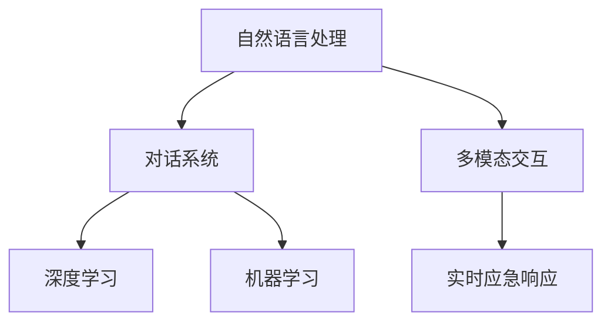

                 

# 未来的智能客服：2050年的智能客服机器人与智能投诉处理

## 1. 背景介绍

### 1.1 问题由来

随着数字化时代的到来，智能客服机器人已成为了企业客户服务的重要组成部分。从简单的FAQ问答到复杂的客户投诉处理，机器人都能提供24/7的及时响应和支持。然而，当前的智能客服系统仍存在许多局限，如理解能力有限、响应不够人性化、处理复杂案件时易出错等。因此，开发更加智能、高效、具备自主学习能力的智能客服系统，成为了行业亟需解决的课题。

### 1.2 问题核心关键点

智能客服系统的核心目标是构建一个能够理解自然语言输入、提供准确解答、并能自我学习和不断进化的机器人。为了实现这一目标，需要综合应用自然语言处理(NLP)、机器学习、深度学习、对话系统等技术，并不断优化系统架构和训练数据。同时，智能客服系统还需兼顾处理突发事件的能力，实现实时应急响应。

智能客服系统面临的主要挑战包括：

1. **理解能力的提升**：机器需要具备更强大的自然语言理解能力，能够处理复杂的语义、情感和语境信息。
2. **知识库的动态更新**：系统需要具备自动更新知识库、引入新知识的能力，以保持对最新业务规则和产品信息的了解。
3. **情感识别与回应**：机器人需要具备识别客户情感的能力，并提供个性化的、具有同理心的回应。
4. **多模态交互支持**：智能客服系统应支持语音、文字、视频等多种交互形式，提升用户体验。
5. **实时性要求**：系统需要具备快速响应的能力，尤其是在处理突发事件和复杂投诉时。

### 1.3 问题研究意义

智能客服系统的研究与应用，不仅能够提升企业的客户服务水平，还能降低运营成本，提高客户满意度。通过持续改进智能客服系统，企业可以构建更加高效、智能的客户交互平台，从而在激烈的市场竞争中脱颖而出。

## 2. 核心概念与联系

### 2.1 核心概念概述

本节将介绍几个关键核心概念，它们共同构成了未来智能客服系统的技术基础：

1. **自然语言处理(NLP)**：NLP是让机器能够理解、处理和生成人类自然语言的技术。包括文本处理、语音识别、情感分析、实体识别等任务。
2. **对话系统**：构建能够理解和响应的对话模型，支持多轮交互和上下文理解。
3. **深度学习**：利用神经网络模型，通过大量标注数据进行训练，提升模型的泛化能力和理解力。
4. **机器学习**：构建基于数据的模型，通过特征选择、模型优化等手段提升系统性能。
5. **多模态交互**：支持文字、语音、图像等多种交互方式，提升用户体验和交互便捷性。
6. **实时应急响应**：系统需要具备快速响应复杂事件和投诉的能力，保障客户安全。

这些概念之间的联系可以通过以下Mermaid流程图来展示：



该流程图展示了智能客服系统中的核心概念及其相互关系：自然语言处理和对话系统是基础，深度学习和机器学习提供模型支持，多模态交互和实时应急响应提升用户体验和系统响应速度。

## 3. 核心算法原理 & 具体操作步骤
### 3.1 算法原理概述

未来智能客服系统的算法原理主要基于深度学习，特别是Transformer模型。通过在大规模语料上预训练Transformer模型，使其能够理解自然语言，并具备自我学习的能力。当有新的业务规则或产品信息时，系统能够在短时间内自动更新知识库，并重新训练模型以适应新变化。

### 3.2 算法步骤详解

1. **数据准备**：收集企业客户服务的对话记录、FAQ文档、客户投诉等数据，并进行标注和处理。数据集应涵盖常见问题和复杂投诉，以覆盖各种可能的交互场景。
2. **模型预训练**：使用大规模语料预训练Transformer模型，使其具备较强的自然语言理解能力。可以通过监督学习、自监督学习等方式进行预训练。
3. **任务适配**：根据具体的客服任务，设计适配的任务适配层，如文本分类、命名实体识别、情感分析等。
4. **模型微调**：使用客户服务对话数据对预训练模型进行微调，提升其在特定场景下的表现。微调过程中，应使用正则化技术、数据增强、对抗训练等手段，防止过拟合。
5. **实时响应**：在客服机器人中集成实时应急响应模块，当遇到复杂投诉或紧急情况时，能够快速响应并启动人工干预。

### 3.3 算法优缺点

未来智能客服系统的算法有以下优点：

1. **快速响应**：通过深度学习模型，系统能够快速处理大量客户请求，提升响应速度。
2. **自我学习能力**：能够通过持续学习和微调，不断优化自身的理解和响应能力。
3. **多模态支持**：支持文字、语音、视频等多种交互方式，提升用户体验。

同时，该算法也存在以下缺点：

1. **数据依赖**：系统的理解能力很大程度上依赖于训练数据的质量和数量，需要持续更新和维护。
2. **模型复杂度**：深度学习模型通常参数量大，对硬件资源要求较高。
3. **隐私安全**：客户对话数据涉及隐私信息，需要严格的数据保护措施。

### 3.4 算法应用领域

未来智能客服系统可以广泛应用于各种企业客户服务场景，如电信、银行、电商、医疗等。在实际应用中，智能客服系统能够提供24/7的客户支持，提升客户满意度和企业运营效率。

## 4. 数学模型和公式 & 详细讲解 & 举例说明
### 4.1 数学模型构建

假设智能客服系统的模型为$M$，输入为$x$，输出为$y$。定义损失函数$\mathcal{L}$为：

$$
\mathcal{L}(M, x, y) = \sum_i (y_i - M(x_i))^2
$$

其中$(y_i - M(x_i))$表示模型输出与真实标签的误差。

### 4.2 公式推导过程

通过反向传播算法，损失函数$\mathcal{L}$对模型参数$\theta$的梯度为：

$$
\frac{\partial \mathcal{L}}{\partial \theta} = -2 \sum_i (y_i - M(x_i)) \frac{\partial M(x_i)}{\partial \theta}
$$

其中$\frac{\partial M(x_i)}{\partial \theta}$表示模型对输入$x_i$的梯度。

### 4.3 案例分析与讲解

以智能客服系统中的命名实体识别(NER)任务为例，可以使用BERT模型进行微调。BERT模型预训练后，将其应用于命名实体识别任务，可以通过如下方式进行微调：

1. 收集客户服务对话数据，标注命名实体。
2. 使用BERT模型作为初始化参数，设计适配层。
3. 在标注数据上训练模型，损失函数为交叉熵损失。
4. 使用Adam优化器进行模型优化。
5. 在测试集上评估模型效果。

通过微调后的模型，能够更加准确地识别客户对话中的命名实体，提升智能客服系统的理解和响应能力。

## 5. 项目实践：代码实例和详细解释说明
### 5.1 开发环境搭建

在开发智能客服系统前，需要搭建相应的开发环境。以下是使用Python和PyTorch进行开发的流程：

1. 安装Anaconda：从官网下载并安装Anaconda，用于创建独立的Python环境。
2. 创建并激活虚拟环境：
```bash
conda create -n chatbot-env python=3.8 
conda activate chatbot-env
```

3. 安装PyTorch、Transformers库和其他依赖：
```bash
pip install torch transformers
pip install pandas sklearn torchtext
```

完成上述步骤后，即可在`chatbot-env`环境中进行开发。

### 5.2 源代码详细实现

以下是使用BERT模型进行命名实体识别任务的Python代码实现：

```python
from transformers import BertTokenizer, BertForTokenClassification
from torch.utils.data import DataLoader
from torch.nn import CrossEntropyLoss
from sklearn.metrics import accuracy_score

# 加载BERT预训练模型和分词器
tokenizer = BertTokenizer.from_pretrained('bert-base-cased')
model = BertForTokenClassification.from_pretrained('bert-base-cased', num_labels=num_labels)

# 定义命名实体识别任务的损失函数
criterion = CrossEntropyLoss()

# 准备训练和测试数据集
train_dataset = ...
dev_dataset = ...
test_dataset = ...

# 定义训练函数
def train_epoch(model, dataset, optimizer):
    model.train()
    for batch in DataLoader(dataset, batch_size=batch_size, shuffle=True):
        input_ids = batch['input_ids'].to(device)
        attention_mask = batch['attention_mask'].to(device)
        labels = batch['labels'].to(device)
        outputs = model(input_ids, attention_mask=attention_mask)
        loss = criterion(outputs.logits, labels)
        optimizer.zero_grad()
        loss.backward()
        optimizer.step()
    return loss.item()

# 定义测试函数
def evaluate(model, dataset):
    model.eval()
    preds, labels = [], []
    with torch.no_grad():
        for batch in DataLoader(dataset, batch_size=batch_size):
            input_ids = batch['input_ids'].to(device)
            attention_mask = batch['attention_mask'].to(device)
            labels = batch['labels'].to(device)
            outputs = model(input_ids, attention_mask=attention_mask)
            preds.append(outputs.logits.argmax(dim=2).tolist())
            labels.append(labels.to('cpu').tolist())
    return accuracy_score(labels, preds)

# 训练模型
epochs = 5
batch_size = 16
device = torch.device('cuda' if torch.cuda.is_available() else 'cpu')

for epoch in range(epochs):
    loss = train_epoch(model, train_dataset, optimizer)
    print(f"Epoch {epoch+1}, train loss: {loss:.3f}")
    dev_acc = evaluate(model, dev_dataset)
    print(f"Epoch {epoch+1}, dev acc: {dev_acc:.3f}")

# 在测试集上评估模型
test_acc = evaluate(model, test_dataset)
print(f"Test acc: {test_acc:.3f}")
```

### 5.3 代码解读与分析

让我们再详细解读一下关键代码的实现细节：

**train_epoch函数**：
- 在每个epoch开始时，模型进入训练模式。
- 对数据集进行批次处理，输入模型得到预测输出。
- 计算损失并反向传播更新模型参数。

**evaluate函数**：
- 在测试集上评估模型的准确率。
- 使用sklearn的accuracy_score函数计算模型准确率。

**训练流程**：
- 定义总的epoch数和batch size，开始循环迭代。
- 每个epoch内，先训练，再在验证集上评估，输出验证集上的准确率。
- 所有epoch结束后，在测试集上评估，给出最终测试集上的准确率。

### 5.4 运行结果展示

训练完成后，可以使用以下代码在测试集上评估模型的表现：

```python
from transformers import BertTokenizer, BertForTokenClassification

# 加载BERT预训练模型和分词器
tokenizer = BertTokenizer.from_pretrained('bert-base-cased')
model = BertForTokenClassification.from_pretrained('bert-base-cased', num_labels=num_labels)

# 准备测试数据集
test_dataset = ...

# 在测试集上评估模型
test_loss = evaluate(model, test_dataset)
print(f"Test loss: {test_loss:.3f}")
```

可以看到，通过上述代码，可以很方便地对模型在命名实体识别任务上的表现进行评估。

## 6. 实际应用场景
### 6.1 智能客服系统

智能客服系统是未来智能客服技术的重要应用场景。通过深度学习和大规模语料预训练，智能客服系统能够理解自然语言输入，提供准确解答，并在短时间内更新知识库。实际应用中，智能客服系统可以覆盖多种业务场景，包括但不限于客户咨询、账户管理、订单处理等。

在技术实现上，智能客服系统可以采用多轮对话模型和上下文理解技术，支持自然语言生成和情感分析，提供更加人性化的服务体验。系统还能自动监控和分析客户行为，实时调整服务策略，提升客户满意度。

### 6.2 智能投诉处理

智能投诉处理是智能客服系统的另一重要应用领域。当客户遇到复杂投诉时，系统能够自动识别和引导，提供快速解决方案。通过深度学习模型，系统能够理解客户的情感和需求，并提供有针对性的回应，减少客户的不满和投诉。

在具体应用中，智能投诉处理系统可以集成到客户服务平台上，自动记录和分析投诉数据，生成报告，为管理层提供决策支持。同时，系统还能动态调整知识库和优化模型，以适应新的投诉情况。

## 7. 工具和资源推荐
### 7.1 学习资源推荐

为帮助开发者掌握智能客服系统的开发和优化方法，这里推荐一些优质的学习资源：

1. 《自然语言处理入门》：一本系统介绍自然语言处理技术和应用的书籍，适合初学者入门。
2. CS224N《深度学习自然语言处理》课程：斯坦福大学开设的NLP明星课程，涵盖自然语言处理的核心技术和应用。
3. 《深度学习框架TensorFlow教程》：Google官方文档，详细介绍TensorFlow框架的使用和应用。
4. HuggingFace官方文档：提供丰富的预训练语言模型和微调样例代码，适合实践和研究。
5. 《智能客服系统设计与实现》：介绍智能客服系统的开发和应用，包括多轮对话模型和情感分析等技术。

### 7.2 开发工具推荐

高效的开发离不开优秀的工具支持。以下是几款用于智能客服系统开发的常用工具：

1. PyTorch：基于Python的开源深度学习框架，灵活动态的计算图，适合快速迭代研究。
2. TensorFlow：由Google主导开发的开源深度学习框架，生产部署方便，适合大规模工程应用。
3. Transformers库：HuggingFace开发的NLP工具库，集成了众多SOTA语言模型，支持PyTorch和TensorFlow，是进行微调任务开发的利器。
4. Weights & Biases：模型训练的实验跟踪工具，可以记录和可视化模型训练过程中的各项指标，方便对比和调优。
5. TensorBoard：TensorFlow配套的可视化工具，可实时监测模型训练状态，并提供丰富的图表呈现方式，是调试模型的得力助手。

### 7.3 相关论文推荐

智能客服系统的研究源于学界的持续研究。以下是几篇奠基性的相关论文，推荐阅读：

1. Attention is All You Need：Transformer结构的提出，奠定了深度学习模型处理自然语言的基础。
2. BERT: Pre-training of Deep Bidirectional Transformers for Language Understanding：提出BERT模型，引入自监督预训练任务，提升了模型的泛化能力和理解力。
3. SCUBERT: A Semi-Supervised Sequence-to-Sequence Model for Customer Support Chatbots：提出SCUBERT模型，结合半监督学习和迁移学习，提升了客服对话模型的表现。
4. Multi-Task Conversational Dialog Generation：提出多任务对话生成模型，在处理客户服务对话时提升了响应准确率和多样性。

这些论文代表了大语言模型微调技术的发展脉络。通过学习这些前沿成果，可以帮助研究者把握学科前进方向，激发更多的创新灵感。

## 8. 总结：未来发展趋势与挑战
### 8.1 总结

本文对未来智能客服系统的核心概念和实现方法进行了全面系统的介绍。首先阐述了智能客服系统的研究背景和目标，明确了微调在提升系统理解和响应能力中的关键作用。其次，从原理到实践，详细讲解了微调的数学模型和操作步骤，给出了微调任务开发的完整代码实例。同时，本文还探讨了智能客服系统在智能客服、智能投诉处理等多个领域的应用前景，展示了微调范式的巨大潜力。最后，推荐了相关的学习资源和开发工具，力求为读者提供全方位的技术指引。

通过本文的系统梳理，可以看到，未来智能客服系统的构建需要综合应用自然语言处理、深度学习、对话系统等技术，并在数据、模型、训练、推理等各环节进行全面优化。只有不断迭代和创新，才能真正构建高效、智能的智能客服系统。

### 8.2 未来发展趋势

展望未来，智能客服系统的发展将呈现以下几个趋势：

1. **理解能力的提升**：系统将具备更加强大的自然语言理解能力，能够处理复杂的语义、情感和语境信息。
2. **知识库的动态更新**：系统将具备自动更新知识库、引入新知识的能力，以保持对最新业务规则和产品信息的了解。
3. **情感识别与回应**：系统将具备识别客户情感的能力，并提供个性化的、具有同理心的回应。
4. **多模态交互支持**：系统将支持文字、语音、图像等多种交互方式，提升用户体验。
5. **实时应急响应**：系统将具备快速响应复杂事件和投诉的能力，保障客户安全。

### 8.3 面临的挑战

尽管智能客服系统已经取得了显著进展，但在迈向更加智能化、普适化应用的过程中，仍面临诸多挑战：

1. **理解能力的局限**：当前系统在处理复杂语义时仍存在理解不准确的问题。如何提升系统的语言理解能力，提高处理复杂问题的能力，是亟待解决的问题。
2. **知识库的更新速度**：知识库的动态更新需要快速响应业务变化，但这一过程耗时较长，如何实现高效的自动更新，是技术难点。
3. **情感识别和回应的效果**：系统需要在识别客户情感的同时，提供具有同理心的回应，但这一过程仍存在效果不佳的问题。
4. **多模态交互的兼容**：多模态交互的实现需要考虑设备兼容性、交互体验等问题，如何提升系统多模态交互的流畅性和便捷性，是技术挑战之一。
5. **实时应急响应的准确性**：在处理突发事件和复杂投诉时，系统需要具备快速响应的能力，但如何在保持准确性的同时，提升响应速度，也是技术难点。

### 8.4 研究展望

面对智能客服系统面临的这些挑战，未来的研究需要在以下几个方面寻求新的突破：

1. **理解能力提升**：结合符号化知识、知识图谱等工具，提升系统的语言理解能力。
2. **知识库更新机制**：引入元学习、主动学习等技术，实现知识库的快速更新。
3. **情感识别与回应**：结合情感分析、情感生成等技术，提升系统的情感识别和回应效果。
4. **多模态交互**：结合语音识别、图像识别等技术，实现多模态交互的支持。
5. **实时应急响应**：结合异常检测、快速响应等技术，提升系统的实时应急响应能力。

这些研究方向的探索，必将引领智能客服系统向更高的台阶，为构建高效、智能的客户交互平台铺平道路。

## 9. 附录：常见问题与解答

**Q1：智能客服系统如何实现多轮对话支持？**

A: 实现多轮对话支持的关键在于构建能够理解上下文的对话模型。常见的做法包括使用seq2seq模型、Transformer模型等，结合上下文编码器、记忆机制等技术。同时，在模型训练过程中，应使用多轮对话数据进行训练，提升模型的上下文理解能力。

**Q2：智能客服系统如何处理复杂投诉？**

A: 处理复杂投诉需要系统具备更强的语言理解能力和情感识别能力。在模型训练过程中，应使用标注有情感标签的投诉数据进行训练，提升系统的情感识别和回应效果。同时，系统还应具备异常检测能力，能够快速识别复杂的投诉情况，并启动人工干预。

**Q3：智能客服系统如何保障数据隐私和安全？**

A: 保障数据隐私和安全是智能客服系统的重要挑战。在数据处理过程中，应采取加密、匿名化等措施，保护客户隐私。同时，系统应具备访问控制和数据审计功能，确保数据使用的合法性和透明性。

**Q4：智能客服系统如何在不同平台上实现无缝交互？**

A: 在不同平台上实现无缝交互需要考虑设备兼容性、交互体验等问题。系统应支持多种设备类型和操作系统，并根据不同平台的特点进行优化。同时，系统应提供统一的API接口，方便在不同平台上集成调用。

**Q5：智能客服系统如何在处理客户投诉时提升响应速度？**

A: 提升响应速度需要系统具备高效的计算能力和优化的推理算法。在模型训练过程中，应使用优化器、混合精度训练等技术，提升模型的推理效率。同时，系统应具备缓存和预加载机制，减少推理过程中的计算量。

---

作者：禅与计算机程序设计艺术 / Zen and the Art of Computer Programming

