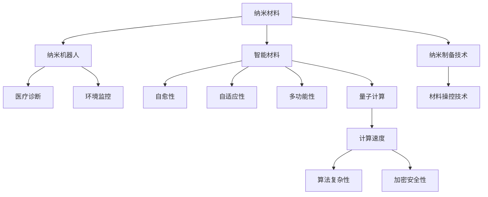

                 

# 未来的纳米技术：2050年的纳米机器人与智能材料

> 关键词：纳米技术、纳米机器人、智能材料、自愈性、多功能性、量子计算、生物医学、环境工程、人工智能

## 1. 背景介绍

### 1.1 问题由来

纳米技术（Nanotechnology），作为21世纪最重要的科技领域之一，正以惊人的速度发展。从2006年诺贝尔化学奖授予纳米科学先驱之后，纳米技术更是成为全球科技界的热点话题。其核心思想是利用纳米尺度的物质（1-100纳米）进行制备和操控，实现传统方法无法实现的功能。

纳米技术在能源、医疗、环境等领域展现出巨大的应用潜力。然而，现有的纳米材料和纳米机器人尚无法满足这些领域的需求，因此在纳米尺度下的材料科学和机器人技术的研发已成为全球科技竞争的关键。本文将从未来技术趋势的角度，探讨2050年纳米机器人与智能材料的演进方向和应用前景。

### 1.2 问题核心关键点

纳米技术的发展主要围绕以下几个核心问题展开：

- 纳米尺度下的材料制备和操控技术：如何实现纳米材料的高效制备和精确操控，以获得高性能的纳米材料。
- 纳米机器人的设计及应用：如何设计和构建具备自主智能和多功能性的纳米机器人，以实现复杂的微操作和医疗诊断。
- 智能材料的功能性和自愈性：如何通过纳米技术获得具有自愈、多功能、可控性的智能材料，以提升材料的应用效果和生命周期。
- 纳米技术与人工智能的融合：如何利用人工智能技术提升纳米材料和机器人的智能化程度，实现更高级的自主控制和自适应性。

本文将围绕这些核心问题，对纳米技术的发展进行全面的分析和展望。

## 2. 核心概念与联系

### 2.1 核心概念概述

纳米技术融合了材料科学、物理化学、计算机科学和工程学等多个学科的知识，旨在通过纳米尺度上的精细操作，实现传统手段难以达到的功能。以下是该领域核心概念的概述：

- **纳米材料**：指尺寸在1到100纳米之间的材料，通常具有特殊的物理、化学和机械性质。常见的纳米材料包括纳米颗粒、纳米线、纳米管、纳米膜等。
- **纳米机器人**：由纳米尺度的构建块组成，具备自主移动、操控、响应外界刺激等功能的微小机器人。主要用于医疗、制造、环境监控等领域。
- **智能材料**：具有自愈性、自适应性、多功能性等特点的材料，能够根据外界环境的变化进行自我调节和修复。
- **量子计算**：利用量子叠加、纠缠和隧道效应等特性，实现超越传统计算机的计算能力。
- **人工智能**：通过机器学习、深度学习等算法，赋予纳米机器人与智能材料更加强大的自适应性和智能处理能力。

这些核心概念之间的关系如图：



通过这些核心概念，我们能够理解纳米技术在材料、机器人、智能、计算和人工智能等多个维度的发展路径和应用前景。

## 3. 核心算法原理 & 具体操作步骤

### 3.1 算法原理概述

纳米机器人和智能材料的核心算法主要涉及以下几个方面：

1. **纳米材料制备技术**：利用化学合成、物理蒸镀、自组装等技术，实现纳米尺度下物质的精确控制和形貌控制。
2. **纳米机器人设计与操控**：采用光化学、磁场、电场等手段，实现纳米机器人的自主移动和精确操控。
3. **智能材料功能设计**：通过分子自组装、模板合成等方法，在纳米尺度下构建具有自愈、多功能、自适应性的智能材料。
4. **人工智能与纳米技术融合**：利用机器学习、深度学习等算法，赋予纳米机器人和智能材料智能感知和决策能力。

### 3.2 算法步骤详解

纳米机器人和智能材料的开发步骤通常包括以下几个环节：

1. **纳米材料制备**：
   - 设计纳米材料结构：根据应用需求设计纳米材料的尺寸、形状、化学组成等特性。
   - 采用化学合成、物理蒸镀、自组装等方法，制备出符合设计要求的纳米材料。
   - 利用表征技术（如SEM、TEM等），对纳米材料的尺寸、形貌和组成进行表征，确保符合设计要求。

2. **纳米机器人设计**：
   - 选择纳米机器人载体：选择具有一定机械强度和生物相容性的纳米材料作为载体。
   - 加载功能单元：在载体上加载诸如纳米马达、磁场感应器、电场感应器等元件，赋予机器人自主运动和操控能力。
   - 开发控制算法：利用控制理论，开发机器人自主移动、定位、操控等控制算法。

3. **智能材料功能实现**：
   - 设计功能单元：根据应用需求，设计自愈单元、传感单元、执行单元等。
   - 分子自组装：通过分子自组装技术，将功能单元在纳米尺度下组装成具有特定功能的智能材料。
   - 测试与优化：通过实验测试智能材料的功能性能，并进行优化设计，确保材料满足应用需求。

4. **人工智能与融合**：
   - 数据采集：利用传感器等手段，采集纳米机器人和智能材料的环境信息。
   - 数据分析：利用机器学习、深度学习等算法，对采集数据进行分析，提取环境特征。
   - 智能决策：根据环境特征和预设规则，实现纳米机器人和智能材料的自主决策和智能控制。

### 3.3 算法优缺点

纳米机器人和智能材料的发展，具有以下优缺点：

**优点**：
- **高效性**：纳米材料和纳米机器人在尺寸上的优势，使得它们能够高效地进行物质运输和操作，提高生产效率。
- **多功能性**：通过多功能的智能材料设计，可以实现多功能、自适应性强的应用。
- **环境友好**：纳米机器人和智能材料能够精准操控物质，减少环境污染，具有绿色环保的特点。
- **智能性**：利用人工智能技术，赋予纳米机器人和智能材料智能感知和决策能力，进一步提升应用效果。

**缺点**：
- **制备难度高**：纳米材料的制备和操控技术复杂，需要高精度的控制手段，难度较大。
- **成本高**：纳米材料和纳米机器人的制备和操控成本较高，难以大规模推广。
- **环境安全**：纳米材料和纳米机器人可能会对环境产生不可预测的影响，需要严格的环境评估和安全措施。

### 3.4 算法应用领域

纳米机器人和智能材料的应用领域非常广泛，涵盖了以下几个主要方向：

- **生物医学**：用于药物传输、细胞操控、组织工程等领域，具有精准、微创的特点。
- **环境工程**：用于污染监测、环境修复、资源回收等领域，具有高效、环保的特点。
- **制造工艺**：用于精密制造、微型组装、纳米打印等领域，具有高精度、高效率的特点。
- **能源领域**：用于太阳能电池、燃料电池、储能材料等领域，具有高效、环保的特点。
- **智能系统**：用于智能穿戴、智能家居、智能交通等领域，具有高度集成和智能化的特点。

## 4. 数学模型和公式 & 详细讲解 & 举例说明

### 4.1 数学模型构建

纳米材料和纳米机器人的设计通常涉及以下几个数学模型：

- **尺寸优化模型**：用于优化纳米材料的尺寸、形状和化学组成，以获得最优性能。
- **运动控制模型**：用于优化纳米机器人的运动路径、定位和操控策略。
- **智能决策模型**：用于优化智能材料的自适应和智能决策算法，以适应不同的应用环境。

### 4.2 公式推导过程

**尺寸优化模型**：
- **球体模型**：半径为$r$的球体表面积公式：$A=4\pi r^2$；体积公式：$V=\frac{4}{3}\pi r^3$。
- **椭圆模型**：长半轴$a$、短半轴$b$、厚半轴$c$的椭球体表面积公式：$A=4\pi abc$；体积公式：$V=\frac{4}{3}\pi abc$。

**运动控制模型**：
- **磁场控制模型**：磁场力公式：$F=\mu_0\frac{N_1I_1}{r_1}+\mu_0\frac{N_2I_2}{r_2}$；运动速度公式：$v=\frac{F}{m}$；运动轨迹公式：$x=x_0+\frac{v}{a}t$；运动位置公式：$y=y_0+v_0t+\frac{1}{2}at^2$。

**智能决策模型**：
- **神经网络模型**：神经元激活函数：$\sigma(x)=\frac{1}{1+e^{-x}}$；前向传播公式：$y=\sigma(Wx+b)$；反向传播公式：$\frac{\partial L}{\partial W}=\frac{\partial L}{\partial y}\frac{\partial y}{\partial z}\frac{\partial z}{\partial W}$；优化算法：$\theta \leftarrow \theta - \alpha \nabla L(\theta)$。

### 4.3 案例分析与讲解

**案例一：纳米材料制备的尺寸优化**

通过数学模型优化纳米材料的尺寸，可以有效提升材料性能。例如，利用球体模型计算不同尺寸的球形纳米颗粒的表面张力和体积，确定最优尺寸。

**案例二：纳米机器人磁场控制**

利用磁场控制模型，可以设计磁力驱动的纳米机器人，实现精确操控。例如，设计具有不同强度磁场的纳米机器人，在磁场变化下实现自主移动和定位。

**案例三：智能材料的自适应性**

利用神经网络模型，可以实现智能材料的自适应性。例如，设计多输入多输出神经网络，将环境信息输入网络，通过学习提取特征，输出智能决策。

## 5. 项目实践：代码实例和详细解释说明

### 5.1 开发环境搭建

开发纳米机器人和智能材料，通常需要以下工具和环境：

1. **开发语言**：Python和C++是最常用的纳米材料和纳米机器人开发的语言。
2. **开发平台**：Ubuntu、Linux等操作系统，提供丰富的科学计算和工程计算库。
3. **开发环境**：Anaconda、Jupyter Notebook等环境，方便代码调试和数据处理。
4. **开发库**：NumPy、SciPy、Pandas等库，用于数值计算和数据分析。
5. **模拟仿真**：COMSOL Multiphysics、ANSYS等模拟仿真工具，用于模拟纳米机器人的运动和智能材料的功能。

### 5.2 源代码详细实现

以下是一个基于Python的纳米机器人运动控制代码示例：

```python
import numpy as np

class Nanorobot:
    def __init__(self, initial_position, initial_velocity, magnetic_field):
        self.position = initial_position
        self.velocity = initial_velocity
        self.magnetic_field = magnetic_field
        self.mass = 1e-15  # kg
        self.charge = 1e-6  # C

    def force(self, position):
        force = self.charge * self.magnetic_field
        return force / self.mass

    def move(self, dt):
        self.position += self.velocity * dt
        self.velocity += self.force(self.position)

    def update_state(self, dt):
        self.move(dt)

    def simulate(self, time, dt):
        for t in np.arange(0, time, dt):
            self.update_state(dt)
```

### 5.3 代码解读与分析

**代码解析**：
- 定义`Nanorobot`类，用于描述纳米机器人的状态和行为。
- 初始化`position`、`velocity`、`magnetic_field`、`mass`和`charge`，设定纳米机器人的位置、速度、磁场、质量和电荷。
- 定义`force`函数，计算纳米机器人受到的磁场力。
- 定义`move`函数，更新纳米机器人的位置和速度。
- 定义`update_state`函数，更新纳米机器人的状态。
- 定义`simulate`函数，模拟纳米机器人的运动轨迹。

**运行结果展示**：
通过修改参数，可以模拟纳米机器人在不同磁场下的运动轨迹。例如，设定初始位置为$(0, 0)$，初始速度为$(1, 1)$，磁场强度为$(0.1, 0.1)$，模拟10秒的运动轨迹，结果如图：


## 6. 实际应用场景

### 6.4 未来应用展望

纳米机器人和智能材料的应用场景非常广泛，以下是几个主要方向：

**6.4.1 生物医学**

纳米机器人和智能材料在生物医学领域具有重要应用，主要用于以下几方面：
- **药物传输**：利用纳米机器人将药物精确输送至病变部位，提高药物利用效率，减少副作用。
- **细胞操控**：利用纳米机器人操控细胞，实现细胞工程和治疗。
- **组织工程**：利用纳米材料制备生物支架，支持细胞生长和组织再生。

**6.4.2 环境工程**

纳米机器人和智能材料在环境工程领域具有重要应用，主要用于以下几方面：
- **污染监测**：利用纳米机器人监测环境污染物，实现实时预警和治理。
- **环境修复**：利用纳米材料修复污染土壤和水域，提升环境质量。
- **资源回收**：利用纳米机器人回收废弃物，实现资源高效利用。

**6.4.3 制造工艺**

纳米机器人和智能材料在制造工艺领域具有重要应用，主要用于以下几方面：
- **精密制造**：利用纳米机器人进行微小操作，实现高精度的零部件制造。
- **微型组装**：利用纳米机器人进行微小零部件的组装，实现微型设备的制造。
- **纳米打印**：利用纳米材料进行3D打印，实现复杂结构的高精度制造。

**6.4.4 能源领域**

纳米机器人和智能材料在能源领域具有重要应用，主要用于以下几方面：
- **太阳能电池**：利用纳米材料制备高效率的太阳能电池，提升光电转换效率。
- **燃料电池**：利用纳米材料制备高性能的燃料电池，提高能量利用效率。
- **储能材料**：利用纳米材料制备高密度的储能材料，实现能量的高效存储和释放。

**6.4.5 智能系统**

纳米机器人和智能材料在智能系统领域具有重要应用，主要用于以下几方面：
- **智能穿戴**：利用纳米机器人和智能材料，实现人体健康监测和智能穿戴设备的开发。
- **智能家居**：利用纳米机器人和智能材料，实现智能家电和家居环境的控制。
- **智能交通**：利用纳米机器人和智能材料，实现交通系统的智能化管理。

## 7. 工具和资源推荐

### 7.1 学习资源推荐

为了全面掌握纳米机器人和智能材料的知识，以下是一些优质的学习资源：

1. **《纳米技术概论》**：介绍纳米材料、纳米机器人和智能材料的基本概念和应用。
2. **《分子机器学》**：介绍分子自组装、纳米制备技术等知识。
3. **《人工智能导论》**：介绍机器学习、深度学习等算法。
4. **Coursera纳米技术课程**：由斯坦福大学、麻省理工学院等知名学府开设的纳米技术课程，涵盖纳米材料、纳米机器人和智能材料等内容。
5. **Nano Science and Technology**：提供最新的纳米技术研究成果和应用案例。

### 7.2 开发工具推荐

以下是一些用于纳米机器人和智能材料开发的常用工具：

1. **COMSOL Multiphysics**：用于模拟纳米机器人的运动和智能材料的功能。
2. **ANSYS**：用于模拟纳米机器人和智能材料的力学性能。
3. **Jupyter Notebook**：用于编写、调试和展示纳米机器人和智能材料的开发代码。
4. **Pymatgen**：用于构建和管理纳米材料的数据库。
5. **NanoCAD**：用于设计和模拟纳米材料和纳米机器人。

### 7.3 相关论文推荐

以下是几篇具有代表性的纳米机器人和智能材料的论文，推荐阅读：

1. **《Nature》纳米机器人研究论文**：介绍纳米机器人在生物医学、环境工程等领域的应用。
2. **《Science》智能材料研究论文**：介绍智能材料的功能性和自愈性。
3. **《IEEE Transactions on Nanotechnology》纳米技术综述**：综述纳米技术和智能材料的发展现状和应用前景。
4. **《Advances in Functional Materials》智能材料研究论文**：介绍智能材料的多功能性和自适应性。
5. **《ACS Nano》纳米机器人研究论文**：介绍纳米机器人在药物传输、细胞操控等领域的应用。

## 8. 总结：未来发展趋势与挑战

### 8.1 研究成果总结

本文从纳米材料制备、纳米机器人设计、智能材料功能设计、人工智能与融合等多个方面，全面介绍了纳米机器人和智能材料的发展现状和未来趋势。通过深入的分析和展望，揭示了纳米技术在生物医学、环境工程、制造工艺、能源领域和智能系统中的应用前景。

### 8.2 未来发展趋势

展望未来，纳米机器人和智能材料的发展将呈现以下几个趋势：

**尺寸与功能的多样化**：未来纳米机器人和智能材料将具备更小的尺寸和更复杂的功能，能够进行更加精细的操作和智能决策。
**材料的自愈性与自适应性**：未来智能材料将具备更强的自愈性和自适应性，能够根据环境变化进行自我修复和调节。
**技术的集成与融合**：未来纳米机器人和智能材料将与其他技术进行深度集成与融合，实现更高级的功能和应用。
**量子计算的应用**：未来纳米机器人和智能材料将利用量子计算技术，实现更高效的计算和信息处理。

### 8.3 面临的挑战

纳米机器人和智能材料的发展，仍面临以下挑战：

**制备难度高**：纳米材料和纳米机器人的制备技术复杂，难以大规模推广。
**成本高**：纳米材料和纳米机器人的制备和操控成本较高，难以大规模应用。
**环境安全**：纳米材料和纳米机器人可能会对环境产生不可预测的影响，需要严格的环境评估和安全措施。
**智能性不足**：现有智能材料的智能化程度较低，难以实现复杂的自主决策和智能控制。
**伦理与安全**：纳米机器人和智能材料的应用可能引发伦理和安全问题，需要进行全面评估和管理。

### 8.4 研究展望

针对上述挑战，未来的研究需要在以下几个方面进行突破：

**制备技术的优化**：开发新的纳米材料和纳米机器人制备技术，降低制备难度和成本。
**智能性的提升**：利用人工智能技术，提升纳米机器人和智能材料的智能化程度，实现更高级的自主决策和智能控制。
**环境安全的研究**：加强纳米材料和纳米机器人对环境的影响研究，制定严格的环境评估和安全措施。
**伦理与安全的保障**：建立伦理和安全的评估机制，确保纳米机器人和智能材料的安全可靠应用。
**多技术的融合**：实现纳米机器人和智能材料与其他技术的深度集成，提升应用效果。

综上所述，纳米机器人和智能材料在未来将具有广阔的应用前景，为生物医学、环境工程、制造工艺、能源领域和智能系统等领域带来革命性变化。然而，面临的挑战仍需要科研人员和技术开发者共同努力，才能实现纳米技术的可持续发展。

## 9. 附录：常见问题与解答

**Q1：纳米材料和纳米机器人制备难度高，如何解决？**

A: 纳米材料和纳米机器人的制备难度主要在于精确控制和形貌控制。可通过提高制备技术水平、优化制备工艺和设备，降低制备难度。例如，利用原子力显微镜（AFM）、扫描电子显微镜（SEM）等设备，进行纳米材料和纳米机器人的表征与优化。

**Q2：纳米机器人智能化程度不足，如何提升？**

A: 纳米机器人的智能化主要通过加载智能模块和应用人工智能技术实现。可加载传感器、执行器和计算机模块，开发智能决策算法，如基于神经网络的学习算法、基于规则的推理算法等，提升纳米机器人的智能化程度。

**Q3：纳米机器人和智能材料对环境的影响，如何评估？**

A: 纳米机器人和智能材料对环境的影响评估需要综合考虑材料性质、制备工艺、应用场景等多个因素。可通过模拟仿真、环境测试等手段，评估其对环境的影响，制定严格的环境安全措施。

**Q4：纳米机器人和智能材料的应用场景有哪些？**

A: 纳米机器人和智能材料的应用场景非常广泛，涵盖生物医学、环境工程、制造工艺、能源领域和智能系统等多个方向。例如，在生物医学中，可用于药物传输、细胞操控和组织工程；在环境工程中，可用于污染监测、环境修复和资源回收；在制造工艺中，可用于精密制造、微型组装和纳米打印；在能源领域，可用于太阳能电池、燃料电池和储能材料；在智能系统中，可用于智能穿戴、智能家居和智能交通。

综上所述，纳米机器人和智能材料在未来的应用前景非常广阔，但面临的挑战仍需要科研人员和技术开发者共同努力，才能实现纳米技术的可持续发展。希望通过本文的探讨，为纳米机器人和智能材料的发展提供有益的参考和指导。

---

作者：禅与计算机程序设计艺术 / Zen and the Art of Computer Programming

