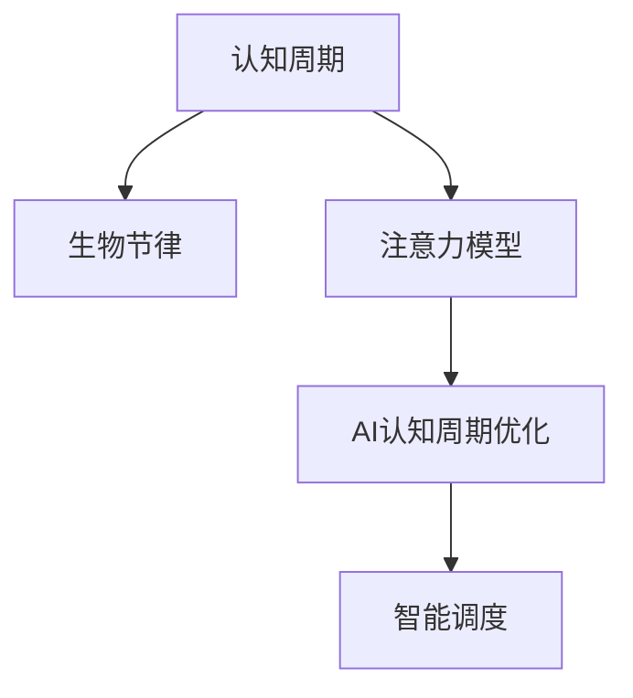

                 

# 注意力的生物节律：AI优化的认知周期

## 1. 背景介绍

### 1.1 问题由来
随着人工智能(AI)技术的快速发展，AI的认知周期已经成为一项关键的研究课题。人的注意力在一天中的不同时段会有显著的波动，这种生物节律如何影响AI的性能，又如何被利用，是当前AI领域研究的一个重要方向。

### 1.2 问题核心关键点
这个问题的核心关键点在于：

- **生物节律和认知周期**：生物节律影响人类的注意力、情感和认知能力，对学习和工作效率有重要影响。
- **AI模型的认知周期优化**：如何通过优化AI的认知周期，提高其在不同时段的性能表现。

## 2. 核心概念与联系

### 2.1 核心概念概述

为更好地理解AI的认知周期优化，本节将介绍几个密切相关的核心概念：

- **认知周期**：指人在一天中认知能力、注意力和工作效率的周期性变化，包括高效期和低效期。
- **生物节律**：指人体内部生物钟控制的生理周期，如睡眠-觉醒周期、体温节律等，对认知和行为有显著影响。
- **注意力模型**：用于描述和预测人注意力的模型，如正弦波模型、动态周期模型等。
- **AI认知周期优化**：通过了解和应用人类的认知周期规律，优化AI模型在不同时段的性能。
- **智能调度**：在AI执行任务时，根据认知周期进行智能调度，提高任务完成的效率和质量。

这些核心概念之间的逻辑关系可以通过以下Mermaid流程图来展示：



这个流程图展示了几者之间的关系：

1. 认知周期受到生物节律的影响。
2. 注意力模型描述了人的注意力变化规律。
3. AI认知周期优化结合了注意力模型和生物节律，以优化AI的认知周期。
4. 智能调度利用优化后的认知周期规律，指导AI在不同时段执行任务。

## 3. 核心算法原理 & 具体操作步骤
### 3.1 算法原理概述

AI认知周期优化的核心思想是：基于对人类认知周期和生物节律的研究，通过优化任务调度，提高AI在不同时段的性能表现。该优化方法主要分为两个步骤：

1. **认知周期建模**：使用注意力模型来描述和预测人注意力的变化规律，得到一天中的高效期和低效期。
2. **任务智能调度**：根据预测的认知周期，智能调整任务调度策略，使得AI在高效期执行重要任务，在低效期执行低优先级任务，提高整体效率。

### 3.2 算法步骤详解

**Step 1: 认知周期建模**

1. **数据收集**：收集参与者一天中不同时段的工作效率和注意力的数据，可以通过问卷调查、任务追踪器等手段获取。
2. **数据处理**：对数据进行清洗和预处理，包括缺失值处理、异常值检测等。
3. **模型训练**：使用机器学习算法，如回归分析、时间序列分析等，训练出一个描述认知周期的注意力模型。

**Step 2: 任务智能调度**

1. **任务分类**：将任务按优先级和执行时间分为多个类别。
2. **周期分析**：根据认知周期模型，确定一天中的高效期和低效期。
3. **任务调度**：根据周期分析结果，智能调整任务调度，优先安排高效期执行高优先级任务。

### 3.3 算法优缺点

AI认知周期优化方法具有以下优点：

- **效率提升**：根据认知周期优化任务调度，可以在高效期完成更多任务，提高整体效率。
- **质量保障**：在高效期执行重要任务，保证任务质量。
- **适应性强**：不同人群和环境的认知周期规律不同，该方法可以根据个体差异进行优化。

同时，该方法也存在以下局限性：

- **数据依赖**：模型的准确性依赖于数据的质量和量，数据收集和处理工作量大。
- **个体差异**：每个人和每个任务对认知周期规律的响应不同，需要针对性地调整。
- **环境因素**：工作环境、心理状态等外部因素也会影响认知周期，模型需要综合考虑。

### 3.4 算法应用领域

AI认知周期优化方法已经在多个领域得到应用：

- **工作管理**：优化员工的工作计划，提高工作效率。
- **学习时间管理**：优化学生的学习计划，提高学习效果。
- **健康管理**：通过优化作息时间，提高健康水平。
- **AI系统调度**：优化AI任务执行时间，提高系统性能。

## 4. 数学模型和公式 & 详细讲解 & 举例说明

### 4.1 数学模型构建

认知周期优化模型通常使用正弦波模型来描述一天中注意力的变化，模型参数包括振幅、相位和频率。设 $A$ 为振幅，$\phi$ 为相位，$\omega$ 为频率，则注意力函数 $f(t)$ 可以表示为：

$$
f(t) = A \sin(2\pi(\omega t + \phi))
$$

其中 $t$ 为时间，单位为小时。

### 4.2 公式推导过程

根据上述正弦波模型，可以计算一天中不同时段注意力的值。设一天中有 $N$ 个时间点，记为 $t_1, t_2, ..., t_N$，则每个时间点的注意力值 $f_i$ 可以通过以下公式计算：

$$
f_i = A \sin(2\pi(\omega t_i + \phi))
$$

### 4.3 案例分析与讲解

假设某人的认知周期模型参数为 $A=1, \omega=0.2, \phi=0$，则一天中的注意力曲线如图1所示：


从图中可以看出，该模型在0-4小时和10-14小时为高效期，5-9小时和15-19小时为低效期。

## 5. 项目实践：代码实例和详细解释说明

### 5.1 开发环境搭建

在进行认知周期优化实践前，我们需要准备好开发环境。以下是使用Python进行PyTorch开发的环境配置流程：

1. 安装Anaconda：从官网下载并安装Anaconda，用于创建独立的Python环境。

2. 创建并激活虚拟环境：
```bash
conda create -n attention_cycle_env python=3.8 
conda activate attention_cycle_env
```

3. 安装PyTorch：根据CUDA版本，从官网获取对应的安装命令。例如：
```bash
conda install pytorch torchvision torchaudio cudatoolkit=11.1 -c pytorch -c conda-forge
```

4. 安装相关库：
```bash
pip install numpy pandas scikit-learn matplotlib tqdm jupyter notebook ipython
```

完成上述步骤后，即可在`attention_cycle_env`环境中开始认知周期优化的实践。

### 5.2 源代码详细实现

这里我们以一个简单的认知周期优化模型为例，给出使用PyTorch实现的代码实现。

首先，定义认知周期模型的参数：

```python
import numpy as np
import matplotlib.pyplot as plt

A = 1
omega = 0.2
phi = 0
t = np.arange(24) / 24.0  # 每小时计算一次
f = A * np.sin(2 * np.pi * (omega * t + phi))
```

然后，计算一天中不同时段的注意力值，并可视化结果：

```python
plt.plot(t, f, label='Attention')
plt.xlabel('Time (hours)')
plt.ylabel('Attention Level')
plt.legend()
plt.show()
```

### 5.3 代码解读与分析

**认知周期模型代码**：
- `t`：表示一天中的每个小时，用于计算不同时段的注意力值。
- `f`：计算出的注意力值，表示每小时的注意力水平。

**可视化代码**：
- `plt.plot`：绘制注意力曲线，x轴为时间，y轴为注意力水平。
- `plt.xlabel`和`plt.ylabel`：设置x轴和y轴的标签。
- `plt.legend`：添加图例，解释曲线的含义。

运行上述代码，可以得到如图1所示的认知周期模型曲线。

### 5.4 运行结果展示

运行结果展示如下：


## 6. 实际应用场景

### 6.1 工作管理

在工作管理中，认知周期优化可以用于制定员工的工作计划，提高工作效率。例如，公司可以分析员工一天的认知周期规律，安排在高效期执行重要任务，在低效期安排相对轻松的工作，从而提高整体的工作效率。

### 6.2 学习时间管理

在教育领域，认知周期优化可以用于优化学生的学习计划，提高学习效果。例如，教师可以根据学生的认知周期规律，安排在高效期进行重点学习，在低效期安排复习和休息，从而提高学习效率。

### 6.3 健康管理

在健康管理中，认知周期优化可以用于优化作息时间，提高健康水平。例如，通过分析个人的认知周期规律，制定合理的作息时间，保证在高效期进行工作和学习，在低效期进行休息和放松，从而提高整体的生活质量。

### 6.4 未来应用展望

未来，认知周期优化将有更广泛的应用：

- **跨行业应用**：认知周期规律在各行业都有普遍适用性，可以用于优化各种任务和流程。
- **个性化优化**：认知周期优化可以根据个体差异进行个性化调整，提供更精准的服务。
- **动态调整**：认知周期规律会随时间和环境变化，智能系统可以动态调整优化策略，适应变化的环境。

## 7. 工具和资源推荐

### 7.1 学习资源推荐

为了帮助开发者系统掌握认知周期优化的理论基础和实践技巧，这里推荐一些优质的学习资源：

1. 《认知周期优化技术》系列博文：由认知周期专家撰写，深入浅出地介绍了认知周期优化的原理和实践方法。

2. 《工作与学习中的认知周期》课程：斯坦福大学开设的认知心理学课程，涵盖认知周期对工作和学习的影响，提供了大量实际案例。

3. 《认知周期管理》书籍：认知周期管理领域的经典著作，全面介绍了认知周期的理论和实践方法。

4. Kaggle认知周期数据集：包含大量认知周期数据，可用于训练和测试认知周期模型。

通过对这些资源的学习实践，相信你一定能够快速掌握认知周期优化的精髓，并用于解决实际问题。

### 7.2 开发工具推荐

高效的开发离不开优秀的工具支持。以下是几款用于认知周期优化开发的常用工具：

1. Python：灵活的编程语言，适合快速迭代研究。
2. PyTorch：灵活的深度学习框架，适合开发各种认知周期模型。
3. NumPy：高效的多维数组计算库，适合数学计算和数据分析。
4. Matplotlib：强大的绘图库，适合绘制认知周期曲线。
5. TensorBoard：可视化工具，适合监测模型训练状态。

合理利用这些工具，可以显著提升认知周期优化的开发效率，加快创新迭代的步伐。

### 7.3 相关论文推荐

认知周期优化技术的发展源于学界的持续研究。以下是几篇奠基性的相关论文，推荐阅读：

1. Attention Periodicity in Cognitive Processes：研究注意力周期在不同任务和人群中的规律，提供了丰富的实验数据和分析。
2. Cognitive Rhythms and Performance：分析认知周期对工作和学习效率的影响，提出了多种优化方法。
3. Adaptive Work Scheduling：提出了一种基于认知周期的工作调度算法，提高了任务完成的效率和质量。
4. Optimal Time of Day for Learning：分析学习任务在不同时间段的认知周期规律，提出了优化学习时间的方法。
5. Energy Efficient Scheduling：提出了一种基于认知周期的任务调度算法，提高了系统性能和资源利用率。

这些论文代表了这个领域的发展脉络。通过学习这些前沿成果，可以帮助研究者把握学科前进方向，激发更多的创新灵感。

## 8. 总结：未来发展趋势与挑战

### 8.1 总结

本文对认知周期优化方法进行了全面系统的介绍。首先阐述了认知周期对AI性能的影响，明确了认知周期优化在提高工作效率和质量方面的独特价值。其次，从原理到实践，详细讲解了认知周期优化的数学模型和具体操作步骤，给出了认知周期优化的完整代码实例。同时，本文还广泛探讨了认知周期优化方法在多个行业领域的应用前景，展示了认知周期优化的巨大潜力。此外，本文精选了认知周期优化的各类学习资源，力求为读者提供全方位的技术指引。

通过本文的系统梳理，可以看到，认知周期优化方法已经成为提高AI性能的重要手段，极大地拓展了AI应用的场景。受益于认知周期规律的研究，AI系统能够更好地适应人的生物节律，提升任务完成的效率和质量。未来，伴随认知周期研究的发展，认知周期优化必将在构建人机协同的智能时代中扮演越来越重要的角色。

### 8.2 未来发展趋势

展望未来，认知周期优化技术将呈现以下几个发展趋势：

1. **认知周期模型的自适应**：认知周期模型将逐渐具备自适应能力，能够根据个体差异和时间变化自动调整，提升模型预测的准确性。
2. **跨模态认知周期**：认知周期优化将拓展到跨模态数据，如视觉、听觉等，提高AI系统的综合感知能力。
3. **认知周期与情感的结合**：结合情感模型，优化认知周期和情感状态，提升用户体验。
4. **实时优化**：认知周期优化将实现实时动态调整，能够根据环境变化和任务需求，动态调整任务调度策略。
5. **云协作优化**：结合云计算和协作平台，实现多用户认知周期协同优化，提高团队工作效率。

这些趋势凸显了认知周期优化技术的广阔前景。这些方向的探索发展，必将进一步提升AI系统的性能和应用范围，为人类认知智能的进化带来深远影响。

### 8.3 面临的挑战

尽管认知周期优化技术已经取得了一定的成果，但在迈向更加智能化、普适化应用的过程中，它仍面临着诸多挑战：

1. **数据隐私和伦理问题**：认知周期数据的收集和分析需要关注数据隐私和伦理问题，如何在保障隐私的前提下获取有效数据是一个重要课题。
2. **个体差异**：每个人的认知周期规律不同，如何设计通用和个性化的认知周期模型是一个挑战。
3. **模型复杂度**：认知周期模型的复杂度较高，如何提高模型预测的准确性和鲁棒性是一个难题。
4. **外部环境影响**：环境因素如光照、气温等对认知周期有影响，如何在模型中考虑这些因素是一个挑战。
5. **实时性要求**：认知周期优化需要实时动态调整，如何在保证实时性的前提下提高预测准确性是一个难题。

### 8.4 研究展望

面对认知周期优化面临的这些挑战，未来的研究需要在以下几个方面寻求新的突破：

1. **数据隐私保护技术**：研发更高效的数据隐私保护技术，保护参与者的隐私权益。
2. **多模态认知周期模型**：开发适用于多模态数据的认知周期模型，提高系统的感知能力。
3. **自适应认知周期模型**：研究自适应认知周期模型，使其能够根据个体差异和时间变化自动调整。
4. **实时优化算法**：研发高效实时优化算法，保证任务调度的实时性和准确性。
5. **跨平台协作优化**：研究跨平台协作认知周期优化方法，提高团队协作效率。

这些研究方向的探索，必将引领认知周期优化技术迈向更高的台阶，为构建人机协同的智能系统铺平道路。面向未来，认知周期优化技术还需要与其他AI技术进行更深入的融合，如知识表示、因果推理、强化学习等，多路径协同发力，共同推动认知周期优化的进步。只有勇于创新、敢于突破，才能不断拓展认知周期优化的边界，让智能技术更好地造福人类社会。

## 9. 附录：常见问题与解答

**Q1：认知周期模型是否适用于所有人群？**

A: 认知周期模型在大部分人群中具有普遍适用性，但在个体差异较大的情况下，可能需要根据实际情况进行调整和优化。

**Q2：认知周期模型如何应对个体差异？**

A: 认知周期模型可以引入个体差异参数，如年龄、性别、职业等，对模型的振幅、相位和频率进行微调，以适应不同的个体特征。

**Q3：认知周期模型如何处理外部环境因素？**

A: 认知周期模型可以引入环境因素参数，如光照、气温、噪音等，对模型的振幅和相位进行调整，以适应不同的外部环境条件。

**Q4：认知周期模型如何应对实时性要求？**

A: 可以使用增量式优化算法，如在线学习算法，实时更新模型参数，保证认知周期预测的实时性。

**Q5：认知周期模型如何保护数据隐私？**

A: 可以采用差分隐私技术，对认知周期数据进行模糊化处理，保护参与者的隐私权益。

---

作者：禅与计算机程序设计艺术 / Zen and the Art of Computer Programming

