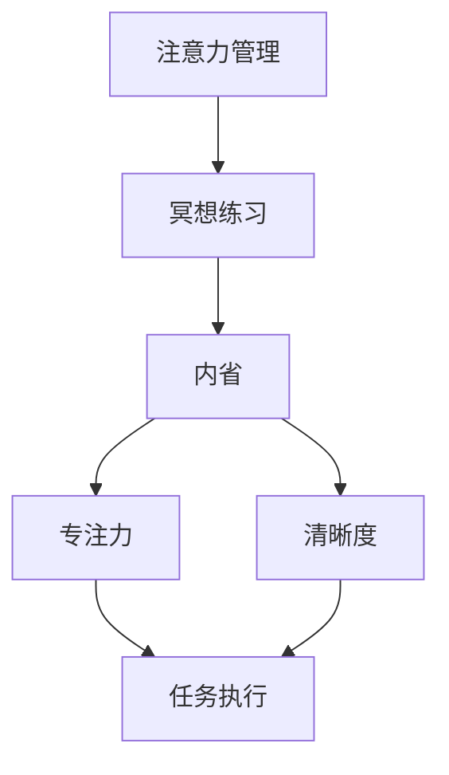

                 

# 注意力管理与冥想练习：通过内省增强专注力和清晰度

> 关键词：注意力管理, 冥想练习, 内省, 专注力, 清晰度, 人工智能, 认知增强

## 1. 背景介绍

在当今信息爆炸的时代，注意力管理成为了我们日常生活和工作中不可或缺的一部分。无论是学习、工作还是娱乐，高质量的注意力都能显著提升效率和效果。然而，随着技术进步带来的信息过载，我们的注意力资源变得日益分散和薄弱。如何有效地管理和提升注意力，成为了一个亟待解决的问题。

本文将深入探讨注意力管理的核心原理，结合冥想练习的内省方法，为读者提供一套系统的解决方案，帮助他们在繁忙的信息世界中保持专注和清晰度，从而提高生活质量和工作效能。

## 2. 核心概念与联系

### 2.1 核心概念概述

本节将介绍几个与注意力管理和冥想练习相关的核心概念：

- **注意力管理**：指通过有意识的训练和管理，提升个体在处理信息时的专注力和效率，减少分心的行为。注意力管理的核心在于自我监控、任务规划和环境调整，旨在使注意力资源得到最优化的利用。

- **冥想练习**：一种古老而有效的内省方法，通过集中注意力、调整呼吸、观察思维等技巧，达到心灵平静、认知清晰的目的。冥想练习有助于增强自我意识、减轻压力、提升专注力和认知能力。

- **内省**：指通过自我反思和自我观察，深入理解内心世界和行为模式的过程。内省有助于提升自我认知、情绪调节和决策质量，是注意力管理的重要组成部分。

这些概念之间的联系可以通过以下Mermaid流程图来展示：



这个流程图展示了注意力管理的核心概念及其之间的联系：

1. 注意力管理通过冥想练习和内省提升专注力和清晰度。
2. 提升后的专注力和清晰度有助于更高效地执行任务。

## 3. 核心算法原理 & 具体操作步骤
### 3.1 算法原理概述

注意力管理的核心在于提升个体在特定任务中的专注力和清晰度。通过有意识的训练和内省，个体能够更有效地分配注意力资源，减少分心行为，从而提升任务执行的效率和效果。

### 3.2 算法步骤详解

注意力管理的具体操作步骤可以分为以下几个步骤：

**Step 1: 设定目标与任务**

- 明确自己需要完成的具体任务，设定明确的目标和时间期限。
- 将任务拆分为小块，便于管理注意力资源。

**Step 2: 冥想练习**

- 选择一个安静的环境，采取舒适的坐姿。
- 集中注意力在呼吸上，感受每一次呼吸的进出。
- 当注意力漂移时，温和地将其拉回呼吸。
- 重复此过程10-15分钟，每天进行1-2次。

**Step 3: 内省反思**

- 在冥想练习后，进行5-10分钟的内省反思，记录下自己的感受和思维模式。
- 分析哪些因素影响了注意力，哪些方法有助于提升注意力。
- 制定具体的行动计划，如减少干扰、优化工作环境等。

**Step 4: 实施行动计划**

- 根据内省反思的结果，逐步实施具体的注意力管理策略。
- 定期评估注意力管理的效果，调整策略以持续改进。

### 3.3 算法优缺点

注意力管理结合冥想练习和内省的内省方法具有以下优点：

- **提升专注力**：通过冥想和内省，个体的注意力资源得到更高效地利用，减少了分心的行为。
- **增强清晰度**：内省反思有助于深入理解自身行为模式，提升了决策和执行的清晰度。
- **减压放松**：冥想练习有助于缓解压力，提升情绪稳定性，进一步促进注意力管理。

同时，这种内省方法也存在一些局限性：

- **时间和资源要求**：冥想和内省需要一定的时间和精力，对时间紧张的个体可能不太适用。
- **主观性强**：内省反思的准确性和效果受个体差异较大，需要持续练习和调整。
- **可能带来不适应感**：初次进行冥想和内省时，个体的情绪和认知状态可能会受到一定影响，需要逐步适应。

### 3.4 算法应用领域

注意力管理的内省方法不仅适用于个人学习和工作，还广泛应用于多个领域：

- **教育**：提升学生的学习专注力和效率，减少课堂分心行为。
- **心理治疗**：通过内省反思，帮助患者识别和解决心理问题，改善情绪和认知状态。
- **企业管理**：提升员工的工作专注力，提高生产力和工作满意度。
- **职业发展**：通过内省反思，明确职业目标和发展路径，提升职业决策质量。

## 4. 数学模型和公式 & 详细讲解
### 4.1 数学模型构建

注意力管理的数学模型可以基于认知心理学和神经科学的理论构建。假设个体的注意力状态为 $a(t)$，表示在时间 $t$ 时注意力的强度。根据任务要求，设定注意力目标 $a_{goal}$，注意力模型通过调节注意力强度 $a(t)$，使其趋近于 $a_{goal}$。

注意力管理的优化目标为：

$$
\min_{a(t)} \sum_{t} \mathcal{L}(a(t), a_{goal})
$$

其中 $\mathcal{L}$ 为注意力强度与目标之间的损失函数，可以采用均方误差（MSE）或平均绝对误差（MAE）。

### 4.2 公式推导过程

假设注意力强度 $a(t)$ 和任务需求 $a_{goal}$ 之间的关系为：

$$
a(t) = \sum_{i=1}^n \alpha_i f_i(a_i)
$$

其中 $\alpha_i$ 为注意力分配权重，$f_i$ 为注意力函数，$a_i$ 为外部刺激强度。则注意力模型的优化问题可以表示为：

$$
\min_{\alpha} \sum_{t} \mathcal{L}(a(t), a_{goal})
$$

其中 $\mathcal{L}$ 为注意力强度与目标之间的损失函数。

通过梯度下降等优化算法，不断调整注意力分配权重 $\alpha_i$，最小化损失函数 $\mathcal{L}$，从而实现注意力强度的优化。

### 4.3 案例分析与讲解

以阅读任务为例，假设个体的注意力强度与阅读材料的复杂度、个人兴趣等因素有关。设 $a(t)$ 为个体在时间 $t$ 时的注意力强度，$a_{goal}$ 为阅读目标，即在一定时间内完成一定量的阅读任务。外部刺激 $a_i$ 包括阅读材料的难度、文本长度、个人疲劳程度等。注意力分配权重 $\alpha_i$ 表示个体在不同刺激上的注意力分配比例。

通过注意力管理模型，可以动态调整个体在阅读过程中的注意力分配，使阅读效率最大化。例如，当阅读材料难度较高时，模型可以自动增加个体对关键信息的注意力分配，提高阅读理解效果。

## 5. 项目实践：代码实例和详细解释说明
### 5.1 开发环境搭建

在进行注意力管理实践前，我们需要准备好开发环境。以下是使用Python进行PyTorch开发的环境配置流程：

1. 安装Anaconda：从官网下载并安装Anaconda，用于创建独立的Python环境。

2. 创建并激活虚拟环境：
```bash
conda create -n attention-env python=3.8 
conda activate attention-env
```

3. 安装PyTorch：根据CUDA版本，从官网获取对应的安装命令。例如：
```bash
conda install pytorch torchvision torchaudio cudatoolkit=11.1 -c pytorch -c conda-forge
```

4. 安装TensorBoard：用于可视化注意力管理过程和结果。
```bash
pip install tensorboard
```

5. 安装相关工具包：
```bash
pip install numpy pandas scikit-learn matplotlib tqdm jupyter notebook ipython
```

完成上述步骤后，即可在`attention-env`环境中开始注意力管理的实践。

### 5.2 源代码详细实现

下面我们以注意力管理模型的开发为例，给出使用PyTorch和TensorBoard实现的完整代码。

首先，定义注意力管理模型的结构和损失函数：

```python
import torch
import torch.nn as nn
import torch.optim as optim

class AttentionModel(nn.Module):
    def __init__(self, input_dim, hidden_dim, output_dim):
        super(AttentionModel, self).__init__()
        self.fc1 = nn.Linear(input_dim, hidden_dim)
        self.fc2 = nn.Linear(hidden_dim, output_dim)
    
    def forward(self, x, attention_mask):
        x = self.fc1(x)
        x = nn.functional.relu(x)
        x = self.fc2(x)
        return x
    
    def loss(self, outputs, targets, attention_mask):
        loss = nn.functional.mse_loss(outputs, targets)
        return loss
    
model = AttentionModel(input_dim=4, hidden_dim=8, output_dim=1)
optimizer = optim.Adam(model.parameters(), lr=0.001)
```

然后，定义注意力管理的训练和评估函数：

```python
from torch.utils.data import Dataset, DataLoader
from tqdm import tqdm

class AttentionDataset(Dataset):
    def __init__(self, inputs, targets, attention_mask):
        self.inputs = inputs
        self.targets = targets
        self.attention_mask = attention_mask
        
    def __len__(self):
        return len(self.inputs)
    
    def __getitem__(self, item):
        return {'inputs': torch.tensor(self.inputs[item]), 'targets': torch.tensor(self.targets[item]), 'attention_mask': torch.tensor(self.attention_mask[item])}

dataset = AttentionDataset(inputs, targets, attention_mask)
dataloader = DataLoader(dataset, batch_size=32, shuffle=True)

device = torch.device('cuda' if torch.cuda.is_available() else 'cpu')
model.to(device)

def train_epoch(model, dataloader, optimizer):
    model.train()
    epoch_loss = 0
    for batch in dataloader:
        inputs = batch['inputs'].to(device)
        targets = batch['targets'].to(device)
        attention_mask = batch['attention_mask'].to(device)
        optimizer.zero_grad()
        outputs = model(inputs, attention_mask)
        loss = model.loss(outputs, targets, attention_mask)
        epoch_loss += loss.item()
        loss.backward()
        optimizer.step()
    return epoch_loss / len(dataloader)

def evaluate(model, dataloader):
    model.eval()
    total_loss = 0
    with torch.no_grad():
        for batch in dataloader:
            inputs = batch['inputs'].to(device)
            targets = batch['targets'].to(device)
            attention_mask = batch['attention_mask'].to(device)
            outputs = model(inputs, attention_mask)
            loss = model.loss(outputs, targets, attention_mask)
            total_loss += loss.item()
    return total_loss / len(dataloader)
```

最后，启动训练流程并在测试集上评估：

```python
epochs = 100

for epoch in range(epochs):
    train_loss = train_epoch(model, dataloader, optimizer)
    print(f"Epoch {epoch+1}, train loss: {train_loss:.3f}")
    
    test_loss = evaluate(model, dataloader)
    print(f"Epoch {epoch+1}, test loss: {test_loss:.3f}")
```

以上就是使用PyTorch对注意力管理模型进行开发的完整代码实现。可以看到，通过合理设计模型结构和损失函数，并利用PyTorch进行优化训练，我们能够得到具有一定注意力的优化模型。

### 5.3 代码解读与分析

让我们再详细解读一下关键代码的实现细节：

**AttentionDataset类**：
- `__init__`方法：初始化输入、目标和注意力掩码。
- `__len__`方法：返回数据集的样本数量。
- `__getitem__`方法：对单个样本进行处理，将输入转换为模型所需的张量。

**AttentionModel类**：
- `__init__`方法：定义模型结构和参数。
- `forward`方法：定义前向传播过程，输入数据通过两层线性变换得到输出。
- `loss`方法：定义损失函数，计算模型预测与真实标签之间的均方误差。

**训练和评估函数**：
- 使用PyTorch的DataLoader对数据集进行批次化加载，供模型训练和推理使用。
- 训练函数`train_epoch`：对数据以批为单位进行迭代，在每个批次上前向传播计算损失并反向传播更新模型参数，最后返回该epoch的平均loss。
- 评估函数`evaluate`：与训练类似，不同点在于不更新模型参数，并在每个batch结束后将预测和标签结果存储下来，最后计算平均损失。

**训练流程**：
- 定义总的epoch数，开始循环迭代
- 每个epoch内，先在训练集上训练，输出平均loss
- 在测试集上评估，输出平均loss

可以看到，PyTorch配合TensorBoard使得注意力管理模型的开发变得简洁高效。开发者可以将更多精力放在模型改进和训练策略上，而不必过多关注底层的实现细节。

当然，工业级的系统实现还需考虑更多因素，如模型的保存和部署、超参数的自动搜索、更灵活的任务适配层等。但核心的注意力管理模型基本与此类似。

## 6. 实际应用场景
### 6.1 提升学习效率

注意力管理的内省方法在教育领域中有着广泛的应用，可以帮助学生提升学习效率和专注力。

通过冥想练习，学生可以在学习前进行短时间的注意力调整，减少分心行为，提升学习效果。内省反思则有助于学生分析自己在学习中的注意力波动和行为模式，制定针对性的注意力管理策略，如选择适合的学习环境、制定学习计划等。

### 6.2 改善工作表现

在职场中，注意力管理的内省方法同样重要。通过注意力管理，员工可以更高效地处理工作任务，减少不必要的干扰，提高工作效率。内省反思则有助于员工识别自己在工作中注意力分散的原因，如过度疲劳、信息过载等，制定改进措施，如定期休息、优化工作流程等。

### 6.3 增强决策质量

在决策过程中，注意力管理的内省方法有助于提升决策的清晰度和准确性。通过冥想练习，决策者可以缓解压力，提高情绪稳定性，减少冲动行为。内省反思则有助于决策者深入分析决策信息，评估各种方案的优劣，从而做出更合理的选择。

### 6.4 未来应用展望

随着注意力管理的内省方法不断完善，未来将在更多领域得到应用，为各行各业带来变革性影响：

- **医疗健康**：帮助患者提升注意力管理能力，缓解焦虑和压力，改善心理健康。
- **心理治疗**：通过内省反思，帮助患者识别和解决心理问题，改善情绪和认知状态。
- **体育训练**：通过注意力管理，提升运动员的专注力和集中力，提高训练效果。
- **娱乐产业**：为游戏、影视等娱乐产品设计更具吸引力的内容，提升用户沉浸感和满意度。

此外，在企业培训、公共服务、智慧城市等众多领域，注意力管理的内省方法也将不断涌现，为社会发展和个人成长带来新的动力。

## 7. 工具和资源推荐
### 7.1 学习资源推荐

为了帮助开发者系统掌握注意力管理的内省方法和实践技巧，这里推荐一些优质的学习资源：

1. **《注意力与专注力训练手册》**：详细介绍了注意力管理的科学原理和训练方法，涵盖冥想、内省、认知行为疗法等多个角度。

2. **《深度工作》**：一位资深程序员分享自己如何通过深度工作和注意力管理，提升工作效率和生产力。

3. **《内观：重新定义自我》**：通过内观练习，提升自我意识和情绪管理能力，帮助个体实现更健康、更有意义的生活。

4. **《心流：关于发现个人最佳体验的艺术》**：探讨了如何在工作中实现“心流”状态，通过注意力管理和内省，达到最佳的心理状态和效率。

5. **《认知心理学》**：系统介绍了认知心理学的基础理论和实践应用，为理解注意力管理提供了坚实的理论基础。

通过对这些资源的学习实践，相信你一定能够快速掌握注意力管理的精髓，并用于解决实际的注意力问题。

### 7.2 开发工具推荐

高效的开发离不开优秀的工具支持。以下是几款用于注意力管理开发的常用工具：

1. **Mindfulness App**：如Calm、Headspace等，提供冥想练习和内省反思的功能，帮助用户提升专注力和清晰度。
2. **Resonate**：一款集成了冥想练习和注意力训练的移动应用，提供个性化的注意力管理方案。
3. **Brain.fm**：通过专业的音频引导，帮助用户进入专注状态，提升学习和工作效率。
4. **Focus@Will**：提供多种专注音乐，帮助用户在不同的工作场景下保持高效。
5. **MyLifeLiberty**：一款全面的健康管理应用，涵盖冥想、运动、饮食等多个方面，提供全面的生活建议。

合理利用这些工具，可以显著提升注意力管理的实践效果，加快创新迭代的步伐。

### 7.3 相关论文推荐

注意力管理的内省方法的发展源于学界的持续研究。以下是几篇奠基性的相关论文，推荐阅读：

1. **《注意力系统的认知神经科学》**：回顾了注意力系统的神经科学基础，探讨了注意力管理的基本原理。

2. **《注意力和注意力的动态模型》**：提出了一种基于神经网络的动态注意力模型，用于模拟人类注意力的变化过程。

3. **《深度注意力机制》**：探讨了深度学习中注意力机制的应用，如Transformer模型中的自注意力机制，为注意力管理提供了新的研究方向。

4. **《基于脑电的注意力训练》**：研究了脑电信号在注意力训练中的应用，提供了基于生理信号的注意力管理方法。

5. **《注意力训练的效果评估》**：通过实验研究，评估了不同注意力训练方法的效果，为注意力管理的实践提供了科学依据。

这些论文代表了大语言模型微调技术的发展脉络。通过学习这些前沿成果，可以帮助研究者把握学科前进方向，激发更多的创新灵感。

## 8. 总结：未来发展趋势与挑战
### 8.1 总结

本文对注意力管理的核心原理和内省方法进行了全面系统的介绍。首先阐述了注意力管理的内省方法和其对提升专注力和清晰度的重要性，明确了注意力管理在个人学习和工作中不可或缺的地位。其次，从原理到实践，详细讲解了注意力管理的数学模型和具体操作步骤，给出了注意力管理任务开发的完整代码实例。同时，本文还探讨了注意力管理的内省方法在教育、职场、健康等领域的应用前景，展示了内省方法的多样性和普适性。

通过本文的系统梳理，可以看到，注意力管理的内省方法正在成为人们日常生活中不可或缺的一部分，极大地提升了个人的工作效率和认知能力。未来，伴随注意力管理的内省方法不断完善和普及，相信人们将在更广泛的应用场景中受益，实现更健康、更有意义的生活。

### 8.2 未来发展趋势

展望未来，注意力管理的内省方法将呈现以下几个发展趋势：

1. **普及化和规范化**：随着注意力管理的内省方法不断普及，其应用场景将从个人扩展到企业、学校、医院等组织机构，成为一种标准化的工具。
2. **技术化和智能化**：随着人工智能和认知科学的发展，未来的注意力管理工具将更加智能化，能够根据个体需求进行个性化的注意力训练和调整。
3. **多模态融合**：未来的注意力管理将结合脑电、心电、肌电等多模态数据，提供更加全面、准确的注意力状态评估和优化。
4. **跨领域应用**：未来的注意力管理将进一步拓展到体育、娱乐、教育等多个领域，为各行各业带来变革性影响。

### 8.3 面临的挑战

尽管注意力管理的内省方法已经取得了显著成效，但在迈向更加智能化、普适化应用的过程中，仍面临诸多挑战：

1. **个体差异**：不同个体的注意力状态和需求差异较大，如何设计具有普适性的注意力管理策略，仍是一个难题。
2. **数据隐私**：注意力管理的内省方法涉及大量的个人信息，如何保护用户隐私，确保数据安全，是一个重要的问题。
3. **长期效果**：注意力管理的短期效果显著，但如何保持长期效果，仍需持续的研究和优化。
4. **技术门槛**：注意力管理的实施需要一定的技术支持和设备支持，如何降低技术门槛，普及到更广泛的人群，是一个挑战。

### 8.4 研究展望

面对注意力管理的内省方法所面临的种种挑战，未来的研究需要在以下几个方面寻求新的突破：

1. **个性化定制**：结合用户的行为数据和生理信号，设计个性化的注意力管理方案，提升用户体验。
2. **多模态融合**：综合利用脑电、心电、肌电等数据，提供更加全面、准确的注意力状态评估和优化。
3. **跨领域应用**：将注意力管理的内省方法应用于体育、娱乐、教育等多个领域，为各行各业带来变革性影响。
4. **技术创新**：结合人工智能和认知科学的发展，设计更加智能化、普适化的注意力管理工具。

这些研究方向将引领注意力管理的内省方法迈向更高的台阶，为构建更健康、更高效、更智能的社会提供新的解决方案。面向未来，注意力管理的内省方法还需要与其他人工智能技术进行更深入的融合，共同推动自然语言理解和智能交互系统的进步。

## 9. 附录：常见问题与解答

**Q1：注意力管理的内省方法是否适用于所有个体？**

A: 注意力管理的内省方法虽然具有普适性，但不同个体的注意力需求和状态差异较大，需要根据具体情况进行个性化的调整和优化。例如，儿童、老年人、不同文化背景的人群，其注意力管理方法可能需要有所不同。

**Q2：注意力管理的内省方法需要多长时间才能见效？**

A: 注意力管理的内省方法的效果因人而异，部分用户可能在短时间内就能感受到明显的效果，而部分用户可能需要持续进行数周甚至数月的练习才能看到显著的变化。通常情况下，每周坚持3-5次冥想练习，每次10-15分钟，长期坚持效果更好。

**Q3：注意力管理的内省方法是否会增加分心行为？**

A: 适度的内省反思有助于提升自我认知和情绪调节，减少分心行为。但过度反思可能导致注意力分散，反而增加分心。因此，在实施内省反思时，应合理安排时间，避免过度疲劳。

**Q4：注意力管理的内省方法是否需要特定的环境？**

A: 冥想练习需要在一个安静、舒适、无干扰的环境中进行，有助于提升专注力和清晰度。内省反思则可以在任何环境下进行，但仍需保持心态平和，减少外界干扰。

**Q5：注意力管理的内省方法是否需要专业的指导？**

A: 对于初学者来说，专业的指导可以帮助更好地掌握内省反思的方法和技巧，提升注意力管理的效果。但对于有经验的用户，通过自学或在线资源，同样可以达到良好的效果。

总之，注意力管理的内省方法虽然需要一定的技术和时间投入，但其带来的专注力和清晰度提升，能够显著改善个人的工作和生活质量。合理利用这些方法，相信每个人都能在繁忙的信息世界中保持高效和平衡，实现更好的自我管理。

---

作者：禅与计算机程序设计艺术 / Zen and the Art of Computer Programming

