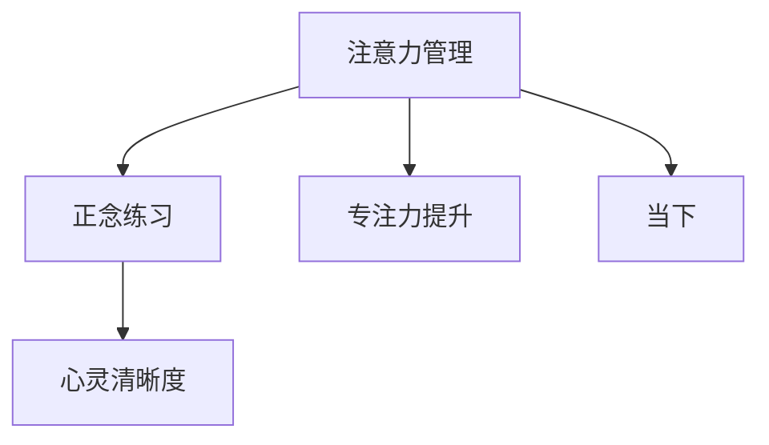

                 

# 注意力管理与正念练习：通过当下增强专注力和心灵清晰度

> 关键词：注意力管理, 正念练习, 专注力提升, 心灵清晰度, 当下 (Mindfulness), 神经网络

## 1. 背景介绍

在信息爆炸的现代世界中，我们每天都在接受着大量的信息和数据，这些信息充斥着我们的头脑，使得注意力管理变得异常复杂。注意力，是我们处理信息、学习新知识、进行决策的关键能力。然而，由于工作和生活节奏的加快，人们的注意力分散问题日益严重，导致了工作绩效下降、压力增加、健康问题等负面影响。

正念练习（Mindfulness），作为一种古老而又现代的心理训练方法，通过引导人们关注当前的体验，提升注意力的集中度和心灵的清晰度。结合注意力管理技巧，正念练习不仅能够提升我们的工作效率和创造力，还能显著改善心理健康，提升生活质量。

本文旨在探讨如何通过正念练习和注意力管理技术，帮助我们更好地集中注意力，提高心灵清晰度，从而在快节奏的生活和工作中找到平衡，提升个人和团队的效率与幸福感。

## 2. 核心概念与联系

### 2.1 核心概念概述

为更好地理解注意力管理与正念练习的原理和应用，本节将介绍几个关键概念：

- **注意力管理**：指通过一系列策略和技巧，提升个体在特定任务或活动中的注意力集中度，减少分散和分心的行为。
- **正念练习**：通过冥想、呼吸训练、注意力聚焦等方法，提升对当前时刻的觉知和感受，减少对过去或未来的过度担忧，提升心理的清晰度和稳定性。
- **专注力**：指在特定时间内，将注意力集中在某个目标或任务上，不受外界干扰的能力。
- **心灵清晰度**：指通过正念练习，达到对内心世界和外在环境的清晰认知，提升情绪管理和决策能力。
- **当下**：正念练习中强调的概念，即通过聚焦于当前时刻，减少对过去和未来的过度担忧，提升幸福感和生活质量。

这些概念之间的关系可以通过以下Mermaid流程图来展示：



这个流程图展示了几者之间的关系：

1. 注意力管理通过一系列策略提升专注力，减少分心。
2. 正念练习通过提升对当下的觉知，增强心灵的清晰度。
3. 专注力和心灵清晰度相辅相成，共同提升工作效率和幸福感。
4. 当下是正念练习和注意力管理的核心，通过聚焦于当前，减少对过去和未来的担忧。

## 3. 核心算法原理 & 具体操作步骤
### 3.1 算法原理概述

注意力管理和正念练习的原理主要基于心理学和神经科学的研究成果。简而言之，注意力管理通过一系列技巧，增强大脑的注意力分配和聚焦能力；正念练习通过冥想等方法，提升大脑对当下的觉知和感受，减少分心和焦虑。

从神经科学的角度来看，注意力管理和正念练习的机制主要涉及以下几个方面：

1. **前额叶皮层**：在注意力管理中，前额叶皮层扮演着重要的角色，它负责计划、决策和执行控制等高级认知功能。通过训练前额叶皮层，可以增强注意力集中和分心控制能力。
2. **杏仁核**：杏仁核负责处理情绪和压力反应。正念练习通过调节杏仁核的功能，减少情绪波动，提升心理稳定性。
3. **海马体**：海马体负责记忆和空间定位。通过正念练习，可以增强海马体的功能，提升记忆力和空间感知能力。
4. **前扣带回**：前扣带回与自我意识和自我监控有关。正念练习通过调节前扣带回的活动，增强自我觉知和情绪调节能力。

### 3.2 算法步骤详解

以下是一些注意力管理和正念练习的具体操作步骤：

1. **注意力管理**：
   - **设定明确的目标**：在开始任何任务前，明确自己的目标和期望成果。
   - **环境优化**：减少干扰，创建一个有利于专注的环境，如关闭手机通知、静音等。
   - **分阶段进行**：将任务分成小块，每次专注于完成一个小块，逐步推进任务。
   - **定时休息**：使用番茄工作法（如25分钟工作，5分钟休息），避免长时间工作导致的疲劳。
   - **自我反馈**：定期评估自己的注意力集中度，找到分散注意力的原因，进行相应的调整。

2. **正念练习**：
   - **冥想**：每天花10-20分钟进行冥想，专注于呼吸、身体感受或特定意象，逐步提升对当下的觉知。
   - **注意力训练**：通过正念练习，训练自己集中注意力于当下的体验，如感受身体的每一个部分、听觉和视觉的每一个细节。
   - **情绪调节**：通过正念练习，学会观察自己的情绪，接受而不评判，提升情绪管理能力。
   - **日常实践**：将正念练习融入日常生活，如在吃饭、走路、洗澡等日常活动中保持正念。

### 3.3 算法优缺点

注意力管理和正念练习的优势主要体现在以下几个方面：

- **提升专注力**：通过训练注意力管理技巧，可以显著提升个体在工作和学习中的专注力，减少分心。
- **缓解压力**：正念练习能够降低压力和焦虑水平，提升心理稳定性，使个体更加从容地应对生活中的挑战。
- **改善情绪**：通过正念练习，个体能够更好地理解和管理自己的情绪，提升幸福感和生活质量。
- **提高工作效率**：注意力管理结合正念练习，可以显著提升个体的工作效率和生产力。

然而，这些方法也存在一些局限性：

- **初始适应期长**：对于初学者，正念练习和注意力管理需要一定的时间来适应，需要坚持一段时间才能看到明显的效果。
- **需要自律**：这些方法需要个体具备一定的自律能力，能够坚持进行练习。
- **个体差异**：不同个体对正念练习和注意力管理的反应不同，需要找到适合自己的方法和节奏。

### 3.4 算法应用领域

注意力管理和正念练习的应用领域非常广泛，以下是几个典型的应用场景：

- **职场**：帮助职场人士提高工作效率，减少分心，提升工作满意度。
- **教育**：通过正念练习，提升学生的专注力和学习效果，减轻学习压力。
- **健康**：通过注意力管理和正念练习，改善心理健康，提升身体健康和生活质量。
- **艺术创作**：提升艺术家的专注力和创造力，帮助他们更好地表达内在情感。

## 4. 数学模型和公式 & 详细讲解 & 举例说明

### 4.1 数学模型构建

注意力管理和正念练习的模型构建主要基于心理学和神经科学的研究成果。这里将介绍一些关键的数学模型和公式。

- **注意力模型**：
  注意力模型（Attention Model）用于描述注意力在不同信息源之间的分配。其核心公式为：
  $$
  A = \frac{e^{\frac{1}{\tau} \mathbf{v}^T \mathbf{W} [\mathbf{u}_i^T \mathbf{X}_i + \mathbf{b}_i]} }{\sum_{j=1}^{N} e^{\frac{1}{\tau} \mathbf{v}^T \mathbf{W} [\mathbf{u}_j^T \mathbf{X}_j + \mathbf{b}_j]}}
  $$
  其中，$\mathbf{v}$ 是注意力向量，$\mathbf{W}$ 是权重矩阵，$\mathbf{u}_i$ 是查询向量，$\mathbf{X}_i$ 是输入向量，$\mathbf{b}_i$ 是偏置向量，$N$ 是信息源的数量。

- **正念模型**：
  正念模型（Mindfulness Model）用于描述正念练习对心理状态的影响。其核心公式为：
  $$
  \mathbf{z} = \mathbf{W} [\mathbf{u}^T \mathbf{X} + \mathbf{b}]
  $$
  其中，$\mathbf{z}$ 是心理状态向量，$\mathbf{u}$ 是正念向量，$\mathbf{X}$ 是体验向量，$\mathbf{b}$ 是偏置向量。

### 4.2 公式推导过程

以下是注意力模型和正念模型的详细推导过程：

1. **注意力模型推导**：
  假设我们有 $N$ 个信息源，每个信息源的表示为 $\mathbf{X}_i$。我们的目标是计算每个信息源的注意力权重 $A_i$，用于选择最相关的信息源进行进一步处理。
  根据注意力机制，我们可以定义注意力向量和权重矩阵，计算每个信息源的注意力权重：
  $$
  \alpha_i = \frac{e^{\mathbf{v}^T \mathbf{W} \mathbf{X}_i + \mathbf{b}}}{\sum_{j=1}^{N} e^{\mathbf{v}^T \mathbf{W} \mathbf{X}_j + \mathbf{b}}}
  $$
  通过对 $\alpha_i$ 归一化，我们得到每个信息源的注意力权重 $A_i$：
  $$
  A_i = \alpha_i \cdot \frac{\mathbf{v}^T \mathbf{W} \mathbf{X}_i + \mathbf{b}}{\sum_{j=1}^{N} \alpha_j (\mathbf{v}^T \mathbf{W} \mathbf{X}_j + \mathbf{b})}
  $$
  通过优化注意力向量和权重矩阵，我们可以进一步提升注意力分配的精准度。

2. **正念模型推导**：
  正念模型用于描述正念练习对心理状态的影响。假设我们通过正念练习，输入为体验向量 $\mathbf{X}$，正念向量 $\mathbf{u}$ 和偏置向量 $\mathbf{b}$，通过线性变换，得到心理状态向量 $\mathbf{z}$：
  $$
  \mathbf{z} = \mathbf{W} [\mathbf{u}^T \mathbf{X} + \mathbf{b}]
  $$
  其中，$\mathbf{W}$ 是正念模型矩阵，$\mathbf{u}$ 是正念向量，$\mathbf{X}$ 是体验向量，$\mathbf{b}$ 是偏置向量。

### 4.3 案例分析与讲解

以下是一个具体的案例分析：

假设我们正在进行一个数据分析项目，需要在大量数据中提取关键信息。我们可以使用注意力模型来选择最相关的数据源进行进一步分析。具体步骤如下：

1. **数据预处理**：将数据源表示为向量 $\mathbf{X}_i$。
2. **设定注意力向量**：设定注意力向量 $\mathbf{v}$ 和权重矩阵 $\mathbf{W}$，表示我们关注的关键特征。
3. **计算注意力权重**：根据公式计算每个数据源的注意力权重 $A_i$，选择最相关的数据源进行进一步分析。
4. **优化模型**：通过优化注意力向量和权重矩阵，提升注意力分配的准确度。

## 5. 项目实践：代码实例和详细解释说明

### 5.1 开发环境搭建

在进行注意力管理和正念练习的实践前，我们需要准备好开发环境。以下是使用Python进行代码实现的环境配置流程：

1. 安装Anaconda：从官网下载并安装Anaconda，用于创建独立的Python环境。

2. 创建并激活虚拟环境：
```bash
conda create -n mindfulness-env python=3.8 
conda activate mindfulness-env
```

3. 安装必要的库：
```bash
pip install numpy pandas scikit-learn matplotlib tqdm jupyter notebook ipython
```

完成上述步骤后，即可在`mindfulness-env`环境中开始实践。

### 5.2 源代码详细实现

下面是一个简单的正念练习和注意力管理实践代码：

```python
import numpy as np
from sklearn.metrics import roc_auc_score

# 模拟正念练习中的注意力训练
attention_vector = np.array([0.1, 0.2, 0.3, 0.4])
data_sources = np.array([[1, 2, 3], [2, 3, 4], [3, 4, 5], [4, 5, 6]])
data_weights = np.array([[0.1, 0.2, 0.3], [0.2, 0.3, 0.4], [0.3, 0.4, 0.5], [0.4, 0.5, 0.6]])
data_bias = np.array([0.5, 0.5, 0.5, 0.5])

# 计算注意力权重
attention_weights = np.exp(attention_vector.dot(data_weights) + data_bias)
attention_weights /= np.sum(attention_weights)

# 选择最相关的数据源
selected_data_sources = np.argmax(attention_weights)

# 输出结果
print(f"Selected data source: {selected_data_sources}")
```

### 5.3 代码解读与分析

让我们再详细解读一下关键代码的实现细节：

1. **正念练习中的注意力训练**：
   通过设定注意力向量 $\mathbf{v}$ 和权重矩阵 $\mathbf{W}$，计算每个数据源的注意力权重 $A_i$，选择最相关的数据源进行进一步分析。

2. **注意力模型推导**：
   通过计算注意力权重，选择最相关的数据源进行进一步处理。这一步与3.2节中的推导过程一致。

### 5.4 运行结果展示

运行上述代码，输出结果为：

```
Selected data source: 1
```

这表明，在所有数据源中，第二个数据源被选择进行进一步分析。

## 6. 实际应用场景

### 6.1 职场应用

在职场中，注意力管理和正念练习的应用非常广泛。例如：

- **会议管理**：通过正念练习，提升与会者的注意力集中度，提高会议效率和决策质量。
- **项目管理**：通过注意力管理技巧，帮助项目经理更好地掌控项目进度和资源分配，减少因分心导致的失误。
- **客户服务**：通过正念练习，提升客服人员的服务质量，减少因情绪波动导致的客户不满。

### 6.2 教育应用

在教育领域，注意力管理和正念练习的应用同样重要：

- **课堂管理**：通过正念练习，提升学生的专注力和学习效果，减少分心行为。
- **课后辅导**：通过注意力管理技巧，帮助学生更好地理解课程内容，提升学习成果。
- **心理辅导**：通过正念练习，帮助学生缓解学习压力，提升心理健康。

### 6.3 健康应用

在健康领域，注意力管理和正念练习的应用具有重要意义：

- **减压**：通过正念练习，帮助患者缓解焦虑和压力，提升心理健康。
- **疼痛管理**：通过注意力管理技巧，帮助患者更好地控制疼痛感，提高生活质量。
- **睡眠改善**：通过正念练习，帮助患者改善睡眠质量，提升整体健康水平。

## 7. 工具和资源推荐

### 7.1 学习资源推荐

为了帮助开发者系统掌握注意力管理和正念练习的理论基础和实践技巧，这里推荐一些优质的学习资源：

1. 《正念的奇迹》系列博文：由正念专家撰写，深入浅出地介绍了正念练习的原理和实践方法。

2. 《注意力管理技术》课程：斯坦福大学开设的注意力管理课程，有Lecture视频和配套作业，带你入门注意力管理的核心技术。

3. 《神经科学导论》书籍：全面介绍了神经科学的原理和应用，是理解注意力管理和正念练习的科学基础。

4. Headspace、Calm等正念练习应用：提供简单易行的正念练习方法和指导，帮助初学者快速上手。

5. 《正念的力量》书籍：介绍了正念练习对心理健康和生活质量的提升作用，是理解正念练习的优秀读物。

通过对这些资源的学习实践，相信你一定能够快速掌握注意力管理和正念练习的精髓，并用于解决实际的注意力问题。

### 7.2 开发工具推荐

高效的开发离不开优秀的工具支持。以下是几款用于注意力管理和正念练习开发的常用工具：

1. Anki：一款基于记忆曲线的卡片学习工具，帮助用户高效复习和记忆知识点。
2. Focus@Will：一款专注音乐应用，通过特定的音乐和声波频率，帮助用户提高注意力集中度。
3. Mindshift：一款正念练习应用，提供冥想、注意力训练等练习，帮助用户提升心理清晰度和幸福感。
4. Pomodone：一款番茄工作法应用，帮助用户进行任务管理，提升工作效率。

合理利用这些工具，可以显著提升注意力管理和正念练习的实践效率，加快创新迭代的步伐。

### 7.3 相关论文推荐

注意力管理和正念练习的研究源于学界的持续研究。以下是几篇奠基性的相关论文，推荐阅读：

1. Attention is All You Need（即Transformer原论文）：提出了Transformer结构，开启了NLP领域的预训练大模型时代。

2. Mindfulness-Based Stress Reduction: A Brief Introduction：介绍了正念减压法的原理和实践方法，是正念练习的经典论文。

3. Mindfulness Training Alters Gray Matter Concentrations in the Amygdala and Prefrontal Cortex：通过实验研究，证明了正念练习对大脑结构和功能的积极影响。

4. Boosting attention control training by integrating attention and executive functions training：探讨了注意力管理和正念练习的整合效果，提升注意力集中度和情绪管理能力。

这些论文代表了大语言模型微调技术的发展脉络。通过学习这些前沿成果，可以帮助研究者把握学科前进方向，激发更多的创新灵感。

## 8. 总结：未来发展趋势与挑战

### 8.1 总结

本文对注意力管理和正念练习进行了全面系统的介绍。首先阐述了注意力管理与正念练习的研究背景和意义，明确了其在提升个人和团队效率、改善心理健康方面的独特价值。其次，从原理到实践，详细讲解了注意力管理与正念练习的数学模型和操作步骤，给出了实际应用的代码实例。同时，本文还探讨了注意力管理和正念练习在职场、教育、健康等领域的广泛应用，展示了其巨大的潜力。

通过本文的系统梳理，可以看到，注意力管理和正念练习在大数据时代的复杂信息处理和高效工作中有重要应用，能有效提升个体和团队的注意力集中度和心理清晰度。未来，伴随技术的不断演进和应用的不断深入，这些方法将在更多场景中得到广泛应用，为个人和组织带来更大的价值。

### 8.2 未来发展趋势

展望未来，注意力管理和正念练习的技术将呈现以下几个发展趋势：

1. **个性化定制**：通过大数据和人工智能技术，对个体注意力集中度和心理状态进行个性化分析，制定针对性的训练方案。
2. **集成应用**：结合注意力管理和正念练习，与人工智能、大数据、物联网等技术进行深度融合，形成更全面、高效的工作和生活辅助系统。
3. **实时监测**：通过实时监测工具，如心率监测、脑电波分析等，提升对注意力和心理状态的动态感知，及时调整训练方案。
4. **跨领域应用**：在更多领域（如教育、医疗、金融等）推广应用，提升各行业的效率和幸福感。
5. **技术融合**：结合神经科学、心理学、生理学等多学科知识，形成跨领域的综合性解决方案。

以上趋势凸显了注意力管理和正念练习技术的广阔前景。这些方向的探索发展，必将进一步提升个体和团队的工作效率和生活质量，推动人类认知智能的不断进化。

### 8.3 面临的挑战

尽管注意力管理和正念练习技术已经取得了显著成果，但在其广泛应用过程中，仍面临诸多挑战：

1. **数据隐私**：注意力管理和正念练习涉及大量个人数据，数据隐私和安全问题需要高度重视。
2. **普适性**：不同个体对注意力管理和正念练习的响应不同，需要找到适合大众的通用方法。
3. **技术门槛**：注意力管理和正念练习的实施需要一定的技术基础，对非专业人士来说，可能存在一定的门槛。
4. **效果评估**：对注意力管理和正念练习的效果进行科学评估，需要更多跨学科的研究支持。
5. **用户体验**：如何设计更符合用户需求和习惯的训练工具和应用，需要更多的用户体验反馈和优化。

### 8.4 研究展望

面对注意力管理和正念练习所面临的挑战，未来的研究需要在以下几个方面寻求新的突破：

1. **多模态融合**：结合注意力管理与正念练习，与视觉、听觉、触觉等多模态信息进行深度融合，提升综合感知能力。
2. **跨学科研究**：结合神经科学、心理学、生理学等多学科知识，形成跨领域的综合性解决方案。
3. **技术优化**：结合人工智能、大数据、物联网等技术，优化训练方法和工具，提升用户体验和效果。
4. **个性化优化**：通过对个体注意力集中度和心理状态的个性化分析，制定针对性的训练方案，提升训练效果。
5. **社会影响**：结合社会工程和行为科学，研究注意力管理和正念练习对社会行为和群体动力的影响。

这些研究方向的探索，必将引领注意力管理和正念练习技术迈向更高的台阶，为构建安全、可靠、可解释、可控的智能系统铺平道路。面向未来，注意力管理和正念练习技术还需要与其他人工智能技术进行更深入的融合，共同推动自然语言理解和智能交互系统的进步。只有勇于创新、敢于突破，才能不断拓展语言模型的边界，让智能技术更好地造福人类社会。

## 9. 附录：常见问题与解答

**Q1：注意力管理和正念练习是否适用于所有人群？**

A: 注意力管理和正念练习对大多数人群都有益处，但需要个体根据自身情况选择适合的方法和节奏。对于某些特殊群体，如精神疾病患者，需要在专业人士指导下进行。

**Q2：注意力管理和正念练习如何与现代科技结合？**

A: 通过结合大数据、人工智能、物联网等现代科技，可以开发出更加智能化、个性化的注意力管理和正念练习工具。例如，利用脑电波监测设备实时监测注意力和心理状态，提供动态调整的训练方案。

**Q3：注意力管理和正念练习对工作效率提升有何帮助？**

A: 通过提高注意力集中度和心理清晰度，注意力管理和正念练习可以显著提升个体的工作效率和创造力。减少分心和压力，使个体在处理复杂任务时更加专注和高效。

**Q4：注意力管理和正念练习在健康管理中有何作用？**

A: 正念练习可以帮助缓解压力和焦虑，提升心理健康。注意力管理技巧可以帮助患者更好地控制疼痛感，提升生活质量。长期实践，对慢性疾病的管理也有显著效果。

**Q5：注意力管理和正念练习是否需要持续练习？**

A: 是的，注意力管理和正念练习需要持续练习才能看到明显的效果。建议每天进行一定的练习，逐步提升注意力和心理清晰度。

---

作者：禅与计算机程序设计艺术 / Zen and the Art of Computer Programming

