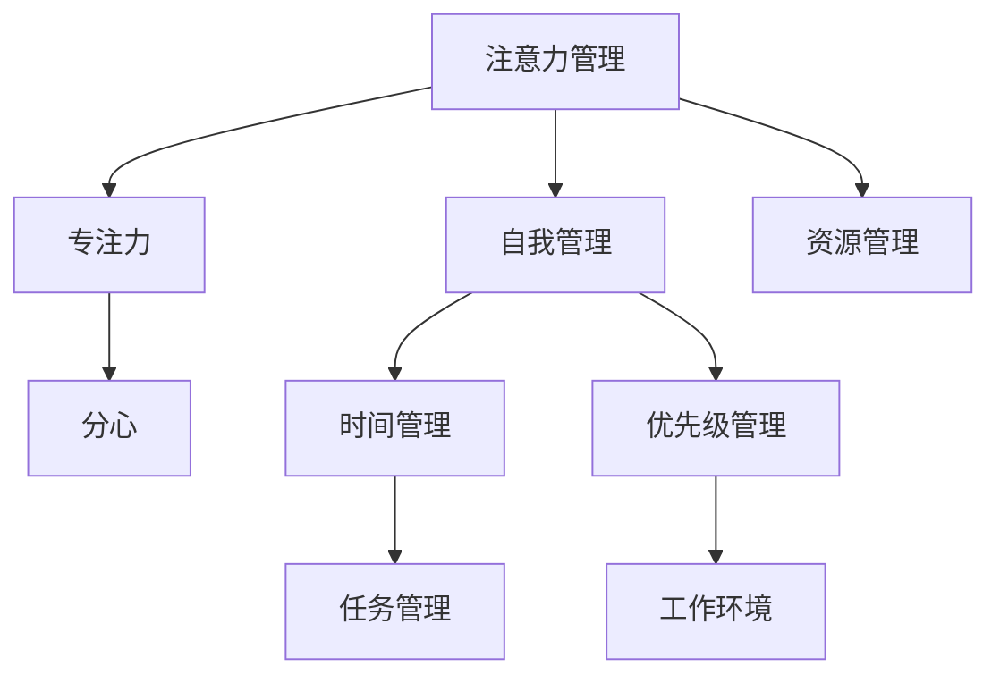

                 

## 1. 背景介绍

在信息爆炸、快节奏的现代社会，注意力管理与自我管理已成为提升个人和职业成功的关键。无论是在学习、工作，还是日常生活中，高效管理注意力与自我，都能够显著提升效率，减少压力，从而更好地实现目标。特别是对于IT、人工智能等领域的技术人员来说，面对高强度的项目和不断更新的技术栈，注意力管理和自我管理的重要性不言而喻。

本文将围绕注意力管理与自我管理，探讨通过专注力增强个人和职业成功的方法。将详细介绍注意力管理的核心概念和实践策略，并结合自我管理方法，给出具体的技巧和工具，帮助你提高生产力，达到更高的成就。

## 2. 核心概念与联系

### 2.1 核心概念概述

注意力管理与自我管理涉及多个核心概念，以下我们将逐一介绍：

- **注意力管理**：指通过科学的方法管理和优化个人或团队的注意力资源，提升工作和学习效率。
- **自我管理**：指个人通过自我认知、自我激励、自我调节等手段，实现自我提升和目标达成。
- **专注力**：指将注意力集中于某项任务或活动，屏蔽干扰，以高效完成任务的状态。
- **分心**：指注意力分散，难以专注于当前任务，导致效率低下。
- **时间管理**：指合理安排时间，以高效完成任务和项目的方法。
- **优先级管理**：指确定任务的优先级，合理安排时间与精力，以提高工作和生活效率。

这些概念通过一系列的相互关联和影响，共同构成了一个系统化的提升个人和职业成功的框架。

### 2.2 核心概念原理和架构的 Mermaid 流程图



## 3. 核心算法原理 & 具体操作步骤

### 3.1 算法原理概述

注意力管理与自我管理的核心算法原理主要基于心理学和行为学理论，通过科学的方法和管理工具，帮助个体在面对任务时，能够高效地分配和管理注意力，保持专注。以下是一些核心算法原理：

- **番茄工作法**：通过将工作时间划分为25分钟专注工作和5分钟短暂休息的周期，帮助个体维持高专注度，同时避免长时间工作带来的疲劳和分心。
- **Pomodoro Tracker**：基于番茄工作法，提供定时器、任务管理和统计分析功能，帮助个体追踪和优化专注状态。
- **时间块管理**：将一天的时间划分为若干个时间块，每个时间块专注于特定任务，有助于高效管理时间和注意力。
- **任务清单管理**：通过列出待完成的任务清单，明确优先级，合理安排时间，避免遗漏和重复。
- **专注力训练**：通过冥想、认知行为疗法等手段，提高个体的专注力，使其能够更长时间地保持高效工作状态。

### 3.2 算法步骤详解

以下是具体的注意力管理和自我管理策略的步骤：

1. **目标设定**：明确短期和长期目标，设定可量化的里程碑。
2. **任务分解**：将大任务分解为小任务，逐个击破。
3. **时间规划**：根据任务的优先级和紧急程度，规划每天的时间。
4. **专注力训练**：通过冥想、专注力训练软件等方式，提高专注力。
5. **定期回顾**：每周或每月对进度和效果进行回顾，调整策略。
6. **反馈调整**：根据任务完成的反馈，调整任务优先级和时间安排。

### 3.3 算法优缺点

注意力管理和自我管理的算法有以下优缺点：

**优点**：
- 提高效率：通过科学的时间管理和注意力管理，可以显著提高工作效率。
- 减少压力：合理安排任务和休息时间，能够降低心理压力和焦虑。
- 促进目标达成：明确的目标和优先级管理，有助于顺利实现目标。

**缺点**：
- 初期适应难度：刚开始可能难以适应新的时间管理方式和注意力管理工具。
- 坚持难度：长期坚持需要一定的自律和毅力。
- 工具依赖：依赖于各类管理工具，可能增加使用门槛。

### 3.4 算法应用领域

注意力管理和自我管理的算法适用于各种场景，例如：

- **学习场景**：通过合理的时间安排和任务分解，提高学习效率，促进知识掌握。
- **工作场景**：通过番茄工作法和时间块管理，提高工作效率，减少任务遗漏。
- **日常生活**：通过时间管理和生活习惯调整，提升生活质量，减少生活压力。
- **团队协作**：通过任务清单管理和优先级管理，促进团队协作，提高项目进度。

## 4. 数学模型和公式 & 详细讲解 & 举例说明

### 4.1 数学模型构建

我们通过数学模型来进一步量化和优化注意力管理和自我管理策略。以下是一些基本模型：

- **番茄工作法模型**：假设一个工作周期为$T$分钟，其中专注时间为$F$分钟，休息时间为$R$分钟，则总工作周期为$T = F + R$。
- **任务清单模型**：假设一天的任务数量为$N$，每项任务耗时$t_i$，则一天的总任务时间为$S = \sum_{i=1}^N t_i$。

### 4.2 公式推导过程

- **番茄工作法**：
$$
T = F + R
$$
假设$T = 25$分钟，$F = 25$分钟，$R = 5$分钟，则总工作周期为：
$$
T = 25 + 5 = 30 \text{分钟}
$$

- **任务清单模型**：
$$
S = \sum_{i=1}^N t_i
$$
假设一天有$N=4$项任务，耗时分别为$t_1=30$分钟、$t_2=40$分钟、$t_3=20$分钟、$t_4=15$分钟，则总任务时间为：
$$
S = 30 + 40 + 20 + 15 = 105 \text{分钟}
$$

### 4.3 案例分析与讲解

**案例一：软件开发任务管理**

假设一个软件开发任务共需$T=5$小时，即300分钟。任务分为三个模块，每个模块耗时分别为$t_1=60$分钟、$t_2=80$分钟、$t_3=100$分钟。

1. 分解任务：将总任务时间$T$按比例分配给每个模块。
2. 时间规划：每个模块按顺序安排在不同时间段内。
3. 专注力训练：每个模块开始前进行10分钟专注力训练，提高专注度。
4. 时间记录：记录每个模块的完成时间，根据实际耗时调整后续任务时间。

通过上述方法，可以提高任务完成效率，减少任务遗漏和重复。

**案例二：学习时间管理**

假设一天学习时间为$T=8$小时，即480分钟。需要完成四项学习任务，每项任务耗时分别为$t_1=45$分钟、$t_2=60$分钟、$t_3=70$分钟、$t_4=65$分钟。

1. 分解任务：将总学习时间$T$按比例分配给每项任务。
2. 时间规划：每项任务按优先级安排在不同时间段内。
3. 专注力训练：每项任务开始前进行5分钟专注力训练，提高专注度。
4. 定期回顾：每周回顾学习效果，调整任务优先级和时间安排。

通过上述方法，可以提高学习效率，确保知识掌握。

## 5. 项目实践：代码实例和详细解释说明

### 5.1 开发环境搭建

为了实践注意力管理和自我管理的策略，以下是一个基本的开发环境搭建步骤：

1. **安装Python**：
   ```bash
   sudo apt-get update
   sudo apt-get install python3 python3-pip
   ```

2. **安装Pomodoro Tracker**：
   ```bash
   pip install pomodoro-tracker
   ```

3. **编写脚本**：使用Python脚本实现番茄工作法和时间块管理。

### 5.2 源代码详细实现

```python
import time
import random

def start_pomodoro(task, duration, break_duration):
    start_time = time.time()
    print(f"Start Pomodoro for {task}")
    while time.time() - start_time < duration:
        time.sleep(1)
        print(f"{duration} seconds elapsed: {duration - int((time.time() - start_time) / 1)}")
    print(f"Pomodoro for {task} finished")
    time.sleep(break_duration)
    print(f"Start break for {task}")
    time.sleep(break_duration)
    print(f"Break for {task} finished")

# 示例使用
task = "Coding"
duration = 25 * 60  # 25分钟专注时间
break_duration = 5 * 60  # 5分钟短暂休息时间

start_pomodoro(task, duration, break_duration)
```

### 5.3 代码解读与分析

上述代码实现了番茄工作法的基本功能，具体如下：

- `start_pomodoro`函数：输入任务名、专注时间和休息时间，模拟番茄工作法。
- 开始番茄计时器，记录开始时间，并每秒输出剩余时间。
- 在专注时间结束后，输出任务完成提示，并进行短暂休息。
- 休息时间结束后，再次输出任务完成提示，进入下一轮番茄计时。

### 5.4 运行结果展示

运行上述代码，输出如下：

```
Start Pomodoro for Coding
25 seconds elapsed: 25
Pomodoro for Coding finished
Start break for Coding
Start Pomodoro for Coding
25 seconds elapsed: 25
Pomodoro for Coding finished
Start break for Coding
...
```

可以看到，代码成功模拟了番茄工作法，能够在预设时间内高效完成专注工作，并进行合理休息。

## 6. 实际应用场景

### 6.1 软件开发团队

软件开发团队在面对复杂项目时，可以采用番茄工作法和任务清单管理，提高团队协作效率和任务完成质量。具体来说，可以按照以下步骤：

1. **任务分解**：将项目任务按模块分解，每个模块设定明确的目标和截止日期。
2. **时间规划**：根据模块重要性和紧急程度，安排每日时间块，优先处理重要任务。
3. **专注力训练**：团队成员通过冥想、专注力训练工具等方式，提高专注力。
4. **任务清单管理**：使用工具如Trello、Jira等，管理任务清单，确保任务有序推进。
5. **定期回顾**：每周团队回顾会议，总结进展和遇到的问题，调整下一步策略。

通过这些方法，团队成员能够在高效专注的状态下，完成复杂项目任务，提高团队整体效率。

### 6.2 学习和自我提升

学生和专业人士在学习和自我提升过程中，可以采用番茄工作法和任务清单管理，提高学习效率和成果质量。具体来说，可以按照以下步骤：

1. **目标设定**：设定明确的学习目标和自我提升计划。
2. **任务分解**：将大任务分解为小任务，逐个击破。
3. **时间规划**：根据任务优先级，安排每天的时间块。
4. **专注力训练**：通过冥想、专注力训练软件等方式，提高专注力。
5. **定期回顾**：每周或每月回顾学习进度，调整任务优先级和时间安排。

通过这些方法，学生和专业人士能够高效利用时间，在短时间内掌握更多知识和技能，实现自我提升。

## 7. 工具和资源推荐

### 7.1 学习资源推荐

- **《深度工作：如何有效利用每一点脑力》**：作者Cal Newport深入探讨了如何通过深度工作（Deep Work）提升个人效率，提供了大量实用方法和案例。
- **Coursera《时间管理》课程**：来自斯坦福大学，介绍时间管理和优先级管理的科学方法。
- **Udemy《番茄工作法大师班》**：系统讲解番茄工作法原理和实践技巧，适合初学者入门。

### 7.2 开发工具推荐

- **Trello**：任务管理工具，适合个人和团队使用，提供任务清单、时间管理等功能。
- **Jira**：项目管理工具，适合软件开发团队使用，支持任务分解、进度跟踪、问题管理等。
- **Pomodoro Tracker**：专注力管理工具，提供定时器、任务管理、统计分析等功能。

### 7.3 相关论文推荐

- **《番茄工作法的研究与实践》**：论文探讨了番茄工作法的科学依据和实际应用效果，适合进一步深入研究。
- **《时间管理的心理学与行为学》**：论文分析了时间管理中的心理学原理和行为学机制，提供更多理论支持。

## 8. 总结：未来发展趋势与挑战

### 8.1 研究成果总结

本文系统总结了注意力管理和自我管理的方法和策略，结合具体的算法和工具，提供了一套完整的实践方案。通过番茄工作法、任务清单管理、专注力训练等手段，能够显著提升个人和团队的效率，促进目标达成。

### 8.2 未来发展趋势

展望未来，注意力管理和自我管理的趋势包括：

- **智能化工具**：借助人工智能技术，提供更加智能的任务分配和专注力管理。
- **个性化定制**：通过大数据和机器学习，提供个性化的任务优先级和时间规划方案。
- **多模态融合**：将注意力管理与健康监测、情绪识别等多模态数据结合，提供全面的效率提升方案。

### 8.3 面临的挑战

尽管注意力管理和自我管理有诸多优势，但面临的挑战也不容忽视：

- **过度依赖工具**：过度依赖工具可能导致依赖性增强，降低自主性和自律性。
- **初期适应难度**：新的时间管理方式和注意力管理工具需要一定的适应期，初期可能遇到困难。
- **自律性不足**：缺乏自律和毅力，难以长期坚持，影响效果。

### 8.4 研究展望

未来的研究将重点关注以下几个方向：

- **智能化与个性化结合**：结合人工智能技术，提供更加智能和个性化的注意力管理和自我管理方案。
- **多模态数据融合**：将注意力管理与多模态数据（如生理指标、情绪识别等）结合，提供更全面的效率提升方案。
- **长期效果评估**：研究长期使用注意力管理和自我管理工具的效果和影响，优化改进策略。

## 9. 附录：常见问题与解答

**Q1：番茄工作法是否适用于所有工作场景？**

A: 番茄工作法适用于大多数工作场景，特别是需要长时间专注和高度集中的任务。但对于需要频繁交流和协作的工作，如团队会议、项目协调等，可能需要灵活调整。

**Q2：任务清单管理是否需要每天更新？**

A: 任务清单管理需要根据任务进展和优先级变化进行动态调整。一般建议每天或每周回顾，更新任务状态和优先级。

**Q3：如何提高专注力？**

A: 专注力可以通过以下方法提高：
1. 冥想：每天固定时间进行冥想，提高专注力和自我控制能力。
2. 认知行为疗法：通过专业心理辅导，改变负面思维模式，提高专注力。
3. 专注力训练软件：使用如Focus@Will、Brain.fm等软件，进行专注力训练。

**Q4：如何克服初期适应困难？**

A: 初期适应困难可以通过以下方法克服：
1. 逐步过渡：从短时间番茄工作法开始，逐步增加专注时间。
2. 寻求支持：与同事或朋友一起实践，互相监督和鼓励。
3. 持续改进：根据反馈不断调整策略，找到适合自己的时间管理方式。

通过本文的详细阐述，希望你能够深刻理解注意力管理和自我管理的重要性和实践方法，提升个人和团队的效率，实现更高的成就。

---

作者：禅与计算机程序设计艺术 / Zen and the Art of Computer Programming

