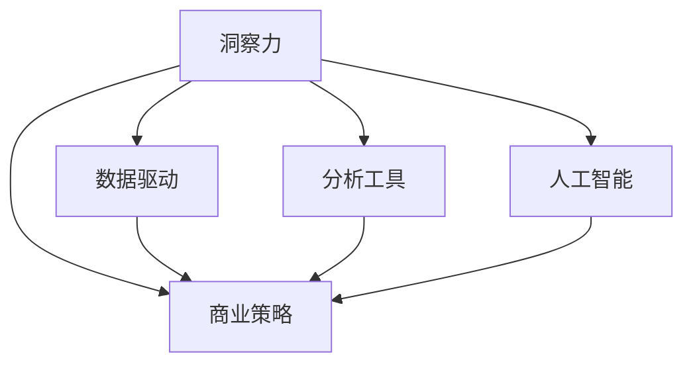

                 

# 理解洞察力的应用：在商业策略中的力量

> 关键词：洞察力,商业决策,策略,数据驱动,分析,机器学习,人工智能

## 1. 背景介绍

### 1.1 问题由来
在快速变化的商业环境中，洞察力对于企业制定有效策略至关重要。传统的商业决策往往依赖于经验和直觉，但在数据驱动的时代，如何高效地从海量数据中提取有价值的洞察力，并转化为商业策略，成为每个企业的迫切需求。为此，人工智能（AI）和大数据分析技术应运而生，帮助企业在数据海洋中挖掘隐藏的真知，推动商业决策的科学化、智能化。

### 1.2 问题核心关键点
洞察力的获取与利用，不仅仅是一个技术问题，更是一个跨学科的问题。它涉及数据科学、商业智能、心理学等多个领域。有效的洞察力不仅能揭示市场趋势、用户行为、竞争对手动态，还能为企业带来竞争优势和利润增长。

## 2. 核心概念与联系

### 2.1 核心概念概述

为了更好地理解洞察力在商业策略中的应用，本节将介绍几个关键概念及其相互联系：

- **洞察力**：指从数据中提取出的有价值的信息和洞见，这些洞见能够揭示业务趋势、行为模式、潜在问题和机遇。
- **商业策略**：企业在面对市场变化时，制定的长期目标、短期计划、行动步骤，旨在优化资源配置，提升盈利能力。
- **数据驱动**：基于数据分析和建模，决策过程更加客观、科学，减少主观偏差。
- **分析工具**：包括统计分析、机器学习、深度学习等方法，用于数据处理和模式识别。
- **人工智能（AI）**：模拟人类智能过程的技术，包括但不限于机器学习、自然语言处理、计算机视觉等，是洞察力获取的重要手段。

这些概念通过以下Mermaid流程图展示了它们之间的相互联系：



这个流程图展示了洞察力在商业策略制定过程中的关键作用，以及数据驱动、分析工具和人工智能如何共同支持这一过程。

## 3. 核心算法原理 & 具体操作步骤
### 3.1 算法原理概述

基于洞察力的商业策略制定，本质上是将大数据分析与商业智能相结合的过程。其核心思想是：通过数据挖掘和分析，从海量的数据中提取有价值的洞察力，并将其转化为具体的商业决策和行动。

形式化地，假设企业拥有大量历史数据 $D=\{(x_i, y_i)\}_{i=1}^N$，其中 $x_i$ 为业务事件，$y_i$ 为其结果（如销售额、用户转化率等）。商业策略的制定过程可以抽象为以下步骤：

1. 数据预处理：清洗、标准化和归一化数据，消除噪音和异常值。
2. 特征工程：提取、选择和构造有用的特征，构建数据表示。
3. 建模分析：选择合适的模型，如回归、分类、聚类等，进行数据分析和预测。
4. 洞察提取：从模型的预测结果中，提取有意义的洞察力，如市场趋势、用户行为模式等。
5. 策略制定：结合洞察力与业务目标，制定具体的商业策略，并进行实施和评估。

### 3.2 算法步骤详解

以下是基于洞察力的商业策略制定的详细步骤：

**Step 1: 数据收集与预处理**

- 收集与业务相关的多源数据，包括内部销售数据、客户行为数据、市场调研数据等。
- 进行数据清洗，处理缺失值、异常值和噪音数据。
- 对数据进行标准化和归一化，确保数据的一致性和可比性。

**Step 2: 特征工程**

- 根据业务需求，选择或构造有意义的特征。
- 对特征进行选择和降维，去除无关或冗余特征。
- 使用PCA、LDA等降维技术，减少数据维度，提高计算效率。

**Step 3: 模型选择与训练**

- 选择合适的模型，如线性回归、随机森林、神经网络等。
- 将数据集划分为训练集、验证集和测试集，进行模型训练。
- 使用交叉验证等技术，优化模型超参数，提升模型泛化能力。

**Step 4: 洞察力提取**

- 对模型预测结果进行分析，提取有用的洞察力。
- 使用聚类、分类等方法，揭示数据中的模式和趋势。
- 结合业务知识，将洞察力转化为具体的商业洞察。

**Step 5: 策略制定与实施**

- 结合洞察力，制定具体的商业策略，如市场定位、产品定价、营销策略等。
- 实施策略，并监控其效果，根据反馈进行调整和优化。

### 3.3 算法优缺点

基于洞察力的商业策略制定方法具有以下优点：

1. **客观性与科学性**：基于数据分析的策略制定，避免了主观偏见，更加客观科学。
2. **时效性**：通过实时数据分析，能够快速响应市场变化，制定动态策略。
3. **可操作性**：洞察力通常具体且可操作，易于转化为具体的行动步骤。

同时，该方法也存在以下局限性：

1. **数据质量依赖**：策略制定的准确性高度依赖于数据的质量和完整性，不完整或不准确的数据可能导致错误的洞察。
2. **复杂度较高**：从数据预处理到洞察力提取，每个步骤都需要精心设计，操作复杂度较高。
3. **技术门槛**：需要掌握数据分析、机器学习等技术，对技术人员的知识水平要求较高。
4. **解释性不足**：模型预测结果和洞察力的解释性不足，可能导致业务决策缺乏透明度。

尽管存在这些局限性，但整体而言，基于洞察力的商业策略制定方法仍是目前商业智能领域的主流方法。未来相关研究将重点关注如何进一步简化流程、提高可解释性和处理大数据的能力。

### 3.4 算法应用领域

基于洞察力的商业策略制定方法在多个领域都有广泛应用，例如：

- **市场分析**：通过数据分析揭示市场趋势、消费者行为，指导市场细分和定位。
- **客户管理**：利用客户数据，进行客户细分、需求预测和精准营销。
- **产品开发**：分析用户反馈和市场数据，指导产品设计和迭代。
- **风险管理**：通过数据预测和分析，识别潜在风险和机会，制定风险管理策略。
- **运营优化**：分析生产、供应链等运营数据，优化资源配置和流程管理。

## 4. 数学模型和公式 & 详细讲解 & 举例说明

### 4.1 数学模型构建

基于洞察力的商业策略制定，可以通过统计分析和机器学习等方法建立数学模型。以下是几个典型场景的数学模型构建：

- **线性回归模型**：
  $$
  y = \beta_0 + \beta_1x_1 + \beta_2x_2 + \ldots + \beta_nx_n + \epsilon
  $$
  其中 $y$ 为因变量（如销售额），$x_1, x_2, \ldots, x_n$ 为自变量（如广告支出、产品价格等），$\beta_0, \beta_1, \ldots, \beta_n$ 为回归系数，$\epsilon$ 为误差项。

- **决策树模型**：
  $$
  D = \{(x_i, y_i)\}_{i=1}^N
  $$
  其中 $D$ 为决策树，每个节点表示一个特征，叶节点表示最终决策。

- **聚类模型**：
  $$
  K = \{C_1, C_2, \ldots, C_k\}
  $$
  其中 $K$ 为聚类结果，$C_i$ 表示第 $i$ 个聚类。

### 4.2 公式推导过程

以下是线性回归模型和决策树模型的公式推导过程：

**线性回归模型**

1. 最小二乘估计
   $$
   \hat{\beta} = (X^TX)^{-1}X^Ty
   $$
   其中 $\hat{\beta}$ 为回归系数估计，$X$ 为自变量矩阵，$y$ 为目标变量向量。

2. 模型评估
   $$
   R^2 = 1 - \frac{\sum_{i=1}^N(y_i - \hat{y}_i)^2}{\sum_{i=1}^N(y_i - \bar{y})^2}
   $$
   其中 $R^2$ 为决定系数，$\bar{y}$ 为目标变量均值。

**决策树模型**

1. 信息增益
   $$
   IG(D, A) = H(D) - H(D|A)
   $$
   其中 $IG$ 为信息增益，$H(D)$ 为原始数据的熵，$H(D|A)$ 为在特征 $A$ 下的条件熵。

2. 剪枝
   $$
   \text{剪枝后误差} = \frac{1}{N}\sum_{i=1}^N(y_i - f_{\text{剪枝后}}(x_i))^2
   $$
   其中 $f_{\text{剪枝后}}$ 为剪枝后的决策树模型。

### 4.3 案例分析与讲解

**案例：电商网站用户流失预测**

1. 数据收集与预处理
   - 收集电商网站的用户行为数据，包括浏览、购买、评价等行为记录。
   - 进行数据清洗，处理缺失值和异常值。
   - 对数据进行标准化和归一化。

2. 特征工程
   - 提取用户特征，如购买频率、浏览时长、评价情感等。
   - 选择有意义的特征，如用户购买次数、评分平均值等。
   - 使用PCA等技术降维。

3. 模型选择与训练
   - 选择决策树模型，使用信息增益作为特征选择标准。
   - 将数据集划分为训练集、验证集和测试集，进行模型训练。
   - 使用交叉验证优化模型参数。

4. 洞察力提取
   - 对模型预测结果进行分析，提取用户流失的潜在因素。
   - 使用聚类分析用户行为，揭示不同用户群体的流失模式。

5. 策略制定与实施
   - 结合洞察力，制定针对性的用户留存策略，如个性化推荐、优惠券等。
   - 实施策略，并监控其效果，根据反馈进行调整和优化。

## 5. 项目实践：代码实例和详细解释说明

### 5.1 开发环境搭建

在进行商业策略制定项目的开发前，我们需要准备好开发环境。以下是使用Python进行Pandas、Scikit-learn和TensorFlow开发的环境配置流程：

1. 安装Anaconda：从官网下载并安装Anaconda，用于创建独立的Python环境。

2. 创建并激活虚拟环境：
```bash
conda create -n business-strategy python=3.8 
conda activate business-strategy
```

3. 安装Pandas：用于数据处理和分析。
```bash
conda install pandas
```

4. 安装Scikit-learn：用于机器学习和统计分析。
```bash
conda install scikit-learn
```

5. 安装TensorFlow：用于构建和训练模型。
```bash
conda install tensorflow
```

6. 安装相关工具包：
```bash
conda install numpy matplotlib seaborn jupyter notebook ipython
```

完成上述步骤后，即可在`business-strategy`环境中开始商业策略制定的开发。

### 5.2 源代码详细实现

下面我们以用户流失预测为例，给出使用Scikit-learn和TensorFlow进行商业策略制定的PyTorch代码实现。

首先，定义数据处理函数：

```python
import pandas as pd
from sklearn.model_selection import train_test_split
from sklearn.preprocessing import StandardScaler
from sklearn.ensemble import RandomForestClassifier

def load_data(file_path):
    df = pd.read_csv(file_path)
    return df

def preprocess_data(df, target):
    X = df.drop(target, axis=1)
    y = df[target]
    X_train, X_test, y_train, y_test = train_test_split(X, y, test_size=0.2, random_state=42)
    scaler = StandardScaler()
    X_train = scaler.fit_transform(X_train)
    X_test = scaler.transform(X_test)
    return X_train, X_test, y_train, y_test
```

然后，定义模型和评估函数：

```python
from sklearn.ensemble import RandomForestClassifier
from sklearn.metrics import accuracy_score, precision_score, recall_score, f1_score

def train_model(X_train, y_train, model):
    model.fit(X_train, y_train)
    return model

def evaluate_model(model, X_test, y_test):
    y_pred = model.predict(X_test)
    accuracy = accuracy_score(y_test, y_pred)
    precision = precision_score(y_test, y_pred)
    recall = recall_score(y_test, y_pred)
    f1 = f1_score(y_test, y_pred)
    return accuracy, precision, recall, f1
```

最后，启动训练流程并在测试集上评估：

```python
from tensorflow import keras

# 加载数据
df = load_data('user_data.csv')
X_train, X_test, y_train, y_test = preprocess_data(df, 'churn')

# 定义模型
model = keras.Sequential([
    keras.layers.Dense(64, activation='relu'),
    keras.layers.Dense(32, activation='relu'),
    keras.layers.Dense(1, activation='sigmoid')
])

# 编译模型
model.compile(optimizer='adam', loss='binary_crossentropy', metrics=['accuracy'])

# 训练模型
model.fit(X_train, y_train, epochs=10, batch_size=64)

# 评估模型
accuracy, precision, recall, f1 = evaluate_model(model, X_test, y_test)
print(f"Accuracy: {accuracy:.2f}, Precision: {precision:.2f}, Recall: {recall:.2f}, F1-Score: {f1:.2f}")
```

以上就是使用Python进行商业策略制定的完整代码实现。可以看到，得益于Scikit-learn和TensorFlow的强大封装，我们可以用相对简洁的代码完成数据处理、模型构建和评估等关键步骤。

### 5.3 代码解读与分析

让我们再详细解读一下关键代码的实现细节：

**load_data函数**：
- 加载数据文件，并返回数据框。

**preprocess_data函数**：
- 对数据进行预处理，包括特征选择、数据分割、标准化等步骤。

**train_model函数**：
- 训练随机森林模型，返回训练好的模型。

**evaluate_model函数**：
- 评估模型的预测性能，返回准确率、精确率、召回率和F1分数。

**主程序**：
- 加载数据并进行预处理。
- 定义模型，并进行训练和评估。
- 输出模型性能指标。

这些代码展示了商业策略制定过程的关键步骤，即数据预处理、模型构建和评估。通过优化这些步骤，可以显著提升商业策略制定的效果和效率。

## 6. 实际应用场景

### 6.1 智能客服系统

基于商业策略制定的智能客服系统，可以帮助企业提升客户服务质量，降低客户流失率。传统客服系统依赖人工客服，成本高且响应速度慢，而智能客服系统通过数据分析和模型预测，能够实时监测客户情绪和行为，快速识别并解决问题。

在技术实现上，可以收集历史客户数据和客服记录，提取客户满意度和投诉事件等特征。在此基础上训练预测模型，预测客户的流失倾向，并根据预测结果采取针对性措施。如对于高流失风险的客户，主动联系并提供个性化服务，从而减少流失率。

### 6.2 金融风险管理

金融行业面临高风险和高波动性，有效的风险管理策略能够帮助金融机构降低风险，保障稳健运营。通过商业策略制定，可以实时分析市场数据和客户行为，预测风险事件的发生概率，制定风险管理策略。

具体而言，可以收集市场交易数据、客户信用记录和新闻舆情等信息，构建多维度数据模型。使用随机森林等模型预测信用风险和市场风险，并根据预测结果制定相应的风险控制措施，如调整贷款额度、增加保证金等。

### 6.3 个性化推荐系统

电商和内容平台需要向用户推荐个性化的商品和内容，以提升用户体验和转化率。基于商业策略制定的推荐系统，能够根据用户行为和偏好，生成个性化的推荐结果。

在技术实现上，可以收集用户的浏览、购买和评价数据，提取用户兴趣特征。使用协同过滤和内容推荐等方法，构建用户兴趣模型，并根据模型预测用户对不同商品或内容的兴趣程度。基于预测结果进行推荐，并根据用户反馈不断调整和优化推荐算法。

### 6.4 未来应用展望

随着商业策略制定技术的不断发展，其应用领域将进一步拓展，为各行业带来更深入的洞察力和更大的价值。未来，我们期待在以下几个方向取得更多突破：

- **实时分析**：利用大数据和流计算技术，实现实时数据分析和决策支持，帮助企业快速响应市场变化。
- **跨领域融合**：将商业策略制定与其他领域（如物联网、区块链等）进行融合，形成更为综合的决策支持系统。
- **智能客服**：结合自然语言处理和机器学习技术，提升智能客服的智能化水平，实现更高效的客户交互。
- **个性化推荐**：结合深度学习和大数据技术，构建更加精准和个性化的推荐系统，提升用户满意度和平台收益。
- **风险管理**：通过多维度数据分析和模型预测，实现更准确的风险评估和管理，保障金融安全和稳定运营。

## 7. 工具和资源推荐

### 7.1 学习资源推荐

为了帮助开发者系统掌握商业策略制定的技术基础和实践技巧，这里推荐一些优质的学习资源：

1. 《机器学习实战》系列博文：由知名数据科学家撰写，介绍了机器学习模型的构建和应用，包括商业策略制定在内。

2. Coursera《数据科学与机器学习》课程：由Johns Hopkins大学开设，涵盖数据科学和机器学习的基本概念和实践技术，适合初学者。

3. Kaggle竞赛：Kaggle提供丰富的数据集和竞赛任务，帮助学习者通过实战提升数据分析和建模能力。

4. DataCamp在线学习平台：提供大量的数据科学课程和实践项目，涵盖商业策略制定、数据分析等多个方向。

5. O'Reilly《商业智能分析实战》书籍：详细介绍了商业智能分析的原理、方法和工具，适合实际应用中的参考。

通过对这些资源的学习实践，相信你一定能够快速掌握商业策略制定的精髓，并用于解决实际的商业问题。

### 7.2 开发工具推荐

高效的开发离不开优秀的工具支持。以下是几款用于商业策略制定开发的常用工具：

1. Python：基于Python的开源数据分析和机器学习库，适合快速迭代研究。

2. R：基于R语言的开源数据分析和统计库，适合统计分析和高阶建模。

3. Jupyter Notebook：交互式编程环境，支持多种语言和库的混合使用，方便实时调试和展示结果。

4. Tableau：可视化分析工具，支持多维度数据分析和报表展示，适合业务人员使用。

5. Power BI：微软推出的商业智能工具，支持数据集成和可视化分析，适合企业级应用。

合理利用这些工具，可以显著提升商业策略制定的开发效率，加快创新迭代的步伐。

### 7.3 相关论文推荐

商业策略制定领域的研究已经取得了诸多进展，以下是几篇奠基性的相关论文，推荐阅读：

1. "Predicting Customer Churn: A Random Forest Approach"：使用随机森林模型预测客户流失，揭示客户流失的关键因素。

2. "A Survey on Customer Churn Prediction"：综述了客户流失预测的多种方法，比较其优缺点。

3. "Customer Segmentation and Churn Prediction: A Multimodal Approach"：利用多模态数据进行客户细分和流失预测，提高模型效果。

4. "Big Data Mining and Statistical Learning"：介绍大数据分析中的统计学习方法，适用于商业策略制定的数据分析阶段。

5. "Risk Management in Finance: A Survey"：综述了金融风险管理的多种方法，包括模型预测和策略制定。

这些论文代表了大数据和商业智能领域的最新进展，通过学习这些前沿成果，可以帮助研究者把握学科前进方向，激发更多的创新灵感。

## 8. 总结：未来发展趋势与挑战

### 8.1 总结

本文对基于商业策略制定的洞察力应用进行了全面系统的介绍。首先阐述了商业策略制定的研究背景和意义，明确了洞察力在商业决策中的重要作用。其次，从原理到实践，详细讲解了商业策略制定的数学模型和关键步骤，给出了商业策略制定的完整代码实例。同时，本文还广泛探讨了商业策略制定在智能客服、金融风险管理、个性化推荐等多个行业领域的应用前景，展示了商业策略制定的巨大潜力。此外，本文精选了商业策略制定的各类学习资源，力求为读者提供全方位的技术指引。

通过本文的系统梳理，可以看到，基于商业策略制定的洞察力应用正在成为商业智能领域的重要范式，极大地拓展了数据分析和机器学习的应用边界，催生了更多的落地场景。受益于大数据和机器学习技术的发展，商业策略制定的效果和效率将进一步提升，为各行业的数字化转型提供强大的技术支持。

### 8.2 未来发展趋势

展望未来，商业策略制定领域将呈现以下几个发展趋势：

1. **大数据与AI的融合**：随着数据量的增加和计算能力的提升，大数据与AI的融合将更加紧密，商业策略制定将利用更多元、更复杂的数据源。

2. **实时分析与决策支持**：实时数据分析和决策支持系统将成为主流，帮助企业快速响应市场变化，提升决策效率。

3. **跨领域应用**：商业策略制定将与其他领域（如物联网、区块链等）进行深度融合，形成更综合的决策支持系统。

4. **模型解释性与透明度**：商业策略制定的模型将更加注重解释性和透明度，帮助企业理解模型决策过程，提升决策的科学性和可信度。

5. **人机协同**：商业策略制定将结合人类专家知识和AI技术，实现人机协同决策，提升决策的全面性和准确性。

以上趋势凸显了商业策略制定的广阔前景。这些方向的探索发展，将进一步提升商业智能系统的性能和应用范围，为各行业带来更深层次的洞察力和更大的价值。

### 8.3 面临的挑战

尽管商业策略制定技术已经取得了瞩目成就，但在迈向更加智能化、普适化应用的过程中，它仍面临诸多挑战：

1. **数据质量问题**：数据质量直接影响商业策略制定的效果，不完整或不准确的数据可能导致错误的洞察。
2. **技术门槛高**：商业策略制定的技术复杂度高，需要掌握数据分析、机器学习等多种技术，对技术人员的知识水平要求较高。
3. **模型解释性不足**：商业策略制定的模型通常较为复杂，模型的解释性不足，可能导致业务决策缺乏透明度。
4. **隐私与安全问题**：商业策略制定涉及大量个人和敏感数据，隐私保护和安全问题是重要关注点。
5. **跨部门协同**：商业策略制定涉及多个部门和业务领域，跨部门协同的难度较大，需要建立良好的沟通和协作机制。

正视商业策略制定面临的这些挑战，积极应对并寻求突破，将使该技术更好地服务于商业决策，促进各行业的数字化转型。

### 8.4 研究展望

面对商业策略制定所面临的挑战，未来的研究需要在以下几个方面寻求新的突破：

1. **提升数据质量**：优化数据收集和预处理流程，确保数据的完整性和准确性，提高商业策略制定的效果。

2. **降低技术门槛**：开发更加易用的工具和平台，简化商业策略制定的流程，降低技术入门的门槛。

3. **增强模型解释性**：开发更加透明、可解释的模型，帮助企业理解模型决策过程，提升决策的科学性和可信度。

4. **强化隐私保护**：建立严格的隐私保护机制，确保数据使用的合法性和安全性，保护用户隐私。

5. **促进跨部门协作**：建立跨部门的数据共享和协作机制，提高商业策略制定的全面性和准确性。

这些研究方向的探索，将引领商业策略制定技术迈向更高的台阶，为各行业带来更深入的洞察力和更大的价值。面向未来，商业策略制定技术还需要与其他人工智能技术进行更深入的融合，如知识表示、因果推理、强化学习等，多路径协同发力，共同推动智能决策系统的进步。只有勇于创新、敢于突破，才能不断拓展商业智能系统的边界，让智能技术更好地造福人类社会。

## 9. 附录：常见问题与解答

**Q1：商业策略制定是否适用于所有企业？**

A: 商业策略制定的应用非常广泛，几乎适用于所有规模和类型的企业。但不同行业和领域可能需要结合自身特点进行调整和优化。

**Q2：如何确保商业策略制定的准确性？**

A: 确保商业策略制定的准确性需要从数据预处理、模型选择和评估等多个环节进行全面优化。同时，定期对模型进行更新和重新评估，以适应市场变化。

**Q3：商业策略制定的过程是否复杂？**

A: 商业策略制定的过程确实较为复杂，涉及多个步骤和多种技术。但借助先进工具和开源库，可以显著简化流程，提升效率。

**Q4：商业策略制定是否需要大量技术知识？**

A: 是的，商业策略制定需要掌握数据分析、机器学习等多种技术。但可以通过学习资源和在线课程逐步掌握相关知识。

**Q5：商业策略制定的未来趋势是什么？**

A: 商业策略制定的未来趋势包括大数据与AI的融合、实时分析与决策支持、跨领域应用、模型解释性提升和人机协同决策。这些趋势将进一步推动商业智能的发展。

---

作者：禅与计算机程序设计艺术 / Zen and the Art of Computer Programming

