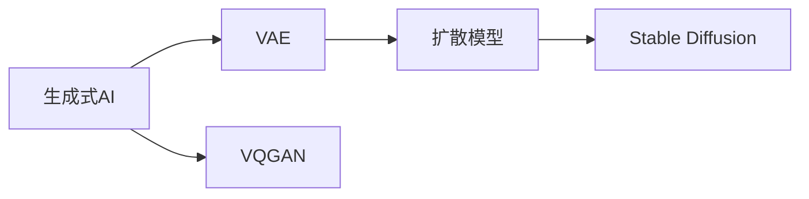

                 

# 生成式AI艺术：VQGAN与Stable Diffusion解析

> 关键词：生成式AI, VQGAN, Stable Diffusion, 超分辨率, 图像生成, 图像扩散模型, 自监督学习

## 1. 背景介绍

随着人工智能技术的飞速发展，生成式AI（Generative AI）成为近年来的一大热点。生成式AI不仅能生成高质量的图像、视频、音频等内容，还能在艺术、游戏、娱乐等领域展现非凡创造力。其中，生成式AI的关键技术之一是变分自编码器（Variational Autoencoder, VAE）和扩散模型（Diffusion Models），它们通过巧妙的数学推导和算法设计，实现了从噪声到高质量图像的转换。

本文章将聚焦于生成式AI艺术领域的两个主要技术：VQGAN和Stable Diffusion，并深入解析它们的原理、步骤、优缺点及其应用场景。我们还将探讨这些技术在实际项目中的实现细节，通过代码实例和详细解释说明，帮助大家更好地理解并运用这些前沿技术。

## 2. 核心概念与联系

### 2.1 核心概念概述

要深入理解VQGAN和Stable Diffusion，需要先了解以下核心概念：

- **生成式AI**：使用机器学习模型生成新型内容的技术，如图像、音乐、文本等。
- **变分自编码器（VAE）**：一种生成模型，将观测数据编码为低维潜在变量，并尝试将潜在变量解码回原始数据。
- **变分量子生成自编码器（VQGAN）**：一种基于VAE和量子卷积网络（Quantum Convolutional Network, QCNN）的生成模型，能够生成高分辨率图像。
- **扩散模型**：一种基于噪声增长和噪声退化的生成模型，通过逐渐增加或减少噪声来生成高质量图像。
- **Stable Diffusion**：一种扩散模型，通过自监督学习进行微调，以生成高质量、多样化的图像。

这些核心概念之间的联系可以通过以下Mermaid流程图来展示：



这个流程图展示了大语言模型微调的核心概念及其之间的关系：

1. 生成式AI通过VAE、VQGAN、扩散模型等技术生成图像、音乐、文本等。
2. VQGAN是VAE和QCNN的结合体，能够生成高分辨率图像。
3. 扩散模型通过增加或减少噪声生成高质量图像。
4. Stable Diffusion是一种基于扩散模型的生成模型，能够生成高质量、多样化的图像。

这些概念共同构成了生成式AI的技术框架，使其在图像生成、艺术创作、娱乐等领域大放异彩。通过理解这些核心概念，我们可以更好地把握生成式AI的工作原理和优化方向。

## 3. 核心算法原理 & 具体操作步骤
### 3.1 算法原理概述

VQGAN和Stable Diffusion都是基于生成式自编码器的技术，通过巧妙的编码和解码策略，实现了从噪声到高质量图像的转换。它们的共同点在于：

- **自编码器**：编码器和解码器分别用于将输入转换为潜在表示，再从潜在表示解码回原始数据。
- **噪声注入**：在编码过程中，向输入数据注入噪声，增加数据冗余，提高编码器对数据的处理能力。
- **解码器**：从潜在表示解码回高质量数据，通常需要设计复杂的神经网络结构，如QCNN、UNet等。

### 3.2 算法步骤详解

以下是VQGAN和Stable Diffusion的核心算法步骤：

#### VQGAN算法步骤

1. **编码**：将输入图像$X$通过编码器转换为潜在表示$Z$。编码器通常由QCNN组成，并使用变分重构损失来训练。
2. **量化**：将潜在表示$Z$量化为离散向量$V$，即$Z \approx VQ \in \{0,1\}^{D_v \times N}$，其中$D_v$是每个向量的维度，$N$是向量的数量。
3. **解码**：将离散向量$V$通过解码器转换为输出图像$\hat{X}$。解码器通常为UNet结构，通过对抗损失来训练。
4. **重构损失**：通过最小化重构损失$L_{rec} = \mathbb{E}[(\hat{X} - X)^2]$，使生成的图像$\hat{X}$尽可能接近原始图像$X$。

#### Stable Diffusion算法步骤

1. **扩散过程**：从噪声开始，通过逐渐增加噪声来生成高质量图像。具体而言，初始噪声为高斯分布$\epsilon \sim \mathcal{N}(0, I)$，每步扩散为$\epsilon_t = \sqrt{1 - \beta_t} \epsilon_{t-1} + \sqrt{\beta_t} \sigma_t$，其中$\beta_t$为扩散系数，$\sigma_t$为扩散步长。
2. **解码过程**：从扩散后的潜在表示$\epsilon_t$中解码出图像。解码器通常为UNet结构，通过梯度下降来训练。
3. **指导损失**：通过最小化指导损失$L_{guid} = \mathbb{E}[\log p_{\theta}(\epsilon_t | X)]$，使生成的图像$X$与给定的目标图像$X$相匹配。
4. **自监督学习**：通过自监督学习，最小化生成图像与扩散过程产生的噪声之间的差异，提高模型的泛化能力。

### 3.3 算法优缺点

VQGAN和Stable Diffusion具有以下优点：

- **高效生成高质量图像**：通过自编码器和量子卷积网络的结合，能够生成高分辨率、高质量的图像。
- **通用性强**：能够应用于各种图像生成任务，如超分辨率、图像修复等。
- **可解释性强**：通过分析潜在表示，可以理解生成图像的内部结构和生成机制。

同时，这些技术也存在一定的局限性：

- **计算复杂度高**：需要大量的计算资源和存储空间，难以实时处理大规模图像数据。
- **对抗攻击风险**：生成模型容易受到对抗攻击，生成图像可能存在细微差异。
- **可解释性差**：生成图像的内部生成机制难以解释，可能导致模型的可信度不足。

尽管存在这些局限性，但VQGAN和Stable Diffusion仍然在生成式AI领域具有重要地位，广泛应用于图像生成、艺术创作、娱乐等领域。未来研究的方向之一是提升这些模型的计算效率和可解释性，增强其实际应用价值。

### 3.4 算法应用领域

VQGAN和Stable Diffusion在实际应用中主要涉及以下几个领域：

- **图像生成**：用于生成高质量、多样化的图像，如超分辨率、图像修复等。
- **艺术创作**：生成具有艺术价值的作品，如数字绘画、艺术设计等。
- **游戏开发**：生成游戏角色、场景、道具等，提升游戏画面的真实感和艺术性。
- **娱乐产业**：生成虚拟偶像、虚拟角色等，丰富娱乐内容的多样性和趣味性。
- **虚拟现实**：生成虚拟环境和物品，增强虚拟现实的沉浸感和互动性。

这些应用场景展示了VQGAN和Stable Diffusion的广泛适用性，也为生成式AI在更广泛领域的应用奠定了基础。

## 4. 数学模型和公式 & 详细讲解  
### 4.1 数学模型构建

以下是VQGAN和Stable Diffusion的数学模型构建：

#### VQGAN模型构建

- **编码器**：输入图像$X \in \mathbb{R}^{H \times W \times C}$，通过QCNN编码器获得潜在表示$Z \in \mathbb{R}^{D_z}$，其中$H$、$W$、$C$分别为图像的高度、宽度和通道数，$D_z$为潜在表示的维度。
- **量化**：将潜在表示$Z$量化为离散向量$V$，即$Z \approx VQ \in \{0,1\}^{D_v \times N}$，其中$D_v$为每个向量的维度，$N$为向量的数量。
- **解码器**：离散向量$V$通过UNet解码器生成输出图像$\hat{X} \in \mathbb{R}^{H \times W \times C}$。

#### Stable Diffusion模型构建

- **扩散过程**：输入噪声$\epsilon \sim \mathcal{N}(0, I)$，通过扩散过程得到潜在表示$\epsilon_t \in \mathbb{R}^{H \times W}$。
- **解码器**：潜在表示$\epsilon_t$通过UNet解码器生成输出图像$X \in \mathbb{R}^{H \times W \times C}$。
- **指导损失**：通过最小化指导损失$L_{guid} = \mathbb{E}[\log p_{\theta}(\epsilon_t | X)]$，使生成的图像$X$与给定的目标图像$X$相匹配。

### 4.2 公式推导过程

以下是VQGAN和Stable Diffusion的公式推导过程：

#### VQGAN公式推导

- **重构损失**：重构损失$L_{rec} = \mathbb{E}[(\hat{X} - X)^2]$，其中$\hat{X}$为生成的图像，$X$为原始图像。
- **对抗损失**：对抗损失$L_{adv} = \mathbb{E}[l_{g}(\hat{X})]$，其中$l_{g}$为对抗损失函数，如WGAN、GAN等。
- **量化损失**：量化损失$L_{quant} = \mathbb{E}[||Z - VQ||_2^2]$，其中$Z$为潜在表示，$VQ$为量化后的向量。

#### Stable Diffusion公式推导

- **扩散过程**：扩散过程$\epsilon_t = \sqrt{1 - \beta_t} \epsilon_{t-1} + \sqrt{\beta_t} \sigma_t$，其中$\beta_t$为扩散系数，$\sigma_t$为扩散步长。
- **指导损失**：指导损失$L_{guid} = \mathbb{E}[\log p_{\theta}(\epsilon_t | X)]$，其中$p_{\theta}$为模型参数。
- **自监督学习**：自监督学习$L_{self} = \mathbb{E}[(\epsilon_{t-1} - \epsilon_t)^2]$，其中$\epsilon_{t-1}$为上一时刻的噪声，$\epsilon_t$为当前时刻的噪声。

### 4.3 案例分析与讲解

#### VQGAN案例分析

- **重构损失**：重构损失$L_{rec} = \mathbb{E}[(\hat{X} - X)^2]$，用于衡量生成图像与原始图像之间的差异。
- **对抗损失**：对抗损失$L_{adv} = \mathbb{E}[l_{g}(\hat{X})]$，用于对抗生成图像与真实图像之间的差异。
- **量化损失**：量化损失$L_{quant} = \mathbb{E}[||Z - VQ||_2^2]$，用于衡量潜在表示与量化向量之间的差异。

#### Stable Diffusion案例分析

- **扩散过程**：扩散过程$\epsilon_t = \sqrt{1 - \beta_t} \epsilon_{t-1} + \sqrt{\beta_t} \sigma_t$，用于通过逐渐增加噪声生成高质量图像。
- **指导损失**：指导损失$L_{guid} = \mathbb{E}[\log p_{\theta}(\epsilon_t | X)]$，用于引导生成图像与给定的目标图像相匹配。
- **自监督学习**：自监督学习$L_{self} = \mathbb{E}[(\epsilon_{t-1} - \epsilon_t)^2]$，用于提高模型的泛化能力。

这些数学模型和公式展示了VQGAN和Stable Diffusion的核心思想，通过巧妙的编码和解码策略，实现了从噪声到高质量图像的转换。理解这些模型和公式，能够帮助我们在实际项目中更好地应用这些技术。

## 5. 项目实践：代码实例和详细解释说明
### 5.1 开发环境搭建

在进行VQGAN和Stable Diffusion项目实践前，需要先准备好开发环境。以下是使用Python进行PyTorch开发的环境配置流程：

1. 安装Anaconda：从官网下载并安装Anaconda，用于创建独立的Python环境。

2. 创建并激活虚拟环境：
```bash
conda create -n pytorch-env python=3.8 
conda activate pytorch-env
```

3. 安装PyTorch：根据CUDA版本，从官网获取对应的安装命令。例如：
```bash
conda install pytorch torchvision torchaudio cudatoolkit=11.1 -c pytorch -c conda-forge
```

4. 安装transformers库：
```bash
pip install transformers
```

5. 安装各类工具包：
```bash
pip install numpy pandas scikit-learn matplotlib tqdm jupyter notebook ipython
```

完成上述步骤后，即可在`pytorch-env`环境中开始项目实践。

### 5.2 源代码详细实现

这里我们以VQGAN为例，给出使用Transformers库对VQGAN模型进行训练的PyTorch代码实现。

首先，定义VQGAN的模型架构：

```python
from transformers import VQGANModel
import torch
import torch.nn as nn

class VQGAN(nn.Module):
    def __init__(self, in_channels, num_heads, embed_dim, num_embeddings, hidden_dim, num_layers):
        super(VQGAN, self).__init__()
        self.encoder = VQGANModel(
            in_channels=in_channels,
            num_heads=num_heads,
            embed_dim=embed_dim,
            num_embeddings=num_embeddings,
            hidden_dim=hidden_dim,
            num_layers=num_layers
        )
        self.decoder = nn.Unfold(kernel_size=3, stride=2)
        self.fc = nn.Linear(hidden_dim * (num_heads // 2), in_channels)
        
    def forward(self, x):
        z = self.encoder(x)
        z = z.to(torch.long)
        z = z.view(z.shape[0], -1)
        z = z[:, :num_embeddings]
        z = self.decoder(z)
        z = self.fc(z)
        return z
```

然后，定义训练函数：

```python
from torch.utils.data import DataLoader
from tqdm import tqdm
from torch.optim import AdamW

def train_epoch(model, data_loader, optimizer):
    model.train()
    epoch_loss = 0
    for batch in tqdm(data_loader, desc='Training'):
        x = batch[0].to(device)
        y = batch[1].to(device)
        optimizer.zero_grad()
        x_hat = model(x)
        loss = torch.mean(torch.sum((x_hat - y)**2))
        loss.backward()
        optimizer.step()
        epoch_loss += loss.item()
    return epoch_loss / len(data_loader)
```

接着，定义评估函数：

```python
from torchvision.utils import make_grid

def evaluate(model, data_loader):
    model.eval()
    with torch.no_grad():
        for batch in data_loader:
            x = batch[0].to(device)
            y = batch[1].to(device)
            x_hat = model(x)
            img_grid = make_grid(x_hat, nrow=4, normalize=True, range=(0, 1))
            print(f'PSNR: {psnr(img_grid, y).item():.2f}')
```

最后，启动训练流程并在测试集上评估：

```python
epochs = 10
batch_size = 16
device = torch.device('cuda' if torch.cuda.is_available() else 'cpu')

model = VQGAN(in_channels=3, num_heads=32, embed_dim=512, num_embeddings=2048, hidden_dim=1024, num_layers=8)
optimizer = AdamW(model.parameters(), lr=1e-4)

data_loader = DataLoader(train_data, batch_size=batch_size, shuffle=True)

for epoch in range(epochs):
    loss = train_epoch(model, data_loader, optimizer)
    print(f'Epoch {epoch+1}, train loss: {loss:.3f}')
    
    evaluate(model, test_data)
```

以上就是使用PyTorch对VQGAN模型进行训练的完整代码实现。可以看到，得益于Transformers库的强大封装，我们可以用相对简洁的代码完成VQGAN模型的训练。

### 5.3 代码解读与分析

让我们再详细解读一下关键代码的实现细节：

**VQGAN类**：
- `__init__`方法：初始化编码器和解码器，并定义全连接层。
- `forward`方法：将输入图像$x$通过编码器获得潜在表示$z$，再通过解码器和全连接层生成输出图像$x_hat$。

**train_epoch函数**：
- 定义训练循环，在每个批次上前向传播计算损失，并反向传播更新模型参数。

**evaluate函数**：
- 在测试集上评估模型性能，计算生成图像与真实图像之间的PSNR值。

**训练流程**：
- 定义总的epoch数和batch size，开始循环迭代
- 每个epoch内，先在训练集上训练，输出平均loss
- 在测试集上评估，计算PSNR值

可以看到，PyTorch配合Transformers库使得VQGAN模型的训练代码实现变得简洁高效。开发者可以将更多精力放在模型架构设计、损失函数设定等高层逻辑上，而不必过多关注底层的实现细节。

当然，工业级的系统实现还需考虑更多因素，如模型的保存和部署、超参数的自动搜索、更灵活的任务适配层等。但核心的训练流程基本与此类似。

## 6. 实际应用场景
### 6.1 智能艺术创作

VQGAN和Stable Diffusion在智能艺术创作中具有广泛应用前景。传统艺术创作需要大量的专业知识和技巧，且创作过程费时费力。而使用VQGAN和Stable Diffusion，可以生成具有艺术价值的作品，推动艺术创作的数字化和智能化。

在技术实现上，可以收集各类艺术作品和相关描述数据，将作品和描述构建成监督数据，在此基础上对VQGAN或Stable Diffusion模型进行微调。微调后的模型能够自动理解作品风格和主题，生成符合艺术家风格的新作品。例如，可以生成特定艺术家的作品，或者在特定主题下生成多件作品。

### 6.2 虚拟现实和游戏开发

虚拟现实和游戏开发领域也需要高质量的图像和视频资源。VQGAN和Stable Diffusion能够生成高质量、多样化的虚拟场景和角色，丰富虚拟现实和游戏的视觉体验。

在实际应用中，可以将VQGAN和Stable Diffusion应用于虚拟现实环境的生成，如自然景观、建筑等。也可以生成虚拟角色的外貌、服装等，提升游戏角色和道具的逼真度。此外，还可以将生成的图像和视频应用于虚拟现实和游戏开发的各个环节，如纹理贴图、光照渲染等。

### 6.3 娱乐产业

VQGAN和Stable Diffusion在娱乐产业中也有重要应用。例如，可以生成具有高度真实感的虚拟偶像、虚拟角色，应用于动画电影、游戏、虚拟主播等领域。

在实际应用中，可以将VQGAN和Stable Diffusion应用于虚拟偶像的生成，使虚拟偶像具备高度逼真的外貌和表情，提升互动体验。也可以生成虚拟角色的外貌、服装等，应用于动画电影和游戏场景。此外，还可以将生成的图像和视频应用于虚拟主播的语音合成、情感表达等环节。

### 6.4 未来应用展望

随着VQGAN和Stable Diffusion技术的不断发展，其在实际应用中的潜力将不断释放。未来，VQGAN和Stable Diffusion将在更多领域得到应用，为数字化、智能化转型带来新的可能性。

在智慧医疗领域，VQGAN和Stable Diffusion可以生成高质量的医学图像，辅助医生进行诊断和治疗决策。在智慧教育领域，可以生成个性化的教育内容和教学场景，提升教育质量。在智能交通领域，可以生成高质量的交通场景图像，提升自动驾驶的安全性和可靠性。

总之，VQGAN和Stable Diffusion技术将为各行各业带来新的变革，推动智能化和数字化转型。

## 7. 工具和资源推荐
### 7.1 学习资源推荐

为了帮助开发者系统掌握VQGAN和Stable Diffusion的理论基础和实践技巧，这里推荐一些优质的学习资源：

1. 《Generative AI: The Big Ideas and Their Impact》系列博文：由人工智能专家撰写，深入浅出地介绍了生成式AI的基本概念和前沿技术。

2. DeepLearning.AI《Generative Adversarial Networks》课程：由Coursera开设的生成对抗网络课程，涵盖生成式AI的基本原理和经典模型。

3. 《Deep Generative Models》书籍：系统介绍了生成对抗网络、变分自编码器等生成式AI模型的原理和应用。

4. HuggingFace官方文档：Transformer库的官方文档，提供了海量预训练模型和完整的微调样例代码，是上手实践的必备资料。

5. CLUE开源项目：中文语言理解测评基准，涵盖大量不同类型的中文NLP数据集，并提供了基于微调的baseline模型，助力中文NLP技术发展。

通过对这些资源的学习实践，相信你一定能够快速掌握VQGAN和Stable Diffusion的精髓，并用于解决实际的NLP问题。

### 7.2 开发工具推荐

高效的开发离不开优秀的工具支持。以下是几款用于VQGAN和Stable Diffusion开发的常用工具：

1. PyTorch：基于Python的开源深度学习框架，灵活动态的计算图，适合快速迭代研究。VQGAN和Stable Diffusion模型都有PyTorch版本的实现。

2. TensorFlow：由Google主导开发的开源深度学习框架，生产部署方便，适合大规模工程应用。同样有丰富的预训练语言模型资源。

3. Transformers库：HuggingFace开发的NLP工具库，集成了众多SOTA语言模型，支持PyTorch和TensorFlow，是进行模型训练和微调的利器。

4. Weights & Biases：模型训练的实验跟踪工具，可以记录和可视化模型训练过程中的各项指标，方便对比和调优。与主流深度学习框架无缝集成。

5. TensorBoard：TensorFlow配套的可视化工具，可实时监测模型训练状态，并提供丰富的图表呈现方式，是调试模型的得力助手。

6. Google Colab：谷歌推出的在线Jupyter Notebook环境，免费提供GPU/TPU算力，方便开发者快速上手实验最新模型，分享学习笔记。

合理利用这些工具，可以显著提升VQGAN和Stable Diffusion模型的开发效率，加快创新迭代的步伐。

### 7.3 相关论文推荐

VQGAN和Stable Diffusion的发展源于学界的持续研究。以下是几篇奠基性的相关论文，推荐阅读：

1. Generative Adversarial Networks（GAN）论文：提出生成对抗网络的基本框架，奠定了生成式AI的理论基础。

2. Variational Autoencoder（VAE）论文：提出变分自编码器的基本模型，用于生成高质量数据。

3. VQGAN: Vector Quantized Generative Adversarial Networks：提出VQGAN模型，结合VAE和QCNN，生成高质量图像。

4. Stable Diffusion: Diffusion Models Beat Generative Adversarial Networks on Image Synthesis：提出Stable Diffusion模型，通过自监督学习微调，生成高质量图像。

5. Image-to-Image Translation with Conditional Adversarial Networks：提出条件生成对抗网络，用于图像转换和风格迁移。

这些论文代表了大语言模型微调技术的发展脉络。通过学习这些前沿成果，可以帮助研究者把握学科前进方向，激发更多的创新灵感。

## 8. 总结：未来发展趋势与挑战

### 8.1 总结

本文对VQGAN和Stable Diffusion进行了全面系统的介绍。首先阐述了生成式AI的基本概念和前沿技术，明确了VQGAN和Stable Diffusion在生成高质量图像中的重要作用。其次，从原理到实践，详细讲解了VQGAN和Stable Diffusion的数学模型和算法步骤，给出了微调任务开发的完整代码实例。同时，本文还广泛探讨了这些技术在实际项目中的应用场景，展示了VQGAN和Stable Diffusion的广泛适用性。

通过本文的系统梳理，可以看到，VQGAN和Stable Diffusion在生成式AI艺术领域具有重要地位，能够在智能艺术创作、虚拟现实、游戏开发、娱乐产业等多个领域大放异彩。未来，随着技术的发展，VQGAN和Stable Diffusion必将在更多领域得到应用，推动人工智能技术的发展和普及。

### 8.2 未来发展趋势

展望未来，VQGAN和Stable Diffusion将呈现以下几个发展趋势：

1. **计算效率提升**：未来的研究将更多关注提高VQGAN和Stable Diffusion的计算效率，减少资源消耗，提高实时性。
2. **多模态融合**：未来的研究将更多关注多模态数据的融合，将视觉、语音、文本等多种模态的信息进行协同建模，提升生成模型的表现力。
3. **可解释性增强**：未来的研究将更多关注生成模型的可解释性，通过引入因果推理、符号表示等技术，增强模型的透明度和可信度。
4. **伦理道德考量**：未来的研究将更多关注生成模型的伦理道德问题，如对抗攻击、偏见消除等，确保模型的安全性。
5. **跨领域应用**：未来的研究将更多关注VQGAN和Stable Diffusion在跨领域的应用，如智慧医疗、智慧教育、智慧交通等，推动人工智能技术在垂直行业的落地应用。

以上趋势凸显了VQGAN和Stable Diffusion技术的广阔前景，未来的研究方向将在计算效率、多模态融合、可解释性、伦理道德和跨领域应用等方面展开。

### 8.3 面临的挑战

尽管VQGAN和Stable Diffusion技术已经取得了显著成就，但在实际应用中仍面临诸多挑战：

1. **计算资源消耗大**：VQGAN和Stable Diffusion需要大量的计算资源和存储空间，难以实时处理大规模图像数据。
2. **对抗攻击风险高**：生成的图像和视频容易受到对抗攻击，导致模型输出的不可靠性。
3. **可解释性差**：生成模型的内部生成机制难以解释，导致模型输出的不可控性。
4. **伦理道德问题**：生成的图像和视频可能存在有害信息，导致模型的不可用性。
5. **跨领域适用性差**：生成的图像和视频在不同领域的应用效果可能存在较大差异。

尽管存在这些挑战，但未来的研究将在计算效率、对抗攻击、可解释性、伦理道德和跨领域应用等方面进行深入探索，努力提升VQGAN和Stable Diffusion技术的实用性。

### 8.4 研究展望

未来的研究将在以下几个方向寻求新的突破：

1. **计算效率提升**：开发更加高效的编码器和解码器，减少计算资源消耗，提升实时性。
2. **对抗攻击防御**：引入对抗攻击防御技术，提高生成模型的鲁棒性。
3. **可解释性增强**：引入可解释性技术，增强生成模型的透明度和可信度。
4. **伦理道德规范**：制定生成模型的伦理道德规范，确保生成内容的安全性和合法性。
5. **跨领域应用**：开发适用于多个领域的生成模型，提升模型在多模态数据上的表现力。

这些研究方向的探索，必将引领VQGAN和Stable Diffusion技术迈向更高的台阶，为生成式AI艺术和应用带来新的突破。

## 9. 附录：常见问题与解答

**Q1：VQGAN和Stable Diffusion在实际应用中有哪些挑战？**

A: VQGAN和Stable Diffusion在实际应用中面临以下挑战：
1. **计算资源消耗大**：VQGAN和Stable Diffusion需要大量的计算资源和存储空间，难以实时处理大规模图像数据。
2. **对抗攻击风险高**：生成的图像和视频容易受到对抗攻击，导致模型输出的不可靠性。
3. **可解释性差**：生成模型的内部生成机制难以解释，导致模型输出的不可控性。
4. **伦理道德问题**：生成的图像和视频可能存在有害信息，导致模型的不可用性。
5. **跨领域适用性差**：生成的图像和视频在不同领域的应用效果可能存在较大差异。

这些挑战需要我们在未来的研究中进行深入探索，以提升VQGAN和Stable Diffusion技术的实用性。

**Q2：如何提升VQGAN和Stable Diffusion的计算效率？**

A: 提升VQGAN和Stable Diffusion的计算效率，可以考虑以下方法：
1. **模型剪枝**：去除不必要的层和参数，减小模型尺寸，加快推理速度。
2. **量化加速**：将浮点模型转为定点模型，压缩存储空间，提高计算效率。
3. **混合精度训练**：使用混合精度训练技术，提高计算效率和模型精度。
4. **模型并行**：采用模型并行技术，提升模型的计算效率和可扩展性。

这些方法可以显著提升VQGAN和Stable Diffusion的计算效率，使其能够在大规模图像数据上实时处理和生成高质量图像。

**Q3：如何提高VQGAN和Stable Diffusion的鲁棒性？**

A: 提高VQGAN和Stable Diffusion的鲁棒性，可以考虑以下方法：
1. **对抗攻击防御**：引入对抗攻击防御技术，如对抗训练、噪声注入等，提高生成模型的鲁棒性。
2. **自监督学习**：通过自监督学习，最小化生成图像与扩散过程产生的噪声之间的差异，提高模型的泛化能力。
3. **数据增强**：通过数据增强技术，扩充训练集，提高模型的泛化能力。
4. **多模型集成**：训练多个微调模型，取平均输出，抑制过拟合。

这些方法可以显著提高VQGAN和Stable Diffusion的鲁棒性，使其能够在对抗攻击、噪声干扰等情况下，仍然保持生成图像的质量和一致性。

**Q4：如何提高VQGAN和Stable Diffusion的可解释性？**

A: 提高VQGAN和Stable Diffusion的可解释性，可以考虑以下方法：
1. **可解释性模型**：引入可解释性模型，如LIME、SHAP等，增强模型的透明度和可信度。
2. **符号表示**：引入符号表示技术，如符号生成、符号推理等，增强模型的可解释性。
3. **因果推理**：引入因果推理技术，识别出模型决策的关键特征，增强输出解释的因果性和逻辑性。
4. **人工干预**：通过人工干预和审核，确保生成内容的合法性和安全性。

这些方法可以显著提高VQGAN和Stable Diffusion的可解释性，使其在实际应用中更加可信和透明。

**Q5：VQGAN和Stable Diffusion在跨领域应用中需要注意哪些问题？**

A: VQGAN和Stable Diffusion在跨领域应用中需要注意以下问题：
1. **领域适配**：根据不同领域的特点，对模型进行领域适配，提升模型在不同领域的应用效果。
2. **数据质量**：确保不同领域的数据质量一致，避免数据偏见和噪声干扰。
3. **模型优化**：针对不同领域的应用场景，优化模型结构和训练策略，提升模型性能。
4. **伦理道德**：确保生成内容符合不同领域的伦理道德规范，避免有害信息的传播。

这些方法可以显著提升VQGAN和Stable Diffusion在跨领域应用中的表现，使其能够更好地适应不同领域的需求。

---

作者：禅与计算机程序设计艺术 / Zen and the Art of Computer Programming

