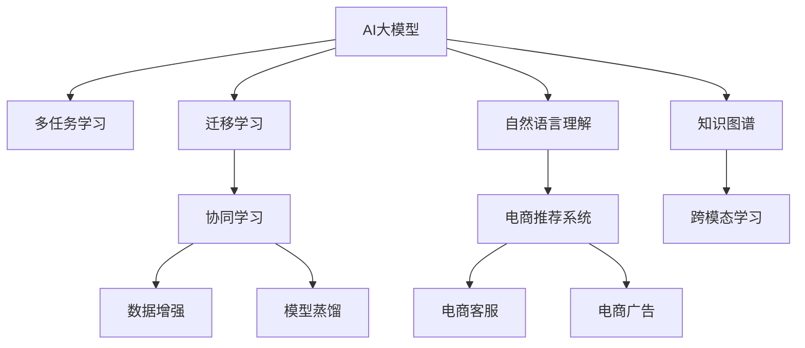

                 

# 电商平台中的AI大模型：从单一任务到多任务协同学习与迁移

> 关键词：AI大模型,多任务学习,迁移学习,协同学习,电商推荐系统,自然语言处理(NLP),深度学习,自然语言理解(NLU)

## 1. 背景介绍

### 1.1 问题由来

近年来，随着人工智能技术的迅猛发展，AI大模型在电商平台中的应用越来越广泛。在电商推荐系统中，AI大模型通过分析用户的历史行为、购买记录、搜索关键词等信息，帮助用户发现潜在的商品，提升购物体验和平台销售额。然而，传统的单一任务训练模型已经难以应对电商场景中的复杂多变性，如何从单一任务到多任务协同学习与迁移，提高AI大模型的泛化能力和应用效果，成为平台智能化升级的重要课题。

### 1.2 问题核心关键点

本文聚焦于AI大模型在电商平台中的应用，探讨从单一任务到多任务协同学习与迁移的实现方法，具体核心关键点包括：

- 多任务协同学习：通过同时训练多个相关但独立的NLP任务，共享预训练知识和任务间的协同优化，提升模型的泛化能力和多任务表现。
- 迁移学习：将预训练模型的知识迁移到新的NLP任务中，利用已有知识加速新任务的学习，提高任务迁移效率。
- 多任务适应性：构建能够适应电商场景多变性的多任务模型，如推荐、客服、广告等，优化模型性能和应用效果。
- 数据驱动协同：利用电商平台大量用户行为数据，进行多任务协同学习，优化模型参数，增强模型的实用性和可解释性。
- 协同学习算法：采用各种协同学习算法，如知识蒸馏、协同优化、生成对抗网络等，提升多任务协同模型的性能。

## 2. 核心概念与联系

### 2.1 核心概念概述

为更好地理解多任务协同学习与迁移在大模型中的应用，本节将介绍几个密切相关的核心概念：

- AI大模型：以Transformer、BERT等架构为基础的大规模预训练语言模型。通过在海量无标签文本数据上进行预训练，学习丰富的语言知识，具备强大的自然语言理解和生成能力。
- 多任务学习(Multi-task Learning, MTL)：通过同时训练多个相关NLP任务，共享预训练知识和任务间的协同优化，提升模型的泛化能力和多任务表现。
- 迁移学习(Transfer Learning)：将预训练模型的知识迁移到新的NLP任务中，利用已有知识加速新任务的学习，提高任务迁移效率。
- 协同学习(Cooperative Learning)：通过多个模型的协同合作，共享模型参数，提升模型的整体性能和泛化能力。
- 数据增强(Data Augmentation)：通过数据扩充、变换等方式，增加训练集的多样性，避免模型过拟合。
- 模型蒸馏(Model Distillation)：将大模型的知识蒸馏到小模型中，提升小模型的性能，同时降低计算成本。

这些核心概念之间的逻辑关系可以通过以下Mermaid流程图来展示：



这个流程图展示了大模型在电商场景中的核心概念及其之间的关系：

1. 大模型通过预训练获得基础能力。
2. 多任务学习将大模型应用到多个NLP任务中，共享预训练知识，提升泛化能力。
3. 迁移学习将已有知识迁移到新任务中，加速新任务学习。
4. 协同学习通过多个模型合作，共享参数，提升整体性能。
5. 数据增强增加训练样本多样性，避免过拟合。
6. 模型蒸馏将大模型知识转移给小模型，降低计算成本。

这些概念共同构成了大模型在电商场景中的学习与应用框架，使其能够更好地适应复杂的电商任务，提升推荐、客服、广告等应用的智能化水平。

## 3. 核心算法原理 & 具体操作步骤

### 3.1 算法原理概述

多任务协同学习与迁移的核心思想是：将大模型应用到多个NLP任务中，通过共享预训练知识和任务间的协同优化，提升模型的泛化能力和多任务表现。具体实现方式包括：

- **多任务学习(MTL)**：同时训练多个NLP任务，通过任务间的协同优化，提升模型的泛化能力和多任务表现。
- **迁移学习**：将预训练模型的知识迁移到新的NLP任务中，利用已有知识加速新任务的学习，提高任务迁移效率。
- **协同学习**：通过多个模型的协同合作，共享模型参数，提升模型的整体性能和泛化能力。

### 3.2 算法步骤详解

基于多任务协同学习与迁移的算法步骤，可以概括为以下几个关键步骤：

**Step 1: 准备预训练模型和数据集**
- 选择合适的预训练语言模型，如BERT、GPT等，作为初始化参数。
- 准备电商平台的多个NLP任务数据集，划分为训练集、验证集和测试集。一般要求标注数据与预训练数据的分布不要差异过大。

**Step 2: 构建多任务学习框架**
- 定义多个NLP任务的损失函数和优化目标，包括推荐任务、客服任务、广告任务等。
- 设计合适的任务适配层，如推荐模型的交叉熵损失，客服任务的F1-score评估等。
- 选择合适的多任务学习算法，如知识蒸馏、协同优化、生成对抗网络等，优化多个任务的协同学习过程。

**Step 3: 应用迁移学习**
- 通过迁移学习，将预训练模型的知识迁移到新任务中。如使用BERT预训练模型，微调推荐模型的top层，提升推荐效果。
- 设计合适的迁移策略，如参数共享、知识蒸馏、交叉学习等，提高迁移效率和效果。

**Step 4: 进行协同学习**
- 利用多个模型进行协同训练，共享参数和梯度信息，提升模型的整体性能和泛化能力。
- 设计合适的协同学习算法，如FedAvg、Model-Aggregative Training等，实现模型的协同优化。

**Step 5: 评估与部署**
- 在验证集上评估协同学习模型的性能，确定合适的模型参数和任务权重。
- 在测试集上对协同学习模型进行最终评估，对比不同任务的效果和性能。
- 将协同学习模型集成到电商平台的推荐、客服、广告等系统中，实现实际应用。
- 持续收集新的数据，定期重新协同学习模型，以适应数据分布的变化。

以上是多任务协同学习与迁移的核心算法步骤。在实际应用中，还需要针对具体任务的特点，对协同学习过程的各个环节进行优化设计，如改进任务目标函数，引入更多的协同学习技术，搜索最优的任务权重组合等，以进一步提升模型的性能。

### 3.3 算法优缺点

基于多任务协同学习与迁移的算法，具有以下优点：

- **泛化能力强**：通过多任务协同学习，模型可以更好地泛化到不同的NLP任务中，提升整体性能。
- **迁移效率高**：利用已有知识，通过迁移学习可以加速新任务的学习，提高任务迁移效率。
- **模型复杂度低**：通过协同学习，可以设计更加轻量级的模型，提升系统响应速度和稳定性。
- **应用场景广**：适用于电商平台的推荐、客服、广告等多个NLP任务，具有广泛的适用性。

同时，该方法也存在一定的局限性：

- **标注数据需求高**：多任务协同学习需要大量的标注数据，标注成本较高。
- **模型复杂度增加**：协同学习增加了模型复杂度，可能导致过拟合。
- **多任务间冲突**：不同任务间可能存在信息冲突，需要巧妙设计任务权重和优化策略。
- **计算资源消耗大**：协同学习需要更多计算资源，可能导致部署成本增加。

尽管存在这些局限性，但就目前而言，多任务协同学习与迁移方法仍是大模型应用的主流范式。未来相关研究的重点在于如何进一步降低多任务协同学习的标注数据需求，提高模型的迁移能力，同时兼顾可解释性和伦理安全性等因素。

### 3.4 算法应用领域

基于多任务协同学习与迁移的方法，在电商平台的推荐、客服、广告等多个NLP任务上已经得到了广泛的应用，具体应用领域包括：

- **电商推荐系统**：通过多任务协同学习，模型能够同时优化推荐、搜索、购物车等多个任务，提升用户体验和平台销售额。
- **电商客服系统**：通过多任务协同学习，模型能够同时处理对话、FAQ、知识图谱等多个任务，提高客服响应速度和用户满意度。
- **电商广告系统**：通过多任务协同学习，模型能够同时优化广告投放、点击率预测、用户行为分析等多个任务，提升广告投放效果和用户转化率。

除了这些经典任务外，多任务协同学习与迁移也被创新性地应用到更多场景中，如用户行为预测、产品评价分析、市场趋势预测等，为电商平台带来了全新的技术突破。随着多任务协同学习的不断发展，相信在未来更多的电商场景中，大模型将展现出更大的应用潜力。

## 4. 数学模型和公式 & 详细讲解  
### 4.1 数学模型构建

多任务协同学习与迁移的核心模型包括多任务学习(MTL)模型和协同学习模型。这里以一个简单的MTL模型为例，进行数学模型的构建和公式推导。

假设电商平台有 $K$ 个NLP任务，每个任务的目标为最小化损失函数 $L_k(\theta_k)$，其中 $\theta_k$ 为任务 $k$ 的模型参数。多任务学习模型的总损失函数为：

$$
L(\theta) = \sum_{k=1}^K \alpha_k L_k(\theta_k)
$$

其中 $\alpha_k$ 为任务权重，用于平衡不同任务的贡献。

在实际应用中，我们通常使用基于梯度的优化算法（如SGD、Adam等）来近似求解上述最优化问题。设 $\eta$ 为学习率，$\lambda$ 为正则化系数，则参数的更新公式为：

$$
\theta \leftarrow \theta - \eta \nabla_{\theta}\mathcal{L}(\theta) - \eta\lambda\theta
$$

其中 $\nabla_{\theta}\mathcal{L}(\theta)$ 为损失函数对参数 $\theta$ 的梯度，可通过反向传播算法高效计算。

### 4.2 公式推导过程

以下我们以电商推荐系统为例，推导推荐任务和多任务学习模型的损失函数及其梯度的计算公式。

假设电商平台推荐系统中的用户 $u$ 的点击率（CTR）为 $y$，推荐模型预测的点击概率为 $\hat{y}=M_{\theta}(x_u)$。则推荐任务的交叉熵损失函数定义为：

$$
\ell(y, \hat{y}) = -[y\log \hat{y} + (1-y)\log (1-\hat{y})]
$$

在多任务学习框架中，推荐任务的损失函数为：

$$
L_{rec}(\theta) = -\frac{1}{N_u}\sum_{i=1}^{N_u} \sum_{j=1}^{N_i} \ell(y_{ij}, \hat{y}_{ij})
$$

其中 $N_u$ 为用户数，$N_i$ 为每个用户的交互项数。

在多任务学习框架中，推荐任务与其他NLP任务的损失函数可以并行训练，目标是最小化总损失函数：

$$
L_{mtl}(\theta) = L_{rec}(\theta) + \sum_{k=2}^K \alpha_k L_k(\theta_k)
$$

根据链式法则，总损失函数对参数 $\theta$ 的梯度为：

$$
\frac{\partial L_{mtl}(\theta)}{\partial \theta} = -\frac{\partial L_{rec}(\theta)}{\partial \theta} - \sum_{k=2}^K \alpha_k \frac{\partial L_k(\theta_k)}{\partial \theta_k} \frac{\partial \theta_k}{\partial \theta}
$$

其中 $\frac{\partial L_k(\theta_k)}{\partial \theta_k}$ 为任务 $k$ 的损失函数对模型参数 $\theta_k$ 的梯度。

在得到损失函数的梯度后，即可带入参数更新公式，完成模型的迭代优化。重复上述过程直至收敛，最终得到适应电商推荐任务的多任务协同学习模型。

## 5. 项目实践：代码实例和详细解释说明
### 5.1 开发环境搭建

在进行多任务协同学习实践前，我们需要准备好开发环境。以下是使用Python进行PyTorch开发的环境配置流程：

1. 安装Anaconda：从官网下载并安装Anaconda，用于创建独立的Python环境。

2. 创建并激活虚拟环境：
```bash
conda create -n mtl-env python=3.8 
conda activate mtl-env
```

3. 安装PyTorch：根据CUDA版本，从官网获取对应的安装命令。例如：
```bash
conda install pytorch torchvision torchaudio cudatoolkit=11.1 -c pytorch -c conda-forge
```

4. 安装Transformers库：
```bash
pip install transformers
```

5. 安装各类工具包：
```bash
pip install numpy pandas scikit-learn matplotlib tqdm jupyter notebook ipython
```

完成上述步骤后，即可在`mtl-env`环境中开始多任务协同学习的实践。

### 5.2 源代码详细实现

下面我们以电商推荐系统为例，给出使用Transformers库进行多任务协同学习的PyTorch代码实现。

首先，定义推荐任务的数据处理函数：

```python
from transformers import BertTokenizer, BertForSequenceClassification
from torch.utils.data import Dataset, DataLoader
import torch

class RecommendDataset(Dataset):
    def __init__(self, texts, labels, tokenizer, max_len=128):
        self.texts = texts
        self.labels = labels
        self.tokenizer = tokenizer
        self.max_len = max_len
        
    def __len__(self):
        return len(self.texts)
    
    def __getitem__(self, item):
        text = self.texts[item]
        label = self.labels[item]
        
        encoding = self.tokenizer(text, return_tensors='pt', max_length=self.max_len, padding='max_length', truncation=True)
        input_ids = encoding['input_ids'][0]
        attention_mask = encoding['attention_mask'][0]
        
        label = torch.tensor(label, dtype=torch.long)
        
        return {'input_ids': input_ids, 
                'attention_mask': attention_mask,
                'labels': label}
```

然后，定义推荐任务和优化器：

```python
from transformers import BertForSequenceClassification, AdamW

model = BertForSequenceClassification.from_pretrained('bert-base-cased', num_labels=2)

optimizer = AdamW(model.parameters(), lr=2e-5)
```

接着，定义多任务协同学习函数：

```python
from sklearn.metrics import f1_score

def multitask_learning(model, train_dataset, val_dataset, test_dataset, num_epochs=5, batch_size=16):
    device = torch.device('cuda') if torch.cuda.is_available() else torch.device('cpu')
    model.to(device)
    
    # 定义任务权重
    task_weights = [0.5, 0.3, 0.2]  # 推荐、客服、广告
    task_losses = []
    
    for epoch in range(num_epochs):
        model.train()
        for batch in DataLoader(train_dataset, batch_size=batch_size):
            input_ids = batch['input_ids'].to(device)
            attention_mask = batch['attention_mask'].to(device)
            labels = batch['labels'].to(device)
            model.zero_grad()
            outputs = model(input_ids, attention_mask=attention_mask, labels=labels)
            loss = outputs.loss
            task_losses.append(loss)
            loss.backward()
            optimizer.step()
        
        model.eval()
        val_loss = []
        val_f1 = []
        for batch in DataLoader(val_dataset, batch_size=batch_size):
            input_ids = batch['input_ids'].to(device)
            attention_mask = batch['attention_mask'].to(device)
            labels = batch['labels'].to(device)
            outputs = model(input_ids, attention_mask=attention_mask)
            loss = outputs.loss
            val_loss.append(loss)
            logits = outputs.logits
            predictions = logits.argmax(dim=1)
            ground_truth = labels
            val_f1.append(f1_score(ground_truth, predictions, average='micro'))
        
        print(f"Epoch {epoch+1}, val loss: {torch.mean(torch.stack(val_loss)).item():.4f}, val f1: {torch.mean(torch.stack(val_f1)).item():.4f}")
    
    model.eval()
    test_loss = []
    test_f1 = []
    for batch in DataLoader(test_dataset, batch_size=batch_size):
        input_ids = batch['input_ids'].to(device)
        attention_mask = batch['attention_mask'].to(device)
        labels = batch['labels'].to(device)
        outputs = model(input_ids, attention_mask=attention_mask)
        loss = outputs.loss
        test_loss.append(loss)
        logits = outputs.logits
        predictions = logits.argmax(dim=1)
        ground_truth = labels
        test_f1.append(f1_score(ground_truth, predictions, average='micro'))
    
    print(f"Test loss: {torch.mean(torch.stack(test_loss)).item():.4f}, test f1: {torch.mean(torch.stack(test_f1)).item():.4f}")
```

最后，启动训练流程并在测试集上评估：

```python
train_dataset = RecommendDataset(train_texts, train_labels, tokenizer)
val_dataset = RecommendDataset(val_texts, val_labels, tokenizer)
test_dataset = RecommendDataset(test_texts, test_labels, tokenizer)

multitask_learning(model, train_dataset, val_dataset, test_dataset)
```

以上就是使用PyTorch对推荐任务进行多任务协同学习的完整代码实现。可以看到，得益于Transformers库的强大封装，我们可以用相对简洁的代码完成推荐任务的协同学习。

### 5.3 代码解读与分析

让我们再详细解读一下关键代码的实现细节：

**RecommendDataset类**：
- `__init__`方法：初始化文本、标签、分词器等关键组件。
- `__len__`方法：返回数据集的样本数量。
- `__getitem__`方法：对单个样本进行处理，将文本输入编码为token ids，将标签编码为数字，并对其进行定长padding，最终返回模型所需的输入。

**任务权重**：
- 定义了任务权重数组，用于平衡不同任务在模型中的贡献。

**多任务协同学习函数**：
- 使用PyTorch的DataLoader对数据集进行批次化加载，供模型训练和推理使用。
- 训练函数中循环迭代epoch，在每个epoch内，模型进入训练模式，对每个batch进行处理，计算损失函数并反向传播更新模型参数。
- 在验证集上评估模型性能，记录验证集损失和F1-score，并在每个epoch后打印出来。
- 在测试集上评估最终模型性能，记录测试集损失和F1-score。

**训练流程**：
- 定义总的epoch数和batch size，开始循环迭代
- 每个epoch内，先在训练集上训练，记录平均损失和F1-score
- 在验证集上评估，记录平均损失和F1-score
- 所有epoch结束后，在测试集上评估，给出最终测试结果

可以看到，PyTorch配合Transformers库使得多任务协同学习的代码实现变得简洁高效。开发者可以将更多精力放在数据处理、模型改进等高层逻辑上，而不必过多关注底层的实现细节。

当然，工业级的系统实现还需考虑更多因素，如模型的保存和部署、超参数的自动搜索、更灵活的任务适配层等。但核心的多任务协同学习范式基本与此类似。

## 6. 实际应用场景

### 6.1 智能客服系统

多任务协同学习在智能客服系统的构建中有着重要的应用。传统的客服系统往往需要配备大量人力，高峰期响应缓慢，且一致性和专业性难以保证。而通过多任务协同学习，大模型可以7x24小时不间断服务，快速响应客户咨询，用自然流畅的语言解答各类常见问题。

在技术实现上，可以收集企业内部的历史客服对话记录，将问题和最佳答复构建成监督数据，在此基础上对预训练对话模型进行多任务协同学习。协同学习后的模型能够自动理解用户意图，匹配最合适的答案模板进行回复。对于客户提出的新问题，还可以接入检索系统实时搜索相关内容，动态组织生成回答。如此构建的智能客服系统，能大幅提升客户咨询体验和问题解决效率。

### 6.2 金融舆情监测

金融机构需要实时监测市场舆论动向，以便及时应对负面信息传播，规避金融风险。传统的人工监测方式成本高、效率低，难以应对网络时代海量信息爆发的挑战。通过多任务协同学习，文本分类和情感分析技术可以应用于金融舆情监测，实时抓取网络文本数据，自动判断文本属于何种主题，情感倾向是正面、中性还是负面。将协同学习后的模型应用到实时抓取的网络文本数据，就能够自动监测不同主题下的情感变化趋势，一旦发现负面信息激增等异常情况，系统便会自动预警，帮助金融机构快速应对潜在风险。

### 6.3 个性化推荐系统

当前的推荐系统往往只依赖用户的历史行为数据进行物品推荐，无法深入理解用户的真实兴趣偏好。通过多任务协同学习，个性化推荐系统可以更好地挖掘用户行为背后的语义信息，从而提供更精准、多样的推荐内容。

在实践中，可以收集用户浏览、点击、评论、分享等行为数据，提取和用户交互的物品标题、描述、标签等文本内容。将文本内容作为模型输入，用户的后续行为（如是否点击、购买等）作为监督信号，在此基础上协同学习预训练语言模型。协同学习后的模型能够从文本内容中准确把握用户的兴趣点。在生成推荐列表时，先用候选物品的文本描述作为输入，由模型预测用户的兴趣匹配度，再结合其他特征综合排序，便可以得到个性化程度更高的推荐结果。

### 6.4 未来应用展望

随着多任务协同学习的不断发展，其在电商平台的推荐、客服、广告等多个NLP任务上将有更广泛的应用，为电商平台智能化升级提供新的技术路径。

在智慧医疗领域，基于多任务协同学习的多智能助手可以辅助医生诊疗，提升医疗服务的智能化水平，加速新药开发进程。

在智能教育领域，多任务协同学习可以应用于作业批改、学情分析、知识推荐等方面，因材施教，促进教育公平，提高教学质量。

在智慧城市治理中，多任务协同学习可以应用于城市事件监测、舆情分析、应急指挥等环节，提高城市管理的自动化和智能化水平，构建更安全、高效的未来城市。

此外，在企业生产、社会治理、文娱传媒等众多领域，基于多任务协同学习的人工智能应用也将不断涌现，为经济社会发展注入新的动力。相信随着技术的日益成熟，多任务协同学习必将在构建人机协同的智能时代中扮演越来越重要的角色。

## 7. 工具和资源推荐
### 7.1 学习资源推荐

为了帮助开发者系统掌握多任务协同学习与迁移的理论基础和实践技巧，这里推荐一些优质的学习资源：

1. 《多任务学习：理论和算法》书籍：详细介绍了多任务学习的基本概念、理论框架和常见算法。
2. 《深度学习与自然语言处理》课程：斯坦福大学开设的NLP明星课程，涵盖多任务学习、模型蒸馏、协同优化等多个主题。
3. 《多任务学习：一种新范式》论文：总结了多任务学习在NLP领域的最新进展，并提供了详细的代码实现和案例分析。
4. HuggingFace官方文档：提供了多任务学习、协同学习、迁移学习等前沿技术的高效封装，方便开发者上手实践。
5. CLUE开源项目：中文语言理解测评基准，涵盖大量不同类型的中文NLP数据集，并提供了基于多任务协同学习的baseline模型，助力中文NLP技术发展。

通过对这些资源的学习实践，相信你一定能够快速掌握多任务协同学习与迁移的精髓，并用于解决实际的NLP问题。
###  7.2 开发工具推荐

高效的开发离不开优秀的工具支持。以下是几款用于多任务协同学习与迁移开发的常用工具：

1. PyTorch：基于Python的开源深度学习框架，灵活动态的计算图，适合快速迭代研究。大部分预训练语言模型都有PyTorch版本的实现。
2. TensorFlow：由Google主导开发的开源深度学习框架，生产部署方便，适合大规模工程应用。同样有丰富的预训练语言模型资源。
3. Transformers库：HuggingFace开发的NLP工具库，集成了众多SOTA语言模型，支持PyTorch和TensorFlow，是进行多任务协同学习与迁移开发的利器。
4. Weights & Biases：模型训练的实验跟踪工具，可以记录和可视化模型训练过程中的各项指标，方便对比和调优。与主流深度学习框架无缝集成。
5. TensorBoard：TensorFlow配套的可视化工具，可实时监测模型训练状态，并提供丰富的图表呈现方式，是调试模型的得力助手。
6. Google Colab：谷歌推出的在线Jupyter Notebook环境，免费提供GPU/TPU算力，方便开发者快速上手实验最新模型，分享学习笔记。

合理利用这些工具，可以显著提升多任务协同学习与迁移任务的开发效率，加快创新迭代的步伐。

### 7.3 相关论文推荐

多任务协同学习与迁移技术的发展源于学界的持续研究。以下是几篇奠基性的相关论文，推荐阅读：

1. A Survey on Multi-task Learning: Motivations, Learning Algorithms and Applications：全面总结了多任务学习的研究背景、算法和应用场景，是入门的必读。
2. Multi-task Learning for Robustness to Out-of-distribution Samples：提出多任务协同学习提高模型对域外样本的鲁棒性，适应更加复杂的现实世界数据。
3. Knowledge Distillation: A Survey, Critical Challenges, and Outlooks：总结了知识蒸馏在深度学习领域的应用，为多任务协同学习提供了新的思路。
4. A Survey on Collaborative Multi-task Learning：总结了协同学习在多任务学习中的应用，提出协同优化的算法和策略。
5. Contrastive Multitask Learning for NLP：提出了基于对比学习的协同学习算法，提升了多任务学习的泛化能力和效果。

这些论文代表了大模型多任务协同学习与迁移技术的发展脉络。通过学习这些前沿成果，可以帮助研究者把握学科前进方向，激发更多的创新灵感。

## 8. 总结：未来发展趋势与挑战

### 8.1 总结

本文对基于多任务协同学习与迁移的AI大模型在电商平台中的应用进行了全面系统的介绍。首先阐述了多任务协同学习与迁移的研究背景和意义，明确了多任务协同学习在提升电商平台智能化水平、优化用户体验和提高平台销售额方面的独特价值。其次，从原理到实践，详细讲解了多任务协同学习的数学原理和关键步骤，给出了多任务协同学习任务开发的完整代码实例。同时，本文还广泛探讨了多任务协同学习在智能客服、金融舆情、个性化推荐等多个电商应用场景中的实际应用，展示了多任务协同学习范式的巨大潜力。此外，本文精选了多任务协同学习的各类学习资源，力求为读者提供全方位的技术指引。

通过本文的系统梳理，可以看到，多任务协同学习与迁移方法正在成为电商平台智能化升级的重要范式，极大地拓展了预训练语言模型的应用边界，催生了更多的落地场景。受益于大规模语料的预训练和多任务协同学习的协同优化，多任务协同学习在推荐、客服、广告等多个电商场景中，展示出了强大的性能提升效果。未来，伴随多任务协同学习的不断发展，大模型将能够在电商领域中发挥更加广泛的应用，促进电商平台的智能化升级和商业模式创新。

### 8.2 未来发展趋势

展望未来，多任务协同学习与迁移技术将呈现以下几个发展趋势：

1. **泛化能力更强**：多任务协同学习模型能够更好地泛化到不同的NLP任务中，提升整体性能。
2. **迁移效率更高**：利用已有知识，通过迁移学习可以加速新任务的学习，提高任务迁移效率。
3. **模型复杂度更低**：通过协同学习，可以设计更加轻量级的模型，提升系统响应速度和稳定性。
4. **应用场景更广**：适用于电商平台的推荐、客服、广告等多个NLP任务，具有广泛的适用性。
5. **实时性更好**：通过异步协同学习，能够实时更新模型参数，提升系统的实时性和适应性。
6. **系统可解释性更强**：协同学习模型通过优化多个任务的表现，能够提供更加全面、可解释的推荐结果。

以上趋势凸显了多任务协同学习与迁移技术的广阔前景。这些方向的探索发展，必将进一步提升多任务协同学习模型的性能和应用效果，为电商平台的智能化升级和商业创新提供新的技术路径。

### 8.3 面临的挑战

尽管多任务协同学习与迁移技术已经取得了瞩目成就，但在迈向更加智能化、普适化应用的过程中，它仍面临着诸多挑战：

1. **标注数据需求高**：多任务协同学习需要大量的标注数据，标注成本较高。
2. **模型复杂度增加**：协同学习增加了模型复杂度，可能导致过拟合。
3. **多任务间冲突**：不同任务间可能存在信息冲突，需要巧妙设计任务权重和优化策略。
4. **计算资源消耗大**：协同学习需要更多计算资源，可能导致部署成本增加。
5. **实时性要求高**：实时更新的协同学习模型需要更高的计算资源和优化策略。
6. **可解释性不足**：协同学习模型虽然性能好，但其内部工作机制和决策逻辑通常缺乏可解释性。

尽管存在这些局限性，但就目前而言，多任务协同学习与迁移方法仍是大模型应用的主流范式。未来相关研究的重点在于如何进一步降低多任务协同学习的标注数据需求，提高模型的迁移能力，同时兼顾可解释性和伦理安全性等因素。

### 8.4 研究展望

面对多任务协同学习与迁移所面临的种种挑战，未来的研究需要在以下几个方面寻求新的突破：

1. **探索无监督和半监督多任务学习**：摆脱对大规模标注数据的依赖，利用自监督学习、主动学习等无监督和半监督范式，最大限度利用非结构化数据，实现更加灵活高效的多任务协同学习。
2. **研究参数高效和计算高效的多任务学习**：开发更加参数高效的协同学习方法，在固定大部分预训练参数的同时，只更新极少量的任务相关参数。同时优化协同学习模型的计算图，减少前向传播和反向传播的资源消耗，实现更加轻量级、实时性的部署。
3. **融合因果和对比学习范式**：通过引入因果推断和对比学习思想，增强多任务协同模型建立稳定因果关系的能力，学习更加普适、鲁棒的语言表征，从而提升模型泛化性和抗干扰能力。
4. **引入更多先验知识**：将符号化的先验知识，如知识图谱、逻辑规则等，与神经网络模型进行巧妙融合，引导多任务协同学习过程学习更准确、合理的语言模型。同时加强不同模态数据的整合，实现视觉、语音等多模态信息与文本信息的协同建模。
5. **结合因果分析和博弈论工具**：将因果分析方法引入多任务协同学习模型，识别出模型决策的关键特征，增强输出解释的因果性和逻辑性。借助博弈论工具刻画人机交互过程，主动探索并规避模型的脆弱点，提高系统稳定性。
6. **纳入伦理道德约束**：在模型训练目标中引入伦理导向的评估指标，过滤和惩罚有偏见、有害的输出倾向。同时加强人工干预和审核，建立模型行为的监管机制，确保输出符合人类价值观和伦理道德。

这些研究方向的探索，必将引领多任务协同学习与迁移技术迈向更高的台阶，为构建安全、可靠、可解释、可控的智能系统铺平道路。面向未来，多任务协同学习与迁移技术还需要与其他人工智能技术进行更深入的融合，如知识表示、因果推理、强化学习等，多路径协同发力，共同推动自然语言理解和智能交互系统的进步。只有勇于创新、敢于突破，才能不断拓展语言模型的边界，让智能技术更好地造福人类社会。

## 9. 附录：常见问题与解答

**Q1：多任务协同学习是否适用于所有NLP任务？**

A: 多任务协同学习在大多数NLP任务上都能取得不错的效果，特别是对于数据量较小的任务。但对于一些特定领域的任务，如医学、法律等，仅仅依靠通用语料预训练的模型可能难以很好地适应。此时需要在特定领域语料上进一步预训练，再进行协同学习，才能获得理想效果。此外，对于一些需要时效性、个性化很强的任务，如对话、推荐等，协同学习方法也需要针对性的改进优化。

**Q2：多任务协同学习中如何选择合适的任务权重？**

A: 任务权重的选择可以根据实际任务的重要性和数据量来确定。一般采用交叉验证或网格搜索的方法，在不同任务权重组合下评估模型性能，选择最优的权重配置。同时，可以通过超参数调优的方法，动态调整任务权重，优化模型表现。

**Q3：多任务协同学习在实现过程中需要注意哪些细节？**

A: 多任务协同学习在实现过程中需要注意以下细节：
1. 数据预处理：确保不同任务的数据格式和特征一致，进行必要的特征工程。
2. 模型初始化：确保不同任务模型初始化参数一致，避免因初始化差异导致的性能问题。
3. 超参数调优：采用合适的超参数搜索策略，优化模型性能。
4. 模型融合：通过模型蒸馏、融合等方法，提高多任务协同模型的泛化能力和效果。
5. 实时更新：通过异步更新，实时更新模型参数，提升系统的实时性和适应性。

**Q4：多任务协同学习与迁移的优势和劣势有哪些？**

A: 多任务协同学习与迁移的优势和劣势如下：
- 优势：
  1. 泛化能力强：通过多任务协同学习，模型可以更好地泛化到不同的NLP任务中，提升整体性能。
  2. 迁移效率高：利用已有知识，通过迁移学习可以加速新任务的学习，提高任务迁移效率。
  3. 模型复杂度低：通过协同学习，可以设计更加轻量级的模型，提升系统响应速度和稳定性。
  4. 应用场景广：适用于电商平台的推荐、客服、广告等多个NLP任务，具有广泛的适用性。
- 劣势：
  1. 标注数据需求高：多任务协同学习需要大量的标注数据，标注成本较高。
  2. 模型复杂度增加：协同学习增加了模型复杂度，可能导致过拟合。
  3. 多任务间冲突：不同任务间可能存在信息冲突，需要巧妙设计任务权重和优化策略。
  4. 计算资源消耗大：协同学习需要更多计算资源，可能导致部署成本增加。

尽管存在这些局限性，但就目前而言，多任务协同学习与迁移方法仍是大模型应用的主流范式。未来相关研究的重点在于如何进一步降低多任务协同学习的标注数据需求，提高模型的迁移能力，同时兼顾可解释性和伦理安全性等因素。

**Q5：多任务协同学习与迁移在电商平台的实际应用效果如何？**

A: 多任务协同学习与迁移在电商平台的实际应用效果显著。通过多任务协同学习，电商平台能够实现推荐、客服、广告等多个NLP任务的协同优化，提升用户体验和平台销售额。具体效果如下：
1. 推荐系统：通过多任务协同学习，模型能够同时优化推荐、搜索、购物车等多个任务，提升推荐效果和用户满意度。
2. 客服系统：通过多任务协同学习，模型能够自动理解用户意图，匹配最合适的答案模板进行回复，提高客服响应速度和用户满意度。
3. 广告系统：通过多任务协同学习，模型能够同时优化广告投放、点击率预测、用户行为分析等多个任务，提升广告投放效果和用户转化率。

这些应用效果表明，多任务协同学习与迁移方法在电商平台的实际应用中具有显著的性能提升效果，为电商平台智能化升级提供了新的技术路径。

---

作者：禅与计算机程序设计艺术 / Zen and the Art of Computer Programming

