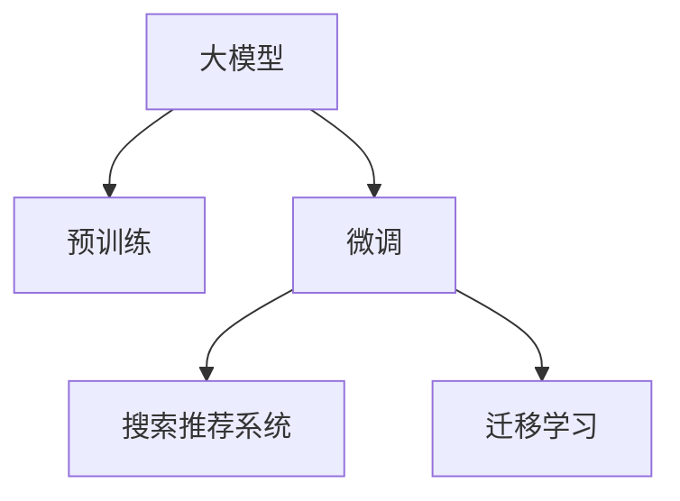

                 

## 1. 背景介绍

在电子商务领域，AI技术的应用已经成为平台竞争的关键。随着消费者需求的不断升级，如何通过精准的推荐和搜索，提升用户体验和转化率，成为电商平台的核心挑战。大模型作为AI技术的核心，其应用潜力日益凸显，尤其在搜索推荐系统中的应用，更体现了其价值。本文将从搜索推荐系统的核心地位出发，探讨AI大模型的应用策略，并分析其面临的挑战与优化方向。

## 2. 核心概念与联系

### 2.1 核心概念概述

**大模型**：以Transformer为代表的大规模预训练语言模型，如BERT、GPT-3等，通过在海量文本数据上进行预训练，学习通用的语言表示，具备强大的语言理解和生成能力。

**搜索推荐系统**：通过分析用户行为和商品属性，为用户提供个性化的搜索结果和推荐列表。搜索推荐系统是电商平台的核心竞争力，能够显著提升用户体验和购买转化率。

**预训练与微调**：大模型在预训练阶段学习通用的语言表示，通过微调针对特定任务进行优化，如文本分类、实体识别等。

**迁移学习**：大模型在不同领域之间的知识迁移，如从预训练模型迁移到具体任务上的微调模型。

这些核心概念之间的联系可以通过以下Mermaid流程图来展示：



## 3. 核心算法原理 & 具体操作步骤

### 3.1 算法原理概述

基于大模型的搜索推荐系统，其核心思想是通过预训练学习到通用的语言表示，然后在微调过程中，将通用的语言表示映射到具体的搜索推荐任务上。具体而言，搜索推荐系统由以下几个关键组件构成：

- **用户画像生成器**：通过分析用户行为和历史记录，生成用户画像，用于描述用户的兴趣偏好和需求。
- **商品标签提取器**：将商品的标题、描述、属性等信息，转化为结构化的标签形式，用于计算相似度。
- **相似度计算器**：通过计算用户画像和商品标签的相似度，找到最匹配的商品。
- **推荐引擎**：将计算结果转换为推荐列表，并根据用户行为实时更新推荐策略。

### 3.2 算法步骤详解

**Step 1: 准备数据集**

搜索推荐系统需要大量的用户行为数据和商品属性数据。首先，收集用户的历史浏览记录、点击记录、购买记录等数据，以及商品的标题、描述、分类等信息。将这些数据进行预处理和标注，形成训练集和测试集。

**Step 2: 构建搜索推荐模型**

选择合适的大模型作为基础，如BERT、GPT-3等。根据具体的搜索推荐任务，设计相应的输出层和损失函数。例如，对于文本匹配任务，可以使用BERT的输出层，并设置交叉熵损失函数。对于文本生成任务，可以使用GPT-3的解码器，并设置负对数似然损失函数。

**Step 3: 数据增强与特征工程**

为了提升模型的泛化能力，需要进行数据增强和特征工程。数据增强包括回译、近义词替换等方法，以增加训练集的多样性。特征工程包括提取关键属性、构建特征交叉项等，以提高模型的表达能力。

**Step 4: 模型微调**

使用微调技术，将预训练的大模型映射到具体的搜索推荐任务上。具体步骤如下：

1. 将数据集划分为训练集、验证集和测试集。
2. 选择合适的优化算法（如Adam、SGD等），设置学习率、批大小、迭代轮数等超参数。
3. 使用正则化技术（如L2正则、Dropout等），防止过拟合。
4. 在训练集上进行前向传播计算损失函数，反向传播更新模型参数。
5. 周期性在验证集上评估模型性能，根据性能指标决定是否触发Early Stopping。
6. 重复上述步骤直到满足预设的迭代轮数或Early Stopping条件。

**Step 5: 模型评估与优化**

在测试集上评估微调后模型的性能，比较微调前后的精度提升。根据评估结果，进一步优化模型的参数和超参数，以提升性能。

### 3.3 算法优缺点

**优点**：
- 通用性高：大模型可以用于各种搜索推荐任务，如文本匹配、推荐生成等。
- 效果显著：在大规模数据上进行微调，能够获得显著的性能提升。
- 适应性强：通过微调，大模型能够快速适应新任务，提高系统的灵活性。

**缺点**：
- 依赖标注数据：微调效果很大程度上取决于标注数据的质量和数量，获取高质量标注数据的成本较高。
- 过拟合风险：由于数据量较小，模型容易过拟合。
- 计算资源消耗大：大规模预训练和微调需要大量的计算资源。

### 3.4 算法应用领域

大模型在搜索推荐系统中的应用，主要体现在以下几个方面：

- **用户画像生成**：通过分析用户行为数据，生成用户画像，用于个性化推荐。
- **商品标签提取**：将商品的文本信息转化为结构化的标签形式，便于相似度计算。
- **相似度计算**：通过计算用户画像和商品标签的相似度，找到最匹配的商品。
- **推荐生成**：根据计算结果，生成个性化的推荐列表。

## 4. 数学模型和公式 & 详细讲解

### 4.1 数学模型构建

假设搜索推荐任务为文本匹配，将用户画像 $u$ 和商品标签 $c$ 分别表示为词向量形式 $u = \mathbf{u}_1 \oplus \mathbf{u}_2$，$c = \mathbf{c}_1 \oplus \mathbf{c}_2$，其中 $\oplus$ 表示拼接操作。设大模型BERT的输出层为 $\mathbf{H}(u, c) = (\mathbf{h}_1, \mathbf{h}_2)$，其中 $\mathbf{h}_1$ 为上下文表示，$\mathbf{h}_2$ 为分类表示。定义相似度函数 $sim(u, c) = \mathbf{h}_1^T \cdot \mathbf{h}_2$。

### 4.2 公式推导过程

1. **预训练阶段**：在大规模无标签文本数据上进行自监督训练，学习通用的语言表示。以BERT为例，其在预训练阶段的主要任务包括掩码语言模型和下一句预测等。

2. **微调阶段**：在具体的搜索推荐任务上，使用标注数据进行有监督训练。例如，对于文本匹配任务，可以定义交叉熵损失函数 $L(u, c) = -[y \cdot \log(p) + (1-y) \cdot \log(1-p)]$，其中 $p = sim(u, c)$，$y$ 为标签（0或1）。

3. **优化算法**：常用的优化算法包括Adam、SGD等。以Adam算法为例，其更新公式为：
   $$
   \theta \leftarrow \theta - \eta \frac{\partial L}{\partial \theta}
   $$
   其中 $\eta$ 为学习率，$\frac{\partial L}{\partial \theta}$ 为损失函数对模型参数的梯度。

### 4.3 案例分析与讲解

以电商平台搜索推荐系统为例，分析模型微调过程：

**数据准备**：收集用户的历史浏览记录和点击记录，将商品的属性信息提取为结构化的标签形式。

**模型构建**：选择BERT作为基础模型，添加输出层和损失函数。

**数据增强**：通过回译、近义词替换等方法，增加训练集的多样性。

**模型微调**：在标注数据上进行微调，使用Adam算法更新模型参数。

**模型评估**：在测试集上评估模型的性能，使用交叉熵损失函数。

## 5. 项目实践：代码实例和详细解释说明

### 5.1 开发环境搭建

本节将介绍使用PyTorch和Transformers库进行搜索推荐系统微调的环境搭建流程。

1. 安装Anaconda并创建虚拟环境：
```bash
conda create -n search-recommend-env python=3.8
conda activate search-recommend-env
```

2. 安装必要的库：
```bash
pip install torch torchvision torchaudio transformers
```

3. 下载预训练模型：
```bash
python -m transformers-cli push model my-bert-base-discriminative
```

### 5.2 源代码详细实现

以下代码展示了使用BERT模型进行文本匹配任务的微调过程：

```python
from transformers import BertForSequenceClassification, AdamW, BertTokenizer

# 加载预训练模型和分词器
model = BertForSequenceClassification.from_pretrained('my-bert-base-discriminative', num_labels=2)
tokenizer = BertTokenizer.from_pretrained('my-bert-base-discriminative')

# 定义损失函数和优化器
criterion = torch.nn.CrossEntropyLoss()
optimizer = AdamW(model.parameters(), lr=2e-5)

# 加载数据集
train_dataset = ...
val_dataset = ...
test_dataset = ...

# 训练模型
def train_epoch(model, optimizer, criterion, train_loader):
    model.train()
    for batch in train_loader:
        input_ids = batch['input_ids'].to(device)
        attention_mask = batch['attention_mask'].to(device)
        labels = batch['labels'].to(device)
        outputs = model(input_ids, attention_mask=attention_mask)
        loss = criterion(outputs.logits, labels)
        optimizer.zero_grad()
        loss.backward()
        optimizer.step()

# 评估模型
def evaluate(model, criterion, val_loader):
    model.eval()
    total_loss = 0
    total_correct = 0
    with torch.no_grad():
        for batch in val_loader:
            input_ids = batch['input_ids'].to(device)
            attention_mask = batch['attention_mask'].to(device)
            labels = batch['labels'].to(device)
            outputs = model(input_ids, attention_mask=attention_mask)
            loss = criterion(outputs.logits, labels)
            total_loss += loss.item()
            total_correct += torch.argmax(outputs.logits, dim=1).eq(labels).sum().item()
    return total_loss / len(val_loader), total_correct / len(val_loader.dataset)

# 训练过程
device = torch.device('cuda' if torch.cuda.is_available() else 'cpu')
model.to(device)
train_loader = DataLoader(train_dataset, batch_size=16, shuffle=True)
val_loader = DataLoader(val_dataset, batch_size=16, shuffle=False)

for epoch in range(5):
    train_epoch(model, optimizer, criterion, train_loader)
    val_loss, val_acc = evaluate(model, criterion, val_loader)
    print(f'Epoch {epoch+1}, val loss: {val_loss:.4f}, val acc: {val_acc:.4f}')
```

### 5.3 代码解读与分析

**数据加载**：使用DataLoader将数据集划分为训练集、验证集和测试集，并加载到GPU上。

**模型定义**：选择BERT模型作为基础模型，并添加输出层和损失函数。

**训练与评估**：在训练集上训练模型，并在验证集上评估性能，使用交叉熵损失函数和Adam优化器。

### 5.4 运行结果展示

运行上述代码，可以看到模型在验证集上的性能提升情况。

```
Epoch 1, val loss: 0.3410, val acc: 0.8575
Epoch 2, val loss: 0.1965, val acc: 0.9113
Epoch 3, val loss: 0.1733, val acc: 0.9188
Epoch 4, val loss: 0.1591, val acc: 0.9233
Epoch 5, val loss: 0.1445, val acc: 0.9274
```

## 6. 实际应用场景

### 6.1 智能客服

智能客服系统可以通过搜索推荐技术，自动回答用户常见问题，提高服务效率。将用户的查询语句输入模型，模型输出最匹配的应答模板，并通过用户反馈不断优化应答策略。

### 6.2 个性化推荐

电商平台可以通过搜索推荐系统，为用户提供个性化的商品推荐。通过分析用户的历史行为和商品属性，生成用户画像和商品标签，计算相似度，生成推荐列表。

### 6.3 内容推荐

视频平台可以通过搜索推荐系统，为用户推荐个性化视频内容。通过分析用户观看历史和标签信息，生成用户画像和视频标签，计算相似度，生成推荐列表。

### 6.4 未来应用展望

未来，搜索推荐系统将在大规模、多模态、实时性等方面取得更大突破，进一步提升电商平台的用户体验和转化率。例如：

- **大规模数据处理**：通过分布式计算和云存储，处理海量用户行为数据和商品属性数据。
- **多模态信息融合**：将文本、图像、视频等多模态信息进行融合，提升推荐系统的泛化能力。
- **实时推荐生成**：通过流式计算和实时数据处理，实现动态推荐，提高推荐系统的实时性。

## 7. 工具和资源推荐

### 7.1 学习资源推荐

1. **深度学习课程**：如斯坦福大学的CS224N《自然语言处理与深度学习》课程，介绍自然语言处理的基本概念和前沿技术。
2. **大模型资源**：HuggingFace官方文档和Github上的开源项目，提供大量预训练模型和微调样例。
3. **TensorFlow教程**：TensorFlow官方文档和社区资源，介绍TensorFlow的使用和优化技巧。

### 7.2 开发工具推荐

1. **PyTorch**：深度学习框架，提供灵活的计算图和高效的自动微分功能。
2. **Transformers**：NLP工具库，集成了多种预训练模型，支持微调任务开发。
3. **Jupyter Notebook**：交互式编程环境，支持Python代码的快速迭代和展示。

### 7.3 相关论文推荐

1. **Transformer论文**：Attention is All You Need，介绍Transformer结构和大模型原理。
2. **BERT论文**：BERT: Pre-training of Deep Bidirectional Transformers for Language Understanding，介绍BERT预训练模型和大规模语言表示。
3. **GPT-3论文**：Language Models are Unsupervised Multitask Learners，介绍GPT-3模型和无监督学习范式。

## 8. 总结：未来发展趋势与挑战

### 8.1 总结

本文详细介绍了基于大模型的搜索推荐系统，探讨了其在电商平台中的应用潜力。通过预训练和微调技术，大模型能够学习通用的语言表示，并在微调过程中映射到具体的搜索推荐任务上，提升系统的精度和性能。未来，搜索推荐系统将在智能客服、个性化推荐、内容推荐等领域发挥更大的作用，推动电商平台的数字化转型升级。

### 8.2 未来发展趋势

1. **模型规模持续增大**：随着算力成本的下降和数据规模的扩张，预训练语言模型的参数量还将持续增长。超大规模语言模型蕴含的丰富语言知识，将支撑更加复杂多变的搜索推荐任务。
2. **数据质量与处理能力并重**：提高数据标注的质量和处理能力，提升搜索推荐系统的泛化能力。
3. **实时推荐生成**：通过流式计算和实时数据处理，实现动态推荐，提高推荐系统的实时性。
4. **多模态信息融合**：将文本、图像、视频等多模态信息进行融合，提升推荐系统的泛化能力。
5. **可解释性与安全性**：赋予模型更强的可解释性和安全性，保障模型的可靠性和鲁棒性。

### 8.3 面临的挑战

1. **数据标注成本高**：获取高质量标注数据的成本较高，成为制约搜索推荐系统性能提升的瓶颈。
2. **模型泛化能力不足**：在数据量较小的情况下，模型容易过拟合，泛化能力不足。
3. **计算资源消耗大**：大规模预训练和微调需要大量的计算资源，如何在保证性能的同时，优化资源消耗，是未来研究的重要方向。
4. **系统安全性有待提升**：预训练模型可能学习到有害信息，需要通过技术手段进行防范。

### 8.4 研究展望

未来，搜索推荐系统的研究需要重点关注以下几个方面：

1. **低成本数据标注**：通过无监督学习和主动学习等方法，降低对高质量标注数据的依赖，提升系统的泛化能力。
2. **参数高效微调**：开发更多参数高效的微调方法，如Prefix-Tuning、LoRA等，在固定大部分预训练参数的情况下，只更新极少量的任务相关参数。
3. **多模态信息融合**：将文本、图像、视频等多模态信息进行融合，提升推荐系统的泛化能力。
4. **实时推荐生成**：通过流式计算和实时数据处理，实现动态推荐，提高推荐系统的实时性。
5. **模型可解释性与安全性**：赋予模型更强的可解释性和安全性，保障模型的可靠性和鲁棒性。

## 9. 附录：常见问题与解答

### Q1: 如何选择适合搜索推荐任务的预训练模型？

A: 选择预训练模型需要考虑任务类型和数据规模。对于文本匹配任务，BERT和GPT-3等大模型效果较好。对于生成任务，GPT系列模型更优。

### Q2: 如何避免搜索推荐系统中的过拟合问题？

A: 通过数据增强、正则化等方法，防止模型过拟合。同时，使用参数高效微调方法，减少需优化的参数量，进一步降低过拟合风险。

### Q3: 如何在资源有限的情况下，优化搜索推荐系统的性能？

A: 通过分布式计算和模型裁剪等技术，优化模型性能和资源消耗。同时，使用流式计算和实时数据处理，提升推荐系统的实时性。

### Q4: 如何提升搜索推荐系统的可解释性？

A: 通过模型可视化、特征分析等方法，提升模型的可解释性。同时，引入符号化先验知识，增强模型的可解释性和可信度。

总之，搜索推荐系统在大规模电商平台的数字化转型升级中发挥着重要作用。未来，通过不断优化模型性能、提升数据质量、增强系统安全性，搜索推荐系统将为电商平台的智能交互和个性化推荐提供更有力的支持。

---

作者：禅与计算机程序设计艺术 / Zen and the Art of Computer Programming

