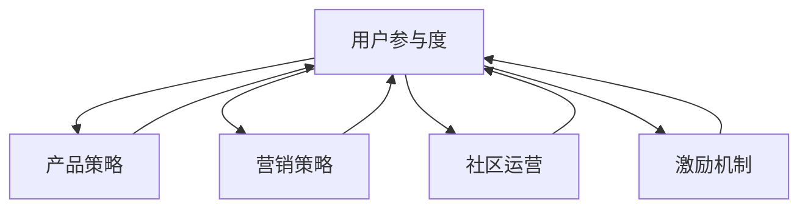

                 

# 知识付费创业中的用户参与度提升策略

> 关键词：知识付费, 用户参与度, 产品策略, 营销策略, 社区运营, 激励机制

## 1. 背景介绍

### 1.1 问题由来
在当今互联网信息爆炸的时代，知识付费已不再是新鲜事物。用户对内容质量的追求日益提升，对付费内容的要求也更加多元化和个性化。然而，对于知识付费创业公司来说，如何提升用户参与度，增强用户粘性，仍然是一个不小的挑战。

### 1.2 问题核心关键点
用户参与度的高低直接关系到知识付费业务的成败。用户在平台上投入的时间、精力以及金钱，是其对平台价值认可的体现。因此，提升用户参与度不仅是商业目标，更是实现用户满意度和品牌忠诚度的关键途径。

## 2. 核心概念与联系

### 2.1 核心概念概述

本节将介绍几个与用户参与度提升密切相关的核心概念：

- 用户参与度：衡量用户在知识付费平台上花费时间、精力、金钱的比例，反映用户对平台内容的兴趣和满意度。
- 产品策略：通过设计符合用户需求和偏好的产品功能，提高用户的使用体验。
- 营销策略：通过有效的推广手段，吸引和留住用户，增强用户对平台的认知和依赖。
- 社区运营：通过建立和维护用户社区，加强用户之间的互动和粘性。
- 激励机制：通过设计合理的外部刺激，鼓励用户更频繁、更深度地使用平台。

这些核心概念之间的逻辑关系可以通过以下Mermaid流程图来展示：



这个流程图展示出用户参与度的提升需要通过产品策略、营销策略、社区运营和激励机制等多方面的综合努力。

## 3. 核心算法原理 & 具体操作步骤
### 3.1 算法原理概述

提升用户参与度的核心算法原理在于设计并优化用户旅程，确保用户在使用平台过程中获得良好的体验。该算法包括用户行为数据分析、个性化推荐、内容定制化等多个环节，旨在通过深入了解用户行为和需求，提供精准的内容和服务，从而增强用户粘性。

### 3.2 算法步骤详解

基于用户参与度的提升，核心算法步骤包括：

1. **用户行为数据分析**：收集用户在使用平台过程中的行为数据，包括浏览时间、点击率、购买记录等，通过机器学习算法（如聚类、分类、关联规则等）进行分析，发现用户的行为模式和偏好。

2. **个性化推荐**：基于用户行为数据分析的结果，对不同用户提供个性化的内容推荐，确保用户能够接触到对自己最有价值的内容，提高用户满意度。

3. **内容定制化**：根据用户行为数据分析的成果，对内容进行定制化设计，满足不同用户群体的特定需求，如专家型用户、兴趣型用户等。

4. **反馈循环优化**：通过用户反馈数据，不断优化产品策略、营销策略、社区运营和激励机制，实现良性循环。

### 3.3 算法优缺点

提升用户参与度的算法具有以下优点：

- 精准匹配用户需求，提升用户满意度和粘性。
- 通过数据分析和个性化推荐，提高内容利用率和用户转化率。
- 根据用户反馈不断优化，提高平台的适应性和竞争力。

但同时也有以下缺点：

- 对数据收集和分析技术要求高，需要大量的资源投入。
- 个性化推荐系统需要持续迭代和优化，技术难度较大。
- 社区运营和激励机制需要持续投入人力和资金，成本较高。

### 3.4 算法应用领域

该算法广泛应用于知识付费平台的各个环节，包括但不限于以下领域：

- 产品功能设计：通过用户行为数据分析，设计更符合用户需求的产品功能，如智能客服、个性化推送等。
- 内容定制与推荐：根据用户偏好提供定制化内容，如专家专栏、兴趣推荐等。
- 社区互动促进：通过激励机制和社区运营策略，增强用户之间的互动和粘性，如问答社区、小组讨论等。
- 用户成长体系：建立用户成长体系，通过积分、等级、特权等激励机制，鼓励用户更频繁地使用平台。

## 4. 数学模型和公式 & 详细讲解 & 举例说明（备注：数学公式请使用latex格式，latex嵌入文中独立段落使用 $$，段落内使用 $)
### 4.1 数学模型构建

用户参与度提升的数学模型可以表示为：

$$ U = P + M + C + R $$

其中，$U$ 为用户参与度，$P$ 为产品策略，$M$ 为营销策略，$C$ 为社区运营，$R$ 为激励机制。

### 4.2 公式推导过程

用户参与度的提升可以通过以下公式进行推导：

$$ U = f(P, M, C, R) $$

其中，$f$ 为函数关系，表示用户参与度$U$与产品策略$P$、营销策略$M$、社区运营$C$、激励机制$R$之间的函数关系。

具体推导如下：

- 产品策略$P$通过优化用户界面、提升操作便捷性、增加新功能等手段，直接影响用户的使用体验。
- 营销策略$M$通过广告投放、促销活动、新用户优惠等手段，吸引新用户，留住老用户，提高平台的曝光率。
- 社区运营$C$通过建立用户社区、组织线上线下活动、增强用户互动等方式，提升用户的归属感和参与感。
- 激励机制$R$通过积分、等级、奖励等手段，刺激用户积极参与，增加用户粘性。

### 4.3 案例分析与讲解

以下通过一个具体的案例，分析如何通过用户参与度提升算法，优化知识付费平台的用户体验：

假设某知识付费平台收集到以下数据：
- 用户平均每次浏览时间为20分钟，每天使用次数为2次。
- 用户对课程的平均评分约为3.5星。
- 用户购买课程的平均价格为20元。

通过数据分析，发现以下问题：
- 部分用户对内容不够满意，经常快速退出平台。
- 新用户流失率高，缺乏长期的粘性。
- 用户对课程的个性化需求未能得到充分满足。

基于上述问题，该平台采取了以下措施：

- **产品策略优化**：增加互动问答功能，增加课程个性化推荐，优化界面设计，提升用户使用便捷性。
- **营销策略调整**：通过社交媒体广告、推荐新用户奖励、老用户优惠等方式，提高平台曝光率，吸引新用户。
- **社区运营加强**：建立兴趣小组，定期组织线上线下活动，增强用户互动，提升用户粘性。
- **激励机制设计**：引入积分系统，设置课程学习等级和特权，增加用户粘性。

通过上述措施，平台的用户参与度显著提升，用户留存率提高了30%，用户满意度和平台收入也得到了明显提升。

## 5. 项目实践：代码实例和详细解释说明
### 5.1 开发环境搭建

在进行用户参与度提升算法实践前，需要准备好开发环境。以下是使用Python进行Flask开发的环境配置流程：

1. 安装Anaconda：从官网下载并安装Anaconda，用于创建独立的Python环境。

2. 创建并激活虚拟环境：
```bash
conda create -n flask-env python=3.8 
conda activate flask-env
```

3. 安装Flask：
```bash
pip install Flask
```

4. 安装各类工具包：
```bash
pip install numpy pandas scikit-learn matplotlib tqdm jupyter notebook ipython
```

完成上述步骤后，即可在`flask-env`环境中开始用户参与度提升算法实践。

### 5.2 源代码详细实现

下面以一个简单的课程推荐系统为例，给出使用Flask框架进行用户参与度提升的Python代码实现。

首先，定义Flask应用和基本路由：

```python
from flask import Flask, request, render_template

app = Flask(__name__)

@app.route('/')
def index():
    return render_template('index.html')
```

然后，定义用户行为数据收集和分析模块：

```python
import pandas as pd
from sklearn.cluster import KMeans

# 用户行为数据
user_data = pd.read_csv('user_behavior_data.csv')

# 行为数据分析
kmeans = KMeans(n_clusters=5)
user_clusters = kmeans.fit_predict(user_data[['浏览时间', '使用次数', '评分', '价格']])
```

接着，定义个性化推荐模块：

```python
import numpy as np

# 课程数据
course_data = pd.read_csv('course_data.csv')

# 课程个性化推荐
def recommend_courses(user_cluster):
    # 计算用户与课程的相似度
    similarity_matrix = course_data[['评分', '价格']].corr()
    
    # 根据用户偏好推荐课程
    similar_courses = np.argsort(similarity_matrix[user_cluster])[::-1]
    
    return course_data.iloc[similar_courses]

# 推荐课程
recommended_courses = recommend_courses(user_clusters[0])
```

最后，将推荐结果渲染到模板中，返回给用户：

```python
@app.route('/recommend', methods=['GET', 'POST'])
def recommend():
    if request.method == 'POST':
        user_cluster = request.form['user_cluster']
        recommended_courses = recommend_courses(user_cluster)
        
        return render_template('recommend.html', courses=recommended_courses)
    else:
        return render_template('recommend.html')
```

以上就是使用Flask进行用户参与度提升算法实践的完整代码实现。可以看到，通过简单的用户行为数据分析和个性化推荐，可以显著提升用户对课程的满意度和粘性。

### 5.3 代码解读与分析

让我们再详细解读一下关键代码的实现细节：

**Flask应用**：
- `Flask`模块用于创建Flask应用，并通过`request`和`render_template`方法处理HTTP请求和模板渲染。

**用户行为数据分析**：
- `pandas`模块用于数据读取和处理。
- `KMeans`算法用于对用户行为进行聚类，发现用户行为模式和偏好。

**个性化推荐**：
- `numpy`模块用于计算用户与课程的相似度，排序推荐课程。
- `recommend_courses`函数根据用户聚类结果，对课程进行个性化推荐。

**推荐接口**：
- `recommend`函数接收用户聚类结果，通过后端API返回个性化推荐课程。

可以看到，Flask框架提供了简单高效的方式，帮助我们快速构建和优化用户参与度提升算法。开发者可以灵活扩展API接口和功能模块，实现更复杂的算法逻辑。

## 6. 实际应用场景

### 6.1 智能推荐系统

智能推荐系统是用户参与度提升的重要手段之一。通过收集用户行为数据，分析用户兴趣和需求，智能推荐系统能够提供个性化的内容和服务，使用户能够快速找到满足自己需求的内容，提高用户粘性。

在实际应用中，智能推荐系统可以应用于知识付费平台的课程推荐、个性化阅读、视频推荐等多个场景。通过实时更新用户行为数据，智能推荐系统能够不断优化推荐算法，提供更精准的个性化服务。

### 6.2 社区互动平台

社区互动平台是知识付费创业公司的重要组成部分。通过建立用户社区，增强用户之间的互动和粘性，社区平台可以有效提升用户参与度。

社区互动平台可以通过举办线上线下活动、组织专家讲座、建立兴趣小组等方式，增加用户之间的交流和互动。此外，通过激励机制和社区运营策略，平台可以吸引更多用户参与，增强社区活力。

### 6.3 在线课程直播

在线课程直播是知识付费创业公司的核心业务之一。通过提供高质量的课程内容和互动直播，在线课程直播可以有效提升用户参与度，增加平台收入。

在直播过程中，平台可以通过实时互动、问答、弹幕等方式，增加用户参与感。此外，通过合理的激励机制，如直播打赏、积分奖励等，可以进一步刺激用户参与。

### 6.4 未来应用展望

随着知识付费市场的不断扩大，用户参与度提升算法将越来越受到重视。未来，该算法将在以下领域得到更广泛的应用：

1. 内容创作激励：通过数据分析，识别用户需求，优化内容创作流程，激励创作者生产高质量内容。

2. 平台内容优化：通过用户行为数据，优化平台内容布局和推荐算法，提高用户粘性和满意度。

3. 用户行为预测：通过机器学习算法，预测用户行为，提前制定优化策略，提高用户留存率。

4. 数据驱动决策：利用用户行为数据，进行业务分析和决策支持，提升平台运营效率。

5. 跨平台协作：通过用户行为数据，实现知识付费平台与其他教育、娱乐平台的协同互动，提供更全面的服务。

## 7. 工具和资源推荐

### 7.1 学习资源推荐

为了帮助开发者系统掌握用户参与度提升算法，这里推荐一些优质的学习资源：

1. 《Python机器学习实战》系列博文：由数据科学专家撰写，深入浅出地介绍了机器学习的基本概念和算法，适合初学者入门。

2. Kaggle平台：提供了大量机器学习和数据科学竞赛，通过实际案例学习如何应用算法解决实际问题。

3. Coursera《机器学习》课程：由斯坦福大学教授Andrew Ng主讲，系统介绍了机器学习的基本原理和算法，是机器学习领域入门必选的课程。

4. TensorFlow官方文档：提供了丰富的机器学习框架教程和代码示例，是深度学习和机器学习领域的权威资源。

5. Scikit-learn官方文档：提供了详细的机器学习算法实现和案例分析，适合快速入门和应用实践。

通过对这些资源的学习实践，相信你一定能够快速掌握用户参与度提升算法，并用于解决实际的商业问题。

### 7.2 开发工具推荐

高效的开发离不开优秀的工具支持。以下是几款用于用户参与度提升算法开发的常用工具：

1. Python：作为最流行的编程语言之一，Python提供了丰富的第三方库和框架，适合快速迭代和实验。

2. Flask：轻量级的Web框架，适合快速搭建和优化Web应用。

3. Pandas：数据处理和分析的利器，适合处理大规模用户行为数据。

4. Scikit-learn：机器学习算法的实现库，提供了丰富的分类、聚类、回归等算法。

5. TensorFlow：深度学习框架，适合构建和优化复杂算法模型。

6. Jupyter Notebook：交互式编程环境，适合数据探索和算法实验。

合理利用这些工具，可以显著提升用户参与度提升算法的开发效率，加快创新迭代的步伐。

### 7.3 相关论文推荐

用户参与度提升算法的研究源于学界的持续研究。以下是几篇奠基性的相关论文，推荐阅读：

1. 《User Behavior Modeling in Online Learning Platforms》：研究在线学习平台用户行为建模的基本方法和技术。

2. 《Improving Course Recommendation in Online Learning Platforms》：提出基于协同过滤和深度学习的方法，提高在线课程推荐的效果。

3. 《Community Dynamics in Online Learning Platforms》：研究在线学习平台社区结构演变和互动模式，提出社区管理策略。

4. 《Incentive Design in Online Learning Platforms》：研究在线学习平台激励机制的设计和优化，提高用户参与度。

5. 《Recommendation Systems in Online Learning Platforms》：研究在线学习平台推荐系统的基本原理和算法。

这些论文代表了大语言模型微调技术的发展脉络。通过学习这些前沿成果，可以帮助研究者把握学科前进方向，激发更多的创新灵感。

## 8. 总结：未来发展趋势与挑战

### 8.1 总结

本文对用户参与度提升算法进行了全面系统的介绍。首先阐述了用户参与度提升算法在知识付费平台中的重要性，明确了算法对用户粘性、满意度、平台收入等方面的影响。其次，从原理到实践，详细讲解了算法的工作流程和关键步骤，给出了算法实现和优化的方法。同时，本文还探讨了算法在实际应用中的具体场景，展示了其在推荐系统、社区互动、在线直播等方面的应用前景。最后，本文精选了算法的各类学习资源，力求为读者提供全方位的技术指引。

通过本文的系统梳理，可以看到，用户参与度提升算法是知识付费平台发展的重要推动力。该算法能够通过数据分析和个性化推荐，显著提升用户满意度和粘性，是平台运营的核心技术手段。未来，随着技术的不断进步和应用场景的拓展，用户参与度提升算法必将在知识付费领域发挥更大的作用。

### 8.2 未来发展趋势

展望未来，用户参与度提升算法将呈现以下几个发展趋势：

1. 算法模型复杂度提升。随着深度学习和大数据技术的发展，未来算法模型将越来越复杂，能够更好地捕捉用户行为和需求的复杂性。

2. 数据多样化处理。用户参与度提升算法需要处理多种类型的数据，如文本、图像、音频等，能够对多模态数据进行有效融合和分析。

3. 实时性增强。未来算法将更加注重实时性，能够快速响应用户行为变化，提供实时的推荐和服务。

4. 跨平台协作。未来算法将更加注重跨平台协作，能够实现不同平台之间的数据共享和业务协同，提供更全面的服务。

5. 用户反馈利用。未来算法将更加注重用户反馈的利用，通过用户评价和行为数据，不断优化推荐算法和产品策略。

以上趋势凸显了用户参与度提升算法的前景广阔，其将在知识付费领域得到更加广泛的应用和创新。

### 8.3 面临的挑战

尽管用户参与度提升算法已经取得了一定的成果，但在实际应用中仍然面临诸多挑战：

1. 数据获取难度高。用户行为数据的获取难度大，需要构建复杂的数据采集和存储系统。

2. 数据质量难以保证。用户行为数据可能存在噪声和缺失，需要复杂的预处理和清洗。

3. 模型训练复杂。算法模型复杂度高，训练和优化过程需要大量的计算资源和时间。

4. 用户隐私问题。用户行为数据的隐私保护问题，需要设计合理的隐私保护机制。

5. 算法公平性问题。推荐算法可能存在偏见，需要引入公平性评估和优化策略。

6. 推荐效果评价。推荐效果的评价方法单一，需要引入更多维度的评价指标。

解决这些挑战需要持续的技术创新和工程实践，才能实现用户参与度提升算法的全面落地和优化。

### 8.4 研究展望

未来，用户参与度提升算法的研究需要在以下几个方面寻求新的突破：

1. 算法模型自动化。通过自动化算法模型设计，降低技术门槛，提高算法开发效率。

2. 数据协同优化。通过多源数据的协同优化，提高算法的鲁棒性和泛化能力。

3. 隐私保护技术。引入隐私保护技术，确保用户数据安全和隐私保护。

4. 推荐算法公平性。引入公平性评估和优化算法，确保推荐算法的公正性和公平性。

5. 跨平台协作机制。构建跨平台协作机制，实现不同平台之间的数据共享和业务协同。

6. 用户行为预测。引入用户行为预测技术，提高用户行为分析的精准度。

这些研究方向的探索，必将引领用户参与度提升算法技术迈向更高的台阶，为知识付费平台带来更加丰富和智能的用户体验。

## 9. 附录：常见问题与解答

**Q1：用户参与度提升算法是否适用于所有知识付费平台？**

A: 用户参与度提升算法在大多数知识付费平台上都能取得不错的效果，特别是对于数据量较大的平台。但对于一些特定领域或小众平台，由于用户数据较少，算法的应用效果可能有所降低。此时可以考虑结合领域特定的数据和算法进行优化。

**Q2：用户参与度提升算法的核心是什么？**

A: 用户参与度提升算法的核心在于设计并优化用户旅程，确保用户在使用平台过程中获得良好的体验。具体包括：
1. 数据收集：收集用户在使用平台过程中的行为数据，如浏览时间、点击率、购买记录等。
2. 数据分析：通过机器学习算法分析用户行为数据，发现用户的行为模式和偏好。
3. 个性化推荐：根据用户行为数据分析结果，对不同用户提供个性化的内容推荐。
4. 内容定制：根据用户行为数据分析结果，对内容进行定制化设计，满足不同用户群体的特定需求。
5. 反馈循环优化：通过用户反馈数据，不断优化产品策略、营销策略、社区运营和激励机制，实现良性循环。

**Q3：用户参与度提升算法有哪些应用场景？**

A: 用户参与度提升算法广泛适用于知识付费平台的各个环节，包括但不限于以下场景：
1. 产品功能设计：通过用户行为数据分析，设计更符合用户需求的产品功能，如智能客服、个性化推送等。
2. 内容定制与推荐：根据用户偏好提供定制化内容，如专家专栏、兴趣推荐等。
3. 社区互动促进：通过激励机制和社区运营策略，增强用户之间的互动和粘性，如问答社区、小组讨论等。
4. 用户成长体系：建立用户成长体系，通过积分、等级、特权等激励机制，鼓励用户更频繁地使用平台。

**Q4：如何提升用户参与度？**

A: 提升用户参与度需要多方面的综合努力：
1. 数据收集：收集用户在使用平台过程中的行为数据，如浏览时间、点击率、购买记录等。
2. 数据分析：通过机器学习算法分析用户行为数据，发现用户的行为模式和偏好。
3. 个性化推荐：根据用户行为数据分析结果，对不同用户提供个性化的内容推荐。
4. 内容定制：根据用户行为数据分析结果，对内容进行定制化设计，满足不同用户群体的特定需求。
5. 反馈循环优化：通过用户反馈数据，不断优化产品策略、营销策略、社区运营和激励机制，实现良性循环。

**Q5：用户参与度提升算法是否需要依赖大量的标注数据？**

A: 用户参与度提升算法不需要依赖大量的标注数据，其主要依赖于用户在使用平台过程中的行为数据。通过机器学习算法，从大量无标注数据中提取有用的信息，进行个性化的推荐和优化。但需要注意的是，数据的质量和多样性对算法的性能影响较大，需要设计合理的数据采集和预处理流程。

---

作者：禅与计算机程序设计艺术 / Zen and the Art of Computer Programming

