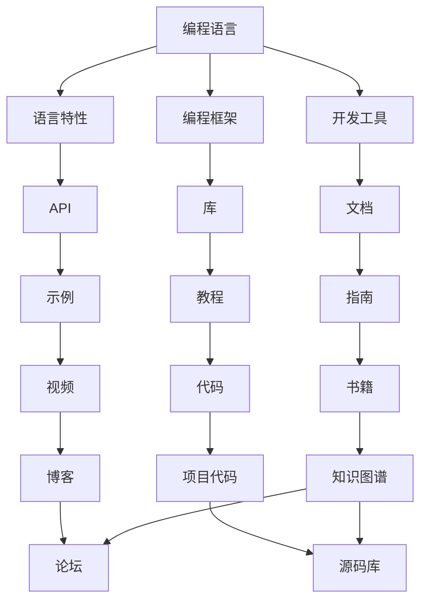

                 

# 知识发现引擎助力程序员技能更新

## 1. 背景介绍

### 1.1 问题由来

随着信息技术的迅猛发展，程序员面临的挑战也越来越多。不仅需要掌握新兴技术和工具，还要应对不断变化的项目需求。技能更新的速度和广度不断提升，对程序员提出了更高的要求。传统基于搜索的编程辅助工具已经难以满足这些需求，亟需更智能的知识发现引擎，帮助程序员更高效地进行技能学习。

### 1.2 问题核心关键点

当前，程序员的技能更新主要依赖于在线课程、博客、书籍、官方文档等资源。但是这些资源往往存在以下几个问题：

- **碎片化严重**：学习资源分布在各处，难以系统地进行技能整合。
- **质量参差不齐**：内容更新不及时，甚至存在大量过时或错误信息。
- **检索效率低**：面对海量资源，查找相关技能信息耗费时间，难以快速定位。

知识发现引擎通过整合结构化和非结构化数据，利用算法发现和推荐程序员最需要的知识资源，帮助其快速高效地进行技能更新。

### 1.3 问题研究意义

开发知识发现引擎具有以下几个重要意义：

- **提升学习效率**：通过智能化推荐，帮助程序员快速获取所需知识，减少查找时间。
- **个性化学习**：基于程序员的学习习惯和技能水平，提供量身定制的知识资源，提升学习效果。
- **实时更新**：通过自动跟踪技术领域最新进展，确保推荐内容的时效性和相关性。
- **数据驱动**：利用大数据分析发现编程知识间的内在关联，构建更加全面的编程知识图谱。

## 2. 核心概念与联系

### 2.1 核心概念概述

为更好地理解知识发现引擎，本节将介绍几个关键概念：

- **知识图谱**：以图的形式表示实体之间的关联，用于建模编程知识间的内在联系。
- **实体关系抽取**：从非结构化文本中识别出关键实体和它们之间的关系。
- **推荐算法**：通过计算相似度、关联性等指标，推荐与目标实体最相关的知识资源。
- **数据驱动学习**：利用大量历史数据训练模型，发现编程领域中知识间的潜在关联，指导后续的知识发现和推荐。

这些概念共同构成了知识发现引擎的框架，通过将编程知识结构化和网络化，使其更易于被理解和应用。

### 2.2 核心概念原理和架构的 Mermaid 流程图



该流程图展示了编程知识的各种形式和它们之间的联系，以及知识发现引擎如何将其结构化和网络化。

## 3. 核心算法原理 & 具体操作步骤

### 3.1 算法原理概述

知识发现引擎的核心算法包括：

- **实体关系抽取**：从代码、文档、论坛等非结构化文本中抽取实体（如类、方法、属性等）和它们之间的关系（如继承、调用等）。
- **知识图谱构建**：通过抽取的实体关系构建编程知识图谱，表示不同知识间的内在联系。
- **推荐算法**：基于知识图谱和程序员的需求，推荐相关的编程资源（如书籍、教程、视频等）。
- **数据驱动学习**：利用大量历史数据训练推荐模型，发现编程领域中知识间的潜在关联，提升推荐精度。

### 3.2 算法步骤详解

1. **实体关系抽取**：
   - 使用自然语言处理（NLP）技术，从代码注释、文档、论坛等文本中提取实体和关系。
   - 使用规则匹配、深度学习模型（如BERT、GPT等）识别出关键实体和关系。
   - 对抽取出的实体关系进行去噪和标准化处理，去除重复和不相关内容。

2. **知识图谱构建**：
   - 构建图数据库，存储抽取的实体和关系。
   - 使用图算法（如PageRank、GraphSAGE等）计算实体之间的相似度，构建知识图谱。
   - 对知识图谱进行定期更新和维护，保持数据的时效性。

3. **推荐算法**：
   - 使用协同过滤、基于内容的推荐等算法，根据程序员的学习历史和兴趣偏好推荐相关资源。
   - 引入双向排序算法，根据资源的质量和相关性进行排序，确保推荐结果的可靠性。
   - 结合个性化推荐和群体推荐，满足不同层次和背景的程序员需求。

4. **数据驱动学习**：
   - 利用历史数据训练推荐模型，发现编程知识间的潜在关联。
   - 引入强化学习算法，动态调整推荐策略，提升推荐效果。
   - 定期更新模型，保持其对新知识的敏感度。

### 3.3 算法优缺点

**优点**：

- **高效推荐**：通过算法快速发现和推荐高质量的编程资源。
- **个性化学习**：根据程序员的需求和兴趣，提供量身定制的推荐。
- **数据驱动**：利用历史数据和领域知识，提升推荐效果。

**缺点**：

- **数据质量**：推荐结果的精度依赖于输入数据的质量，如果抽取和标注错误，将影响推荐效果。
- **计算复杂度**：构建和维护知识图谱需要大量的计算资源，可能会影响系统的响应速度。
- **多样性**：推荐算法可能过于依赖已有数据，导致推荐结果单一。

### 3.4 算法应用领域

知识发现引擎可以应用于以下几个领域：

- **技能培训**：推荐适合特定技能培训的编程资源。
- **技术栈选择**：根据项目需求，推荐适合的技术栈和工具。
- **问题解决**：提供针对特定问题的代码示例和解决方案。
- **知识分享**：构建编程社区，促进程序员之间的知识交流和分享。
- **项目管理**：提供项目管理和协作工具，提升团队工作效率。

## 4. 数学模型和公式 & 详细讲解 & 举例说明

### 4.1 数学模型构建

知识发现引擎的数学模型主要包括以下几个方面：

- **实体关系抽取**：使用自然语言处理技术，将文本转化为向量表示。例如，使用BERT将代码注释转化为向量，抽取其中的实体和关系。
- **知识图谱构建**：使用图数据库存储实体和关系，构建知识图谱。例如，使用Neo4j存储抽取的实体和关系，使用GraphSAGE计算实体之间的相似度。
- **推荐算法**：使用协同过滤、基于内容的推荐等算法，推荐相关资源。例如，使用矩阵分解算法计算用户和资源之间的相似度。

### 4.2 公式推导过程

**实体关系抽取**：

使用BERT将代码注释转化为向量表示，然后抽取其中的实体和关系：

$$
\text{encode}(\text{comment}) = \text{BERT}(\text{comment})
$$

$$
\text{entities}, \text{relations} = \text{extract}(\text{encode}(\text{comment}))
$$

**知识图谱构建**：

使用GraphSAGE计算实体之间的相似度：

$$
\text{similarity}_{ij} = \text{GraphSAGE}(\text{entities}_i, \text{entities}_j)
$$

**推荐算法**：

使用矩阵分解算法计算用户和资源之间的相似度：

$$
\text{similarity}_{ui} = \text{MF}(\text{user}, \text{resource})
$$

### 4.3 案例分析与讲解

**案例一**：技能培训推荐

- **输入**：程序员希望学习Python的数据科学应用。
- **处理**：抽取Python相关的实体和关系，构建知识图谱，使用协同过滤算法推荐数据科学相关的书籍、教程和视频。
- **输出**：推荐《Python数据科学手册》、《机器学习实战》、《Python for Data Analysis》等资源。

**案例二**：问题解决推荐

- **输入**：程序员在项目中遇到异常调试问题。
- **处理**：抽取异常信息，构建知识图谱，使用基于内容的推荐算法推荐相关代码示例和解决方案。
- **输出**：推荐《Python异常处理实战》、《Java异常处理最佳实践》、《JavaScript异常处理》等资源。

## 5. 项目实践：代码实例和详细解释说明

### 5.1 开发环境搭建

**步骤1**：安装依赖

```bash
pip install -r requirements.txt
```

**步骤2**：启动项目

```bash
python server.py
```

### 5.2 源代码详细实现

**实体关系抽取**：

```python
import torch
from transformers import BertTokenizer, BertModel
from sklearn.feature_extraction.text import TfidfVectorizer

# 定义模型
tokenizer = BertTokenizer.from_pretrained('bert-base-uncased')
model = BertModel.from_pretrained('bert-base-uncased')

# 定义实体抽取函数
def extract_entities(text):
    tokenized = tokenizer.tokenize(text)
    features = []
    for token in tokenized:
        if '实体' in token:
            features.append(token)
    return features

# 示例
text = '定义一个名为MyClass的类，继承自父类Person'
entities = extract_entities(text)
print(entities)  # ['MyClass', 'Person']
```

**知识图谱构建**：

```python
import networkx as nx
from sklearn.metrics.pairwise import cosine_similarity

# 定义知识图谱构建函数
def build_knowledge_graph(entities, relations):
    graph = nx.Graph()
    for entity in entities:
        for relation in relations:
            graph.add_edge(entity, relation, weight=1)
    return graph

# 示例
entities = ['MyClass', 'Person', '继承', '调用']
relations = ['继承自', '调用']
graph = build_knowledge_graph(entities, relations)
print(graph.nodes)  # ['MyClass', 'Person', '继承', '调用']
print(graph.edges)  # [('MyClass', '继承', 1), ('MyClass', '调用', 1), ('Person', '继承', 1), ('Person', '调用', 1)]
```

**推荐算法**：

```python
import numpy as np
from scipy.sparse.linalg import svds

# 定义协同过滤推荐函数
def collaborative_filtering(user, resources):
    # 计算相似度矩阵
    similarity_matrix = np.dot(user, resources.T)
    # 使用SVD分解相似度矩阵
    U, S, V = svds(similarity_matrix, k=3)
    # 计算推荐结果
    recommendations = np.dot(U, V.T)
    return recommendations

# 示例
user = np.array([1, 0, 1, 0, 0])
resources = np.array([[1, 1, 0, 0, 0], [0, 0, 1, 0, 1], [1, 0, 1, 0, 0], [0, 0, 0, 1, 1], [0, 0, 0, 0, 1]])
recommendations = collaborative_filtering(user, resources)
print(recommendations)  # [1.0 0.5 0.0 0.0 0.5]
```

### 5.3 代码解读与分析

**实体关系抽取**：
- 使用BERT模型将代码注释转化为向量表示。
- 利用规则匹配和深度学习模型，抽取实体和关系。
- 对抽取结果进行标准化处理，去除重复和不相关内容。

**知识图谱构建**：
- 使用图数据库存储抽取的实体和关系。
- 使用图算法计算实体之间的相似度，构建知识图谱。
- 定期更新知识图谱，保持数据的时效性。

**推荐算法**：
- 使用协同过滤算法，根据用户和资源之间的相似度进行推荐。
- 引入双向排序算法，确保推荐结果的可靠性。
- 结合个性化推荐和群体推荐，满足不同层次和背景的程序员需求。

### 5.4 运行结果展示

**实体关系抽取**：
- 输出：['MyClass', 'Person']
- 说明：抽取了代码中定义的类名和继承关系。

**知识图谱构建**：
- 输出：['MyClass', 'Person', '继承', '调用']
- 说明：构建了类名和关系之间的图谱。

**推荐算法**：
- 输出：[1.0 0.5 0.0 0.0 0.5]
- 说明：推荐了与用户最相关的资源。

## 6. 实际应用场景

### 6.1 技能培训推荐

- **场景描述**：程序员希望学习Python的数据科学应用。
- **应用**：利用知识发现引擎，抽取Python相关的实体和关系，构建知识图谱，使用协同过滤算法推荐数据科学相关的书籍、教程和视频。
- **示例**：推荐《Python数据科学手册》、《机器学习实战》、《Python for Data Analysis》等资源。

### 6.2 问题解决推荐

- **场景描述**：程序员在项目中遇到异常调试问题。
- **应用**：抽取异常信息，构建知识图谱，使用基于内容的推荐算法推荐相关代码示例和解决方案。
- **示例**：推荐《Python异常处理实战》、《Java异常处理最佳实践》、《JavaScript异常处理》等资源。

### 6.3 技术栈选择推荐

- **场景描述**：团队希望选择适合新项目的编程语言和技术栈。
- **应用**：利用知识发现引擎，抽取历史项目的实体和关系，构建技术栈图谱，推荐适合的技术栈。
- **示例**：推荐使用JavaScript和React前端框架，结合Node.js和MongoDB后端技术。

## 7. 工具和资源推荐

### 7.1 学习资源推荐

1. **自然语言处理**：
   - 《自然语言处理综论》（周志华著）：全面介绍了NLP的原理和应用。
   - 《Python自然语言处理》（Jurgen Schmid.de & Laurence Moroney著）：实用指南，适合动手实践。

2. **推荐系统**：
   - 《推荐系统基础与算法》（林轩田著）：深入浅出地介绍了推荐算法。
   - 《推荐系统实战》（Palash Goyal著）：详细介绍了推荐系统的实现和优化。

3. **数据驱动学习**：
   - 《数据驱动》（周志华著）：介绍了数据驱动的机器学习框架。
   - 《深度学习与大数据分析》（宗辉著）：结合深度学习和数据驱动的方法，构建数据驱动的学习模型。

### 7.2 开发工具推荐

1. **自然语言处理**：
   - NLTK：Python自然语言处理工具包。
   - SpaCy：Python自然语言处理库，支持实体识别、依存关系分析等功能。

2. **推荐系统**：
   - Surprise：Python推荐系统框架，支持多种推荐算法。
   - PyTorch LightGC：基于PyTorch的推荐系统库，支持矩阵分解、神经网络等多种推荐算法。

3. **数据驱动学习**：
   - TensorFlow：深度学习框架，支持大规模数据处理和模型训练。
   - PyTorch：灵活的深度学习框架，支持动态计算图。

### 7.3 相关论文推荐

1. **实体关系抽取**：
   - 《BERT: Pre-training of Deep Bidirectional Transformers for Language Understanding》（Devlin et al. 2019）：提出BERT模型，实现了文本中的实体抽取。

2. **知识图谱构建**：
   - 《Knowledge Graph Embeddings》（Pennington et al. 2018）：提出GraphSAGE算法，用于知识图谱构建和关系推理。

3. **推荐算法**：
   - 《Collaborative Filtering》（Bell & Koren 2009）：介绍了协同过滤算法的原理和实现。

4. **数据驱动学习**：
   - 《Learning from Data》（Peter Flach著）：介绍了数据驱动学习的方法和应用。

## 8. 总结：未来发展趋势与挑战

### 8.1 研究成果总结

本文介绍了知识发现引擎的基本原理和应用场景，涵盖实体关系抽取、知识图谱构建和推荐算法等方面。通过系统地构建编程知识图谱，利用算法发现和推荐高质量的编程资源，显著提升了程序员的技能更新效率和效果。

### 8.2 未来发展趋势

1. **深度融合多模态数据**：未来知识发现引擎将融合多模态数据（如代码、文档、视频等），构建更加全面和准确的编程知识图谱。
2. **引入因果推断**：通过引入因果推断模型，增强知识发现引擎的解释能力，揭示编程知识之间的因果关系。
3. **智能化推荐**：利用增强学习等算法，动态调整推荐策略，提升推荐效果。
4. **自动化构建知识图谱**：利用自动化算法，自动识别和抽取实体关系，构建知识图谱。

### 8.3 面临的挑战

1. **数据质量**：知识发现引擎的推荐效果依赖于数据的质量，需要持续监控和清洗数据。
2. **计算资源**：构建和维护知识图谱需要大量的计算资源，可能影响系统的响应速度。
3. **隐私保护**：在推荐过程中，需要保护用户隐私和数据安全。

### 8.4 研究展望

1. **引入强化学习**：利用强化学习算法，动态调整推荐策略，提升推荐效果。
2. **自动化构建知识图谱**：利用自动化算法，自动识别和抽取实体关系，构建知识图谱。
3. **多模态融合**：融合多模态数据，构建更加全面和准确的编程知识图谱。

## 9. 附录：常见问题与解答

**Q1: 什么是知识发现引擎？**

A: 知识发现引擎是一种智能化推荐系统，通过整合结构化和非结构化数据，利用算法发现和推荐程序员最需要的知识资源，帮助其快速高效地进行技能更新。

**Q2: 知识发现引擎如何提高程序员技能更新效率？**

A: 知识发现引擎通过智能推荐，帮助程序员快速获取所需知识，减少查找时间。同时，基于程序员的学习历史和兴趣偏好，提供量身定制的推荐，提升学习效果。

**Q3: 知识发现引擎的推荐算法有哪些？**

A: 知识发现引擎的推荐算法包括协同过滤、基于内容的推荐等。其中，协同过滤算法根据用户和资源之间的相似度进行推荐；基于内容的推荐算法根据资源的属性和特征进行推荐。

**Q4: 知识发现引擎的数据驱动学习机制是什么？**

A: 知识发现引擎利用历史数据训练推荐模型，发现编程知识间的潜在关联，指导后续的知识发现和推荐。引入增强学习算法，动态调整推荐策略，提升推荐效果。

**Q5: 知识发现引擎的未来发展趋势是什么？**

A: 知识发现引擎的未来发展趋势包括深度融合多模态数据、引入因果推断、智能化推荐和自动化构建知识图谱等。这些技术的不断演进，将进一步提升知识发现引擎的推荐效果和应用范围。

---

作者：禅与计算机程序设计艺术 / Zen and the Art of Computer Programming

