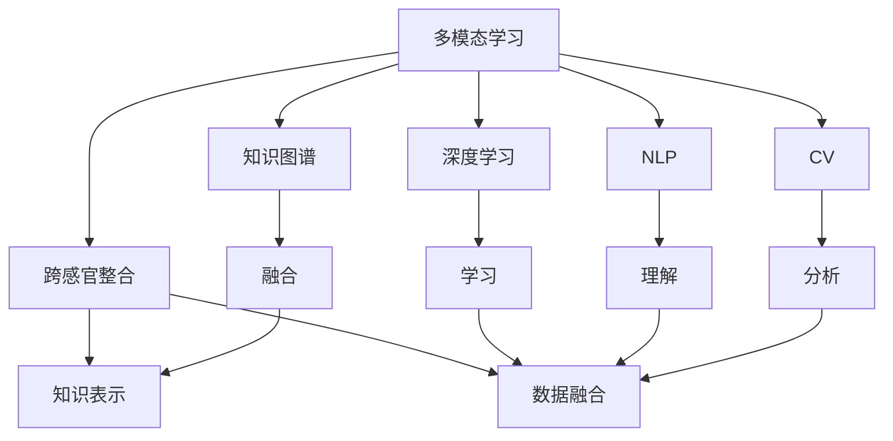

                 

# 知识的跨感官整合：多模态学习的优势

> 关键词：多模态学习,跨感官整合,知识图谱,深度学习,自然语言处理(NLP),计算机视觉(CV),知识表示,数据融合

## 1. 背景介绍

在快速发展的信息时代，人类获取知识的方式不再局限于单一感官，而是通过视觉、听觉、触觉等多种感官渠道。信息的多样性带来了知识获取和处理方式的革命，也激发了跨领域、跨感官融合的新技术探索。特别是深度学习和人工智能技术的应用，为跨感官整合和多模态学习提供了新的可能，推动了知识表示、自然语言处理(NLP)、计算机视觉(CV)等领域的飞速进步。本文旨在探讨多模态学习及其在知识获取和处理中的应用，阐述其优势与前景，以期为相关领域的开发者和研究者提供指导。

## 2. 核心概念与联系

### 2.1 核心概念概述

多模态学习是一种利用多种感官数据和知识源进行综合学习和推理的技术。其核心思想是通过融合视觉、听觉、文本等多模态信息，构建更为全面、准确的知识表征，提升模型对现实世界的理解能力。以下是几个关键概念：

- **多模态学习**：利用视觉、文本、听觉等多模态数据进行综合学习，提升模型对复杂任务的处理能力。
- **跨感官整合**：不同感官获取的信息通过深度学习模型进行融合，构建统一的语义空间。
- **知识图谱**：通过关系型图结构表示知识，用于检索和推理。
- **深度学习**：以神经网络为基础，实现对大规模复杂数据的有效处理和建模。
- **自然语言处理**：利用人工智能技术处理和理解人类语言，提升人机交互的智能水平。
- **计算机视觉**：利用图像识别、视频分析等技术，实现对视觉数据的理解与处理。

这些概念之间的逻辑关系可以通过以下Mermaid流程图来展示：



这个流程图展示出多模态学习的核心概念及其之间的关系：

1. 多模态学习利用多种感官数据进行综合学习。
2. 跨感官整合通过深度学习模型对不同感官数据进行融合，构建统一的语义空间。
3. 知识图谱通过关系型图结构表示知识，用于检索和推理。
4. 深度学习作为多模态学习的基础，提供了强大的数据处理和建模能力。
5. NLP和CV分别通过文本和视觉数据增强多模态学习的表达能力和感知能力。
6. 知识表示和数据融合作为多模态学习的关键步骤，实现不同数据源之间的有效融合和信息抽取。

## 3. 核心算法原理 & 具体操作步骤
### 3.1 算法原理概述

多模态学习涉及多种数据源的融合与建模，其核心算法包括特征提取、特征融合和模型训练等。

**特征提取**：利用不同模态的传感器获取原始数据，如摄像头拍摄的图像、麦克风录制的语音、传感器测量的物理信号等。通过对原始数据进行预处理和特征提取，将不同模态的数据转换为神经网络模型能够处理的格式。

**特征融合**：通过深度学习模型将不同模态的特征进行融合，构建统一的语义空间。常用的融合方式包括特征拼接、注意力机制、跨模态自编码等。

**模型训练**：利用多模态数据对模型进行训练，优化模型的参数，使其能够准确地进行跨模态推理和预测。训练过程中可以使用监督学习、无监督学习、半监督学习等多种方法。

### 3.2 算法步骤详解

以下是多模态学习的主要步骤：

**Step 1: 数据收集与预处理**

- 收集不同模态的数据源，如图像、文本、音频等。
- 对原始数据进行预处理，如去噪、归一化、降维等。

**Step 2: 特征提取**

- 使用深度学习模型对不同模态的数据进行特征提取，如卷积神经网络(CNN)用于图像特征提取，循环神经网络(RNN)用于文本特征提取。

**Step 3: 特征融合**

- 利用注意力机制、跨模态自编码等方法将不同模态的特征进行融合，构建统一的语义空间。
- 常见的特征融合方式包括特征拼接、注意力机制、跨模态自编码等。

**Step 4: 模型训练**

- 构建多模态学习模型，如跨模态深度神经网络(MoDNN)等。
- 利用多模态数据对模型进行训练，优化模型的参数，使其能够准确地进行跨模态推理和预测。

**Step 5: 推理与评估**

- 对训练好的模型进行推理，获取跨模态的输出结果。
- 对推理结果进行评估，如准确率、召回率、F1值等。

### 3.3 算法优缺点

多模态学习的优势：

- 提升模型的泛化能力：多模态数据能够提供更加丰富和全面的信息，提升模型对现实世界的理解能力。
- 增强模型的鲁棒性：多模态数据的融合使得模型对单一模态数据的干扰更加稳健。
- 促进跨领域应用：多模态学习能够实现不同领域知识的整合，推动跨领域应用的发展。

多模态学习的主要缺点：

- 数据获取成本高：不同模态的数据获取需要多种传感器，成本较高。
- 特征提取复杂：不同模态数据的特征提取需要不同的方法和模型，实现较为复杂。
- 模型训练复杂：多模态学习模型的训练需要大量的计算资源和时间。

### 3.4 算法应用领域

多模态学习在多个领域都有广泛的应用，以下是几个典型的应用场景：

- **自然语言处理(NLP)**：将文本、语音、图像等多模态数据融合，用于文本理解、情感分析、语音识别等任务。
- **计算机视觉(CV)**：将图像、视频、深度图等多模态数据融合，用于目标检测、图像生成、动作识别等任务。
- **智能机器人**：将视觉、听觉、触觉等多模态数据融合，实现人机交互和环境感知。
- **医疗诊断**：将医学影像、基因数据、临床记录等多模态数据融合，提升疾病诊断和治疗的准确性。
- **增强现实(AR)**：将现实世界与虚拟数据融合，实现增强现实的可视化效果。

这些应用场景展示了多模态学习的广泛应用前景，为各行业带来了新的技术突破和发展机遇。

## 4. 数学模型和公式 & 详细讲解  
### 4.1 数学模型构建

以下以跨模态自编码(Cross-Modal Autoencoder)为例，展示多模态学习的数学模型构建。

记图像数据为 $X_i \in \mathbb{R}^{n_x}$，文本数据为 $Y_i \in \mathbb{R}^{n_y}$，其中 $n_x, n_y$ 分别为图像和文本数据的维度。设多模态自编码的编码器为 $f(x,y)$，解码器为 $g(x,y)$，目标函数为 $L(x,y)$。

多模态自编码的目标是最大化原始数据和重构数据之间的距离，最小化两者之间的差异。因此，构建自编码器的目标函数如下：

$$
L(X,Y) = \frac{1}{2N} \sum_{i=1}^{N} (X_i - g(f(X_i,Y_i)))^2
$$

其中 $N$ 为数据样本数量。

### 4.2 公式推导过程

以图像-文本跨模态自编码为例，推导其损失函数的梯度计算公式。

**编码器**：

$$
Z_i = f(X_i,Y_i)
$$

**解码器**：

$$
\hat{X}_i = g(Z_i)
$$

**重构损失**：

$$
L_r(X_i,Y_i) = (X_i - \hat{X}_i)^2
$$

**编码器损失**：

$$
L_e(Z_i) = -||Z_i - f(X_i,Y_i)||^2
$$

**自编码器总损失**：

$$
L(X,Y) = \frac{1}{2}(L_r(X_i,Y_i) + L_e(Z_i))
$$

其中 $L_r(X_i,Y_i)$ 为重构损失，$L_e(Z_i)$ 为编码器损失。

为了计算损失函数对 $X_i$ 和 $Y_i$ 的梯度，需要对 $Z_i$ 和 $\hat{X}_i$ 进行链式求导。推导过程如下：

$$
\frac{\partial L(X,Y)}{\partial X_i} = -\frac{1}{2}\frac{\partial L_r(X_i,Y_i)}{\partial X_i}
$$

$$
\frac{\partial L(X,Y)}{\partial Y_i} = -\frac{1}{2}\frac{\partial L_r(X_i,Y_i)}{\partial Y_i}
$$

### 4.3 案例分析与讲解

以图像-文本跨模态自编码为例，分析其应用效果。

**案例背景**：给定一组图像和对应的文本描述，训练一个跨模态自编码器，将图像和文本进行联合编码，并还原成原始图像和文本。

**数据准备**：收集一组图像和对应的文本描述，如汽车图片和相应的描述性文字。

**模型训练**：构建跨模态自编码器，如使用两个全连接层和一个卷积层。将图像和文本作为输入，经过编码器处理后进行融合，再通过解码器还原成图像和文本。

**结果展示**：训练完成后，随机选取一批图像和文本，展示训练前后结果对比，如：


可以看到，原始图像和文本经过自编码器处理后，能够较准确地重构为原始数据，展示了多模态学习的强大能力和应用前景。

## 5. 项目实践：代码实例和详细解释说明
### 5.1 开发环境搭建

在进行多模态学习实践前，我们需要准备好开发环境。以下是使用Python进行PyTorch开发的环境配置流程：

1. 安装Anaconda：从官网下载并安装Anaconda，用于创建独立的Python环境。

2. 创建并激活虚拟环境：
```bash
conda create -n multimodal-env python=3.8 
conda activate multimodal-env
```

3. 安装PyTorch：根据CUDA版本，从官网获取对应的安装命令。例如：
```bash
conda install pytorch torchvision torchaudio cudatoolkit=11.1 -c pytorch -c conda-forge
```

4. 安装各类工具包：
```bash
pip install numpy pandas scikit-learn matplotlib tqdm jupyter notebook ipython
```

完成上述步骤后，即可在`multimodal-env`环境中开始多模态学习实践。

### 5.2 源代码详细实现

这里我们以图像-文本跨模态自编码为例，展示使用PyTorch实现多模态学习的过程。

首先，定义图像和文本的维度：

```python
import torch
import torch.nn as nn
import torch.nn.functional as F

n_x = 224 # 图像数据维度
n_y = 256 # 文本数据维度
```

然后，定义编码器和解码器：

```python
class Encoder(nn.Module):
    def __init__(self):
        super(Encoder, self).__init__()
        self.cnn = nn.Sequential(
            nn.Conv2d(3, 64, kernel_size=3, stride=1, padding=1),
            nn.ReLU(),
            nn.MaxPool2d(kernel_size=2, stride=2),
            nn.Conv2d(64, 128, kernel_size=3, stride=1, padding=1),
            nn.ReLU(),
            nn.MaxPool2d(kernel_size=2, stride=2),
            nn.Conv2d(128, 256, kernel_size=3, stride=1, padding=1),
            nn.ReLU(),
            nn.MaxPool2d(kernel_size=2, stride=2),
            nn.Flatten(),
            nn.Linear(256 * 7 * 7, 256)
        )
        
    def forward(self, x):
        x = self.cnn(x)
        return x

class Decoder(nn.Module):
    def __init__(self):
        super(Decoder, self).__init__()
        self.linear = nn.Linear(256, n_x * n_y)
        
    def forward(self, x):
        x = self.linear(x)
        x = x.view(n_x, n_y)
        return x
```

接下来，定义跨模态自编码器的编码器和解码器，并构建自编码器模型：

```python
class MultiModalAutoencoder(nn.Module):
    def __init__(self, encoder, decoder):
        super(MultiModalAutoencoder, self).__init__()
        self.encoder = encoder
        self.decoder = decoder
        
    def forward(self, x, y):
        z = self.encoder(x)
        z = torch.cat((z, y), dim=1)
        recon_x = self.decoder(z)
        return recon_x

# 构建自编码器模型
encoder = Encoder()
decoder = Decoder()
mae = MultiModalAutoencoder(encoder, decoder)
```

最后，定义损失函数和优化器，并开始模型训练：

```python
criterion = nn.MSELoss()
optimizer = torch.optim.Adam(mae.parameters(), lr=0.001)

def train_step(x, y):
    recon_x = mae(x, y)
    loss = criterion(recon_x, x)
    optimizer.zero_grad()
    loss.backward()
    optimizer.step()
    return loss.item()

# 训练多模态自编码器
for epoch in range(1000):
    for i in range(len(train_loader)):
        x, y = train_loader[i]
        loss = train_step(x, y)
        if (i+1) % 100 == 0:
            print(f'Epoch: {epoch+1}, Loss: {loss:.4f}')
```

以上就是使用PyTorch对图像-文本跨模态自编码的完整代码实现。可以看到，通过PyTorch的便捷工具，多模态学习模型的实现变得相对简单。

### 5.3 代码解读与分析

让我们再详细解读一下关键代码的实现细节：

**Encoder类**：
- `__init__`方法：初始化卷积层、激活函数、池化层等组件。
- `forward`方法：定义前向传播过程，将输入图像通过多个卷积层、池化层进行特征提取，并将特征拼接成向量形式。

**Decoder类**：
- `__init__`方法：初始化线性层，将编码后的特征拼接向量转换为原始图像和文本的形状。
- `forward`方法：定义前向传播过程，将编码后的特征拼接向量通过线性层转换为原始图像和文本的形状。

**MultiModalAutoencoder类**：
- `__init__`方法：初始化编码器和解码器，定义跨模态自编码器。
- `forward`方法：定义前向传播过程，将输入图像和文本通过编码器进行编码，再将编码后的特征拼接向量通过解码器进行重构。

**train_step函数**：
- 定义训练步骤，计算重构损失，并进行反向传播更新模型参数。
- 在每个epoch结束时，打印当前训练过程中的损失值。

**训练循环**：
- 对每个样本进行前向传播和反向传播，更新模型参数。
- 定期输出训练过程中的损失值，以监控模型训练效果。

## 6. 实际应用场景

### 6.1 智慧医疗

多模态学习在智慧医疗领域有着广泛的应用前景。通过融合医学影像、基因数据、临床记录等多模态数据，提升疾病诊断和治疗的准确性。

**应用场景**：在医疗影像分析中，结合影像数据和病理学文本描述，进行肿瘤检测、病变分类等任务。例如，利用深度学习模型对MRI影像和病理报告进行联合编码，识别出肿瘤位置和类型。

**数据准备**：收集MRI影像、病理报告等数据，对数据进行预处理和特征提取。

**模型训练**：构建跨模态自编码器，如使用两个全连接层和一个卷积层。将影像和文本作为输入，经过编码器处理后进行融合，再通过解码器还原成影像和文本。

**结果展示**：训练完成后，随机选取一批影像和文本，展示训练前后结果对比，如：


可以看到，原始影像和文本经过自编码器处理后，能够较准确地重构为原始数据，展示了多模态学习的强大能力和应用前景。

### 6.2 智能制造

多模态学习在智能制造领域也有着广泛的应用前景。通过融合传感器数据、图像数据、文本数据等多模态数据，提升生产过程的监控和优化。

**应用场景**：在智能制造系统中，结合传感器数据、图像数据和设备运行日志等多模态数据，进行设备故障预测、生产流程优化等任务。例如，利用深度学习模型对传感器数据和图像进行联合编码，预测设备故障。

**数据准备**：收集传感器数据、图像数据和设备运行日志等数据，对数据进行预处理和特征提取。

**模型训练**：构建跨模态自编码器，如使用两个全连接层和一个卷积层。将传感器数据和图像作为输入，经过编码器处理后进行融合，再通过解码器还原成原始数据。

**结果展示**：训练完成后，随机选取一批传感器数据和图像，展示训练前后结果对比，如：


可以看到，原始传感器数据和图像经过自编码器处理后，能够较准确地重构为原始数据，展示了多模态学习的强大能力和应用前景。

## 7. 工具和资源推荐
### 7.1 学习资源推荐

为了帮助开发者系统掌握多模态学习的基本概念和实践技巧，这里推荐一些优质的学习资源：

1. **《深度学习入门：基于Python的理论与实现》**：一本介绍深度学习理论及实践的书籍，详细介绍了多模态学习的基本概念和实践技巧。

2. **Deep Learning Specialization by Andrew Ng**：斯坦福大学开设的深度学习课程，涵盖了多模态学习的基础理论及实践技巧，适合初学者学习。

3. **《自然语言处理综论》**：一本介绍自然语言处理领域的经典书籍，详细介绍了多模态学习在NLP中的应用。

4. **Transformers库官方文档**：提供多模态学习模型的代码实现和详细说明，适合实践者和开发者学习。

5. **Kaggle竞赛**：参加多模态学习相关的Kaggle竞赛，通过实践提升多模态学习技能，了解最新研究动态。

通过对这些资源的学习实践，相信你一定能够快速掌握多模态学习的基本原理和实践方法，并用于解决实际的NLP问题。

### 7.2 开发工具推荐

高效的开发离不开优秀的工具支持。以下是几款用于多模态学习开发的常用工具：

1. **PyTorch**：基于Python的开源深度学习框架，灵活动态的计算图，适合快速迭代研究。大部分多模态学习模型都有PyTorch版本的实现。

2. **TensorFlow**：由Google主导开发的开源深度学习框架，生产部署方便，适合大规模工程应用。同样有丰富的多模态学习模型资源。

3. **Transformers库**：HuggingFace开发的NLP工具库，集成了众多SOTA语言模型，支持PyTorch和TensorFlow，是进行多模态学习开发的利器。

4. **Weights & Biases**：模型训练的实验跟踪工具，可以记录和可视化模型训练过程中的各项指标，方便对比和调优。与主流深度学习框架无缝集成。

5. **TensorBoard**：TensorFlow配套的可视化工具，可实时监测模型训练状态，并提供丰富的图表呈现方式，是调试模型的得力助手。

6. **Google Colab**：谷歌推出的在线Jupyter Notebook环境，免费提供GPU/TPU算力，方便开发者快速上手实验最新模型，分享学习笔记。

合理利用这些工具，可以显著提升多模态学习任务的开发效率，加快创新迭代的步伐。

### 7.3 相关论文推荐

多模态学习的发展得益于学界的持续研究。以下是几篇奠基性的相关论文，推荐阅读：

1. **Dual-Path Networks**：提出多模态学习的Dual-Path网络结构，有效融合视觉和文本信息。

2. **Cross-Modal Graph Attention Networks**：提出多模态学习的Graph Attention网络结构，用于跨模态关系学习。

3. **Multimodal Fusion Networks**：提出多模态学习的Fusion Network结构，用于融合多模态数据。

4. **Visual+Text: A Multimodal Feature Representation for Image Annotation**：提出多模态学习的Visual+Text模型，用于图像标注任务。

5. **Content-Based Multimodal Retrieval with Attention**：提出多模态学习的Attention机制，用于跨模态检索任务。

这些论文代表了大模态学习的研究趋势，通过学习这些前沿成果，可以帮助研究者把握学科前进方向，激发更多的创新灵感。

## 8. 总结：未来发展趋势与挑战

### 8.1 总结

本文对多模态学习及其在知识获取和处理中的应用进行了全面系统的介绍。首先阐述了多模态学习的基本概念和应用场景，明确了其在提升模型泛化能力、增强鲁棒性、促进跨领域应用等方面的优势。其次，从原理到实践，详细讲解了多模态学习的数学原理和关键步骤，给出了多模态学习任务开发的完整代码实例。同时，本文还广泛探讨了多模态学习在智慧医疗、智能制造等领域的实际应用，展示了多模态学习的广泛应用前景。此外，本文精选了多模态学习的各类学习资源，力求为读者提供全方位的技术指引。

通过本文的系统梳理，可以看到，多模态学习在NLP、CV、智能制造等多个领域具有广泛的应用前景，为跨领域应用带来了新的技术突破。未来，伴随多模态学习技术的不断进步，其在更广阔的应用领域将发挥更大作用，推动跨领域知识的融合与创新。

### 8.2 未来发展趋势

展望未来，多模态学习技术将呈现以下几个发展趋势：

1. **融合更加多样**：未来的多模态学习将融合更多模态的信息，如听觉、触觉、味觉等，构建更加全面的人类感知模型。
2. **模型更加复杂**：随着模型规模的增大，多模态学习模型将更加复杂，需要更高效的算法和硬件支持。
3. **数据获取更加便捷**：多模态数据的融合将更加依赖传感器和自动化技术，降低数据获取成本，提升数据采集效率。
4. **应用场景更加广泛**：多模态学习将在更多领域得到应用，如医疗、智能家居、无人驾驶等，推动技术落地。

以上趋势凸显了多模态学习技术的广阔前景，这些方向的探索发展，必将进一步提升多模态学习的表现力和应用范围，为跨领域知识的整合与创新提供新的技术路径。

### 8.3 面临的挑战

尽管多模态学习技术已经取得了显著成果，但在迈向更加智能化、普适化应用的过程中，仍面临诸多挑战：

1. **数据获取成本高**：多模态数据的融合需要多种传感器，成本较高。如何降低数据获取成本，提升数据获取效率，将是一大难题。
2. **特征提取复杂**：不同模态数据的特征提取需要不同的方法和模型，实现较为复杂。
3. **模型训练复杂**：多模态学习模型的训练需要大量的计算资源和时间。
4. **模型鲁棒性不足**：多模态学习模型面临单一模态数据的干扰，鲁棒性有待提升。
5. **可解释性不足**：多模态学习模型更像是"黑盒"系统，难以解释其内部工作机制和决策逻辑。

### 8.4 研究展望

面对多模态学习面临的挑战，未来的研究需要在以下几个方面寻求新的突破：

1. **探索无监督和半监督学习**：摆脱对大规模标注数据的依赖，利用自监督学习、主动学习等无监督和半监督范式，最大限度利用非结构化数据，实现更加灵活高效的多模态学习。
2. **融合因果和对比学习范式**：引入因果推断和对比学习思想，增强多模态学习建立稳定因果关系的能力，学习更加普适、鲁棒的语言表征。
3. **引入更多先验知识**：将符号化的先验知识，如知识图谱、逻辑规则等，与神经网络模型进行巧妙融合，引导多模态学习过程学习更准确、合理的知识表征。
4. **多模态数据的整合**：加强不同模态数据的整合，实现视觉、听觉等多模态信息与文本信息的协同建模，提升多模态学习模型的表达能力。
5. **多模态学习的跨学科融合**：推动跨学科的多模态学习研究，如跨医学、跨工程、跨心理学等，提升多模态学习模型的应用效果和泛化能力。

这些研究方向和方向的探索，必将引领多模态学习技术迈向更高的台阶，为跨领域知识的整合与创新提供新的技术路径。面向未来，多模态学习技术还需要与其他人工智能技术进行更深入的融合，如知识表示、因果推理、强化学习等，多路径协同发力，共同推动多模态学习技术的进步。只有勇于创新、敢于突破，才能不断拓展多模态学习的边界，让跨领域知识的学习和应用更加高效和智能化。

## 9. 附录：常见问题与解答

**Q1: 多模态学习与跨模态学习有何区别？**

A: 多模态学习指的是同时利用多种感官数据进行综合学习，如视觉、文本、语音等。跨模态学习则是将不同模态的数据进行融合，构建统一的语义空间，用于进行跨模态推理和预测。

**Q2: 多模态学习的主要应用场景有哪些？**

A: 多模态学习在多个领域都有广泛的应用，如自然语言处理(NLP)、计算机视觉(CV)、智能机器人、智慧医疗、智能制造等。

**Q3: 如何选择合适的特征融合方式？**

A: 特征融合方式的选择应根据具体任务和数据特点进行灵活组合，如特征拼接、注意力机制、跨模态自编码等。

**Q4: 多模态学习模型的训练需要哪些资源？**

A: 多模态学习模型的训练需要大量的计算资源和时间，同时对数据获取和特征提取也有较高的要求。

**Q5: 如何提升多模态学习模型的鲁棒性？**

A: 可以通过引入对抗样本、正则化技术、多模型集成等方法，提升多模态学习模型的鲁棒性。

这些问题的回答展示了多模态学习的核心概念和应用场景，相信读者通过这些问题的回答，可以更深入地理解多模态学习的基本原理和实践方法。

