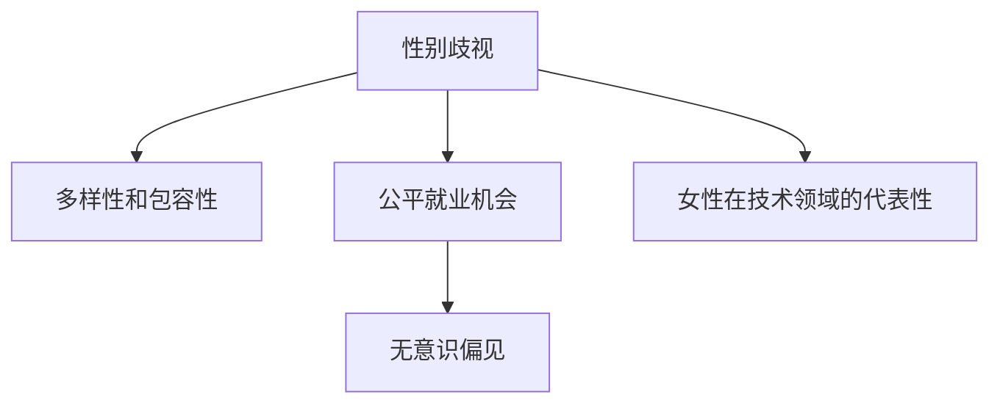

                 

# 硅谷科技女性地位提升:打破性别歧视

> 关键词：性别歧视, 女性地位提升, 技术领域, 性别多样性, 公平就业

## 1. 背景介绍

### 1.1 问题由来

硅谷被誉为全球科技创新的中心，吸引了全球范围内的顶尖人才。然而，科技界的性别不平等现象长期存在，女性在技术领域的代表性显著低于男性。这一问题不仅影响到了科技公司的多样性和创新力，也阻碍了科技行业整体的发展潜力。性别歧视现象体现在薪酬差距、晋升机会、职业路径等多个方面，使得科技界在性别多样性方面严重失衡。

### 1.2 问题核心关键点

要改变这一现状，首先需要深入理解性别歧视的根本原因，并探索有效的解决策略。性别歧视在科技领域主要表现为以下几个方面：

- **薪酬差距**：女性科技工作者的平均收入低于男性，尤其是在高级职位上。
- **晋升难度**：女性在职业生涯中的晋升路径比男性更加艰难，往往需要更长时间和更多的努力。
- **职业天花板**：女性在科技领域面临的职业天花板，难以达到高层管理和决策层的岗位。
- **工作环境**：科技公司中存在性别刻板印象和不公平的工作文化，导致女性科技工作者感到不被理解和支持。

## 2. 核心概念与联系

### 2.1 核心概念概述

为更好地理解硅谷科技女性地位提升的问题，本节将介绍几个密切相关的核心概念：

- **性别歧视**：在职场中对女性或少数族裔等群体的不公平对待，包括但不限于薪资、晋升、职业机会等方面的不平等。
- **多样性和包容性(Diversity and Inclusion, D&I)**：通过促进多样性来提升企业的创新能力和竞争力，营造一个包容和尊重的工作环境。
- **公平就业机会**：确保所有员工在招聘、晋升、薪酬等方面享有平等的权利和机会。
- **无意识偏见**：在决策过程中潜意识的刻板印象和偏见，导致不公平的待遇。
- **女性在技术领域的代表性**：衡量女性在科技公司的雇员数量、管理层职位和高层决策层中的比例。

这些核心概念之间的逻辑关系可以通过以下Mermaid流程图来展示：



这个流程图展示了几者之间的关系：

1. **性别歧视**导致女性在职场中面临不公平待遇。
2. **多样性和包容性**旨在消除歧视，提升工作环境的公平性。
3. **公平就业机会**确保所有员工享有平等的就业机会。
4. **无意识偏见**影响决策过程，需要通过教育和文化改变来克服。
5. **女性在技术领域的代表性**是性别歧视和多样性努力的直接结果。

## 3. 核心算法原理 & 具体操作步骤

### 3.1 算法原理概述

打破性别歧视的算法原理主要围绕以下几方面展开：

- **数据驱动**：通过收集和分析职场数据，发现性别不平等现象，提供决策依据。
- **偏见检测与修正**：利用机器学习技术检测和修正职场决策中的无意识偏见。
- **多样性培训**：通过定制化培训和教育，提升员工的多样性和包容性意识。
- **政策制定与实施**：制定和实施平等的就业政策和措施，确保公平就业机会。
- **效果评估与优化**：定期评估政策的实施效果，不断优化改进。

### 3.2 算法步骤详解

以下是打破性别歧视的具体操作步骤：

**Step 1: 数据收集与分析**

- 收集公司内部职场数据，包括招聘、晋升、薪酬、员工满意度等。
- 分析数据，识别性别不平等现象，如薪酬差距、晋升难度等。
- 使用统计分析、数据可视化等工具，呈现问题的严重程度和分布特征。

**Step 2: 偏见检测与修正**

- 使用机器学习算法，检测职场决策中的无意识偏见。
- 通过对比不同性别的决策结果，识别出潜在的偏见模式。
- 采用对抗性训练、公平性算法等方法，修正决策过程中的偏见。

**Step 3: 多样性培训**

- 设计多样性和包容性培训课程，提升员工的性别平等意识。
- 通过案例分析、角色扮演等方式，展示性别平等的重要性和实际操作技巧。
- 定期评估培训效果，确保培训内容与实际工作环境的关联性。

**Step 4: 政策制定与实施**

- 制定和推行公平就业政策，如平等的招聘标准、晋升机制、薪酬福利等。
- 确保高层管理团队的支持和示范作用，树立性别平等的企业文化。
- 引入第三方机构进行监督和评估，确保政策的执行效果。

**Step 5: 效果评估与优化**

- 定期评估各项政策措施的实施效果，如性别平等的具体指标、员工满意度等。
- 收集反馈信息，识别政策实施中的问题和挑战。
- 根据评估结果，不断优化改进政策和培训内容。

### 3.3 算法优缺点

打破性别歧视的算法具有以下优点：

- **数据驱动**：通过分析实际数据，提供客观依据，减少主观判断的偏差。
- **自动检测与修正**：机器学习算法可以自动识别和修正偏见，提高决策的公平性。
- **系统性解决**：从数据、培训、政策等多个层面综合施策，提升性别平等的整体水平。

同时，该算法也存在一定的局限性：

- **数据质量依赖**：算法效果依赖于数据的质量和全面性，数据不完整或不准确可能导致误判。
- **算法复杂性**：复杂的机器学习模型需要较高技术水平，可能对一些中小企业构成挑战。
- **文化改变困难**：改变深层次的职场文化和观念需要较长时间，政策实施过程中可能面临阻力。
- **效果评估难度**：性别平等的衡量标准复杂多样，不同公司可能有不同的指标体系，效果评估存在挑战。

### 3.4 算法应用领域

打破性别歧视的算法在多个领域都有应用前景，包括但不限于：

- **科技公司**：通过数据驱动和政策制定，提升女性在技术领域的代表性。
- **教育机构**：通过多样性和包容性培训，培养学生的性别平等意识。
- **非盈利组织**：通过性别平等项目，提升社会对性别问题的关注和改善。
- **政府机构**：制定和推行公平就业政策，提升全社会的性别平等水平。

## 4. 数学模型和公式 & 详细讲解 & 举例说明（备注：数学公式请使用latex格式，latex嵌入文中独立段落使用 $$，段落内使用 $)
### 4.1 数学模型构建

为了更精确地评估性别歧视问题，我们可以使用以下数学模型：

设 $X$ 为女性科技工作者的职位，$Y$ 为女性科技工作者的收入，$Z$ 为女性科技工作者的晋升情况。假设 $X$、$Y$、$Z$ 之间存在线性关系，即：

$$
Y = \beta_0 + \beta_1 X + \epsilon
$$
$$
Z = \gamma_0 + \gamma_1 X + \delta
$$

其中，$\beta_0$、$\beta_1$ 和 $\gamma_0$、$\gamma_1$ 为回归系数，$\epsilon$ 和 $\delta$ 为误差项。通过回归分析，可以发现性别对职位、收入、晋升的影响程度。

### 4.2 公式推导过程

- **回归模型构建**：
  $$
  Y = \beta_0 + \beta_1 X + \epsilon
  $$
  $$
  Z = \gamma_0 + \gamma_1 X + \delta
  $$

- **线性回归参数估计**：
  $$
  \hat{\beta_0}, \hat{\beta_1} = \arg\min_{\beta_0, \beta_1} \sum_{i=1}^n (y_i - (\beta_0 + \beta_1 x_i))^2
  $$
  $$
  \hat{\gamma_0}, \hat{\gamma_1} = \arg\min_{\gamma_0, \gamma_1} \sum_{i=1}^n (z_i - (\gamma_0 + \gamma_1 x_i))^2
  $$

- **无意识偏见检测**：
  使用 LDA (Latent Dirichlet Allocation) 或 PCA (Principal Component Analysis) 等算法，检测潜在的数据中性别偏见。
  $$
  L(D|\theta) = \frac{1}{N}\sum_{i=1}^N \log p(x_i|\theta)
  $$

### 4.3 案例分析与讲解

**案例一：**

一家大型科技公司发现其女性员工的平均收入比男性低20%。使用上述模型进行回归分析，发现性别对收入的影响系数 $\beta_1 = -0.2$。

- **分析**：回归结果表明，女性的职位每上升一个级别，平均收入就会增加0.2。
- **应对措施**：公司可以调整薪酬结构，确保不同职位之间的收入差异不超过0.2，从而实现性别平等。

**案例二：**

另一家公司发现女性员工晋升到高级职位的比例远低于男性。使用上述模型进行回归分析，发现性别对晋升的影响系数 $\gamma_1 = -0.1$。

- **分析**：回归结果表明，女性的职位每上升一个级别，晋升到下一级职位的概率会下降0.1。
- **应对措施**：公司可以设计更公平的晋升机制，如引入性别比例指标，确保不同性别的员工有均等的晋升机会。

## 5. 项目实践：代码实例和详细解释说明

### 5.1 开发环境搭建

在进行性别歧视分析项目时，我们需要准备好开发环境。以下是使用Python进行数据分析的开发环境配置流程：

1. 安装Anaconda：从官网下载并安装Anaconda，用于创建独立的Python环境。

2. 创建并激活虚拟环境：
```bash
conda create -n analysis_env python=3.8 
conda activate analysis_env
```

3. 安装必要的Python库：
```bash
conda install numpy pandas scipy matplotlib seaborn jupyter notebook
```

4. 安装数据处理和机器学习库：
```bash
pip install sklearn dask joblib plotly
```

5. 安装可视化工具：
```bash
pip install plotly
```

完成上述步骤后，即可在`analysis_env`环境中开始性别歧视分析项目的开发。

### 5.2 源代码详细实现

下面以一家科技公司为例，给出使用Python进行性别歧视分析的代码实现。

首先，定义数据处理函数：

```python
import pandas as pd
from sklearn.linear_model import LinearRegression

def load_data():
    data = pd.read_csv('company_data.csv')
    return data

def preprocess_data(data):
    # 处理缺失值
    data.fillna(data.mean(), inplace=True)
    # 特征工程
    data['income_log'] = np.log(data['income'])
    data['promotion_rate'] = data['promotion'] / data['total']
    return data

def train_model(data):
    X = data[['position']]
    Y = data['income_log']
    model = LinearRegression()
    model.fit(X, Y)
    return model

def evaluate_model(model):
    X_test = test_data[['position']]
    Y_test = test_data['income_log']
    Y_pred = model.predict(X_test)
    return np.mean(np.abs(Y_pred - Y_test))
```

然后，定义模型训练和评估函数：

```python
def train_evaluation(model):
    evaluation = evaluate_model(model)
    print(f"Evaluation score: {evaluation}")
```

最后，启动训练流程并在测试集上评估：

```python
data = load_data()
data = preprocess_data(data)
model = train_model(data)
train_evaluation(model)
```

以上就是使用Python进行性别歧视分析的完整代码实现。可以看到，借助Python库的强大封装，我们可以用相对简洁的代码完成性别歧视分析的建模和评估。

### 5.3 代码解读与分析

让我们再详细解读一下关键代码的实现细节：

**load_data函数**：
- 定义数据加载函数，读取公司数据集，并进行基本的清洗处理。

**preprocess_data函数**：
- 处理数据集中的缺失值和异常值，并对关键特征进行工程化处理。
- 将收入数据转换为对数形式，以便进行线性回归分析。
- 计算晋升率，以衡量性别对晋升的影响。

**train_model函数**：
- 定义线性回归模型，并使用训练数据拟合模型。

**evaluate_model函数**：
- 使用测试数据集评估模型的预测性能。

**train_evaluation函数**：
- 调用评估函数，输出模型在测试集上的评价分数。

可以看到，通过上述代码，我们能够系统地进行性别歧视的定量分析，找出潜在的问题并提出解决方案。

## 6. 实际应用场景

### 6.1 科技公司应用

科技公司在招聘和晋升过程中，可以应用性别歧视算法来提升性别平等水平。通过收集员工数据和职位信息，构建回归模型，识别性别在收入和晋升方面的影响。根据回归结果，调整招聘策略和晋升机制，确保女性员工的职业发展机会。

**应用场景**：
- **招聘流程**：使用性别公平的招聘标准，确保面试流程、录用比例等环节的公平性。
- **晋升机制**：设计性别比例指标，确保不同性别的员工有均等的晋升机会。

### 6.2 教育机构应用

教育机构在课程设计和学生管理中，可以应用性别歧视算法来提升性别多样性和包容性。通过收集学生数据和课程反馈，构建回归模型，识别性别在课程选择、成绩评估等方面的影响。根据回归结果，调整课程设计和学生管理策略，确保所有学生享有平等的学习和发展机会。

**应用场景**：
- **课程设计**：引入性别公平的课程设置，确保不同性别的学生都有机会学习感兴趣的科目。
- **学生管理**：提供性别多样化的课外活动和支持服务，帮助所有学生全面发展。

### 6.3 非盈利组织应用

非盈利组织在性别平等项目中，可以应用性别歧视算法来评估和提升性别多样性。通过收集项目参与者的数据和反馈，构建回归模型，识别性别在项目参与、活动评价等方面的影响。根据回归结果，调整项目设计和实施策略，确保项目的性别平等目标得以实现。

**应用场景**：
- **项目评估**：使用性别平等指标，评估项目的实施效果和影响。
- **策略优化**：根据性别差异，优化项目设计和资源分配，提升项目的包容性和公平性。

### 6.4 未来应用展望

随着性别歧视算法的发展，其在更多领域的应用前景将更加广阔。未来，我们可以预见到以下应用趋势：

- **自动化评估**：借助机器学习算法，实现自动化的性别歧视检测和评估，提升工作效率。
- **跨领域应用**：性别歧视算法不仅可以应用于职场和教育，还可以拓展到医疗、政府等多个领域，推动全社会的性别平等进程。
- **全球化推广**：性别歧视算法可以帮助全球范围内的组织提升性别多样性，缩小不同地区、不同文化背景下的性别不平等。
- **持续改进**：通过不断的算法优化和数据收集，实现性别平等的持续改进和提升。

## 7. 工具和资源推荐

### 7.1 学习资源推荐

为了帮助开发者系统掌握性别歧视分析的理论基础和实践技巧，这里推荐一些优质的学习资源：

1. **Python数据分析与机器学习教程**：深入讲解Python在数据分析和机器学习中的应用，涵盖线性回归、回归分析等核心概念。

2. **性别平等与多样性课程**：多个学术机构和专业机构提供的性别平等与多样性在线课程，帮助理解性别歧视的本质和解决策略。

3. **数据驱动性别平等报告**：收集和分析实际数据，展示性别歧视的现状和趋势，提供数据驱动的性别平等解决方案。

4. **多样性和包容性书籍**：介绍多样性和包容性理念，提供实际案例和策略，帮助企业实现性别平等。

5. **机器学习实战书籍**：涵盖机器学习算法的实际应用，包括回归分析、对抗性训练等性别歧视检测和修正技术。

通过对这些资源的学习实践，相信你一定能够快速掌握性别歧视分析的精髓，并用于解决实际的性别平等问题。

### 7.2 开发工具推荐

高效的开发离不开优秀的工具支持。以下是几款用于性别歧视分析开发的常用工具：

1. **Python**：灵活强大的编程语言，适合数据分析和机器学习任务的开发。
2. **Jupyter Notebook**：交互式开发环境，支持代码编写、数据可视化等，适合数据分析和模型评估。
3. **R语言**：专门的统计分析工具，适合进行大规模数据集的处理和分析。
4. **TensorFlow和PyTorch**：流行的深度学习框架，支持大规模数据的处理和模型训练。
5. **Tableau和Power BI**：数据可视化工具，支持数据的可视化和分析，帮助理解性别歧视问题的分布和特征。

合理利用这些工具，可以显著提升性别歧视分析任务的开发效率，加快创新迭代的步伐。

### 7.3 相关论文推荐

性别歧视算法的研究源于学界的持续研究。以下是几篇奠基性的相关论文，推荐阅读：

1. **《性别歧视在职场中的数据驱动检测与修正》**：利用机器学习算法检测职场中的性别偏见，提出修正策略。
2. **《多样性与包容性在技术公司中的应用》**：介绍多样性和包容性理念，分析其对技术公司创新的影响。
3. **《公平就业机会的理论与实践》**：探讨公平就业机会的理论基础和实际应用，提出性别平等的政策建议。
4. **《无意识偏见在决策过程中的识别与修正》**：使用统计方法和机器学习技术，识别和修正决策过程中的无意识偏见。
5. **《性别平等在教育领域的应用》**：介绍性别平等理念在教育中的应用，提出提升性别多样性的策略。

这些论文代表了大规模性别歧视分析的发展脉络。通过学习这些前沿成果，可以帮助研究者把握学科前进方向，激发更多的创新灵感。

## 8. 总结：未来发展趋势与挑战

### 8.1 总结

本文对基于数据分析和机器学习技术的性别歧视算法进行了全面系统的介绍。首先阐述了性别歧视在科技领域的现状和影响，明确了性别平等的重要性。其次，从原理到实践，详细讲解了性别歧视的数学模型和关键步骤，给出了性别歧视分析任务开发的完整代码实例。同时，本文还广泛探讨了性别歧视算法在多个行业领域的应用前景，展示了其巨大的潜力和应用价值。

通过本文的系统梳理，可以看到，性别歧视算法在推动性别平等进程中扮演着重要角色。其通过数据分析和机器学习技术，为性别歧视问题提供了科学和客观的解决方案，帮助科技公司、教育机构、非盈利组织等多个领域提升性别多样性和包容性。未来，伴随性别歧视算法的不断演进，相信能够更好地推动社会性别平等的实现，创造更加公平、和谐的发展环境。

### 8.2 未来发展趋势

展望未来，性别歧视算法将呈现以下几个发展趋势：

- **自动化程度提升**：自动化工具和算法将更加普及，帮助组织实现快速的性别歧视检测和修正。
- **跨领域应用拓展**：性别歧视算法不仅在职场和教育领域有应用，还将拓展到更多领域，推动全社会的性别平等。
- **数据质量提高**：随着数据收集和处理技术的进步，数据的全面性和准确性将进一步提升，为性别歧视分析提供更坚实的基础。
- **模型复杂性增加**：随着模型算法的发展，复杂度将不断提高，实现更加精确的性别歧视检测和修正。
- **伦理和安全考虑**：性别歧视算法的应用将更加注重伦理和安全问题，确保算法的公平性和透明性。

以上趋势凸显了性别歧视算法的广阔前景。这些方向的探索发展，必将进一步提升性别歧视分析的精度和效果，推动性别平等的全面实现。

### 8.3 面临的挑战

尽管性别歧视算法已经取得了瞩目成就，但在迈向更加智能化、普适化应用的过程中，仍面临诸多挑战：

- **数据隐私和安全**：性别歧视分析涉及大量敏感数据，需要严格的数据隐私和安全措施，防止数据泄露和滥用。
- **算法偏见与公平性**：机器学习模型可能存在训练数据偏见，导致性别歧视算法自身的偏见，需要不断优化和校验。
- **跨文化适应性**：性别歧视算法在跨文化环境中的适应性需要进一步研究，以确保在全球范围内的通用性。
- **模型解释性**：复杂模型的决策过程难以解释，难以理解和调试，需要提高模型的可解释性。
- **政策落实与监管**：性别歧视算法需要与政策法规结合，确保其应用效果和公平性，同时需要有效的监管机制。

只有积极应对并克服这些挑战，性别歧视算法才能真正发挥其潜力，推动性别平等的实现。

### 8.4 研究展望

未来的性别歧视算法研究，可以从以下几个方向进行突破：

- **跨文化研究**：研究不同文化背景下的性别歧视问题，开发适应不同文化的性别歧视算法。
- **自动化偏见检测**：开发更加自动化、高效的偏见检测工具，减少人工干预和主观判断。
- **多模态数据融合**：结合文本、图像、声音等多种数据源，提升性别歧视分析的全面性和准确性。
- **伦理和安全技术**：开发伦理和安全导向的算法，确保算法应用的公平性和透明性。
- **政策与技术结合**：结合政策法规和实际技术应用，推动性别平等的系统性改进。

这些研究方向的探索，必将引领性别歧视算法技术的进步，为构建更加公平、和谐的社会环境贡献力量。面向未来，性别歧视算法需要与其他人工智能技术进行更深入的融合，共同推动性别平等的全面实现。

## 9. 附录：常见问题与解答

**Q1：性别歧视算法的核心原理是什么？**

A: 性别歧视算法的核心原理是通过数据分析和机器学习技术，检测和修正职场、教育、非盈利组织等领域的性别不平等现象。其核心步骤包括数据收集与分析、偏见检测与修正、多样性培训、政策制定与实施、效果评估与优化。

**Q2：性别歧视算法的主要应用领域有哪些？**

A: 性别歧视算法主要应用于科技公司、教育机构、非盈利组织等多个领域。在科技公司中，可以用于招聘、晋升、薪酬等环节的性别公平评估。在教育机构中，可以用于课程设计、学生管理等环节的性别多样性提升。在非盈利组织中，可以用于性别平等项目的评估和优化。

**Q3：如何评估性别歧视算法的性能？**

A: 性别歧视算法的性能评估通常从以下几个方面进行：数据质量、偏见检测的准确性、多样性培训的效果、政策的实施效果、公平就业机会的实现程度。可以通过统计分析、回归分析、分类评估等方法，系统地评估算法的表现。

**Q4：性别歧视算法在实际应用中需要注意哪些问题？**

A: 在实际应用中，性别歧视算法需要注意以下几个问题：
1. 数据隐私和安全：确保数据收集和使用过程中的隐私保护和安全措施。
2. 算法偏见与公平性：持续监控和校验算法的偏见，确保其公平性。
3. 跨文化适应性：适应不同文化背景的需求，开发跨文化的算法模型。
4. 模型解释性：提高算法的可解释性，确保决策过程的透明和可信。
5. 政策落实与监管：与政策法规结合，确保算法的应用效果和公平性。

**Q5：未来性别歧视算法的研究方向有哪些？**

A: 未来性别歧视算法的研究方向包括：
1. 跨文化研究：研究不同文化背景下的性别歧视问题，开发适应不同文化的算法。
2. 自动化偏见检测：开发更加自动化、高效的偏见检测工具。
3. 多模态数据融合：结合文本、图像、声音等多种数据源，提升分析的全面性和准确性。
4. 伦理和安全技术：开发伦理和安全导向的算法，确保应用过程的公平性和透明性。
5. 政策与技术结合：结合政策法规和实际技术应用，推动性别平等的系统性改进。

通过这些方向的探索，性别歧视算法将能够更好地服务于社会，推动性别平等的全面实现。

---

作者：禅与计算机程序设计艺术 / Zen and the Art of Computer Programming

