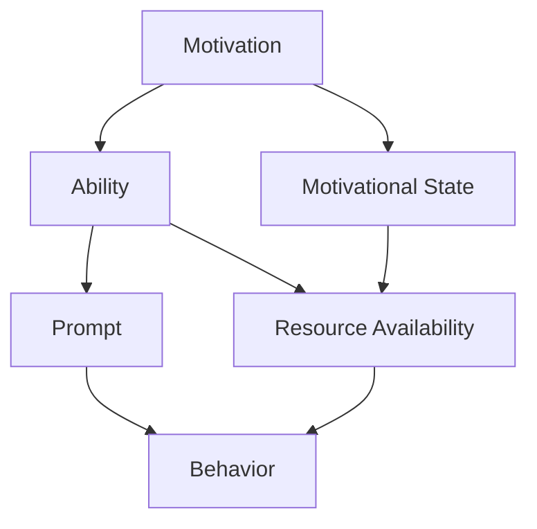

                 

# 福格模型在管理习惯养成中的应用

> 关键词：行为改变,决策,动机,行为动机模型,习惯形成,行为科学

## 1. 背景介绍

在现代社会，行为改变和习惯养成对于个人发展和企业效率都至关重要。然而，许多人发现，即便知道某种行为对他们有益，也很难坚持。这背后，既有心理因素，也有环境因素。为了更好地理解和管理行为，行为科学领域开发了多种模型和方法。其中之一，就是福格模型（Fog of Concepts），这是一个简明且有效的行为动机模型，能够帮助人们更好地理解和预测行为改变过程。本文将详细探讨福格模型的原理、操作步骤以及其在管理习惯养成中的应用。

## 2. 核心概念与联系

### 2.1 核心概念概述

福格模型由行为科学家本杰明·富格（B.J. Fogg）提出，旨在帮助我们理解行为改变背后的三个关键因素：动机（Motivation）、能力（Ability）和提示（Prompts）。

- **动机（Motivation）**：指的是个体为何愿意去做某件事。它可以是内在的（如对健康、幸福或成功的渴望），也可以是外在的（如外部奖励或惩罚）。

- **能力（Ability）**：指的是完成某件事所需的资源。这包括时间、金钱、信息、技能等。

- **提示（Prompts）**：指的是能够触发某个行为的线索或信号。

这些因素之间相互作用，决定了行为是否会发生。福格模型提供了一种系统的方法，帮助我们设计有效的行为干预措施，以促进或抑制特定行为。

### 2.2 核心概念原理和架构的 Mermaid 流程图



在上述模型中，动机状态（Motivational State）和资源可用性（Resource Availability）共同决定了行为能力（Ability）。而提示（Prompt）则可以直接触发行为（Behavior）。

## 3. 核心算法原理 & 具体操作步骤

### 3.1 算法原理概述

福格模型基于以下假设：
1. **行为改变受动机和能力的影响**。
2. **动机和能力可以相互转化**。
3. **合适的提示可以极大地提升行为发生的可能性**。

通过分析这三个因素，我们可以设计出更有效的行为干预策略。

### 3.2 算法步骤详解

1. **评估动机**：首先，确定个体对特定行为的动机水平。这可以通过自我反思、问卷调查或与个体的对话来完成。了解动机的强度和类型对于设计干预措施至关重要。

2. **评估能力**：分析个体完成特定行为所需的能力。这包括物理能力、认知能力和情感能力。评估能力的目的是找出提升或降低行为发生的潜在途径。

3. **设计提示**：根据个体的动机和能力，设计能够触发目标行为的提示。提示应该既具体又易于实施，以确保能够显著提升行为发生率。

4. **实施干预**：将设计的提示应用到实际情境中，并观察其效果。根据反馈调整提示设计，以最大化行为改变的效果。

### 3.3 算法优缺点

**优点**：
- **简单直观**：福格模型的原理易于理解，可以迅速应用于各种情境。
- **灵活性高**：模型允许根据个体的特定需求定制干预措施。
- **广泛适用**：适用于个人习惯养成、企业管理、健康改善等多个领域。

**缺点**：
- **复杂性高**：对于某些复杂行为，可能需要深入了解个体动机和能力的各个方面。
- **效果因人而异**：尽管模型设计灵活，但不同个体的响应可能存在显著差异。
- **需要持续监控**：为了确保干预措施的有效性，需要持续监控和评估。

### 3.4 算法应用领域

福格模型可以应用于多种场景，包括但不限于：

- **个人习惯养成**：帮助个人建立锻炼、阅读、健康饮食等好习惯。
- **企业管理**：促进员工遵守安全规程、提高团队合作效率。
- **健康改善**：鼓励患者按时服药、定期锻炼。
- **环境保护**：鼓励公众减少塑料使用、节约能源。

## 4. 数学模型和公式 & 详细讲解 & 举例说明

### 4.1 数学模型构建

福格模型虽然不涉及复杂的数学公式，但其核心原理可以通过数学语言进行描述。我们将其简化为以下几个关键变量：

- **动机（M）**：动机强度，取值范围为0到1。
- **能力（A）**：能力水平，取值范围为0到1。
- **提示（P）**：提示强度，取值范围为0到1。
- **行为（B）**：行为发生概率，计算公式为 $B = M \times A \times P$。

### 4.2 公式推导过程

根据福格模型，行为发生概率（B）由动机（M）、能力（A）和提示（P）的乘积决定。这一公式直观地展示了三个因素对行为的影响。

### 4.3 案例分析与讲解

假设我们想要提高个人每天锻炼的概率。根据福格模型，我们可以：

- **评估动机**：了解个体为何愿意锻炼，以及动机的强度。
- **评估能力**：分析个体完成锻炼所需的时间、地点、设备等资源。
- **设计提示**：设计易于实施的提示，如早晨起床时看到健身装备，或在锻炼区域放置鼓励标语。

## 5. 项目实践：代码实例和详细解释说明

### 5.1 开发环境搭建

本节将介绍使用Python开发福格模型应用的基本环境配置。

1. **安装Python**：确保系统安装了Python 3.x版本。
2. **安装相关库**：安装Pandas、NumPy、Matplotlib等常用库，用于数据处理和可视化。
3. **创建Python项目目录**：`mkdir fog_model_project`。
4. **初始化项目环境**：`cd fog_model_project`，`pip install requirements.txt`。

### 5.2 源代码详细实现

以下是一个简单的Python代码示例，展示了如何根据福格模型计算行为发生概率，并可视化结果。

```python
import numpy as np
import matplotlib.pyplot as plt

# 设定动机、能力和提示的取值范围
M_range = np.linspace(0, 1, 100)
A_range = np.linspace(0, 1, 100)
P_range = np.linspace(0, 1, 100)

# 计算行为发生概率
B_range = M_range[:, None] * A_range[None, :] * P_range[None, :]
B_range = np.max(B_range, axis=0)

# 绘制行为发生概率的3D图
fig = plt.figure()
ax = fig.add_subplot(111, projection='3d')
ax.plot_surface(M_range, A_range, B_range, cmap='viridis')
ax.set_xlabel('动机（M）')
ax.set_ylabel('能力（A）')
ax.set_zlabel('行为发生概率（B）')
plt.show()
```

### 5.3 代码解读与分析

上述代码使用NumPy和Matplotlib库，计算并绘制了动机、能力和行为发生概率之间的关系。通过观察3D图，可以直观地理解动机和能力对行为发生概率的影响。

### 5.4 运行结果展示

运行上述代码后，将得到一个3D图，显示了动机（M）、能力（A）和行为发生概率（B）之间的关系。从图中可以看出，当动机和能力都高时，行为发生概率也最高。

## 6. 实际应用场景

### 6.1 个人习惯养成

对于希望养成好习惯的个人，福格模型可以提供以下指导：

- **评估动机**：了解自己为何想要养成特定习惯，如健康饮食、定期锻炼等。
- **评估能力**：分析完成习惯所需的时间、资源和环境支持。
- **设计提示**：设计易于实施的提示，如设定闹钟提醒、在冰箱中放置健康零食等。

### 6.2 企业管理

对于希望提高员工工作效率的管理者，福格模型可以提供以下指导：

- **评估动机**：了解员工对公司目标的认同度，以及激励措施的有效性。
- **评估能力**：分析员工完成任务所需的资源和时间。
- **设计提示**：设计易于实施的提示，如设立目标奖励机制、优化工作流程等。

### 6.3 健康改善

对于希望改善自身健康的患者，福格模型可以提供以下指导：

- **评估动机**：了解自己为何想要改善健康，如减少压力、改善睡眠等。
- **评估能力**：分析改善健康所需的时间、资源和环境支持。
- **设计提示**：设计易于实施的提示，如设定健康目标、使用健康应用提醒等。

## 7. 工具和资源推荐

### 7.1 学习资源推荐

- **《行为设计学》**：作者B.J. Fogg，详细介绍了福格模型及其应用。
- **Coursera行为科学课程**：涵盖行为改变和习惯养成等多方面的知识。
- **《自控力》**：作者凯利·麦格尼格尔，探讨了自我控制和行为改变的心理机制。

### 7.2 开发工具推荐

- **Jupyter Notebook**：用于编写和运行Python代码，支持可视化展示。
- **TensorBoard**：用于可视化模型训练过程，监控和调试模型。
- **SciPy**：用于科学计算和数据处理。

### 7.3 相关论文推荐

- **《理解人类行为：理论、方法和应用》**：作者B.J. Fogg，系统介绍了行为科学的基本理论和应用。
- **《行为干预策略》**：作者Philip E. Smith，探讨了多种行为干预策略及其效果。
- **《基于福格模型的行为改变研究》**：作者T. Kanai等，通过实验验证了福格模型的有效性。

## 8. 总结：未来发展趋势与挑战

### 8.1 研究成果总结

福格模型提供了一种简单而有效的行为动机分析框架，帮助个人和企业更好地理解和管理行为。通过评估动机、能力和提示，福格模型能够设计出更加个性化和高效的干预措施。

### 8.2 未来发展趋势

未来，福格模型在以下几个方面有进一步发展的趋势：

- **技术融合**：福格模型与人工智能、大数据等技术的结合，将提高行为干预的个性化和精准度。
- **跨领域应用**：福格模型在医疗、教育、城市规划等更多领域的应用，将进一步扩展其影响力。
- **持续优化**：基于新的研究成果和实际反馈，不断优化模型和干预措施。

### 8.3 面临的挑战

尽管福格模型具有广泛的应用前景，但也面临以下挑战：

- **数据隐私**：在收集和分析行为数据时，需要确保数据隐私和信息安全。
- **适应性问题**：不同情境下，模型的干预措施可能需要进行调整和优化。
- **动机评估困难**：准确评估个体动机水平可能存在较大难度。

### 8.4 研究展望

未来的研究可以在以下几个方向进行探索：

- **跨文化应用**：研究不同文化背景下的行为动机模型，提升模型的普适性。
- **动态调整**：开发能够根据个体反馈动态调整干预措施的系统。
- **情感因素**：研究情感因素对行为改变的影响，优化模型的情感模型。

通过不断探索和创新，福格模型将在行为科学和管理学领域发挥更大的作用，帮助人们更好地理解和塑造行为，实现个人和组织的持续发展。

## 9. 附录：常见问题与解答

**Q1：福格模型的核心思想是什么？**

A: 福格模型的核心思想是行为改变受动机、能力和提示三个因素的影响。这三个因素相互作用，决定了行为是否发生。

**Q2：如何设计有效的提示？**

A: 有效的提示应该具有以下特点：
- **具体且易于执行**：提示应清晰明确，易于实施。
- **与动机和能力匹配**：提示应与个体的动机和能力水平相匹配，以最大化行为发生概率。
- **高频且及时**：提示应高频且及时出现，以提高行为发生的可能性。

**Q3：如何评估个体的动机和能力？**

A: 评估动机和能力可以通过以下方式：
- **问卷调查**：使用问卷调查了解个体的动机和能力水平。
- **行为观察**：观察个体在特定情境下的行为表现，评估其动机和能力。
- **个体访谈**：与个体进行深入访谈，了解其动机和能力水平。

通过系统地评估动机和能力，可以更好地设计有效的行为干预措施。

---

作者：禅与计算机程序设计艺术 / Zen and the Art of Computer Programming

