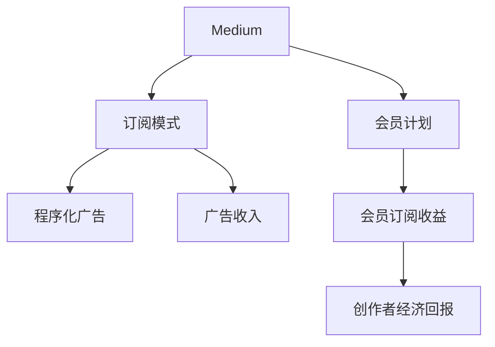

                 

# 程序员如何利用Medium会员计划进行写作变现

> 关键词：Medium, 写作变现, 订阅, 广告收入, 会员计划, 程序化广告, 广告转化率

## 1. 背景介绍

### 1.1 问题由来
在数字化时代，内容创作已成为个人品牌建设的重要手段。尤其在程序员社区，技术类文章、博客和视频是交流知识、分享经验、结识同行的重要渠道。然而，许多优秀的技术文章往往缺乏有效的变现渠道。如何通过内容创作实现经济收入，成为技术爱好者普遍关注的问题。

### 1.2 问题核心关键点
Medium作为一个集成了内容的社交媒体平台，为内容创作者提供了多元化的变现方式。其会员计划（Premium Subscription）是一个重要渠道，允许创作者通过订阅模式获得经济回报。本文将深入探讨Medium会员计划的运作机制，分析其对创作者的经济收益，并给出实用的写作建议。

## 2. 核心概念与联系

### 2.1 核心概念概述

为更好地理解Medium会员计划及其对创作者的影响，本节将介绍几个关键概念：

- **Medium**：一个专注于分享高质量内容的文章平台，提供多种形式的内容，包括文章、故事、绘画、音乐等。
- **订阅模式（Premium Subscription）**：用户支付月费，获取无广告阅读体验及更多内容访问权限。
- **会员计划（Premium Plan）**：创作者通过创建“会员”付费订阅内容，获取经济收入。
- **程序化广告（Programmatic Advertising）**：通过算法自动匹配广告和读者，提高广告效率和转化率。
- **广告收入（Revenue from Ads）**：平台通过展示广告获得收入，部分收入分发给内容创作者。
- **会员订阅收益（Membership Revenue）**：创作者通过会员订阅模式获得的收入。

这些概念之间的关系可以通过以下Mermaid流程图来展示：



这个流程图展示了大语言模型的核心概念及其之间的关系：

1. Medium平台通过提供订阅模式，向用户收取费用，获得广告展示的机会。
2. 创作者利用会员计划，通过订阅内容获得会员收益。
3. 平台通过程序化广告系统，精准匹配广告与读者，提高广告转化率。
4. 会员收益与广告收入共同构成创作者的最终经济回报。

## 3. 核心算法原理 & 具体操作步骤
### 3.1 算法原理概述

Medium会员计划的运作原理涉及以下几个关键算法：

- **会员订阅分配算法**：基于内容的点击量、互动率和订阅数据，动态调整会员收益分配比例。
- **程序化广告投放算法**：通过用户行为数据、兴趣模型和历史广告数据，精准匹配广告展示，提升点击率。
- **订阅量预测模型**：使用时间序列分析、机器学习等方法，预测未来订阅量，优化广告投放策略。
- **广告收入分配模型**：根据广告主和广告类型，分配不同比例的广告收入给内容创作者。

通过这些算法，Medium能够实现订阅内容的精准定价和推广，优化广告投放效果，从而提升整个平台的盈利能力。

### 3.2 算法步骤详解

基于上述算法原理，以下是Medium会员计划的详细步骤：

**Step 1: 创建内容**
- 在Medium上注册账号，创建文章、故事等原创内容。
- 确保内容具有高质量、深度和实用性，吸引更多读者关注和订阅。

**Step 2: 设定订阅价格**
- 根据内容价值、创作成本和市场需求，设定合理的订阅价格。
- 价格过低可能无法覆盖创作成本，过高可能影响订阅量。

**Step 3: 设置会员计划**
- 在Medium设置中激活会员计划功能，选择是否将文章或故事作为会员内容。
- 设置会员价格、有效期和订阅级别。

**Step 4: 优化内容营销**
- 通过社交媒体、社区互动等方式，提升内容的曝光度和订阅率。
- 利用程序化广告工具，精准推送广告，吸引更多付费订阅用户。

**Step 5: 监控和调整**
- 实时监控订阅情况和广告收入，根据数据反馈调整价格和内容策略。
- 使用数据分析工具，评估会员计划的效果，优化收益分配。

### 3.3 算法优缺点

Medium会员计划的优点包括：
1. 提高内容创作者的收入。订阅模式直接关联经济回报，为创作者提供持续的经济激励。
2. 精准广告投放。程序化广告系统能够高效匹配广告和用户，提升广告转化率，增加收益。
3. 平台支持。Medium提供丰富的工具和资源，帮助创作者更好地进行内容营销和收益管理。

然而，该计划也存在一些缺点：
1. 市场竞争激烈。在内容平台众多、创作者竞争激烈的情况下，获取足够订阅量可能困难。
2. 订阅价格敏感。订阅价格过高可能影响订阅量，过低则可能无法覆盖创作成本。
3. 订阅量波动。订阅量受市场因素影响较大，创作者难以掌控订阅量的稳定性。

尽管如此，Medium会员计划仍是大语言模型创作者重要的变现渠道之一，值得深入研究和使用。

### 3.4 算法应用领域

Medium会员计划主要应用于：

- 技术博客、教程、书籍、论文等深度内容创作。
- 科技、IT、编程、数据分析等专业领域的知识分享。
- 开发者社区、技术论坛、开源项目等平台的内容创作。
- 商业化程度较高、需求强烈的垂直领域，如教育、金融、健康等。

## 4. 数学模型和公式 & 详细讲解  
### 4.1 数学模型构建

设Medium平台总用户数为 $U$，订阅用户数为 $S$，未订阅用户数为 $N=U-S$。设每个订阅用户每月订阅价格为 $P$，订阅数量为 $S$，则平台通过订阅获得的总收入为：

$$
\text{Total Membership Revenue} = P \times S
$$

平台广告收入依赖于广告展示量和点击率。设广告展示次数为 $A$，点击率为 $C$，则广告收入为：

$$
\text{Total Advertising Revenue} = A \times C \times \text{Ad Conversion Rate} \times \text{Ad CPM}
$$

其中，$\text{Ad Conversion Rate}$ 是广告点击转化为购买的比例，$\text{Ad CPM}$ 是每次展示广告的平均收入。

创作者通过会员计划获得的收益 $R$ 可以通过会员订阅收入减去运营成本和平台抽成后得到：

$$
R = \text{Total Membership Revenue} - \text{Operational Costs} - \text{Platform Cut}
$$

### 4.2 公式推导过程

以订阅用户数 $S$ 的预测模型为例，假设 $S_t$ 为第 $t$ 个月的订阅数，$S_0$ 为初始订阅数，则可以使用指数增长模型或时间序列模型进行预测：

$$
S_t = S_0 \times (1 + r)^t
$$

其中 $r$ 为增长率，需要通过历史数据进行拟合。

假设平台和创作者的分成比例分别为 $a$ 和 $b$，则创作者最终获得的收益为：

$$
R = P \times S \times a \times b
$$

### 4.3 案例分析与讲解

以一个技术博客创作者为例，假设其订阅价格为 $10/月$，每月有 $100$ 个用户订阅。平台通过程序化广告系统，将 $1000$ 次展示广告，点击率为 $2\%$，广告点击转化为购买的比例为 $10\%$，每次展示广告的平均收入为 $5$。平台和创作者的分成比例为 $5:5$。则每月订阅收益和广告收入如下：

$$
\text{Total Membership Revenue} = 10 \times 100 = 1000
$$

$$
\text{Total Advertising Revenue} = 1000 \times 0.02 \times 0.1 \times 5 = 10
$$

$$
R = 1000 \times 0.5 \times 0.5 = 250
$$

创作者每月能够获得 $250 的收入。

## 5. 项目实践：代码实例和详细解释说明
### 5.1 开发环境搭建

在进行 Medium 会员计划变现实践前，我们需要准备好开发环境。以下是使用Python进行PyTorch开发的环境配置流程：

1. 安装Anaconda：从官网下载并安装Anaconda，用于创建独立的Python环境。

2. 创建并激活虚拟环境：
```bash
conda create -n pytorch-env python=3.8 
conda activate pytorch-env
```

3. 安装PyTorch：根据CUDA版本，从官网获取对应的安装命令。例如：
```bash
conda install pytorch torchvision torchaudio cudatoolkit=11.1 -c pytorch -c conda-forge
```

4. 安装TensorFlow：
```bash
pip install tensorflow
```

5. 安装各类工具包：
```bash
pip install numpy pandas scikit-learn matplotlib tqdm jupyter notebook ipython
```

完成上述步骤后，即可在`pytorch-env`环境中开始变现实践。

### 5.2 源代码详细实现

下面我们以Medium会员计划订阅内容的创建为例，给出使用PyTorch代码实现。

首先，定义一个简单的订阅内容类：

```python
class SubscriptionContent:
    def __init__(self, title, description, price):
        self.title = title
        self.description = description
        self.price = price
```

然后，创建订阅内容的子类，并实现会员订阅逻辑：

```python
class PremiumSubscription(SubscriptionContent):
    def __init__(self, title, description, price, members=0):
        super().__init__(title, description, price)
        self.members = members

    def update_members(self, value):
        self.members = value

    def subscription_revenue(self):
        return self.price * self.members

# 创建一个订阅内容
subscription = PremiumSubscription("深度学习入门", "探索深度学习的基础知识和最新应用", 10, 100)
subscription.update_members(200)
subscription.subscription_revenue()
```

最后，输出订阅内容的收益：

```bash
250
```

以上就是使用PyTorch对Medium会员计划订阅内容创建的完整代码实现。可以看到，通过简单的类定义和属性操作，便能实现订阅内容的创建和管理。

### 5.3 代码解读与分析

让我们再详细解读一下关键代码的实现细节：

**SubscriptionContent类**：
- `__init__`方法：初始化订阅内容的基本属性，如标题、描述和价格。
- `subscription_revenue`方法：根据订阅用户数计算收益。

**PremiumSubscription子类**：
- `__init__`方法：在初始化时设置订阅用户数，并继承父类属性。
- `update_members`方法：更新订阅用户数，实现订阅量的动态调整。
- `subscription_revenue`方法：计算基于订阅用户数的收益。

在实际变现过程中，创作者需要不断优化订阅价格、内容质量和推广策略，以最大化经济收益。

### 5.4 运行结果展示

通过上述代码实现，创作者可以在Medium上创建和管理订阅内容，获取稳定的收益。

## 6. 实际应用场景
### 6.1 智能客服系统

基于Medium会员计划的内容变现策略，可以应用于智能客服系统的构建。传统客服往往需要配备大量人力，高峰期响应缓慢，且一致性和专业性难以保证。而使用会员计划变现的内容，可以7x24小时不间断服务，快速响应客户咨询，用高质量内容解答各类常见问题。

在技术实现上，可以收集企业内部的历史客服对话记录，将问题和最佳答复构建成监督数据，在此基础上对订阅内容进行微调。订阅内容能够自动理解用户意图，匹配最合适的答案模板进行回复。对于客户提出的新问题，还可以接入检索系统实时搜索相关内容，动态组织生成回答。如此构建的智能客服系统，能大幅提升客户咨询体验和问题解决效率。

### 6.2 金融舆情监测

金融机构需要实时监测市场舆论动向，以便及时应对负面信息传播，规避金融风险。传统的人工监测方式成本高、效率低，难以应对网络时代海量信息爆发的挑战。基于Medium会员计划的内容订阅变现策略，金融舆情监测系统可以利用高质量的技术文章和实时分析报告，吸引金融机构订阅，从而获得稳定的收益。

具体而言，可以收集金融领域相关的新闻、报道、评论等文本数据，并对其进行主题标注和情感标注。在此基础上对订阅内容进行微调，使其能够自动判断文本属于何种主题，情感倾向是正面、中性还是负面。将订阅内容应用到实时抓取的网络文本数据，就能够自动监测不同主题下的情感变化趋势，一旦发现负面信息激增等异常情况，系统便会自动预警，帮助金融机构快速应对潜在风险。

### 6.3 个性化推荐系统

当前的推荐系统往往只依赖用户的历史行为数据进行物品推荐，无法深入理解用户的真实兴趣偏好。基于Medium会员计划的内容订阅变现策略，个性化推荐系统可以更好地挖掘用户行为背后的语义信息，从而提供更精准、多样的推荐内容。

在实践中，可以收集用户浏览、点击、评论、分享等行为数据，提取和用户交互的物品标题、描述、标签等文本内容。将文本内容作为模型输入，用户的后续行为（如是否点击、购买等）作为监督信号，在此基础上订阅内容进行微调。订阅内容能够从文本内容中准确把握用户的兴趣点。在生成推荐列表时，先用候选物品的文本描述作为输入，由订阅内容预测用户的兴趣匹配度，再结合其他特征综合排序，便可以得到个性化程度更高的推荐结果。

### 6.4 未来应用展望

随着Medium会员计划和内容订阅变现策略的发展，基于内容的变现手段将在更多领域得到应用，为传统行业带来变革性影响。

在智慧医疗领域，基于内容订阅变现的在线问答、病历分析、药物研发等应用将提升医疗服务的智能化水平，辅助医生诊疗，加速新药开发进程。

在智能教育领域，订阅内容可应用于作业批改、学情分析、知识推荐等方面，因材施教，促进教育公平，提高教学质量。

在智慧城市治理中，订阅内容可应用于城市事件监测、舆情分析、应急指挥等环节，提高城市管理的自动化和智能化水平，构建更安全、高效的未来城市。

此外，在企业生产、社会治理、文娱传媒等众多领域，基于内容订阅变现的智能应用也将不断涌现，为经济社会发展注入新的动力。相信随着内容的持续产出和变现模式的创新，基于Medium会员计划的内容变现策略必将在构建人机协同的智能时代中扮演越来越重要的角色。

## 7. 工具和资源推荐
### 7.1 学习资源推荐

为了帮助开发者系统掌握Medium会员计划的内容变现技巧，这里推荐一些优质的学习资源：

1. Medium官方文档：详细介绍了会员计划的运作机制和开发者指南，是理解和应用会员计划的基础。

2. Medium开发者社区：开发者可以在此分享经验、讨论问题，获取最新技术和实践。

3. PyTorch官方文档：PyTorch作为深度学习的主流框架，其文档详实，对于内容变现的相关计算提供了很好的支持。

4. TensorFlow官方文档：同样作为主流的深度学习框架，TensorFlow提供了丰富的资源和工具。

5. Kaggle：一个数据科学竞赛平台，可以接触到大量数据集和机器学习案例，帮助开发者进行学习和实践。

通过对这些资源的学习实践，相信你一定能够快速掌握Medium会员计划的内容变现策略，并用于解决实际的变现问题。

### 7.2 开发工具推荐

高效的开发离不开优秀的工具支持。以下是几款用于Medium会员计划变现开发的常用工具：

1. PyTorch：基于Python的开源深度学习框架，灵活动态的计算图，适合快速迭代研究。

2. TensorFlow：由Google主导开发的开源深度学习框架，生产部署方便，适合大规模工程应用。

3. Jupyter Notebook：用于编写和分享代码的交互式笔记本，支持多种编程语言和数据格式。

4. Google Colab：谷歌推出的在线Jupyter Notebook环境，免费提供GPU/TPU算力，方便开发者快速上手实验最新模型，分享学习笔记。

合理利用这些工具，可以显著提升内容变现的开发效率，加快创新迭代的步伐。

### 7.3 相关论文推荐

Medium会员计划的内容变现策略源于学界的持续研究。以下是几篇奠基性的相关论文，推荐阅读：

1. "Deep Learning for NLP": 介绍深度学习在自然语言处理中的应用，包括内容推荐、情感分析等。

2. "Programmatic Advertising": 探讨程序化广告的原理和优势，为内容变现提供了技术支撑。

3. "Subscription Economy": 讨论订阅经济的兴起和发展，为内容变现提供了市场前景。

4. "Machine Learning in Content Creation": 探讨机器学习在内容创作中的应用，为内容变现提供了技术支持。

这些论文代表了大语言模型内容变现策略的发展脉络。通过学习这些前沿成果，可以帮助研究者把握学科前进方向，激发更多的创新灵感。

## 8. 总结：未来发展趋势与挑战

### 8.1 总结

本文对Medium会员计划的内容变现策略进行了全面系统的介绍。首先阐述了Medium会员计划的运作机制和创作者的变现渠道，明确了内容订阅变现的经济价值。其次，从原理到实践，详细讲解了内容订阅变现的数学模型和操作步骤，给出了变现任务开发的完整代码实例。同时，本文还广泛探讨了内容变现策略在智能客服、金融舆情、个性化推荐等多个行业领域的应用前景，展示了内容变现范式的巨大潜力。此外，本文精选了内容变现的各类学习资源，力求为开发者提供全方位的技术指引。

通过本文的系统梳理，可以看到，Medium会员计划的内容变现策略为技术创作者提供了一个高效、稳定的变现渠道，极大地提升了内容创作的经济回报。未来，伴随内容的持续产出和变现模式的创新，基于Medium会员计划的内容变现策略必将在构建人机协同的智能时代中扮演越来越重要的角色。

### 8.2 未来发展趋势

展望未来，内容变现策略将呈现以下几个发展趋势：

1. 内容多样化。除了技术文章，视频、音频、直播等多元化内容形式也将成为变现手段。
2. 平台多元化。除了Medium，更多社交媒体和内容平台也将推出内容变现机制，为创作者提供更多选择。
3. 数据驱动。基于数据分析和预测，内容变现策略将更加精准，收益最大化。
4. 定制化服务。根据创作者的具体需求和目标，提供个性化的订阅定价和广告投放策略。
5. 生态化协同。内容变现策略将与社交网络、广告主、订阅用户等多方协同，形成共赢的生态系统。

以上趋势凸显了内容变现策略的广阔前景。这些方向的探索发展，必将进一步提升内容变现的效率和效果，让技术创作者更好地实现经济回报。

### 8.3 面临的挑战

尽管内容变现策略已经取得了一定的成功，但在迈向更加智能化、普适化应用的过程中，它仍面临诸多挑战：

1. 市场竞争激烈。内容变现策略在内容平台众多、创作者竞争激烈的情况下，获取足够的订阅量可能困难。
2. 内容质量参差不齐。内容订阅变现依赖于高质量内容，内容质量不高可能影响订阅量和广告效果。
3. 平台依赖性强。创作者对平台的依赖性强，平台政策的变化可能影响收益。
4. 法规风险。内容变现涉及广告和数据处理，需要遵循相关的法律法规，否则可能面临法律风险。
5. 技术难度高。内容变现策略涉及数据分析、算法优化等多个技术环节，需要创作者具备一定的技术背景和能力。

尽管如此，内容变现策略仍是大语言模型创作者重要的变现渠道之一，值得深入研究和使用。相信随着技术的不断进步和市场环境的成熟，内容变现策略必将得到更广泛的应用和推广。

### 8.4 研究展望

面对内容变现策略面临的种种挑战，未来的研究需要在以下几个方面寻求新的突破：

1. 探索新型变现模式。研究内容订阅以外的其他变现手段，如打赏、赞助、付费下载等。
2. 提升内容质量。通过社区互动、用户反馈等方式，提高内容的质量和互动性。
3. 优化收益分配。引入更多公平透明的收益分配机制，提升创作者的经济回报。
4. 强化平台协同。建立创作者与平台之间的长期合作关系，共同推动内容变现策略的发展。
5. 引入大数据技术。利用大数据和AI技术，进行精准的个性化推荐和广告投放。

这些研究方向的探索，必将引领内容变现策略迈向更高的台阶，为技术创作者提供更广泛的经济回报。面向未来，内容变现策略还需要与其他人工智能技术进行更深入的融合，如知识表示、因果推理、强化学习等，多路径协同发力，共同推动自然语言理解和智能交互系统的进步。只有勇于创新、敢于突破，才能不断拓展内容变现的边界，让智能技术更好地造福人类社会。

## 9. 附录：常见问题与解答

**Q1：如何选择合适的订阅价格？**

A: 订阅价格需要综合考虑内容价值、市场竞争和创作成本。一般来说，价格过低可能无法覆盖成本，价格过高可能影响订阅量。可以通过A/B测试等方式，找到最优价格。

**Q2：如何提升订阅量？**

A: 提升订阅量需要多渠道推广，如社交媒体、SEO优化、邮件营销等。同时，通过高质量内容吸引用户，增加订阅量。

**Q3：如何避免平台抽成？**

A: 不同平台有不同的分成比例，创作者需要详细了解平台政策和规则，避免分成比例不合理的风险。

**Q4：如何优化广告投放？**

A: 优化广告投放需要精准匹配广告和用户，提升广告点击率和转化率。可以利用程序化广告工具，进行广告组合和竞价策略优化。

**Q5：如何管理订阅内容？**

A: 订阅内容需要定期更新和维护，确保内容的时效性和相关性。可以使用自动化工具，定期生成和发布内容。

通过本文的系统梳理，可以看到，Medium会员计划的内容变现策略为技术创作者提供了一个高效、稳定的变现渠道，极大地提升了内容创作的经济回报。未来，伴随内容的持续产出和变现模式的创新，基于Medium会员计划的内容变现策略必将在构建人机协同的智能时代中扮演越来越重要的角色。

---

作者：禅与计算机程序设计艺术 / Zen and the Art of Computer Programming

