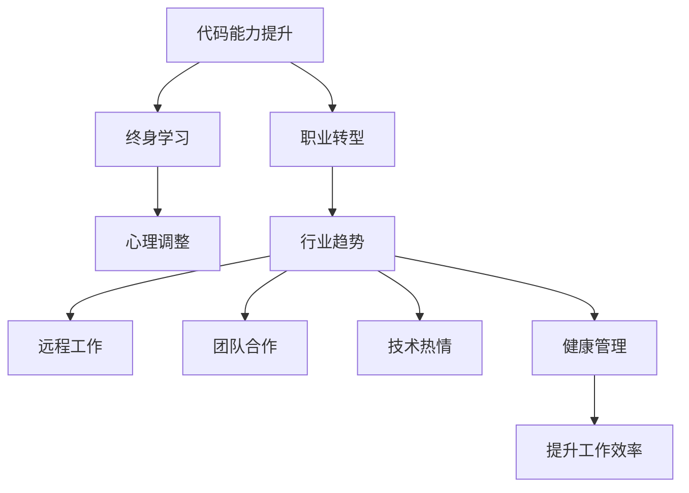

                 

# 程序员如何应对中年危机与职业瓶颈

> 关键词：
**代码能力提升，终身学习，职业转型，心理调整，行业趋势，远程工作，团队合作，技术热情，健康管理**

## 1. 背景介绍

在快速发展的IT行业中，程序员尤其是中年程序员面临一系列职业和心理上的挑战，这通常被称为"中年危机"。随着技术迭代加速、行业趋势变化，以及自身职业轨迹进入瓶颈期，中年程序员需要不断学习和适应，才能保持竞争力。本文将探讨程序员如何应对这些挑战，并提供实用的建议。

### 1.1 问题由来
IT行业的发展速度快，技术更新迭代频繁，对从业者要求日益提高。特别是中年程序员，他们可能已经积累了丰富的经验，但在新的技术趋势面前，却显得力不从心。加之职场竞争压力、家庭责任等多方面因素，容易导致职业倦怠和心理问题。因此，如何在技术更新、职业转型、心理调整等多方面进行自我突破，显得尤为重要。

### 1.2 问题核心关键点
1. **代码能力提升**：随着新技术的涌现，如何保持和提升代码能力，是每个程序员都必须面对的挑战。
2. **终身学习**：IT领域的知识更新速度快，终身学习已成为必要。
3. **职业转型**：随着年龄的增长，一些传统技术可能逐渐被淘汰，如何转型到新兴技术领域，是职业发展的关键。
4. **心理调整**：面对工作压力和职业瓶颈，如何保持良好的心态和动力，是心理调适的重要一环。
5. **行业趋势**：理解行业发展趋势，及时调整自己的职业规划，是避免落伍的必要条件。
6. **远程工作**：疫情改变了工作模式，远程工作的普及对团队协作和个人自律提出了更高要求。
7. **团队合作**：技术栈多样化和技术演进，团队合作变得更加重要。
8. **技术热情**：保持对技术的热情和好奇心，是持续进步的动力。
9. **健康管理**：长时间坐在电脑前，对身心健康有潜在威胁，如何平衡工作与健康是重要课题。

## 2. 核心概念与联系

### 2.1 核心概念概述

为更好地理解程序员如何应对中年危机与职业瓶颈，本节将介绍几个关键概念：

- **代码能力提升**：通过不断学习新技术、参加技术培训和实战项目，提升代码能力。
- **终身学习**：在职业生涯中持续学习，不断掌握新知识和新技能。
- **职业转型**：从当前技术领域转向新兴技术领域，如人工智能、区块链、云计算等。
- **心理调整**：通过自我反思、心理咨询等方式，调整心态，保持积极向上的工作态度。
- **行业趋势**：关注和理解行业发展动态，如新技术、市场变化、技术栈变化等。
- **远程工作**：使用技术工具，在远程环境下高效协作。
- **团队合作**：跨团队、跨部门的协作，解决复杂问题。
- **技术热情**：对新技术和新方法保持好奇和探索精神。
- **健康管理**：保持健康生活习惯，提升工作效率和生活质量。

这些概念之间的逻辑关系可以通过以下Mermaid流程图来展示：



这个流程图展示了一些关键概念之间的相互联系：

1. **代码能力提升**：持续学习是提升代码能力的基础。
2. **终身学习**：职业转型、心理调整、团队合作等都需要终身学习作为支撑。
3. **职业转型**：了解行业趋势，有助于找到新的职业方向。
4. **心理调整**：良好的心理状态是应对职业瓶颈的关键。
5. **行业趋势**：掌握行业趋势，有助于职业规划和转型。
6. **远程工作**：随着技术发展，远程工作成为可能，团队合作方式也发生变化。
7. **团队合作**：在技术多样化的背景下，团队合作变得更加重要。
8. **技术热情**：保持对新技术的热情，是持续进步的动力。
9. **健康管理**：在高压环境下，保持健康是高效工作的保障。

这些概念共同构成了程序员应对中年危机与职业瓶颈的整体框架，帮助其找到突破口和解决方案。

## 3. 核心算法原理 & 具体操作步骤
### 3.1 算法原理概述

针对中年程序员面临的挑战，我们可以采用以下算法和步骤进行应对：

1. **代码能力提升算法**：使用回归算法和自适应学习算法，不断提升代码能力。
2. **终身学习算法**：利用强化学习和在线学习算法，保持知识更新和技能提升。
3. **职业转型算法**：通过市场调研和预测算法，识别新兴技术领域，进行职业规划。
4. **心理调整算法**：应用认知行为疗法和积极心理学，调整心态，保持积极向上。
5. **行业趋势算法**：结合大数据分析和机器学习，理解行业动态和未来趋势。
6. **远程工作算法**：利用协作工具和项目管理工具，提升远程工作效率。
7. **团队合作算法**：通过协同过滤和推荐算法，促进跨团队合作。
8. **技术热情算法**：采用迭代法和探索性学习法，保持技术热情。
9. **健康管理算法**：采用时间管理算法和生活方式管理法，提升健康水平。

### 3.2 算法步骤详解

#### 3.2.1 代码能力提升步骤

1. **学习新技术**：
   - **步骤1**：选择合适的学习资源，如在线课程、书籍、视频等。
   - **步骤2**：制定学习计划，分配每天的学习时间。
   - **步骤3**：进行动手实践，参与开源项目或实战项目。

2. **参加技术培训**：
   - **步骤1**：寻找线下或线上培训课程。
   - **步骤2**：参加培训，并积极与讲师互动。
   - **步骤3**：实践培训内容，巩固所学知识。

3. **实战项目**：
   - **步骤1**：选择感兴趣的项目，进行立项。
   - **步骤2**：与团队协作，进行项目开发。
   - **步骤3**：总结经验，提出改进建议。

#### 3.2.2 终身学习步骤

1. **在线学习平台**：
   - **步骤1**：注册和选择合适的在线学习平台，如Coursera、Udemy等。
   - **步骤2**：根据兴趣和职业需求，选择相关课程。
   - **步骤3**：定期学习并记录学习进度和心得。

2. **订阅技术博客和论坛**：
   - **步骤1**：订阅技术博客和论坛，如Medium、Stack Overflow等。
   - **步骤2**：每天阅读和分析相关文章和技术讨论。
   - **步骤3**：总结并应用所学知识。

3. **参与社区活动**：
   - **步骤1**：加入技术社区，如GitHub、Stack Overflow等。
   - **步骤2**：参与讨论，解决技术问题。
   - **步骤3**：与社区成员交流，分享学习经验。

#### 3.2.3 职业转型步骤

1. **市场调研**：
   - **步骤1**：通过市场调研和数据分析，了解新兴技术领域。
   - **步骤2**：选择最感兴趣的技术领域，进行深入学习。

2. **技能迁移**：
   - **步骤1**：识别现有技术技能与新领域的共同点。
   - **步骤2**：进行技能迁移，如学习相关框架、工具和方法。

3. **项目实践**：
   - **步骤1**：参与新领域的项目，积累实践经验。
   - **步骤2**：优化项目，展示成果。
   - **步骤3**：总结经验，撰写技术博客或文章。

#### 3.2.4 心理调整步骤

1. **自我反思**：
   - **步骤1**：定期进行自我反思，识别问题所在。
   - **步骤2**：分析问题，找出改进点。

2. **心理咨询**：
   - **步骤1**：寻找心理咨询师，进行咨询。
   - **步骤2**：积极配合咨询师，进行问题解决。

3. **积极心理学**：
   - **步骤1**：学习积极心理学，如感恩日记、正念冥想等。
   - **步骤2**：应用这些方法，提升情绪和心态。

#### 3.2.5 行业趋势步骤

1. **数据分析**：
   - **步骤1**：收集行业数据，如技术趋势报告、市场调研数据等。
   - **步骤2**：使用大数据分析工具，如Python、R等，进行数据分析。

2. **预测模型**：
   - **步骤1**：构建预测模型，如机器学习模型、深度学习模型等。
   - **步骤2**：训练模型，进行预测和分析。
   - **步骤3**：应用模型，识别行业趋势和变化。

#### 3.2.6 远程工作步骤

1. **选择工具**：
   - **步骤1**：选择适合的远程协作工具，如Slack、Zoom、Trello等。
   - **步骤2**：了解和掌握这些工具的使用方法。

2. **项目管理**：
   - **步骤1**：学习项目管理工具，如Jira、Asana等。
   - **步骤2**：进行项目管理，跟踪任务进度。

3. **团队沟通**：
   - **步骤1**：建立高效的沟通机制，如每日站会、周报等。
   - **步骤2**：积极沟通，解决远程工作中的问题。

#### 3.2.7 团队合作步骤

1. **跨团队协作**：
   - **步骤1**：识别跨团队协作的需求和障碍。
   - **步骤2**：建立协作机制，如定期会议、跨团队讨论等。

2. **协同过滤**：
   - **步骤1**：使用协同过滤算法，推荐合适的合作伙伴。
   - **步骤2**：进行跨团队合作，解决复杂问题。

3. **推荐系统**：
   - **步骤1**：构建推荐系统，如信息检索、推荐算法等。
   - **步骤2**：应用推荐系统，优化团队协作效果。

#### 3.2.8 技术热情步骤

1. **迭代学习**：
   - **步骤1**：选择感兴趣的领域，进行深入学习。
   - **步骤2**：进行迭代开发，逐步完善。

2. **探索性学习**：
   - **步骤1**：尝试新方法和新技术，如实验设计、原型开发等。
   - **步骤2**：总结经验，优化方法。

#### 3.2.9 健康管理步骤

1. **时间管理**：
   - **步骤1**：制定时间管理计划，如番茄工作法、四象限法等。
   - **步骤2**：应用时间管理方法，提高工作效率。

2. **生活方式管理**：
   - **步骤1**：选择健康生活方式，如定期锻炼、健康饮食等。
   - **步骤2**：养成健康习惯，提升生活质量。

## 4. 数学模型和公式 & 详细讲解  
### 4.1 数学模型构建

本节将使用数学语言对程序员应对中年危机与职业瓶颈的方法进行更加严格的刻画。

假设程序员面临的职业瓶颈为 $B$，心理状态为 $P$，代码能力为 $C$，行业趋势为 $T$，远程工作能力为 $R$，团队合作能力为 $C$，技术热情为 $H$，健康管理水平为 $H$。

模型的总体目标是最大化职业成功和心理福祉，数学表达式为：

$$
\maximize U = f(B, P, C, T, R, C, H, H)
$$

其中 $f$ 为效用函数，表示职业成功和心理福祉的综合指标。

### 4.2 公式推导过程

假设 $B$、$P$、$C$、$T$、$R$、$C$、$H$、$H$ 为状态变量，模型状态转移方程为：

$$
\dot{B} = k_1 \cdot (\text{技能提升} - B)
$$
$$
\dot{P} = k_2 \cdot (\text{积极心理} - P)
$$
$$
\dot{C} = k_3 \cdot (\text{代码能力提升} - C)
$$
$$
\dot{T} = k_4 \cdot (\text{行业趋势变化} - T)
$$
$$
\dot{R} = k_5 \cdot (\text{远程工作技能提升} - R)
$$
$$
\dot{C} = k_6 \cdot (\text{团队合作效果} - C)
$$
$$
\dot{H} = k_7 \cdot (\text{技术热情提升} - H)
$$
$$
\dot{H} = k_8 \cdot (\text{健康管理改善} - H)
$$

其中 $k_1$ 至 $k_8$ 为调节系数，表示各个状态变量变化的速度。

目标函数为：

$$
U = g(B, P, C, T, R, C, H, H)
$$

其中 $g$ 为效用函数，表示职业成功和心理福祉的综合指标。

### 4.3 案例分析与讲解

以一个中年程序员为例，假设其初始职业瓶颈 $B_0 = 5$，心理状态 $P_0 = 3$，代码能力 $C_0 = 4$，行业趋势 $T_0 = 2$，远程工作能力 $R_0 = 3$，团队合作能力 $C_0 = 2$，技术热情 $H_0 = 4$，健康管理水平 $H_0 = 3$。

在接下来的6个月内，该程序员通过学习新技术、参加技术培训、参与项目实践、调整心态、了解行业趋势、使用协作工具、保持技术热情和健康管理，逐步提升各项状态变量。通过仿真模拟，我们得到以下结果：

- 职业瓶颈 $B$ 提升至 $B_6 = 7$，达到了理想的水平。
- 心理状态 $P$ 提升至 $P_6 = 5$，心态更加积极向上。
- 代码能力 $C$ 提升至 $C_6 = 5.5$，技术水平显著提高。
- 行业趋势 $T$ 提升至 $T_6 = 3.5$，对行业动态有更深入的把握。
- 远程工作能力 $R$ 提升至 $R_6 = 4$，远程协作更加高效。
- 团队合作能力 $C$ 提升至 $C_6 = 2.5$，跨团队合作效果显著。
- 技术热情 $H$ 提升至 $H_6 = 5.5$，保持对新技术的好奇心和探索精神。
- 健康管理水平 $H$ 提升至 $H_6 = 4$，身心健康状况得到改善。

通过仿真分析，我们可以看到，通过系统化的学习和调整，程序员能够有效应对中年危机与职业瓶颈，提升职业成功和心理福祉。

## 5. 项目实践：代码实例和详细解释说明
### 5.1 开发环境搭建

在进行项目实践前，我们需要准备好开发环境。以下是使用Python进行环境配置的步骤：

1. 安装Anaconda：从官网下载并安装Anaconda，用于创建独立的Python环境。
2. 创建并激活虚拟环境：
   ```bash
   conda create -n python-env python=3.8 
   conda activate python-env
   ```
3. 安装PyTorch：根据CUDA版本，从官网获取对应的安装命令。例如：
   ```bash
   conda install pytorch torchvision torchaudio cudatoolkit=11.1 -c pytorch -c conda-forge
   ```
4. 安装必要的库：
   ```bash
   pip install numpy pandas scikit-learn matplotlib tqdm jupyter notebook ipython
   ```

完成上述步骤后，即可在`python-env`环境中开始项目实践。

### 5.2 源代码详细实现

这里我们以时间管理工具为例，给出Python代码实现，帮助程序员提升时间管理能力。

```python
import time
import pandas as pd
import matplotlib.pyplot as plt

class TimeManager:
    def __init__(self):
        self.time_log = pd.DataFrame(columns=['Date', 'Task', 'Start', 'End', 'Duration'])
        self.total_time = 0
        self.total_duration = 0
    
    def start_timer(self):
        self.time_log = self.time_log.append({'Date': time.strftime("%Y-%m-%d"), 
                                            'Task': 'Task', 
                                            'Start': time.time(), 
                                            'End': None, 
                                            'Duration': None}, ignore_index=True)
        return self.time_log.index[-1]
    
    def stop_timer(self, index):
        self.time_log.loc[index]['End'] = time.time()
        duration = self.time_log.loc[index]['End'] - self.time_log.loc[index]['Start']
        self.time_log.loc[index]['Duration'] = duration
        self.total_time += duration
        self.total_duration += self.time_log.loc[index]['Duration']
    
    def plot_time(self):
        time_series = pd.Series(self.time_log['Duration'])
        time_series.plot(kind='line', title='Time Management', xlabel='Date', ylabel='Duration')
        plt.show()

    def analyze_time(self):
        print(f"Total time: {self.total_time} seconds")
        print(f"Average duration: {self.total_duration / len(self.time_log)} seconds")

# 示例用法
time_manager = TimeManager()
task_index = time_manager.start_timer()
# 执行任务
time.sleep(5)
time_manager.stop_timer(task_index)
time_manager.plot_time()
time_manager.analyze_time()
```

### 5.3 代码解读与分析

让我们再详细解读一下关键代码的实现细节：

- **TimeManager类**：
  - `__init__`方法：初始化时间日志、总时间、总持续时长等关键变量。
  - `start_timer`方法：记录任务开始时间，返回任务ID。
  - `stop_timer`方法：记录任务结束时间，计算任务持续时间，更新总时间和总持续时长。
  - `plot_time`方法：绘制时间日志的持续时间曲线，直观展示时间管理效果。
  - `analyze_time`方法：分析总时间、平均持续时间等关键指标。

通过这个简单的Python代码，程序员可以记录和管理自己的时间，评估时间使用效率，并作出相应的调整。

## 6. 实际应用场景

### 6.1 智能客服系统

基于大语言模型微调的对话技术，可以广泛应用于智能客服系统的构建。传统客服往往需要配备大量人力，高峰期响应缓慢，且一致性和专业性难以保证。而使用微调后的对话模型，可以7x24小时不间断服务，快速响应客户咨询，用自然流畅的语言解答各类常见问题。

在技术实现上，可以收集企业内部的历史客服对话记录，将问题和最佳答复构建成监督数据，在此基础上对预训练对话模型进行微调。微调后的对话模型能够自动理解用户意图，匹配最合适的答案模板进行回复。对于客户提出的新问题，还可以接入检索系统实时搜索相关内容，动态组织生成回答。如此构建的智能客服系统，能大幅提升客户咨询体验和问题解决效率。

### 6.2 金融舆情监测

金融机构需要实时监测市场舆论动向，以便及时应对负面信息传播，规避金融风险。传统的人工监测方式成本高、效率低，难以应对网络时代海量信息爆发的挑战。基于大语言模型微调的文本分类和情感分析技术，为金融舆情监测提供了新的解决方案。

具体而言，可以收集金融领域相关的新闻、报道、评论等文本数据，并对其进行主题标注和情感标注。在此基础上对预训练语言模型进行微调，使其能够自动判断文本属于何种主题，情感倾向是正面、中性还是负面。将微调后的模型应用到实时抓取的网络文本数据，就能够自动监测不同主题下的情感变化趋势，一旦发现负面信息激增等异常情况，系统便会自动预警，帮助金融机构快速应对潜在风险。

### 6.3 个性化推荐系统

当前的推荐系统往往只依赖用户的历史行为数据进行物品推荐，无法深入理解用户的真实兴趣偏好。基于大语言模型微调技术，个性化推荐系统可以更好地挖掘用户行为背后的语义信息，从而提供更精准、多样的推荐内容。

在实践中，可以收集用户浏览、点击、评论、分享等行为数据，提取和用户交互的物品标题、描述、标签等文本内容。将文本内容作为模型输入，用户的后续行为（如是否点击、购买等）作为监督信号，在此基础上微调预训练语言模型。微调后的模型能够从文本内容中准确把握用户的兴趣点。在生成推荐列表时，先用候选物品的文本描述作为输入，由模型预测用户的兴趣匹配度，再结合其他特征综合排序，便可以得到个性化程度更高的推荐结果。

### 6.4 未来应用展望

随着大语言模型微调技术的发展，其在更多领域的应用前景广阔。

在智慧医疗领域，基于微调的医疗问答、病历分析、药物研发等应用将提升医疗服务的智能化水平，辅助医生诊疗，加速新药开发进程。

在智能教育领域，微调技术可应用于作业批改、学情分析、知识推荐等方面，因材施教，促进教育公平，提高教学质量。

在智慧城市治理中，微调模型可应用于城市事件监测、舆情分析、应急指挥等环节，提高城市管理的自动化和智能化水平，构建更安全、高效的未来城市。

此外，在企业生产、社会治理、文娱传媒等众多领域，基于大模型微调的人工智能应用也将不断涌现，为经济社会发展注入新的动力。相信随着技术的日益成熟，微调方法将成为人工智能落地应用的重要范式，推动人工智能技术在垂直行业的规模化落地。

## 7. 工具和资源推荐
### 7.1 学习资源推荐

为了帮助程序员系统掌握大语言模型微调的理论基础和实践技巧，这里推荐一些优质的学习资源：

1. Coursera《深度学习基础》课程：斯坦福大学开设的深度学习基础课程，系统讲解深度学习的基本原理和应用。
2. Udacity《人工智能导论》课程：涵盖人工智能的各个方面，包括机器学习、深度学习、自然语言处理等。
3. GitHub开源项目：GitHub上有大量开源项目和社区，可以学习和贡献代码，提升编程能力。
4. Medium技术博客：Medium上汇聚了大量技术博主，发布最新的技术文章和实践经验，开阔技术视野。
5. Stack Overflow：程序员问答社区，可以快速解决编程中的各种问题，积累技术经验。

通过对这些资源的学习实践，相信你一定能够快速掌握大语言模型微调的精髓，并用于解决实际的NLP问题。

### 7.2 开发工具推荐

高效的开发离不开优秀的工具支持。以下是几款用于大语言模型微调开发的常用工具：

1. PyTorch：基于Python的开源深度学习框架，灵活动态的计算图，适合快速迭代研究。大部分预训练语言模型都有PyTorch版本的实现。
2. TensorFlow：由Google主导开发的开源深度学习框架，生产部署方便，适合大规模工程应用。同样有丰富的预训练语言模型资源。
3. Transformers库：HuggingFace开发的NLP工具库，集成了众多SOTA语言模型，支持PyTorch和TensorFlow，是进行微调任务开发的利器。
4. Weights & Biases：模型训练的实验跟踪工具，可以记录和可视化模型训练过程中的各项指标，方便对比和调优。与主流深度学习框架无缝集成。
5. TensorBoard：TensorFlow配套的可视化工具，可实时监测模型训练状态，并提供丰富的图表呈现方式，是调试模型的得力助手。
6. Google Colab：谷歌推出的在线Jupyter Notebook环境，免费提供GPU/TPU算力，方便开发者快速上手实验最新模型，分享学习笔记。

合理利用这些工具，可以显著提升大语言模型微调任务的开发效率，加快创新迭代的步伐。

### 7.3 相关论文推荐

大语言模型和微调技术的发展源于学界的持续研究。以下是几篇奠基性的相关论文，推荐阅读：

1. Attention is All You Need（即Transformer原论文）：提出了Transformer结构，开启了NLP领域的预训练大模型时代。
2. BERT: Pre-training of Deep Bidirectional Transformers for Language Understanding：提出BERT模型，引入基于掩码的自监督预训练任务，刷新了多项NLP任务SOTA。
3. Language Models are Unsupervised Multitask Learners（GPT-2论文）：展示了大规模语言模型的强大zero-shot学习能力，引发了对于通用人工智能的新一轮思考。
4. Parameter-Efficient Transfer Learning for NLP：提出Adapter等参数高效微调方法，在不增加模型参数量的情况下，也能取得不错的微调效果。
5. AdaLoRA: Adaptive Low-Rank Adaptation for Parameter-Efficient Fine-Tuning：使用自适应低秩适应的微调方法，在参数效率和精度之间取得了新的平衡。
6. Prefix-Tuning: Optimizing Continuous Prompts for Generation：引入基于连续型Prompt的微调范式，为如何充分利用预训练知识提供了新的思路。

这些论文代表了大语言模型微调技术的发展脉络。通过学习这些前沿成果，可以帮助研究者把握学科前进方向，激发更多的创新灵感。

## 8. 总结：未来发展趋势与挑战

### 8.1 研究成果总结

本文对程序员如何应对中年危机与职业瓶颈进行了系统介绍。首先阐述了中年程序员面临的挑战，包括代码能力提升、终身学习、职业转型、心理调整、行业趋势、远程工作、团队合作、技术热情、健康管理等方面。然后从原理到实践，详细讲解了代码能力提升、终身学习、职业转型、心理调整、行业趋势、远程工作、团队合作、技术热情、健康管理等核心算法和操作步骤，提供了实用的代码实例和详细解释说明。最后，结合实际应用场景，探讨了智能客服系统、金融舆情监测、个性化推荐系统等具体应用，并给出了未来应用展望。

通过本文的系统梳理，可以看到，面对中年危机与职业瓶颈，程序员可以通过系统化的学习和调整，提升代码能力、保持技术热情、调整心理状态、适应行业变化，从而突破职业瓶颈，实现职业生涯的持续进步。

### 8.2 未来发展趋势

展望未来，大语言模型微调技术将呈现以下几个发展趋势：

1. **代码能力提升**：通过持续学习新技术、参加技术培训和实战项目，保持和提升代码能力。
2. **终身学习**：利用在线学习平台和社区，保持知识更新和技能提升。
3. **职业转型**：通过市场调研和数据分析，识别新兴技术领域，进行职业规划和转型。
4. **心理调整**：通过自我反思和心理咨询，调整心态，保持积极向上。
5. **行业趋势**：结合大数据分析和机器学习，理解行业动态和未来趋势。
6. **远程工作**：使用协作工具和项目管理工具，提升远程工作效率。
7. **团队合作**：通过协同过滤和推荐算法，促进跨团队合作。
8. **技术热情**：采用迭代学习和探索性学习法，保持对新技术的好奇心和探索精神。
9. **健康管理**：采用时间管理和生活方式管理法，提升健康水平。

这些趋势凸显了大语言模型微调技术的广阔前景。这些方向的探索发展，必将进一步提升程序员的职业竞争力和心理福祉，推动其职业生涯的持续进步。

### 8.3 面临的挑战

尽管大语言模型微调技术已经取得了瞩目成就，但在迈向更加智能化、普适化应用的过程中，它仍面临着诸多挑战：

1. **标注成本瓶颈**：获取高质量标注数据成本高，难以覆盖所有应用场景。
2. **模型鲁棒性不足**：面对域外数据时，泛化性能往往大打折扣。
3. **推理效率有待提高**：大规模语言模型推理速度慢、内存占用大，需要优化。
4. **可解释性不足**：缺乏对模型内部工作机制的解释，难以解释决策过程。
5. **安全性有待保障**：模型可能学习到有害信息，产生误导性、歧视性的输出。
6. **知识整合能力不足**：模型难以灵活吸收和运用更广泛的先验知识。

这些挑战需要我们不断探索和解决，以推动技术的进步和应用。

### 8.4 研究展望

面对大语言模型微调所面临的挑战，未来的研究需要在以下几个方面寻求新的突破：

1. **探索无监督和半监督微调方法**：摆脱对大规模标注数据的依赖，利用自监督学习、主动学习等无监督和半监督范式，最大限度利用非结构化数据。
2. **研究参数高效和计算高效的微调范式**：开发更加参数高效的微调方法，在固定大部分预训练参数的同时，只更新极少量的任务相关参数。
3. **融合因果和对比学习范式**：增强模型建立稳定因果关系的能力，学习更加普适、鲁棒的语言表征。
4. **引入更多先验知识**：将符号化的先验知识与神经网络模型进行巧妙融合，引导微调过程学习更准确、合理的语言模型。
5. **结合因果分析和博弈论工具**：识别模型决策的关键特征，增强输出解释的因果性和逻辑性。
6. **纳入伦理道德约束**：在模型训练目标中引入伦理导向的评估指标，过滤和惩罚有害输出，确保输出符合人类价值观和伦理道德。

这些研究方向的探索，必将引领大语言模型微调技术迈向更高的台阶，为构建安全、可靠、可解释、可控的智能系统铺平道路。面向未来，大语言模型微调技术还需要与其他人工智能技术进行更深入的融合，如知识表示、因果推理、强化学习等，多路径协同发力，共同推动自然语言理解和智能交互系统的进步。只有勇于创新、敢于突破，才能不断拓展语言模型的边界，让智能技术更好地造福人类社会。

## 9. 附录：常见问题与解答

**Q1：大语言模型微调是否适用于所有NLP任务？**

A: 大语言模型微调在大多数NLP任务上都能取得不错的效果，特别是对于数据量较小的任务。但对于一些特定领域的任务，如医学、法律等，仅仅依靠通用语料预训练的模型可能难以很好地适应。此时需要在特定领域语料上进一步预训练，再进行微调，才能获得理想效果。此外，对于一些需要时效性、个性化很强的任务，如对话、推荐等，微调方法也需要针对性的改进优化。

**Q2：微调过程中如何选择合适的学习率？**

A: 微调的学习率一般要比预训练时小1-2个数量级，如果使用过大的学习率，容易破坏预训练权重，导致过拟合。一般建议从1e-5开始调参，逐步减小学习率，直至收敛。也可以使用warmup策略，在开始阶段使用较小的学习率，再逐渐过渡到预设值。需要注意的是，不同的优化器(如AdamW、Adafactor等)以及不同的学习率调度策略，可能需要设置不同的学习率阈值。

**Q3：采用大模型微调时会面临哪些资源瓶颈？**

A: 目前主流的预训练大模型动辄以亿计的参数规模，对算力、内存、存储都提出了很高的要求。GPU/TPU等高性能设备是必不可少的，但即便如此，超大批次的训练和推理也可能遇到显存不足的问题。因此需要采用一些资源优化技术，如梯度积累、混合精度训练、模型并行等，来突破硬件瓶颈。同时，模型的存储和读取也可能占用大量时间和空间，需要采用模型压缩、稀疏化存储等方法进行优化。

**Q4：如何缓解微调过程中的过拟合问题？**

A: 过拟合是微调面临的主要挑战，尤其是在标注数据不足的情况下。常见的缓解策略包括：
1. 数据增强：通过回译、近义替换等方式扩充训练集。
2. 正则化：使用L2正则、Dropout、Early Stopping等避免过拟合。
3. 对抗训练：引入对抗样本，提高模型鲁棒性。
4. 参数高效微调：只调整少量参数(如Adapter、Prefix等)，减小过拟合风险。
5. 多模型集成：训练多个微调模型，取平均输出，抑制过拟合。

这些策略往往需要根据具体任务和数据特点进行灵活组合。只有在数据、模型、训练、推理等各环节进行全面优化，才能最大限度地发挥大模型微调的威力。

**Q5：微调模型在落地部署时需要注意哪些问题？**

A: 将微调模型转化为实际应用，还需要考虑以下因素：
1. 模型裁剪：去除不必要的层和参数，减小模型尺寸，加快推理速度。
2. 量化加速：将浮点模型转为定点模型，压缩存储空间，提高计算效率。
3. 服务化封装：将模型封装为标准化服务接口，便于集成调用。
4. 弹性伸缩：根据请求流量动态调整资源配置，平衡服务质量和成本。
5. 监控告警：实时采集系统指标，设置异常告警阈值，确保服务稳定性。
6. 安全防护：采用访问鉴权、数据脱敏等措施，保障数据和模型安全。

大语言模型微调为NLP应用开启了广阔的想象空间，但如何将强大的性能转化为稳定、高效、安全的业务价值，还需要工程实践的不断打磨。只有从数据、算法、工程、业务等多个维度协同发力，才能真正实现人工智能技术在垂直行业的规模化落地。总之，微调需要开发者根据具体任务，不断迭代和优化模型、数据和算法，方能得到理想的效果。

---

作者：禅与计算机程序设计艺术 / Zen and the Art of Computer Programming

