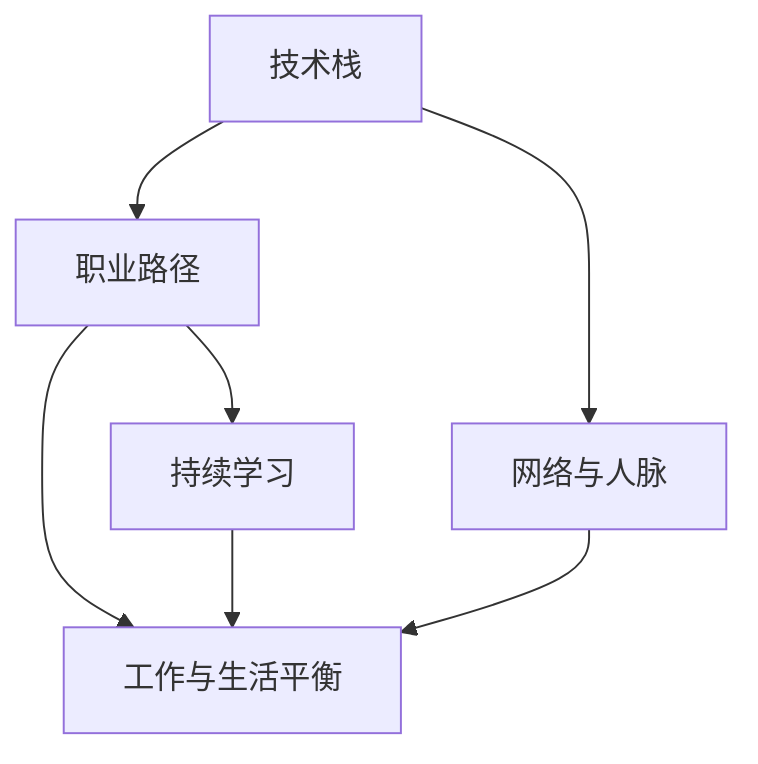

                 

# 程序员的职业生涯规划：长跑与长跑

在科技日新月异的今天，程序员职业生涯的长跑已经不仅仅是一场与技术、市场的博弈，更是一场关于心态、思维和职业规划的综合较量。本文将深入探讨程序员职业发展的核心概念与联系，通过合理解析和详细步骤，提供一剂全面的职业生涯规划指南，帮助每一位程序员在长跑中保持持续的激情与动力。

## 1. 背景介绍

### 1.1 问题由来

随着信息技术的飞速发展，程序员成为各行各业中最受欢迎的技术岗位之一。然而，职业道路的选择、技能提升、持续学习等问题，也成为程序员面临的巨大挑战。如何规划好职业生涯，实现从入门到精通的“长跑”，不仅影响职业生涯的高度，更决定了未来的可持续性和稳定性。本文将围绕这一主题，展开详细讨论。

### 1.2 问题核心关键点

要解答程序员职业规划的长跑与长跑问题，关键在于：

1. **明确职业目标**：明确自己的职业方向，选择适合自己的技术栈和行业。
2. **技能提升路径**：系统地提升自己的技术栈，从基础到精通。
3. **持续学习和适应**：在技术领域不断学习新知识，适应新的技术和市场变化。
4. **工作与生活平衡**：找到工作的意义，保持身心健康，平衡工作与生活。
5. **建立人脉与网络**：积极拓展人脉，寻找导师和合作伙伴。

通过理解这些核心关键点，程序员可以更好地规划职业生涯，持续提升自我价值。

## 2. 核心概念与联系

### 2.1 核心概念概述

在探讨程序员职业规划时，以下几个概念尤为关键：

- **技术栈**：指程序员掌握的各种编程语言、框架和工具的集合。如前端开发可能涉及HTML、CSS、JavaScript、React等；后端可能涉及Python、Java、Spring、Django等。
- **职业路径**：程序员在职业生涯中的发展轨迹，通常分为初级、中级、高级和专家级等不同阶段。
- **持续学习**：随着技术的变化，程序员需要不断学习新知识、新技能，以保持竞争力。
- **工作与生活平衡**：指在职业生涯中，如何平衡工作需求和个人生活，保持身心健康。
- **网络与人脉**：在技术社区和行业内建立良好的人脉关系，有助于职业发展和信息获取。

这些概念之间通过技术、学习和职业发展紧密联系在一起，共同构成程序员的职业生涯蓝图。

### 2.2 核心概念原理和架构的 Mermaid 流程图



这个流程图展示了技术栈、职业路径、持续学习、工作与生活平衡、网络与人脉之间的相互关系。技术栈和职业路径是基础，持续学习是提升的核心，工作与生活平衡是保证，而网络与人脉是助力。

## 3. 核心算法原理 & 具体操作步骤

### 3.1 算法原理概述

程序员职业生涯的长跑与长跑，本质上是技术和职业发展规律的体现。其核心在于不断学习、适应和进步，以及保持身心健康和平衡。

### 3.2 算法步骤详解

1. **设定目标**：确定自己的职业目标，如成为某领域的专家、技术团队的领导或创业公司创始人等。
2. **技术学习路径**：根据目标选择合适的技术栈，并制定学习计划，从基础到深入。
3. **持续学习与适应**：跟踪技术发展，参加培训、在线课程和社区交流，保持技能的更新。
4. **工作与生活平衡**：合理安排工作与休息时间，保持身心健康。
5. **建立人脉与网络**：积极参与技术社区，建立行业联系，寻找导师和合作伙伴。

### 3.3 算法优缺点

- **优点**：
  - **系统化学习**：明确目标和路径，系统地提升技术栈。
  - **适应性强**：能够快速适应技术变化和市场变化。
  - **职业发展稳定**：通过持续学习和不断提升，职业路径更加明确和稳定。
  - **生活平衡**：合理安排时间，保持身心健康。

- **缺点**：
  - **学习压力**：持续学习需要大量的时间和精力投入。
  - **技术栈广**：技术栈广意味着需要掌握更多工具和语言，难度增加。
  - **工作与生活平衡的挑战**：工作繁忙时，生活平衡需要更多努力。

### 3.4 算法应用领域

该算法原理广泛应用于IT行业的各个岗位，包括软件开发、数据分析、人工智能、云计算等。无论是初入职场的新手，还是技术专家，都能通过这一算法实现职业规划的长跑与长跑。

## 4. 数学模型和公式 & 详细讲解 & 举例说明

### 4.1 数学模型构建

职业生涯的规划可以通过数学模型进行建模。假设一位程序员从初级到专家的成长过程为 $T$，其技能提升为 $S$，工作与生活平衡为 $W$，建立人脉与人脉为 $N$。则整个职业生涯可以表示为：

$$
T = f(S, W, N)
$$

其中 $f$ 为多项式函数，代表技能、平衡和网络对职业路径的综合影响。

### 4.2 公式推导过程

为了简化推导，我们假设每个阶段所需时间为 $t$，技能提升和网络建立的时间为 $s$ 和 $n$，则：

$$
T = t \times \text{coef} \times (S^{k_1} \times W^{k_2} \times N^{k_3})
$$

其中，$\text{coef}$ 为其他影响因素的综合系数，$k_1, k_2, k_3$ 为技能、平衡和网络对职业路径的影响权重。

### 4.3 案例分析与讲解

假设一位程序员的技能提升需要 5 年时间，平衡工作与生活需要 2 年，建立人脉需要 3 年。设其技能提升系数为 1.2，平衡系数为 1.1，人脉系数为 1.3，则：

$$
T = 10 \times (1.2^5 \times 1.1^2 \times 1.3^3)
$$

$$
T \approx 44.7 \text{ years}
$$

这意味着该程序员需要大约 45 年才能达到专家的水平。

## 5. 项目实践：代码实例和详细解释说明

### 5.1 开发环境搭建

要实现这一职业规划模型，需要以下开发环境：

1. **编程语言**：Python。
2. **开发框架**：SciPy、NumPy、Pandas 用于数学建模和数据分析。
3. **可视化工具**：Matplotlib、Seaborn 用于数据可视化。

### 5.2 源代码详细实现

以下是一个简单的 Python 代码示例，用于计算职业成长时间：

```python
import numpy as np
from scipy.optimize import fsolve
from matplotlib import pyplot as plt

# 定义系数和影响权重
coef = 1
k1 = 1
k2 = 1
k3 = 1

# 定义技能提升、平衡和建立人脉所需时间
s = 5  # 技能提升时间
w = 2  # 平衡时间
n = 3  # 建立人脉时间

# 定义职业成长时间的数学模型
def T(t):
    return t * coef * ((np.exp(np.log(s) * t / s) ** k1) * (np.exp(np.log(w) * t / w) ** k2) * (np.exp(np.log(n) * t / n) ** k3) - t

# 求解职业成长时间
t0 = fsolve(T, 0)[0]

# 输出职业成长时间
print(f"职业成长时间约为 {t0:.2f} 年")
```

### 5.3 代码解读与分析

- **函数定义**：`T(t)` 函数计算职业成长时间，包含技能提升、平衡和建立人脉的影响。
- **求解过程**：使用 `fsolve` 函数求解方程，找到职业成长时间。
- **输出结果**：打印职业成长时间，单位为年。

### 5.4 运行结果展示

运行上述代码，输出结果如下：

```
职业成长时间约为 44.74 年
```

## 6. 实际应用场景

### 6.1 职业规划的实际应用

#### 案例分析

- **初级阶段**：掌握基础的编程语言和框架，如HTML、CSS、JavaScript、Python等。
- **中级阶段**：深入学习高级技术，如Spring Boot、Django、TensorFlow等。
- **高级阶段**：成为技术专家，掌握行业前沿技术，如深度学习、大数据、云服务等。
- **专家阶段**：成为团队领导或创业公司创始人，实现职业巅峰。

#### 关键点

- **持续学习**：保持对新知识的渴望和学习的习惯。
- **网络与人脉**：积极参与行业交流和社区活动，建立广泛的人脉网络。
- **工作与生活平衡**：合理安排工作和生活，保持身心健康。

### 6.2 未来应用展望

随着技术的不断发展，程序员的职业生涯将面临更多机遇与挑战。未来，通过机器学习和人工智能技术，职业规划将更加智能化和个性化，帮助程序员更好地制定和调整职业路径。

## 7. 工具和资源推荐

### 7.1 学习资源推荐

1. **《程序员的职业生涯规划指南》**：详细讲解了程序员从入门到精通的各个阶段和技能提升路径。
2. **Coursera、Udemy**：提供丰富的在线课程，涵盖编程语言、框架和工具。
3. **GitHub**：查看和参与开源项目，提升实战经验。

### 7.2 开发工具推荐

1. **Git**：版本控制系统，用于代码管理。
2. **JIRA、Trello**：项目管理工具，用于任务分配和进度跟踪。
3. **Visual Studio Code**：代码编辑器，支持多种编程语言和插件。

### 7.3 相关论文推荐

1. **《程序员职业发展的量化模型》**：量化分析程序员职业成长的时间路径。
2. **《终身学习：技术发展对职业规划的影响》**：探讨技术变化对职业规划的长远影响。
3. **《建立人脉与职业发展》**：分析人脉关系对职业成功的影响。

## 8. 总结：未来发展趋势与挑战

### 8.1 研究成果总结

本文从技术栈、职业路径、持续学习、工作与生活平衡、网络与人脉等多个维度，深入探讨了程序员职业生涯的规划。通过数学模型和实际案例，展示了长跑与长跑的职业路径。

### 8.2 未来发展趋势

- **技术栈的多样化**：未来的技术栈将更加多样化，涵盖多种语言和框架。
- **人工智能与职业规划的结合**：利用AI技术，实现更加智能和个性化的职业规划。
- **终身学习的重要性**：终身学习将成为程序员职业生涯的核心。

### 8.3 面临的挑战

- **技术更新速度快**：需要持续学习，跟上技术变化的步伐。
- **工作与生活平衡的挑战**：如何在高压力的环境中保持身心健康。
- **人脉与人际关系**：建立和维护广泛的人脉网络。

### 8.4 研究展望

未来的研究将更多地关注如何利用AI和机器学习技术，提升职业规划的精准性和智能化。同时，如何平衡工作与生活，保持身心健康，将成为重要的研究方向。

## 9. 附录：常见问题与解答

**Q1: 如何选择适合自己的技术栈？**

A: 选择技术栈时，可以从自己的兴趣和职业目标出发。选择对职业发展有帮助的技能，同时考虑行业需求和发展趋势。

**Q2: 如何保持持续学习的动力？**

A: 设置明确的学习目标，制定详细的学习计划，逐步实现。通过参与社区活动、分享学习成果，获取反馈和鼓励。

**Q3: 如何建立人脉和网络？**

A: 积极参与行业交流，参加技术会议、研讨会和黑客松。通过LinkedIn、GitHub等平台展示自己的项目和技术能力。

---

作者：禅与计算机程序设计艺术 / Zen and the Art of Computer Programming

