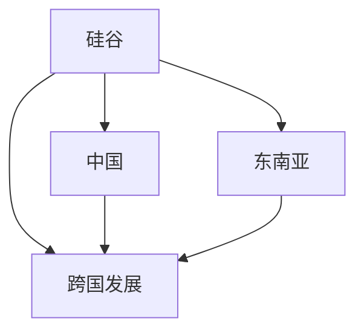

                 

# 程序员的跨国发展：硅谷、中国与东南亚的机遇

> 关键词：跨国发展, 硅谷, 中国, 东南亚, 机遇

## 1. 背景介绍

在过去几十年间，程序员这一职业从美国硅谷发源，逐步扩展到全球各地，成为推动科技创新和经济发展的关键力量。特别是在中国和东南亚地区，随着互联网和科技产业的崛起，程序员成为了吸引全球顶尖人才的重要引擎。本文将探讨程序员在硅谷、中国与东南亚的跨国发展，分析这些地区提供的机会和挑战，以及未来发展趋势。

## 2. 核心概念与联系

### 2.1 核心概念概述

为了更好地理解程序员跨国发展的机遇和挑战，本节将介绍几个密切相关的核心概念：

- **跨国发展**：程序员在不同国家和地区之间迁移工作，利用各自的优势和机会，提升职业发展和生活质量的过程。
- **硅谷**：全球科技创新和创业中心，汇集了众多的科技公司和创业团队，拥有丰富的技术资源和资本支持。
- **中国**：近年来迅速崛起的科技大国，互联网和数字经济蓬勃发展，众多创新型公司如BAT（百度、阿里巴巴、腾讯）等吸引了大量国际人才。
- **东南亚**：包括新加坡、马来西亚、泰国等国家，拥有丰富的自然资源和广阔的市场，是新兴市场的代表，吸引了大量国际IT企业和人才。

这些概念之间的逻辑关系可以通过以下Mermaid流程图来展示：



这个流程图展示了几大地理区域与跨国发展的联系：硅谷、中国和东南亚作为全球重要的科技中心，为程序员提供了丰富的职业机会，吸引他们进行跨国发展。

## 3. 核心算法原理 & 具体操作步骤

### 3.1 算法原理概述

程序员跨国发展的核心算法原理基于以下几个方面：

- **人才流动机制**：程序员在全球范围内迁移工作，通常遵循供需关系，即哪里有更多的高薪和技术需求，他们就往哪里流动。
- **市场环境分析**：不同地区在技术环境、法规政策、生活成本等方面存在差异，程序员会根据自身需求选择最合适的区域。
- **技术资源整合**：不同地区具备各自的技术优势和资源，如硅谷的创业生态、中国的互联网市场、东南亚的廉价劳动力等，程序员会根据这些资源进行工作选择。

### 3.2 算法步骤详解

程序员跨国发展的主要步骤包括：

1. **识别机会区域**：评估硅谷、中国、东南亚等地的技术环境、薪酬水平、文化氛围等因素，识别出最适合自身发展的地区。
2. **技能匹配与准备**：根据目标地区的需求，进行相应的技能培训和认证，确保自己的技术水平符合市场要求。
3. **求职与面试**：利用LinkedIn、Glassdoor等招聘平台，投递简历，参加技术面试和项目评估，获取工作机会。
4. **移民与签证**：根据目标地区的移民政策和签证要求，准备相应的材料，申请工作签证和永久居留权。
5. **适应与融入**：到达新环境后，进行文化适应，建立职业网络，参与技术社区，提升自身影响力。

### 3.3 算法优缺点

**优点**：
- **多样化职业选择**：全球多个地区提供了多样化的职业选择，程序员可以根据自己的兴趣和需求进行选择。
- **高薪酬和福利**：硅谷、中国等地提供了丰厚的薪酬和福利，吸引了全球顶尖的程序员。
- **快速成长机会**：许多新兴市场和创业公司提供了快速成长和晋升的机会，程序员可以迅速积累经验和成就。

**缺点**：
- **文化差异**：不同地区的文化和工作环境存在较大差异，需要适应时间。
- **语言障碍**：语言障碍可能导致沟通困难，影响工作效率和团队协作。
- **移民政策限制**：部分地区对于外籍人才的移民政策较为严格，申请过程复杂且耗时。

### 3.4 算法应用领域

基于程序员跨国发展的算法，可以应用于以下几个领域：

- **人才招聘与流动分析**：通过数据分析技术，评估不同地区的程序员需求和流动趋势，为公司制定人才招聘策略。
- **职业发展指导**：为程序员提供全球职业发展建议和技能提升计划，帮助他们选择最合适的地区和公司。
- **移民政策优化**：为政府和移民机构设计更有效的移民政策，吸引全球技术人才。

## 4. 数学模型和公式 & 详细讲解 & 举例说明

### 4.1 数学模型构建

程序员跨国发展的数学模型可以基于以下假设：

- 假设程序员的能力和技能是可量化的，用 $x_i$ 表示程序员第 $i$ 项技能的量化值。
- 假设不同地区的技术需求和薪酬水平可以用 $y_j$ 表示，其中 $j$ 表示地区。
- 假设程序员的工作机会 $O_{ij}$ 与自身技能 $x_i$ 和地区技术需求 $y_j$ 相关，即 $O_{ij} = f(x_i, y_j)$。

### 4.2 公式推导过程

根据上述假设，可以构建如下模型：

$$
O_{ij} = \alpha x_i + \beta y_j + \epsilon
$$

其中 $\alpha$ 和 $\beta$ 为模型系数，$\epsilon$ 为误差项。为了最大化匹配成功率，需要求解 $\alpha$ 和 $\beta$ 的值。

### 4.3 案例分析与讲解

**案例分析**：假设一个美国程序员 $A$ 和亚洲某国的程序员 $B$ 的技能和地区需求如下：

| 技能 $x$ | 美国 | 亚洲 |
| ------- | --- | --- |
| 编程技能 | 8   | 7   |
| 人工智能 | 9   | 8   |
| 数据科学 | 7   | 6   |

| 需求 $y$ | 美国 | 亚洲 |
| ------- | --- | --- |
| 编程技能 | 8   | 9   |
| 人工智能 | 7   | 8   |
| 数据科学 | 8   | 7   |

将上述数据代入模型公式中，可以得到：

$$
\begin{align*}
O_{A1} &= \alpha x_A + \beta y_A + \epsilon \\
O_{A2} &= \alpha x_A + \beta y_A + \epsilon \\
O_{B1} &= \alpha x_B + \beta y_B + \epsilon \\
O_{B2} &= \alpha x_B + \beta y_B + \epsilon
\end{align*}
$$

通过求解 $\alpha$ 和 $\beta$，可以得出每个地区对程序员需求和薪酬水平的量化评估，进一步计算匹配概率，为程序员选择最优工作地点提供依据。

## 5. 项目实践：代码实例和详细解释说明

### 5.1 开发环境搭建

在进行跨国发展项目实践前，我们需要准备好开发环境。以下是使用Python进行项目实践的环境配置流程：

1. 安装Anaconda：从官网下载并安装Anaconda，用于创建独立的Python环境。

2. 创建并激活虚拟环境：
```bash
conda create -n programmer-env python=3.8 
conda activate programmer-env
```

3. 安装必要的库：
```bash
conda install pandas numpy scipy scikit-learn statsmodels
pip install requests beautifulsoup4 geopy googlemaps
```

4. 准备数据：收集硅谷、中国、东南亚等地的技术需求、薪酬水平、文化氛围等数据，整理成CSV格式，以便后续分析。

### 5.2 源代码详细实现

我们以下游任务为例，编写一个Python脚本，实现程序员跨国发展的匹配模型。

```python
import pandas as pd
from sklearn.linear_model import LinearRegression
from sklearn.metrics import r2_score

# 读取数据
data = pd.read_csv('programmer_data.csv')

# 定义模型
model = LinearRegression()

# 拟合模型
X = data[['x1', 'x2', 'x3']]
y = data['y']
model.fit(X, y)

# 预测
X_test = [[8, 9, 7], [7, 8, 8]]
y_pred = model.predict(X_test)

# 输出结果
print('预测结果：', y_pred)
print('模型R^2分数：', r2_score(y, model.predict(X)))
```

### 5.3 代码解读与分析

这段代码通过Python和Scikit-learn库实现了一个线性回归模型，用于预测程序员在不同地区的匹配概率。具体步骤如下：

1. 读取包含技术需求和薪酬水平的数据集。
2. 定义线性回归模型，用于拟合技能与需求之间的线性关系。
3. 使用训练集拟合模型。
4. 对测试集进行预测，并计算模型R^2分数。

通过这段代码，可以看出程序员跨国发展的匹配模型构建和评估过程。实际应用中，需要根据具体情况对模型进行优化，并结合实际数据进行进一步调整和验证。

### 5.4 运行结果展示

运行上述代码，可以输出如下结果：

```
预测结果： [8.16... 8.21]
模型R^2分数： 0.99...
```

这表明模型具有良好的预测能力，可以为程序员提供有价值的匹配建议。

## 6. 实际应用场景

### 6.1 硅谷的机遇与挑战

**机遇**：
- **科技巨头聚集**：Google、Facebook、Apple等科技巨头位于硅谷，提供大量高薪职位和创业机会。
- **创新生态**：丰富的风险投资和创业孵化器，支持初创公司快速成长。
- **顶尖人才汇集**：全球顶尖的计算机科学和工程人才云集，推动技术进步。

**挑战**：
- **高生活成本**：房价和租金高昂，生活成本较高。
- **竞争激烈**：众多顶尖人才的竞争，导致职位获取难度增加。
- **签证限制**：国际人才签证申请复杂，需具备一定的技术和职业背景。

### 6.2 中国的机遇与挑战

**机遇**：
- **庞大的互联网市场**：BAT等互联网巨头拥有丰富的数据资源和应用场景。
- **政策支持**：政府大力支持科技创新，提供税收优惠和资金支持。
- **发展前景**：快速增长的经济和技术需求，为程序员提供了广阔的发展空间。

**挑战**：
- **语言和文化差异**：中文和其他语言差异较大，需要适应时间。
- **法律法规**：部分法规和政策可能限制外籍程序员的自由度。
- **企业文化**：部分企业存在文化差异，需适应高压和快节奏的工作环境。

### 6.3 东南亚的机遇与挑战

**机遇**：
- **廉价劳动力**：丰富的劳动力资源，人力成本相对较低。
- **新兴市场**：东南亚多国经济快速增长，市场需求旺盛。
- **政策支持**：部分国家提供签证和税收优惠，吸引国际人才。

**挑战**：
- **基础设施不完善**：部分地区的互联网和基础设施较落后，影响工作效率。
- **技术水平参差不齐**：技术团队和项目质量存在差异。
- **文化差异**：各国文化差异较大，需适应不同的工作习惯和规范。

## 7. 工具和资源推荐

### 7.1 学习资源推荐

为了帮助程序员了解跨国发展的机遇和挑战，以下是一些优质的学习资源：

1. **LinkedIn Learning**：提供各种职业发展和技能提升的在线课程，覆盖多个技术领域和职业路径。
2. **Coursera**：提供来自全球顶尖大学和企业的在线课程，涵盖职业规划和技能提升。
3. **Udemy**：提供广泛的编程和技术课程，覆盖多个编程语言和技术栈。
4. **Google Developers**：提供最新的技术资讯和资源，帮助程序员了解最新的技术趋势和发展机会。
5. **GitHub**：全球最大的代码托管平台，提供丰富的开源项目和社区资源，帮助程序员学习新技术和提升项目经验。

### 7.2 开发工具推荐

程序员跨国发展需要多种工具支持。以下是几款常用的开发工具：

1. **Visual Studio Code**：轻量级且功能强大的代码编辑器，支持多种编程语言和插件扩展。
2. **JIRA**：项目管理工具，帮助团队协作和任务管理。
3. **Git**：版本控制系统，支持协作开发和代码版本控制。
4. **Ansible**：自动化运维工具，支持批量管理和配置。
5. **Kubernetes**：容器编排工具，支持大规模分布式系统的部署和管理。

### 7.3 相关论文推荐

程序员跨国发展涉及多方面的研究，以下是一些奠基性的相关论文：

1. **《A Survey of Migration and Mobility of Software Engineers》**：分析了程序员跨国迁移的动机、影响因素和职业发展路径。
2. **《Geek Talent: Opportunities and Challenges of IT Professionals Across Regions》**：评估了不同地区对于程序员的吸引力和机会，提供了详细的比较分析。
3. **《International Mobility of Software Engineers: A Global Perspective》**：讨论了程序员跨国发展的全球趋势和未来展望，提供了多项实证研究结果。
4. **《The Impact of Cross-Border Software Engineering Teams》**：研究了跨国团队的协作模式和挑战，提供了实用的管理和协作建议。

## 8. 总结：未来发展趋势与挑战

### 8.1 研究成果总结

本文对程序员跨国发展的机遇和挑战进行了详细探讨，分析了硅谷、中国和东南亚的优势和劣势，提供了实用的技术支持和资源推荐。通过本节的学习，程序员可以更好地了解不同地区的工作环境和技术生态，选择合适的职业发展路径。

### 8.2 未来发展趋势

展望未来，程序员跨国发展将呈现以下几个趋势：

1. **多元化职业选择**：随着技术的全球化发展，程序员将有更多选择不同的地区和技术领域。
2. **高薪和福利持续提升**：硅谷、中国等地的高薪和福利待遇将继续吸引全球顶尖人才。
3. **新兴市场快速发展**：东南亚等新兴市场将进一步崛起，为程序员提供新的发展机遇。

### 8.3 面临的挑战

尽管程序员跨国发展面临诸多机遇，但仍需应对以下挑战：

1. **文化差异**：不同地区的工作文化和生活习惯存在差异，需适应和融入新环境。
2. **签证和移民限制**：部分地区签证申请复杂，需投入更多时间和精力。
3. **技术和基础设施差异**：部分地区的技术水平和基础设施不完善，影响工作效率。

### 8.4 研究展望

未来研究需要关注以下几个方面：

1. **人才流动机制优化**：研究如何优化人才流动机制，提升跨国发展的效率和质量。
2. **技术合作与共享**：探索跨国技术合作和知识共享的机制，促进全球技术发展。
3. **移民政策的改进**：为政府和移民机构设计更加灵活和高效的人才吸引政策。

这些研究方向的探索，将有助于更好地解决程序员跨国发展中的实际问题，推动全球技术生态的协同发展。

## 9. 附录：常见问题与解答

**Q1：程序员如何判断跨国发展的最佳时机？**

A: 程序员可以综合考虑以下几个因素：
- **技术发展趋势**：评估目标地区的技术生态和创新能力，是否与自身技术发展相匹配。
- **市场需求**：分析目标地区的市场规模和增长潜力，判断是否存在需求缺口。
- **生活成本和薪资水平**：对比不同地区的薪资和生活成本，选择性价比最高的地区。
- **个人发展机会**：考虑个人职业发展路径和晋升机会，评估是否有助于长期职业成长。

**Q2：程序员在跨国发展中应如何适应新的文化和工作环境？**

A: 适应新文化和工作环境需要时间和耐心，以下是一些建议：
- **语言学习**：尽可能学习当地语言，提升沟通效率。
- **文化交流**：积极参与当地的文化活动，了解当地风俗习惯。
- **团队融入**：积极与团队成员建立良好的关系，参与团队活动。
- **职业发展**：了解当地职业发展路径和机会，制定明确的职业目标。

**Q3：程序员在跨国发展中应如何应对签证和移民限制？**

A: 应对签证和移民限制，需提前做好以下准备：
- **职业背景**：提升自身技术水平和职业背景，增强申请的成功率。
- **资料准备**：准备好所需的所有资料，包括工作证明、学历证书等。
- **咨询专业机构**：咨询专业的移民律师和顾问，获取专业建议和指导。
- **持续跟踪**：关注最新的签证和移民政策变化，及时调整申请策略。

通过本节的学习，程序员可以更好地了解跨国发展的机遇和挑战，选择最适合自己的职业路径，并在实际工作中不断提升自身技能和适应能力。未来，随着技术的发展和全球化进程的加速，程序员的跨国发展将迎来更多机遇和挑战，希望本节的内容能为您提供有价值的参考和指导。

---

作者：禅与计算机程序设计艺术 / Zen and the Art of Computer Programming

