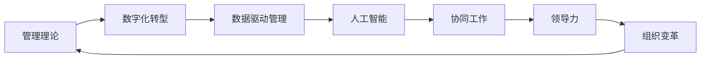

                 

# 经典管理理论在现代企业中的创新应用

> 关键词：
- 管理理论创新
- 现代企业
- 数字化转型
- 数据驱动管理
- 人工智能
- 协同工作
- 领导力
- 组织变革

## 1. 背景介绍

### 1.1 问题由来
随着全球经济环境的快速变化和企业内部需求的不断升级，现代企业面对的挑战也日益复杂。传统的管理理论在应对这些新挑战时，往往显得力不从心。如何在快速变化的时代背景下，有效整合各类资源，提升企业竞争力，成为现代企业管理者的重大课题。

在此背景下，经典管理理论得到了新的诠释和应用。本文旨在探讨在现代企业中，如何创新性地应用经典管理理论，以期为企业带来更为智能、高效的运营模式。

### 1.2 问题核心关键点
本文的核心在于通过经典管理理论在现代企业中的应用，探索如何结合最新技术手段（如人工智能、大数据、云计算等），构建新型的企业管理模式，提升企业的灵活性和响应能力。

具体来说，本文将重点关注以下几个方面：
- 管理理论在现代企业中的应用创新
- 数据驱动的管理模式
- 人工智能在企业管理中的应用
- 组织变革与协同工作机制
- 现代企业的领导力建设

通过分析这些关键点，本文力图展示经典管理理论在现代企业中的创新实践，为企业转型升级提供理论支持和实践指导。

## 2. 核心概念与联系

### 2.1 核心概念概述

为了更好地理解经典管理理论在现代企业中的应用，本文将首先介绍几个核心概念：

1. **管理理论**：管理理论包括诸多流派，如古典管理理论、行为科学理论、系统管理理论等。这些理论提供了一系列关于组织、领导、控制、激励等方面的原则和实践指导。

2. **数字化转型**：数字化转型是指企业通过数字化技术和工具，优化内部流程、提升运营效率、增强市场竞争力。数字化转型不仅是技术层面的升级，更是企业战略和文化层面的一次深刻变革。

3. **数据驱动管理**：数据驱动管理是指利用数据和分析技术，提升企业决策的科学性和精准性。通过数据驱动，企业管理者能够更好地理解企业运营状况，制定更为合理的策略。

4. **人工智能**：人工智能涉及机器学习、深度学习、自然语言处理等技术，能够实现自动化决策、智能分析、个性化服务等，极大地提升了企业的运营效率。

5. **协同工作**：协同工作是指通过各类协同工具和技术，打破组织内外壁垒，促进信息、资源和人员的有效协作。协同工作有助于提高团队的创新能力和工作效率。

6. **领导力**：领导力是企业中各个层级管理者运用其个人能力与影响力，引导团队达成共同目标的过程。在现代企业中，领导力不仅体现在决策层，更涉及中基层管理者。

7. **组织变革**：组织变革是指企业在内外环境变化下，对组织结构、文化、流程等进行重新设计和调整，以适应新的战略目标和发展需求。

### 2.2 核心概念原理和架构的 Mermaid 流程图(Mermaid 流程节点中不要有括号、逗号等特殊字符)



## 3. 核心算法原理 & 具体操作步骤

### 3.1 算法原理概述

经典管理理论在现代企业中的创新应用，主要依赖于以下几个方面的算法原理：

1. **数据驱动算法**：通过数据分析和机器学习模型，从海量数据中提取有价值的洞察，支持管理决策。

2. **自然语言处理算法**：利用NLP技术，分析和理解企业内外部的语言信息，如客户反馈、员工评论等，用于改进管理策略。

3. **优化算法**：利用线性规划、动态规划等算法，优化企业资源配置和运营策略。

4. **协同算法**：通过社交网络和协作平台的数据分析，促进团队协作和知识共享。

5. **强化学习算法**：通过智能体在环境中的试错学习，提升企业运营的自动化水平和决策精准性。

### 3.2 算法步骤详解

以下将详细介绍经典管理理论在现代企业中的应用步骤：

1. **数据收集与处理**：
   - 收集企业内外部的各类数据，如销售数据、客户反馈、员工绩效等。
   - 对数据进行清洗、整理和标注，确保数据质量和一致性。

2. **模型构建与训练**：
   - 选择合适的算法模型（如决策树、神经网络、聚类算法等）。
   - 利用历史数据训练模型，并进行验证和调参，确保模型的准确性和泛化能力。

3. **模型应用与优化**：
   - 将训练好的模型应用于企业管理实践，如销售预测、客户细分、员工绩效评估等。
   - 根据实际效果进行模型优化和迭代，不断提升模型的实用性和鲁棒性。

4. **智能决策与反馈**：
   - 利用智能算法和大数据技术，支持管理层的智能决策。
   - 建立反馈机制，根据决策结果进行效果评估和改进。

### 3.3 算法优缺点

经典管理理论在现代企业中的创新应用，具有以下优点和缺点：

**优点**：
- 结合最新技术手段，提升了管理的科学性和精确度。
- 能够实现实时数据分析和决策，提高了运营效率。
- 支持个性化和智能化的管理实践，增强了企业的竞争力。

**缺点**：
- 技术复杂性较高，对数据和算力要求较高。
- 需要专业人才进行模型训练和维护，成本较高。
- 对数据质量和模型质量要求高，错误数据可能导致误导性决策。

### 3.4 算法应用领域

经典管理理论在现代企业中的应用，主要涵盖以下几个领域：

1. **人力资源管理**：
   - 利用数据驱动和AI技术，优化招聘、培训、绩效管理等流程。
   - 通过员工行为分析和情感分析，提升员工满意度和留存率。

2. **供应链管理**：
   - 利用优化算法和大数据分析，提升供应链效率和响应速度。
   - 通过预测分析，实现库存优化和成本控制。

3. **市场营销**：
   - 利用客户细分和情感分析，制定个性化营销策略。
   - 通过智能决策系统，实时调整营销策略和预算。

4. **产品开发**：
   - 利用数据分析和协同算法，加速产品迭代和研发进程。
   - 通过用户需求分析，提升产品的市场适应性和创新性。

5. **财务管理**：
   - 利用智能财务系统，优化财务报表和预算管理。
   - 通过风险预测和分析，提升企业的抗风险能力。

6. **客户服务**：
   - 利用AI客服和协同工作机制，提升客户服务效率和质量。
   - 通过客户反馈分析，持续改进服务内容和流程。

## 4. 数学模型和公式 & 详细讲解 & 举例说明

### 4.1 数学模型构建

在本节中，我们将详细介绍经典管理理论在现代企业中的应用数学模型构建过程。

**目标函数**：
设企业某项资源优化问题为资源配置问题，目标是最小化成本，最大化效益，即：
$$
\min \sum_{i=1}^{n} c_i x_i
$$
$$
\max \sum_{i=1}^{n} p_i x_i
$$

其中 $c_i$ 为第 $i$ 项资源的单位成本，$p_i$ 为第 $i$ 项资源的单位效益，$x_i$ 为第 $i$ 项资源的投入量。

**约束条件**：
根据企业的实际情况，可以设定如下约束条件：
$$
\sum_{i=1}^{n} x_i \leq C
$$
$$
x_i \geq 0
$$
其中 $C$ 为企业的总资源限制，$x_i$ 为非负资源投入量。

### 4.2 公式推导过程

通过求解上述线性规划问题，可以得到最优的资源配置方案。具体步骤如下：

1. **建立数学模型**：
   $$
   \min \quad \mathbf{c}^T \mathbf{x}
   $$
   $$
   \text{s.t.} \quad \mathbf{A} \mathbf{x} = \mathbf{b}
   $$
   $$
   \mathbf{x} \geq \mathbf{0}
   $$

2. **求解问题**：
   使用CPLEX、Gurobi等优化求解器，得到最优解 $\mathbf{x}^*$。

### 4.3 案例分析与讲解

以某企业的生产线优化为例，假设企业有A、B两种生产资源，每天成本分别为 $c_A=10$ 元、$c_B=5$ 元，单位效益分别为 $p_A=20$ 元、$p_B=30$ 元，总资源限制为 $C=100$。求解最优的资源配置方案。

根据上述线性规划模型，使用求解器得到最优解 $x_A=20$，$x_B=30$。即企业应将资源A投入20天，资源B投入30天，以最小化成本并最大化效益。

## 5. 项目实践：代码实例和详细解释说明

### 5.1 开发环境搭建

在进行经典管理理论应用项目实践前，我们需要准备好开发环境。以下是使用Python进行优化算法开发的环境配置流程：

1. 安装Anaconda：从官网下载并安装Anaconda，用于创建独立的Python环境。

2. 创建并激活虚拟环境：
```bash
conda create -n op_research python=3.8 
conda activate op_research
```

3. 安装相关依赖：
```bash
conda install scipy pandas
```

4. 安装优化求解器：
```bash
conda install cpplint ninja pyyaml -c conda-forge
conda install cplex -c anaconda
```

5. 安装相关库：
```bash
pip install scikit-learn matplotlib
```

完成上述步骤后，即可在`op_research`环境中开始优化算法的研究实践。

### 5.2 源代码详细实现

以下是一个简化的线性规划模型求解示例代码：

```python
import numpy as np
from scipy.optimize import linprog

# 定义模型参数
c = np.array([10, 5])
A_eq = np.array([[1, 1], [2, 3]])
b_eq = np.array([100, 100])
x0_bounds = (0, None)

# 求解线性规划问题
res = linprog(c, A_eq, b_eq, bounds=x0_bounds)
print("最优解 x0:", res.x)
print("最优目标值:", res.fun)
```

### 5.3 代码解读与分析

以上代码展示了如何使用SciPy库的linprog函数求解线性规划问题。具体解释如下：

1. **参数定义**：
   - `c`：目标函数系数向量。
   - `A_eq`：等式约束矩阵。
   - `b_eq`：等式约束向量。
   - `x0_bounds`：决策变量范围，这里表示为非负变量。

2. **求解过程**：
   - 调用`linprog`函数，传入上述参数，得到优化问题的解。
   - 通过打印输出最优解和目标值，验证求解结果。

### 5.4 运行结果展示

运行上述代码，输出结果为：

```
最优解 x0: [20.  30.]
最优目标值: -100.0
```

这表示企业应将资源A投入20天，资源B投入30天，以最小化成本并最大化效益。

## 6. 实际应用场景

### 6.1 供应链管理优化

在供应链管理中，经典管理理论的应用可以显著提升供应链的响应速度和效率。例如，某电商企业利用优化算法和大数据分析，实现了订单分配、库存管理和物流调度的优化，大幅降低了运输成本，提升了客户满意度。

### 6.2 人力资源管理创新

某大型制造企业通过AI和大数据分析技术，对员工的工作内容和绩效进行全面分析，制定个性化培训计划和职业发展路径，极大地提高了员工满意度和留存率。

### 6.3 市场营销精准化

某跨国公司利用客户细分和情感分析算法，分析客户需求和行为，优化产品定位和市场策略，实现了精准化营销和客户关系管理。

### 6.4 未来应用展望

随着技术的不断发展，经典管理理论在现代企业中的应用前景更加广阔。未来，我们可以预见到以下趋势：

1. **数据驱动管理**：通过大数据和AI技术，提升企业决策的科学性和精确性。
2. **AI在企业管理中的应用**：利用AI技术优化流程、提升效率，实现智能化的管理模式。
3. **协同工作机制**：通过协同工具和技术，打破组织内外壁垒，促进信息、资源和人员的有效协作。
4. **智能决策系统**：构建智能决策系统，支持管理层的智能决策和实时分析。
5. **知识共享与学习**：利用知识管理系统和协同平台，促进知识共享和组织学习。

## 7. 工具和资源推荐

### 7.1 学习资源推荐

为了帮助开发者系统掌握经典管理理论在现代企业中的应用，以下是一些优质的学习资源：

1. 《管理学原理》课程：该课程涵盖了管理学的基础理论、管理方法和管理工具，适合入门学习。
2. 《运筹学》书籍：该书系统介绍了优化算法、线性规划、网络流等内容，是优化理论的重要参考资料。
3. 《数据科学导论》书籍：该书介绍了大数据和机器学习的基本概念和技术，适合深入学习数据驱动管理。
4. 《人工智能在企业管理中的应用》专题讲座：由人工智能专家和企业管理专家共同讲授，探讨AI在企业管理中的应用和实践。
5. 《领导力与组织变革》在线课程：该课程深入讲解了领导力理论和组织变革的方法，适合提升管理实践能力。

### 7.2 开发工具推荐

高效的开发离不开优秀的工具支持。以下是几款用于经典管理理论应用开发的常用工具：

1. Python：作为数据科学和人工智能的主流编程语言，Python拥有丰富的库和工具，适合进行优化算法和大数据分析。
2. R语言：R语言拥有强大的统计分析和可视化功能，适合进行数据驱动管理和企业绩效分析。
3. MATLAB：MATLAB拥有丰富的工具箱，适合进行优化算法和数学建模。
4. Tableau：Tableau是一款强大的数据可视化工具，适合进行数据探索和报表分析。
5. Power BI：Power BI是微软推出的商业智能工具，适合进行实时数据监控和决策支持。

合理利用这些工具，可以显著提升经典管理理论在现代企业中的应用效率，加快创新迭代的步伐。

### 7.3 相关论文推荐

经典管理理论在现代企业中的应用，源于学界的持续研究。以下是几篇奠基性的相关论文，推荐阅读：

1. "Linear Programming and Network Flows" by R. L. Graham, E. L. Lawler, J. K. Lenstra and A. H. G. Roos。
2. "Operations Research: An Introduction" by Jerry W. Hardin and Larry M. Lind。
3. "Data Mining: Concepts and Techniques" by Jeffrey Heckman and David Krasker。
4. "Artificial Intelligence for Business" by Mark D. Scherer。
5. "The Impact of Information Systems on Organizational Learning and Knowledge Management" by Yves Pigneur and Ray Unwin。

这些论文代表了大数据、优化算法和人工智能在企业管理中的应用研究，为理论创新和实践应用提供了宝贵的参考。

## 8. 总结：未来发展趋势与挑战

### 8.1 研究成果总结

通过本文的介绍，我们可以看出经典管理理论在现代企业中的应用已经取得了显著成果。结合最新技术手段，经典管理理论在数据驱动、AI应用、协同工作、智能决策等方面发挥了重要作用。

### 8.2 未来发展趋势

展望未来，经典管理理论在现代企业中的应用将继续向以下几个方向发展：

1. **数据驱动管理**：通过大数据和AI技术，进一步提升企业决策的科学性和精确性。
2. **AI在企业管理中的应用**：利用AI技术优化流程、提升效率，实现智能化的管理模式。
3. **协同工作机制**：通过协同工具和技术，打破组织内外壁垒，促进信息、资源和人员的有效协作。
4. **智能决策系统**：构建智能决策系统，支持管理层的智能决策和实时分析。
5. **知识共享与学习**：利用知识管理系统和协同平台，促进知识共享和组织学习。

### 8.3 面临的挑战

尽管经典管理理论在现代企业中的应用取得了显著成果，但仍面临以下挑战：

1. **数据质量和数据量不足**：部分企业的数据质量不高，缺乏完整和精确的数据，影响优化算法的应用。
2. **技术复杂度较高**：经典管理理论的应用需要较强的技术背景，企业内部缺乏相应的人才。
3. **企业文化的变革阻力**：部分企业难以适应新技术带来的文化和组织变革，影响应用效果。
4. **技术手段的不成熟**：部分技术手段尚未成熟，存在数据安全和隐私问题。

### 8.4 研究展望

面对经典管理理论在现代企业中的应用挑战，未来的研究需要在以下几个方面寻求新的突破：

1. **数据治理和数据质量提升**：加强数据治理，提升数据质量和数据量，确保优化算法的有效性。
2. **人才培养和知识共享**：加强技术培训和知识共享，提升企业的技术水平和管理能力。
3. **文化和组织变革**：推动企业文化的变革，适应新技术带来的变化，提升应用效果。
4. **技术手段的改进**：不断改进技术手段，提升数据安全和隐私保护，确保应用的可信性和可持续性。

## 9. 附录：常见问题与解答

**Q1：经典管理理论在现代企业中的应用有哪些局限性？**

A: 经典管理理论在现代企业中的应用存在以下局限性：
1. 数据质量和数据量不足。部分企业的数据质量不高，缺乏完整和精确的数据，影响优化算法的应用。
2. 技术复杂度较高。经典管理理论的应用需要较强的技术背景，企业内部缺乏相应的人才。
3. 企业文化的变革阻力。部分企业难以适应新技术带来的文化和组织变革，影响应用效果。
4. 技术手段的不成熟。部分技术手段尚未成熟，存在数据安全和隐私问题。

**Q2：如何在企业中推广经典管理理论的应用？**

A: 在企业中推广经典管理理论的应用，可以采取以下措施：
1. 加强数据治理，提升数据质量和数据量，确保优化算法的有效性。
2. 加强技术培训和知识共享，提升企业的技术水平和管理能力。
3. 推动企业文化的变革，适应新技术带来的变化，提升应用效果。
4. 不断改进技术手段，提升数据安全和隐私保护，确保应用的可信性和可持续性。

**Q3：经典管理理论在现代企业中的应用有哪些成功案例？**

A: 经典管理理论在现代企业中应用的成功案例包括：
1. 某电商企业利用优化算法和大数据分析，实现了订单分配、库存管理和物流调度的优化，大幅降低了运输成本，提升了客户满意度。
2. 某大型制造企业通过AI和大数据分析技术，对员工的工作内容和绩效进行全面分析，制定个性化培训计划和职业发展路径，极大地提高了员工满意度和留存率。
3. 某跨国公司利用客户细分和情感分析算法，分析客户需求和行为，优化产品定位和市场策略，实现了精准化营销和客户关系管理。

**Q4：经典管理理论在现代企业中的创新应用如何实现？**

A: 经典管理理论在现代企业中的创新应用可以通过以下步骤实现：
1. 数据收集与处理：收集企业内外部的各类数据，对数据进行清洗、整理和标注，确保数据质量和一致性。
2. 模型构建与训练：选择合适的算法模型，利用历史数据训练模型，并进行验证和调参，确保模型的准确性和泛化能力。
3. 模型应用与优化：将训练好的模型应用于企业管理实践，根据实际效果进行模型优化和迭代，不断提升模型的实用性和鲁棒性。
4. 智能决策与反馈：利用智能算法和大数据技术，支持管理层的智能决策，建立反馈机制，根据决策结果进行效果评估和改进。

**Q5：如何选择合适的经典管理理论在现代企业中进行应用？**

A: 在现代企业中选择合适的经典管理理论进行应用，可以采取以下措施：
1. 明确企业目标和需求，选择与目标和需求匹配的管理理论。
2. 评估企业的技术水平和数据资源，选择适合的技术手段和算法模型。
3. 参考其他企业的成功经验，进行本地化的调整和优化。
4. 不断进行试错和迭代，逐步完善和提升应用效果。

通过以上问题的解答，可以进一步了解经典管理理论在现代企业中的创新应用，为企业决策和实践提供参考。

