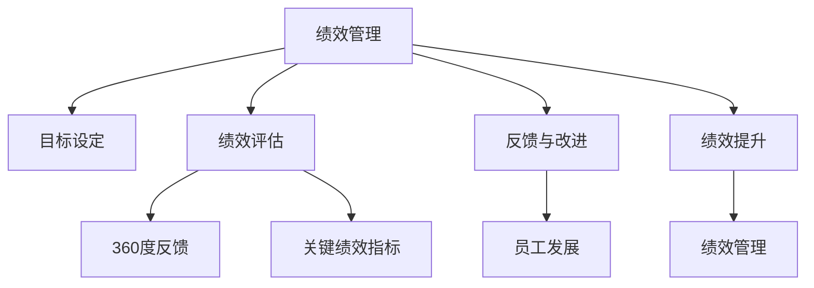

                 

# 绩效管理：设定目标和评估进展

> 关键词：绩效管理, 目标设定, 绩效评估, 关键绩效指标, OKR, 360度反馈, 员工发展, 绩效提升

## 1. 背景介绍

### 1.1 问题由来

在现代企业管理中，绩效管理已成为推动组织高效运作、激发员工潜能、实现战略目标的关键环节。随着企业对员工能力的期望日益提升，传统的绩效管理体系已难以满足新时代的挑战。如何科学设定目标、客观评估进展，成为现代人力资源管理亟需解决的难题。

### 1.2 问题核心关键点

绩效管理的关键在于设定清晰的目标体系，并根据目标的进展情况进行科学评估。这包括：
- 目标设定：明确组织和员工的具体目标，确保目标的SMART原则（Specific、Measurable、Achievable、Relevant、Time-bound）。
- 绩效评估：基于设定的目标，对员工的表现进行客观、公正的评估，识别出优势和不足。
- 反馈与改进：通过定期反馈和改进措施，持续提升员工的工作表现和满意度。

### 1.3 问题研究意义

绩效管理不仅关乎员工的个人发展，更是企业战略实施、文化建设的重要工具。科学有效的绩效管理可以：
- 促进员工自我提升，激发内在动力。
- 提升组织效率，确保战略目标的实现。
- 增强团队凝聚力，构建健康企业文化。
- 降低流失率，稳定人才队伍。

## 2. 核心概念与联系

### 2.1 核心概念概述

为更好地理解绩效管理的过程，本节将介绍几个核心概念及其相互联系：

- **绩效管理**：通过设定目标、评估进展、提供反馈等措施，推动员工和组织的持续改进。
- **目标设定**：明确组织和员工的短期与长期目标，确保目标的实现。
- **绩效评估**：基于设定的目标，对员工的工作表现进行评估，识别其优势和不足。
- **反馈与改进**：通过定期的反馈机制，指导员工改进工作方法，提升绩效水平。
- **关键绩效指标(KPIs)**：用于衡量员工或团队绩效的核心指标，如销售额、客户满意度等。
- **OKR（Objectives and Key Results）**：一种目标管理方法，强调目标与结果的关联，确保目标的可操作性和可衡量性。
- **360度反馈**：通过多角度的反馈（包括上级、同事、下属、客户等）全面评估员工表现，提升评估的客观性和全面性。
- **员工发展**：通过提供培训、导师制度等手段，促进员工能力提升和职业发展。
- **绩效提升**：通过目标设定和绩效评估，不断改进工作方法，提升整体绩效水平。

这些概念之间的联系可以通过以下Mermaid流程图来展示：



这个流程图展示出绩效管理过程中各个环节的相互关系：

1. 绩效管理通过目标设定、绩效评估、反馈与改进等手段，不断推动员工和组织的发展。
2. 目标设定和绩效评估是绩效管理的基础，360度反馈和关键绩效指标用于辅助评估的客观性和全面性。
3. 反馈与改进是绩效管理的核心，通过持续的反馈机制提升员工绩效。
4. 员工发展是绩效管理的重要目标之一，通过提供培训、导师制度等手段，促进员工能力的提升。
5. 绩效提升是绩效管理的最终目标，通过目标设定和评估，不断改进工作方法，提升整体绩效水平。

## 3. 核心算法原理 & 具体操作步骤
### 3.1 算法原理概述

绩效管理的核心在于通过目标设定和绩效评估，推动员工和组织的持续改进。以下是基于目标设定和绩效评估的核心算法原理：

1. **目标设定**：设定具体、可衡量、可实现、相关性强、时限明确的目标。
2. **绩效评估**：基于设定的目标，对员工的工作表现进行评估，衡量其是否达到目标。
3. **反馈与改进**：根据绩效评估结果，提供具体、及时、建设性的反馈，指导员工改进工作方法。
4. **绩效提升**：通过目标设定和绩效评估的持续循环，不断提升员工和组织的绩效水平。

### 3.2 算法步骤详解

绩效管理的流程通常包括以下几个步骤：

**Step 1: 目标设定与分解**
- 高层管理者制定组织战略目标，并通过SMART原则进行具体化。
- 将战略目标分解为部门目标，再将部门目标分解为员工目标。
- 与员工进行目标对齐，确保员工理解并认可目标。

**Step 2: 绩效评估与指标设定**
- 设定与目标相对应的关键绩效指标(KPIs)，确保指标的可衡量性和相关性。
- 根据目标和KPIs，制定绩效评估标准。
- 对员工的工作表现进行评估，确保评估过程公正、透明。

**Step 3: 反馈与改进**
- 定期收集员工的自评、上级评议、同事反馈、客户反馈等多角度信息。
- 结合绩效评估结果，提供具体的反馈和改进建议。
- 通过培训、导师制度等手段，帮助员工提升能力。

**Step 4: 绩效提升与优化**
- 根据反馈结果，对目标和绩效评估标准进行优化调整。
- 不断改进工作流程和方法，提升员工绩效。
- 通过持续的绩效管理循环，确保组织和员工不断提升。

### 3.3 算法优缺点

绩效管理算法的优点包括：
- 明确目标，提高员工的工作方向性和积极性。
- 通过多角度评估，确保评估的客观性和全面性。
- 持续改进，提升员工和组织的整体绩效水平。

缺点则可能包括：
- 目标设定复杂，需高层管理者参与，耗费时间和资源。
- 绩效评估过程复杂，易受主观因素影响。
- 反馈与改进机制不完善，易导致员工抵触。

### 3.4 算法应用领域

绩效管理算法在企业管理中的应用非常广泛，包括：
- 人力资源管理：通过设定目标、评估绩效、提供反馈等措施，推动员工和组织发展。
- 项目管理：通过设定项目目标、评估进展、提供反馈，确保项目按时按质完成。
- 个人发展：通过设定个人发展目标、评估进展、提供反馈，帮助员工提升能力和职业发展。
- 团队管理：通过设定团队目标、评估团队绩效、提供反馈，提升团队协作和效率。

## 4. 数学模型和公式 & 详细讲解 & 举例说明

### 4.1 数学模型构建

绩效管理可以通过数学模型进行量化评估。设目标为 $T$，员工的工作表现为 $P$，则目标实现的百分比可以表示为：

$$
\text{目标实现百分比} = \frac{P}{T}
$$

其中，$P$ 表示实际达成目标的程度，$T$ 表示目标设定的程度。

### 4.2 公式推导过程

通过上述模型，我们可以进一步推导出评估员工绩效的具体公式：

设目标 $T$ 为 $T = (T_1, T_2, ..., T_n)$，每个目标的权重为 $w_i$，员工的工作表现 $P = (P_1, P_2, ..., P_n)$，则综合评估得分 $S$ 为：

$$
S = \sum_{i=1}^n w_i \times \frac{P_i}{T_i}
$$

其中，$w_i$ 表示目标 $T_i$ 的权重，$P_i$ 表示员工在工作表现 $P$ 中对目标 $T_i$ 的实现程度。

### 4.3 案例分析与讲解

假设某公司的销售部设定的年度目标是销售额为5000万，各个季度的目标分别为1000万、1500万、1500万、800万。销售经理小明在一年内的实际销售额为1500万、1300万、1700万、900万。则小明每个季度的目标实现百分比和综合评估得分如下：

- 第一季度：$\frac{1500}{1000} = 1.5$，综合评估得分：$0.5 \times 1.5 = 0.75$
- 第二季度：$\frac{1300}{1500} = 0.87$，综合评估得分：$0.3 \times 0.87 = 0.261$
- 第三季度：$\frac{1700}{1500} = 1.13$，综合评估得分：$0.3 \times 1.13 = 0.339$
- 第四季度：$\frac{900}{800} = 1.125$，综合评估得分：$0.2 \times 1.125 = 0.225$

综合评估得分 $S = 0.75 + 0.261 + 0.339 + 0.225 = 1.665$，小明一年的绩效评估得分为 $1.665$，接近2分，说明其整体表现优秀。

## 5. 项目实践：代码实例和详细解释说明
### 5.1 开发环境搭建

在进行绩效管理系统的开发前，我们需要准备好开发环境。以下是使用Python进行Flask开发的简单环境配置流程：

1. 安装Anaconda：从官网下载并安装Anaconda，用于创建独立的Python环境。

2. 创建并激活虚拟环境：
```bash
conda create -n flask-env python=3.8 
conda activate flask-env
```

3. 安装Flask：
```bash
pip install Flask
```

4. 安装其他必要工具包：
```bash
pip install numpy pandas SQLAlchemy flask-sqlalchemy flask-login flask-wtf
```

5. 配置数据库：
```bash
create database if not exists performance_db
```

完成上述步骤后，即可在`flask-env`环境中开始开发。

### 5.2 源代码详细实现

以下是基于Flask开发的绩效管理系统示例代码：

```python
from flask import Flask, render_template, redirect, url_for, flash
from flask_sqlalchemy import SQLAlchemy
from flask_login import LoginManager, UserMixin, login_user, logout_user, login_required
from flask_wtf import FlaskForm
from wtforms import StringField, PasswordField, SubmitField
from wtforms.validators import DataRequired, Length, Email, EqualTo

app = Flask(__name__)
app.config['SQLALCHEMY_DATABASE_URI'] = 'sqlite:///performance.db'
app.config['SECRET_KEY'] = 'supersecretkey'
app.config['SQLALCHEMY_TRACK_MODIFICATIONS'] = False
db = SQLAlchemy(app)
login_manager = LoginManager()
login_manager.init_app(app)

class User(db.Model, UserMixin):
    id = db.Column(db.Integer, primary_key=True)
    username = db.Column(db.String(50), unique=True)
    email = db.Column(db.String(120), unique=True)
    password = db.Column(db.String(60))

@login_manager.user_loader
def load_user(user_id):
    return User.query.get(int(user_id))

class LoginForm(FlaskForm):
    email = StringField('Email', validators=[DataRequired(), Email()])
    password = PasswordField('Password', validators=[DataRequired()])
    submit = SubmitField('Sign In')

class RegisterForm(FlaskForm):
    username = StringField('Username', validators=[DataRequired(), Length(min=4, max=20)])
    email = StringField('Email', validators=[DataRequired(), Email()])
    password = PasswordField('Password', validators=[DataRequired()])
    confirm_password = PasswordField('Confirm Password', validators=[DataRequired(), EqualTo('password')])
    submit = SubmitField('Sign Up')

@app.route('/')
def home():
    return render_template('home.html')

@app.route('/login', methods=['GET', 'POST'])
def login():
    form = LoginForm()
    if form.validate_on_submit():
        user = User.query.filter_by(email=form.email.data).first()
        if user and user.password == form.password.data:
            login_user(user)
            return redirect(url_for('dashboard'))
        else:
            flash('Login Unsuccessful. Please check email and password', 'danger')
    return render_template('login.html', title='Login', form=form)

@app.route('/logout')
@login_required
def logout():
    logout_user()
    return redirect(url_for('home'))

@app.route('/register', methods=['GET', 'POST'])
def register():
    form = RegisterForm()
    if form.validate_on_submit():
        hashed_password = generate_password_hash(form.password.data)
        user = User(username=form.username.data, email=form.email.data, password=hashed_password)
        db.session.add(user)
        db.session.commit()
        flash('Your account has been created! You are now able to log in', 'success')
        return redirect(url_for('login'))
    return render_template('register.html', title='Register', form=form)

@app.route('/dashboard')
@login_required
def dashboard():
    # 获取目标和绩效评估数据
    goals = Goal.query.all()
    performance_scores = PerformanceScore.query.all()
    # 渲染 dashboard.html 模板
    return render_template('dashboard.html', title='Dashboard', goals=goals, performance_scores=performance_scores)

class Goal(db.Model):
    id = db.Column(db.Integer, primary_key=True)
    name = db.Column(db.String(50))
    description = db.Column(db.Text)
    start_date = db.Column(db.DateTime)
    end_date = db.Column(db.DateTime)
    user_id = db.Column(db.Integer, db.ForeignKey('user.id'))

class PerformanceScore(db.Model):
    id = db.Column(db.Integer, primary_key=True)
    score = db.Column(db.Float)
    date = db.Column(db.DateTime)
    goal_id = db.Column(db.Integer, db.ForeignKey('goal.id'))
    user_id = db.Column(db.Integer, db.ForeignKey('user.id'))

if __name__ == '__main__':
    app.run(debug=True)
```

### 5.3 代码解读与分析

让我们再详细解读一下关键代码的实现细节：

**User类**：
- 定义了用户的基本信息，包括id、username、email和password。
- 继承自db.Model和UserMixin，方便与数据库交互和身份验证。

**LoginForm类和RegisterForm类**：
- 使用WTForms库创建表单，验证用户输入的email、password等字段，确保其合法性。
- 提供了登录和注册的表单，并在表单提交时进行验证。

**Flask app实例**：
- 初始化Flask应用，配置数据库、秘密密钥等参数。
- 定义多个路由，处理用户登录、注册、仪表盘等请求。

**Goal和PerformanceScore类**：
- 定义目标和绩效评估的模型，包括目标名称、描述、起止日期、用户等信息。
- 通过与用户关联，实现对目标和绩效评估的管理。

通过以上代码实现，我们创建了一个简单的绩效管理系统，包括用户登录、注册、仪表盘等功能。开发者可以根据实际需求，进一步扩展功能，如目标设定、绩效评估、反馈与改进等模块。

## 6. 实际应用场景
### 6.1 人力资源管理

绩效管理系统在人力资源管理中的应用非常广泛。企业可以通过系统设定各岗位的目标和KPIs，定期评估员工绩效，提供建设性反馈，帮助员工提升能力。

### 6.2 项目管理

项目管理中，绩效管理系统可以用于设定项目目标、评估项目进展、提供反馈，确保项目按时按质完成。

### 6.3 个人发展

个人职业发展中，通过设定个人发展目标、评估进展、提供反馈，员工可以不断提升自身能力和职业素养。

### 6.4 团队管理

团队管理中，通过设定团队目标、评估团队绩效、提供反馈，提升团队协作和效率。

## 7. 工具和资源推荐
### 7.1 学习资源推荐

为了帮助开发者系统掌握绩效管理的理论基础和实践技巧，这里推荐一些优质的学习资源：

1. **《绩效管理：目标与结果》**（作者：张智敏）：一本详细介绍绩效管理理论和方法的书籍，适合HR从业者和企业管理者学习。
2. **《OKR：目标与关键结果》**（作者：约翰·杜尔）：介绍了OKR目标管理方法，帮助企业设定可衡量、可实现的目标。
3. **《绩效管理实战指南》**（作者：华宏诚）：从实战角度出发，介绍绩效管理的策略和工具。
4. **《360度反馈：全面提升员工绩效》**（作者：刘俊）：详细介绍360度反馈机制，提升评估的全面性和客观性。
5. **Coursera《绩效管理》课程**：由知名高校开设的课程，涵盖绩效管理的各个方面，适合在线学习。

通过对这些资源的学习实践，相信你一定能够快速掌握绩效管理的精髓，并用于解决实际的HR问题。

### 7.2 开发工具推荐

高效的开发离不开优秀的工具支持。以下是几款用于绩效管理系统开发的常用工具：

1. **Python**：高效易用的编程语言，适合开发复杂的数据处理和逻辑功能。
2. **Flask**：轻量级的Web框架，适合开发中小型Web应用。
3. **SQLAlchemy**：优秀的ORM库，方便与数据库交互。
4. **Flask-Login**：用于用户身份验证的扩展。
5. **Flask-WTF**：用于表单验证的扩展。
6. **Flask-SQLAlchemy**：用于数据库管理的扩展。

合理利用这些工具，可以显著提升绩效管理系统的开发效率，加快创新迭代的步伐。

### 7.3 相关论文推荐

绩效管理技术的发展源于学界的持续研究。以下是几篇奠基性的相关论文，推荐阅读：

1. **《绩效管理：理论与实践》**（作者：康恩·麦克休）：介绍了绩效管理的理论基础和实践方法。
2. **《OKR：目标与关键结果》**（作者：约翰·杜尔）：介绍了OKR目标管理方法，帮助企业设定可衡量、可实现的目标。
3. **《360度反馈：全面提升员工绩效》**（作者：刘俊）：详细介绍360度反馈机制，提升评估的全面性和客观性。

这些论文代表了大绩效管理的发展脉络。通过学习这些前沿成果，可以帮助研究者把握学科前进方向，激发更多的创新灵感。

## 8. 总结：未来发展趋势与挑战
### 8.1 总结

本文对绩效管理的设定目标和评估进展进行了全面系统的介绍。首先阐述了绩效管理的重要性，明确了目标设定和绩效评估在绩效管理中的核心作用。其次，从原理到实践，详细讲解了绩效管理的数学模型和操作步骤，给出了绩效管理系统开发的完整代码实例。同时，本文还广泛探讨了绩效管理系统在人力资源管理、项目管理、个人发展、团队管理等多个领域的应用前景，展示了绩效管理系统的巨大潜力。此外，本文精选了绩效管理的各类学习资源，力求为读者提供全方位的技术指引。

通过本文的系统梳理，可以看到，绩效管理系统通过设定目标和评估进展，不断推动员工和组织的发展。在企业管理中的应用非常广泛，能够帮助企业提升员工能力，优化项目进度，促进团队协作，实现整体绩效的提升。

### 8.2 未来发展趋势

展望未来，绩效管理系统将呈现以下几个发展趋势：

1. **数据驱动的智能评估**：利用大数据和机器学习技术，自动分析员工绩效数据，提供个性化的改进建议。
2. **多维度目标设定**：从单一的财务指标扩展到多个维度的目标，如技能提升、创新能力等。
3. **实时反馈与改进**：通过实时数据采集和分析，快速响应员工表现，及时提供反馈和改进措施。
4. **综合管理平台**：将绩效管理与其他HR系统（如薪酬管理、绩效评估、职业发展等）整合，形成综合管理平台。
5. **国际化与本地化支持**：提供多语言支持，满足全球化业务需求，同时考虑不同文化背景下的管理差异。

以上趋势凸显了绩效管理系统的未来发展方向。这些方向的探索发展，必将进一步提升绩效管理系统的智能化水平，为企业管理提供更科学、更灵活的工具。

### 8.3 面临的挑战

尽管绩效管理系统已经在企业管理中发挥了重要作用，但在迈向更加智能化、灵活化的过程中，仍面临诸多挑战：

1. **数据质量和数据隐私**：绩效数据的质量和隐私问题，如数据缺失、数据偏见等，可能影响评估的客观性。
2. **系统复杂性**：绩效管理系统涉及多模块、多维度的数据管理，系统设计和实现较为复杂。
3. **多目标冲突**：不同目标之间的冲突和优先级问题，需要系统能够智能处理。
4. **员工接受度**：员工对绩效管理系统的接受度较低，可能影响系统的有效应用。
5. **个性化管理**：不同员工和团队的需求不同，如何提供个性化的管理方案，需要系统具备高度灵活性。

这些挑战需要通过不断优化系统设计、提升数据质量、加强用户体验等手段来解决。唯有从系统设计、数据管理、用户体验等多个维度协同发力，才能真正实现绩效管理系统的有效应用。

### 8.4 研究展望

面对绩效管理系统所面临的挑战，未来的研究需要在以下几个方面寻求新的突破：

1. **数据质量提升**：通过数据清洗、数据补全、数据扩充等手段，提升绩效数据的质量。
2. **智能评估技术**：利用机器学习、人工智能技术，提供更加客观、智能的绩效评估方案。
3. **个性化管理**：通过个性化推荐、智能分析等手段，提供符合不同员工和团队需求的绩效管理方案。
4. **多目标协调**：通过算法优化，协调不同目标之间的冲突，确保整体目标的实现。
5. **用户体验优化**：通过UI/UX设计、交互设计等手段，提升员工对绩效管理系统的接受度和使用体验。

这些研究方向的探索，必将引领绩效管理系统迈向更高的台阶，为企业管理提供更科学、更灵活的工具。面向未来，绩效管理系统需要与其他HR系统（如薪酬管理、绩效评估、职业发展等）整合，形成综合管理平台，提供更加全面、智能的管理解决方案。只有勇于创新、敢于突破，才能不断拓展绩效管理系统的边界，让企业绩效管理系统在企业管理中发挥更大的作用。

## 9. 附录：常见问题与解答

**Q1：设定目标时，如何确保目标的SMART原则？**

A: 确保目标符合SMART原则的方法包括：
1. 目标具体化：确保目标明确具体，不模糊不清。
2. 目标可衡量：设定可量化的指标，如销售额、客户满意度等。
3. 目标可实现：确保目标在现有资源和能力下可实现。
4. 目标相关性：确保目标与整体战略和组织目标相关。
5. 目标时限：设定明确的时间限制，如季度、年度目标。

**Q2：如何进行有效的绩效评估？**

A: 有效的绩效评估需要遵循以下几个步骤：
1. 设定明确的评估标准和指标。
2. 采用多角度的评估方法，如上级评价、同事评价、自评等。
3. 确保评估过程公平、透明，消除主观偏见。
4. 提供建设性反馈，帮助员工改进工作方法。

**Q3：如何提高员工对绩效管理系统的接受度？**

A: 提高员工对绩效管理系统的接受度，可以从以下几个方面入手：
1. 强调系统对个人发展的积极作用，帮助员工理解系统的重要性。
2. 提供培训和使用指南，帮助员工熟悉系统操作。
3. 采用易用性高的系统设计，简化操作流程。
4. 建立积极的反馈机制，及时响应员工意见和需求。

**Q4：如何在绩效管理中实现数据驱动的智能评估？**

A: 实现数据驱动的智能评估，可以通过以下手段：
1. 收集和整理绩效数据，如工作量、质量、客户满意度等。
2. 利用机器学习算法，分析数据规律和趋势，提供个性化的改进建议。
3. 引入人工智能技术，如自然语言处理、图像识别等，提升数据处理的准确性。

**Q5：如何处理绩效管理中的数据隐私问题？**

A: 处理绩效管理中的数据隐私问题，可以采取以下措施：
1. 确保数据采集和存储的合法性，遵守相关法律法规。
2. 采用数据加密和匿名化技术，保护个人隐私。
3. 限制数据访问权限，确保只有授权人员才能访问数据。
4. 定期进行数据审计，发现并纠正隐私问题。

这些问题的解答，能够帮助企业更好地理解绩效管理系统的设计和应用，提高系统的有效性。

---

作者：禅与计算机程序设计艺术 / Zen and the Art of Computer Programming

