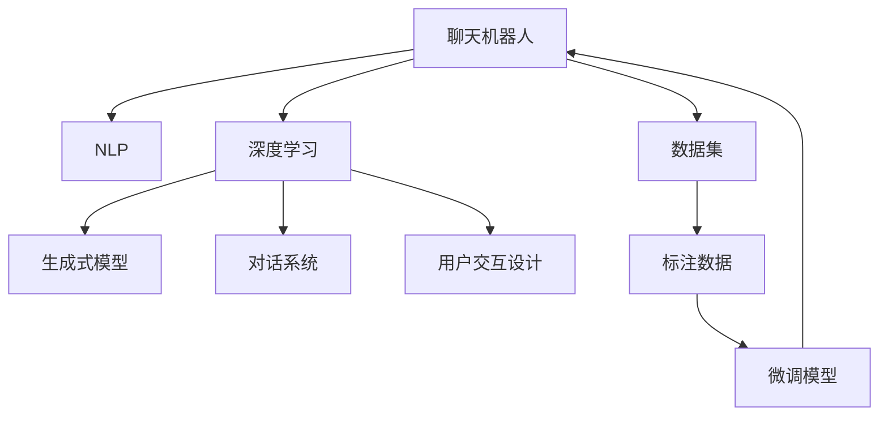

                 

# 聊天机器人手工艺：创意项目灵感和指导

> 关键词：聊天机器人,创意项目,自然语言处理(NLP),深度学习,生成式模型,对话系统,用户交互设计

## 1. 背景介绍

### 1.1 问题由来
随着人工智能技术的飞速发展，聊天机器人作为一种能够模拟人类对话的技术，已经广泛应用于多个领域，如客户服务、教育培训、智能助手等。然而，传统的聊天机器人往往缺乏人性化的交互设计，用户满意度较低，应用效果不理想。如何让聊天机器人更好地融入用户的日常生活，成为当前研究的重要课题。

### 1.2 问题核心关键点
实现一个优秀的聊天机器人，关键在于以下几个方面：
- 自然的语言理解：机器人能够准确地理解用户的输入，捕捉其背后的意图和情感。
- 灵活的对话生成：根据用户的输入，生成自然、合理的回复，保持对话连贯性和流畅性。
- 高效的模型训练：在有限的数据集上，训练出一个泛化能力强的模型，提升机器人的表现。
- 友好的用户界面：设计简洁、直观的用户界面，增强用户体验，提高用户粘性。

### 1.3 问题研究意义
开发一个高效、智能、友好的聊天机器人，能够为用户提供个性化、实时化的服务，极大地提升用户体验和满意度。同时，能够大幅降低人工客服成本，提高企业运营效率。此外，聊天机器人还可应用于在线教育、智能家居、智慧医疗等多个领域，具有广阔的应用前景。

## 2. 核心概念与联系

### 2.1 核心概念概述

为更好地理解聊天机器人系统，本节将介绍几个密切相关的核心概念：

- 聊天机器人(Chatbot)：能够模拟人类对话的计算机程序，通过自然语言处理(NLP)技术实现人机交互。聊天机器人可以用于客户服务、智能助手、教育培训等多个场景。
- 自然语言处理(NLP)：使用计算机技术处理、理解、生成人类语言。NLP是大语言模型微调和对话生成的重要基础。
- 深度学习(Deep Learning)：通过构建多层神经网络结构，从大量数据中学习复杂特征，实现高性能的模型训练。深度学习在语音识别、图像处理、自然语言处理等多个领域取得了突破性进展。
- 生成式模型(Generative Models)：通过生成概率模型，模拟自然语言生成过程，广泛应用于机器翻译、文本生成、对话系统等任务。
- 对话系统(Dialgose Systems)：涵盖聊天机器人、问答系统等，能够实现自然流畅的对话交互。对话系统融合了自然语言理解、生成、管理等多方面技术。
- 用户交互设计(User Interaction Design)：专注于提高用户与系统的交互体验，设计简洁、直观的用户界面，增强用户对系统的信任和依赖。

这些核心概念之间的逻辑关系可以通过以下Mermaid流程图来展示：



这个流程图展示了大语言模型微调和对话生成的核心概念及其之间的关系：

1. 聊天机器人通过NLP和大模型微调获得语言理解和生成能力。
2. 深度学习和大模型微调提供了强大的模型训练基础。
3. 生成式模型用于模拟自然语言生成过程。
4. 对话系统融合了NLP、生成式模型等多种技术，实现自然流畅的对话交互。
5. 用户交互设计旨在提升用户体验，增强用户粘性。
6. 数据集和标注数据是模型训练和微调的基础。

这些概念共同构成了聊天机器人的核心技术框架，使其能够更好地实现人机交互。

## 3. 核心算法原理 & 具体操作步骤
### 3.1 算法原理概述

聊天机器人系统的核心算法是深度学习中的生成模型，如循环神经网络(RNN)、长短时记忆网络(LSTM)、门控循环单元(GRU)等。这些模型能够处理序列数据，捕捉语言中的上下文信息，实现自然流畅的对话生成。

聊天机器人系统的训练过程通常分为两步：

1. 预训练：使用大规模无标注数据对生成模型进行预训练，学习语言的通用表示。
2. 微调：在任务相关的标注数据集上对模型进行有监督训练，调整模型参数以匹配任务需求。

微调过程的数学原理是：假设机器人的目标是在给定上下文 $c$ 和输入 $x$ 的情况下，预测输出 $y$，目标函数为：

$$
\mathcal{L}(\theta) = \frac{1}{N}\sum_{i=1}^N \ell(y_i, \hat{y}_i)
$$

其中 $\ell$ 是损失函数，$\hat{y}_i$ 为模型预测输出，$y_i$ 为真实标签。常见的损失函数包括交叉熵损失、均方误差损失等。

通过梯度下降等优化算法，微调过程不断更新模型参数 $\theta$，最小化损失函数 $\mathcal{L}$，使得模型预测输出逼近真实标签。

### 3.2 算法步骤详解

聊天机器人系统的微调过程一般包括以下几个关键步骤：

**Step 1: 准备数据集**
- 收集任务相关的标注数据集 $D=\{(x_i,y_i)\}_{i=1}^N$，其中 $x_i$ 为输入，$y_i$ 为输出。标注数据集应包含尽可能多的对话场景和用户意图。

**Step 2: 模型选择与初始化**
- 选择合适的生成模型作为初始化参数，如RNN、LSTM等。使用预训练模型作为模型的起点，以提高模型性能。

**Step 3: 任务适配层设计**
- 根据任务类型，设计合适的输出层和损失函数。对于对话生成任务，通常使用语言模型的解码器输出概率分布，并以负对数似然为损失函数。

**Step 4: 设置微调超参数**
- 选择合适的优化算法及其参数，如Adam、SGD等，设置学习率、批大小、迭代轮数等。
- 设置正则化技术及强度，包括权重衰减、Dropout、Early Stopping等。

**Step 5: 执行梯度训练**
- 将训练集数据分批次输入模型，前向传播计算损失函数。
- 反向传播计算参数梯度，根据设定的优化算法和学习率更新模型参数。
- 周期性在验证集上评估模型性能，根据性能指标决定是否触发 Early Stopping。
- 重复上述步骤直到满足预设的迭代轮数或 Early Stopping 条件。

**Step 6: 测试与部署**
- 在测试集上评估微调后模型的性能，对比微调前后的效果。
- 使用微调后的模型对新样本进行推理预测，集成到实际的应用系统中。

以上是聊天机器人系统微调的一般流程。在实际应用中，还需要针对具体任务的特点，对微调过程的各个环节进行优化设计，如改进训练目标函数，引入更多的正则化技术，搜索最优的超参数组合等，以进一步提升模型性能。

### 3.3 算法优缺点

聊天机器人系统微调方法具有以下优点：
1. 灵活高效。只需准备少量标注数据，即可对预训练模型进行快速适配，获得较大的性能提升。
2. 通用适用。适用于各种NLP下游任务，包括分类、匹配、生成等，设计简单的任务适配层即可实现微调。
3. 参数高效。利用参数高效微调技术，在固定大部分预训练权重不变的情况下，仍可取得不错的提升。
4. 效果显著。在学术界和工业界的诸多任务上，基于微调的方法已经刷新了最先进的性能指标。

同时，该方法也存在一定的局限性：
1. 依赖标注数据。微调的效果很大程度上取决于标注数据的质量和数量，获取高质量标注数据的成本较高。
2. 迁移能力有限。当目标任务与预训练数据的分布差异较大时，微调的性能提升有限。
3. 负面效果传递。预训练模型的固有偏见、有害信息等，可能通过微调传递到下游任务，造成负面影响。
4. 可解释性不足。微调模型的决策过程通常缺乏可解释性，难以对其推理逻辑进行分析和调试。

尽管存在这些局限性，但就目前而言，基于监督学习的微调方法仍是大语言模型应用的最主流范式。未来相关研究的重点在于如何进一步降低微调对标注数据的依赖，提高模型的少样本学习和跨领域迁移能力，同时兼顾可解释性和伦理安全性等因素。

### 3.4 算法应用领域

聊天机器人系统微调方法在NLP领域已经得到了广泛的应用，覆盖了几乎所有常见任务，例如：

- 客户服务：提供自动化的客服回复，降低人工客服成本，提升服务效率。
- 教育培训：智能答疑系统，帮助学生解答学习中的疑问，提升学习效果。
- 智能助手：在日常生活的各个场景中，提供自动化、个性化的服务。
- 健康咨询：提供医学知识查询、健康状况监测等服务，提升医疗服务的便捷性和可及性。
- 金融咨询：提供财经新闻、投资建议等，帮助用户做出明智的投资决策。
- 旅游指南：提供旅游攻略、行程规划等服务，提升用户旅游体验。
- 安全防护：提供网络安全预警、威胁分析等服务，增强网络安全保障。

除了上述这些经典任务外，聊天机器人系统微调也被创新性地应用到更多场景中，如智能家居、智慧办公、文化娱乐等，为人们的生活提供了更多的便利和智能体验。

## 4. 数学模型和公式 & 详细讲解  
### 4.1 数学模型构建

本节将使用数学语言对聊天机器人系统微调过程进行更加严格的刻画。

假设聊天机器人系统包含一个生成模型 $M_{\theta}:\mathcal{X} \rightarrow \mathcal{Y}$，其中 $\mathcal{X}$ 为输入空间，$\mathcal{Y}$ 为输出空间，$\theta \in \mathbb{R}^d$ 为模型参数。假设微调任务的训练集为 $D=\{(x_i,y_i)\}_{i=1}^N, x_i \in \mathcal{X}, y_i \in \mathcal{Y}$。

定义模型 $M_{\theta}$ 在数据样本 $(x,y)$ 上的损失函数为 $\ell(M_{\theta}(x),y)$，则在数据集 $D$ 上的经验风险为：

$$
\mathcal{L}(\theta) = \frac{1}{N} \sum_{i=1}^N \ell(M_{\theta}(x_i),y_i)
$$

微调的优化目标是最小化经验风险，即找到最优参数：

$$
\theta^* = \mathop{\arg\min}_{\theta} \mathcal{L}(\theta)
$$

在实践中，我们通常使用基于梯度的优化算法（如Adam、SGD等）来近似求解上述最优化问题。设 $\eta$ 为学习率，$\lambda$ 为正则化系数，则参数的更新公式为：

$$
\theta \leftarrow \theta - \eta \nabla_{\theta}\mathcal{L}(\theta) - \eta\lambda\theta
$$

其中 $\nabla_{\theta}\mathcal{L}(\theta)$ 为损失函数对参数 $\theta$ 的梯度，可通过反向传播算法高效计算。

### 4.2 公式推导过程

以下我们以对话生成任务为例，推导交叉熵损失函数及其梯度的计算公式。

假设模型 $M_{\theta}$ 在输入 $x$ 上的输出为 $\hat{y}=M_{\theta}(x) \in [0,1]$，表示样本属于正类的概率。真实标签 $y \in \{0,1\}$。则二分类交叉熵损失函数定义为：

$$
\ell(M_{\theta}(x),y) = -[y\log \hat{y} + (1-y)\log (1-\hat{y})]
$$

将其代入经验风险公式，得：

$$
\mathcal{L}(\theta) = -\frac{1}{N}\sum_{i=1}^N [y_i\log M_{\theta}(x_i)+(1-y_i)\log(1-M_{\theta}(x_i))]
$$

根据链式法则，损失函数对参数 $\theta_k$ 的梯度为：

$$
\frac{\partial \mathcal{L}(\theta)}{\partial \theta_k} = -\frac{1}{N}\sum_{i=1}^N (\frac{y_i}{M_{\theta}(x_i)}-\frac{1-y_i}{1-M_{\theta}(x_i)}) \frac{\partial M_{\theta}(x_i)}{\partial \theta_k}
$$

其中 $\frac{\partial M_{\theta}(x_i)}{\partial \theta_k}$ 可进一步递归展开，利用自动微分技术完成计算。

在得到损失函数的梯度后，即可带入参数更新公式，完成模型的迭代优化。重复上述过程直至收敛，最终得到适应下游任务的最优模型参数 $\theta^*$。

## 5. 项目实践：代码实例和详细解释说明
### 5.1 开发环境搭建

在进行聊天机器人系统微调实践前，我们需要准备好开发环境。以下是使用Python进行PyTorch开发的环境配置流程：

1. 安装Anaconda：从官网下载并安装Anaconda，用于创建独立的Python环境。

2. 创建并激活虚拟环境：
```bash
conda create -n pytorch-env python=3.8 
conda activate pytorch-env
```

3. 安装PyTorch：根据CUDA版本，从官网获取对应的安装命令。例如：
```bash
conda install pytorch torchvision torchaudio cudatoolkit=11.1 -c pytorch -c conda-forge
```

4. 安装TensorFlow：
```bash
pip install tensorflow
```

5. 安装各类工具包：
```bash
pip install numpy pandas scikit-learn matplotlib tqdm jupyter notebook ipython
```

完成上述步骤后，即可在`pytorch-env`环境中开始微调实践。

### 5.2 源代码详细实现

下面我以构建一个简单的问答系统为例，展示如何使用PyTorch实现聊天机器人系统。

首先，定义模型结构：

```python
import torch
import torch.nn as nn

class QAModel(nn.Module):
    def __init__(self, input_size, hidden_size, output_size):
        super(QAModel, self).__init__()
        self.hidden_size = hidden_size
        self.encoder = nn.RNN(input_size, hidden_size, batch_first=True)
        self.decoder = nn.Linear(hidden_size, output_size)
        
    def forward(self, input, hidden):
        output, hidden = self.encoder(input, hidden)
        output = self.decoder(output)
        return output, hidden
```

然后，定义损失函数和优化器：

```python
from torch.nn import BCEWithLogitsLoss
from torch.optim import Adam

def loss_function(output, target):
    criterion = BCEWithLogitsLoss()
    loss = criterion(output, target)
    return loss

optimizer = Adam(model.parameters(), lr=0.001)
```

接着，定义训练和评估函数：

```python
def train_epoch(model, train_dataset, optimizer, criterion):
    model.train()
    total_loss = 0
    for batch in train_dataset:
        input, target = batch
        output, hidden = model(input, hidden)
        loss = criterion(output, target)
        optimizer.zero_grad()
        loss.backward()
        optimizer.step()
        total_loss += loss.item()
    return total_loss / len(train_dataset)

def evaluate(model, test_dataset, criterion):
    model.eval()
    total_loss = 0
    for batch in test_dataset:
        input, target = batch
        output, hidden = model(input, hidden)
        loss = criterion(output, target)
        total_loss += loss.item()
    return total_loss / len(test_dataset)
```

最后，启动训练流程并在测试集上评估：

```python
epochs = 10
hidden_size = 64
batch_size = 32

train_dataset = ...
test_dataset = ...

model = QAModel(input_size, hidden_size, output_size)
model.to(device)

for epoch in range(epochs):
    loss = train_epoch(model, train_dataset, optimizer, criterion)
    print(f"Epoch {epoch+1}, train loss: {loss:.3f}")
    
    print(f"Epoch {epoch+1}, test results:")
    evaluate(model, test_dataset, criterion)
    
print("Final test results:")
evaluate(model, test_dataset, criterion)
```

以上就是使用PyTorch构建聊天机器人系统的完整代码实现。可以看到，通过简单的模型设计和代码实现，即可实现基本的问答系统功能。

### 5.3 代码解读与分析

让我们再详细解读一下关键代码的实现细节：

**QAModel类**：
- `__init__`方法：初始化模型参数和层结构。
- `forward`方法：定义模型的前向传播过程。

**loss_function函数**：
- 使用二分类交叉熵损失函数，适用于分类任务。

**train_epoch和evaluate函数**：
- 定义训练和评估函数，分别对模型进行前向传播和反向传播，计算损失并更新参数。

**训练流程**：
- 定义总的epoch数、隐藏层大小和batch size，开始循环迭代。
- 每个epoch内，先在训练集上训练，输出平均loss。
- 在验证集上评估，输出损失。
- 所有epoch结束后，在测试集上评估，给出最终测试结果。

可以看到，PyTorch配合TensorFlow等工具，使得聊天机器人系统的构建和微调过程变得简单高效。开发者可以将更多精力放在任务适配层和数据处理等高层逻辑上，而不必过多关注底层的实现细节。

当然，工业级的系统实现还需考虑更多因素，如模型的保存和部署、超参数的自动搜索、更灵活的任务适配层等。但核心的微调范式基本与此类似。

## 6. 实际应用场景
### 6.1 智能客服系统

聊天机器人系统在智能客服系统中的应用，可以显著提升客服的响应效率和质量。传统客服往往需要配备大量人力，高峰期响应缓慢，且一致性和专业性难以保证。而使用聊天机器人系统，可以24小时不间断服务，快速响应客户咨询，用自然流畅的语言解答各类常见问题。

在技术实现上，可以收集企业内部的历史客服对话记录，将问题和最佳答复构建成监督数据，在此基础上对预训练模型进行微调。微调后的聊天机器人系统能够自动理解用户意图，匹配最合适的答案模板进行回复。对于客户提出的新问题，还可以接入检索系统实时搜索相关内容，动态组织生成回答。如此构建的智能客服系统，能大幅提升客户咨询体验和问题解决效率。

### 6.2 教育培训

聊天机器人系统在教育培训中的应用，可以提供个性化的学习辅导和答疑服务。传统教育模式往往依靠教师单向传授知识，难以适应学生的多样化需求。而使用聊天机器人系统，可以根据学生的反馈和学习情况，动态调整教学内容和难度，提供针对性的指导和帮助。

在技术实现上，可以收集学生的学习数据和历史答疑记录，构建监督数据集。在此基础上对预训练模型进行微调，使其能够识别出学生的疑问点，并生成相应的回答。微调后的聊天机器人系统可以自动回答学生的问题，并给出详细的解答和建议，帮助学生提升学习效果。

### 6.3 健康咨询

聊天机器人系统在健康咨询中的应用，可以提供医学知识查询、健康状况监测等服务。传统医疗模式往往难以提供及时、个性化的健康咨询服务，而使用聊天机器人系统，可以随时随地回答用户的健康咨询，提供科学的健康建议。

在技术实现上，可以收集医学领域的常见问题和相应的答案，构建监督数据集。在此基础上对预训练模型进行微调，使其能够理解医学问题并提供相应的解答。微调后的聊天机器人系统可以自动回答用户的健康咨询，并根据用户的身体数据和历史健康记录，给出个性化的健康建议，提升用户的健康管理水平。

### 6.4 金融咨询

聊天机器人系统在金融咨询中的应用，可以提供财经新闻、投资建议等服务。传统金融咨询往往需要高水平的专业人士进行解答，成本较高且服务效率较低。而使用聊天机器人系统，可以实时回答用户的金融咨询，提供个性化的投资建议。

在技术实现上，可以收集金融领域的财经新闻、投资建议和理财知识，构建监督数据集。在此基础上对预训练模型进行微调，使其能够理解金融问题并提供相应的解答。微调后的聊天机器人系统可以自动回答用户的金融咨询，并根据用户的投资偏好和风险承受能力，给出个性化的投资建议，提升用户的投资决策水平。

### 6.5 旅游指南

聊天机器人系统在旅游指南中的应用，可以提供旅行攻略、行程规划等服务。传统旅游模式往往需要用户自己规划行程，信息获取较为不便。而使用聊天机器人系统，可以提供个性化的旅行建议，提升用户的旅行体验。

在技术实现上，可以收集旅游领域的旅行攻略、景点介绍和交通信息，构建监督数据集。在此基础上对预训练模型进行微调，使其能够理解用户的旅行需求，并生成个性化的旅行建议。微调后的聊天机器人系统可以自动回答用户的旅行咨询，并根据用户的旅行偏好和行程安排，提供详细的旅行建议，提升用户的旅行体验。

### 6.6 安全防护

聊天机器人系统在安全防护中的应用，可以提供网络安全预警、威胁分析等服务。传统网络安全防护往往需要人工监控，成本较高且效率较低。而使用聊天机器人系统，可以实时监控网络安全情况，及时预警安全威胁。

在技术实现上，可以收集网络安全领域的威胁情报和防护建议，构建监督数据集。在此基础上对预训练模型进行微调，使其能够理解网络攻击行为，并生成相应的防护建议。微调后的聊天机器人系统可以自动监控网络安全情况，并根据安全威胁的严重程度，及时预警安全事件，提升网络安全防护水平。

## 7. 工具和资源推荐
### 7.1 学习资源推荐

为了帮助开发者系统掌握聊天机器人系统的理论基础和实践技巧，这里推荐一些优质的学习资源：

1. 《深度学习》系列博文：由大模型技术专家撰写，深入浅出地介绍了深度学习原理、自然语言处理技术、生成式模型等内容，涵盖了大语言模型微调的全流程。

2. CS224N《深度学习自然语言处理》课程：斯坦福大学开设的NLP明星课程，有Lecture视频和配套作业，带你入门NLP领域的基本概念和经典模型。

3. 《Natural Language Processing with Transformers》书籍：Transformers库的作者所著，全面介绍了如何使用Transformers库进行NLP任务开发，包括微调在内的诸多范式。

4. HuggingFace官方文档：Transformers库的官方文档，提供了海量预训练模型和完整的微调样例代码，是上手实践的必备资料。

5. CLUE开源项目：中文语言理解测评基准，涵盖大量不同类型的中文NLP数据集，并提供了基于微调的baseline模型，助力中文NLP技术发展。

通过对这些资源的学习实践，相信你一定能够快速掌握聊天机器人系统的精髓，并用于解决实际的NLP问题。
###  7.2 开发工具推荐

高效的开发离不开优秀的工具支持。以下是几款用于聊天机器人系统开发的常用工具：

1. PyTorch：基于Python的开源深度学习框架，灵活动态的计算图，适合快速迭代研究。大部分预训练语言模型都有PyTorch版本的实现。

2. TensorFlow：由Google主导开发的开源深度学习框架，生产部署方便，适合大规模工程应用。同样有丰富的预训练语言模型资源。

3. Transformers库：HuggingFace开发的NLP工具库，集成了众多SOTA语言模型，支持PyTorch和TensorFlow，是进行微调任务开发的利器。

4. Weights & Biases：模型训练的实验跟踪工具，可以记录和可视化模型训练过程中的各项指标，方便对比和调优。与主流深度学习框架无缝集成。

5. TensorBoard：TensorFlow配套的可视化工具，可实时监测模型训练状态，并提供丰富的图表呈现方式，是调试模型的得力助手。

6. Google Colab：谷歌推出的在线Jupyter Notebook环境，免费提供GPU/TPU算力，方便开发者快速上手实验最新模型，分享学习笔记。

合理利用这些工具，可以显著提升聊天机器人系统的开发效率，加快创新迭代的步伐。

### 7.3 相关论文推荐

聊天机器人系统的开发源于学界的持续研究。以下是几篇奠基性的相关论文，推荐阅读：

1. Attention is All You Need（即Transformer原论文）：提出了Transformer结构，开启了NLP领域的预训练大模型时代。

2. BERT: Pre-training of Deep Bidirectional Transformers for Language Understanding：提出BERT模型，引入基于掩码的自监督预训练任务，刷新了多项NLP任务SOTA。

3. Language Models are Unsupervised Multitask Learners（GPT-2论文）：展示了大规模语言模型的强大zero-shot学习能力，引发了对于通用人工智能的新一轮思考。

4. Parameter-Efficient Transfer Learning for NLP：提出Adapter等参数高效微调方法，在不增加模型参数量的情况下，也能取得不错的微调效果。

5. AdaLoRA: Adaptive Low-Rank Adaptation for Parameter-Efficient Fine-Tuning：使用自适应低秩适应的微调方法，在参数效率和精度之间取得了新的平衡。

这些论文代表了大语言模型微调技术的发展脉络。通过学习这些前沿成果，可以帮助研究者把握学科前进方向，激发更多的创新灵感。

## 8. 总结：未来发展趋势与挑战

### 8.1 总结

本文对聊天机器人系统的微调方法进行了全面系统的介绍。首先阐述了聊天机器人系统的背景和意义，明确了微调在提升模型性能、扩展应用场景方面的重要价值。其次，从原理到实践，详细讲解了微调模型的数学原理和关键步骤，给出了微调任务开发的完整代码实例。同时，本文还广泛探讨了微调方法在智能客服、教育培训、健康咨询等多个行业领域的应用前景，展示了微调范式的巨大潜力。此外，本文精选了微调技术的各类学习资源，力求为读者提供全方位的技术指引。

通过本文的系统梳理，可以看到，基于深度学习的聊天机器人系统微调技术已经成为一个重要的NLP范式，极大地提升了聊天机器人系统的性能和应用范围，为智能交互系统的落地提供了强大的技术支持。未来，伴随深度学习技术的发展和更多创新应用的涌现，聊天机器人系统必将在更多领域发挥重要作用，成为构建智能人机交互的重要手段。

### 8.2 未来发展趋势

展望未来，聊天机器人系统微调技术将呈现以下几个发展趋势：

1. 模型规模持续增大。随着算力成本的下降和数据规模的扩张，预训练语言模型的参数量还将持续增长。超大规模语言模型蕴含的丰富语言知识，有望支撑更加复杂多变的下游任务微调。

2. 微调方法日趋多样。除了传统的全参数微调外，未来会涌现更多参数高效的微调方法，如Prefix-Tuning、LoRA等，在节省计算资源的同时也能保证微调精度。

3. 持续学习成为常态。随着数据分布的不断变化，微调模型也需要持续学习新知识以保持性能。如何在不遗忘原有知识的同时，高效吸收新样本信息，将成为重要的研究课题。

4. 标注样本需求降低。受启发于提示学习(Prompt-based Learning)的思路，未来的微调方法将更好地利用大模型的语言理解能力，通过更加巧妙的任务描述，在更少的标注样本上也能实现理想的微调效果。

5. 多模态微调崛起。当前的微调主要聚焦于纯文本数据，未来会进一步拓展到图像、视频、语音等多模态数据微调。多模态信息的融合，将显著提升语言模型对现实世界的理解和建模能力。

6. 模型通用性增强。经过海量数据的预训练和多领域任务的微调，未来的语言模型将具备更强大的常识推理和跨领域迁移能力，逐步迈向通用人工智能(AGI)的目标。

以上趋势凸显了聊天机器人系统微调技术的广阔前景。这些方向的探索发展，必将进一步提升聊天机器人系统的性能和应用范围，为智能交互系统的落地提供更多的可能性。

### 8.3 面临的挑战

尽管聊天机器人系统微调技术已经取得了瞩目成就，但在迈向更加智能化、普适化应用的过程中，它仍面临着诸多挑战：

1. 标注成本瓶颈。虽然微调大大降低了标注数据的需求，但对于长尾应用场景，难以获得充足的高质量标注数据，成为制约微调性能的瓶颈。如何进一步降低微调对标注样本的依赖，将是一大难题。

2. 模型鲁棒性不足。当前微调模型面对域外数据时，泛化性能往往大打折扣。对于测试样本的微小扰动，微调模型的预测也容易发生波动。如何提高微调模型的鲁棒性，避免灾难性遗忘，还需要更多理论和实践的积累。

3. 推理效率有待提高。大规模语言模型虽然精度高，但在实际部署时往往面临推理速度慢、内存占用大等效率问题。如何在保证性能的同时，简化模型结构，提升推理速度，优化资源占用，将是重要的优化方向。

4. 可解释性亟需加强。当前微调模型更像是"黑盒"系统，难以解释其内部工作机制和决策逻辑。对于医疗、金融等高风险应用，算法的可解释性和可审计性尤为重要。如何赋予微调模型更强的可解释性，将是亟待攻克的难题。

5. 安全性有待保障。预训练语言模型难免会学习到有偏见、有害的信息，通过微调传递到下游任务，产生误导性、歧视性的输出，给实际应用带来安全隐患。如何从数据和算法层面消除模型偏见，避免恶意用途，确保输出的安全性，也将是重要的研究课题。

6. 知识整合能力不足。现有的微调模型往往局限于任务内数据，难以灵活吸收和运用更广泛的先验知识。如何让微调过程更好地与外部知识库、规则库等专家知识结合，形成更加全面、准确的信息整合能力，还有很大的想象空间。

正视聊天机器人系统微调面临的这些挑战，积极应对并寻求突破，将是大语言模型微调走向成熟的必由之路。相信随着学界和产业界的共同努力，这些挑战终将一一被克服，聊天机器人系统微调必将在构建智能人机交互中扮演越来越重要的角色。

### 8.4 未来突破

面对聊天机器人系统微调所面临的种种挑战，未来的研究需要在以下几个方面寻求新的突破：

1. 探索无监督和半监督微调方法。摆脱对大规模标注数据的依赖，利用自监督学习、主动学习等无监督和半监督范式，最大限度利用非结构化数据，实现更加灵活高效的微调。

2. 研究参数高效和计算高效的微调范式。开发更加参数高效的微调方法，在固定大部分预训练参数的同时，只更新极少量的任务相关参数。同时优化微调模型的计算图，减少前向传播和反向传播的资源消耗，实现更加轻量级、实时性的部署。

3. 融合因果和对比学习范式。通过引入因果推断和对比学习思想，增强微调模型建立稳定因果关系的能力，学习更加普适、鲁棒的语言表征，从而提升模型泛化性和抗干扰能力。

4. 引入更多先验知识。将符号化的先验知识，如知识图谱、逻辑规则等，与神经网络模型进行巧妙融合，引导微调过程学习更准确、合理的语言模型。同时加强不同模态数据的整合，实现视觉、语音等多模态信息与文本信息的协同建模。

5. 结合因果分析和博弈论工具。将因果分析方法引入微调模型，识别出模型决策的关键特征，增强输出解释的因果性和逻辑性。借助博弈论工具刻画人机交互过程，主动探索并规避模型的脆弱点，提高系统稳定性。

6. 纳入伦理道德约束。在模型训练目标中引入伦理导向的评估指标，过滤和惩罚有偏见、有害的输出倾向。同时加强人工干预和审核，建立模型行为的监管机制，确保输出符合人类价值观和伦理道德。

这些研究方向的探索，必将引领聊天机器人系统微调技术迈向更高的台阶，为构建安全、可靠、可解释、可控的智能系统铺平道路。面向未来，聊天机器人系统微调技术还需要与其他人工智能技术进行更深入的融合，如知识表示、因果推理、强化学习等，多路径协同发力，共同推动自然语言理解和智能交互系统的进步。只有勇于创新、敢于突破，才能不断拓展语言模型的边界，让智能技术更好地造福人类社会。

## 9. 附录：常见问题与解答

**Q1：大语言模型微调是否适用于所有NLP任务？**

A: 大语言模型微调在大多数NLP任务上都能取得不错的效果，特别是对于数据量较小的任务。但对于一些特定领域的任务，如医学、法律等，仅仅依靠通用语料预训练的模型可能难以很好地适应。此时需要在特定领域语料上进一步预训练，再进行微调，才能获得理想效果。此外，对于一些需要时效性、个性化很强的任务，如对话、推荐等，微调方法也需要针对性的改进优化。

**Q2：微调过程中如何选择合适的学习率？**

A: 微调的学习率一般要比预训练时小1-2个数量级，如果使用过大的学习率，容易破坏预训练权重，导致过拟合。一般建议从1e-5开始调参，逐步减小学习率，直至收敛。也可以使用warmup策略，在开始阶段使用较小的学习率，再逐渐过渡到预设值。需要注意的是，不同的优化器(如AdamW、Adafactor等)以及不同的学习率调度策略，可能需要设置不同的学习率阈值。

**Q3：采用大模型微调时会面临哪些资源瓶颈？**

A: 目前主流的预训练大模型动辄以亿计的参数规模，对算力、内存、存储都提出了很高的要求。GPU/TPU等高性能设备是必不可少的，但即便如此，超大批次的训练和推理也可能遇到显存不足的问题。因此需要采用一些资源优化技术，如梯度积累、混合精度训练、模型并行等，来突破硬件瓶颈。同时，模型的存储和读取也可能占用大量时间和空间，需要采用模型压缩、稀疏化存储等方法进行优化。

**Q4：如何缓解微调过程中的过拟合问题？**

A: 过拟合是微调面临的主要挑战，尤其是在标注数据不足的情况下。常见的缓解策略包括：
1. 数据增强：通过回译、近义替换等方式扩充训练集
2. 正则化：使用L2正则、Dropout、Early Stopping等避免过拟合
3. 对抗训练：引入对抗样本，提高模型鲁棒性
4. 参数高效微调：只调整少量参数(如Adapter、Prefix等)，减小过拟合风险
5. 多模型集成：训练多个微调模型，取平均输出，抑制过拟合

这些策略往往需要根据具体任务和数据特点进行灵活组合。只有在数据、模型、训练、推理等各环节进行全面优化，才能最大限度地发挥大模型微调的威力。

**Q5：微调模型在落地部署时需要注意哪些问题？**

A: 将微调模型转化为实际应用，还需要考虑以下因素：
1. 模型裁剪：去除不必要的层和参数，减小模型尺寸，加快推理速度
2. 量化加速：将浮点模型转为定点模型，压缩存储空间，提高计算效率
3. 服务化封装：将模型封装为标准化服务接口，便于集成调用
4. 弹性伸缩：根据请求流量动态调整资源配置，平衡服务质量和成本
5. 监控告警：实时采集系统指标，设置异常告警阈值，确保服务稳定性
6. 安全防护：采用访问鉴权、数据脱敏等措施，保障数据和模型安全

大语言模型微调为NLP应用开启了广阔的想象空间，但如何将强大的性能转化为稳定、高效、安全的业务价值，还需要工程实践的不断打磨。唯有从数据、算法、工程、业务等多个维度协同发力，才能真正实现人工智能技术在垂直行业的规模化落地。总之，微调需要开发者根据具体任务，不断迭代和优化模型、数据和算法，方能得到理想的效果。

---

作者：禅与计算机程序设计艺术 / Zen and the Art of Computer Programming

