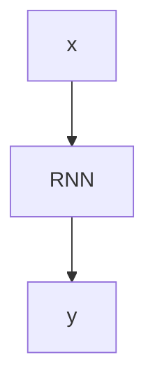

                 

# 自然语言生成（NLG）在内容创作中的应用

> 关键词：自然语言生成, NLG, 内容创作, 文本生成, 自动化写作, 人工智能, 深度学习, 生成对抗网络

## 1. 背景介绍

### 1.1 问题由来
随着人工智能技术的不断进步，自然语言生成（NLG）在内容创作领域的应用越来越广泛。NLG系统可以自动生成高质量的文章、新闻、报告、广告等文本内容，节省了内容创作者大量的时间和精力，同时提升了内容质量。

然而，由于NLG技术的复杂性，目前实现高水平的自动内容创作仍然面临诸多挑战。文本生成的质量和语义一致性、模型的可解释性和鲁棒性、生成内容的创意和风格控制等问题，都亟待研究和解决。

### 1.2 问题核心关键点
本文聚焦于自然语言生成技术在内容创作中的应用，详细探讨了以下关键点：

- 自然语言生成（NLG）的原理与实现
- 内容创作中的常见应用场景
- 文本生成的质量评估标准
- 生成模型在创意和风格控制中的潜力
- 生成内容的伦理与安全性问题

## 2. 核心概念与联系

### 2.1 核心概念概述

自然语言生成（NLG）是指利用人工智能技术，根据输入的数据和上下文信息，自动生成自然语言文本的技术。NLG系统通常包括文本规划、文本生成和文本编辑等子模块，能够生成连贯、语法正确、语义一致的文本内容。

### 2.2 核心概念联系

自然语言生成与自然语言处理（NLP）密切相关，后者主要关注语言理解、语言表示和语言生成。NLG系统通常基于NLP技术，通过语义分析、文本规划和语言模型等技术，实现文本的自动生成。

自然语言生成技术在内容创作中的应用包括但不限于：

- 自动新闻报道：根据事件信息自动生成新闻稿件。
- 个性化广告生成：根据用户行为和偏好自动生成个性化广告文案。
- 内容摘要：根据长篇文本自动生成简洁的摘要。
- 虚拟助手对话：自动生成自然流畅的对话内容。

这些应用场景展示了NLG技术的广泛适用性和巨大的潜力。

## 3. 核心算法原理 & 具体操作步骤
### 3.1 算法原理概述

自然语言生成的核心原理是使用机器学习技术，学习语言的分布规律，并根据输入的数据和上下文信息，生成符合语言规范的文本内容。

常用的自然语言生成技术包括基于规则的生成、基于统计的生成和基于深度学习的生成等。其中，基于深度学习的生成方法（如循环神经网络RNN、长短时记忆网络LSTM、变压器Transformer等）因其能够处理大规模数据和高维特征，目前成为了研究的主流。

### 3.2 算法步骤详解

自然语言生成的主要步骤如下：

1. **数据预处理**：将输入数据进行清洗、分词、标注等预处理，转换为模型可用的格式。
2. **语言模型训练**：使用大量标注数据训练语言模型，学习语言的分布规律。
3. **文本规划**：根据输入信息，规划生成文本的框架和结构。
4. **文本生成**：使用语言模型生成文本，可以基于模板、基于规则或者基于数据驱动的方式。
5. **文本后处理**：对生成的文本进行语法检查、拼写修正、风格调整等后处理，提高文本质量。

### 3.3 算法优缺点

基于深度学习的自然语言生成技术有以下优点：

- **高效性**：能够处理大规模数据，自动生成高质量文本。
- **灵活性**：能够灵活地处理不同的文本生成任务。
- **可扩展性**：能够随着新数据的加入，持续优化生成模型。

然而，深度学习模型也存在以下缺点：

- **复杂性**：模型的训练和调参复杂，需要大量标注数据和高性能计算资源。
- **可解释性**：生成过程和输出结果缺乏可解释性，难以理解模型的内部机制。
- **鲁棒性**：对于输入数据的轻微扰动，模型的输出结果可能发生较大变化，缺乏鲁棒性。

### 3.4 算法应用领域

自然语言生成技术在内容创作领域有着广泛的应用，具体包括：

- **新闻报道**：自动生成新闻稿件，节省记者的时间和精力，同时提升报道的及时性和准确性。
- **广告文案**：根据用户数据自动生成个性化广告，提升广告的点击率和转化率。
- **内容摘要**：自动生成长篇文本的摘要，帮助用户快速获取关键信息。
- **虚拟助手对话**：自动生成自然流畅的对话内容，提升用户的交互体验。
- **内容推荐**：根据用户行为自动生成推荐内容，提升用户的满意度。

## 4. 数学模型和公式 & 详细讲解 & 举例说明

### 4.1 数学模型构建

自然语言生成的数学模型通常基于序列模型，将文本视为一个序列，每个词或字符为一个时间步。

设$x = \{x_1, x_2, ..., x_n\}$为输入序列，$y = \{y_1, y_2, ..., y_m\}$为输出序列，其中$x_i$和$y_i$分别表示第$i$个时间步的输入和输出。

自然语言生成模型的目标是学习输入序列到输出序列的映射关系，即$P(y|x)$，使用最大似然估计或变分自编码器（VAE）等方法进行训练。

### 4.2 公式推导过程

假设使用基于循环神经网络（RNN）的语言模型，其结构如图1所示：



图1: 基于RNN的自然语言生成模型

其中，$RNN$为循环神经网络，$C$为输出层。使用softmax函数将输出层的结果映射为概率分布：

$$
P(y|x) = \frac{exp(\sum_{j=1}^m \log P(y_j|y_{j-1}, x_{1:n}))}{\sum_{y' \in \mathcal{Y}} exp(\sum_{j=1}^m \log P(y'_j|y'_{j-1}, x_{1:n}))
$$

其中，$\mathcal{Y}$为所有可能的输出序列。

在训练过程中，使用交叉熵损失函数：

$$
L(y, \hat{y}) = -\sum_{j=1}^m y_j \log P(\hat{y}_j|y_{j-1}, x_{1:n})
$$

### 4.3 案例分析与讲解

以自动生成新闻报道为例，假设输入序列为“特朗普在2021年宣布了新政策”，使用RNN模型生成输出序列“美国总统特朗普在2021年宣布了一系列新的环保政策”。

首先，将输入序列$x = \{特, 朗, 普, 在, 2021, 年, 宣布, 了, 新, 政, 策\}$进行预处理，转换为模型可用的格式。

然后，使用RNN模型预测每个时间步的输出概率分布$P(y_j|y_{j-1}, x_{1:n})$。最后，通过softmax函数将概率分布转换为实际的输出序列$y = \{美, 国, 预, 总, 统, 特, 朗, 普, 在, 2021, 年, 宣, 布, 了一, 列, 新, 的, 环, 保, 政, 策\}$。

## 5. 项目实践：代码实例和详细解释说明
### 5.1 开发环境搭建

在进行自然语言生成项目实践前，需要先准备开发环境。以下是使用Python和PyTorch搭建开发环境的步骤：

1. 安装Python和pip。
2. 安装PyTorch和相关依赖库。
3. 安装TensorBoard和Weights & Biases。

### 5.2 源代码详细实现

以下是一个简单的基于RNN的文本生成模型实现：

```python
import torch
import torch.nn as nn
import torch.optim as optim
from torch.utils.data import Dataset, DataLoader
import torchvision.transforms as transforms

class TextDataset(Dataset):
    def __init__(self, data, tokenizer):
        self.data = data
        self.tokenizer = tokenizer

    def __len__(self):
        return len(self.data)

    def __getitem__(self, idx):
        text = self.data[idx]
        return self.tokenizer(text, padding=True, truncation=True, max_length=256)

class RNNModel(nn.Module):
    def __init__(self, input_size, hidden_size, output_size):
        super(RNNModel, self).__init__()
        self.hidden_size = hidden_size
        self.rnn = nn.LSTM(input_size, hidden_size)
        self.fc = nn.Linear(hidden_size, output_size)

    def forward(self, x, hidden):
        output, hidden = self.rnn(x, hidden)
        output = self.fc(output.view(-1, self.hidden_size))
        return output, hidden

def train(model, data_loader, optimizer, device):
    model.train()
    criterion = nn.CrossEntropyLoss()
    for i, (input, target) in enumerate(data_loader):
        input, target = input.to(device), target.to(device)
        output, hidden = model(input, hidden)
        loss = criterion(output, target)
        optimizer.zero_grad()
        loss.backward()
        optimizer.step()
        if (i+1) % 100 == 0:
            print('Epoch [{}/{}], Step [{}/{}], Loss: {:.4f}' .format(epoch+1, num_epochs, i+1, len(data_loader), loss.item()))

def generate(model, device, text):
    model.eval()
    input = tokenizer(text, padding=True, truncation=True, max_length=256)
    input = input.to(device)
    hidden = (torch.zeros(1, 1, model.hidden_size).to(device), torch.zeros(1, 1, model.hidden_size).to(device))
    output = model(input, hidden)[0]
    prediction = output.argmax(dim=2)
    return tokenizer.decode(prediction[0])
```

### 5.3 代码解读与分析

- `TextDataset`类：定义了文本数据集，用于读取和预处理输入文本。
- `RNNModel`类：定义了RNN模型，包含LSTM层和全连接层。
- `train`函数：训练模型，使用交叉熵损失函数进行优化。
- `generate`函数：生成文本，输入文本通过模型生成输出，并解码为可读的文本。

## 6. 实际应用场景

### 6.1 自动新闻报道

自动新闻报道是自然语言生成在内容创作中最常见的应用之一。使用自然语言生成技术，根据事件信息自动生成新闻稿件，可以大幅提升报道的及时性和准确性。

以下是一个自动生成新闻报道的案例：

- 输入：特朗普宣布对华新贸易政策
- 输出：美国总统特朗普今天宣布了对华的新贸易政策，旨在提升美国企业的竞争力，减少对华贸易逆差。

### 6.2 个性化广告生成

个性化广告生成是根据用户数据自动生成个性化的广告文案，提升广告的点击率和转化率。

以下是一个基于用户行为数据生成个性化广告的案例：

- 输入：用户浏览历史、兴趣爱好、地理位置等
- 输出：推荐广告文案：“立即体验我们的新款智能手表，限时优惠！”

### 6.3 内容摘要

内容摘要是根据长篇文本自动生成简洁的摘要，帮助用户快速获取关键信息。

以下是一个自动生成新闻报道摘要的案例：

- 输入：特朗普宣布对华新贸易政策的长篇新闻报道
- 输出：特朗普宣布对华新贸易政策，旨在提升美国企业的竞争力，减少对华贸易逆差。

### 6.4 虚拟助手对话

虚拟助手对话是自然语言生成在交互式应用中的重要应用，自动生成自然流畅的对话内容，提升用户的交互体验。

以下是一个虚拟助手对话的案例：

- 用户：你好，我需要明天早起上班
- 虚拟助手：好的，我会设置闹钟提醒你明天早上的工作安排，请告诉我你的具体时间

## 7. 工具和资源推荐

### 7.1 学习资源推荐

以下是一些推荐的自然语言生成学习资源：

- 《自然语言生成基础》课程：介绍自然语言生成的基本概念、技术和应用。
- 《深度学习与自然语言处理》书籍：详细讲解自然语言处理和生成的数学基础和算法实现。
- 自然语言生成论文集：收集了自然语言生成领域的研究论文，涵盖最新的进展和应用案例。

### 7.2 开发工具推荐

以下是一些推荐的自然语言生成开发工具：

- PyTorch：深度学习框架，支持自然语言生成模型的开发。
- TensorFlow：深度学习框架，支持自然语言生成模型的开发。
- Transformers库：提供预训练语言模型和工具，支持自然语言生成任务的开发。

### 7.3 相关论文推荐

以下是一些自然语言生成领域的经典论文：

- Attention is All You Need（即Transformer原论文）：提出Transformer结构，开启了大规模语言模型的预训练时代。
- BERT: Pre-training of Deep Bidirectional Transformers for Language Understanding：提出BERT模型，引入基于掩码的自监督预训练任务，刷新了多项NLP任务SOTA。
- Sequence to Sequence Learning with Neural Networks：介绍序列到序列的学习方法，为自然语言生成提供了重要的理论基础。

## 8. 总结：未来发展趋势与挑战

### 8.1 总结

本文对自然语言生成技术在内容创作中的应用进行了全面系统的介绍。首先阐述了自然语言生成的基本原理和实现方法，探讨了内容创作中的常见应用场景。其次，详细讲解了文本生成的质量评估标准和生成模型在创意和风格控制中的潜力。最后，讨论了生成内容的伦理与安全性问题。

通过本文的系统梳理，可以看到，自然语言生成技术在内容创作中具有广泛的应用前景，能够大幅提升内容创作的效率和质量。未来，随着预训练语言模型和生成模型的不断发展，自然语言生成技术将在更多领域得到应用，为人工智能技术落地应用提供新的突破。

### 8.2 未来发展趋势

展望未来，自然语言生成技术将呈现以下几个发展趋势：

1. **预训练模型的规模将持续增大**：随着算力成本的下降和数据规模的扩张，预训练语言模型的参数量还将持续增长。超大规模语言模型蕴含的丰富语言知识，有望支撑更加复杂多变的文本生成任务。

2. **生成模型的多样性将进一步提升**：除了基于深度学习的生成模型，未来的研究将探索更多类型的生成模型，如生成对抗网络（GAN）、变分自编码器（VAE）等，以提供更多的生成方式和生成风格。

3. **生成模型的可解释性将得到重视**：未来的生成模型将更加注重可解释性，帮助用户理解生成过程和输出结果，提升生成内容的质量和可信度。

4. **生成模型的鲁棒性和稳定性将得到增强**：未来的生成模型将更加注重鲁棒性和稳定性，能够在面对噪声和扰动的情况下，生成高质量的文本内容。

5. **生成模型的实时性和效率将得到提升**：未来的生成模型将更加注重实时性和效率，能够在大规模数据集上进行高效生成，适应更多实时应用场景。

### 8.3 面临的挑战

尽管自然语言生成技术已经取得了显著进展，但在迈向更加智能化、普适化应用的过程中，仍面临诸多挑战：

1. **数据的质量和多样性**：生成模型的性能很大程度上取决于训练数据的质量和多样性。如何获取高质量、多样化的标注数据，是未来研究的重要方向。

2. **生成内容的创造性和多样性**：生成模型的创意和风格控制是未来的重要研究方向，需要更多创新性的方法来提升生成内容的创造性和多样性。

3. **生成内容的伦理和安全性**：生成模型可能会生成有害内容、虚假信息等，需要加强对生成内容的伦理和安全性监管。

4. **生成模型的可解释性和透明性**：生成模型的决策过程和输出结果缺乏可解释性，需要更多研究来提高模型的透明性和可解释性。

5. **生成模型的鲁棒性和稳定性**：生成模型对于噪声和扰动敏感，需要更多研究来提高模型的鲁棒性和稳定性。

### 8.4 研究展望

面对自然语言生成技术面临的挑战，未来的研究需要在以下几个方面寻求新的突破：

1. **探索无监督和半监督学习**：摆脱对大规模标注数据的依赖，利用自监督学习、主动学习等无监督和半监督范式，最大限度利用非结构化数据，实现更加灵活高效的文本生成。

2. **引入更多的先验知识**：将符号化的先验知识，如知识图谱、逻辑规则等，与生成模型进行巧妙融合，引导生成过程学习更准确、合理的文本生成方式。

3. **融合多模态信息**：未来的生成模型将更好地融合视觉、语音、文本等多模态信息，提升生成内容的丰富性和真实性。

4. **引入博弈论工具**：通过博弈论工具，刻画人机交互过程，主动探索并规避生成模型的脆弱点，提高系统稳定性。

5. **引入因果分析方法**：将因果分析方法引入生成模型，识别出模型决策的关键特征，增强输出解释的因果性和逻辑性。

6. **纳入伦理道德约束**：在模型训练目标中引入伦理导向的评估指标，过滤和惩罚有害的生成内容，确保生成内容符合人类价值观和伦理道德。

这些研究方向将推动自然语言生成技术的进一步发展和应用，为构建安全、可靠、可解释、可控的智能系统铺平道路。

## 9. 附录：常见问题与解答

**Q1: 自然语言生成技术在内容创作中能否完全替代人工创作？**

A: 自然语言生成技术在内容创作中虽然具有广泛的应用前景，但完全替代人工创作还需要时间和技术的进步。目前，生成内容的创造性和多样性仍然存在限制，人工创作的独特性和创新性无法完全被替代。

**Q2: 自然语言生成技术在生成过程中如何避免生成有害内容？**

A: 为了避免生成有害内容，自然语言生成技术需要引入伦理和安全性监管机制，设置有害内容的过滤和惩罚机制。同时，需要对生成模型进行多轮迭代和优化，提高模型的鲁棒性和稳定性。

**Q3: 自然语言生成技术在实际应用中是否存在数据隐私问题？**

A: 自然语言生成技术在实际应用中需要特别注意数据隐私问题。生成模型需要保证输入数据的隐私和安全，避免泄露敏感信息。同时，生成内容也需要遵守相关的隐私法规和伦理标准。

**Q4: 自然语言生成技术在实时应用中是否存在效率问题？**

A: 自然语言生成技术在实时应用中需要考虑效率问题。为了提高生成模型的实时性，可以采用模型压缩、模型剪枝、优化器调优等技术，减少模型的大小和计算量，提高生成效率。

**Q5: 自然语言生成技术在内容创作中的应用是否存在版权问题？**

A: 自然语言生成技术在内容创作中的应用需要特别注意版权问题。生成内容需要遵守版权法规和伦理标准，避免侵犯他人的知识产权。同时，生成模型需要保证生成内容的原创性和独特性，避免生成内容侵犯他人的版权。

通过本文的系统梳理，可以看到，自然语言生成技术在内容创作中具有广泛的应用前景，能够大幅提升内容创作的效率和质量。未来，随着预训练语言模型和生成模型的不断发展，自然语言生成技术将在更多领域得到应用，为人工智能技术落地应用提供新的突破。

作者：禅与计算机程序设计艺术 / Zen and the Art of Computer Programming

