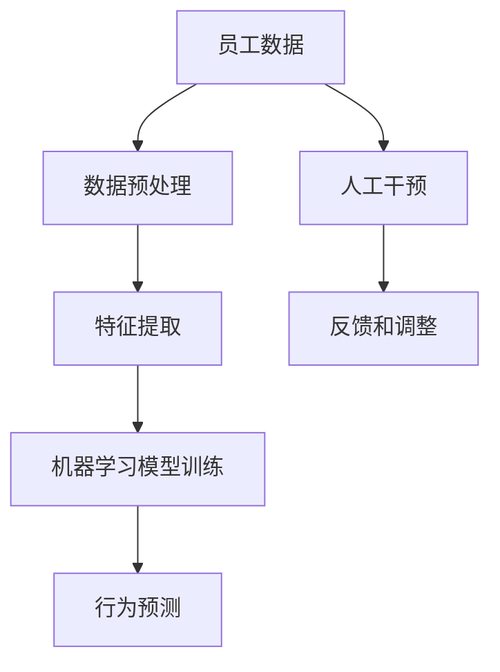

                 

## 1. 背景介绍

### 1.1 问题由来

在全球化竞争日益加剧的今天，企业之间的竞争已经超越了传统的产品和服务竞争，转变为一场“人才”的竞争。企业管理者已经意识到，员工的行为和习惯直接决定了企业的效率、质量和创新能力。因此，如何塑造员工良好的工作习惯，成为企业管理的一项重要课题。然而，传统的管理方法往往需要大量的监督和管理成本，难以真正实现高效的团队管理。

### 1.2 问题核心关键点

在数字化转型的背景下，企业对团队管理的需求更加复杂多样。一方面，企业需要能够实时监控员工的工作状态和行为，以便及时发现和解决问题。另一方面，企业还需要能够个性化地管理员工，使其能够最大化地发挥自己的潜能。行为模型作为一门新兴的管理工具，正是应运而生。它通过收集员工的工作数据，利用机器学习和人工智能技术，帮助管理者更好地理解和塑造员工的行为和习惯。

## 2. 核心概念与联系

### 2.1 核心概念概述

为了更好地理解行为模型，我们将介绍几个相关的核心概念：

- **行为模型**：利用机器学习技术，基于员工的工作数据，建立模型以预测和塑造员工行为习惯的工具。行为模型可以预测员工的绩效、工作态度、工作满意度等，从而帮助管理者制定更有效的管理策略。
- **员工数据**：员工在工作过程中产生的各种数据，如工作日志、会议记录、电子邮件、聊天记录等。这些数据可以用来训练行为模型，帮助管理者了解员工的工作状态和行为。
- **机器学习**：一种基于数据训练的模型构建技术，能够自动发现数据中的模式和规律，并用于预测和决策。在行为模型中，机器学习技术被用于训练模型，从而预测员工的行为和习惯。
- **人工智能**：一种基于计算机的智能技术，能够模拟人类的思维过程和决策能力。在行为模型中，人工智能技术被用于分析和处理员工数据，从而提供更准确的预测和决策。

这些核心概念之间有着紧密的联系。员工数据是行为模型的基础，机器学习是行为模型的核心技术，而人工智能则是行为模型中用于分析和处理数据的手段。通过这些技术的结合，行为模型可以更加准确地预测和塑造员工的行为和习惯。

### 2.2 核心概念原理和架构的 Mermaid 流程图



这个流程图展示了行为模型的核心流程。首先，员工数据需要经过预处理和特征提取，用于训练机器学习模型。通过模型训练，行为模型可以预测员工的行为和习惯。在预测结果的基础上，管理者可以采取人工干预措施，帮助员工改善工作状态。最后，通过反馈和调整，不断优化行为模型，使其更加准确和高效。

## 3. 核心算法原理 & 具体操作步骤

### 3.1 算法原理概述

行为模型的核心算法包括数据预处理、特征提取、模型训练和行为预测。

**数据预处理**：对员工数据进行清洗和标准化，以去除噪声和异常值，确保数据的质量和一致性。

**特征提取**：从员工数据中提取有用的特征，用于训练机器学习模型。这些特征可以包括工作时长、工作质量、工作态度、工作满意度等。

**模型训练**：利用机器学习技术，对特征数据进行训练，建立行为预测模型。常用的机器学习算法包括线性回归、决策树、随机森林、神经网络等。

**行为预测**：利用训练好的模型，对员工的行为和习惯进行预测。通过预测结果，管理者可以采取相应的管理措施，帮助员工改进工作状态。

### 3.2 算法步骤详解

1. **数据收集**：收集员工的工作数据，包括工作日志、会议记录、电子邮件、聊天记录等。

2. **数据预处理**：对数据进行清洗和标准化，去除噪声和异常值，确保数据的质量和一致性。

3. **特征提取**：从数据中提取有用的特征，如工作时长、工作质量、工作态度、工作满意度等。

4. **模型训练**：利用机器学习技术，对特征数据进行训练，建立行为预测模型。

5. **行为预测**：利用训练好的模型，对员工的行为和习惯进行预测。

6. **人工干预**：根据预测结果，管理者可以采取人工干预措施，帮助员工改善工作状态。

7. **反馈和调整**：通过反馈机制，不断优化行为模型，使其更加准确和高效。

### 3.3 算法优缺点

行为模型具有以下优点：

- **实时监控**：行为模型可以实时监控员工的工作状态和行为，帮助管理者及时发现和解决问题。
- **个性化管理**：行为模型可以根据员工的特点和需求，提供个性化的管理策略，帮助员工最大化地发挥自己的潜能。
- **高效性**：行为模型通过机器学习和人工智能技术，可以自动发现数据中的模式和规律，从而提供更准确的预测和决策。

行为模型也存在以下缺点：

- **数据隐私**：行为模型需要收集大量的员工数据，可能会涉及到员工隐私问题，需要严格的保护措施。
- **模型复杂度**：行为模型的实现需要大量的数据和计算资源，模型复杂度较高，可能难以在大规模企业中应用。
- **结果解释性**：行为模型的预测结果可能会比较复杂，难以进行解释和理解，管理者需要具备一定的技术背景。

### 3.4 算法应用领域

行为模型已经被广泛应用于以下领域：

- **人力资源管理**：行为模型可以预测员工的绩效、工作态度、工作满意度等，帮助企业进行人力资源规划和管理。
- **团队协作**：行为模型可以预测员工之间的协作效果，帮助管理者优化团队结构，提高团队效率。
- **培训与发展**：行为模型可以预测员工的学习效果和发展潜力，帮助企业制定个性化的培训计划。
- **健康与福利**：行为模型可以预测员工的工作压力和健康状况，帮助企业提供个性化的健康与福利计划。

## 4. 数学模型和公式 & 详细讲解 & 举例说明

### 4.1 数学模型构建

行为模型的数学模型可以表示为：

$$
y = f(x; \theta)
$$

其中 $y$ 表示行为预测结果，$x$ 表示员工数据特征，$f$ 表示机器学习模型，$\theta$ 表示模型的参数。

### 4.2 公式推导过程

以线性回归模型为例，其公式推导过程如下：

假设员工数据特征为 $x_1, x_2, ..., x_n$，行为预测结果为 $y$，线性回归模型的公式可以表示为：

$$
y = \beta_0 + \beta_1 x_1 + \beta_2 x_2 + ... + \beta_n x_n + \epsilon
$$

其中 $\beta_0, \beta_1, \beta_2, ..., \beta_n$ 为模型的系数，$\epsilon$ 为误差项。通过对数据进行最小二乘法求解，可以得到模型的系数：

$$
\beta_j = \frac{\sum_{i=1}^n (x_{ij} - \bar{x}_j)(y_i - \bar{y})}{\sum_{i=1}^n (x_{ij} - \bar{x}_j)^2}
$$

其中 $x_{ij}$ 为员工数据特征的第 $j$ 个指标，$\bar{x}_j$ 为第 $j$ 个指标的均值，$y_i$ 为行为预测结果，$\bar{y}$ 为预测结果的均值。

### 4.3 案例分析与讲解

假设某企业收集了员工的工作数据，包括工作时长、工作质量、工作态度和工作满意度等。利用这些数据，建立了一个线性回归模型，用于预测员工的工作绩效。通过模型训练，得到了以下系数：

$$
\beta_1 = 0.2, \beta_2 = 0.5, \beta_3 = -0.1, \beta_4 = 0.3
$$

假设某员工的工作时长为 $x_1 = 8$ 小时，工作质量为 $x_2 = 0.9$，工作态度为 $x_3 = 0.7$，工作满意度为 $x_4 = 0.5$，则可以通过以下公式计算其行为预测结果：

$$
y = 0.2 \times 8 + 0.5 \times 0.9 + (-0.1) \times 0.7 + 0.3 \times 0.5 = 3.3
$$

## 5. 项目实践：代码实例和详细解释说明

### 5.1 开发环境搭建

在搭建开发环境之前，需要先安装 Python 和相关的库。以下是安装步骤：

1. 安装 Python：下载并安装 Python 3.7 或更高版本。
2. 安装 NumPy、Pandas、Scikit-learn 和 Matplotlib 等库：

```bash
pip install numpy pandas scikit-learn matplotlib
```

3. 安装机器学习库 TensorFlow 或 PyTorch：

```bash
pip install tensorflow
# 或
pip install torch torchvision torchaudio
```

### 5.2 源代码详细实现

假设某企业收集了员工的工作数据，包括工作时长、工作质量、工作态度和工作满意度等。现在我们将使用 Scikit-learn 库中的线性回归模型进行行为预测。以下是代码实现：

```python
import numpy as np
from sklearn.linear_model import LinearRegression

# 假设员工数据
X = np.array([[8, 0.9, 0.7, 0.5], [10, 0.8, 0.6, 0.4], [12, 0.7, 0.5, 0.3]])
y = np.array([3.3, 4.2, 5.1])

# 建立线性回归模型
model = LinearRegression()
model.fit(X, y)

# 预测员工行为
x_new = np.array([[9, 0.9, 0.6, 0.4]])
y_new = model.predict(x_new)
print("预测结果为：", y_new)
```

### 5.3 代码解读与分析

上述代码中，我们首先定义了员工数据 $X$ 和行为预测结果 $y$。然后，使用 Scikit-learn 库中的 `LinearRegression` 类建立线性回归模型，并使用 `fit` 方法对数据进行训练。最后，使用 `predict` 方法对新员工数据进行预测，并输出预测结果。

## 6. 实际应用场景

### 6.1 智能客服系统

行为模型可以应用于智能客服系统的构建。智能客服系统能够根据客户的历史行为数据，预测客户的需求和行为，从而提供个性化的服务。通过行为模型，客服系统可以识别客户的问题类型、解决难度、情感倾向等，并提供相应的回答和解决方案。

### 6.2 金融风险管理

行为模型可以应用于金融风险管理。金融机构可以收集客户的交易数据、行为数据等，建立行为模型，预测客户的风险水平。通过行为模型，金融机构可以识别高风险客户，采取相应的风险控制措施，降低金融风险。

### 6.3 零售电商推荐

行为模型可以应用于零售电商的推荐系统。电商平台可以收集用户的历史购买数据、浏览数据、评价数据等，建立行为模型，预测用户的购买意愿和需求。通过行为模型，电商平台可以向用户推荐个性化的商品，提高销售额和用户满意度。

### 6.4 未来应用展望

随着技术的发展，行为模型将有更广泛的应用前景。例如：

- **个性化医疗**：医疗机构可以收集患者的历史数据，建立行为模型，预测患者的健康状况和治疗效果。通过行为模型，医疗机构可以提供个性化的医疗方案，提高治疗效果。
- **智慧城市**：城市管理者可以收集居民的行为数据，建立行为模型，预测居民的需求和行为。通过行为模型，城市管理者可以优化城市规划，提高城市管理效率。
- **安全监控**：企业可以收集员工的行为数据，建立行为模型，预测员工的安全行为和潜在风险。通过行为模型，企业可以采取相应的安全措施，保障员工的安全。

## 7. 工具和资源推荐

### 7.1 学习资源推荐

1. 《Python数据科学手册》：介绍 Python 在数据科学领域的应用，适合初学者和进阶者。
2. 《机器学习实战》：介绍机器学习的基本概念和实践技巧，适合入门和进阶者。
3. 《深度学习入门》：介绍深度学习的基本概念和实践技巧，适合入门和进阶者。
4. 《Scikit-learn官方文档》：Scikit-learn 库的官方文档，包含丰富的案例和应用，适合实践者。
5. Kaggle：机器学习竞赛平台，提供丰富的数据集和比赛，适合实践者。

### 7.2 开发工具推荐

1. PyTorch：深度学习框架，支持动态计算图，适合动态模型和实时应用。
2. TensorFlow：深度学习框架，支持静态计算图，适合大规模模型和大数据集。
3. Scikit-learn：机器学习库，包含丰富的机器学习算法和工具，适合数据挖掘和分析。
4. Weights & Biases：实验跟踪工具，可以记录和可视化实验结果，适合实验管理和优化。
5. TensorBoard：可视化工具，可以实时监测模型训练状态，适合模型调试和优化。

### 7.3 相关论文推荐

1. 《行为模型在人力资源管理中的应用》：介绍行为模型在人力资源管理中的实践案例和效果评估。
2. 《利用机器学习预测员工行为》：介绍利用机器学习预测员工行为的研究方法和结果。
3. 《智能客服系统中的行为预测》：介绍智能客服系统中的行为模型构建和应用。
4. 《基于行为模型的金融风险管理》：介绍基于行为模型的金融风险管理方法。
5. 《基于行为模型的推荐系统》：介绍基于行为模型的推荐系统构建和应用。

## 8. 总结：未来发展趋势与挑战

### 8.1 研究成果总结

行为模型作为一种新兴的管理工具，已经在多个领域展示了其强大的应用前景和潜力。通过收集和分析员工数据，行为模型能够预测和塑造员工的行为和习惯，帮助管理者制定更有效的管理策略。行为模型已经被广泛应用于人力资源管理、智能客服系统、金融风险管理、零售电商推荐等领域。

### 8.2 未来发展趋势

未来，行为模型将呈现以下几个发展趋势：

1. **数据驱动**：行为模型将更加注重数据的质量和多样性，利用更多的数据源和数据类型，提高预测的准确性和稳定性。
2. **模型集成**：行为模型将更加注重模型的多样性和集成性，通过结合多种机器学习算法和人工智能技术，提高模型的泛化能力和鲁棒性。
3. **个性化管理**：行为模型将更加注重个性化的管理策略，通过个性化的行为预测和管理，提高员工的工作满意度和绩效。
4. **实时监控**：行为模型将更加注重实时监控和反馈，通过实时监控员工的行为和状态，及时发现和解决问题，提高管理效率。

### 8.3 面临的挑战

尽管行为模型已经在多个领域展示了其应用前景，但在实际应用中，仍面临一些挑战：

1. **数据隐私**：行为模型需要收集大量的员工数据，可能会涉及到员工隐私问题，需要严格的保护措施。
2. **模型复杂度**：行为模型的实现需要大量的数据和计算资源，模型复杂度较高，可能难以在大规模企业中应用。
3. **结果解释性**：行为模型的预测结果可能会比较复杂，难以进行解释和理解，管理者需要具备一定的技术背景。
4. **实时性**：行为模型需要实时监控和反馈，对系统的实时性和稳定性提出了较高的要求。

### 8.4 研究展望

未来，行为模型的研究将更加注重以下几个方面：

1. **数据保护和隐私**：探索更加高效的数据保护和隐私保护技术，确保员工数据的安全性和隐私性。
2. **模型优化和简化**：研究更加高效和简洁的行为模型，降低模型的复杂度，提高模型的可解释性和实时性。
3. **多模态融合**：探索多模态数据融合技术，将行为模型与其他数据源和技术进行结合，提高模型的泛化能力和鲁棒性。
4. **人机协同**：探索人机协同技术，将行为模型与人工干预和管理进行结合，提高模型的决策能力和可解释性。

总之，行为模型作为一种新兴的管理工具，具有广泛的应用前景和潜力。通过不断优化和改进行为模型，相信它将在未来的企业管理中发挥越来越重要的作用。

## 9. 附录：常见问题与解答

**Q1: 行为模型需要收集哪些员工数据？**

A: 行为模型需要收集员工在工作过程中产生的数据，包括工作日志、会议记录、电子邮件、聊天记录等。这些数据可以用来训练模型，帮助管理者了解员工的工作状态和行为。

**Q2: 如何确保员工数据的安全性和隐私性？**

A: 确保员工数据的安全性和隐私性，需要采取以下措施：

1. 数据匿名化：对数据进行匿名化处理，去除与员工身份相关的信息，保护员工隐私。
2. 数据加密：对数据进行加密处理，防止数据泄露和非法访问。
3. 数据访问控制：对数据访问进行严格控制，确保只有授权人员可以访问数据。
4. 数据存储安全：对数据存储进行严格管理，确保数据存储的安全性和可靠性。

**Q3: 行为模型有哪些常用的机器学习算法？**

A: 常用的机器学习算法包括：

1. 线性回归：适用于预测连续型的行为数据，如工作绩效、工作满意度等。
2. 决策树和随机森林：适用于预测离散型的行为数据，如工作态度、工作状态等。
3. 神经网络：适用于处理复杂的数据关系和模式，适用于行为预测和分类任务。

**Q4: 行为模型需要考虑哪些因素？**

A: 行为模型需要考虑以下因素：

1. 数据质量：数据需要经过清洗和标准化，去除噪声和异常值，确保数据的质量和一致性。
2. 模型选择：根据数据的特点和任务的需求，选择合适的机器学习算法和模型。
3. 特征提取：从数据中提取有用的特征，用于训练机器学习模型。
4. 模型训练：利用机器学习技术，对特征数据进行训练，建立行为预测模型。
5. 行为预测：利用训练好的模型，对员工的行为和习惯进行预测。
6. 人工干预：根据预测结果，管理者可以采取人工干预措施，帮助员工改善工作状态。
7. 反馈和调整：通过反馈机制，不断优化行为模型，使其更加准确和高效。

**Q5: 行为模型有哪些实际应用案例？**

A: 行为模型已经在多个领域展示了其应用前景和潜力，例如：

1. 人力资源管理：行为模型可以预测员工的绩效、工作态度、工作满意度等，帮助企业进行人力资源规划和管理。
2. 团队协作：行为模型可以预测员工之间的协作效果，帮助管理者优化团队结构，提高团队效率。
3. 培训与发展：行为模型可以预测员工的学习效果和发展潜力，帮助企业制定个性化的培训计划。
4. 健康与福利：行为模型可以预测员工的工作压力和健康状况，帮助企业提供个性化的健康与福利计划。

**Q6: 如何优化行为模型的性能？**

A: 优化行为模型的性能，可以采取以下措施：

1. 数据增强：通过回译、近义替换等方式扩充训练集，提高模型的泛化能力。
2. 正则化技术：使用L2正则、Dropout等正则化技术，防止模型过度适应小规模训练集。
3. 模型集成：通过结合多种机器学习算法和人工智能技术，提高模型的泛化能力和鲁棒性。
4. 超参数优化：通过超参数调优，选择最优的模型参数，提高模型的预测精度和性能。
5. 模型压缩和优化：通过模型压缩和优化，降低模型的复杂度和计算资源消耗，提高模型的实时性和可扩展性。

---

作者：禅与计算机程序设计艺术 / Zen and the Art of Computer Programming

