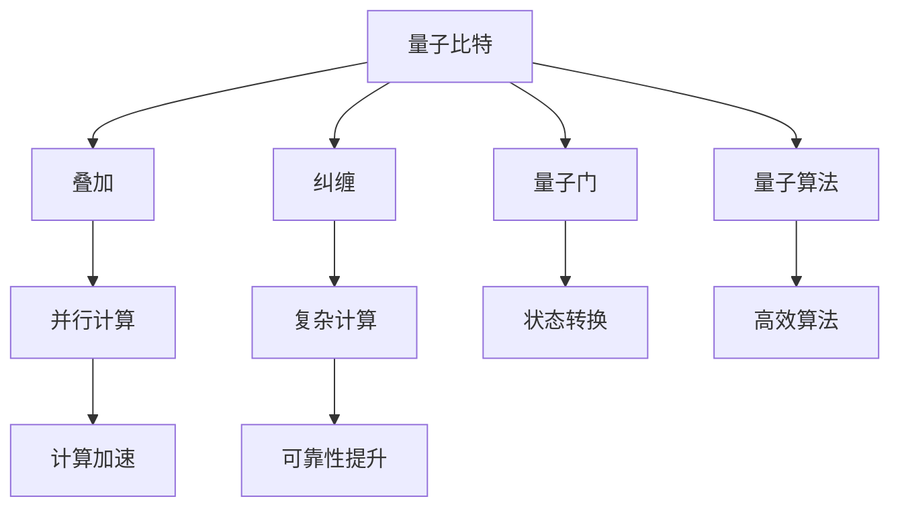

                 

# 量子计算：下一代计算技术的探索

## 1. 背景介绍

### 1.1 问题由来
随着信息技术的迅猛发展，计算能力已经成为衡量一个国家科技竞争力的重要标志。传统计算机基于二进制比特(bit)作为信息单位，其计算能力受到量子力学的基本限制——摩尔定律已经逐渐失效。在这样的背景下，量子计算成为新一代计算技术的重要研究方向，被寄予了实现指数级计算加速的期望。

### 1.2 问题核心关键点
量子计算的魅力在于其潜在的并行计算能力。经典计算机使用比特进行运算，每次只能处理一个比特的状态，而量子计算机使用量子比特(quantum bit, qubit)进行运算，可以同时处理多个状态。这使得量子计算机在某些特定问题上，如大数分解、搜索问题、优化问题等，具有指数级的加速优势。

然而，量子计算也面临着诸多挑战：
1. 技术实现困难：量子比特容易受到环境干扰，导致量子态的退相干，需要复杂的技术手段进行保护。
2. 错误率高：量子计算机的错误率相对较高，且错误随时间累积，需要高效的纠错算法来提升计算可靠性。
3. 应用领域局限：目前量子计算机尚无法处理复杂的经典计算问题，且开发难度高，难以在短时间内实现大规模商业应用。

尽管存在诸多挑战，但量子计算的潜力巨大，被广泛认为是未来计算技术的重要发展方向。本文将系统介绍量子计算的核心概念、算法原理以及实际应用场景，为读者提供全面深入的了解。

## 2. 核心概念与联系

### 2.1 核心概念概述

为了更好地理解量子计算的基本原理和应用，本节将介绍几个关键概念：

- **量子比特(qubit)**：量子计算的基本单位，具有叠加和纠缠等量子特性，可以同时代表0和1两种状态。
- **叠加(superposition)**：量子比特可以同时处于多个状态，这种性质使得量子计算机可以同时处理多个可能性，实现并行计算。
- **纠缠(entanglement)**：多个量子比特之间可以建立纠缠关系，一个量子比特的状态可以瞬间影响另一个量子比特的状态，这种特性使得量子计算机可以进行复杂的计算操作。
- **量子门(quantum gate)**：量子计算中的基本操作单元，通过量子门可以实现量子比特的状态转换。
- **量子算法(quantum algorithm)**：利用量子计算的特性设计出来的算法，如Shor算法、Grover算法等，具有高效的计算性能。
- **量子纠错(quantum error correction)**：由于量子比特容易受到环境干扰，导致计算错误，量子纠错算法通过冗余编码和信息保护，提升量子计算的可靠性。

这些核心概念之间的逻辑关系可以通过以下Mermaid流程图来展示：



这个流程图展示了大语言模型的核心概念及其之间的关系：

1. 量子比特通过叠加和纠缠等量子特性，实现并行计算和复杂计算。
2. 量子门通过状态转换实现量子计算的基本操作。
3. 量子算法利用量子比特的特性，设计高效的计算过程。
4. 量子纠错通过冗余编码和信息保护，提升量子计算的可靠性。

这些概念共同构成了量子计算的基础框架，使其能够高效处理复杂的计算问题。

## 3. 核心算法原理 & 具体操作步骤
### 3.1 算法原理概述

量子计算的核心在于利用量子比特的叠加和纠缠特性，进行高效的并行计算。其基本计算过程如下：

1. **初始化**：将量子比特置为初始状态，通常是叠加状态。
2. **量子门操作**：通过一系列量子门操作，将量子比特的状态进行转换。
3. **测量**：对量子比特进行测量，得到最终结果。

量子算法的核心在于设计合适的量子门操作序列，使得量子比特能够在多维度空间中高效演化，最终得到计算结果。

### 3.2 算法步骤详解

量子计算的基本步骤如下：

**Step 1: 初始化量子比特**
将量子比特置为初始状态，通常是叠加状态。

**Step 2: 应用量子门**
通过一系列量子门操作，将量子比特的状态进行转换。量子门包括单量子门、双量子门、可控量子门等，用于实现量子比特的状态演化。

**Step 3: 应用量子纠错**
量子比特容易受到环境干扰，导致计算错误。通过量子纠错算法，如Shor纠错、Steane纠错等，对量子比特进行保护，提升计算的可靠性。

**Step 4: 量子门操作序列**
设计合适的量子门操作序列，实现目标计算任务。例如，Shor算法利用量子叠加和干涉，高效计算大数的质因数分解；Grover算法利用量子叠加和测量，高效搜索未排序数据库。

**Step 5: 测量结果**
对量子比特进行测量，得到最终计算结果。量子测量通常存在一定的误差，需要通过多次测量取平均值，减少误差影响。

### 3.3 算法优缺点

量子计算的优势在于其潜在的并行计算能力，能够在某些特定问题上实现指数级的计算加速。其缺点则主要在于技术实现难度高、错误率高和应用领域有限。

量子计算的优势：
1. 并行计算能力：量子比特可以同时处于多个状态，实现高效的并行计算。
2. 高效算法：利用量子叠加和纠缠特性，设计出高效的计算算法，如Shor算法、Grover算法等。
3. 量子纠错：通过量子纠错算法，提高量子计算的可靠性。

量子计算的缺点：
1. 技术实现困难：量子比特容易受到环境干扰，需要复杂的技术手段进行保护。
2. 错误率高：量子计算机的错误率相对较高，且错误随时间累积。
3. 应用领域局限：目前量子计算机尚无法处理复杂的经典计算问题，且开发难度高，难以在短时间内实现大规模商业应用。

### 3.4 算法应用领域

量子计算已经在多个领域展现了其独特的优势，以下是几个典型的应用领域：

1. **密码学**：利用量子计算对大数进行质因数分解，破解当前广泛使用的RSA加密算法，威胁网络安全。
2. **优化问题**：在物流规划、金融投资等领域，利用量子计算高效求解复杂的优化问题，提升决策效率。
3. **药物研发**：利用量子计算模拟分子结构，加速新药的发现和筛选过程，提高研发效率。
4. **材料科学**：利用量子计算模拟材料的电子结构和物理性质，加速新材料的研发进程。
5. **人工智能**：利用量子计算优化机器学习算法，提升算法的训练速度和性能。

## 4. 数学模型和公式 & 详细讲解  
### 4.1 数学模型构建

本节将使用数学语言对量子计算的基本过程进行更加严格的刻画。

记量子比特为 $\mathcal{Q} = \{0, 1\}$，量子比特的状态表示为 $|\psi\rangle = \alpha|0\rangle + \beta|1\rangle$，其中 $\alpha, \beta \in \mathbb{C}$，满足归一化条件 $|\alpha|^2 + |\beta|^2 = 1$。量子门的矩阵表示为 $U$，量子比特的状态演化方程为 $|\psi'\rangle = U|\psi\rangle$。

量子计算的核心在于设计合适的量子门 $U$，使得量子比特在多维度空间中高效演化，最终得到计算结果。

### 4.2 公式推导过程

以下是几个基本的量子门及其推导过程：

**单量子门**：
- Pauli-X门：
  $$
  U_X|0\rangle = |1\rangle, \quad U_X|1\rangle = |0\rangle
  $$
- Pauli-Y门：
  $$
  U_Y|0\rangle = -i|1\rangle, \quad U_Y|1\rangle = i|0\rangle
  $$
- Pauli-Z门：
  $$
  U_Z|0\rangle = |0\rangle, \quad U_Z|1\rangle = -|1\rangle
  $$

**双量子门**：
- CNOT门：
  $$
  U_C|00\rangle = |00\rangle, \quad U_C|01\rangle = |11\rangle, \quad U_C|10\rangle = |01\rangle, \quad U_C|11\rangle = |10\rangle
  $$

**可控量子门**：
- CNOT门：
  $$
  U_C|00\rangle = |00\rangle, \quad U_C|01\rangle = |11\rangle, \quad U_C|10\rangle = |01\rangle, \quad U_C|11\rangle = |10\rangle
  $$

以上量子门都是常用的基本量子门，通过这些量子门，可以实现复杂的多量子比特操作，从而实现量子计算。

### 4.3 案例分析与讲解

以下是几个量子计算的经典案例，详细讲解其实现过程：

**Shor算法**：
Shor算法利用量子叠加和干涉，高效计算大数的质因数分解。具体步骤如下：
1. 将大数 $N$ 表示为两个量子比特 $|N\rangle = |N\rangle_0|N\rangle_1$。
2. 利用量子叠加和CNOT门，生成 $2N$ 个量子比特的状态 $|N\rangle = |N\rangle_0|N\rangle_1$。
3. 通过量子干涉和测量，得到 $N$ 的因数。

**Grover算法**：
Grover算法利用量子叠加和测量，高效搜索未排序数据库。具体步骤如下：
1. 将数据库表示为 $2^n$ 个量子比特 $|D\rangle = |D\rangle_0|D\rangle_1|\cdots|D\rangle_{n-1}$。
2. 利用量子叠加和CNOT门，生成 $2^{n+1}$ 个量子比特的状态 $|D\rangle = |D\rangle_0|D\rangle_1|\cdots|D\rangle_{n-1}$。
3. 通过量子干涉和测量，找到目标数据的索引位置。

## 5. 项目实践：代码实例和详细解释说明
### 5.1 开发环境搭建

在进行量子计算的实践前，我们需要准备好开发环境。以下是使用Qiskit框架进行量子计算的环境配置流程：

1. 安装Qiskit库：通过pip安装Qiskit库，获得量子计算的开发工具。
```bash
pip install qiskit
```

2. 安装Qiskit-Aer：安装Qiskit-Aer库，获得量子计算模拟器。
```bash
pip install qiskit-aer
```

3. 安装Visual Studio Code：安装Visual Studio Code，获得量子计算的开发环境。
```bash
conda install anaconda-client
conda install python=3.8
```

完成上述步骤后，即可在Visual Studio Code中开始量子计算的开发。

### 5.2 源代码详细实现

以下是一个使用Qiskit实现Shor算法的Python代码示例：

```python
from qiskit import QuantumCircuit, execute, Aer
from qiskit.visualization import plot_bloch_multivector, plot_histogram

# 创建量子比特和经典比特
qc = QuantumCircuit(2, 2)

# 添加H门
qc.h(0)
qc.h(1)

# 添加CNOT门
qc.cx(0, 1)

# 添加测量
qc.measure([0, 1], [0, 1])

# 执行模拟器
simulator = Aer.get_backend('qasm_simulator')
job = execute(qc, simulator, shots=1024)

# 获取结果
result = job.result()
counts = result.get_counts(qc)
print(counts)
```

**代码解释**：
- 创建量子比特和经典比特，初始化一个2量子比特的量子电路。
- 添加H门，将量子比特置为叠加状态。
- 添加CNOT门，利用CNOT门生成纠缠状态。
- 添加测量，将量子比特测量输出为经典比特。
- 执行模拟器，模拟量子电路的运行结果。
- 获取结果，输出量子比特的测量结果。

### 5.3 代码解读与分析

上述代码展示了如何使用Qiskit实现Shor算法的完整过程。具体分析如下：

- **量子比特初始化**：创建两个量子比特，并初始化为叠加状态。
- **H门操作**：对两个量子比特同时应用H门，将它们分别置为 $|+\rangle$ 和 $|-\rangle$ 状态，利用叠加特性提高计算效率。
- **CNOT门操作**：利用CNOT门生成纠缠状态，将两个量子比特的叠加态转化为 $|0\rangle$ 和 $|1\rangle$ 状态的纠缠态，为后续的计算奠定基础。
- **测量操作**：对两个量子比特进行测量，输出经典比特，用于计算质因数分解结果。

## 6. 实际应用场景
### 6.1 密码学

量子计算对经典密码学体系构成了巨大的威胁。例如，Shor算法可以高效计算大数的质因数分解，轻松破解当前的RSA加密算法，破坏网络通信的安全性。

### 6.2 优化问题

量子计算在优化问题上有显著的优势。例如，Grover算法可以在未排序的数据库中高效搜索目标元素，广泛应用于物流规划、金融投资等领域，提升决策效率。

### 6.3 药物研发

量子计算可以模拟分子结构，加速新药的发现和筛选过程。例如，利用量子计算模拟蛋白质的结构，可以预测药物与蛋白质的结合效果，加速新药的研发进程。

### 6.4 材料科学

量子计算可以模拟材料的电子结构和物理性质，加速新材料的研发进程。例如，利用量子计算模拟纳米材料的光电特性，可以设计出高性能的太阳能电池和新型材料。

### 6.5 人工智能

量子计算可以优化机器学习算法，提升算法的训练速度和性能。例如，利用量子计算优化神经网络的结构和参数，可以提高模型的泛化能力和训练效率。

## 7. 工具和资源推荐
### 7.1 学习资源推荐

为了帮助开发者系统掌握量子计算的理论基础和实践技巧，这里推荐一些优质的学习资源：

1. **Quantum Computation and Quantum Information**：由Michael A. Nielsen和Isaac L. Chuang合著的经典教材，全面介绍了量子计算的基本概念和算法原理。
2. **Quantum Computing**：由Scott Aaronson教授撰写的一系列文章，介绍了量子计算的基本概念和前沿技术，适合初学者和专业人士。
3. **Quantum Development with Python**：由Ian Sinclair撰写的入门书籍，介绍了使用Python进行量子计算的开发流程和技术细节。
4. **IBM Quantum Experience**：IBM提供的量子计算在线平台，提供大量的量子计算资源和教程，适合初学者进行实践。
5. **Qiskit官方文档**：Qiskit库的官方文档，提供了详细的量子计算开发工具和技术指南，是进行量子计算实践的必备资料。

通过对这些资源的学习实践，相信你一定能够快速掌握量子计算的精髓，并用于解决实际的量子计算问题。

### 7.2 开发工具推荐

高效的开发离不开优秀的工具支持。以下是几款用于量子计算开发的常用工具：

1. **Qiskit**：IBM开发的量子计算开发框架，提供了丰富的量子计算组件和算法，适合进行量子计算的开发和研究。
2. **Cirq**：Google开发的量子计算开发框架，提供了高效的张量和模拟器，适合进行量子电路设计和模拟器测试。
3. **Strawberry Fields**：D-Wave开发的量子计算开发框架，提供了量子模拟器和量子硬件接口，适合进行量子计算实验和硬件开发。
4. **OpenQASM**：开源量子编程语言，提供了量子计算的程序设计工具和模拟器，适合进行量子计算的编程和验证。

合理利用这些工具，可以显著提升量子计算的开发效率，加快创新迭代的步伐。

### 7.3 相关论文推荐

量子计算的研究始于20世纪80年代，近年来取得了诸多重要突破。以下是几篇奠基性的相关论文，推荐阅读：

1. **Factorization of a Composite Modulus Using a Quantum Turing Machine**：P. W. Shor，提出Shor算法，利用量子计算高效计算大数的质因数分解。
2. **A Polynomial-Time Algorithm for Approximate Counting of the Accepting States of a Quantum Turing Machine**：L. K. Grover，提出Grover算法，利用量子计算高效搜索未排序数据库。
3. **Simulating Physics with Quantum Computers**：F. J. Yaroslavski，讨论了量子计算在模拟物理系统中的优势和应用。
4. **Quantum Algorithms for Database Search and Query**：S. Aaronson和A. A. Selman，讨论了量子计算在数据库搜索和查询中的应用。
5. **A New Mixing Time Bound for Quantum Walks**：M. A. Nielsen和I. L. Chuang，提出了量子随机行走模型，探讨了量子计算的物理基础。

这些论文代表了大规模量子计算的研究进展，通过学习这些前沿成果，可以帮助研究者把握学科前进方向，激发更多的创新灵感。

## 8. 总结：未来发展趋势与挑战
### 8.1 总结

本文对量子计算的核心概念、算法原理以及实际应用场景进行了全面系统的介绍。首先阐述了量子计算的魅力和挑战，明确了其在计算能力提升方面的巨大潜力。其次，从原理到实践，详细讲解了量子计算的基本过程和经典算法，给出了量子计算任务开发的完整代码实例。同时，本文还探讨了量子计算在密码学、优化问题、药物研发、材料科学和人工智能等多个领域的应用前景，展示了量子计算的广泛应用空间。最后，本文精选了量子计算的相关学习资源和开发工具，力求为读者提供全方位的技术指引。

通过本文的系统梳理，可以看到，量子计算作为新一代计算技术，具备强大的并行计算能力和高效的算法设计，未来有望在多个领域实现突破。尽管面临技术实现难度高、错误率高和应用领域有限等挑战，但量子计算的前景广阔，必将在未来计算技术中占据重要地位。

### 8.2 未来发展趋势

展望未来，量子计算的发展趋势主要体现在以下几个方面：

1. **量子硬件的进步**：随着量子硬件技术的进步，量子比特的稳定性和可靠性将得到提升，量子计算机的规模和性能将大幅提高。
2. **量子纠错技术**：随着量子纠错技术的发展，量子计算机的错误率将显著降低，计算的可靠性和鲁棒性将得到提升。
3. **量子算法的设计**：随着量子算法的研究，更多高效的计算算法将不断涌现，进一步提升量子计算的效率和应用范围。
4. **量子计算的应用**：随着量子计算技术的应用研究，更多领域将利用量子计算的强大计算能力，实现高效的计算和优化。

### 8.3 面临的挑战

尽管量子计算的前景广阔，但在迈向更加智能化、普适化应用的过程中，它仍面临着诸多挑战：

1. **技术实现困难**：量子比特容易受到环境干扰，导致量子态的退相干，需要复杂的技术手段进行保护。
2. **错误率高**：量子计算机的错误率相对较高，且错误随时间累积，需要高效的纠错算法来提升计算可靠性。
3. **应用领域局限**：目前量子计算机尚无法处理复杂的经典计算问题，且开发难度高，难以在短时间内实现大规模商业应用。
4. **资源消耗大**：量子计算需要大量的计算资源和存储资源，对算力、内存、存储等硬件资源的需求较高。
5. **开发难度高**：量子计算的开发难度较高，需要具备扎实的量子物理和计算机科学知识，适合专业人士进行研究。

### 8.4 研究展望

面对量子计算面临的种种挑战，未来的研究需要在以下几个方面寻求新的突破：

1. **量子硬件的改进**：继续提升量子硬件的稳定性和可靠性，降低量子计算的实现难度。
2. **量子纠错技术**：研发高效的量子纠错算法，提高量子计算的鲁棒性和可靠性。
3. **量子算法的设计**：开发更加高效的计算算法，提升量子计算的效率和应用范围。
4. **量子计算的应用**：研究量子计算在更多领域的应用，推动量子计算技术在实际生产生活中的应用。

这些研究方向的探索发展，必将引领量子计算技术迈向更高的台阶，为构建人机协同的智能系统铺平道路。面向未来，量子计算技术还需要与其他人工智能技术进行更深入的融合，如知识表示、因果推理、强化学习等，多路径协同发力，共同推动自然语言理解和智能交互系统的进步。只有勇于创新、敢于突破，才能不断拓展量子计算的边界，让智能技术更好地造福人类社会。

## 9. 附录：常见问题与解答

**Q1：量子计算是否可以在经典计算机上进行？**

A: 量子计算不能在经典计算机上进行。量子计算的核心在于利用量子比特的叠加和纠缠特性，实现并行计算和复杂计算。经典计算机无法实现量子比特的状态演化和量子门的计算，因此无法进行量子计算。

**Q2：量子计算是否可以替代经典计算？**

A: 量子计算不能完全替代经典计算。虽然量子计算在特定问题上具有优势，但在大多数经典计算问题上，量子计算的效率和性能仍不及经典计算。未来，量子计算和经典计算将并行存在，形成互补，共同推动计算技术的发展。

**Q3：量子计算是否安全？**

A: 量子计算对经典密码学体系构成了巨大的威胁。例如，Shor算法可以高效计算大数的质因数分解，轻松破解当前的RSA加密算法，破坏网络通信的安全性。因此，需要发展量子安全的加密算法，以确保信息传输的安全性。

**Q4：量子计算的错误率如何处理？**

A: 量子计算的错误率相对较高，且错误随时间累积。为了提升量子计算的可靠性，可以采用量子纠错技术，通过冗余编码和信息保护，提高计算的鲁棒性。例如，Shor纠错和Steane纠错等技术，可以在一定程度上降低量子计算的错误率。

**Q5：量子计算的开发难度如何？**

A: 量子计算的开发难度较高，需要具备扎实的量子物理和计算机科学知识，适合专业人士进行研究。但随着量子计算技术的普及和研究深入，未来将有更多的工具和资源支持量子计算的开发和应用。

综上所述，量子计算作为新一代计算技术，具有广阔的发展前景和应用潜力。尽管面临诸多挑战，但在不断的技术改进和应用探索中，量子计算必将在未来计算技术中占据重要地位，推动人类社会的科技进步和产业升级。

