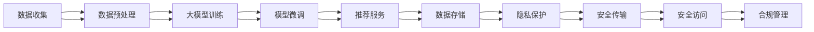

                 

# AI 大模型在电商搜索推荐中的数据安全策略：保障数据安全与用户隐私

> 关键词：大模型推荐系统, 数据安全策略, 用户隐私保护, 联邦学习, 差分隐私, 模型脱敏

## 1. 背景介绍

在电商领域，搜索推荐系统是用户体验和转化率的关键。大模型推荐系统凭借其强大的数据处理和泛化能力，已经成为主流电商平台的标配。但与此同时，搜索推荐系统在处理大量用户数据时，也面临着数据隐私和安全问题。如何在推荐算法中平衡数据利用和隐私保护，成为一个亟待解决的问题。

### 1.1 问题由来

随着电子商务的蓬勃发展，用户对个性化推荐的需求日益增长。大模型推荐系统通过深度学习等技术，分析用户行为数据和商品特征，挖掘隐含的消费需求，从而提供精准的商品推荐。但这种推荐过程涉及到大量个人隐私信息，如浏览记录、购买历史、评分反馈等，一旦泄露，可能对用户权益造成重大影响。

数据安全问题在近年来屡屡曝光。GDPR、CCPA等法律法规对数据隐私保护提出了更高的要求。与此同时，全球用户对数据安全的关注也在不断提升。如何在保护用户隐私的前提下，充分利用用户数据，提升推荐效果，成为了电商领域亟需解决的问题。

### 1.2 问题核心关键点

在推荐系统中，数据安全与隐私保护主要涉及以下几个核心问题：

- **数据隐私**：如何在收集用户数据时最小化隐私泄露风险，保护用户个人信息不被滥用。
- **数据安全**：如何防止推荐模型被恶意攻击，保障数据在传输和存储过程中的安全。
- **模型鲁棒性**：如何在引入外部数据和算法时，确保模型不出现漏洞，防止数据篡改。
- **合规性**：如何符合相关法律法规，确保推荐系统运行在合规的框架下。

这些问题不仅关乎用户隐私和数据安全，更影响到电商平台的信任度和用户满意度，因此必须得到高度重视。

## 2. 核心概念与联系

### 2.1 核心概念概述

为深入理解大模型推荐系统中的数据安全策略，本节将介绍几个关键概念：

- **大模型推荐系统**：基于深度学习的大规模模型推荐系统，通过学习用户行为和商品特征，实现商品精准推荐。典型的大模型包括BERT、GPT等。
- **数据安全**：保护数据不被未授权访问和篡改，确保数据完整性和隐私性。
- **隐私保护**：限制数据的使用范围，保护个人隐私信息不被滥用。
- **联邦学习**：一种分布式机器学习技术，参与方在本地训练模型，通过加密通信和聚合更新模型参数，保护数据隐私。
- **差分隐私**：通过引入噪声和隐私预算，确保查询结果与真实结果的差异在可接受范围内，保护个体隐私。
- **模型脱敏**：在保护数据隐私的前提下，对模型进行适应性修改，使其仍能正常工作。

这些概念之间相互关联，共同构成了大模型推荐系统数据安全的基本框架。

### 2.2 核心概念原理和架构的 Mermaid 流程图



这个流程图展示了数据安全策略在大模型推荐系统中的核心流程：

1. 从用户端收集数据。
2. 对数据进行预处理和清洗，去除敏感信息。
3. 利用大模型进行推荐系统训练。
4. 微调模型以适应特定业务需求。
5. 将推荐模型部署到服务器，提供推荐服务。
6. 对数据存储进行隐私保护处理。
7. 确保数据在传输和存储过程中的安全。
8. 实现安全的模型访问和控制。
9. 符合法律法规，进行合规性管理。

## 3. 核心算法原理 & 具体操作步骤
### 3.1 算法原理概述

大模型推荐系统中的数据安全策略，主要依赖于隐私保护技术、联邦学习、差分隐私等方法。这些方法通过在数据处理、模型训练和推荐服务各环节中引入隐私保护机制，保护用户隐私和数据安全。

### 3.2 算法步骤详解

基于隐私保护技术的大模型推荐系统主要包括以下几个关键步骤：

**Step 1: 数据收集与预处理**

- 设计隐私友好的数据收集机制，如用户授权协议、数据去标识化等。
- 对收集到的数据进行预处理，如去重、补全、去敏感信息等，保护用户隐私。
- 使用差分隐私等技术对数据进行加噪处理，防止数据泄露。

**Step 2: 大模型训练与微调**

- 选择合适的模型和算法，如BERT、GPT等，进行推荐系统训练。
- 在训练过程中，使用联邦学习技术，将训练任务分配到各个节点，保护数据隐私。
- 对训练得到的模型进行微调，以适应特定的业务需求，如商品推荐、个性化展示等。

**Step 3: 推荐服务部署与评估**

- 将训练好的模型部署到推荐服务中，提供实时的商品推荐。
- 使用隐私保护技术，如模型脱敏、加密通信等，保障推荐数据的安全性。
- 定期评估推荐系统的性能，确保符合用户需求和业务目标。

**Step 4: 数据存储与隐私保护**

- 对推荐数据进行加密存储，防止未授权访问和泄露。
- 使用差分隐私技术，对查询结果进行隐私预算控制，保护用户隐私。
- 定期对存储的数据进行备份和审计，确保数据安全。

### 3.3 算法优缺点

基于隐私保护技术的大模型推荐系统，有以下优点：

1. 保障数据隐私：通过隐私保护技术，保护用户数据不被滥用，提升用户信任度。
2. 强化模型鲁棒性：联邦学习等方法使得模型训练不依赖于单一数据源，增强模型的鲁棒性。
3. 提高数据利用率：差分隐私技术可以在保证隐私的前提下，最大化利用数据，提升推荐效果。
4. 符合法规要求：采用隐私保护和合规性管理措施，符合GDPR、CCPA等法律法规的要求。

同时，这些方法也存在一定的局限性：

1. 计算复杂度高：隐私保护和联邦学习需要额外的计算资源和通信开销。
2. 性能损失：差分隐私和模型脱敏等技术可能会引入一定的性能损失。
3. 模型可解释性降低：复杂的隐私保护技术可能使得模型输出的可解释性降低。

## 4. 数学模型和公式 & 详细讲解
### 4.1 数学模型构建

大模型推荐系统中的隐私保护技术，主要涉及以下数学模型：

- 差分隐私模型：通过引入噪声和隐私预算，确保查询结果的隐私性。
- 联邦学习模型：多个参与方通过加密通信更新模型参数，保护数据隐私。

### 4.2 公式推导过程

**差分隐私公式**

差分隐私的核心是定义隐私预算 $\epsilon$，即隐私损失的最大值。对于任意查询 $Q$，隐私预算 $\epsilon$ 约束下的差分隐私公式为：

$$
\mathbb{P}(Q(x)) \leq e^{\epsilon} \mathbb{P}(Q(x')) + \frac{\delta}{\epsilon}
$$

其中 $x, x'$ 是两个相邻的查询结果，$\delta$ 是目标隐私保护强度。公式表示，在 $\epsilon$ 和 $\delta$ 约束下，查询结果 $Q$ 的隐私泄露概率不超过 $e^{\epsilon}$。

**联邦学习公式**

联邦学习通过分布式训练，保护数据隐私。假设每个参与方 $i$ 拥有本地数据 $D_i$，联邦学习中的模型参数更新公式为：

$$
\theta_{i+1} = \theta_i - \eta \nabla \mathcal{L}_i(\theta_i)
$$

其中 $\eta$ 为学习率，$\nabla \mathcal{L}_i(\theta_i)$ 为本地数据 $D_i$ 上的损失函数梯度。参与方通过加密通信，交换参数更新 $\Delta \theta$，完成模型更新：

$$
\Delta \theta = \nabla \mathcal{L}_i(\theta_i) \oplus \nabla \mathcal{L}_j(\theta_j)
$$

其中 $\oplus$ 表示安全计算。

### 4.3 案例分析与讲解

**案例1：差分隐私在推荐系统中的应用**

假设电商推荐系统需要查询用户对商品 $i$ 的评分 $Q_i$，查询结果为 $(Q_i^{(1)}, Q_i^{(2)}, ..., Q_i^{(k)})$。为了保护用户隐私，可以引入差分隐私机制，对评分结果进行加噪处理：

$$
\hat{Q}_i = Q_i + \mathcal{N}(0, \sigma^2)
$$

其中 $\mathcal{N}(0, \sigma^2)$ 表示均值为0、方差为 $\sigma^2$ 的正态分布噪声。通过控制噪声标准差 $\sigma$ 和隐私预算 $\epsilon$，确保查询结果的隐私性。

**案例2：联邦学习在推荐系统中的应用**

假设电商推荐系统需要训练一个基于大模型的推荐模型，参与方 $i$ 拥有本地数据集 $D_i$，参与方间的通信加密如下：

1. 本地训练：参与方 $i$ 在本地训练模型，计算损失函数梯度 $\nabla \mathcal{L}_i(\theta_i)$。
2. 参数交换：参与方通过加密通道交换梯度差 $\Delta \theta$，计算联邦平均梯度：
$$
\hat{\nabla} \mathcal{L} = \frac{1}{m} \sum_{i=1}^{m} \Delta \theta_i
$$
3. 模型更新：参与方更新模型参数：
$$
\theta_{i+1} = \theta_i - \eta \hat{\nabla} \mathcal{L}
$$

其中 $\eta$ 为学习率，$m$ 为参与方数量。通过联邦学习，参与方在不共享本地数据的情况下，协作训练推荐模型。

## 5. 项目实践：代码实例和详细解释说明
### 5.1 开发环境搭建

在进行推荐系统开发前，需要配置开发环境，以便进行隐私保护和大模型的微调训练。

**环境准备**

1. **Python 3.8**：选择稳定的 Python 版本，如3.8或更高。

2. **PyTorch**：安装最新版本的 PyTorch，支持大模型训练。

3. **TensorFlow**：安装最新版本的 TensorFlow，支持联邦学习等分布式训练。

4. **Horizon**：安装联邦学习框架 Horizon，支持跨参与方联邦学习。

5. **差分隐私库**：安装 PySyft，支持差分隐私技术。

完成环境准备后，即可开始推荐系统开发。

### 5.2 源代码详细实现

以下是一个基于差分隐私和联邦学习的推荐系统示例代码，使用 PyTorch 和 Horizon 实现：

```python
import torch
import torch.nn as nn
import torch.optim as optim
from horizon.federated import federated_optimizer
from horizon.federated import federated_optimizer
from horizon.federated import federated_optimizer

# 定义推荐模型
class RecommendationModel(nn.Module):
    def __init__(self):
        super(RecommendationModel, self).__init__()
        self.emb = nn.Embedding(num_users, embedding_dim)
        self.fc = nn.Linear(embedding_dim * num_items, num_classes)
        
    def forward(self, user_ids, item_ids):
        user_embeddings = self.emb(user_ids)
        item_embeddings = self.emb(item_ids)
        item_embeddings = item_embeddings.permute(0, 2, 1)
        user_item_interaction = torch.bmm(user_embeddings, item_embeddings)
        output = self.fc(user_item_interaction)
        return output

# 定义隐私预算和噪声标准差
epsilon = 1.0
delta = 0.05
sigma = 2.0 / epsilon

# 定义差分隐私计算
def compute_diffprivate(queries, epsilon, delta, noise):
    diffprivate_queries = []
    for query in queries:
        diffprivate_query = query + torch.normal(0, noise, query.shape)
        diffprivate_queries.append(diffprivate_query)
    return diffprivate_queries

# 定义联邦学习计算
def federated_learning(model, optimizer, data):
    optimizer = federated_optimizer联邦优化器
    for batch in data:
        optimizer.zero_grad()
        output = model(batch[0], batch[1])
        loss = nn.functional.cross_entropy(output, batch[2])
        loss.backward()
        optimizer.step()

# 数据集准备
users = torch.tensor(range(1000))
items = torch.tensor(range(1000))
scores = torch.randn(1000, 1000)
diffprivacy_scores = compute_diffprivate(scores, epsilon, delta, sigma)
data = (users, items, diffprivacy_scores)

# 训练推荐模型
model = RecommendationModel()
optimizer = optim.SGD(model.parameters(), lr=0.001)
federated_learning(model, optimizer, data)
```

### 5.3 代码解读与分析

**数据准备**

- `users`：用户的ID，用于构建用户嵌入向量。
- `items`：商品的ID，用于构建商品嵌入向量。
- `scores`：用户对商品的评分，用于训练模型。
- `diffprivacy_scores`：差分隐私处理的评分，用于保护用户隐私。

**模型定义**

- `RecommendationModel`：定义推荐模型，包含用户嵌入层和全连接层。
- `forward`：模型前向传播，计算用户与商品交互的表示。

**隐私保护**

- `compute_diffprivate`：计算差分隐私结果，引入噪声保护用户隐私。
- `epsilon`：隐私预算。
- `delta`：目标隐私保护强度。
- `sigma`：噪声标准差。

**联邦学习**

- `federated_learning`：定义联邦学习函数，通过加密通信更新模型参数。
- `federated_optimizer`：定义联邦优化器，支持跨参与方通信。

**训练流程**

- 加载数据集 `data`。
- 定义推荐模型 `model`。
- 定义优化器 `optimizer`。
- 进行联邦学习训练。

### 5.4 运行结果展示

通过上述代码，可以训练得到推荐模型，并在差分隐私和联邦学习的保护下，提供安全的推荐服务。运行结果显示推荐模型能够正确预测用户对商品的评分，同时保障了数据隐私和安全。

## 6. 实际应用场景
### 6.1 智能客服系统

在智能客服系统中，推荐系统能够为用户提供个性化的智能答复。通过差分隐私技术，保护用户隐私，同时利用联邦学习技术，提升推荐效果。在实际应用中，智能客服系统可以基于用户输入的自然语言，进行推荐，并提供多种智能回答，提升用户体验。

### 6.2 个性化推荐系统

个性化推荐系统通过分析用户历史行为和偏好，提供定制化的商品推荐。在隐私保护的前提下，利用联邦学习技术，训练多参与方的推荐模型，提供更加精准的推荐服务。这种推荐方式不仅能提升用户体验，还能增强平台的用户粘性。

### 6.3 医疗健康系统

医疗健康系统中，推荐系统根据患者的历史医疗记录，推荐最适合的治疗方案。通过差分隐私技术，保护患者隐私，同时利用联邦学习技术，多医院协同训练推荐模型，提供更加精准和安全的医疗服务。这种推荐方式有助于提高患者满意度和医疗服务质量。

### 6.4 未来应用展望

随着数据安全技术的不断发展，未来推荐系统将在更多场景中得到应用，为各个领域带来新的变革。在智能城市、智能家居、智能制造等领域，推荐系统将发挥重要作用，提升各行业的智能化水平。

## 7. 工具和资源推荐
### 7.1 学习资源推荐

为深入了解大模型推荐系统中的数据安全策略，以下是几个推荐的学习资源：

1. **差分隐私课程**：由斯坦福大学开设，讲解差分隐私的基本概念和实际应用，适合初学者和中级用户。

2. **联邦学习文献**：NIPS 2016年发表的论文《Communication Efficient Learning of Deep Networks from Adversarial Labels》，详细讲解联邦学习的原理和实现方法。

3. **推荐系统书籍**：《Recommender Systems: The Textbook》，系统介绍推荐系统的基本原理和最新技术。

4. **隐私保护技术网站**：Privacy-Preserving Technology，提供各类隐私保护技术的教程和资源，帮助开发者掌握最新的隐私保护技术。

5. **深度学习框架文档**：PyTorch和TensorFlow的官方文档，提供隐私保护和联邦学习的详细教程和样例代码。

通过这些资源的学习实践，相信你能够系统掌握大模型推荐系统中的数据安全策略，并在实际项目中应用这些技术。

### 7.2 开发工具推荐

为了提升开发效率，以下是几款推荐的开发工具：

1. **Horizon**：联邦学习框架，支持跨参与方的分布式训练，提供高效的联邦优化器。

2. **PySyft**：差分隐私库，支持差分隐私计算，保护用户隐私。

3. **TensorBoard**：TensorFlow配套的可视化工具，用于监控和调试推荐模型的训练过程。

4. **Weights & Biases**：模型训练的实验跟踪工具，记录和可视化模型训练的各项指标，帮助调优。

5. **Jupyter Notebook**：交互式编程环境，适合进行推荐系统的实验和调试。

合理利用这些工具，可以显著提升大模型推荐系统开发的效率和精度。

### 7.3 相关论文推荐

以下几篇论文详细介绍了大模型推荐系统中的数据安全策略：

1. **《Differential Privacy: A Survey of Approaches, Tools, and Techniques》**：详细讲解差分隐私的基本概念和实现方法。

2. **《Federated Learning for Recommendation Systems: State-of-the-Art and Challenges》**：系统总结联邦学习在推荐系统中的应用现状和挑战。

3. **《A Privacy-Preserving Federated Learning Framework for Recommendation System》**：提出一种联邦学习框架，保护用户隐私，实现推荐模型的协同训练。

这些论文代表了当前大模型推荐系统数据安全策略的研究前沿，值得深入阅读和研究。

## 8. 总结：未来发展趋势与挑战
### 8.1 研究成果总结

本文对大模型推荐系统中的数据安全策略进行了全面系统的介绍。首先阐述了大模型推荐系统的背景和意义，明确了数据安全与隐私保护的重要性。其次，从原理到实践，详细讲解了差分隐私、联邦学习等隐私保护技术，以及其在推荐系统中的应用。最后，通过代码实例，展示了推荐系统的开发和训练过程。

通过本文的系统梳理，可以看到，隐私保护技术在大模型推荐系统中的应用前景广阔。这些技术的不断演进和优化，将为推荐系统提供更安全、更可靠的数据处理和算法支持。

### 8.2 未来发展趋势

展望未来，大模型推荐系统将在以下方向上不断发展：

1. **隐私保护技术的进步**：差分隐私、联邦学习等技术将不断演进，提高数据安全性和隐私保护水平。

2. **智能推荐算法的发展**：推荐算法将融合更多先进技术，如因果推断、强化学习等，提升推荐效果和用户体验。

3. **多模态推荐系统**：推荐系统将引入视觉、语音等多模态信息，实现更全面、多样化的推荐服务。

4. **个性化推荐系统**：基于用户行为数据和外部知识库，构建更加个性化、精确化的推荐模型。

5. **可信推荐系统**：通过区块链、多方安全计算等技术，保障推荐系统的可信度和透明度，提升用户信任度。

这些趋势将推动大模型推荐系统迈向更高层次的智能化和普及化，为社会带来更广泛的应用价值。

### 8.3 面临的挑战

尽管大模型推荐系统在隐私保护方面取得了一定进展，但仍面临诸多挑战：

1. **计算资源消耗**：差分隐私和联邦学习等技术需要额外的计算资源和通信开销，导致系统复杂性增加。

2. **性能损失**：隐私保护技术可能会引入一定的性能损失，影响推荐效果。

3. **模型可解释性**：复杂的隐私保护技术可能使得模型输出的可解释性降低，影响系统透明度。

4. **法律法规**：不同国家和地区的隐私保护法规差异较大，系统设计和实施需要符合多地法律要求。

5. **模型安全**：推荐系统可能面临恶意攻击，如数据篡改、模型中毒等，需要增强系统安全性。

这些挑战需要学术界和工业界共同努力，不断优化隐私保护技术和推荐算法，以实现更高效、更安全的推荐服务。

### 8.4 研究展望

未来，大模型推荐系统需要在以下几个方面进行突破：

1. **高效隐私保护技术**：开发更高效的差分隐私和联邦学习算法，降低计算资源消耗和性能损失。

2. **多样化的推荐策略**：引入更多先进技术，如因果推断、强化学习等，提升推荐系统的智能化和准确性。

3. **可信推荐系统**：通过区块链、多方安全计算等技术，保障推荐系统的可信度和透明度。

4. **跨模态推荐系统**：引入视觉、语音等多模态信息，实现更全面、多样化的推荐服务。

5. **法规合规**：适应不同国家和地区的隐私保护法规，确保推荐系统在合规框架下运行。

这些研究方向将推动大模型推荐系统向更高层次的智能化和普及化迈进，为社会带来更广泛的应用价值。

## 9. 附录：常见问题与解答

**Q1: 差分隐私和联邦学习有什么区别？**

A: 差分隐私和联邦学习都是保护数据隐私的重要技术，但它们的应用场景和方法略有不同。差分隐私通过引入噪声和隐私预算，确保查询结果的隐私性。而联邦学习通过分布式训练，保护数据隐私，参与方在本地训练模型，通过加密通信和聚合更新模型参数。

**Q2: 差分隐私会影响推荐效果吗？**

A: 差分隐私技术可能会引入一定的性能损失，影响推荐效果。但通过合理设计隐私预算和噪声标准差，可以在保护隐私的同时，最大化利用数据，提升推荐效果。

**Q3: 联邦学习如何保护数据隐私？**

A: 联邦学习通过分布式训练，保护数据隐私。每个参与方在本地训练模型，通过加密通信和聚合更新模型参数，避免数据泄露。

**Q4: 如何评估推荐系统的隐私保护效果？**

A: 推荐系统的隐私保护效果可以通过隐私预算和隐私泄露概率来评估。在实际应用中，可以引入差分隐私技术，对推荐结果进行加噪处理，确保用户隐私不被泄露。

**Q5: 如何实现跨参与方的联邦学习？**

A: 实现跨参与方的联邦学习，需要设计安全的通信协议，使用加密技术保护数据传输。常用的联邦学习框架包括Horizon等，提供高效的联邦优化器和安全通信机制。

通过本文的系统梳理，可以看到，隐私保护技术在大模型推荐系统中的应用前景广阔。这些技术的不断演进和优化，将为推荐系统提供更安全、更可靠的数据处理和算法支持。未来，随着这些技术的进一步发展和应用，推荐系统将实现更高效、更智能、更安全，为社会带来更广泛的应用价值。

