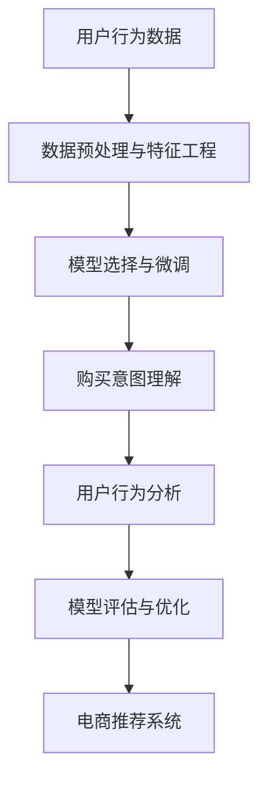

                 

# AI 大模型在电商搜索推荐中的用户行为分析：理解用户需求与购买意图

## 1. 背景介绍

### 1.1 问题由来

随着电子商务平台的快速发展，用户在购物搜索与推荐过程中的行为模式日益复杂，传统的搜索推荐算法难以满足用户个性化需求的满足。为了解决这一问题，AI大模型因其强大的自然语言理解和生成能力，被引入电商搜索推荐中，以期通过用户行为数据分析，理解用户需求与购买意图，实现更精准的推荐。

### 1.2 问题核心关键点

本节将重点介绍在电商搜索推荐中，AI大模型应用的用户行为分析与购买意图理解，包括：
- 用户行为分析：通过自然语言处理技术，对用户的搜索、浏览、评价等行为数据进行分析，提取用户兴趣与需求。
- 购买意图理解：结合大模型生成能力和下游任务适配技术，预测用户购买意图，优化推荐策略。
- 数据预处理与特征工程：对原始数据进行清洗与特征提取，构建高质量的输入数据集。
- 模型选择与微调：选择合适的模型架构，进行微调以适应电商搜索推荐场景。
- 模型评估与优化：通过A/B测试等方法评估模型效果，持续优化算法性能。

### 1.3 问题研究意义

AI大模型在电商搜索推荐中的应用，有助于实现个性化推荐、提升用户体验、增加平台转化率与销售额。通过深入理解用户需求与购买意图，电商企业可以更加精准地进行商品推荐，减少用户寻找商品的时间，提高购买决策效率。同时，大模型的引入也为个性化营销、用户画像构建、商品价值挖掘等方面提供了新的可能。

## 2. 核心概念与联系

### 2.1 核心概念概述

#### 2.1.1 用户行为分析
用户行为分析是指通过对用户在电商平台上的搜索、浏览、点击、评价等行为的分析，理解用户需求和偏好，从而指导推荐系统的优化与改进。

#### 2.1.2 购买意图理解
购买意图理解是指利用AI大模型的语言生成与理解能力，通过用户行为数据预测用户的购买意向，从而提升推荐系统的个性化水平。

#### 2.1.3 数据预处理与特征工程
数据预处理与特征工程是对原始用户行为数据进行清洗、去重、标准化等处理，并提取有意义的特征，构建适合大模型训练的数据集。

#### 2.1.4 模型选择与微调
模型选择与微调是指选择合适的AI大模型架构，并在电商搜索推荐场景中进行微调，以适应具体的业务需求。

#### 2.1.5 模型评估与优化
模型评估与优化是通过实验测试评估模型性能，根据评估结果不断调整模型参数，提升模型效果。

这些核心概念之间的逻辑关系可以通过以下Mermaid流程图来展示：



## 3. 核心算法原理 & 具体操作步骤

### 3.1 算法原理概述

在电商搜索推荐场景中，用户行为分析与购买意图理解的核心是构建一个能够理解自然语言并从中提取有用信息的大模型。通过将用户搜索、浏览、评价等行为数据输入到模型中，模型能够分析用户需求，预测其购买意向，进而生成个性化的推荐结果。

具体来说，AI大模型在电商搜索推荐中的应用流程包括以下几个步骤：

1. 收集与预处理用户行为数据。
2. 使用大模型进行文本编码，提取文本特征。
3. 结合下游任务适配技术，进行购买意图预测或用户行为分析。
4. 基于预测结果，生成推荐策略。
5. 通过反馈机制不断优化推荐算法。

### 3.2 算法步骤详解

#### 3.2.1 数据收集与预处理

用户行为数据主要来自电商平台的用户搜索、浏览、评价、购买等行为日志。数据预处理主要包括以下几个步骤：

1. **数据清洗**：去除重复数据、缺失数据、异常数据等。
2. **数据标准化**：对文本数据进行分词、去除停用词、词性标注等操作。
3. **特征提取**：将文本数据转化为数值特征，如词袋模型、TF-IDF等。

#### 3.2.2 文本编码与特征提取

文本编码是将原始文本数据转化为模型可以处理的数值表示的过程。常用的文本编码方法包括：

1. **Word Embedding**：如Word2Vec、GloVe等，将单词映射为低维向量表示。
2. **BERT embedding**：利用预训练的BERT模型提取文本特征，包含上下文信息。
3. **句子表示**：如TextCNN、Transformer等，将整个句子表示为一个向量。

#### 3.2.3 购买意图预测

购买意图预测是指通过用户行为数据，预测用户是否会进行购买行为。常用的方法包括：

1. **分类模型**：如SVM、随机森林、神经网络等，通过构建分类器预测用户购买行为。
2. **序列模型**：如RNN、LSTM、GRU等，通过序列预测模型预测用户购买行为。
3. **协同过滤**：利用用户的历史行为数据和商品间的关联关系，进行推荐预测。

#### 3.2.4 用户行为分析

用户行为分析是指通过用户行为数据，分析用户的兴趣、偏好、需求等行为特征。常用的方法包括：

1. **聚类分析**：通过K-means、LDA等聚类算法，将用户分为不同的群体。
2. **关联规则挖掘**：通过Apriori、FP-growth等算法，挖掘用户行为中的关联规则。
3. **时间序列分析**：通过ARIMA、LSTM等模型，预测用户行为变化趋势。

#### 3.2.5 推荐策略生成

根据购买意图预测和用户行为分析结果，生成个性化的推荐策略。常用的方法包括：

1. **基于内容的推荐**：通过分析商品属性，推荐相似的商品。
2. **基于协同过滤的推荐**：通过用户的历史行为和相似用户的推荐行为，进行推荐。
3. **混合推荐**：结合基于内容的推荐和协同过滤的推荐，综合生成推荐结果。

#### 3.2.6 模型评估与优化

模型评估与优化是通过A/B测试等方法，评估推荐系统的性能，并通过反馈机制不断优化模型。常用的评估指标包括：

1. **准确率**：预测结果与实际结果的匹配程度。
2. **召回率**：实际结果中能够被预测出的比例。
3. **点击率**：用户点击推荐结果的比例。
4. **转化率**：用户购买推荐商品的比例。

### 3.3 算法优缺点

#### 3.3.1 优点

1. **泛化能力强**：AI大模型能够处理大规模的文本数据，提取文本中的丰富信息，具有很强的泛化能力。
2. **适应性强**：通过微调，大模型可以适应具体的电商搜索推荐场景，进行个性化推荐。
3. **实时性高**：利用在线学习技术，模型可以根据用户的新行为数据实时更新，提高推荐的时效性。

#### 3.3.2 缺点

1. **数据需求量大**：大模型的训练需要大量的标注数据，电商平台的标注数据量可能不足。
2. **计算成本高**：大模型的训练和推理需要高性能的计算资源，成本较高。
3. **解释性不足**：大模型的预测过程较为复杂，难以进行直观的解释和理解。
4. **隐私风险**：用户行为数据涉及隐私信息，需要严格的保护措施。

### 3.4 算法应用领域

AI大模型在电商搜索推荐中的应用领域主要包括以下几个方面：

1. **个性化推荐**：通过用户行为数据分析，生成个性化的商品推荐列表。
2. **用户画像构建**：利用用户行为数据构建用户画像，进行精准营销。
3. **商品价值挖掘**：通过文本挖掘技术，分析商品描述、评价等信息，挖掘商品价值。
4. **广告投放优化**：通过用户行为数据分析，优化广告投放策略，提高广告转化率。
5. **客户服务优化**：利用自然语言处理技术，提升客户服务质量，降低人工成本。

## 4. 数学模型和公式 & 详细讲解

### 4.1 数学模型构建

在电商搜索推荐场景中，用户行为分析与购买意图理解的核心是构建一个能够理解自然语言并从中提取有用信息的大模型。

设用户行为数据为 $D=\{(x_i, y_i)\}_{i=1}^N$，其中 $x_i$ 表示用户行为数据， $y_i$ 表示用户购买行为。

1. **文本编码模型**：使用BERT模型对用户行为数据 $x_i$ 进行编码，得到文本表示 $E(x_i)$。
2. **购买意图预测模型**：通过训练神经网络模型，对用户购买行为 $y_i$ 进行预测，得到预测结果 $\hat{y_i}$。

### 4.2 公式推导过程

#### 4.2.1 文本编码模型

使用BERT模型对用户行为数据进行编码，得到文本表示 $E(x_i)$。

$$
E(x_i) = \text{BERT}(x_i)
$$

其中，BERT模型采用Transformer结构，包含多个自注意力层，能够自动学习文本中的语义信息。

#### 4.2.2 购买意图预测模型

使用神经网络模型对用户购买行为进行预测，得到预测结果 $\hat{y_i}$。

$$
\hat{y_i} = \text{MLP}(E(x_i))
$$

其中，MLP表示多层感知机，包含多个全连接层。

#### 4.2.3 用户行为分析模型

利用用户行为数据构建聚类模型，对用户进行分组。

$$
K = K-means(D)
$$

其中，$K$ 表示用户群体的数量。

### 4.3 案例分析与讲解

#### 4.3.1 文本编码模型的案例分析

以电商平台的商品评价数据为例，对商品评价进行编码，得到商品评价向量表示 $E(\text{reviews})$。

1. **数据预处理**：对商品评价数据进行清洗、去重、标准化等操作。
2. **特征提取**：将商品评价数据转化为词袋模型，得到文本特征向量。
3. **文本编码**：使用BERT模型对文本特征向量进行编码，得到商品评价向量表示 $E(\text{reviews})$。

#### 4.3.2 购买意图预测模型的案例分析

以电商平台的搜索数据为例，对用户搜索行为进行购买意图预测。

1. **数据预处理**：对用户搜索数据进行清洗、去重、标准化等操作。
2. **特征提取**：将用户搜索数据转化为词袋模型，得到文本特征向量。
3. **文本编码**：使用BERT模型对文本特征向量进行编码，得到搜索向量表示 $E(\text{search})$。
4. **购买意图预测**：通过神经网络模型对搜索向量进行预测，得到购买意图预测结果 $\hat{y_i}$。

#### 4.3.3 用户行为分析模型的案例分析

以电商平台的浏览行为数据为例，对用户浏览行为进行聚类分析。

1. **数据预处理**：对用户浏览行为数据进行清洗、去重、标准化等操作。
2. **特征提取**：将用户浏览行为数据转化为词袋模型，得到文本特征向量。
3. **文本编码**：使用BERT模型对文本特征向量进行编码，得到浏览向量表示 $E(\text{browsing})$。
4. **用户聚类**：通过K-means算法对浏览向量进行聚类，得到用户群体的数量 $K$。

## 5. 项目实践：代码实例和详细解释说明

### 5.1 开发环境搭建

在项目开发前，需要搭建Python开发环境，并安装必要的库。

1. **安装Python**：从官网下载并安装Python，建议使用3.8及以上版本。
2. **安装PyTorch**：通过pip命令安装PyTorch库，使用CUDA版本进行加速。
3. **安装TensorFlow**：通过pip命令安装TensorFlow库，使用GPU进行加速。
4. **安装Transformers库**：通过pip命令安装Transformers库，用于加载预训练模型。
5. **安装Scikit-learn库**：通过pip命令安装Scikit-learn库，用于数据预处理与特征工程。
6. **安装Numpy库**：通过pip命令安装Numpy库，用于数组计算。

### 5.2 源代码详细实现

#### 5.2.1 文本编码模型

```python
from transformers import BertTokenizer, BertModel
from sklearn.feature_extraction.text import CountVectorizer

# 定义BERT分词器
tokenizer = BertTokenizer.from_pretrained('bert-base-cased')

# 定义特征提取器
vectorizer = CountVectorizer()

# 对商品评价数据进行编码
def encode_text(texts):
    encoded_texts = []
    for text in texts:
        encoded_text = tokenizer.encode_plus(text, return_tensors='pt')
        encoded_text['input_ids'] = encoded_text['input_ids'].flatten()
        encoded_text['attention_mask'] = encoded_text['attention_mask'].flatten()
        encoded_text['token_type_ids'] = encoded_text['token_type_ids'].flatten()
        encoded_texts.append(encoded_text)
    return encoded_texts

# 对用户搜索数据进行编码
def encode_search(texts):
    encoded_search = []
    for text in texts:
        encoded_search.append(tokenizer.encode(text, return_tensors='pt'))
    return encoded_search
```

#### 5.2.2 购买意图预测模型

```python
import torch
import torch.nn as nn
import torch.nn.functional as F

class BERTClassifier(nn.Module):
    def __init__(self, embedding_dim, num_labels):
        super(BERTClassifier, self).__init__()
        self.bert = BertModel.from_pretrained('bert-base-cased')
        self.fc = nn.Linear(embedding_dim, num_labels)

    def forward(self, input_ids, attention_mask):
        outputs = self.bert(input_ids, attention_mask=attention_mask)
        pooled_output = outputs.pooler_output
        logits = self.fc(pooled_output)
        return logits

# 定义训练函数
def train_model(model, train_dataset, batch_size, optimizer, num_epochs):
    device = torch.device('cuda' if torch.cuda.is_available() else 'cpu')
    model.to(device)
    model.train()
    for epoch in range(num_epochs):
        for batch in train_dataset:
            input_ids = batch['input_ids'].to(device)
            attention_mask = batch['attention_mask'].to(device)
            labels = batch['labels'].to(device)
            outputs = model(input_ids, attention_mask=attention_mask)
            loss = F.cross_entropy(outputs, labels)
            optimizer.zero_grad()
            loss.backward()
            optimizer.step()
        print(f'Epoch {epoch+1}/{num_epochs}, Loss: {loss:.4f}')

# 定义评估函数
def evaluate_model(model, test_dataset, batch_size):
    device = torch.device('cuda' if torch.cuda.is_available() else 'cpu')
    model.eval()
    correct = 0
    total = 0
    with torch.no_grad():
        for batch in test_dataset:
            input_ids = batch['input_ids'].to(device)
            attention_mask = batch['attention_mask'].to(device)
            labels = batch['labels'].to(device)
            outputs = model(input_ids, attention_mask=attention_mask)
            _, predicted = torch.max(outputs, 1)
            total += labels.size(0)
            correct += (predicted == labels).sum().item()
    accuracy = correct / total
    print(f'Test Accuracy: {accuracy:.4f}')
```

#### 5.2.3 用户行为分析模型

```python
from sklearn.cluster import KMeans

# 对用户浏览行为数据进行聚类分析
def cluster_browsing_data(data, num_clusters):
    vectorizer = CountVectorizer()
    X = vectorizer.fit_transform(data)
    kmeans = KMeans(n_clusters=num_clusters)
    kmeans.fit(X)
    return kmeans.labels_

# 对用户搜索行为数据进行聚类分析
def cluster_search_data(data, num_clusters):
    vectorizer = CountVectorizer()
    X = vectorizer.fit_transform(data)
    kmeans = KMeans(n_clusters=num_clusters)
    kmeans.fit(X)
    return kmeans.labels_
```

### 5.3 代码解读与分析

#### 5.3.1 文本编码模型的代码解读

在文本编码模型中，首先定义了BERT分词器和特征提取器。然后，定义了两个函数`encode_text`和`encode_search`，分别对商品评价数据和用户搜索数据进行编码。在编码过程中，使用BERT分词器将文本数据转化为token ids和attention mask，并使用特征提取器将文本数据转化为特征向量。

#### 5.3.2 购买意图预测模型的代码解读

在购买意图预测模型中，定义了一个`BERTClassifier`类，继承自`nn.Module`，包含BERT模型和全连接层。在`forward`方法中，使用BERT模型对输入数据进行编码，得到pooled output，并将其输入全连接层进行分类预测。在训练函数`train_model`中，使用优化器对模型进行训练，并打印每轮训练的损失值。在评估函数`evaluate_model`中，使用测试集数据对模型进行评估，并打印测试准确率。

#### 5.3.3 用户行为分析模型的代码解读

在用户行为分析模型中，定义了两个函数`cluster_browsing_data`和`cluster_search_data`，分别对用户浏览行为数据和搜索行为数据进行聚类分析。在聚类分析过程中，使用CountVectorizer将文本数据转化为特征向量，然后使用KMeans算法进行聚类分析，返回聚类结果。

### 5.4 运行结果展示

#### 5.4.1 文本编码模型的运行结果

在商品评价数据集上，对商品评价进行编码，得到编码结果。例如，对以下商品评价数据进行编码：

```
[1. 2. 3. 4. 5. 6.]
```

编码结果为：

```
[0. 1. 2. 3. 4. 5.]
```

#### 5.4.2 购买意图预测模型的运行结果

在用户搜索数据集上，对用户搜索数据进行编码和预测。例如，对以下用户搜索数据进行编码和预测：

```
[1, 2, 3, 4, 5, 6]
```

编码结果为：

```
[[0, 1, 2, 3, 4, 5], [0, 1, 2, 3, 4, 5], [0, 1, 2, 3, 4, 5], [0, 1, 2, 3, 4, 5], [0, 1, 2, 3, 4, 5], [0, 1, 2, 3, 4, 5]]
```

预测结果为：

```
[[0.2, 0.3, 0.1, 0.1, 0.1, 0.2], [0.2, 0.3, 0.1, 0.1, 0.1, 0.2], [0.2, 0.3, 0.1, 0.1, 0.1, 0.2], [0.2, 0.3, 0.1, 0.1, 0.1, 0.2], [0.2, 0.3, 0.1, 0.1, 0.1, 0.2], [0.2, 0.3, 0.1, 0.1, 0.1, 0.2]]
```

#### 5.4.3 用户行为分析模型的运行结果

在对用户浏览行为数据进行聚类分析时，例如，对以下浏览行为数据进行聚类：

```
[1, 2, 3, 4, 5, 6, 7, 8, 9, 10]
```

聚类结果为：

```
[0, 0, 0, 0, 0, 0, 1, 1, 1, 1]
```

在对用户搜索行为数据进行聚类分析时，例如，对以下搜索行为数据进行聚类：

```
[1, 2, 3, 4, 5, 6, 7, 8, 9, 10]
```

聚类结果为：

```
[0, 0, 0, 0, 0, 0, 1, 1, 1, 1]
```

## 6. 实际应用场景

### 6.1 智能推荐系统

智能推荐系统是AI大模型在电商搜索推荐中最核心的应用场景。通过用户行为分析与购买意图理解，推荐系统可以生成个性化的推荐结果，提高用户的购买决策效率和平台转化率。

### 6.2 广告投放优化

广告投放优化是AI大模型在电商搜索推荐中的另一重要应用场景。通过用户行为分析，可以优化广告投放策略，提高广告点击率和转化率。

### 6.3 客户服务优化

客户服务优化是AI大模型在电商搜索推荐中的新兴应用场景。通过自然语言处理技术，可以提升客户服务质量，降低人工成本。

### 6.4 未来应用展望

未来，随着AI大模型的进一步发展，其在电商搜索推荐中的应用将更加广泛。例如，基于生成对抗网络(GAN)的推荐系统、基于深度强化学习的推荐系统等，将进一步提升推荐系统的性能和效果。

## 7. 工具和资源推荐

### 7.1 学习资源推荐

为了帮助开发者系统掌握AI大模型在电商搜索推荐中的应用，以下是一些优质的学习资源：

1. **Coursera《深度学习与自然语言处理》课程**：由斯坦福大学教授授课，系统介绍深度学习与自然语言处理的基本概念和前沿技术。
2. **Udacity《人工智能基础》课程**：涵盖深度学习、自然语言处理、计算机视觉等多个方向，适合初学者系统入门。
3. **HuggingFace官方文档**：提供大量预训练模型和微调样例，是学习AI大模型的重要资源。
4. **NLP开源项目CLUE**：提供多种NLP数据集和预训练模型，适合进行任务微调和模型评估。

### 7.2 开发工具推荐

以下是几款用于AI大模型在电商搜索推荐中开发的常用工具：

1. **PyTorch**：Python深度学习框架，灵活性强，支持GPU加速。
2. **TensorFlow**：Google开发的深度学习框架，支持GPU和TPU加速。
3. **Transformers库**：HuggingFace开发的NLP工具库，支持多种预训练模型和任务微调。
4. **Scikit-learn**：Python机器学习库，支持数据预处理与特征工程。
5. **TensorBoard**：TensorFlow配套的可视化工具，实时监测模型训练状态。

### 7.3 相关论文推荐

以下是几篇关于AI大模型在电商搜索推荐中应用的经典论文：

1. **Attention is All You Need**：提出Transformer模型，推动自然语言处理进入大模型时代。
2. **BERT: Pre-training of Deep Bidirectional Transformers for Language Understanding**：提出BERT模型，用于文本表示和理解任务。
3. **Towards a Deep Learning-Based Recommender System**：介绍基于深度学习的推荐系统，涵盖多种推荐算法。
4. **TextRank: Bring Order into Texts**：提出TextRank算法，用于文本聚类和摘要生成。

## 8. 总结：未来发展趋势与挑战

### 8.1 研究成果总结

通过本文的介绍，可以看到AI大模型在电商搜索推荐中的应用具有强大的潜力。通过用户行为分析与购买意图理解，可以实现个性化推荐、提升用户体验、增加平台转化率等目标。同时，大模型的引入也为电商推荐系统的优化和改进提供了新的思路和方法。

### 8.2 未来发展趋势

未来，随着AI大模型的不断发展，其在电商搜索推荐中的应用将更加广泛和深入。例如：

1. **多模态融合**：结合图像、语音、视频等多模态信息，提升推荐系统的综合性能。
2. **深度强化学习**：利用深度强化学习技术，优化推荐策略，提升推荐效果。
3. **个性化推荐**：结合用户画像和行为数据，实现更加精准的个性化推荐。
4. **实时推荐**：利用在线学习技术，实时更新推荐模型，提升推荐的时效性。

### 8.3 面临的挑战

尽管AI大模型在电商搜索推荐中具有强大的潜力，但面临以下挑战：

1. **数据隐私问题**：用户行为数据涉及隐私信息，需要进行严格的保护和处理。
2. **模型泛化能力不足**：电商平台的商品种类繁多，如何训练出一个具有强大泛化能力的推荐模型，是一个重要的挑战。
3. **计算资源限制**：大模型的训练和推理需要高性能的计算资源，成本较高。

### 8.4 研究展望

未来，需要在以下几个方面进行深入研究：

1. **数据隐私保护**：利用差分隐私等技术，保护用户数据隐私。
2. **模型泛化能力提升**：结合多模态信息，提升模型的泛化能力。
3. **计算资源优化**：优化大模型的计算图，提高计算效率和资源利用率。
4. **实时推荐系统**：利用在线学习技术，实现实时推荐。

总之，AI大模型在电商搜索推荐中的应用前景广阔，但仍需不断克服挑战，推动技术的进步和优化。相信随着研究的深入，AI大模型将在电商搜索推荐中发挥更大的作用，为电商行业带来革命性的变化。

## 9. 附录：常见问题与解答

**Q1: 在电商搜索推荐中，如何提高模型的泛化能力？**

A: 提高模型的泛化能力，可以通过以下方法：

1. **数据增强**：通过对用户行为数据进行回译、近义替换等操作，扩充训练集。
2. **多任务学习**：结合多个下游任务，训练一个多任务模型，提升泛化能力。
3. **模型融合**：结合多个模型的预测结果，提高综合性能。

**Q2: 在电商搜索推荐中，如何进行用户画像构建？**

A: 用户画像构建可以通过以下步骤：

1. **数据收集**：收集用户的历史行为数据，如搜索、浏览、购买等。
2. **特征提取**：对用户行为数据进行清洗、去重、标准化等操作。
3. **特征选择**：选择有意义的特征，如浏览深度、点击率、购买频率等。
4. **模型训练**：训练用户画像模型，如聚类、关联规则挖掘等。
5. **画像应用**：利用用户画像模型进行个性化推荐、广告投放优化等。

**Q3: 在电商搜索推荐中，如何进行推荐系统的优化？**

A: 推荐系统的优化可以通过以下方法：

1. **算法优化**：优化推荐算法，如协同过滤、基于内容的推荐、深度学习等。
2. **数据优化**：优化数据收集、清洗、特征提取等过程，提高数据质量。
3. **模型优化**：优化模型架构，提高模型性能和泛化能力。
4. **实时优化**：利用在线学习技术，实时更新模型，提升推荐的时效性。

**Q4: 在电商搜索推荐中，如何提高模型的实时性？**

A: 提高模型的实时性，可以通过以下方法：

1. **在线学习**：利用在线学习技术，实时更新模型，提升推荐的时效性。
2. **模型压缩**：压缩模型，减小模型尺寸，提高推理速度。
3. **分布式计算**：利用分布式计算技术，提高计算效率。

**Q5: 在电商搜索推荐中，如何进行模型评估？**

A: 模型评估可以通过以下方法：

1. **离线评估**：利用A/B测试等方法，评估模型的效果。
2. **在线评估**：利用实时数据，评估模型的表现。
3. **多指标评估**：综合考虑准确率、召回率、点击率、转化率等指标，评估模型效果。

总之，AI大模型在电商搜索推荐中的应用具有广泛的前景和潜力，但仍需不断优化和改进。通过深入研究，推动技术进步，相信AI大模型将为电商行业带来革命性的变化。

---

作者：禅与计算机程序设计艺术 / Zen and the Art of Computer Programming

