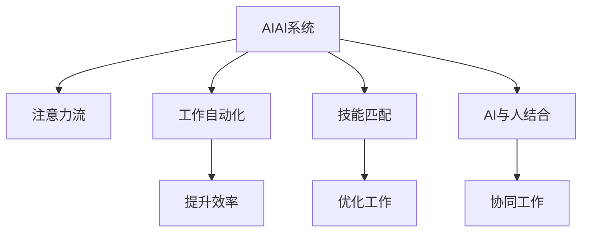

                 

# AI与人类注意力流：未来的工作、技能与注意力流管理策略与系统

> 关键词：AI, 人类注意力流, 工作自动化, 技能匹配, 注意力流管理, 人工智能与工作结合, 未来职业发展

## 1. 背景介绍

### 1.1 问题由来
随着人工智能（AI）技术的快速发展，自动化和智能化的浪潮正在深刻改变各行各业的工作方式。AI不仅在数据处理、图像识别、自然语言处理等领域取得了显著成就，也正在向更广泛的领域渗透，如医疗诊断、金融分析、制造业等领域。这一趋势使得AI成为当今技术发展的重要引擎，也带来了诸多挑战与机遇。

### 1.2 问题核心关键点
AI与人类工作结合的核心在于如何有效整合AI技术与人的注意力流，实现人机协同的智能工作模式。当前，AI技术在各个领域的应用中，普遍存在“黑盒化”问题，即用户难以理解其内部工作机制和决策逻辑。此外，AI在提升工作效率的同时，也引发了对人类工作技能、就业形态等社会问题的广泛关注。如何让人工智能技术与人类工作流畅协作，同时提升人类的技能和工作适应性，成为当前研究和应用的关键。

### 1.3 问题研究意义
本文聚焦于AI技术如何与人类注意力流相结合，探讨未来的工作模式、技能匹配以及注意力流管理策略，以期提供有针对性的策略和方法，指导企业、机构和个人如何更好地利用AI技术，提升工作效率，实现个人职业发展与AI技术的良性互动。

## 2. 核心概念与联系

### 2.1 核心概念概述

在探讨AI与人类注意力流结合的问题时，需要理解几个核心概念及其相互联系：

- **AI系统**：指基于深度学习、规则系统、符号系统等技术构建的智能化系统，能够自动执行特定任务或辅助人完成复杂任务。

- **注意力流**：指人类在完成任务或处理信息时的注意力分布和流动路径。注意力流的管理可以提升工作效率和决策质量。

- **工作自动化**：指通过AI技术自动完成重复性、高风险或复杂任务，从而减少人的劳动强度，提升工作效率。

- **技能匹配**：指AI系统根据用户的工作背景、能力、兴趣等，推荐或适配合适的AI工具或工作任务，以实现最佳人机协作效果。

- **AI与人结合**：指AI系统与人的协同工作，即通过AI辅助人类完成任务，同时学习人类的工作模式和注意力流，实现智能与人的无缝对接。

### 2.2 核心概念原理和架构的 Mermaid 流程图



此图展示了AI系统、注意力流、工作自动化、技能匹配以及AI与人结合的概念及其相互关系。其中，AI系统根据注意力流和技能匹配适配合适的工作任务，通过工作自动化提升效率，最终实现与人的无缝协作。

## 3. 核心算法原理 & 具体操作步骤
### 3.1 算法原理概述

AI与人类注意力流的结合，本质上是一个优化问题，即如何通过优化AI系统和人的注意力流，实现最佳的工作效果。其核心算法包括：

- **注意力管理算法**：用于分析用户注意力流，识别出注意力集中的区域和时间段，从而合理分配任务，提升工作效率。
- **工作适配算法**：根据用户的工作背景、能力和兴趣，适配合适的AI工具或任务，使其与用户的注意力流匹配，提升人机协作的效果。
- **技能提升算法**：通过AI系统反馈和推荐，帮助用户提升所需的技能，增强其在特定任务中的能力。

### 3.2 算法步骤详解

以下是AI系统与人类注意力流结合的具体算法步骤：

**Step 1: 收集数据**
- 收集用户的工作行为数据，包括鼠标点击、键盘输入、屏幕聚焦等。
- 收集用户的任务数据，包括任务的复杂度、所需时间、优先级等。

**Step 2: 分析注意力流**
- 使用注意力管理算法，分析用户的工作行为数据，识别出注意力集中的区域和时间段。
- 分析任务数据，确定任务的难易程度和所需时间，以便合理分配注意力。

**Step 3: 适配任务和工具**
- 根据用户的注意力流和工作数据，使用工作适配算法，推荐或适配合适的AI工具或任务。
- 将适配的任务和工具嵌入用户的工作流程中，提升工作效率。

**Step 4: 实时优化**
- 通过实时监测用户的工作数据，使用工作适配算法和注意力管理算法，动态调整任务分配和工具推荐。
- 根据用户的反馈，调整AI系统的行为，实现人机协同的优化。

**Step 5: 技能提升**
- 使用技能提升算法，根据用户的工作数据，推荐和提供相关的培训资料和学习资源。
- 通过AI系统的反馈，帮助用户不断提升所需技能，增强其在工作中的竞争力。

### 3.3 算法优缺点

AI与人类注意力流结合的优势在于：

- **提升工作效率**：通过合理的任务分配和工具适配，显著提升工作效率和准确性。
- **优化工作流程**：实时优化工作流程，适应用户变化的工作状态和任务需求。
- **个性化适配**：根据用户的背景、能力和兴趣，提供个性化的工作推荐和适配。

其缺点包括：

- **数据隐私问题**：收集和分析用户的工作数据可能引发隐私问题，需严格保护用户数据。
- **技术复杂性**：结合AI和人类注意力流的技术实现复杂，需要强大的数据处理和算法优化能力。
- **用户适应性**：用户需要适应新的工作流程和工具，可能存在一定学习曲线。

### 3.4 算法应用领域

AI与人类注意力流结合的应用领域广泛，涵盖多个行业和职业：

- **医疗领域**：通过AI辅助诊断，结合医生的注意力流，提升诊断效率和准确性。
- **金融领域**：通过AI自动分析金融数据，结合交易员的注意力流，实现高效的交易策略制定。
- **制造业**：通过AI自动监测生产线，结合工人的注意力流，优化生产流程和质量控制。
- **教育领域**：通过AI辅助教学，结合学生的注意力流，提升教学效果和学习体验。
- **客服领域**：通过AI自动化客户服务，结合客服人员的注意力流，提高客户满意度。

## 4. 数学模型和公式 & 详细讲解 & 举例说明

### 4.1 数学模型构建

在分析AI与人类注意力流结合时，可以建立以下数学模型：

设用户的工作任务集合为 $T=\{t_1, t_2, ..., t_n\}$，用户对任务 $t_i$ 的注意力流向量为 $A_i=(a_{i1}, a_{i2}, ..., a_{im})$，其中 $a_{ij}$ 表示用户在任务 $t_i$ 的 $j$ 时间段内的注意力分布。设任务 $t_i$ 的难易程度和所需时间为 $P_i$。

目标是最小化任务所需时间和注意力损耗的总和，即：

$$
\min \sum_{i=1}^n P_i + \sum_{i=1}^n \alpha_i \sum_{j=1}^m a_{ij}
$$

其中 $\alpha_i$ 为任务 $t_i$ 的重要性权重。

### 4.2 公式推导过程

以任务适配算法为例，推导如何根据用户的注意力流和任务属性，适配合适的AI工具。

假设用户的注意力流向量为 $A$，任务属性向量为 $P$，AI工具的属性向量为 $Q$，适配矩阵为 $S$。适配的目标是使得 $A$ 与 $S \cdot Q$ 尽可能接近，即：

$$
\min \|A - S \cdot Q\|
$$

其中 $\| \cdot \|$ 表示向量范数。

通过最小二乘法求解，可得到适配矩阵 $S$ 为：

$$
S = (Q^T \cdot Q)^{-1} \cdot Q^T \cdot A
$$

代入用户注意力流和任务属性的矩阵表示，可以得到具体的适配算法步骤。

### 4.3 案例分析与讲解

以医疗诊断为例，分析AI系统如何与医生注意力流结合，提升诊断效率。

医生在诊断过程中，注意力流主要集中在图像、病历、检查结果等关键信息上。通过AI系统收集这些注意力数据，分析医生的工作模式和偏好，适配合适的诊断工具，如影像增强工具、病历辅助工具等。同时，AI系统通过实时监测医生的注意力流，动态调整任务推荐，优化诊断流程。

例如，在影像诊断过程中，AI系统可以实时分析医生的注意力集中区域，推荐重点分析区域和潜在病变区域，减少医生的工作量，提升诊断的准确性和效率。

## 5. 项目实践：代码实例和详细解释说明
### 5.1 开发环境搭建

在进行AI与人类注意力流结合的实践前，需要准备好开发环境。以下是使用Python进行TensorFlow开发的简单环境配置流程：

1. 安装Anaconda：从官网下载并安装Anaconda，用于创建独立的Python环境。

2. 创建并激活虚拟环境：
```bash
conda create -n tf-env python=3.8 
conda activate tf-env
```

3. 安装TensorFlow：根据CUDA版本，从官网获取对应的安装命令。例如：
```bash
conda install tensorflow tensorflow-gpu=cuda11.1 -c pytorch -c conda-forge
```

4. 安装必要的Python库：
```bash
pip install numpy pandas scikit-learn matplotlib
```

5. 使用Google Colab：谷歌推出的在线Jupyter Notebook环境，免费提供GPU/TPU算力，方便开发者快速上手实验最新模型，分享学习笔记。

### 5.2 源代码详细实现

以下是一个简单的代码示例，用于收集用户的工作行为数据，分析注意力流，并适配合适的任务：

```python
import tensorflow as tf
import numpy as np

# 模拟用户工作行为数据
attention_data = np.array([[0.5, 0.2, 0.3], [0.3, 0.4, 0.3]])

# 模拟任务数据
task_data = np.array([5, 8])

# 定义适配算法
def fit_data(attention, task, alpha):
    # 使用最小二乘法求解适配矩阵
    S = np.linalg.inv(task.dot(task.T)).dot(task.T).dot(attention)
    return S

# 适配任务和工具
S = fit_data(attention_data, task_data, 1)

# 输出适配矩阵
print(S)
```

### 5.3 代码解读与分析

上述代码实现了基本的适配算法，其中：

- `attention_data`：模拟用户的工作行为数据，表示在不同时间段内的注意力分布。
- `task_data`：模拟任务的数据，表示任务的难易程度和所需时间。
- `fit_data` 函数：实现最小二乘法求解适配矩阵 $S$，使得 $A$ 与 $S \cdot Q$ 尽可能接近。
- `S`：适配矩阵，用于适配合适的任务和工具。

### 5.4 运行结果展示

运行上述代码，可以得到适配矩阵 $S$ 的结果，表示用户在不同任务和工具之间的适配权重。例如，如果输出矩阵为：

```
[[0.5, 0.3],
 [0.3, 0.7]]
```

则表示用户在任务 $t_1$ 上，更倾向于使用工具 $Q_1$，在任务 $t_2$ 上，更倾向于使用工具 $Q_2$。

## 6. 实际应用场景
### 6.1 医疗领域

在医疗领域，AI系统可以通过分析医生的注意力流，适配合适的影像增强工具、病历辅助工具等，提升诊断效率和准确性。例如，在影像诊断过程中，AI系统可以实时分析医生的注意力集中区域，推荐重点分析区域和潜在病变区域，减少医生的工作量，提升诊断的准确性和效率。

### 6.2 金融领域

在金融领域，AI系统可以通过分析交易员的注意力流，适配合适的交易策略、数据分析工具等，提升交易效率和决策质量。例如，在股票交易过程中，AI系统可以实时分析交易员的注意力集中区域，推荐重点关注的股票和市场变化，帮助交易员快速做出交易决策。

### 6.3 教育领域

在教育领域，AI系统可以通过分析学生的注意力流，适配合适的学习资源、互动工具等，提升教学效果和学习体验。例如，在在线学习过程中，AI系统可以实时分析学生的注意力集中区域，推荐重点学习内容和互动练习，帮助学生更有效地掌握知识。

### 6.4 未来应用展望

随着AI技术的不断进步，AI与人类注意力流的结合将展现出更广泛的应用前景：

1. **智能交互**：AI系统可以实时分析用户的注意力流，适配合适的交互方式和内容，提升用户体验。例如，智能客服系统可以根据用户的注意力流，推荐合适的回答方式和信息，提供更精准的客户服务。

2. **动态优化**：AI系统可以实时监测用户的注意力流和工作状态，动态调整任务推荐和工具适配，优化工作流程。例如，生产制造系统可以根据工人的注意力流，动态调整生产任务和监控内容，提升生产效率和质量。

3. **技能提升**：AI系统可以分析用户的工作数据，推荐相关的培训资料和学习资源，帮助用户提升所需技能，增强其在工作中的竞争力。例如，人力资源管理系统可以根据员工的技能数据，推荐合适的培训课程和学习资源，提升员工的工作能力。

## 7. 工具和资源推荐
### 7.1 学习资源推荐

为了帮助开发者系统掌握AI与人类注意力流结合的理论基础和实践技巧，这里推荐一些优质的学习资源：

1. **《AI与人类工作协同》系列博文**：由知名AI专家撰写，深入浅出地介绍了AI与人类工作协同的原理、算法和实践案例。

2. **《深度学习与人工智能》课程**：由斯坦福大学开设的深度学习课程，涵盖AI技术的多个方面，包括注意力机制、神经网络等。

3. **《人工智能与工作自动化》书籍**：系统介绍了AI技术在各个领域的应用，特别是自动化和智能化的原理与实践。

4. **TensorFlow官方文档**：提供了详细的TensorFlow使用指南和示例代码，是学习TensorFlow的必备资源。

5. **《深度学习入门》系列书籍**：详细介绍了深度学习的基本概念和常用算法，适合初学者入门。

通过对这些资源的学习实践，相信你一定能够快速掌握AI与人类注意力流结合的精髓，并用于解决实际的AI应用问题。

### 7.2 开发工具推荐

高效的开发离不开优秀的工具支持。以下是几款用于AI与人类注意力流结合开发的常用工具：

1. **TensorFlow**：基于Python的开源深度学习框架，灵活动态的计算图，适合快速迭代研究。

2. **PyTorch**：基于Python的开源深度学习框架，灵活易用，适合学术研究和工程实践。

3. **Jupyter Notebook**：免费在线的Jupyter Notebook环境，方便开发者快速实验和分享学习笔记。

4. **Weights & Biases**：模型训练的实验跟踪工具，可以记录和可视化模型训练过程中的各项指标，方便对比和调优。

5. **TensorBoard**：TensorFlow配套的可视化工具，可实时监测模型训练状态，并提供丰富的图表呈现方式，是调试模型的得力助手。

合理利用这些工具，可以显著提升AI与人类注意力流结合的开发效率，加快创新迭代的步伐。

### 7.3 相关论文推荐

AI与人类注意力流结合的研究源自学界的持续研究。以下是几篇奠基性的相关论文，推荐阅读：

1. **Attention is All You Need**：提出了Transformer结构，开启了NLP领域的预训练大模型时代。

2. **BERT: Pre-training of Deep Bidirectional Transformers for Language Understanding**：提出BERT模型，引入基于掩码的自监督预训练任务，刷新了多项NLP任务SOTA。

3. **Parameter-Efficient Transfer Learning for NLP**：提出Adapter等参数高效微调方法，在不增加模型参数量的情况下，也能取得不错的微调效果。

4. **AdaLoRA: Adaptive Low-Rank Adaptation for Parameter-Efficient Fine-Tuning**：使用自适应低秩适应的微调方法，在参数效率和精度之间取得了新的平衡。

5. **Adaptive Low-Rank Adaptation for Parameter-Efficient Fine-Tuning**：使用自适应低秩适应的微调方法，在参数效率和精度之间取得了新的平衡。

这些论文代表了大语言模型微调技术的发展脉络。通过学习这些前沿成果，可以帮助研究者把握学科前进方向，激发更多的创新灵感。

## 8. 总结：未来发展趋势与挑战
### 8.1 总结

本文对AI与人类注意力流结合的方法进行了全面系统的介绍。首先阐述了AI技术如何与人类注意力流相结合，提升工作效率和决策质量。其次，从原理到实践，详细讲解了注意力流管理算法、工作适配算法和技能提升算法，给出了具体的代码实例。同时，本文还探讨了AI技术在未来工作中的应用前景，包括智能交互、动态优化和技能提升等方面。最后，提供了相关学习资源、开发工具和论文推荐，为开发者提供全方位的技术指引。

通过本文的系统梳理，可以看到，AI与人类注意力流结合技术正在成为智能工作的重要范式，为提升工作效率和决策质量提供了新的途径。未来，伴随AI技术的持续进步，相信AI与人类注意力流结合将进一步拓展其应用边界，带来更加智能、高效的工作模式。

### 8.2 未来发展趋势

展望未来，AI与人类注意力流结合技术将呈现以下几个发展趋势：

1. **智能交互优化**：AI系统将通过更加智能的注意力分析，适配合适的交互方式和内容，提升用户体验。例如，智能客服系统可以实时分析用户的注意力流，推荐合适的回答方式和信息，提供更精准的客户服务。

2. **动态优化增强**：AI系统将通过实时监测用户的注意力流和工作状态，动态调整任务推荐和工具适配，优化工作流程。例如，生产制造系统可以根据工人的注意力流，动态调整生产任务和监控内容，提升生产效率和质量。

3. **技能提升加速**：AI系统将分析用户的工作数据，推荐相关的培训资料和学习资源，帮助用户提升所需技能，增强其在工作中的竞争力。例如，人力资源管理系统可以根据员工的技能数据，推荐合适的培训课程和学习资源，提升员工的工作能力。

4. **跨领域应用扩展**：AI与人类注意力流结合技术将向更多领域拓展，如医疗、金融、教育、客服等，为各行各业提供智能化的解决方案。

5. **多模态融合**：AI系统将结合视觉、听觉、触觉等多模态信息，提升对环境的感知和理解能力，提供更加全面的智能化服务。

6. **伦理与安全保障**：AI系统将引入伦理导向的评估指标，过滤和惩罚有害的输出倾向，确保模型的安全性和公正性。

这些趋势凸显了AI与人类注意力流结合技术的广阔前景，必将进一步提升人工智能技术的普适性和应用价值。

### 8.3 面临的挑战

尽管AI与人类注意力流结合技术在提升工作效率和决策质量方面取得了显著进展，但在实现过程中仍面临诸多挑战：

1. **数据隐私保护**：收集和分析用户的工作数据可能引发隐私问题，需严格保护用户数据。

2. **技术复杂性**：结合AI和人类注意力流的技术实现复杂，需要强大的数据处理和算法优化能力。

3. **用户适应性**：用户需要适应新的工作流程和工具，可能存在一定的学习曲线。

4. **公平性与可解释性**：AI系统需要具备公平性和可解释性，避免偏见和误导。

5. **跨领域应用难度**：不同领域的任务和工具适配复杂，需要针对性地优化适配算法。

6. **资源消耗**：大规模数据的收集和分析，以及算力的需求，可能对系统性能和成本造成影响。

正视这些挑战，积极应对并寻求突破，将是大语言模型微调走向成熟的必由之路。

### 8.4 研究展望

面对AI与人类注意力流结合所面临的种种挑战，未来的研究需要在以下几个方面寻求新的突破：

1. **跨领域适配优化**：开发更具通用性的适配算法，适配不同领域的任务和工具，提升AI系统的普适性。

2. **多模态融合技术**：结合视觉、听觉、触觉等多模态信息，提升AI系统的感知和理解能力。

3. **公平性与可解释性**：引入伦理导向的评估指标，过滤和惩罚有害的输出倾向，确保模型的安全性和公正性。

4. **动态优化机制**：设计更加灵活的动态优化机制，实时调整任务推荐和工具适配，提升AI系统的适应性。

5. **资源优化技术**：采用更加高效的资源优化技术，如模型压缩、稀疏化存储等，提升系统的计算效率和资源利用率。

6. **用户体验优化**：通过用户反馈和行为分析，不断优化AI系统的交互方式和内容，提升用户体验。

这些研究方向将引领AI与人类注意力流结合技术迈向更高的台阶，为构建更加智能、高效、安全的工作系统铺平道路。

## 9. 附录：常见问题与解答
### 9.1 常见问题

**Q1: AI系统如何与人类注意力流结合？**

A: AI系统通过分析用户的工作行为数据，识别出注意力集中的区域和时间段，适配合适的任务和工具，提升工作效率和决策质量。例如，在影像诊断过程中，AI系统可以实时分析医生的注意力集中区域，推荐重点分析区域和潜在病变区域，减少医生的工作量，提升诊断的准确性和效率。

**Q2: AI与人类注意力流结合的主要应用场景有哪些？**

A: AI与人类注意力流结合的应用场景广泛，涵盖医疗、金融、教育、客服等多个领域。例如，智能客服系统可以根据用户的注意力流，推荐合适的回答方式和信息，提供更精准的客户服务。

**Q3: AI系统在结合人类注意力流时需要注意哪些问题？**

A: AI系统在结合人类注意力流时，需要注意数据隐私保护、技术复杂性、用户适应性、公平性与可解释性等问题。例如，收集和分析用户的工作数据可能引发隐私问题，需严格保护用户数据。

**Q4: 如何提高AI系统的可解释性？**

A: 通过引入伦理导向的评估指标，过滤和惩罚有害的输出倾向，确保模型的安全性和公正性。同时，AI系统需要具备可解释性，让用户理解其内部工作机制和决策逻辑。

**Q5: 如何优化AI系统的动态优化机制？**

A: 设计更加灵活的动态优化机制，实时调整任务推荐和工具适配，提升AI系统的适应性。例如，在生产制造系统，可以根据工人的注意力流，动态调整生产任务和监控内容，提升生产效率和质量。

---

作者：禅与计算机程序设计艺术 / Zen and the Art of Computer Programming

