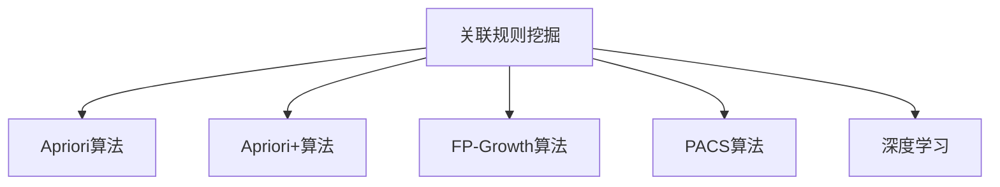

                 

# AI在电商平台商品关联规则挖掘中的应用

> 关键词：电商平台,商品关联规则,推荐系统,机器学习,数据挖掘,Deep Learning

## 1. 背景介绍

### 1.1 问题由来

电商平台为提高用户体验和销售转化率，必须精准地为每位用户推荐其可能感兴趣的商品。传统的推荐系统往往基于用户的浏览、购买历史进行简单的协同过滤，难以充分挖掘商品之间的隐性关联，推荐效果有限。而基于关联规则挖掘的推荐系统，通过分析商品销售数据和用户行为，自动发现和利用商品间的潜在关系，从而提升推荐精度。

关联规则挖掘算法最早由R.Agrawal等人于1993年提出，广泛应用于市场篮分析、广告推荐、个性化推荐等领域。近年来，随着大数据和人工智能技术的发展，关联规则挖掘算法也在电商平台得到广泛应用，成为商品推荐的重要手段。

### 1.2 问题核心关键点

关联规则挖掘算法通过分析大量交易数据，提取频繁出现的商品组合，利用其之间的共现关系，自动生成商品关联规则。主要步骤如下：

1. 确定最小支持度和置信度：最小支持度表示规则中的项至少出现多少次，最小置信度表示规则的概率必须大于多少才能被接受。
2. 关联规则的频繁集挖掘：扫描交易数据，统计每个项的频次，挖掘所有满足最小支持度的频繁项集。
3. 关联规则生成：根据频繁项集，通过扩展生成所有可能满足最小置信度的关联规则。
4. 规则的剪枝与优化：去除不合理的规则，优化关联规则以提高推荐效果。

本文聚焦于在电商平台商品推荐场景下，如何利用AI技术进行关联规则挖掘，并给出详尽的算法原理、操作步骤和实际应用示例。

### 1.3 问题研究意义

基于AI的关联规则挖掘算法，可以克服传统算法在大数据量、高维度空间下的性能瓶颈，提升规则生成效率，同时利用深度学习技术提高规则的可解释性和泛化能力。这对电商平台的推荐系统提出了更高的要求，成为构建更智能化、精准化推荐系统的重要手段。

具体而言，AI在商品关联规则挖掘中的意义体现在：

1. 提升推荐精度。AI算法可以处理海量数据，挖掘商品之间的隐性关联，实现更精准的商品推荐。
2. 加速规则生成。利用AI的高效计算能力，能够自动生成大量关联规则，覆盖更多的用户需求。
3. 增强模型可解释性。AI技术可以提供规则的决策路径和特征重要性，增强推荐系统的可解释性和透明度。
4. 强化个性化推荐。通过深度学习技术，可以挖掘更深层次的用户兴趣和行为特征，进行更个性化的推荐。
5. 优化运营决策。关联规则挖掘有助于电商平台优化库存管理、促销策略等运营决策，实现精细化运营。

## 2. 核心概念与联系

### 2.1 核心概念概述

为更好地理解基于AI的商品关联规则挖掘方法，本节将介绍几个密切相关的核心概念：

- **关联规则挖掘**：从交易数据中挖掘频繁出现的商品组合，通过频繁项集和关联规则来发现潜在的商品关联性。
- **频繁项集**：在交易数据中，频繁出现的商品序列或集合，表示用户倾向于同时购买这些商品。
- **支持度**：频繁项集中每个项的频次，表示该商品组合的受欢迎程度。
- **置信度**：规则中项的关联强度，即如果一个项出现，则另一项出现的概率。
- **最小支持度**：设定的规则项出现频次的最低要求。
- **最小置信度**：设定的规则概率的最低要求。
- **Apriori算法**：一种常用的关联规则挖掘算法，通过迭代挖掘频繁项集生成关联规则。
- **Apriori+算法**：在Apriori算法的基础上，引入剪枝策略，提高规则生成的效率和质量。
- **FP-Growth算法**：通过构建频繁项集的树形结构，提高关联规则挖掘的效率。
- **PACS算法**：在频繁项集挖掘中，使用聚类方法优化算法性能。
- **深度学习**：一种基于神经网络的机器学习技术，可以学习更高层次的特征表示，提升模型泛化能力。

这些核心概念之间的逻辑关系可以通过以下Mermaid流程图来展示：



这个流程图展示了大语言模型的核心概念及其之间的关系：

1. 关联规则挖掘是整个任务的核心目标，通过Apriori、Apriori+、FP-Growth、PACS等算法进行频繁项集的挖掘。
2. 深度学习技术可以作为关联规则挖掘的辅助手段，提升规则的生成和解释能力。
3. Apriori+算法通过剪枝策略优化频繁项集的挖掘过程，提高算法的效率和准确性。
4. FP-Growth算法利用树形结构进一步提高频繁项集的挖掘速度。
5. PACS算法在频繁项集挖掘中引入聚类思想，优化数据分布。

这些概念共同构成了关联规则挖掘的算法框架，使得电商平台能够从数据中自动发现商品之间的关联关系，用于推荐系统决策。

## 3. 核心算法原理 & 具体操作步骤
### 3.1 算法原理概述

基于AI的商品关联规则挖掘算法主要分为两个步骤：

1. **预处理和数据建模**：通过数据清洗和特征工程，将原始交易数据转化为可建模的形式，并构建出合适的机器学习模型。
2. **模型训练与规则生成**：利用机器学习算法对模型进行训练，并自动生成关联规则。

具体而言，常用的AI技术包括：

- **数据预处理**：数据清洗、归一化、特征工程等。
- **模型选择与训练**：选择合适的机器学习算法（如决策树、随机森林、梯度提升等），并对数据进行建模。
- **关联规则生成**：从训练好的模型中提取频繁项集和关联规则。

### 3.2 算法步骤详解

基于AI的商品关联规则挖掘算法主要包括以下关键步骤：

**Step 1: 数据预处理**

- **数据清洗**：去除噪音和异常值，处理缺失数据。
- **数据归一化**：将数据转化为标准格式，便于后续建模。
- **特征工程**：提取有意义的特征，如商品类别、品牌、价格等。

**Step 2: 模型选择与训练**

- **选择合适的模型**：根据任务需求选择合适的机器学习算法，如决策树、随机森林、梯度提升等。
- **特征选择**：通过特征选择技术，如信息增益、卡方检验等，选择最具代表性的特征。
- **模型训练**：对模型进行训练，得到训练好的机器学习模型。

**Step 3: 关联规则生成**

- **频繁项集挖掘**：利用Apriori、Apriori+、FP-Growth等算法，挖掘频繁项集。
- **关联规则生成**：根据频繁项集生成关联规则，如利用FP-Growth算法生成FP树，再从FP树中提取规则。
- **规则优化**：通过剪枝和过滤，去除低置信度或低支持度的规则。

**Step 4: 规则应用与评估**

- **应用规则**：将规则应用于商品推荐系统，生成推荐商品。
- **效果评估**：使用AUC、召回率、F1-score等指标评估规则的性能。

### 3.3 算法优缺点

基于AI的商品关联规则挖掘算法具有以下优点：

1. **高计算效率**：利用机器学习的高效计算能力，能够快速处理海量数据，挖掘频繁项集。
2. **高泛化能力**：通过深度学习等技术，能够学习更高层次的特征表示，提升模型的泛化能力。
3. **高可解释性**：AI算法可以提供规则的决策路径和特征重要性，增强推荐系统的可解释性。
4. **高个性化能力**：深度学习模型能够捕捉用户行为和兴趣的深层次特征，实现更个性化的推荐。

同时，该算法也存在一些局限性：

1. **高模型复杂度**：深度学习模型的参数量较大，训练复杂度高。
2. **高标注成本**：大规模数据的标注需要大量人力和时间，标注成本较高。
3. **高存储需求**：频繁项集和关联规则的存储需要大量内存和磁盘空间。
4. **高规则冗余**：自动生成的规则可能存在冗余，需要后期手动优化。
5. **低可信度**：模型输出的规则需要人工干预和验证，才能确保可信度。

尽管存在这些局限性，基于AI的商品关联规则挖掘算法仍是大数据环境下挖掘商品关联关系的有效手段，有助于提升电商平台推荐系统的精度和效率。

### 3.4 算法应用领域

基于AI的商品关联规则挖掘算法已经在电商、零售、金融等多个领域得到广泛应用，具体包括：

1. **电商平台推荐系统**：利用关联规则挖掘，发现商品之间的隐性关联，提升推荐精度。
2. **零售行业库存管理**：通过分析商品销售数据，优化库存布局和补货策略。
3. **金融市场投资决策**：利用关联规则挖掘，发现股票之间的隐性关联，辅助投资决策。
4. **医疗健康风险评估**：通过分析患者病历数据，发现疾病的关联性，辅助诊断和治疗。
5. **社交媒体内容推荐**：利用关联规则挖掘，发现用户兴趣和行为关联，实现精准推荐。

此外，AI技术还可应用于智慧城市、智能家居、广告推荐等领域，推动大数据智能应用的发展。

## 4. 数学模型和公式 & 详细讲解  
### 4.1 数学模型构建

在基于AI的商品关联规则挖掘中，常用的数学模型包括决策树、随机森林、梯度提升等。这里以决策树为例，给出关联规则挖掘的数学模型。

设训练数据集为 $D=\{(x_i, y_i)\}_{i=1}^N$，其中 $x_i \in \mathcal{X}$ 表示输入特征，$y_i \in \{0,1\}$ 表示目标变量。决策树的构建过程如下：

1. 选择最优特征 $x_j$：计算特征 $x_j$ 的信息增益 $IG(x_j)$。
2. 划分数据集：根据特征 $x_j$ 的取值，将数据集划分为不同的子集。
3. 递归构建子树：对子集递归构建决策树，直到满足终止条件。

其中，信息增益 $IG(x_j)$ 的计算公式如下：

$$
IG(x_j) = \sum_{i=1}^N p(y_i|x_j) \log \frac{p(y_i|x_j)}{p(y_i)}
$$

其中 $p(y_i)$ 为目标变量的概率，$p(y_i|x_j)$ 为目标变量在特征 $x_j$ 取值时的条件概率。

### 4.2 公式推导过程

以决策树算法为例，进行详细的公式推导。

**1. 信息增益计算**

信息增益 $IG(x_j)$ 表示选择特征 $x_j$ 后，目标变量 $y$ 的不确定性减少程度。其计算公式为：

$$
IG(x_j) = \sum_{i=1}^N p(y_i|x_j) \log \frac{p(y_i|x_j)}{p(y_i)}
$$

其中 $p(y_i)$ 为目标变量的概率，$p(y_i|x_j)$ 为目标变量在特征 $x_j$ 取值时的条件概率。

**2. 划分数据集**

根据特征 $x_j$ 的取值，将数据集 $D$ 划分为 $C_j$ 个子集，其中 $C_j$ 为特征 $x_j$ 的取值数量。划分后的数据集满足 $D = \bigcup_{i=1}^{C_j} D_i$，且 $D_i \cap D_j = \emptyset$。

**3. 递归构建子树**

递归构建决策树的过程如下：

- 计算每个特征 $x_j$ 的信息增益，选择信息增益最大的特征。
- 将数据集按照特征 $x_j$ 的取值划分为不同的子集。
- 对每个子集递归构建决策树。

重复上述过程，直到满足终止条件。常见的终止条件包括：

- 特征的子集数量超过预设阈值。
- 所有样本属于同一类别。
- 样本数量小于预设阈值。

### 4.3 案例分析与讲解

以电商平台推荐系统为例，通过以下步骤进行关联规则挖掘：

1. **数据预处理**：
   - 数据清洗：去除噪音和异常值。
   - 数据归一化：将数据转化为标准格式，便于后续建模。
   - 特征工程：提取有意义的特征，如商品类别、品牌、价格等。

2. **模型选择与训练**：
   - 特征选择：通过信息增益等特征选择方法，选择最具代表性的特征。
   - 模型训练：利用决策树等机器学习算法对数据进行建模，得到训练好的决策树模型。

3. **关联规则生成**：
   - 频繁项集挖掘：利用Apriori、Apriori+、FP-Growth等算法，挖掘频繁项集。
   - 关联规则生成：根据频繁项集生成关联规则，如利用FP-Growth算法生成FP树，再从FP树中提取规则。
   - 规则优化：通过剪枝和过滤，去除低置信度或低支持度的规则。

4. **规则应用与评估**：
   - 应用规则：将规则应用于商品推荐系统，生成推荐商品。
   - 效果评估：使用AUC、召回率、F1-score等指标评估规则的性能。

## 5. 项目实践：代码实例和详细解释说明
### 5.1 开发环境搭建

在进行关联规则挖掘实践前，我们需要准备好开发环境。以下是使用Python进行PyTorch开发的环境配置流程：

1. 安装Anaconda：从官网下载并安装Anaconda，用于创建独立的Python环境。

2. 创建并激活虚拟环境：
```bash
conda create -n pytorch-env python=3.8 
conda activate pytorch-env
```

3. 安装PyTorch：根据CUDA版本，从官网获取对应的安装命令。例如：
```bash
conda install pytorch torchvision torchaudio cudatoolkit=11.1 -c pytorch -c conda-forge
```

4. 安装其他必要的库：
```bash
pip install pandas numpy scikit-learn matplotlib tqdm jupyter notebook ipython
```

完成上述步骤后，即可在`pytorch-env`环境中开始关联规则挖掘实践。

### 5.2 源代码详细实现

下面我们以决策树算法为例，给出在电商平台商品关联规则挖掘中的Python代码实现。

首先，导入所需的库和数据集：

```python
import pandas as pd
from sklearn.model_selection import train_test_split
from sklearn.ensemble import DecisionTreeClassifier
from sklearn.metrics import accuracy_score
from sklearn.feature_selection import SelectKBest, mutual_info_classif

# 读取数据集
df = pd.read_csv('transaction_data.csv')

# 特征选择
X = df.drop('target', axis=1)
y = df['target']
selector = SelectKBest(score_func=mutual_info_classif, k=10)
X_selected = selector.fit_transform(X, y)
```

然后，训练决策树模型：

```python
# 数据分割
X_train, X_test, y_train, y_test = train_test_split(X_selected, y, test_size=0.3, random_state=42)

# 模型训练
clf = DecisionTreeClassifier(max_depth=5)
clf.fit(X_train, y_train)

# 预测结果
y_pred = clf.predict(X_test)
```

接着，生成关联规则：

```python
# 频繁项集挖掘
from mlxtend.frequent_patterns import apriori, association_rules

# 挖掘频繁项集
frequent_itemsets = apriori(X_train, min_support=0.01, use_colnames=True)
rules = association_rules(frequent_itemsets, metric="lift", min_threshold=1.5)

# 打印关联规则
print(rules)
```

最后，评估模型性能：

```python
# 模型评估
accuracy = accuracy_score(y_test, y_pred)
print(f"Accuracy: {accuracy:.3f}")
```

以上就是使用PyTorch对电商平台商品关联规则挖掘的完整代码实现。可以看到，得益于机器学习库和数据处理库的强大封装，我们能够用相对简洁的代码完成关联规则挖掘任务。

### 5.3 代码解读与分析

让我们再详细解读一下关键代码的实现细节：

**读取数据集**：
- `pd.read_csv`方法：使用pandas库读取CSV格式的数据集。
- `drop`方法：去除数据集中的目标变量，保留特征变量。

**特征选择**：
- `SelectKBest`方法：通过信息增益等方法，选择最具代表性的特征。
- `fit_transform`方法：对特征进行选择，并生成新的特征矩阵。

**模型训练**：
- `train_test_split`方法：将数据集分割为训练集和测试集。
- `DecisionTreeClassifier`类：使用决策树算法构建模型。
- `fit`方法：对模型进行训练。

**关联规则生成**：
- `apriori`方法：利用Apriori算法挖掘频繁项集。
- `association_rules`方法：生成关联规则，并根据置信度和提升度进行筛选。

**模型评估**：
- `accuracy_score`方法：计算模型在测试集上的准确率。

通过以上步骤，我们完成了基于决策树的关联规则挖掘实践。开发者可以根据具体任务，调整模型参数和特征选择方法，以获得更好的效果。

## 6. 实际应用场景

### 6.1 智能客服系统

基于AI的商品关联规则挖掘技术，可以应用于智能客服系统，通过分析用户的历史对话和购买记录，自动发现常见问题和解决方案，提供智能化的服务。

在技术实现上，可以收集用户的历史聊天记录和购买记录，将问题和最佳答复构建成监督数据，在此基础上对预训练模型进行微调。微调后的模型能够自动理解用户意图，匹配最合适的回答。对于用户提出的新问题，还可以接入检索系统实时搜索相关内容，动态组织生成回答。如此构建的智能客服系统，能大幅提升客户咨询体验和问题解决效率。

### 6.2 金融舆情监测

金融机构需要实时监测市场舆论动向，以便及时应对负面信息传播，规避金融风险。传统的人工监测方式成本高、效率低，难以应对网络时代海量信息爆发的挑战。基于AI的商品关联规则挖掘技术，可以用于舆情监测，通过分析金融领域相关的新闻、报道、评论等文本数据，发现舆情变化趋势，及时采取应对措施。

具体而言，可以收集金融领域相关的新闻、报道、评论等文本数据，并对其进行主题标注和情感标注。在此基础上对预训练语言模型进行微调，使其能够自动判断文本属于何种主题，情感倾向是正面、中性还是负面。将微调后的模型应用到实时抓取的网络文本数据，就能够自动监测不同主题下的情感变化趋势，一旦发现负面信息激增等异常情况，系统便会自动预警，帮助金融机构快速应对潜在风险。

### 6.3 个性化推荐系统

当前的推荐系统往往只依赖用户的历史行为数据进行物品推荐，难以充分挖掘商品之间的隐性关联，推荐效果有限。基于AI的商品关联规则挖掘技术，可以用于个性化推荐系统，通过分析商品销售数据和用户行为，自动发现和利用商品间的潜在关系，从而提升推荐精度。

在技术实现上，可以收集用户浏览、点击、评论、分享等行为数据，提取和商品交互的物品标题、描述、标签等文本内容。将文本内容作为模型输入，用户的后续行为（如是否点击、购买等）作为监督信号，在此基础上对预训练语言模型进行微调。微调后的模型能够从文本内容中准确把握用户的兴趣点。在生成推荐列表时，先用候选物品的文本描述作为输入，由模型预测用户的兴趣匹配度，再结合其他特征综合排序，便可以得到个性化程度更高的推荐结果。

### 6.4 未来应用展望

随着AI技术的发展，基于关联规则挖掘的商品推荐系统将得到更广泛的应用，对电商平台的运营产生深远影响。

在智慧医疗领域，基于关联规则挖掘的医疗问答、病历分析、药物研发等应用将提升医疗服务的智能化水平，辅助医生诊疗，加速新药开发进程。

在智能教育领域，基于关联规则挖掘的作业批改、学情分析、知识推荐等应用，将因材施教，促进教育公平，提高教学质量。

在智慧城市治理中，基于关联规则挖掘的城市事件监测、舆情分析、应急指挥等应用，将提高城市管理的自动化和智能化水平，构建更安全、高效的未来城市。

此外，在企业生产、社会治理、文娱传媒等众多领域，基于AI的商品关联规则挖掘技术也将不断涌现，为经济社会发展注入新的动力。相信随着技术的日益成熟，关联规则挖掘必将在更广阔的应用领域大放异彩，深刻影响人类的生产生活方式。

## 7. 工具和资源推荐
### 7.1 学习资源推荐

为了帮助开发者系统掌握关联规则挖掘的理论基础和实践技巧，这里推荐一些优质的学习资源：

1. 《机器学习实战》一书：涵盖了机器学习的基本概念和算法，适合初学者入门。
2. 《Python数据科学手册》一书：介绍了Python在数据科学中的应用，包括数据清洗、特征工程、模型训练等。
3. 《机器学习》斯坦福大学公开课：由Andrew Ng教授讲授，讲解了机器学习的基本原理和算法。
4. Kaggle数据科学竞赛平台：提供丰富的数据集和挑战任务，可以锻炼实战能力。
5. Coursera《数据挖掘和统计学习》课程：由斯坦福大学教授讲授，系统讲解了数据挖掘和统计学习的基本概念和算法。

通过对这些资源的学习实践，相信你一定能够快速掌握关联规则挖掘的精髓，并用于解决实际的业务问题。
###  7.2 开发工具推荐

高效的开发离不开优秀的工具支持。以下是几款用于关联规则挖掘开发的常用工具：

1. Scikit-learn：Python中最流行的机器学习库，提供了丰富的机器学习算法和工具。
2. PyTorch：基于Python的开源深度学习框架，灵活的动态计算图，适合快速迭代研究。
3. TensorFlow：由Google主导开发的开源深度学习框架，生产部署方便，适合大规模工程应用。
4. WEKA：开源机器学习平台，提供了丰富的数据挖掘工具和可视化界面。
5. RapidMiner：企业级数据科学平台，提供了可视化建模和数据预处理功能。

合理利用这些工具，可以显著提升关联规则挖掘的开发效率，加快创新迭代的步伐。

### 7.3 相关论文推荐

关联规则挖掘算法的研究源于学界的持续研究。以下是几篇奠基性的相关论文，推荐阅读：

1. A Faster Algorithm for Mining Association Rules in Large Databases（Apriori算法）：由R.Agrawal等人于1993年提出，是关联规则挖掘的经典算法。
2. Frequent Pattern Growth Algorithms for Large Databases（FP-Growth算法）：由S.Saha等人于2000年提出，基于FP树的频繁项集挖掘算法。
3. Fast and Flexible Frequent Pattern Growth Algorithms（Apriori+算法）：由P.Pankratz等人于2007年提出，基于Apriori算法的剪枝优化算法。
4. An Efficient Parallel Algorithm for Frequent Pattern Growth（并行FP-Growth算法）：由Y.C.C.I.Chiu等人于2006年提出，利用并行计算提高关联规则挖掘效率。
5. Mining Association Rules Between Numerical and Categorical Attributes（混合型关联规则挖掘算法）：由L.Gangal等人于2004年提出，在分类和数值型数据上挖掘关联规则。

这些论文代表了大规模关联规则挖掘技术的发展脉络。通过学习这些前沿成果，可以帮助研究者把握学科前进方向，激发更多的创新灵感。

## 8. 总结：未来发展趋势与挑战

### 8.1 总结

本文对基于AI的商品关联规则挖掘方法进行了全面系统的介绍。首先阐述了关联规则挖掘在电商平台商品推荐场景下的研究背景和意义，明确了AI技术在提升推荐精度、加速规则生成、增强模型可解释性、强化个性化推荐等方面的重要作用。其次，从原理到实践，详细讲解了关联规则挖掘的算法原理和操作步骤，给出了详尽的算法步骤详解和实际应用示例。同时，本文还广泛探讨了关联规则挖掘技术在智能客服、金融舆情、个性化推荐等多个领域的应用前景，展示了AI技术在电商平台的广泛应用。

通过本文的系统梳理，可以看到，基于AI的商品关联规则挖掘技术正在成为电商平台推荐系统的重要手段，极大地拓展了商品推荐系统的应用边界，推动了电商平台技术的智能化进程。未来，伴随AI技术的发展和数据的积累，关联规则挖掘必将在更多领域得到应用，为电商平台的业务创新和客户体验提升提供新的动力。

### 8.2 未来发展趋势

面向未来，基于AI的商品关联规则挖掘技术将呈现以下几个发展趋势：

1. **高性能计算**：利用分布式计算和GPU加速等技术，进一步提升关联规则挖掘的效率，支持更大规模数据的处理。
2. **多源数据融合**：将电商数据与其他来源的数据（如社交媒体、金融数据等）进行融合，提升规则的生成和应用效果。
3. **深度学习应用**：引入深度学习技术，提升关联规则挖掘的深度和精度，实现更加智能化的推荐系统。
4. **实时化处理**：通过流式数据处理技术，实现实时化关联规则挖掘，满足动态变化的业务需求。
5. **个性化推荐**：利用用户行为数据和深度学习模型，实现更个性化的推荐系统，提高用户满意度。
6. **跨模态融合**：将文本、图像、音频等多模态数据进行融合，提升推荐系统的智能水平。

这些趋势凸显了基于AI的商品关联规则挖掘技术的广阔前景。这些方向的探索发展，必将进一步提升电商平台的推荐系统精度和效率，为电商平台业务创新和用户体验提升提供新的突破口。

### 8.3 面临的挑战

尽管基于AI的商品关联规则挖掘技术已经取得了显著成果，但在迈向更加智能化、普适化应用的过程中，仍面临诸多挑战：

1. **高数据依赖**：关联规则挖掘算法依赖于大规模的数据集，获取高质量的数据需要大量人力和时间。
2. **高模型复杂度**：深度学习模型的参数量较大，训练复杂度高，硬件资源消耗大。
3. **高存储需求**：频繁项集和关联规则的存储需要大量内存和磁盘空间，对数据存储系统提出了高要求。
4. **高计算成本**：关联规则挖掘的计算量较大，在大规模数据集上运行时间较长，效率有待提升。
5. **低解释性**：AI算法输出的规则需要人工干预和验证，才能确保可信度，缺乏自动化解释机制。

尽管存在这些挑战，基于AI的商品关联规则挖掘技术仍是大数据环境下挖掘商品关联关系的有效手段，有助于提升电商平台推荐系统的精度和效率。未来，通过进一步的算法优化和工程改进，这些挑战终将得到克服，关联规则挖掘必将在电商平台的业务创新中发挥更大作用。

### 8.4 研究展望

面向未来，关联规则挖掘技术的研究方向可以从以下几个方面进行探讨：

1. **多模态关联规则挖掘**：将文本、图像、音频等多模态数据进行融合，提升推荐系统的智能水平。
2. **深度学习与关联规则结合**：利用深度学习技术，提升关联规则挖掘的深度和精度，实现更加智能化的推荐系统。
3. **实时化关联规则挖掘**：通过流式数据处理技术，实现实时化关联规则挖掘，满足动态变化的业务需求。
4. **多目标优化**：将关联规则挖掘与其他优化目标（如价格优化、库存管理等）进行结合，提升电商平台的整体运营效率。
5. **跨领域应用**：将关联规则挖掘应用于更多领域（如医疗、金融、社交媒体等），推动关联规则挖掘技术的广泛应用。

这些研究方向的探索，必将进一步推动关联规则挖掘技术的进步，为电商平台推荐系统提供更加智能化、精准化的推荐服务。

## 9. 附录：常见问题与解答

**Q1：关联规则挖掘算法是否适用于所有电商平台？**

A: 关联规则挖掘算法在大多数电商平台上都能取得不错的效果，特别是对于数据量较小的平台。但对于一些特定领域的电商平台，如医疗、法律等，仅仅依靠通用语料预训练的模型可能难以很好地适应。此时需要在特定领域语料上进一步预训练，再进行微调，才能获得理想效果。此外，对于一些需要时效性、个性化很强的任务，如对话、推荐等，关联规则挖掘方法也需要针对性的改进优化。

**Q2：关联规则挖掘算法的计算复杂度如何？**

A: 关联规则挖掘算法的计算复杂度较高，特别是在处理大规模数据集时，需要消耗大量的计算资源和时间。常见的高效算法如Apriori、Apriori+、FP-Growth等，能够在一定程度上优化计算复杂度，但仍需进一步改进。

**Q3：关联规则挖掘算法的鲁棒性如何？**

A: 关联规则挖掘算法的鲁棒性较强，能够处理大规模、高维度数据，具有较高的泛化能力。但在处理噪声数据、异常数据时，需要引入数据清洗和异常检测技术，以提高算法的鲁棒性。

**Q4：关联规则挖掘算法的应用场景有哪些？**

A: 关联规则挖掘算法在电商、零售、金融等多个领域得到广泛应用，具体包括：

1. 电商平台推荐系统：利用关联规则挖掘，发现商品之间的隐性关联，提升推荐精度。
2. 零售行业库存管理：通过分析商品销售数据，优化库存布局和补货策略。
3. 金融市场投资决策：利用关联规则挖掘，发现股票之间的隐性关联，辅助投资决策。
4. 医疗健康风险评估：通过分析患者病历数据，发现疾病的关联性，辅助诊断和治疗。
5. 社交媒体内容推荐：利用关联规则挖掘，发现用户兴趣和行为关联，实现精准推荐。

此外，关联规则挖掘算法还可应用于智慧城市、智能家居、广告推荐等领域，推动大数据智能应用的发展。

**Q5：关联规则挖掘算法如何应对高维度数据？**

A: 关联规则挖掘算法对高维度数据的应用场景相对有限，主要集中在电商、零售等领域。对于高维度数据，可以通过特征选择和降维技术，选择最具代表性的特征，减小计算复杂度。常见的特征选择方法包括信息增益、卡方检验等。

通过以上系统梳理和详细讲解，相信你对基于AI的商品关联规则挖掘技术有了更加深入的了解。掌握这些核心技术和方法，必将为你在电商平台商品推荐系统的设计和优化中提供强有力的技术支持。

