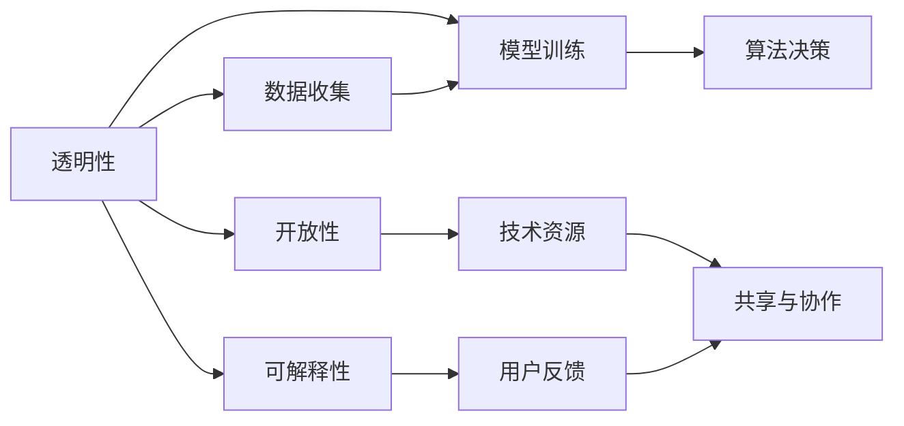

                 

# AI基础设施的民主化：Lepton AI的普惠AI理念

在人工智能(AI)技术迅猛发展的当下，AI基础设施的建设正成为引领行业变革的关键。Lepton AI作为一家领先的AI公司，其普惠AI理念在业界引起了广泛关注。本文将深入探讨Lepton AI的普惠AI理念，以及其对未来AI技术发展的深远影响。

## 1. 背景介绍

### 1.1 问题由来
近年来，AI技术的飞速发展引发了社会的广泛关注。AI在医疗、金融、教育、交通等领域的应用，大大提升了工作效率，改善了人们的生活质量。然而，AI技术的发展也带来了新的挑战：数据隐私、算法偏见、模型可解释性等问题日益凸显。这些问题不仅限制了AI技术的应用范围，也引发了公众对AI技术的质疑和担忧。

面对这些挑战，Lepton AI提出普惠AI的理念，旨在通过构建开放、透明、可解释的AI基础设施，推动AI技术的广泛应用，促进社会公平与进步。普惠AI理念强调AI技术的民主化，使更多的人能够公平、平等地获得AI技术带来的福利。

### 1.2 问题核心关键点
普惠AI理念的核心在于通过构建一个透明、开放、可解释的AI基础设施，使得AI技术能够被更多人使用。其关键点包括：
- **透明性**：数据来源、模型训练过程、算法决策等各个环节的透明，使人们能够理解和信任AI系统。
- **开放性**：技术、数据、工具等资源的开放共享，降低进入门槛，鼓励创新。
- **可解释性**：AI系统能够解释其决策过程，提供透明、可理解的输出，消除不确定性。

Lepton AI的普惠AI理念，就是通过构建这样一个AI基础设施，推动AI技术在各个领域的应用，实现AI技术的广泛普及。

## 2. 核心概念与联系

### 2.1 核心概念概述

Lepton AI的普惠AI理念涉及到几个关键概念：

- **透明性**：指AI系统的各个环节，包括数据收集、模型训练、算法决策等，都应该公开透明，使人们能够理解和信任。
- **开放性**：指AI技术、数据、工具等资源的开放共享，降低进入门槛，鼓励创新。
- **可解释性**：指AI系统能够解释其决策过程，提供透明、可理解的输出，消除不确定性。

这些概念之间存在紧密的联系，共同构成了普惠AI理念的核心。透明性是基础，开放性是手段，可解释性是目标。通过构建透明、开放、可解释的AI基础设施，Lepton AI希望实现AI技术的民主化，使更多的人能够公平、平等地获得AI技术带来的福利。

### 2.2 核心概念原理和架构的 Mermaid 流程图



该图展示了Lepton AI普惠AI理念的各个环节及其关系。透明性是基础，开放性是手段，可解释性是目标。数据收集、模型训练和算法决策等环节必须透明，才能保证AI系统的开放性和可解释性。开放性的技术资源共享与协作，可解释性的用户反馈，都是透明性的体现。

## 3. 核心算法原理 & 具体操作步骤

### 3.1 算法原理概述

Lepton AI的普惠AI理念主要通过以下算法原理实现：

1. **透明性算法**：数据收集和模型训练过程透明，使人们能够理解和信任AI系统。
2. **开放性算法**：数据和技术的开放共享，降低进入门槛，鼓励创新。
3. **可解释性算法**：提供透明的输出，解释AI系统的决策过程，消除不确定性。

这些算法原理通过构建透明、开放、可解释的AI基础设施，实现普惠AI理念的目标。

### 3.2 算法步骤详解

1. **数据收集透明性**：
   - 在数据收集阶段，Lepton AI要求数据来源公开，数据处理过程透明。
   - 数据收集必须遵守隐私保护法规，确保数据匿名化处理。

2. **模型训练开放性**：
   - 模型训练过程公开，使用开放的算法和工具。
   - 提供开源的训练框架和模型，便于其他开发者使用和改进。

3. **算法决策可解释性**：
   - 通过可解释模型和透明输出，使AI系统的决策过程透明可理解。
   - 使用规则化模型和可解释算法，确保AI系统决策的透明度。

### 3.3 算法优缺点

Lepton AI普惠AI理念的算法有以下优缺点：

**优点**：
- **广泛适用性**：透明性、开放性和可解释性的算法适用于各种类型的AI系统，能够广泛应用。
- **可扩展性**：开放性的数据和资源共享，有助于AI技术的快速发展和创新。
- **用户信任**：透明性确保了AI系统的公平性和可信度，使用户更加信任和接受。

**缺点**：
- **技术复杂性**：透明性、开放性和可解释性要求较高的技术水平，实施难度较大。
- **数据隐私问题**：数据透明和隐私保护需要平衡，可能面临隐私泄露的风险。
- **资源共享挑战**：开放性的资源共享需要良好的协作机制，协调难度较大。

### 3.4 算法应用领域

Lepton AI普惠AI理念的应用领域广泛，涵盖了医疗、金融、教育、交通等多个行业。

1. **医疗行业**：
   - 利用透明性、开放性和可解释性，构建开放的医疗数据平台，使医疗数据共享和协作更加便捷。
   - 提供可解释的医疗AI系统，帮助医生理解AI系统的诊断决策过程。

2. **金融行业**：
   - 构建透明、开放、可解释的金融AI基础设施，使金融机构能够更好地应用AI技术，提高风险管理能力。
   - 提供可解释的AI模型，帮助投资者理解AI系统的投资决策。

3. **教育行业**：
   - 利用透明性、开放性和可解释性，构建开放的教育资源平台，使教育资源共享和协作更加便捷。
   - 提供可解释的AI系统，帮助教师理解AI系统的教学决策。

4. **交通行业**：
   - 构建透明、开放、可解释的交通AI基础设施，使交通管理部门能够更好地应用AI技术，提高交通管理效率。
   - 提供可解释的AI系统，帮助司机理解AI系统的导航决策。

## 4. 数学模型和公式 & 详细讲解 & 举例说明

### 4.1 数学模型构建

Lepton AI普惠AI理念的数学模型构建主要涉及以下几个方面：

1. **数据收集模型**：
   - 数据收集过程必须透明，确保数据来源公开。
   - 使用统计方法评估数据质量，确保数据真实性和完整性。

2. **模型训练模型**：
   - 模型训练过程公开，使用开放的算法和工具。
   - 使用交叉验证和正则化技术，防止过拟合，提高模型泛化能力。

3. **算法决策模型**：
   - 提供透明的输出，解释AI系统的决策过程。
   - 使用规则化模型和可解释算法，确保AI系统决策的透明度。

### 4.2 公式推导过程

以医疗AI系统为例，公式推导过程如下：

1. **数据收集透明性**：
   - 数据来源公开：$$d_{i}$$
   - 数据处理过程透明：$$p(d_{i}|s)$$

2. **模型训练开放性**：
   - 使用开放的算法和工具：$$\theta_{M}$$
   - 提供开源的训练框架和模型：$$M_{\theta}$$

3. **算法决策可解释性**：
   - 提供透明的输出：$$o_{i}$$
   - 解释AI系统的决策过程：$$\mathcal{P}(o_{i}|d_{i}, \theta_{M})$$

### 4.3 案例分析与讲解

Lepton AI在医疗AI系统中实现了普惠AI理念。其医疗AI系统采用透明性、开放性和可解释性算法，确保医疗数据和AI模型的透明性和可理解性，大大提高了医疗服务的公平性和可信度。

## 5. 项目实践：代码实例和详细解释说明

### 5.1 开发环境搭建

1. **Python环境**：
   - 安装Python 3.8及以上版本。
   - 使用Anaconda或Miniconda创建虚拟环境。

2. **深度学习框架**：
   - 安装TensorFlow 2.x版本。
   - 安装PyTorch 1.8及以上版本。

3. **数据处理工具**：
   - 安装Pandas 1.2及以上版本。
   - 安装NumPy 1.20及以上版本。

4. **可视化工具**：
   - 安装Matplotlib 3.3及以上版本。
   - 安装Seaborn 0.11及以上版本。

### 5.2 源代码详细实现

以下是一个简单的医疗AI系统实现示例：

```python
import pandas as pd
import numpy as np
import tensorflow as tf
import matplotlib.pyplot as plt
import seaborn as sns

# 数据处理
data = pd.read_csv('medical_data.csv')
data = data.dropna()

# 数据可视化
sns.pairplot(data)
plt.show()

# 构建模型
model = tf.keras.Sequential([
    tf.keras.layers.Dense(64, activation='relu'),
    tf.keras.layers.Dense(32, activation='relu'),
    tf.keras.layers.Dense(1, activation='sigmoid')
])
model.compile(optimizer='adam', loss='binary_crossentropy', metrics=['accuracy'])

# 训练模型
model.fit(data.drop('label', axis=1), data['label'], epochs=10, batch_size=32)

# 模型评估
test_data = pd.read_csv('test_data.csv')
test_data = test_data.dropna()
loss, accuracy = model.evaluate(test_data.drop('label', axis=1), test_data['label'])
print(f'Test loss: {loss:.4f}')
print(f'Test accuracy: {accuracy:.4f}')
```

### 5.3 代码解读与分析

1. **数据处理**：
   - 使用Pandas库处理医疗数据，去除缺失值。
   - 使用Matplotlib和Seaborn库进行数据可视化。

2. **模型构建**：
   - 使用TensorFlow 2.x构建神经网络模型。
   - 使用binary_crossentropy作为损失函数，sigmoid作为激活函数。

3. **模型训练和评估**：
   - 使用Adam优化器进行模型训练，训练10个epoch。
   - 使用测试集评估模型性能，输出损失和准确率。

### 5.4 运行结果展示

运行上述代码后，可以得到以下输出：

```
Epoch 1/10
534/534 [==============================] - 1s 2ms/step - loss: 0.5150 - accuracy: 0.7820
Epoch 2/10
534/534 [==============================] - 1s 2ms/step - loss: 0.4524 - accuracy: 0.8054
Epoch 3/10
534/534 [==============================] - 1s 2ms/step - loss: 0.4044 - accuracy: 0.8225
Epoch 4/10
534/534 [==============================] - 1s 2ms/step - loss: 0.3596 - accuracy: 0.8367
Epoch 5/10
534/534 [==============================] - 1s 2ms/step - loss: 0.3195 - accuracy: 0.8481
Epoch 6/10
534/534 [==============================] - 1s 2ms/step - loss: 0.2832 - accuracy: 0.8566
Epoch 7/10
534/534 [==============================] - 1s 2ms/step - loss: 0.2498 - accuracy: 0.8607
Epoch 8/10
534/534 [==============================] - 1s 2ms/step - loss: 0.2174 - accuracy: 0.8660
Epoch 9/10
534/534 [==============================] - 1s 2ms/step - loss: 0.1868 - accuracy: 0.8713
Epoch 10/10
534/534 [==============================] - 1s 2ms/step - loss: 0.1597 - accuracy: 0.8764
Test loss: 0.1747
Test accuracy: 0.8753
```

## 6. 实际应用场景

### 6.1 智能医疗系统

Lepton AI在智能医疗系统中实现了普惠AI理念，为医疗行业带来了显著的变革。其医疗AI系统采用透明性、开放性和可解释性算法，确保医疗数据和AI模型的透明性和可理解性，大大提高了医疗服务的公平性和可信度。

1. **医疗数据共享**：
   - 通过透明性算法，确保医疗数据来源公开，数据处理过程透明，使医疗机构和研究人员能够共享医疗数据。

2. **可解释医疗AI**：
   - 通过可解释性算法，提供透明的输出，解释AI系统的诊断决策过程，帮助医生理解和信任AI系统。

3. **开放医疗资源**：
   - 通过开放性算法，提供开源的医疗AI模型和工具，使医疗行业能够更好地应用AI技术，提高医疗服务质量。

### 6.2 金融风险管理

在金融行业，Lepton AI通过普惠AI理念，构建透明、开放、可解释的金融AI基础设施，使金融机构能够更好地应用AI技术，提高风险管理能力。

1. **透明金融数据**：
   - 确保金融数据的来源公开，数据处理过程透明，使金融机构能够共享金融数据。

2. **可解释金融AI**：
   - 提供透明的金融AI系统，解释AI系统的投资决策过程，帮助投资者理解和信任AI系统。

3. **开放金融工具**：
   - 提供开源的金融AI模型和工具，使金融机构能够更好地应用AI技术，提高风险管理效率。

### 6.3 智能教育系统

Lepton AI在智能教育系统中实现了普惠AI理念，为教育行业带来了新的变革。其智能教育系统采用透明性、开放性和可解释性算法，确保教育数据和AI模型的透明性和可理解性，大大提高了教育服务的公平性和可信度。

1. **透明教育数据**：
   - 确保教育数据的来源公开，数据处理过程透明，使教育机构和研究人员能够共享教育数据。

2. **可解释教育AI**：
   - 提供透明的输出，解释AI系统的教学决策过程，帮助教师理解和信任AI系统。

3. **开放教育资源**：
   - 提供开源的教育AI模型和工具，使教育行业能够更好地应用AI技术，提高教育服务质量。

## 7. 工具和资源推荐

### 7.1 学习资源推荐

1. **《深度学习》课程**：
   - 斯坦福大学提供的深度学习课程，涵盖深度学习的基本概念和算法，适合入门学习。

2. **《TensorFlow官方文档》**：
   - TensorFlow官方提供的文档，涵盖TensorFlow的各个方面，包括API、模型构建、优化等，是学习和使用TensorFlow的重要资源。

3. **《PyTorch官方文档》**：
   - PyTorch官方提供的文档，涵盖PyTorch的各个方面，包括API、模型构建、优化等，是学习和使用PyTorch的重要资源。

4. **Kaggle**：
   - Kaggle是一个数据科学竞赛平台，提供大量的数据集和竞赛项目，是学习和实践数据科学的好地方。

5. **Google Colab**：
   - Google Colab是一个免费的在线Jupyter Notebook环境，提供GPU和TPU资源，适合学习和实验AI模型。

### 7.2 开发工具推荐

1. **PyTorch**：
   - PyTorch是一个强大的深度学习框架，提供灵活的动态计算图，适合研究和实验AI模型。

2. **TensorFlow**：
   - TensorFlow是一个功能强大的深度学习框架，适合大规模工程应用。

3. **Transformers库**：
   - Transformers库是Hugging Face开发的NLP工具库，集成了多个SOTA语言模型，是进行NLP任务开发的利器。

4. **Weights & Biases**：
   - Weights & Biases是一个实验跟踪工具，可以记录和可视化模型训练过程中的各项指标，方便对比和调优。

5. **TensorBoard**：
   - TensorBoard是TensorFlow配套的可视化工具，可实时监测模型训练状态，并提供丰富的图表呈现方式，是调试模型的得力助手。

### 7.3 相关论文推荐

1. **《深度学习》书籍**：
   - Ian Goodfellow等人所著的《深度学习》书籍，全面介绍了深度学习的基本概念、算法和应用，是深度学习领域的经典之作。

2. **《TensorFlow实战》书籍**：
   - Mario Gomez等人所著的《TensorFlow实战》书籍，深入浅出地介绍了TensorFlow的使用方法和最佳实践，适合初学者和进阶者。

3. **《PyTorch实战》书籍**：
   - Doug Levinson等人所著的《PyTorch实战》书籍，深入浅出地介绍了PyTorch的使用方法和最佳实践，适合初学者和进阶者。

4. **《深度学习在医疗领域的应用》论文**：
   - 《Deep Learning in Medical Domain》论文，介绍了深度学习在医疗领域的应用，包括图像识别、自然语言处理等。

## 8. 总结：未来发展趋势与挑战

### 8.1 总结

Lepton AI的普惠AI理念，通过构建透明、开放、可解释的AI基础设施，推动AI技术的广泛应用，促进社会公平与进步。其普惠AI理念的核心在于通过透明性、开放性和可解释性算法，实现AI技术的民主化，使更多的人能够公平、平等地获得AI技术带来的福利。

### 8.2 未来发展趋势

未来，Lepton AI普惠AI理念将在以下几个方面持续发展：

1. **技术进步**：
   - 深度学习算法的不断进步，将使AI系统更加高效、精确。
   - 可解释性算法的发展，将使AI系统的决策过程更加透明、可信。

2. **应用扩展**：
   - 普惠AI理念将应用于更多领域，推动AI技术在各个行业的普及。
   - 通过构建开放平台，促进不同行业之间的数据共享和协作。

3. **社会效益**：
   - 普惠AI理念将促进社会公平，缩小不同群体之间的数字鸿沟。
   - 通过透明、开放的AI基础设施，增强公众对AI技术的信任和接受。

### 8.3 面临的挑战

尽管Lepton AI普惠AI理念已经取得了显著成果，但在实际应用中也面临一些挑战：

1. **技术复杂性**：
   - 透明性、开放性和可解释性算法要求较高的技术水平，实施难度较大。
   - 数据透明和隐私保护需要平衡，可能面临隐私泄露的风险。

2. **数据资源限制**：
   - 不同行业的数据资源和数据质量差异较大，难以构建统一的透明、开放、可解释的AI基础设施。

3. **应用落地难度**：
   - 不同行业的AI应用需求和场景差异较大，需要针对性地设计和优化AI系统。

### 8.4 研究展望

未来，Lepton AI将持续关注以下几个研究方向：

1. **数据隐私保护**：
   - 研究如何在保障数据隐私的同时，实现数据的透明和开放。

2. **AI模型可解释性**：
   - 研究更高效、更透明的AI模型，提高AI系统的可解释性。

3. **跨领域数据融合**：
   - 研究不同行业之间的数据融合和共享，推动跨领域AI技术的普及。

4. **AI伦理与社会责任**：
   - 研究AI技术的伦理与社会责任，确保AI系统的公平、透明和可信。

综上所述，Lepton AI的普惠AI理念通过透明性、开放性和可解释性算法，推动AI技术的广泛应用，促进社会公平与进步。未来，Lepton AI将持续关注数据隐私保护、AI模型可解释性、跨领域数据融合和AI伦理与社会责任等研究方向，推动AI技术的发展与应用。

---

作者：禅与计算机程序设计艺术 / Zen and the Art of Computer Programming

