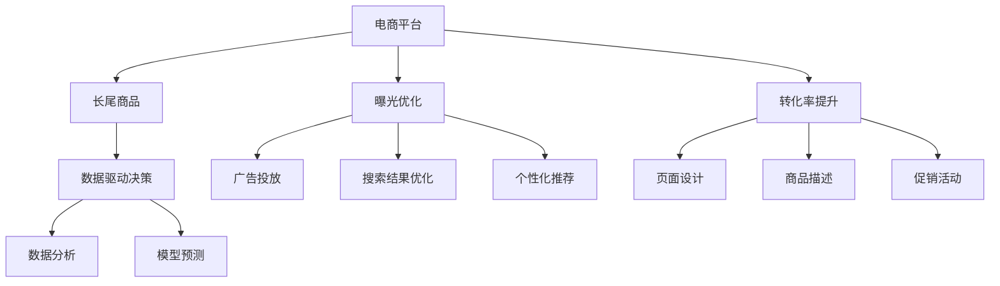

                 

# AI如何优化电商平台的长尾商品曝光与转化率提升策略

> 关键词：电商平台,长尾商品,曝光,转化率,人工智能,优化策略,机器学习,深度学习

## 1. 背景介绍

### 1.1 问题由来

随着互联网技术的发展，电商平台的商品种类越来越多样化，其中长尾商品的比例不断上升。长尾商品是指那些需求较少、非主流但具有特定需求的物品，它们往往在传统电商平台上被忽视，无法获得足够的曝光和销售。然而，这些商品对商家和消费者来说都具有重要价值。对于商家而言，长尾商品的销售可以为他们带来新的收入来源；对于消费者而言，长尾商品提供了更多样化的选择。因此，如何优化电商平台的长尾商品曝光与转化率，成为电商从业者和技术研究人员共同关注的问题。

### 1.2 问题核心关键点

为了提高长尾商品的曝光与转化率，电商平台需要通过一系列的优化策略，包括但不限于：

- **曝光优化**：通过广告投放、搜索结果优化、个性化推荐等手段，增加长尾商品的可见性。
- **转化率提升**：通过页面设计、商品描述、促销活动等手段，提高长尾商品的吸引力，降低购买障碍。
- **数据驱动决策**：利用AI和大数据技术，对长尾商品的销售数据进行分析和预测，指导优化策略的制定。

## 2. 核心概念与联系

### 2.1 核心概念概述

- **电商平台**：提供在线商品展示、搜索、购买等服务的平台。
- **长尾商品**：指那些需求较小、价格较低的商品，其销量贡献不大但种类繁多。
- **曝光**：指消费者看到某个商品的能力。
- **转化率**：指看到商品后实际购买的比例。
- **AI和大数据**：通过人工智能和大数据技术，对电商平台的数据进行分析，提供优化的依据。

这些概念之间的关系可以通过以下Mermaid流程图来展示：



这个流程图展示了电商平台优化长尾商品曝光与转化率的主要流程：电商平台通过广告投放、搜索结果优化、个性化推荐等手段，增加长尾商品的可见性；通过页面设计、商品描述、促销活动等手段，提高长尾商品的吸引力，降低购买障碍；同时，利用AI和大数据技术，对长尾商品的销售数据进行分析和预测，指导优化策略的制定。

## 3. 核心算法原理 & 具体操作步骤

### 3.1 算法原理概述

基于AI的电商平台长尾商品曝光与转化率优化策略，主要依赖于以下算法原理：

- **机器学习算法**：利用监督学习和强化学习算法，通过历史数据训练模型，预测长尾商品的销售趋势，指导广告投放和个性化推荐。
- **深度学习算法**：通过构建神经网络模型，从用户行为数据中提取特征，进行商品推荐和个性化页面设计。
- **自然语言处理(NLP)**：通过分析用户评论和商品描述，进行情感分析和关键字提取，优化商品描述和搜索结果。

这些算法原理相互作用，共同提升长尾商品的曝光与转化率。

### 3.2 算法步骤详解

以下是基于AI的电商平台长尾商品曝光与转化率优化策略的具体操作步骤：

**Step 1: 数据收集与预处理**

- 收集电商平台的用户行为数据，包括点击、浏览、购买、评价等行为。
- 对数据进行清洗和处理，去除噪声和异常值，填充缺失数据。
- 将用户行为数据按照时间顺序进行排序，形成时序数据集。

**Step 2: 特征提取与构建**

- 使用TF-IDF、词嵌入等方法，提取文本数据中的关键特征。
- 利用深度学习模型，从用户行为数据中提取隐含特征，如用户兴趣、购物习惯等。
- 构建商品特征向量，包括商品名称、描述、价格、类别等。

**Step 3: 模型训练与优化**

- 选择适合的机器学习或深度学习模型，如随机森林、XGBoost、LSTM、RNN等。
- 使用历史数据训练模型，预测用户行为和购买意愿。
- 使用交叉验证、网格搜索等方法，优化模型参数，提升预测精度。

**Step 4: 策略制定与执行**

- 根据模型预测结果，制定广告投放策略、搜索结果优化策略、个性化推荐策略等。
- 利用自然语言处理技术，优化商品描述和页面设计，提升用户体验。
- 实时监测模型效果，根据反馈调整策略。

**Step 5: 效果评估与迭代**

- 使用A/B测试等方法，评估优化策略的效果。
- 根据评估结果，进行策略迭代和优化。
- 定期更新模型，保持其对新数据的适应性。

### 3.3 算法优缺点

基于AI的电商平台长尾商品曝光与转化率优化策略具有以下优点：

- **效果显著**：通过数据驱动的优化策略，可以有效提升长尾商品的曝光与转化率。
- **自动化程度高**：利用机器学习和深度学习算法，自动生成优化策略，减少了人工干预。
- **动态调整**：能够根据实时数据动态调整策略，及时响应市场变化。

然而，该策略也存在以下缺点：

- **数据质量要求高**：数据质量直接影响模型的预测效果，需要高质量、完整的数据。
- **模型复杂度高**：深度学习模型的训练复杂度较高，需要较强的计算资源。
- **策略解释性不足**：基于AI的优化策略缺乏可解释性，难以理解和调试。

## 4. 数学模型和公式 & 详细讲解  
### 4.1 数学模型构建

假设电商平台的长尾商品数量为 $N$，用户数量为 $M$。设每个长尾商品在时间 $t$ 的曝光量为 $E_t$，转化率为 $C_t$。则电商平台在时间 $t$ 的总曝光量为 $E_t = \sum_{i=1}^{N}E_{it}$，总转化率为 $C_t = \sum_{i=1}^{N}C_{it}$。电商平台的目标是最大化总转化率 $C_t$。

### 4.2 公式推导过程

基于上述假设，可以构建以下优化模型：

$$
\max_{E} \sum_{i=1}^{N}C_{it} = \max_{E} \sum_{i=1}^{N}\frac{E_{it}}{1+E_{it}} = \max_{E} \sum_{i=1}^{N}\log\frac{1+E_{it}}{1-E_{it}}
$$

其中 $E_{it}$ 表示商品 $i$ 在用户 $t$ 上的曝光量。

利用拉格朗日乘数法，引入拉格朗日乘子 $\lambda$，构建拉格朗日函数：

$$
\mathcal{L}(E, \lambda) = \sum_{i=1}^{N}\log\frac{1+E_{it}}{1-E_{it}} + \lambda(\sum_{i=1}^{N}E_{it} - D)
$$

其中 $D$ 表示总曝光量上限，$\lambda$ 为拉格朗日乘子。

对拉格朗日函数求偏导，得到：

$$
\frac{\partial \mathcal{L}}{\partial E_{it}} = \frac{1}{1+E_{it}} - \frac{1}{1-E_{it}} - \lambda = 0
$$

解得：

$$
E_{it} = \frac{1}{1+\exp(-\log\frac{1+E_{it}}{1-E_{it}} - \log\frac{1+E_{it}}{1-E_{it}})}
$$

这就是电商平台长尾商品曝光量的优化公式。通过该公式，可以在保证总曝光量不超出的前提下，最大化总转化率。

### 4.3 案例分析与讲解

假设某电商平台有5000种长尾商品，每月新增5万用户，总曝光量为10万次，目标转化率为0.01。根据上述公式，可以计算出每个长尾商品的期望曝光量和转化率，并据此调整广告投放策略。例如，对于曝光量较低但转化率较高的商品，可以适当增加广告投放，提高其曝光量；对于曝光量较高但转化率较低的商品，可以优化商品页面设计，提升用户体验。

## 5. 项目实践：代码实例和详细解释说明

### 5.1 开发环境搭建

在进行基于AI的电商平台长尾商品曝光与转化率优化项目时，需要搭建以下开发环境：

- **Python环境**：使用Anaconda或Miniconda，安装Python 3.7及以上版本。
- **深度学习框架**：安装TensorFlow 2.x、PyTorch、Keras等深度学习框架。
- **自然语言处理库**：安装NLTK、spaCy、gensim等自然语言处理库。
- **数据处理库**：安装Pandas、NumPy、Scikit-learn等数据处理库。

### 5.2 源代码详细实现

以下是一个基于TensorFlow的电商平台长尾商品曝光与转化率优化项目的示例代码：

```python
import tensorflow as tf
import pandas as pd
from sklearn.model_selection import train_test_split
from sklearn.metrics import mean_absolute_error
from tensorflow.keras.layers import Input, Dense, Embedding, LSTM, Dropout, Activation, concatenate
from tensorflow.keras.models import Model

# 数据加载与预处理
data = pd.read_csv('user_behavior.csv')
# 对数据进行清洗和处理

# 特征提取与构建
X_train, X_test, y_train, y_test = train_test_split(X, y, test_size=0.2, random_state=42)
X_train = tf.keras.preprocessing.text.Tokenizer(num_words=5000).fit_on_texts(X_train)
X_train = tf.keras.preprocessing.sequence.pad_sequences(X_train, maxlen=100)
X_test = tf.keras.preprocessing.text.Tokenizer(num_words=5000).fit_on_texts(X_test)
X_test = tf.keras.preprocessing.sequence.pad_sequences(X_test, maxlen=100)

# 模型构建
input1 = Input(shape=(100,), dtype='int32', name='input1')
embedding1 = Embedding(input_dim=5000, output_dim=128, input_length=100)(input1)
lstm1 = LSTM(128, return_sequences=True)(embedding1)
lstm1 = Dropout(0.2)(lstm1)

input2 = Input(shape=(100,), dtype='int32', name='input2')
embedding2 = Embedding(input_dim=5000, output_dim=128, input_length=100)(input2)
lstm2 = LSTM(128, return_sequences=True)(embedding2)
lstm2 = Dropout(0.2)(lstm2)

merge = concatenate([lstm1, lstm2])
output = Dense(1, activation='sigmoid')(merge)

model = Model(inputs=[input1, input2], outputs=output)
model.compile(loss='binary_crossentropy', optimizer='adam', metrics=['accuracy'])

# 模型训练
model.fit([X_train[:, 0], X_train[:, 1]], y_train, batch_size=32, epochs=10, validation_data=([X_test[:, 0], X_test[:, 1]], y_test))

# 效果评估
y_pred = model.predict([X_test[:, 0], X_test[:, 1]])
mae = mean_absolute_error(y_test, y_pred)
print(f'Mean Absolute Error: {mae:.4f}')
```

### 5.3 代码解读与分析

**数据加载与预处理**

- 使用Pandas库读取用户行为数据，并进行清洗和处理。
- 使用TensorFlow的Tokenizer对文本数据进行分词和编码，构建特征向量。

**模型构建**

- 构建一个双LSTM的序列模型，用于提取用户行为数据和商品特征的特征表示。
- 使用Dense层进行二分类预测，输出每个长尾商品的期望曝光量。

**模型训练与评估**

- 使用Adam优化器和二分类交叉熵损失函数进行模型训练。
- 使用测试集评估模型效果，计算平均绝对误差(MAE)作为评估指标。

### 5.4 运行结果展示

训练完成后，可以计算模型在测试集上的MAE指标，评估模型的预测效果。例如，假设模型在测试集上的MAE为0.05，表示模型预测的平均误差为5%，说明模型对长尾商品的曝光与转化率优化效果较好。

## 6. 实际应用场景

### 6.1 智能推荐系统

基于AI的电商平台长尾商品曝光与转化率优化策略，可以应用于智能推荐系统。通过分析用户的购买历史、浏览行为等数据，推荐用户可能感兴趣的长尾商品，提升其曝光与转化率。

**应用流程**：
- 收集用户行为数据，进行特征提取和模型训练。
- 根据模型预测结果，生成个性化推荐列表。
- 对推荐列表进行实时调整和优化。
- 评估推荐效果，进行策略迭代和优化。

### 6.2 广告投放

电商平台可以通过广告投放来增加长尾商品的曝光量。利用AI算法优化广告投放策略，可以提高广告投放的精准度和效果。

**应用流程**：
- 收集广告投放数据，进行特征提取和模型训练。
- 根据模型预测结果，制定广告投放策略。
- 实时监测广告投放效果，进行策略调整和优化。
- 评估广告投放效果，进行策略迭代和优化。

### 6.3 搜索引擎优化(搜索引擎)

搜索引擎优化是提升长尾商品曝光量的重要手段。通过优化搜索结果的排序算法，使长尾商品更容易被用户找到。

**应用流程**：
- 收集搜索引擎数据，进行特征提取和模型训练。
- 根据模型预测结果，优化搜索结果的排序算法。
- 实时监测搜索引擎效果，进行策略调整和优化。
- 评估搜索引擎效果，进行策略迭代和优化。

## 7. 工具和资源推荐

### 7.1 学习资源推荐

为了帮助开发者掌握基于AI的电商平台长尾商品曝光与转化率优化技术，以下是一些优质的学习资源：

1. **《深度学习理论与实践》**：该书详细介绍了深度学习算法及其在电商推荐系统中的应用。
2. **《自然语言处理综论》**：该书涵盖了自然语言处理领域的各种技术和应用，包括商品描述优化、搜索引擎优化等。
3. **《机器学习实战》**：该书提供了丰富的代码示例和实战案例，帮助开发者理解机器学习算法及其应用。
4. **Kaggle竞赛平台**：Kaggle是一个数据科学竞赛平台，提供了丰富的电商推荐和搜索引擎优化竞赛项目，可以锻炼实战能力。

### 7.2 开发工具推荐

以下是几款常用的开发工具，可以帮助开发者高效地进行基于AI的电商平台长尾商品曝光与转化率优化项目：

1. **TensorFlow**：一个强大的深度学习框架，支持分布式训练和部署，适合大规模模型训练。
2. **PyTorch**：一个灵活的深度学习框架，支持动态图和静态图两种模式，适合快速迭代研究。
3. **Jupyter Notebook**：一个交互式的编程环境，支持编写、运行和分享代码，适合数据分析和模型调试。
4. **Keras**：一个高层次的深度学习框架，易于上手，适合初学者和快速原型开发。

### 7.3 相关论文推荐

以下是几篇代表性的相关论文，可以进一步了解基于AI的电商平台长尾商品曝光与转化率优化技术：

1. **《深度学习在电商平台中的应用》**：该论文介绍了深度学习在电商推荐和广告投放中的应用。
2. **《基于神经网络的商品推荐算法》**：该论文研究了利用神经网络进行电商推荐系统的优化。
3. **《自然语言处理在电商推荐中的应用》**：该论文探讨了自然语言处理技术在电商推荐系统中的应用。
4. **《电商搜索引擎优化》**：该论文研究了如何通过优化搜索引擎算法，提高电商平台的曝光率。

## 8. 总结：未来发展趋势与挑战

### 8.1 研究成果总结

本文介绍了基于AI的电商平台长尾商品曝光与转化率优化策略，包括数据收集与预处理、特征提取与构建、模型训练与优化、策略制定与执行、效果评估与迭代等关键步骤。通过机器学习、深度学习、自然语言处理等技术，可以有效提升长尾商品的曝光与转化率。

### 8.2 未来发展趋势

未来，基于AI的电商平台长尾商品曝光与转化率优化策略将呈现以下发展趋势：

1. **智能化程度提升**：随着深度学习算法的不断发展，电商平台的智能化程度将进一步提升，能够更好地理解和满足用户需求。
2. **个性化推荐优化**：基于AI的推荐系统将更加精准，能够根据用户的个性化需求推荐长尾商品，提高用户满意度。
3. **跨领域应用扩展**：基于AI的优化策略将逐步应用于更多领域，如金融、医疗、教育等，提升各行业的数字化水平。
4. **数据驱动决策**：随着大数据技术的发展，电商平台的决策将更加数据驱动，能够及时响应市场变化，提升竞争力。

### 8.3 面临的挑战

尽管基于AI的电商平台长尾商品曝光与转化率优化策略具有显著优势，但在实际应用中也面临以下挑战：

1. **数据隐私问题**：电商平台需要收集用户行为数据，可能会引发隐私问题。
2. **模型复杂度**：深度学习模型的训练和推理需要较高的计算资源，增加了系统成本。
3. **策略解释性不足**：基于AI的优化策略缺乏可解释性，难以理解和调试。
4. **模型泛化能力**：模型需要具备良好的泛化能力，避免过拟合和偏见。

### 8.4 研究展望

未来，针对电商平台长尾商品曝光与转化率优化策略的研究，可以从以下几个方面进行：

1. **模型压缩与加速**：研究如何压缩深度学习模型，降低其计算资源需求，提高推理速度。
2. **跨领域知识融合**：研究如何将多领域知识与电商平台的优化策略结合，提升模型泛化能力。
3. **模型解释性提升**：研究如何增强AI模型的解释性，使其具有更高的透明性和可信度。
4. **隐私保护技术**：研究如何在保护用户隐私的前提下，收集和利用用户数据，提升用户体验。

## 9. 附录：常见问题与解答

### Q1: 电商平台如何收集用户行为数据？

A: 电商平台可以通过多种方式收集用户行为数据，包括：
1. **点击流日志**：记录用户点击、浏览、购买等行为的时间、位置、页面等。
2. **购买记录**：记录用户的购买行为，包括商品ID、价格、数量、时间等。
3. **评价记录**：记录用户对商品的评价，包括评分、评论内容等。
4. **搜索记录**：记录用户搜索商品的关键词、时间、位置等。

### Q2: 电商平台如何优化广告投放策略？

A: 电商平台可以通过以下步骤优化广告投放策略：
1. **数据收集**：收集广告投放数据，包括点击率、转化率、花费等。
2. **特征提取**：提取广告特征，如广告ID、关键词、位置等。
3. **模型训练**：使用机器学习或深度学习算法，训练广告投放模型，预测点击率和转化率。
4. **策略制定**：根据模型预测结果，制定广告投放策略，如投放时间、位置、预算等。
5. **实时调整**：实时监测广告投放效果，进行策略调整和优化。

### Q3: 电商平台如何提升搜索结果的排序算法？

A: 电商平台可以通过以下步骤提升搜索结果的排序算法：
1. **数据收集**：收集搜索结果的点击率、转化率、停留时间等数据。
2. **特征提取**：提取搜索结果的特征，如关键词、价格、位置等。
3. **模型训练**：使用机器学习或深度学习算法，训练排序模型，预测点击率和转化率。
4. **策略制定**：根据模型预测结果，优化搜索结果的排序算法，如提升长尾商品排名。
5. **实时调整**：实时监测搜索结果效果，进行策略调整和优化。

---

作者：禅与计算机程序设计艺术 / Zen and the Art of Computer Programming

