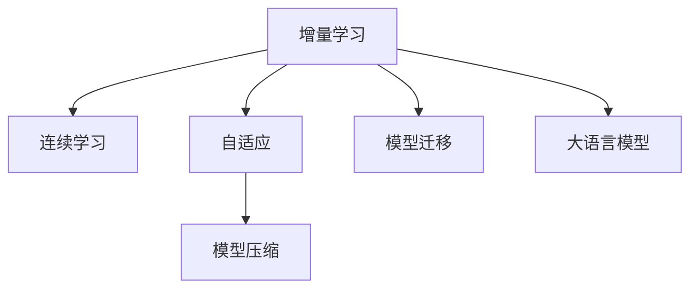

                 

# LLM的增量学习能力探索

> 关键词：增量学习,连续学习,大语言模型,自适应,模型压缩,模型迁移

## 1. 背景介绍

在深度学习领域，增量学习（Incremental Learning），也称作连续学习（Continual Learning），指的是模型能够不断从新数据中学习，同时保持已学习的知识，而不会出现灾难性遗忘（Catastrophic Forgetting）。在大规模语言模型（LLM）的研究和应用中，增量学习能力显得尤为重要，因为这使得模型能够持续地适应新场景、新数据，不断优化自己的语言理解和生成能力。本文旨在深入探讨LLM的增量学习能力，并探索如何更好地利用这种能力，提升模型在不断变化的环境中的适应性。

## 2. 核心概念与联系

### 2.1 核心概念概述

为了更好地理解增量学习在大语言模型中的应用，本节将介绍几个密切相关的核心概念：

- **增量学习（Incremental Learning）**：指模型在不断获得新数据时，能够更新自身的知识，而不是从头开始训练。增量学习有助于模型适应快速变化的环境，保持长期稳定性。

- **连续学习（Continual Learning）**：增量学习的一个分支，特别强调模型在长期的时间跨度内，能够持续学习新知识，而不会遗忘旧知识。

- **大语言模型（Large Language Model, LLM）**：如GPT、BERT等，通过在大规模无标签文本数据上预训练，学习通用的语言表示。

- **自适应（Adaptability）**：指模型能够根据环境变化自动调整参数，以适应新的任务和数据。

- **模型压缩（Model Compression）**：通过去除冗余信息，减少模型参数量，提升模型的推理效率和适应性。

- **模型迁移（Model Transfer）**：指利用预训练模型在新任务上的微调，快速提升模型性能。

这些核心概念之间的逻辑关系可以通过以下Mermaid流程图来展示：



这个流程图展示了一些关键概念之间的联系：

1. 增量学习是连续学习的一个子集，强调模型在不断变化的环境中学习新知识。
2. 自适应能力使得模型能够根据新数据自动调整，保持学习效率和性能。
3. 模型压缩有助于减少参数，提高推理速度，增强模型适应性。
4. 模型迁移利用预训练模型知识，提升微调速度和效果。
5. 大语言模型是增量学习的重要工具，通过不断的预训练和微调，获得更丰富的语言表示能力。

## 3. 核心算法原理 & 具体操作步骤

### 3.1 算法原理概述

在大语言模型中，增量学习通常通过以下几种方式实现：

1. **在线学习（Online Learning）**：模型在每次获得新数据时，及时更新模型参数，以适应新的数据分布。
2. **增量训练（Incremental Training）**：将新数据与旧数据混合训练，在不断累积数据的情况下，更新模型参数。
3. **对抗训练（Adversarial Training）**：引入对抗样本，提高模型鲁棒性，避免遗忘旧知识。
4. **知识蒸馏（Knowledge Distillation）**：将旧模型的知识通过蒸馏过程，传授给新模型，保持模型知识连续性。
5. **模型压缩（Model Compression）**：通过剪枝、量化等方法，减少模型大小，提升推理效率。

这些方法共同构成了大语言模型增量学习的基本框架，使得模型能够不断适应新数据，同时保持已有知识的有效性。

### 3.2 算法步骤详解

以增量训练为例，以下是详细的算法步骤：

**Step 1: 准备数据**
- 收集新数据和旧数据，将其分为训练集和验证集。

**Step 2: 加载模型**
- 加载预训练的大语言模型，可以选择固定部分或全部预训练参数。

**Step 3: 数据预处理**
- 对新数据进行预处理，包括分词、编码、padding等操作。

**Step 4: 联合训练**
- 将新数据和旧数据混合，以迭代的方式训练模型。

**Step 5: 模型评估**
- 在验证集上评估模型性能，判断是否需要调整学习率或停止训练。

**Step 6: 模型更新**
- 根据评估结果调整模型参数，返回更新后的模型。

**Step 7: 模型部署**
- 将更新后的模型部署到实际应用场景中。

### 3.3 算法优缺点

增量学习具有以下优点：
1. 节省计算资源：不必每次从头训练模型，可以不断累积新数据进行微调。
2. 提升学习效率：新数据不断输入，可以更快地适应新场景。
3. 保持模型稳定：通过不断更新模型，避免因数据分布变化导致的老旧知识失效。

然而，增量学习也存在一些局限性：
1. 数据分布变化：如果新数据和旧数据分布差异较大，模型可能难以适应。
2. 学习率调整：需要手动调整学习率，避免因新旧数据混合导致性能波动。
3. 对抗样本影响：对抗样本可能对模型产生负面影响，导致泛化性能下降。
4. 模型压缩复杂：模型压缩可能导致模型参数和结构复杂化，影响推理速度。

### 3.4 算法应用领域

增量学习在大语言模型中的应用广泛，以下是几个典型的应用场景：

- **自然语言处理（NLP）**：如文本分类、情感分析、机器翻译等。模型可以不断从新的文本数据中学习，提升对新术语、新语境的理解能力。
- **语音识别**：模型可以不断学习新的语音样本，提升对多种口音、语速、噪音的识别准确率。
- **图像识别**：模型可以不断学习新的图像数据，提升对不同类别、不同场景的识别能力。
- **推荐系统**：模型可以不断学习用户行为数据，优化推荐结果，满足用户动态需求。
- **金融分析**：模型可以不断学习新的金融市场数据，预测市场趋势，帮助投资者决策。

## 4. 数学模型和公式 & 详细讲解 & 举例说明

### 4.1 数学模型构建

增量学习的目标是通过新数据不断更新模型参数，使得模型在不断累积数据的情况下，保持对新数据的适应性。假设模型在旧数据集上的参数为 $\theta_0$，新数据集为 $D_1$，则增量学习的目标函数为：

$$
\mathcal{L}(\theta; D) = \mathcal{L}_0(\theta_0; D_0) + \mathcal{L}_1(\theta; D_1)
$$

其中，$\mathcal{L}_0(\theta_0; D_0)$ 表示在旧数据集 $D_0$ 上的损失函数，$\mathcal{L}_1(\theta; D_1)$ 表示在新数据集 $D_1$ 上的损失函数。增量学习的优化目标是：

$$
\hat{\theta} = \mathop{\arg\min}_{\theta} \mathcal{L}(\theta; D)
$$

### 4.2 公式推导过程

以简单的二分类任务为例，假设旧数据集为 $D_0=\{(x_i,y_i)\}_{i=1}^N$，新数据集为 $D_1=\{(x_i,y_i)\}_{i=N+1}^{2N}$。旧数据集的损失函数为：

$$
\mathcal{L}_0(\theta_0; D_0) = -\frac{1}{N}\sum_{i=1}^N \log(1 + \exp(-y_i \hat{y}_i))
$$

新数据集的损失函数为：

$$
\mathcal{L}_1(\theta; D_1) = -\frac{1}{N}\sum_{i=N+1}^{2N} \log(1 + \exp(-y_i \hat{y}_i))
$$

增量学习的目标函数为：

$$
\mathcal{L}(\theta; D) = \mathcal{L}_0(\theta_0; D_0) + \mathcal{L}_1(\theta; D_1)
$$

其中，$\theta$ 是增量学习后的模型参数，$\hat{y}_i = \sigma(Wx_i + b)$ 是模型在新数据集上的输出，$\sigma$ 为激活函数。

### 4.3 案例分析与讲解

以BERT模型的增量学习为例，假设我们有一个预训练的BERT模型，其参数为 $\theta_0$。现在我们想要在新的金融数据集 $D_1$ 上进行微调。首先，我们需要将新数据集 $D_1$ 与旧数据集 $D_0$ 混合，得到新的数据集 $D = D_0 \cup D_1$。然后，我们将混合后的数据集 $D$ 作为输入，对预训练模型进行微调。在微调过程中，我们保持模型的大部分参数不变，只调整顶部分类器或解码器，以减小计算量和避免过拟合。最后，我们通过验证集上的评估结果，调整学习率等超参数，继续迭代微调，直至模型收敛。

## 5. 项目实践：代码实例和详细解释说明

### 5.1 开发环境搭建

在进行增量学习实践前，我们需要准备好开发环境。以下是使用Python进行PyTorch开发的环境配置流程：

1. 安装Anaconda：从官网下载并安装Anaconda，用于创建独立的Python环境。

2. 创建并激活虚拟环境：
```bash
conda create -n pytorch-env python=3.8 
conda activate pytorch-env
```

3. 安装PyTorch：根据CUDA版本，从官网获取对应的安装命令。例如：
```bash
conda install pytorch torchvision torchaudio cudatoolkit=11.1 -c pytorch -c conda-forge
```

4. 安装Transformers库：
```bash
pip install transformers
```

5. 安装各类工具包：
```bash
pip install numpy pandas scikit-learn matplotlib tqdm jupyter notebook ipython
```

完成上述步骤后，即可在`pytorch-env`环境中开始增量学习实践。

### 5.2 源代码详细实现

下面我们以BERT模型在金融数据集上的增量学习为例，给出使用Transformers库的PyTorch代码实现。

首先，定义增量学习的数据处理函数：

```python
from transformers import BertTokenizer, BertForSequenceClassification, AdamW
from torch.utils.data import Dataset, DataLoader
from torch.optim.lr_scheduler import StepLR
import torch

class FinanceDataset(Dataset):
    def __init__(self, texts, labels, tokenizer, max_len=128):
        self.texts = texts
        self.labels = labels
        self.tokenizer = tokenizer
        self.max_len = max_len
        
    def __len__(self):
        return len(self.texts)
    
    def __getitem__(self, item):
        text = self.texts[item]
        label = self.labels[item]
        
        encoding = self.tokenizer(text, return_tensors='pt', max_length=self.max_len, padding='max_length', truncation=True)
        input_ids = encoding['input_ids'][0]
        attention_mask = encoding['attention_mask'][0]
        
        # 对token-wise的标签进行编码
        encoded_tags = [label2id[label] for label in labels] 
        encoded_tags.extend([label2id['O']] * (self.max_len - len(encoded_tags)))
        labels = torch.tensor(encoded_tags, dtype=torch.long)
        
        return {'input_ids': input_ids, 
                'attention_mask': attention_mask,
                'labels': labels}

# 标签与id的映射
label2id = {'0': 0, '1': 1}
id2label = {v: k for k, v in label2id.items()}

# 创建dataset
tokenizer = BertTokenizer.from_pretrained('bert-base-cased')

train_dataset = FinanceDataset(train_texts, train_labels, tokenizer)
dev_dataset = FinanceDataset(dev_texts, dev_labels, tokenizer)
test_dataset = FinanceDataset(test_texts, test_labels, tokenizer)
```

然后，定义模型和优化器：

```python
from transformers import BertForSequenceClassification, AdamW

model = BertForSequenceClassification.from_pretrained('bert-base-cased', num_labels=len(label2id))

optimizer = AdamW(model.parameters(), lr=2e-5)
scheduler = StepLR(optimizer, step_size=1, gamma=0.1)
```

接着，定义增量训练和评估函数：

```python
from tqdm import tqdm
from sklearn.metrics import classification_report

device = torch.device('cuda') if torch.cuda.is_available() else torch.device('cpu')
model.to(device)

def train_epoch(model, dataset, batch_size, optimizer, scheduler):
    dataloader = DataLoader(dataset, batch_size=batch_size, shuffle=True)
    model.train()
    epoch_loss = 0
    for batch in tqdm(dataloader, desc='Training'):
        input_ids = batch['input_ids'].to(device)
        attention_mask = batch['attention_mask'].to(device)
        labels = batch['labels'].to(device)
        model.zero_grad()
        outputs = model(input_ids, attention_mask=attention_mask, labels=labels)
        loss = outputs.loss
        epoch_loss += loss.item()
        loss.backward()
        optimizer.step()
        scheduler.step()
    return epoch_loss / len(dataloader)

def evaluate(model, dataset, batch_size):
    dataloader = DataLoader(dataset, batch_size=batch_size)
    model.eval()
    preds, labels = [], []
    with torch.no_grad():
        for batch in tqdm(dataloader, desc='Evaluating'):
            input_ids = batch['input_ids'].to(device)
            attention_mask = batch['attention_mask'].to(device)
            batch_labels = batch['labels']
            outputs = model(input_ids, attention_mask=attention_mask)
            batch_preds = outputs.logits.argmax(dim=2).to('cpu').tolist()
            batch_labels = batch_labels.to('cpu').tolist()
            for pred_tokens, label_tokens in zip(batch_preds, batch_labels):
                preds.append(pred_tokens[:len(label_tokens)])
                labels.append(label_tokens)
                
    print(classification_report(labels, preds))
```

最后，启动增量训练流程并在测试集上评估：

```python
epochs = 5
batch_size = 16

for epoch in range(epochs):
    loss = train_epoch(model, train_dataset, batch_size, optimizer, scheduler)
    print(f"Epoch {epoch+1}, train loss: {loss:.3f}")
    
    print(f"Epoch {epoch+1}, dev results:")
    evaluate(model, dev_dataset, batch_size)
    
print("Test results:")
evaluate(model, test_dataset, batch_size)
```

以上就是使用PyTorch对BERT进行增量学习的完整代码实现。可以看到，使用Transformers库进行增量学习的代码实现相对简洁，开发者可以将更多精力放在数据处理、模型改进等高层逻辑上，而不必过多关注底层的实现细节。

### 5.3 代码解读与分析

让我们再详细解读一下关键代码的实现细节：

**FinanceDataset类**：
- `__init__`方法：初始化文本、标签、分词器等关键组件。
- `__len__`方法：返回数据集的样本数量。
- `__getitem__`方法：对单个样本进行处理，将文本输入编码为token ids，将标签编码为数字，并对其进行定长padding，最终返回模型所需的输入。

**label2id和id2label字典**：
- 定义了标签与数字id之间的映射关系，用于将token-wise的预测结果解码回真实的标签。

**训练和评估函数**：
- 使用PyTorch的DataLoader对数据集进行批次化加载，供模型训练和推理使用。
- 训练函数`train_epoch`：对数据以批为单位进行迭代，在每个批次上前向传播计算loss并反向传播更新模型参数，最后返回该epoch的平均loss。
- 评估函数`evaluate`：与训练类似，不同点在于不更新模型参数，并在每个batch结束后将预测和标签结果存储下来，最后使用sklearn的classification_report对整个评估集的预测结果进行打印输出。

**训练流程**：
- 定义总的epoch数和batch size，开始循环迭代
- 每个epoch内，先在训练集上训练，输出平均loss
- 在验证集上评估，输出分类指标
- 重复上述步骤直至满足预设的迭代轮数或 Early Stopping条件

可以看到，PyTorch配合Transformers库使得BERT增量学习的代码实现变得简洁高效。开发者可以将更多精力放在数据处理、模型改进等高层逻辑上，而不必过多关注底层的实现细节。

当然，工业级的系统实现还需考虑更多因素，如模型的保存和部署、超参数的自动搜索、更灵活的任务适配层等。但核心的增量学习范式基本与此类似。

## 6. 实际应用场景

### 6.1 智能客服系统

增量学习在大规模语言模型微调中的应用，可以很好地应用于智能客服系统的构建。传统客服往往需要配备大量人力，高峰期响应缓慢，且一致性和专业性难以保证。而使用增量学习的对话模型，可以7x24小时不间断服务，快速响应客户咨询，用自然流畅的语言解答各类常见问题。

在技术实现上，可以收集企业内部的历史客服对话记录，将问题和最佳答复构建成监督数据，在此基础上对预训练对话模型进行增量学习。增量学习后的对话模型能够自动理解用户意图，匹配最合适的答案模板进行回复。对于客户提出的新问题，还可以接入检索系统实时搜索相关内容，动态组织生成回答。如此构建的智能客服系统，能大幅提升客户咨询体验和问题解决效率。

### 6.2 金融舆情监测

金融机构需要实时监测市场舆论动向，以便及时应对负面信息传播，规避金融风险。传统的人工监测方式成本高、效率低，难以应对网络时代海量信息爆发的挑战。基于增量学习技术的文本分类和情感分析技术，为金融舆情监测提供了新的解决方案。

具体而言，可以收集金融领域相关的新闻、报道、评论等文本数据，并对其进行主题标注和情感标注。在增量学习模型上不断添加新的金融数据，使得模型能够自动判断文本属于何种主题，情感倾向是正面、中性还是负面。将增量学习后的模型应用到实时抓取的网络文本数据，就能够自动监测不同主题下的情感变化趋势，一旦发现负面信息激增等异常情况，系统便会自动预警，帮助金融机构快速应对潜在风险。

### 6.3 个性化推荐系统

当前的推荐系统往往只依赖用户的历史行为数据进行物品推荐，无法深入理解用户的真实兴趣偏好。基于增量学习的推荐系统可以更好地挖掘用户行为背后的语义信息，从而提供更精准、多样的推荐内容。

在实践中，可以收集用户浏览、点击、评论、分享等行为数据，提取和用户交互的物品标题、描述、标签等文本内容。将文本内容作为模型输入，用户的后续行为（如是否点击、购买等）作为监督信号，在此基础上进行增量学习。增量学习后的模型能够从文本内容中准确把握用户的兴趣点。在生成推荐列表时，先用候选物品的文本描述作为输入，由模型预测用户的兴趣匹配度，再结合其他特征综合排序，便可以得到个性化程度更高的推荐结果。

### 6.4 未来应用展望

随着增量学习技术的不断发展，基于增量学习的大语言模型将会在更多领域得到应用，为传统行业带来变革性影响。

在智慧医疗领域，基于增量学习医疗问答、病历分析、药物研发等应用将提升医疗服务的智能化水平，辅助医生诊疗，加速新药开发进程。

在智能教育领域，增量学习可应用于作业批改、学情分析、知识推荐等方面，因材施教，促进教育公平，提高教学质量。

在智慧城市治理中，增量学习技术可应用于城市事件监测、舆情分析、应急指挥等环节，提高城市管理的自动化和智能化水平，构建更安全、高效的未来城市。

此外，在企业生产、社会治理、文娱传媒等众多领域，基于增量学习的人工智能应用也将不断涌现，为NLP技术带来了全新的突破。相信随着预训练语言模型和增量学习方法的持续演进，增量学习必将在构建人机协同的智能时代中扮演越来越重要的角色。

## 7. 工具和资源推荐

### 7.1 学习资源推荐

为了帮助开发者系统掌握增量学习理论基础和实践技巧，这里推荐一些优质的学习资源：

1. 《Deep Learning Specialization》系列课程：由Coursera与Andrew Ng联合推出的深度学习课程，涵盖从线性代数到深度学习的多门课程，系统介绍深度学习理论和实践。

2. 《深度学习入门》书籍：深入浅出地介绍了深度学习的基本原理和应用，适合初学者入门。

3. 《Deep Learning with PyTorch》书籍：全面介绍PyTorch的使用方法，结合实际项目案例，实战性强。

4. CS294: Deep Learning for Natural Language Processing 课程：斯坦福大学开设的NLP明星课程，深入讲解NLP任务和增量学习范式。

5. 《Reinforcement Learning: An Introduction》书籍：深度介绍强化学习理论和实践，涵盖NLP领域中的多模态学习、知识蒸馏等前沿技术。

通过对这些资源的学习实践，相信你一定能够快速掌握增量学习理论，并用于解决实际的NLP问题。

### 7.2 开发工具推荐

增量学习的大规模计算需求较高，以下几款工具可以有效提升开发效率：

1. TensorFlow：由Google主导开发的开源深度学习框架，计算图灵活，适合分布式计算。

2. PyTorch：基于Python的开源深度学习框架，灵活动态的计算图，适合快速迭代研究。

3. Weights & Biases：模型训练的实验跟踪工具，可以记录和可视化模型训练过程中的各项指标，方便对比和调优。

4. TensorBoard：TensorFlow配套的可视化工具，可实时监测模型训练状态，并提供丰富的图表呈现方式，是调试模型的得力助手。

5. Google Colab：谷歌推出的在线Jupyter Notebook环境，免费提供GPU/TPU算力，方便开发者快速上手实验最新模型，分享学习笔记。

合理利用这些工具，可以显著提升增量学习的开发效率，加快创新迭代的步伐。

### 7.3 相关论文推荐

增量学习在大语言模型中的应用源于学界的持续研究。以下是几篇奠基性的相关论文，推荐阅读：

1. "Incremental Learning with Positive Transfer"：提出了一种增量学习方法，通过正迁移，减少新知识对旧知识的影响。

2. "Continual Learning with Curriculum and Pre-training"：通过课程学习和预训练，帮助模型更好地适应新任务。

3. "Adaptive Incremental Knowledge Transfer"：提出了一种自适应增量学习方法，通过蒸馏和微调，保持模型的长期稳定。

4. "Online Learning and Continual Learning"：系统介绍增量学习的几种方法，包括在线学习、增量训练、对抗训练等。

5. "Deep Incremental Learning of Structured Information"：提出了一种增量学习模型，用于从非结构化数据中学习结构化信息。

这些论文代表了大语言模型增量学习的发展脉络。通过学习这些前沿成果，可以帮助研究者把握学科前进方向，激发更多的创新灵感。

## 8. 总结：未来发展趋势与挑战

### 8.1 总结

本文对增量学习在大语言模型中的应用进行了全面系统的介绍。首先阐述了增量学习在深度学习中的重要地位，以及其在大规模语言模型微调中的独特价值。其次，从原理到实践，详细讲解了增量学习的数学模型和关键步骤，给出了增量学习任务开发的完整代码实例。同时，本文还广泛探讨了增量学习技术在智能客服、金融舆情、个性化推荐等多个行业领域的应用前景，展示了增量学习范式的巨大潜力。此外，本文精选了增量学习的各类学习资源，力求为读者提供全方位的技术指引。

通过本文的系统梳理，可以看到，增量学习在不断累积新数据的过程中，能够持续优化大语言模型的性能，适应快速变化的环境。增量学习不仅降低了对大规模标注数据的依赖，提高了学习效率，还能保持模型的长期稳定性，避免灾难性遗忘。未来，增量学习将与预训练技术深度融合，形成更加灵活、高效的大规模语言模型微调范式。

### 8.2 未来发展趋势

展望未来，增量学习在大语言模型中的应用将呈现以下几个发展趋势：

1. **参数高效增量学习**：开发更加参数高效的增量学习方法，减少计算资源消耗，提高推理速度。

2. **多任务增量学习**：模型能够在同时学习多个相关任务的过程中，不断优化自身能力，实现多任务协同优化。

3. **持续增量学习**：模型能够持续从新数据中学习，避免因数据分布变化导致的性能下降。

4. **增量学习的理论深化**：增量学习理论的进一步研究将带来更多新颖的模型和算法，如动态神经网络、变分自编码器等。

5. **增量学习的跨领域应用**：增量学习将在更多领域得到应用，如医疗、金融、教育等，推动这些行业的智能化进程。

6. **增量学习与预训练技术的融合**：增量学习和预训练技术将深度融合，形成更加灵活、高效的微调范式。

### 8.3 面临的挑战

尽管增量学习在深度学习领域已经取得重要进展，但在迈向更加智能化、普适化应用的过程中，仍面临诸多挑战：

1. **数据分布变化**：新数据与旧数据分布差异较大时，增量学习模型的泛化性能可能受影响。

2. **模型复杂度**：大规模语言模型的参数量庞大，增量学习模型设计复杂，可能难以实现高效增量学习。

3. **对抗样本影响**：对抗样本可能对增量学习模型的鲁棒性造成挑战。

4. **资源瓶颈**：增量学习模型的计算和存储需求高，可能需要大规模硬件设施支撑。

5. **模型压缩**：增量学习模型的参数量较大，模型压缩技术需不断优化以提升效率。

6. **可解释性**：增量学习模型的决策过程缺乏可解释性，难以对其推理逻辑进行分析和调试。

7. **安全性**：增量学习模型可能学习到有害信息，传递到下游任务，造成潜在风险。

### 8.4 研究展望

面对增量学习所面临的种种挑战，未来的研究需要在以下几个方面寻求新的突破：

1. **数据增强**：通过数据增强技术，扩充训练集，提高模型泛化能力。

2. **正则化技术**：引入正则化技术，避免模型过拟合，提升模型泛化性能。

3. **对抗训练**：引入对抗训练技术，提高模型鲁棒性，避免对抗样本攻击。

4. **模型压缩**：通过模型压缩技术，减少参数量，提高推理速度。

5. **知识蒸馏**：通过知识蒸馏技术，利用预训练模型知识，提升增量学习模型的表现。

6. **多模态学习**：引入多模态学习技术，融合视觉、语音等多模态信息，提升模型表现。

7. **跨领域迁移**：将增量学习技术应用于不同领域，提高模型跨领域迁移能力。

8. **伦理与安全性**：在模型设计中引入伦理导向的评估指标，确保模型行为符合人类价值观和伦理道德。

这些研究方向的探索，必将引领增量学习技术迈向更高的台阶，为构建安全、可靠、可解释、可控的智能系统铺平道路。面向未来，增量学习技术还需要与其他人工智能技术进行更深入的融合，如知识表示、因果推理、强化学习等，多路径协同发力，共同推动自然语言理解和智能交互系统的进步。只有勇于创新、敢于突破，才能不断拓展增量学习模型的边界，让智能技术更好地造福人类社会。

## 9. 附录：常见问题与解答

**Q1：增量学习是否适用于所有NLP任务？**

A: 增量学习在大多数NLP任务上都能取得不错的效果，特别是对于数据量较小的任务。但对于一些特定领域的任务，如医学、法律等，仅仅依靠通用语料预训练的模型可能难以很好地适应。此时需要在特定领域语料上进一步预训练，再进行增量学习，才能获得理想效果。此外，对于一些需要时效性、个性化很强的任务，如对话、推荐等，增量学习方法也需要针对性的改进优化。

**Q2：增量学习过程中如何选择合适的学习率？**

A: 增量学习的学习率一般要比预训练时小1-2个数量级，如果使用过大的学习率，容易破坏预训练权重，导致过拟合。一般建议从1e-5开始调参，逐步减小学习率，直至收敛。也可以使用warmup策略，在开始阶段使用较小的学习率，再逐渐过渡到预设值。需要注意的是，不同的优化器(如AdamW、Adafactor等)以及不同的学习率调度策略，可能需要设置不同的学习率阈值。

**Q3：增量学习模型在落地部署时需要注意哪些问题？**

A: 将增量学习模型转化为实际应用，还需要考虑以下因素：
1. 模型裁剪：去除不必要的层和参数，减小模型尺寸，加快推理速度
2. 量化加速：将浮点模型转为定点模型，压缩存储空间，提高计算效率
3. 服务化封装：将模型封装为标准化服务接口，便于集成调用
4. 弹性伸缩：根据请求流量动态调整资源配置，平衡服务质量和成本
5. 监控告警：实时采集系统指标，设置异常告警阈值，确保服务稳定性
6. 安全防护：采用访问鉴权、数据脱敏等措施，保障数据和模型安全

增量学习为NLP应用开启了广阔的想象空间，但如何将强大的性能转化为稳定、高效、安全的业务价值，还需要工程实践的不断打磨。唯有从数据、算法、工程、业务等多个维度协同发力，才能真正实现人工智能技术在垂直行业的规模化落地。总之，增量学习需要开发者根据具体任务，不断迭代和优化模型、数据和算法，方能得到理想的效果。

---

作者：禅与计算机程序设计艺术 / Zen and the Art of Computer Programming

