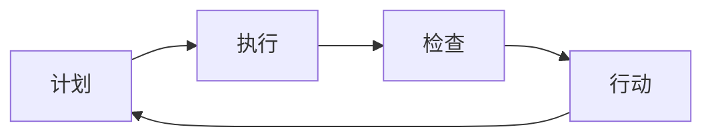

                 

# PDCA循环与管理持续改进的关系

在工业界，PDCA循环（Plan-Do-Check-Act）是一种经典的持续改进方法，广泛应用于质量管理和项目管理等领域。PDCA循环本质上是一种动态的、迭代的管理工具，旨在通过不断的反馈和优化，实现组织和个人目标的逐步提升。本文将深入探讨PDCA循环的原理、步骤及其在IT领域，尤其是在软件开发和系统管理中的应用，以及如何借助PDCA循环实现技术和管理上的持续改进。

## 1. 背景介绍

### 1.1 问题由来

在快速发展的IT行业，技术迭代速度和需求变化日新月异，对企业的适应能力和持续改进能力提出了更高的要求。企业需要在不断变化的环境中保持敏捷性，及时应对新问题和挑战。PDCA循环作为一种有效的持续改进工具，能够帮助组织通过系统的、迭代的方法，不断提高产品质量和系统性能，降低开发成本和故障率，从而提升整体竞争力。

### 1.2 问题核心关键点

PDCA循环包含四个核心阶段：
- **计划(Plan)**：明确目标，制定改进方案。
- **执行(Do)**：实施改进方案，执行具体任务。
- **检查(Check)**：监控执行过程，收集反馈数据。
- **行动(Action)**：根据检查结果，进行必要的调整和改进。

PDCA循环的四个阶段相互依赖、相互促进，形成一个持续的改进循环。通过不断的PDCA迭代，组织可以逐步提升其管理水平和技术能力，实现长期持续改进的目标。

## 2. 核心概念与联系

### 2.1 核心概念概述

为更好地理解PDCA循环在IT领域的应用，本节将介绍几个密切相关的核心概念：

- **持续改进(Continuous Improvement)**：在动态环境中，通过PDCA循环不断优化组织流程和系统性能，逐步实现最佳效果。
- **质量管理(Quality Management)**：使用PDCA循环作为核心工具，实现对产品和服务的质量控制，确保满足客户需求和法规要求。
- **敏捷开发(Agile Development)**：一种以客户为中心、迭代开发的软件开发生命周期方法，与PDCA循环的理念高度契合。
- **系统监控(System Monitoring)**：在执行阶段，使用PDCA循环中的检查环节，收集系统运行数据，进行实时监控和问题诊断。
- **反馈机制(Feedback Mechanism)**：PDCA循环的检查环节是建立反馈机制的基础，通过及时收集反馈数据，为行动阶段提供决策依据。

这些概念之间存在紧密联系，共同构成了PDCA循环在IT领域应用的基础。

### 2.2 核心概念原理和架构的 Mermaid 流程图



这个流程图展示了PDCA循环的基本结构：
- 从A到B：制定和执行计划，明确改进目标和具体措施。
- 从B到C：执行过程中收集数据，进行质量监控和问题诊断。
- 从C到D：根据检查结果，进行必要的调整和改进，确保达到预期效果。
- 从D到A：进入下一轮PDCA循环，形成持续改进的闭环。

## 3. 核心算法原理 & 具体操作步骤

### 3.1 算法原理概述

PDCA循环是一种系统的、迭代的管理方法，通过不断循环的四个阶段，逐步优化组织流程和系统性能。PDCA循环的原理可以用以下公式概括：

$$
\text{Result} = \text{Plan} + \text{Do} + \text{Check} + \text{Act}
$$

其中，`Plan`代表制定计划，`Do`代表执行计划，`Check`代表检查效果，`Act`代表采取行动。PDCA循环的四个阶段相互依赖，形成一个动态的改进过程。

### 3.2 算法步骤详解

PDCA循环的四个步骤详细介绍如下：

#### 3.2.1 计划阶段(Plan)

在计划阶段，首先需要明确改进目标和具体措施，制定详细的行动计划：

1. **定义目标**：确定改进的具体目标和预期结果。例如，提升系统性能、降低故障率、提高用户满意度等。
2. **识别问题**：通过数据分析、员工反馈等手段，识别出当前需要改进的问题和瓶颈。
3. **制定方案**：根据问题分析和目标定义，制定详细的改进方案和具体措施。例如，引入新工具、调整流程、优化资源配置等。
4. **分配资源**：明确所需的人力、物力和时间资源，确保改进方案能够顺利实施。

#### 3.2.2 执行阶段(Do)

在执行阶段，根据计划阶段制定的改进方案，具体执行改进措施，落实各项任务：

1. **任务分解**：将改进方案分解为具体的执行任务，明确任务的责任人和完成时间。
2. **实施措施**：按照计划执行具体的改进措施，确保任务按时完成。
3. **过程记录**：详细记录执行过程，包括任务进展、遇到的问题和解决方案。

#### 3.2.3 检查阶段(Check)

在检查阶段，监控执行过程，收集反馈数据，评估改进效果：

1. **数据收集**：使用系统监控工具或手动收集执行过程中的数据，如性能指标、故障记录、用户反馈等。
2. **效果评估**：根据收集的数据，评估改进措施的实际效果，是否达到了预期的目标。
3. **问题诊断**：识别出在执行过程中出现的问题和偏差，进行深入分析。

#### 3.2.4 行动阶段(Action)

在行动阶段，根据检查阶段的结果，进行必要的调整和改进：

1. **结果分析**：对检查阶段收集的数据和评估结果进行全面分析，找出改进措施的不足之处。
2. **调整方案**：根据分析结果，制定新的改进方案，解决发现的问题。
3. **落实措施**：将新的改进方案落实到实际执行中，确保目标的实现。
4. **记录经验**：记录改进过程中的经验和教训，为未来的改进提供参考。

### 3.3 算法优缺点

PDCA循环的优点包括：
- **系统性**：通过四个阶段的循环，形成一个系统的、全面的改进过程。
- **可操作性**：每个阶段都有明确的任务和目标，易于操作和实施。
- **反馈机制**：通过检查和行动环节，实现持续的反馈和调整，确保改进效果。

PDCA循环的缺点包括：
- **复杂度高**：涉及的环节较多，需要较高的管理和组织能力。
- **周期长**：每个PDCA循环可能需要较长时间，难以适应快速变化的环境。
- **依赖资源**：实施过程中需要大量的人力和资源投入，可能对小型组织不适用。

### 3.4 算法应用领域

PDCA循环在IT领域有着广泛的应用，主要包括以下几个方面：

#### 3.4.1 软件开发

在软件开发中，PDCA循环可以用于需求分析、设计、开发、测试和维护等各个阶段，帮助团队不断优化软件质量和性能：

1. **需求分析**：通过PDCA循环，收集用户反馈，识别和明确需求，制定详细的改进方案。
2. **设计优化**：在设计和编码阶段，使用PDCA循环进行模块化设计和代码优化，提升软件可维护性和可扩展性。
3. **测试改进**：在测试阶段，使用PDCA循环进行测试用例设计和问题追踪，提升测试覆盖率和测试效率。
4. **维护优化**：在维护阶段，使用PDCA循环进行性能监控和问题诊断，及时修复和改进系统问题。

#### 3.4.2 系统管理

在系统管理中，PDCA循环可以用于系统监控、故障处理和性能优化等各个环节，确保系统稳定运行：

1. **系统监控**：在执行阶段，使用PDCA循环进行系统监控，收集性能指标和故障记录，进行实时预警和问题诊断。
2. **故障处理**：在检查阶段，根据收集的数据，分析故障原因，制定故障处理方案，并进行故障修复。
3. **性能优化**：在行动阶段，根据检查结果，进行必要的系统优化和资源调整，提升系统性能。

## 4. 数学模型和公式 & 详细讲解 & 举例说明

### 4.1 数学模型构建

PDCA循环的四个阶段可以抽象为数学模型，用变量和公式来描述：

设改进目标为 $T$，改进方案为 $P$，执行过程为 $D$，效果评估为 $C$，调整措施为 $A$，PDCA循环可以表示为以下数学模型：

$$
T = P + D + C + A
$$

其中：
- $T$：改进目标
- $P$：改进方案
- $D$：执行过程
- $C$：效果评估
- $A$：调整措施

### 4.2 公式推导过程

以提升系统性能为例，进行PDCA循环的数学推导：

1. **计划阶段**：
   - 定义目标：$T = P_0$，其中 $P_0$ 为初始性能指标。
   - 识别问题：通过系统监控，收集当前系统性能数据 $D_0$。
   - 制定方案：根据问题分析，制定改进措施 $P_1$，例如优化代码、增加资源等。
   - 分配资源：确定执行时间 $T_1$ 和所需人力物力 $R_1$。

2. **执行阶段**：
   - 任务分解：将 $P_1$ 分解为具体任务，如任务1、任务2等。
   - 实施措施：执行具体任务，记录执行过程中的数据 $D_1$。
   - 过程记录：记录任务进展和遇到的问题，生成详细记录 $R_1$。

3. **检查阶段**：
   - 数据收集：收集执行过程中的性能数据 $D_1$，进行系统监控。
   - 效果评估：评估改进措施的效果，得到新的性能指标 $T_1$。
   - 问题诊断：识别出执行过程中出现的问题，如任务延迟、资源不足等。

4. **行动阶段**：
   - 结果分析：分析问题原因，确定需要改进的措施。
   - 调整方案：制定新的改进方案 $P_2$，例如调整任务优先级、增加资源等。
   - 落实措施：执行新的改进措施，记录执行数据 $D_2$。
   - 记录经验：总结经验教训，生成改进记录 $R_2$。

### 4.3 案例分析与讲解

以提升Web应用性能为例，进行PDCA循环的案例分析：

1. **计划阶段**：
   - 目标：提升Web应用响应时间，从10秒降低到5秒。
   - 问题：通过监控发现，Web应用在高峰期响应时间超过15秒。
   - 方案：增加服务器资源，优化代码逻辑。
   - 资源：分配1个服务器，新增3名开发人员。

2. **执行阶段**：
   - 任务分解：优化前端代码、增加服务器资源、调整负载均衡策略。
   - 实施措施：执行具体任务，记录任务进展和遇到的问题。

3. **检查阶段**：
   - 数据收集：收集执行过程中的性能数据，进行系统监控。
   - 效果评估：评估改进措施的效果，发现响应时间降低至8秒。
   - 问题诊断：识别出执行过程中出现的问题，如代码优化不完全。

4. **行动阶段**：
   - 结果分析：分析问题原因，确定需要改进的措施。
   - 调整方案：制定新的改进方案，例如进一步优化代码逻辑。
   - 落实措施：执行新的改进措施，记录执行数据。
   - 记录经验：总结经验教训，生成改进记录。

## 5. 项目实践：代码实例和详细解释说明

### 5.1 开发环境搭建

在进行PDCA循环的实践前，我们需要准备好开发环境。以下是使用Python进行PDCA流程开发的环境配置流程：

1. 安装Anaconda：从官网下载并安装Anaconda，用于创建独立的Python环境。

2. 创建并激活虚拟环境：
```bash
conda create -n pdca-env python=3.8 
conda activate pdca-env
```

3. 安装PyTorch：根据CUDA版本，从官网获取对应的安装命令。例如：
```bash
conda install pytorch torchvision torchaudio cudatoolkit=11.1 -c pytorch -c conda-forge
```

4. 安装Python包：
```bash
pip install pandas numpy matplotlib jupyter notebook ipython
```

完成上述步骤后，即可在`pdca-env`环境中开始PDCA实践。

### 5.2 源代码详细实现

下面我们以软件开发项目为例，给出使用Python进行PDCA流程开发的代码实现。

首先，定义PDCA循环的四个阶段：

```python
class PDCA:
    def __init__(self, plan, do, check, act):
        self.plan = plan
        self.do = do
        self.check = check
        self.act = act

    def execute(self):
        self.plan.execute()
        self.do.execute()
        self.check.check()
        self.act.act()

class Plan:
    def __init__(self, target, measures, resources):
        self.target = target
        self.measures = measures
        self.resources = resources

    def execute(self):
        # 执行计划
        pass

class Do:
    def __init__(self, tasks, records):
        self.tasks = tasks
        self.records = records

    def execute(self):
        # 执行任务
        pass

class Check:
    def __init__(self, data):
        self.data = data

    def check(self):
        # 收集数据
        pass

class Act:
    def __init__(self, new_plan):
        self.new_plan = new_plan

    def act(self):
        # 采取行动
        pass

# 定义目标和措施
target = "提升Web应用响应时间"
measures = "优化代码逻辑，增加服务器资源"
resources = "1个服务器，新增3名开发人员"

# 创建PDCA实例
pdca = PDCA(Plan(target, measures, resources), Do(tasks, records), Check(data), Act(new_plan))
```

然后，定义各个阶段的具体操作：

```python
class Plan:
    def __init__(self, target, measures, resources):
        self.target = target
        self.measures = measures
        self.resources = resources

    def execute(self):
        # 执行计划
        print(f"计划阶段：目标为 {self.target}，措施为 {self.measures}，资源为 {self.resources}")
        pass

class Do:
    def __init__(self, tasks, records):
        self.tasks = tasks
        self.records = records

    def execute(self):
        # 执行任务
        print(f"执行阶段：执行任务 {self.tasks}，记录 {self.records}")
        pass

class Check:
    def __init__(self, data):
        self.data = data

    def check(self):
        # 收集数据
        print(f"检查阶段：收集数据 {self.data}")
        pass

class Act:
    def __init__(self, new_plan):
        self.new_plan = new_plan

    def act(self):
        # 采取行动
        print(f"行动阶段：新的计划为 {self.new_plan}")
        pass

# 定义具体任务和数据
tasks = ["优化前端代码", "增加服务器资源", "调整负载均衡策略"]
records = ["任务进展记录1", "任务进展记录2"]
data = "Web应用响应时间数据"

# 创建PDCA实例
pdca = PDCA(Plan(target, measures, resources), Do(tasks, records), Check(data), Act(new_plan))
```

最后，启动PDCA流程并进行日志记录：

```python
# 启动PDCA流程
pdca.execute()

# 打印日志
print("PDCA流程日志：")
pdca.get_logs()
```

以上就是使用Python进行PDCA流程开发的完整代码实现。可以看到，通过定义各个阶段和具体操作，我们可以用相对简洁的代码实现PDCA流程的自动化。

### 5.3 代码解读与分析

让我们再详细解读一下关键代码的实现细节：

**PDCA类**：
- `execute`方法：调用各个阶段的具体操作，形成一个闭环的PDCA流程。

**Plan类**：
- `execute`方法：执行计划阶段的具体操作，打印目标、措施和资源信息。

**Do类**：
- `execute`方法：执行执行阶段的具体操作，打印执行任务和记录信息。

**Check类**：
- `check`方法：执行检查阶段的具体操作，打印收集的数据信息。

**Act类**：
- `act`方法：执行行动阶段的具体操作，打印新的计划信息。

**具体任务和数据**：
- `tasks`列表：定义具体的任务，如优化前端代码、增加服务器资源等。
- `records`列表：记录执行过程中的任务进展。
- `data`字符串：收集的数据信息，如Web应用响应时间数据。

**PDCA实例创建**：
- `Plan(target, measures, resources)`：创建一个计划实例，定义目标、措施和资源。
- `Do(tasks, records)`：创建一个执行实例，定义具体任务和记录。
- `Check(data)`：创建一个检查实例，定义收集的数据信息。
- `Act(new_plan)`：创建一个行动实例，定义新的计划。

可以看到，PDCA流程的代码实现并不复杂，但通过合理设计和封装，可以方便地扩展和优化。开发者可以根据具体需求，灵活调整PDCA流程的各个环节，确保其适应性和有效性。

## 6. 实际应用场景

### 6.1 软件开发

在软件开发中，PDCA循环可以用于多个阶段，如需求分析、设计、开发、测试和维护等。以下是一个示例：

1. **需求分析**：
   - 目标：开发一个新功能模块，提升用户体验。
   - 问题：用户反馈功能不够直观。
   - 方案：引入用户界面设计优化。
   - 资源：分配1名UI设计师，新增2天工作量。

2. **执行阶段**：
   - 任务分解：设计原型图、编写界面代码、进行用户测试。
   - 实施措施：执行具体任务，记录任务进展和遇到的问题。

3. **检查阶段**：
   - 数据收集：收集用户反馈和界面使用数据，进行功能测试。
   - 效果评估：评估优化效果，发现用户体验明显提升。
   - 问题诊断：识别出功能优化过程中的问题，如界面布局不合理。

4. **行动阶段**：
   - 结果分析：分析问题原因，确定需要改进的措施。
   - 调整方案：制定新的优化方案，例如调整界面布局。
   - 落实措施：执行新的优化措施，记录执行数据。
   - 记录经验：总结经验教训，生成优化记录。

### 6.2 系统管理

在系统管理中，PDCA循环可以用于系统监控、故障处理和性能优化等各个环节。以下是一个示例：

1. **系统监控**：
   - 目标：提升系统稳定性，减少故障率。
   - 问题：监控系统发现服务器负载过高。
   - 方案：增加服务器资源，优化负载均衡。
   - 资源：分配2个服务器，新增4个负载均衡器。

2. **执行阶段**：
   - 任务分解：增加服务器资源，调整负载均衡策略。
   - 实施措施：执行具体任务，记录任务进展和遇到的问题。

3. **检查阶段**：
   - 数据收集：收集系统性能数据，进行系统监控。
   - 效果评估：评估优化效果，发现服务器负载降低至正常范围。
   - 问题诊断：识别出执行过程中出现的问题，如新服务器配置问题。

4. **行动阶段**：
   - 结果分析：分析问题原因，确定需要改进的措施。
   - 调整方案：制定新的优化方案，例如优化服务器配置。
   - 落实措施：执行新的优化措施，记录执行数据。
   - 记录经验：总结经验教训，生成优化记录。

## 7. 工具和资源推荐

### 7.1 学习资源推荐

为了帮助开发者系统掌握PDCA循环的理论基础和实践技巧，这里推荐一些优质的学习资源：

1. **《PDCA循环原理与实践》书籍**：系统介绍了PDCA循环的基本原理、操作步骤和实际应用，适合初学者阅读。
2. **PDCA循环在线课程**：各大在线教育平台提供的多门PDCA循环相关课程，如Coursera、Udemy等，系统讲解PDCA循环的各个环节。
3. **PDCA循环论文**：研究PDCA循环理论和方法的学术论文，有助于深入理解其原理和实践。

### 7.2 开发工具推荐

高效的开发离不开优秀的工具支持。以下是几款用于PDCA流程开发的常用工具：

1. **JIRA**：项目管理工具，支持PDCA循环的计划、执行、检查和行动环节，适合团队协作。
2. **Trello**：项目管理工具，以看板的形式展示PDCA流程，直观易用。
3. **Asana**：项目管理工具，支持PDCA循环的各个环节，适合中小型团队使用。
4. **Miro**：在线协作工具，支持PDCA循环的可视化设计和任务分配，适合远程协作。
5. **Notion**：笔记和项目管理工具，支持自定义PDCA流程模板，适合个人和团队使用。

合理利用这些工具，可以显著提升PDCA流程的开发效率，加快创新迭代的步伐。

### 7.3 相关论文推荐

PDCA循环的研究源于学界的持续探索。以下是几篇奠基性的相关论文，推荐阅读：

1. **PDCA循环的起源与发展**：详细介绍了PDCA循环的历史背景、核心思想和应用场景。
2. **PDCA循环在IT项目中的应用**：研究了PDCA循环在软件开发、系统管理等IT项目中的应用方法和效果。
3. **PDCA循环与敏捷开发**：探讨了PDCA循环与敏捷开发的关系和差异，提出了敏捷开发中的PDCA实践。
4. **PDCA循环与持续集成**：研究了PDCA循环与持续集成的结合方法，提出了基于PDCA循环的持续集成流程。
5. **PDCA循环的优化与改进**：提出了新的PDCA流程优化方法，提高了PDCA循环的效率和效果。

这些论文代表了大语言模型微调技术的发展脉络。通过学习这些前沿成果，可以帮助研究者把握学科前进方向，激发更多的创新灵感。

## 8. 总结：未来发展趋势与挑战

### 8.1 研究成果总结

本文对PDCA循环的原理、步骤及其在IT领域，尤其是在软件开发和系统管理中的应用，以及如何借助PDCA循环实现技术和管理上的持续改进进行了全面系统的介绍。通过系统的梳理，可以看到PDCA循环在IT领域的重要地位和广泛应用，同时也指出了其在实际应用中面临的挑战和改进方向。

### 8.2 未来发展趋势

展望未来，PDCA循环在IT领域将继续发挥重要作用，其发展趋势主要包括以下几个方面：

1. **智能PDCA循环**：结合人工智能和大数据技术，实现自动化的PDCA流程优化。例如，使用机器学习算法预测问题，自动生成改进方案，提升PDCA循环的效率和效果。
2. **跨部门协同**：将PDCA循环扩展到跨部门协同管理，实现组织内部的信息共享和协作。例如，在软件开发中，结合项目管理工具和敏捷开发方法，实现开发、测试、运维等部门的协同改进。
3. **云平台支持**：将PDCA循环与云平台结合，实现PDCA流程的自动化部署和管理。例如，使用云平台提供的监控、告警和自动化工具，提升PDCA流程的灵活性和可操作性。
4. **个性化定制**：根据具体项目和行业特点，定制化的PDCA流程模板和工具，满足不同场景的需求。例如，在金融、医疗等行业，结合行业标准和规范，定制化PDCA流程。
5. **可视化展示**：使用可视化工具，展示PDCA流程的执行过程和效果，增强团队协作和管理透明度。例如，使用仪表板和看板，实时展示PDCA循环的关键指标和改进效果。

### 8.3 面临的挑战

尽管PDCA循环在IT领域有着广泛的应用，但在实际应用中也面临一些挑战：

1. **复杂性增加**：随着项目规模和复杂度的增加，PDCA循环的实施难度和复杂性也随之增加，需要更高的管理和组织能力。
2. **数据质量问题**：数据收集和处理是PDCA循环的核心环节，但数据质量和准确性往往存在问题，影响改进效果。
3. **沟通和协作**：跨部门、跨团队的协作是PDCA循环的难点，沟通不畅和协作不到位容易导致PDCA循环的失败。
4. **资源限制**：PDCA循环的实施需要大量的人力和资源投入，资源限制可能导致PDCA循环的执行效率低下。
5. **反馈机制不完善**：PDCA循环的检查环节依赖于反馈机制，但反馈机制不完善可能导致改进效果不佳。

### 8.4 研究展望

面对PDCA循环所面临的挑战，未来的研究需要在以下几个方面寻求新的突破：

1. **自动化优化**：结合人工智能和大数据技术，实现PDCA流程的自动化优化，减少人工干预，提升PDCA循环的效率和效果。
2. **跨部门协作**：建立跨部门协同的PDCA流程，实现信息共享和协作，提高PDCA循环的实施效果。
3. **可视化管理**：引入可视化工具，展示PDCA流程的执行过程和效果，增强团队协作和管理透明度。
4. **个性化定制**：根据具体项目和行业特点，定制化的PDCA流程模板和工具，满足不同场景的需求。
5. **数据质量提升**：提升数据收集和处理的准确性和质量，确保PDCA循环的改进效果。

这些研究方向的探索，必将引领PDCA循环技术迈向更高的台阶，为构建安全、可靠、可解释、可控的智能系统铺平道路。面向未来，PDCA循环需要与其他人工智能技术进行更深入的融合，如知识表示、因果推理、强化学习等，多路径协同发力，共同推动自然语言理解和智能交互系统的进步。只有勇于创新、敢于突破，才能不断拓展PDCA循环的边界，让智能技术更好地造福人类社会。

## 9. 附录：常见问题与解答

**Q1：PDCA循环是否适用于所有IT项目？**

A: PDCA循环在大多数IT项目上都能取得不错的效果，但需要根据具体项目特点进行调整。例如，对于需求变化频繁的项目，可能需要更加灵活和快速的PDCA流程。而对于稳定需求的项目，PDCA循环可以更加系统和全面。

**Q2：如何在PDCA循环中设置合理的目标？**

A: 设置合理的目标是PDCA循环成功的关键。一般来说，目标需要具备以下特点：
1. 具体明确：目标要具体、可衡量，避免模糊不清。
2. 可实现性：目标应具备可实现性，避免过于理想化。
3. 有挑战性：目标应具有挑战性，激发团队的积极性和创造力。
4. 可分解性：目标应可分解为多个子目标，便于执行和检查。

**Q3：PDCA循环的执行过程中需要注意哪些问题？**

A: 在PDCA循环的执行过程中，需要注意以下问题：
1. 任务分解：将大目标分解为具体任务，避免任务过于庞大或过小。
2. 资源分配：合理分配资源，避免资源浪费或不足。
3. 过程记录：详细记录执行过程，确保任务的透明性和可追溯性。
4. 沟通协作：加强团队之间的沟通和协作，确保信息流畅和一致性。
5. 问题诊断：及时发现和解决执行过程中出现的问题，避免问题累积。

**Q4：PDCA循环与敏捷开发的关系？**

A: PDCA循环与敏捷开发有紧密的联系，两者可以有机结合，共同推动项目改进和团队协作。敏捷开发注重快速迭代和持续改进，而PDCA循环强调系统的、迭代的改进过程。将PDCA循环与敏捷开发结合，可以提升项目的灵活性和效率，实现持续的改进和优化。

**Q5：PDCA循环如何与持续集成(CI)结合？**

A: PDCA循环与持续集成可以结合，形成持续改进的自动化流程。例如，在软件开发中，可以使用CI工具自动执行PDCA循环的检查和行动环节，实现代码提交、测试、部署和监控的自动化，提升项目的稳定性和效率。

---

作者：禅与计算机程序设计艺术 / Zen and the Art of Computer Programming

