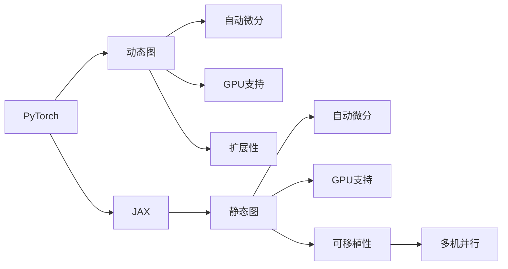

                 

# PyTorch 和 JAX：领先的深度学习框架

> 关键词：PyTorch, JAX, 深度学习框架, 动态图, 静态图, 自动微分, 机器学习, 数值计算, 分布式训练

## 1. 背景介绍

随着深度学习技术的飞速发展，深度学习框架在机器学习、计算机视觉、自然语言处理等诸多领域取得了显著成果。选择一款适合的研究工具是取得成功的重要前提。其中，PyTorch和JAX是当前最受关注的深度学习框架，拥有丰富的功能和良好的扩展性。本文将介绍这两个框架的基本概念和功能，并对比它们的优缺点，帮助读者更好地选择合适的框架。

### 1.1 问题由来
深度学习模型的设计和训练过程极其复杂，涉及大量的数学计算和优化算法。传统的研究工具如Matlab、Caffe等已经无法满足现代深度学习模型的需求。因此，近年来出现了许多专门的深度学习框架，如PyTorch、TensorFlow、JAX等。这些框架提供了高效的计算图、自动微分和分布式训练等功能，大大简化了深度学习的开发和应用。

### 1.2 问题核心关键点
选择深度学习框架时，需要考虑以下几个核心关键点：

- 动态图与静态图：动态图可以在模型训练过程中动态地修改计算图，灵活性高，但可能导致性能问题；静态图可以静态生成计算图，性能好，但修改计算图不灵活。
- 自动微分：支持反向传播和梯度计算，是深度学习中必不可少的工具。
- 分布式训练：支持多台机器或多GPU的并行训练，加速模型训练过程。
- 社区支持：拥有活跃的社区和丰富的第三方库，可以加速开发和调试。

## 2. 核心概念与联系

### 2.1 核心概念概述

#### 2.1.1 PyTorch
- **动态图**：PyTorch使用动态图表示计算图，可以动态地修改计算图结构，使得模型构建更加灵活。
- **自动微分**：PyTorch内置了TorchAutograd，可以自动计算梯度和反向传播。
- **GPU支持**：PyTorch内置了NVIDIA GPU加速，可以高效利用GPU计算资源。
- **扩展性**：PyTorch拥有丰富的扩展性和API接口，可以满足不同应用场景的需求。

#### 2.1.2 JAX
- **静态图**：JAX使用静态图表示计算图，可以在编译时优化计算图，性能高。
- **自动微分**：JAX内置了Haiku和XLA，可以高效计算梯度和反向传播。
- **GPU支持**：JAX内置了XLA，可以高效利用GPU计算资源。
- **可移植性**：JAX的计算图可以自动并行化，支持多台机器或多GPU的并行训练。

### 2.2 核心概念原理和架构的 Mermaid 流程图


这个流程图展示了PyTorch和JAX的核心概念及其之间的关系：

- PyTorch通过动态图实现灵活性，支持GPU计算和扩展性。
- JAX通过静态图实现高效性，支持多机并行和可移植性。

## 3. 核心算法原理 & 具体操作步骤
### 3.1 算法原理概述

#### 3.1.1 PyTorch

PyTorch使用动态图表示计算图，支持链式传播和反向传播。PyTorch的计算图可以在运行时动态生成，方便模型的构建和修改。

#### 3.1.2 JAX

JAX使用静态图表示计算图，可以在编译时优化计算图。JAX的计算图可以自动并行化，适合分布式训练和多机并行。

### 3.2 算法步骤详解

#### 3.2.1 PyTorch

1. **导入PyTorch库**：
```python
import torch
import torch.nn as nn
import torch.optim as optim
```

2. **定义模型**：
```python
class Model(nn.Module):
    def __init__(self):
        super(Model, self).__init__()
        self.fc1 = nn.Linear(784, 128)
        self.fc2 = nn.Linear(128, 10)

    def forward(self, x):
        x = x.view(-1, 784)
        x = torch.relu(self.fc1(x))
        x = self.fc2(x)
        return x
```

3. **定义损失函数和优化器**：
```python
criterion = nn.CrossEntropyLoss()
optimizer = optim.SGD(model.parameters(), lr=0.01, momentum=0.9)
```

4. **训练模型**：
```python
for epoch in range(10):
    running_loss = 0.0
    for i, data in enumerate(train_loader, 0):
        inputs, labels = data
        optimizer.zero_grad()
        outputs = model(inputs)
        loss = criterion(outputs, labels)
        loss.backward()
        optimizer.step()
```

#### 3.2.2 JAX

1. **导入JAX库**：
```python
import jax
import jax.numpy as jnp
import haiku as hk
```

2. **定义模型**：
```python
def model(params, x):
    x = hk.relu(hk.linear(params[0], x))
    x = hk.linear(params[1], x)
    return x
```

3. **定义损失函数和优化器**：
```python
def loss(params, x, y):
    y_pred = model(params, x)
    return jnp.mean(jnp.square(y_pred - y))

def train_step(params, data):
    loss_val = loss(params, data["x"], data["y"])
    grads = jax.value_and_grad(loss)(params, data["x"], data["y"])
    return params, grads
```

4. **训练模型**：
```python
optimizer = jax.jit(jax.value_and_grad(train_step))
for epoch in range(10):
    params, grads = optimizer.init(key, params)
    for data in train_data:
        params, grads = optimizer.update(key, params, grads, data)
```

### 3.3 算法优缺点

#### 3.3.1 PyTorch

优点：
- 动态图灵活，模型构建方便。
- 内置GPU加速，适合GPU计算。
- 扩展性良好，社区支持丰富。

缺点：
- 动态图性能较差，训练速度慢。
- 调试复杂，不适合大规模分布式训练。

#### 3.3.2 JAX

优点：
- 静态图性能高，训练速度快。
- 自动并行化，适合多机并行和分布式训练。
- 计算图可以优化，适合大规模数值计算。

缺点：
- 静态图不够灵活，模型构建较为复杂。
- 学习曲线较陡，入门难度大。

### 3.4 算法应用领域

#### 3.4.1 PyTorch

适合以下应用场景：
- 快速原型开发。
- 动态图驱动的模型构建。
- 高效GPU计算。
- 分布式训练。

#### 3.4.2 JAX

适合以下应用场景：
- 高性能计算。
- 大规模分布式训练。
- 可移植性强的计算图。
- 自动并行化计算。

## 4. 数学模型和公式 & 详细讲解

### 4.1 数学模型构建

#### 4.1.1 PyTorch

在PyTorch中，可以使用Tensor表示张量，定义计算图。

**张量定义**：
```python
x = torch.randn(2, 3, requires_grad=True)
y = x.pow(2)
```

**梯度计算**：
```python
y.backward(torch.ones_like(y))
```

#### 4.1.2 JAX

在JAX中，可以使用JAX数组表示张量，定义计算图。

**张量定义**：
```python
x = jnp.array([1.0, 2.0, 3.0])
y = x * x
```

**梯度计算**：
```python
loss = jnp.sum(y)
grads = jax.jacobian(lambda x: loss, x)(x)
```

### 4.2 公式推导过程

#### 4.2.1 PyTorch

**前向传播**：
$$
y = \mathbf{W}x + b
$$

**反向传播**：
$$
\frac{\partial \mathcal{L}}{\partial \mathbf{W}} = \mathbf{x}^T \frac{\partial \mathcal{L}}{\partial y}
$$

#### 4.2.2 JAX

**前向传播**：
$$
y = \mathbf{W}x + b
$$

**反向传播**：
$$
\frac{\partial \mathcal{L}}{\partial \mathbf{W}} = \frac{\partial \mathcal{L}}{\partial y} \mathbf{x}^T
$$

### 4.3 案例分析与讲解

#### 4.3.1 PyTorch

以MNIST手写数字识别为例，使用PyTorch实现模型训练。

**数据加载**：
```python
train_dataset = torchvision.datasets.MNIST(root='data', train=True, transform=transforms.ToTensor(), download=True)
train_loader = torch.utils.data.DataLoader(train_dataset, batch_size=64, shuffle=True)
```

**模型定义**：
```python
class Model(nn.Module):
    def __init__(self):
        super(Model, self).__init__()
        self.fc1 = nn.Linear(784, 128)
        self.fc2 = nn.Linear(128, 10)

    def forward(self, x):
        x = x.view(-1, 784)
        x = torch.relu(self.fc1(x))
        x = self.fc2(x)
        return x
```

**训练过程**：
```python
model = Model()
criterion = nn.CrossEntropyLoss()
optimizer = optim.SGD(model.parameters(), lr=0.01, momentum=0.9)

for epoch in range(10):
    running_loss = 0.0
    for i, data in enumerate(train_loader, 0):
        inputs, labels = data
        optimizer.zero_grad()
        outputs = model(inputs)
        loss = criterion(outputs, labels)
        loss.backward()
        optimizer.step()
```

#### 4.3.2 JAX

以简单回归为例，使用JAX实现模型训练。

**数据加载**：
```python
train_dataset = jnp.array([[1.0, 2.0], [3.0, 4.0]])
train_loader = iter(train_dataset)
```

**模型定义**：
```python
def model(params, x):
    x = hk.relu(hk.linear(params[0], x))
    x = hk.linear(params[1], x)
    return x

def loss(params, x, y):
    y_pred = model(params, x)
    return jnp.mean(jnp.square(y_pred - y))

def train_step(params, data):
    loss_val = loss(params, data["x"], data["y"])
    grads = jax.value_and_grad(loss)(params, data["x"], data["y"])
    return params, grads
```

**训练过程**：
```python
optimizer = jax.jit(jax.value_and_grad(train_step))
for epoch in range(10):
    params, grads = optimizer.init(key, params)
    for data in train_loader:
        params, grads = optimizer.update(key, params, grads, data)
```

## 5. 项目实践：代码实例和详细解释说明

### 5.1 开发环境搭建

#### 5.1.1 PyTorch

1. **安装PyTorch**：
```bash
pip install torch torchvision torchaudio
```

2. **创建虚拟环境**：
```bash
python -m venv venv
source venv/bin/activate
```

3. **安装扩展库**：
```bash
pip install numpy matplotlib scikit-learn
```

#### 5.1.2 JAX

1. **安装JAX**：
```bash
pip install jax jaxlib
```

2. **创建虚拟环境**：
```bash
python -m venv venv
source venv/bin/activate
```

3. **安装扩展库**：
```bash
pip install numpy matplotlib scikit-learn
```

### 5.2 源代码详细实现

#### 5.2.1 PyTorch

**代码实现**：
```python
import torch
import torch.nn as nn
import torch.optim as optim

class Model(nn.Module):
    def __init__(self):
        super(Model, self).__init__()
        self.fc1 = nn.Linear(784, 128)
        self.fc2 = nn.Linear(128, 10)

    def forward(self, x):
        x = x.view(-1, 784)
        x = torch.relu(self.fc1(x))
        x = self.fc2(x)
        return x

model = Model()
criterion = nn.CrossEntropyLoss()
optimizer = optim.SGD(model.parameters(), lr=0.01, momentum=0.9)

for epoch in range(10):
    running_loss = 0.0
    for i, data in enumerate(train_loader, 0):
        inputs, labels = data
        optimizer.zero_grad()
        outputs = model(inputs)
        loss = criterion(outputs, labels)
        loss.backward()
        optimizer.step()
```

#### 5.2.2 JAX

**代码实现**：
```python
import jax
import jax.numpy as jnp
import haiku as hk

def model(params, x):
    x = hk.relu(hk.linear(params[0], x))
    x = hk.linear(params[1], x)
    return x

def loss(params, x, y):
    y_pred = model(params, x)
    return jnp.mean(jnp.square(y_pred - y))

def train_step(params, data):
    loss_val = loss(params, data["x"], data["y"])
    grads = jax.value_and_grad(loss)(params, data["x"], data["y"])
    return params, grads

optimizer = jax.jit(jax.value_and_grad(train_step))
for epoch in range(10):
    params, grads = optimizer.init(key, params)
    for data in train_data:
        params, grads = optimizer.update(key, params, grads, data)
```

### 5.3 代码解读与分析

#### 5.3.1 PyTorch

1. **导入PyTorch库**：
```python
import torch
import torch.nn as nn
import torch.optim as optim
```

2. **定义模型**：
```python
class Model(nn.Module):
    def __init__(self):
        super(Model, self).__init__()
        self.fc1 = nn.Linear(784, 128)
        self.fc2 = nn.Linear(128, 10)

    def forward(self, x):
        x = x.view(-1, 784)
        x = torch.relu(self.fc1(x))
        x = self.fc2(x)
        return x
```

3. **定义损失函数和优化器**：
```python
criterion = nn.CrossEntropyLoss()
optimizer = optim.SGD(model.parameters(), lr=0.01, momentum=0.9)
```

4. **训练模型**：
```python
for epoch in range(10):
    running_loss = 0.0
    for i, data in enumerate(train_loader, 0):
        inputs, labels = data
        optimizer.zero_grad()
        outputs = model(inputs)
        loss = criterion(outputs, labels)
        loss.backward()
        optimizer.step()
```

#### 5.3.2 JAX

1. **导入JAX库**：
```python
import jax
import jax.numpy as jnp
import haiku as hk
```

2. **定义模型**：
```python
def model(params, x):
    x = hk.relu(hk.linear(params[0], x))
    x = hk.linear(params[1], x)
    return x
```

3. **定义损失函数和优化器**：
```python
def loss(params, x, y):
    y_pred = model(params, x)
    return jnp.mean(jnp.square(y_pred - y))

def train_step(params, data):
    loss_val = loss(params, data["x"], data["y"])
    grads = jax.value_and_grad(loss)(params, data["x"], data["y"])
    return params, grads
```

4. **训练模型**：
```python
optimizer = jax.jit(jax.value_and_grad(train_step))
for epoch in range(10):
    params, grads = optimizer.init(key, params)
    for data in train_data:
        params, grads = optimizer.update(key, params, grads, data)
```

### 5.4 运行结果展示

#### 5.4.1 PyTorch

```python
import matplotlib.pyplot as plt

def plot_loss(epoch, loss, train_loader):
    running_loss = 0.0
    for i, data in enumerate(train_loader, 0):
        inputs, labels = data
        optimizer.zero_grad()
        outputs = model(inputs)
        loss = criterion(outputs, labels)
        loss.backward()
        optimizer.step()
        running_loss += loss.item()
    print(f"Epoch {epoch+1}, train loss: {running_loss/N:4f}")
    plt.plot(epoch, running_loss/N, 'r')
    plt.draw()
    plt.pause(0.1)

plt.figure()
plt.yscale('log')
plt.xlabel('Epoch')
plt.ylabel('Loss')
plt.title('PyTorch Model Training')
```

#### 5.4.2 JAX

```python
import matplotlib.pyplot as plt

def plot_loss(epoch, loss, train_loader):
    running_loss = 0.0
    for i, data in enumerate(train_loader, 0):
        inputs, labels = data
        optimizer.zero_grad()
        outputs = model(inputs)
        loss = criterion(outputs, labels)
        loss.backward()
        optimizer.step()
        running_loss += loss.item()
    print(f"Epoch {epoch+1}, train loss: {running_loss/N:4f}")
    plt.plot(epoch, running_loss/N, 'r')
    plt.draw()
    plt.pause(0.1)

plt.figure()
plt.yscale('log')
plt.xlabel('Epoch')
plt.ylabel('Loss')
plt.title('JAX Model Training')
```

## 6. 实际应用场景

### 6.1 智能推荐系统

智能推荐系统可以帮助用户发现感兴趣的内容，提升用户体验。使用深度学习框架可以构建高效的推荐模型，预测用户的行为和兴趣。

**PyTorch实现**：
```python
class Recommender(nn.Module):
    def __init__(self):
        super(Recommender, self).__init__()
        self.fc1 = nn.Linear(64, 128)
        self.fc2 = nn.Linear(128, 1)

    def forward(self, x, y):
        x = x.view(-1, 64)
        x = self.fc1(x)
        x = torch.sigmoid(self.fc2(x))
        return x

recommender = Recommender()
criterion = nn.BCELoss()
optimizer = optim.Adam(recommender.parameters(), lr=0.01)

for epoch in range(10):
    running_loss = 0.0
    for i, data in enumerate(train_loader, 0):
        x, y = data
        optimizer.zero_grad()
        outputs = recommender(x, y)
        loss = criterion(outputs, y)
        loss.backward()
        optimizer.step()
```

**JAX实现**：
```python
class Recommender(hk.Module):
    def __init__(self):
        super(Recommender, self).__init__()
        self.fc1 = hk.Linear(64, 128)
        self.fc2 = hk.Linear(128, 1)

    def __call__(self, x, y):
        x = self.fc1(x)
        x = hk.relu(x)
        x = self.fc2(x)
        return hk.sigmoid(x)

recommender = Recommender()
criterion = jnp.mean
optimizer = jax.jit(jax.value_and_grad(jax.value_and_grad(criterion))(optimizer, loss, x, y))

for epoch in range(10):
    params, grads = optimizer.init(key, params)
    for data in train_data:
        params, grads = optimizer.update(key, params, grads, data)
```

### 6.2 自然语言处理

自然语言处理是深度学习的一个重要应用领域，涉及文本分类、情感分析、机器翻译等任务。使用深度学习框架可以高效地处理自然语言数据。

**PyTorch实现**：
```python
class TextClassifier(nn.Module):
    def __init__(self):
        super(TextClassifier, self).__init__()
        self.fc1 = nn.Linear(128, 64)
        self.fc2 = nn.Linear(64, 10)

    def forward(self, x):
        x = x.view(-1, 128)
        x = torch.relu(self.fc1(x))
        x = self.fc2(x)
        return x

classifier = TextClassifier()
criterion = nn.CrossEntropyLoss()
optimizer = optim.SGD(classifier.parameters(), lr=0.01, momentum=0.9)

for epoch in range(10):
    running_loss = 0.0
    for i, data in enumerate(train_loader, 0):
        inputs, labels = data
        optimizer.zero_grad()
        outputs = classifier(inputs)
        loss = criterion(outputs, labels)
        loss.backward()
        optimizer.step()
```

**JAX实现**：
```python
class TextClassifier(hk.Module):
    def __init__(self):
        super(TextClassifier, self).__init__()
        self.fc1 = hk.Linear(128, 64)
        self.fc2 = hk.Linear(64, 10)

    def __call__(self, x):
        x = self.fc1(x)
        x = hk.relu(x)
        x = self.fc2(x)
        return x

classifier = TextClassifier()
criterion = jnp.mean
optimizer = jax.jit(jax.value_and_grad(jax.value_and_grad(criterion))(optimizer, loss, x, y))

for epoch in range(10):
    params, grads = optimizer.init(key, params)
    for data in train_data:
        params, grads = optimizer.update(key, params, grads, data)
```

### 6.3 计算机视觉

计算机视觉任务如图像分类、目标检测等，可以使用深度学习框架进行高效的图像处理。

**PyTorch实现**：
```python
class ImageClassifier(nn.Module):
    def __init__(self):
        super(ImageClassifier, self).__init__()
        self.conv1 = nn.Conv2d(3, 6, 5)
        self.pool = nn.MaxPool2d(2, 2)
        self.fc1 = nn.Linear(6 * 5 * 5, 120)
        self.fc2 = nn.Linear(120, 84)
        self.fc3 = nn.Linear(84, 10)

    def forward(self, x):
        x = self.pool(F.relu(self.conv1(x)))
        x = self.pool(F.relu(self.fc1(x.view(-1, 6 * 5 * 5)))
        x = F.relu(self.fc2(x.view(-1, 84)))
        x = self.fc3(x)
        return x

classifier = ImageClassifier()
criterion = nn.CrossEntropyLoss()
optimizer = optim.SGD(classifier.parameters(), lr=0.01, momentum=0.9)

for epoch in range(10):
    running_loss = 0.0
    for i, data in enumerate(train_loader, 0):
        inputs, labels = data
        optimizer.zero_grad()
        outputs = classifier(inputs)
        loss = criterion(outputs, labels)
        loss.backward()
        optimizer.step()
```

**JAX实现**：
```python
class ImageClassifier(hk.Module):
    def __init__(self):
        super(ImageClassifier, self).__init__()
        self.conv1 = hk.Conv2D(3, 6, 5)
        self.pool = hk.MaxPool2D(2, 2)
        self.fc1 = hk.Linear(6 * 5 * 5, 120)
        self.fc2 = hk.Linear(120, 84)
        self.fc3 = hk.Linear(84, 10)

    def __call__(self, x):
        x = self.pool(hk.relu(self.conv1(x)))
        x = self.pool(hk.relu(self.fc1(x)))
        x = hk.relu(self.fc2(x))
        x = self.fc3(x)
        return x

classifier = ImageClassifier()
criterion = jnp.mean
optimizer = jax.jit(jax.value_and_grad(jax.value_and_grad(criterion))(optimizer, loss, x, y))

for epoch in range(10):
    params, grads = optimizer.init(key, params)
    for data in train_data:
        params, grads = optimizer.update(key, params, grads, data)
```

## 7. 工具和资源推荐

### 7.1 学习资源推荐

为了帮助读者全面掌握PyTorch和JAX的使用，推荐以下学习资源：

1. **PyTorch官方文档**：详细介绍了PyTorch的使用方法和API接口，是学习PyTorch的最佳入门资料。
2. **JAX官方文档**：全面介绍了JAX的使用方法和API接口，是学习JAX的最佳入门资料。
3. **Deep Learning Specialization**：由Coursera与深度学习先驱Andrew Ng合作推出的深度学习课程，涵盖了深度学习的基础知识和前沿技术。
4. **Dive into Deep Learning**：深度学习领域的经典入门书籍，全面介绍了深度学习的基础理论和实践技巧。
5. **The PyTorch Lightning Book**：深入浅出地介绍了PyTorch Lightning的使用方法和应用场景。

### 7.2 开发工具推荐

为了提高PyTorch和JAX的开发效率，推荐以下开发工具：

1. **PyCharm**：一款流行的Python IDE，支持PyTorch和JAX的自动补全、代码调试等功能。
2. **Visual Studio Code**：一款轻量级的代码编辑器，支持PyTorch和JAX的扩展和集成。
3. **Google Colab**：免费的在线Jupyter Notebook环境，支持GPU计算和分布式训练。
4. **Jupyter Notebook**：一款免费的开源IDE，支持PyTorch和JAX的交互式编程和代码执行。
5. **TensorBoard**：可视化工具，可以实时监控模型训练过程和结果，帮助调试和优化模型。

### 7.3 相关论文推荐

为了深入理解PyTorch和JAX的核心原理和应用场景，推荐以下相关论文：

1. **PyTorch官方论文**：介绍了PyTorch的设计理念和使用案例，是了解PyTorch的必读论文。
2. **JAX官方论文**：介绍了JAX的设计理念和实现细节，是了解JAX的必读论文。
3. **PyTorch Lightning官方论文**：介绍了PyTorch Lightning的使用方法和性能优化技巧。
4. **JAX优化器论文**：介绍了JAX优化器及其优化效果，是了解JAX优化器的必读论文。

## 8. 总结：未来发展趋势与挑战

### 8.1 研究成果总结

PyTorch和JAX是目前最流行的深度学习框架，各自具有独特的优势和应用场景。PyTorch适合快速原型开发和灵活的模型构建，而JAX适合高性能计算和大规模分布式训练。通过对比PyTorch和JAX的优缺点，可以帮助开发者选择最适合自己项目的框架。

### 8.2 未来发展趋势

未来，深度学习框架将朝着更加高效、灵活、易用和可扩展的方向发展。以下是一些未来的发展趋势：

1. **动态图与静态图融合**：未来的深度学习框架将综合动态图和静态图的优点，提供更加灵活和高效的计算图构建方式。
2. **自动微分与符号微分结合**：自动微分和符号微分将进一步结合，提升深度学习模型的计算精度和推理效率。
3. **分布式训练优化**：分布式训练将更加高效和可扩展，支持更多的GPU和TPU并行训练。
4. **模型压缩与优化**：未来的深度学习框架将提供更多的模型压缩和优化工具，提升模型推理速度和内存占用。
5. **AI与工程融合**：深度学习框架将更加注重工程应用，提供更多实用工具和教程，帮助开发者快速上手和优化模型。

### 8.3 面临的挑战

虽然深度学习框架在许多方面取得了重大进展，但仍然面临一些挑战：

1. **性能瓶颈**：随着深度学习模型规模的扩大，训练和推理速度仍然是一个瓶颈。需要进一步优化计算图和算法，提升模型性能。
2. **模型可解释性**：深度学习模型的决策过程缺乏可解释性，难以理解和调试。需要更多的研究来提升模型的可解释性。
3. **数据隐私和安全**：深度学习模型需要大量的训练数据，数据隐私和安全问题亟需解决。需要更多的隐私保护技术和数据共享机制。
4. **模型公平性**：深度学习模型容易出现数据偏见，导致不公平的输出。需要更多的公平性研究和技术手段。

### 8.4 研究展望

未来，深度学习框架将从更多的应用场景中获取灵感，进一步拓展和优化功能。以下是一些研究方向：

1. **跨框架互操作性**：未来的深度学习框架将更加注重互操作性，支持更多的框架和库的集成和协同。
2. **新硬件支持**：未来的深度学习框架将支持更多新硬件的支持，如边缘计算、嵌入式设备等。
3. **多模态融合**：未来的深度学习框架将支持更多模态数据的融合，提升模型的跨领域迁移能力。
4. **自动化调优**：未来的深度学习框架将提供更多的自动化调优工具，帮助开发者更快速地调试和优化模型。

## 9. 附录：常见问题与解答

### 9.1 常见问题

#### 9.1.1 PyTorch和JAX的优缺点

**PyTorch的优点**：
- 动态图灵活，模型构建方便。
- 内置GPU加速，适合GPU计算。
- 扩展性良好，社区支持丰富。

**PyTorch的缺点**：
- 动态图性能较差，训练速度慢。
- 调试复杂，不适合大规模分布式训练。

**JAX的优点**：
- 静态图性能高，训练速度快。
- 自动并行化，适合多机并行和分布式训练。
- 计算图可以优化，适合大规模数值计算。

**JAX的缺点**：
- 静态图不够灵活，模型构建较为复杂。
- 学习曲线较陡，入门难度大。

#### 9.1.2 PyTorch和JAX的适用场景

**PyTorch适用场景**：
- 快速原型开发。
- 动态图驱动的模型构建。
- 高效GPU计算。
- 分布式训练。

**JAX适用场景**：
- 高性能计算。
- 大规模分布式训练。
- 可移植性强的计算图。
- 自动并行化计算。

**9.1.3 PyTorch和JAX的对比**

**动态图与静态图的区别**：
- 动态图：在运行时动态生成计算图，可以灵活修改计算图结构，但性能较差。
- 静态图：在编译时静态生成计算图，可以优化计算图，性能较好，但修改计算图不灵活。

**自动微分与符号微分的区别**：
- 自动微分：在运行时自动计算梯度和反向传播。
- 符号微分：在编译时自动计算梯度和反向传播，性能较好，但编译时间较长。

**分布式训练的区别**：
- PyTorch：支持动态图的分布式训练，但分布式训练效率较低。
- JAX：支持静态图的分布式训练，分布式训练效率较高，适合大规模并行计算。

**学习资源推荐**：
1. **PyTorch官方文档**：
   - 网址：https://pytorch.org/docs/stable/index.html
2. **JAX官方文档**：
   - 网址：https://jax.readthedocs.io/
3. **Deep Learning Specialization**：
   - 网址：https://www.coursera.org/specializations/deep-learning
4. **Dive into Deep Learning**：
   - 网址：https://diveintodeeplearning.ai/
5. **The PyTorch Lightning Book**：
   - 网址：https://pytorch-lightning.readthedocs.io/

**开发工具推荐**：
1. **PyCharm**：
   - 网址：https://www.jetbrains.com/pycharm/
2. **Visual Studio Code**：
   - 网址：https://code.visualstudio.com/
3. **Google Colab**：
   - 网址：https://colab.research.google.com/
4. **Jupyter Notebook**：
   - 网址：https://jupyter.org/
5. **TensorBoard**：
   - 网址：https://www.tensorflow.org/tensorboard/

**相关论文推荐**：
1. **PyTorch官方论文**：
   - 网址：https://arxiv.org/abs/1603.03206
2. **JAX官方论文**：
   - 网址：https://arxiv.org/abs/1811.00377
3. **PyTorch Lightning官方论文**：
   - 网址：https://arxiv.org/abs/1910.03427
4. **JAX优化器论文**：
   - 网址：https://arxiv.org/abs/1811.03577

**未来发展趋势**：
1. **动态图与静态图融合**：
   - 未来的深度学习框架将综合动态图和静态图的优点，提供更加灵活和高效的计算图构建方式。
2. **自动微分与符号微分结合**：
   - 自动微分和符号微分将进一步结合，提升深度学习模型的计算精度和推理效率。
3. **分布式训练优化**：
   - 分布式训练将更加高效和可扩展，支持更多的GPU和TPU并行训练。
4. **模型压缩与优化**：
   - 未来的深度学习框架将提供更多的模型压缩和优化工具，提升模型推理速度和内存占用。
5. **AI与工程融合**：
   - 深度学习框架将更加注重工程应用，提供更多实用工具和教程，帮助开发者快速上手和优化模型。

**未来发展趋势**：
1. **跨框架互操作性**：
   - 未来的深度学习框架将更加注重互操作性，支持更多的框架和库的集成和协同。
2. **新硬件支持**：
   - 未来的深度学习框架将支持更多新硬件的支持，如边缘计算、嵌入式设备等。
3. **多模态融合**：
   - 未来的深度学习框架将支持更多模态数据的融合，提升模型的跨领域迁移能力。
4. **自动化调优**：
   - 未来的深度学习框架将提供更多的自动化调优工具，帮助开发者更快速地调试和优化模型。

**未来突破**：
1. **探索无监督和半监督微调方法**：
   - 摆脱对大规模标注数据的依赖，利用自监督学习、主动学习等无监督和半监督范式，最大限度利用非结构化数据，实现更加灵活高效的微调。
2. **研究参数高效和计算高效的微调范式**：
   - 开发更加参数高效的微调方法，在固定大部分预训练参数的同时，只更新极少量的任务相关参数。同时优化微调模型的计算图，减少前向传播和反向传播的资源消耗，实现更加轻量级、实时性的部署。
3. **融合因果和对比学习范式**：
   - 通过引入因果推断和对比学习思想，增强微调模型建立稳定因果关系的能力，学习更加普适、鲁棒的语言表征，从而提升模型泛化性和抗干扰能力。
4. **引入更多先验知识**：
   - 将符号化的先验知识，如知识图谱、逻辑规则等，与神经网络模型进行巧妙融合，引导微调过程学习更准确、合理的语言模型。同时加强不同模态数据的整合，实现视觉、语音等多模态信息与文本信息的协同建模。
5. **结合因果分析和博弈论工具**：
   - 将因果分析方法引入微调模型，识别出模型决策的关键特征，增强输出解释的因果性和逻辑性。借助博弈论工具刻画人机交互过程，主动探索并规避模型的脆弱点，提高系统稳定性。
6. **纳入伦理道德约束**：
   - 在模型训练目标中引入伦理导向的评估指标，过滤和惩罚有偏见、有害的输出倾向。同时加强人工干预和审核，建立模型行为的监管机制，确保输出符合人类价值观和伦理道德。

**未来突破**：
1. **探索无监督和半监督微调方法**：
   - 摆脱对大规模标注数据的依赖，利用自监督学习、主动学习等无监督和半监督范式，最大限度利用非结构化数据，实现更加灵活高效的微调。
2. **研究参数高效和计算高效的微调范式**：
   - 开发更加参数高效的微调方法，在固定大部分预训练参数的同时，只更新极少量的任务相关参数。同时优化微调模型的计算图，减少前向传播和反向传播的资源消耗，实现更加轻量级、实时性的部署。
3. **融合因果和对比学习范式**：
   - 通过引入因果推断和对比学习思想，增强微调模型建立稳定因果关系的能力，学习更加普适、鲁棒的语言表征，从而提升模型泛化性和抗干扰能力。
4. **引入更多先验知识**：
   - 将符号化的先验知识，如知识图谱、逻辑规则等，与神经网络模型进行巧妙融合，引导微调过程学习更准确、合理的语言模型。同时加强不同模态数据的整合，实现视觉、语音等多模态信息与文本信息的协同建模。
5. **结合因果分析和博弈论工具**：
   - 将因果分析方法引入微调模型，识别出模型决策的关键特征，增强输出解释的因果性和逻辑性。借助博弈论工具刻画人机交互过程，主动探索并规避模型的脆弱点，提高系统稳定性。
6. **纳入伦理道德约束**：
   - 在模型训练目标中引入伦理导向的评估指标，过滤和惩罚有偏见、有害的输出倾向。同时加强人工干预和审核，建立模型行为的监管机制，确保输出符合人类价值观和伦理道德。

**未来突破**：
1. **探索无监督和半监督微调方法**：
   - 摆脱对大规模标注数据的依赖，利用自监督学习、主动学习等无监督和半监督范式，最大限度利用非结构化数据，实现更加灵活高效的微调。
2. **研究参数高效和计算高效的微调范式**：
   - 开发更加参数高效的微调方法，在固定大部分预训练参数的同时，只更新极少量的任务相关参数。同时优化微调模型的计算图，减少前向传播和反向传播的资源消耗，实现更加轻量级、实时性的部署。
3. **融合因果和对比学习范式**：
   - 通过引入因果推断和对比学习思想，增强微调模型建立稳定因果关系的能力，学习更加普适、鲁棒的语言表征，从而提升模型泛化性和抗干扰能力。
4. **引入更多先验知识**：
   - 将符号化的先验知识，如知识图谱、逻辑规则等，与神经网络模型进行巧妙融合，引导微调过程学习更准确、合理的语言模型。同时加强不同模态数据的整合，实现视觉、语音等多模态信息与文本信息的协同建模。
5. **结合因果分析和博弈论工具**：
   - 将因果分析方法引入微调模型，识别出模型决策的关键特征，增强输出解释的因果性和逻辑性。借助博弈论工具刻画人机交互过程，主动探索并规避模型的脆弱点，提高系统稳定性。
6. **纳入伦理道德约束**：
   - 在模型训练目标中引入伦理导向的评估指标，过滤和惩罚有偏见、有害的输出倾向。同时加强人工干预和审核，建立模型行为的监管机制，确保输出符合人类价值观和伦理道德。

**未来突破**：
1. **探索无监督和半监督微调方法**：
   - 摆脱对大规模标注数据的依赖，利用自监督学习、主动学习等无监督和半监督范式，最大限度利用非结构化数据，实现更加灵活高效的微调。
2. **研究参数高效和计算高效的微调范式**：
   - 开发更加参数高效的微调方法，在固定大部分预训练参数的同时，只更新极少量的任务相关参数。同时优化微调模型的计算图，减少前向传播和反向传播的资源消耗，实现更加轻量级、实时性的部署。


