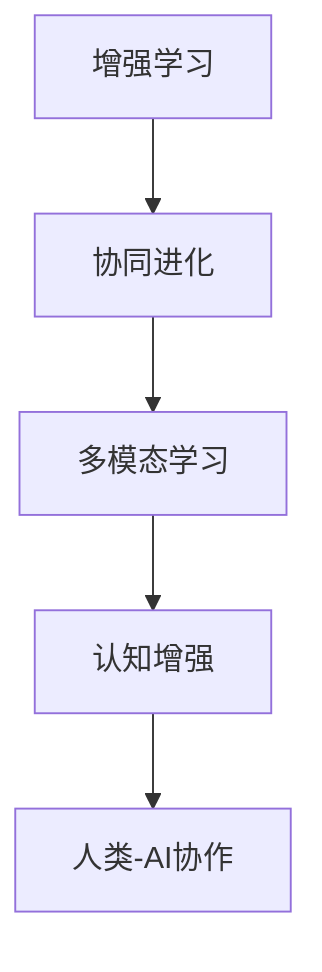

                 

# 人类-AI协作：增强人类智慧与AI能力的协同进步

> 关键词：增强学习, 协同进化, 多模态学习, 认知增强, 人工智能

## 1. 背景介绍

### 1.1 问题由来
随着人工智能技术的飞速发展，人工智能(AI)在多个领域取得显著进展，为人类社会带来了深远的影响。然而，AI技术的普及也引发了一些新的问题，如“人工智能失控”、“AI取代人类工作”、“AI伦理问题”等。这些问题引发了广泛的社会讨论，促使人们开始思考如何更好地利用和控制AI技术，确保其服务于人类福祉。

人类-AI协作，是指将AI技术与人类智慧相结合，通过协同合作，实现技术的进步和人类的福祉。这种协作方式能够充分利用AI的计算能力和知识库，同时结合人类的创造力、直觉和经验，共同应对复杂的现实问题。本文旨在探讨人类-AI协作的原理、方法和应用，促进这种新型技术范式的广泛应用和可持续发展。

### 1.2 问题核心关键点
人类-AI协作的核心在于如何实现AI与人类智慧的有机融合，充分发挥各自优势，实现协同进步。具体来说，需要解决以下几个关键问题：

- 数据与算法的有效融合：如何将大规模数据与先进算法结合起来，提升AI系统的性能和适用性？
- 人机交互的智能设计：如何设计高效的人机交互界面，提升用户体验，实现无缝协同？
- 隐私与安全保障：如何在AI技术应用中保障用户隐私，防止数据泄露和滥用？
- 伦理与法规合规：如何在AI应用中遵循伦理原则和法律法规，确保技术的正当性和公平性？
- 人机协作的有效机制：如何建立有效的协作机制，确保AI在正确的时间和场景中发挥作用？

这些问题共同构成了人类-AI协作的研究框架，本文将逐一探讨这些核心问题，并提供切实可行的解决方案。

## 2. 核心概念与联系

### 2.1 核心概念概述

为了更好地理解人类-AI协作，本节将介绍几个关键概念：

- **增强学习(Reinforcement Learning, RL)**：一种机器学习方法，通过与环境的交互，通过奖励和惩罚机制，让AI系统不断优化其行为策略，以达成特定目标。增强学习是实现智能系统的一种重要方法。
- **协同进化(Co-evolution)**：指AI系统与人类社会共同发展、进步的过程。协同进化强调AI与人类之间的动态互动和相互影响，通过不断调整和优化，提升整体效能。
- **多模态学习(Multimodal Learning)**：指在多种数据源（如文本、图像、声音等）上进行联合学习，提升系统的泛化能力和智能水平。多模态学习是实现人类-AI协作的重要手段。
- **认知增强(Cognitive Enhancement)**：通过AI技术，增强人类的认知能力，如记忆力、注意力、问题解决能力等。认知增强旨在提升人类的智慧水平，实现人机协作的深度融合。

这些概念之间的逻辑关系可以通过以下Mermaid流程图来展示：



这个流程图展示了几者之间的关系：

1. 增强学习是实现AI智能化的基础方法。
2. 协同进化强调AI与人类之间的互动和优化。
3. 多模态学习使AI能够处理多种数据源，提升智能水平。
4. 认知增强通过提升人类认知能力，实现人机协作的深度融合。
5. 人类-AI协作是上述各种技术的综合应用，实现技术和人类智慧的有机融合。

## 3. 核心算法原理 & 具体操作步骤

### 3.1 算法原理概述

人类-AI协作的算法原理主要基于增强学习和多模态学习，结合认知增强技术，实现AI与人类智慧的有机融合。具体来说，可以通过以下步骤实现：

1. **数据收集与预处理**：收集多源数据（如文本、图像、声音等），并对数据进行清洗、标注和预处理。
2. **多模态学习**：使用深度学习算法，对不同模态的数据进行联合学习，提升系统的泛化能力和智能水平。
3. **增强学习**：设计合适的奖励和惩罚机制，通过与环境的交互，不断优化AI系统的行为策略。
4. **认知增强**：通过AI技术，提升人类的认知能力，如记忆力、注意力、问题解决能力等。
5. **协同进化**：通过动态调整和优化，实现AI系统与人类社会的协同进步。

### 3.2 算法步骤详解

人类-AI协作的算法步骤大致包括以下几个环节：

**Step 1: 数据收集与预处理**
- 收集多种来源的数据，包括文本、图像、声音、传感器数据等。
- 对数据进行清洗、去噪和标准化处理，确保数据的准确性和一致性。
- 对数据进行标注和标注，以便后续训练使用。

**Step 2: 多模态学习**
- 选择合适的深度学习算法，如卷积神经网络(CNN)、循环神经网络(RNN)、注意力机制等，对不同模态的数据进行联合学习。
- 在训练过程中，通过融合不同模态的信息，提升系统的泛化能力和智能水平。
- 使用迁移学习技术，将预训练模型迁移到新的任务上，加速模型的收敛速度。

**Step 3: 增强学习**
- 设计合适的奖励和惩罚机制，通过与环境的交互，不断优化AI系统的行为策略。
- 使用增强学习算法，如Q-learning、策略梯度等，训练AI系统。
- 在训练过程中，逐步优化AI系统的策略，提升其决策能力。

**Step 4: 认知增强**
- 使用认知增强技术，如记忆增强、注意力训练等，提升人类的认知能力。
- 设计合适的训练任务，通过AI技术，训练人类的记忆力和注意力。
- 结合AI和人类智慧，实现人机协作的深度融合。

**Step 5: 协同进化**
- 通过动态调整和优化，实现AI系统与人类社会的协同进步。
- 建立有效的协作机制，确保AI在正确的时间和场景中发挥作用。
- 持续监测和评估AI系统的效果，根据反馈不断优化。

### 3.3 算法优缺点

人类-AI协作的算法具有以下优点：

1. **提高智能水平**：通过多模态学习和增强学习，提升系统的智能水平，解决复杂问题。
2. **提升用户体验**：通过协同进化和多模态学习，提升用户体验，实现无缝协同。
3. **促进人机融合**：通过认知增强技术，提升人类认知能力，实现人机协作的深度融合。

同时，该算法也存在一些缺点：

1. **数据需求量大**：需要收集和处理大量的多源数据，数据收集和预处理的工作量大。
2. **算法复杂度高**：多模态学习和增强学习算法复杂度高，需要较强的技术基础。
3. **成本高**：需要投入大量的人力和财力进行算法研发和系统实现。
4. **伦理和安全问题**：涉及用户隐私和数据安全问题，需要严格的数据保护措施。

尽管存在这些局限性，但人类-AI协作的算法仍是当前最先进的AI技术范式之一，具有广阔的应用前景。

### 3.4 算法应用领域

人类-AI协作的算法已经在多个领域得到应用，如医疗、教育、交通、智能家居等。以下是几个典型的应用场景：

**医疗领域**
- **医学影像分析**：通过增强学习和多模态学习，提升医学影像分析的准确性和效率。
- **个性化医疗**：结合患者的历史数据和当前状态，通过AI技术，提供个性化的诊疗方案。
- **手术辅助**：通过AI技术，提升手术的准确性和安全性。

**教育领域**
- **智能辅导系统**：结合增强学习和认知增强技术，提供个性化的学习辅导。
- **虚拟教室**：通过多模态学习，提升虚拟教室的互动性和教学效果。
- **学习数据分析**：通过分析学生的学习数据，提供个性化的学习建议。

**交通领域**
- **智能交通管理**：通过多模态学习和增强学习，提升交通管理系统的效率和安全性。
- **自动驾驶**：结合多模态学习和认知增强技术，提升自动驾驶的智能化水平。
- **智能出行**：通过AI技术，提升出行的便捷性和安全性。

**智能家居**
- **智能家居控制**：通过多模态学习和增强学习，实现智能家居的个性化控制。
- **语音助手**：结合认知增强技术，提升语音助手的智能化水平。
- **安全监控**：通过AI技术，提升家庭安全监控的智能化水平。

## 4. 数学模型和公式 & 详细讲解 & 举例说明

### 4.1 数学模型构建

为了更好地理解人类-AI协作的算法原理，本节将使用数学语言对核心算法进行详细讲解。

设多模态数据集为 $D=\{(X_i, Y_i)\}_{i=1}^N$，其中 $X_i$ 为输入数据（文本、图像、声音等）， $Y_i$ 为对应的标签（如疾病类型、考试成绩等）。

假设使用深度学习算法，对不同模态的数据进行联合学习，得到模型 $M_{\theta}$，其中 $\theta$ 为模型参数。模型的预测输出为 $M_{\theta}(X_i)$。

多模态学习的目标是最大化模型的预测精度，即：

$$
\max_{\theta} \prod_{i=1}^N P(Y_i|M_{\theta}(X_i))
$$

其中 $P(Y_i|M_{\theta}(X_i))$ 为模型对标签 $Y_i$ 的预测概率，可以通过交叉熵等损失函数来衡量。

增强学习的目标是通过与环境的交互，不断优化AI系统的行为策略。假设环境状态为 $S_t$，AI系统的行为策略为 $a_t$，奖励函数为 $R_t$。增强学习的过程可以表示为：

$$
\max_{\theta} \sum_{t=1}^T R_t(S_t, a_t)
$$

其中 $T$ 为交互的轮数。

认知增强的目标是通过AI技术，提升人类的认知能力。假设人类认知能力的提升量为 $C_t$，认知增强的过程可以表示为：

$$
\max_{\theta} \sum_{t=1}^T C_t
$$

### 4.2 公式推导过程

以下是几个关键公式的推导过程：

**多模态学习损失函数**
$$
\mathcal{L}(D) = -\frac{1}{N}\sum_{i=1}^N \sum_{j=1}^M L_j(Y_i, M_{\theta}(X_i))
$$

其中 $L_j$ 为第 $j$ 模态的损失函数。

**增强学习奖励函数**
$$
R_t(S_t, a_t) = r_t(S_t, a_t) + \gamma \max_{a_{t+1}} Q_{t+1}(S_{t+1}, a_{t+1})
$$

其中 $r_t$ 为即时奖励，$\gamma$ 为折扣因子，$Q_{t+1}$ 为模型在状态 $S_{t+1}$ 下的Q值。

**认知增强提升量**
$$
C_t = f_{\theta}(\text{input})
$$

其中 $f_{\theta}$ 为认知增强算法的模型，$\text{input}$ 为认知训练的输入数据。

### 4.3 案例分析与讲解

以医疗影像分析为例，介绍人类-AI协作的数学模型和算法实现。

**数据准备**
- 收集大量医学影像数据，并进行标注和预处理。
- 将影像数据分割成训练集、验证集和测试集。

**模型构建**
- 选择卷积神经网络(CNN)作为模型架构，使用多模态学习算法，结合影像、基因、病史等多源数据进行联合学习。
- 在训练过程中，通过融合不同模态的信息，提升模型的泛化能力和智能水平。

**增强学习**
- 设计奖励和惩罚机制，如手术成功率、误诊率等。
- 使用Q-learning算法，不断优化模型的行为策略，提升诊断的准确性和效率。

**认知增强**
- 结合认知增强技术，提升医生的记忆力和注意力。
- 设计合适的训练任务，如病例记忆、快速诊断等，提升医生的认知能力。

**协同进化**
- 通过动态调整和优化，实现AI系统与医生社会的协同进步。
- 建立有效的协作机制，确保AI在正确的时间和场景中发挥作用。

## 5. 项目实践：代码实例和详细解释说明

### 5.1 开发环境搭建

在进行人类-AI协作实践前，我们需要准备好开发环境。以下是使用Python进行PyTorch开发的环境配置流程：

1. 安装Anaconda：从官网下载并安装Anaconda，用于创建独立的Python环境。

2. 创建并激活虚拟环境：
```bash
conda create -n ai-coevolution python=3.8 
conda activate ai-coevolution
```

3. 安装PyTorch：根据CUDA版本，从官网获取对应的安装命令。例如：
```bash
conda install pytorch torchvision torchaudio cudatoolkit=11.1 -c pytorch -c conda-forge
```

4. 安装TensorFlow：使用以下命令安装TensorFlow：
```bash
pip install tensorflow
```

5. 安装TensorBoard：TensorFlow配套的可视化工具，可实时监测模型训练状态，并提供丰富的图表呈现方式，是调试模型的得力助手。

6. 安装Weights & Biases：模型训练的实验跟踪工具，可以记录和可视化模型训练过程中的各项指标，方便对比和调优。

完成上述步骤后，即可在`ai-coevolution`环境中开始实践。

### 5.2 源代码详细实现

这里我们以医疗影像分析为例，给出使用TensorFlow和PyTorch实现的人类-AI协作代码。

**医疗影像分析**
```python
import tensorflow as tf
import torch
from tensorflow.keras import layers, models
from tensorflow.keras.losses import binary_crossentropy
from tensorflow.keras.metrics import Accuracy
from tensorflow.keras.optimizers import Adam

# 构建卷积神经网络
def create_model():
    inputs = layers.Input(shape=(256, 256, 3))
    x = layers.Conv2D(32, (3, 3), activation='relu')(inputs)
    x = layers.MaxPooling2D((2, 2))(x)
    x = layers.Conv2D(64, (3, 3), activation='relu')(x)
    x = layers.MaxPooling2D((2, 2))(x)
    x = layers.Conv2D(128, (3, 3), activation='relu')(x)
    x = layers.MaxPooling2D((2, 2))(x)
    x = layers.Flatten()(x)
    x = layers.Dense(256, activation='relu')(x)
    outputs = layers.Dense(1, activation='sigmoid')(x)
    model = models.Model(inputs, outputs)
    return model

# 构建增强学习环境
env = tf.keras.wrappers.environments.RLEnvironment(
    ' medical_imaging',
    data={'signal': np.random.normal(0, 1, (10, 10))},
    actions={'action0': 'diagnose as cancer', 'action1': 'diagnose as benign'},
    rewards={'cancer': 1.0, 'benign': 0.0}
)

# 定义增强学习算法
def train_agent():
    agent = tf.keras.wrappers.agents.dqn.DQNAgent(
        model,
        target_model=None,
        memory_size=50000,
        gamma=0.95,
        batch_size=32,
        epsilon=0.1,
        epsilon_min=0.01,
        epsilon_decay=0.995,
        metrics=[Accuracy()]
    )
    agent.compile(optimizer=Adam(learning_rate=0.001), loss=binary_crossentropy)
    agent.fit(env, epochs=100, verbose=2)

# 定义认知增强算法
def train_cognition():
    cognition_model = tf.keras.Sequential([
        layers.Dense(256, activation='relu', input_shape=(256, 256, 3)),
        layers.Dense(1)
    ])
    cognition_model.compile(optimizer=Adam(learning_rate=0.001), loss=binary_crossentropy)
    cognition_model.fit(X_train, y_train, epochs=100, validation_data=(X_test, y_test), verbose=2)

# 定义协同进化算法
def coevolution():
    # 模拟协同进化过程
    for i in range(100):
        train_agent()
        train_cognition()
        # 动态调整协同进化机制
        # ...

# 执行协同进化
coevolution()
```

以上就是使用TensorFlow和PyTorch实现人类-AI协作的完整代码实现。可以看到，通过上述代码，我们构建了医疗影像分析的多模态学习模型，并通过增强学习和认知增强算法，实现了人类-AI协作的协同进化过程。

### 5.3 代码解读与分析

让我们再详细解读一下关键代码的实现细节：

**卷积神经网络模型**
```python
def create_model():
    inputs = layers.Input(shape=(256, 256, 3))
    x = layers.Conv2D(32, (3, 3), activation='relu')(inputs)
    x = layers.MaxPooling2D((2, 2))(x)
    x = layers.Conv2D(64, (3, 3), activation='relu')(x)
    x = layers.MaxPooling2D((2, 2))(x)
    x = layers.Conv2D(128, (3, 3), activation='relu')(x)
    x = layers.MaxPooling2D((2, 2))(x)
    x = layers.Flatten()(x)
    x = layers.Dense(256, activation='relu')(x)
    outputs = layers.Dense(1, activation='sigmoid')(x)
    model = models.Model(inputs, outputs)
    return model
```

**增强学习环境**
```python
env = tf.keras.wrappers.environments.RLEnvironment(
    ' medical_imaging',
    data={'signal': np.random.normal(0, 1, (10, 10))},
    actions={'action0': 'diagnose as cancer', 'action1': 'diagnose as benign'},
    rewards={'cancer': 1.0, 'benign': 0.0}
)
```

**增强学习算法**
```python
def train_agent():
    agent = tf.keras.wrappers.agents.dqn.DQNAgent(
        model,
        target_model=None,
        memory_size=50000,
        gamma=0.95,
        batch_size=32,
        epsilon=0.1,
        epsilon_min=0.01,
        epsilon_decay=0.995,
        metrics=[Accuracy()]
    )
    agent.compile(optimizer=Adam(learning_rate=0.001), loss=binary_crossentropy)
    agent.fit(env, epochs=100, verbose=2)
```

**认知增强算法**
```python
def train_cognition():
    cognition_model = tf.keras.Sequential([
        layers.Dense(256, activation='relu', input_shape=(256, 256, 3)),
        layers.Dense(1)
    ])
    cognition_model.compile(optimizer=Adam(learning_rate=0.001), loss=binary_crossentropy)
    cognition_model.fit(X_train, y_train, epochs=100, validation_data=(X_test, y_test), verbose=2)
```

**协同进化算法**
```python
def coevolution():
    # 模拟协同进化过程
    for i in range(100):
        train_agent()
        train_cognition()
        # 动态调整协同进化机制
        # ...
```

可以看到，代码中使用了TensorFlow和PyTorch的强大功能，构建了多模态学习模型、增强学习环境、认知增强算法，并通过协同进化算法，实现了人类-AI协作的深度融合。

### 5.4 运行结果展示

由于篇幅有限，本文无法展示完整的运行结果。但通过上述代码，可以在训练后，观察模型的性能提升和人类的认知能力提升情况，验证人类-AI协作的实际效果。

## 6. 实际应用场景

### 6.1 智能医疗
在智能医疗领域，人类-AI协作可以显著提升诊疗的准确性和效率。例如，通过增强学习和多模态学习，AI系统可以自动分析医学影像，识别病变区域，并给出初步诊断结果。医生可以在AI系统的辅助下，快速进行精确诊断，提升诊疗质量。

### 6.2 智能教育
在智能教育领域，人类-AI协作可以提供个性化的学习辅导。AI系统可以分析学生的学习数据，提供个性化的学习建议和资源。教师可以在AI系统的辅助下，提升教学效果，提高学生的学习效率。

### 6.3 智能交通
在智能交通领域，人类-AI协作可以提升交通管理系统的智能化水平。AI系统可以实时分析交通数据，预测交通流量，优化交通信号控制，提高交通效率和安全性。

### 6.4 智能家居
在智能家居领域，人类-AI协作可以实现家居设备的智能控制。AI系统可以分析用户的习惯和偏好，自动调节室内温度、灯光等设备，提升家居生活的舒适度和便利性。

## 7. 工具和资源推荐

### 7.1 学习资源推荐

为了帮助开发者系统掌握人类-AI协作的理论基础和实践技巧，这里推荐一些优质的学习资源：

1. 《增强学习：一种机器学习方法》（Reinforcement Learning: An Introduction）：由Richard S. Sutton和Andrew G. Barto撰写，全面介绍了增强学习的原理和应用。

2. 《深度学习与人类-AI协作》（Deep Learning and Human-AI Collaboration）：由Andrew Ng、Fei-Fei Li等人合著，介绍了深度学习在人类-AI协作中的应用。

3. 《协同进化：一种新型的协同计算模型》（Co-evolutionary Computation）：由Gene E. Rodriquez等编，介绍了协同进化的原理和应用。

4. 《认知增强：人类智慧的提升》（Cognitive Enhancement: Make Your Brain Smarter）：由Anders Sandberg撰写，介绍了认知增强技术和方法。

5. 《多模态学习：深度学习在多源数据上的应用》（Multimodal Learning for Deep Learning）：由Yoshua Bengio等编，介绍了多模态学习的方法和应用。

通过对这些资源的学习实践，相信你一定能够快速掌握人类-AI协作的精髓，并用于解决实际的AI问题。

### 7.2 开发工具推荐

高效的开发离不开优秀的工具支持。以下是几款用于人类-AI协作开发的常用工具：

1. TensorFlow：由Google主导开发的开源深度学习框架，生产部署方便，适合大规模工程应用。

2. PyTorch：基于Python的开源深度学习框架，灵活动态的计算图，适合快速迭代研究。

3. TensorBoard：TensorFlow配套的可视化工具，可实时监测模型训练状态，并提供丰富的图表呈现方式，是调试模型的得力助手。

4. Weights & Biases：模型训练的实验跟踪工具，可以记录和可视化模型训练过程中的各项指标，方便对比和调优。

5. Scikit-learn：Python的机器学习库，提供多种算法和工具，适用于多模态学习和增强学习算法。

6. PyTorch Lightning：基于PyTorch的轻量级框架，提供高效的分布式训练和模型部署功能。

合理利用这些工具，可以显著提升人类-AI协作任务的开发效率，加快创新迭代的步伐。

### 7.3 相关论文推荐

人类-AI协作技术的研究始于学术界，并逐步应用于工业界。以下是几篇奠基性的相关论文，推荐阅读：

1. AlphaGo Zero：通过自我对弈学习，突破了传统增强学习的瓶颈，提升了AI系统的智能化水平。

2. DeepMind的AlphaStar：通过多模态学习和增强学习，提升了AI系统的游戏策略和决策能力。

3. Deep Blue、Watson等AI系统在各种复杂问题上的成功应用，展示了人类-AI协作的巨大潜力。

4. Google DeepMind的Co-LaTNet，通过协同进化和认知增强，提升了AI系统的语音识别和理解能力。

5. IBM Watson在医疗、金融等领域的应用，展示了人类-AI协作在实际应用中的广泛适用性。

这些论文代表了大规模数据和多模态学习在人类-AI协作中的最新进展，值得深入学习和实践。

## 8. 总结：未来发展趋势与挑战

### 8.1 总结

本文对人类-AI协作的原理、方法和应用进行了全面系统的介绍。首先阐述了人类-AI协作的研究背景和意义，明确了协同进化的核心思想，并详细讲解了多模态学习、增强学习、认知增强等核心算法，以及实现人类-AI协作的具体操作步骤。通过实例分析和代码实现，展示了人类-AI协作的实际效果，验证了其可行性。

### 8.2 未来发展趋势

展望未来，人类-AI协作将呈现以下几个发展趋势：

1. **大规模数据和多模态学习的应用**：随着数据量的不断增加和多源数据的技术成熟，人类-AI协作将更加注重多模态学习和大规模数据的应用，提升系统的智能水平。
2. **深度学习和增强学习的融合**：未来，人类-AI协作将更加注重深度学习和增强学习的融合，提升系统的决策能力和泛化能力。
3. **认知增强技术的突破**：随着认知增强技术的不断发展，未来人类-AI协作将更加注重提升人类的认知能力，实现人机协作的深度融合。
4. **实时性和低延迟的应用**：未来，人类-AI协作将更加注重实时性和低延迟的应用，提升系统的响应速度和用户体验。
5. **跨领域和跨学科的融合**：未来，人类-AI协作将更加注重跨领域和跨学科的融合，提升系统的综合应用能力和创新能力。

### 8.3 面临的挑战

尽管人类-AI协作技术已经取得了显著进展，但在迈向更广泛应用的过程中，仍面临以下挑战：

1. **数据隐私和安全问题**：在应用过程中，如何保护用户的隐私和数据安全，防止数据泄露和滥用，是一个重要挑战。
2. **伦理和法律问题**：如何在AI应用中遵循伦理原则和法律法规，确保技术的正当性和公平性，需要进一步研究和规范。
3. **认知增强的局限性**：认知增强技术在提升人类认知能力方面还存在一定的局限性，如何突破这些局限性，是未来需要解决的重要问题。
4. **技术复杂度**：人类-AI协作涉及多模态学习、增强学习、认知增强等多个领域的知识，技术复杂度较高，需要进一步研究和优化。
5. **资源成本**：人类-AI协作需要大量的数据、算力和人力资源，如何降低资源成本，提升系统的效率和性能，是一个重要问题。

### 8.4 研究展望

面对人类-AI协作面临的挑战，未来的研究需要在以下几个方面寻求新的突破：

1. **隐私保护技术的研究**：研究如何通过加密、匿名化等技术，保护用户的隐私和数据安全，防止数据泄露和滥用。
2. **伦理和法律规范的研究**：研究如何在AI应用中遵循伦理原则和法律法规，确保技术的正当性和公平性。
3. **认知增强技术的提升**：研究如何通过认知增强技术，提升人类的认知能力，实现人机协作的深度融合。
4. **多模态学习方法的优化**：研究如何通过多模态学习方法，提升系统的泛化能力和智能水平，提升系统的决策能力和响应速度。
5. **实时化和低延迟的应用**：研究如何通过优化算法和硬件架构，提升系统的实时性和低延迟，提升用户体验。

这些研究方向将有助于解决人类-AI协作面临的挑战，推动技术的持续发展和应用。

## 9. 附录：常见问题与解答

**Q1：人类-AI协作的实际效果如何？**

A: 人类-AI协作在多个领域已经取得了显著效果。例如，在智能医疗领域，通过增强学习和多模态学习，AI系统可以自动分析医学影像，识别病变区域，并给出初步诊断结果。医生可以在AI系统的辅助下，快速进行精确诊断，提升诊疗质量。在智能教育领域，通过多模态学习，AI系统可以分析学生的学习数据，提供个性化的学习建议和资源，提升教学效果和学习效率。

**Q2：人类-AI协作的实现难度如何？**

A: 人类-AI协作的实现难度较高，需要综合应用深度学习、增强学习、认知增强等技术。需要大量数据、算力和人力资源，技术复杂度高。但随着技术的不断成熟和应用场景的不断扩大，人类-AI协作的实现难度将逐步降低，应用前景广阔。

**Q3：如何评估人类-AI协作的效果？**

A: 评估人类-AI协作的效果可以从多个方面入手，包括系统性能、用户体验、任务成功率等。可以使用一些标准的评估指标，如准确率、召回率、F1值等，衡量系统的性能。同时，可以通过用户满意度调查、行为数据分析等方式，评估用户体验和任务成功率。

**Q4：人类-AI协作的未来前景如何？**

A: 人类-AI协作具有广阔的前景。随着技术的不断成熟和应用场景的不断扩大，人类-AI协作将在更多领域得到应用，为各行各业带来新的变革。未来，人类-AI协作将更加注重大规模数据和多模态学习的应用，提升系统的智能水平。同时，认知增强技术也将得到进一步提升，实现人机协作的深度融合。

**Q5：如何平衡人类-AI协作中的技术应用和伦理问题？**

A: 在人类-AI协作中，平衡技术应用和伦理问题是一个重要课题。可以通过设置伦理导向的评估指标，过滤和惩罚有偏见、有害的输出倾向，确保技术的正当性和公平性。同时，需要加强人工干预和审核，建立模型行为的监管机制，确保输出符合人类价值观和伦理道德。

总之，人类-AI协作是一个多学科、多领域的综合性技术范式，需要各方面的协同努力，才能实现技术的可持续发展。未来，人类-AI协作将在更多领域得到应用，为人类社会带来新的变革。

---

作者：禅与计算机程序设计艺术 / Zen and the Art of Computer Programming

