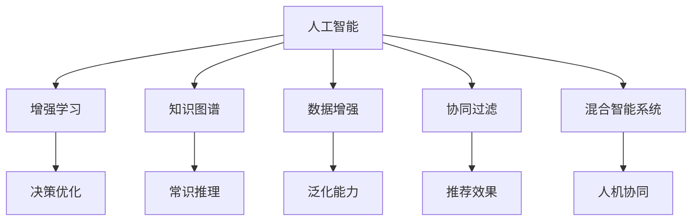

                 

## 1. 背景介绍

随着人工智能（AI）技术的快速发展和广泛应用，AI与人类之间的协作方式正在发生深刻变化。这一变革不仅体现在技术和产品的迭代升级上，更重要的是，它影响着人类的思维方式、工作方式和生活方式。本文将探讨人类与AI协作的未来趋势，以及如何在增强人类潜能的同时提升AI的能力。

### 1.1 问题由来

人工智能技术的快速发展，尤其是深度学习、自然语言处理和大规模数据驱动的算法，已经广泛应用于医疗、金融、教育、制造等多个领域。这些技术不仅提高了生产效率，还为人类提供了前所未有的决策支持。然而，在享受AI带来的便利和效率提升的同时，人类也面临一些新的挑战，如技术替代、隐私安全、伦理道德等。如何在推动AI技术发展的同时，确保其服务于人类社会，是一个值得深思的问题。

### 1.2 问题核心关键点

人工智能与人类协作的核心关键点在于如何平衡技术的进步与人的价值。具体来说，包括以下几个方面：
1. **增强人类潜能**：通过AI技术提高人类的认知能力、决策能力、创造力等。
2. **提升AI能力**：使AI系统具备更强的学习能力、适应能力和协作能力。
3. **伦理道德约束**：确保AI技术的使用符合人类价值观和社会伦理。
4. **数据安全隐私**：保护用户数据和隐私，避免数据泄露和滥用。
5. **技术可解释性**：提升AI系统的可解释性，帮助用户理解其决策过程。

这些关键点构成了人类与AI协作的基础框架，是推动未来技术发展的核心驱动力。

### 1.3 问题研究意义

研究人类与AI协作的趋势，对于探索AI技术的潜在价值、推动技术创新、保障人类福祉具有重要意义。AI技术的发展不仅能够为各行各业带来效率提升和创新驱动，还能够在教育、医疗、社会治理等领域产生深远影响。通过深化AI与人类之间的协作，可以最大化AI技术的正面效应，促进社会和谐与进步。

## 2. 核心概念与联系

### 2.1 核心概念概述

为了更好地理解人类与AI协作的未来趋势，本节将介绍几个核心概念及其之间的联系：

- **人工智能（AI）**：通过模拟人类的认知过程，使机器能够执行复杂任务的技术。
- **增强学习**：AI系统通过与环境的互动，不断优化其策略，从而提高其决策能力。
- **知识图谱**：一种结构化表示实体及其关系的知识库，用于提升AI系统的常识推理能力。
- **数据增强**：通过数据扩充技术，增加训练集的样本多样性，提高AI模型的泛化能力。
- **协同过滤**：一种推荐算法，通过用户行为相似性，推荐物品给用户。
- **混合智能系统**：结合AI与人类智慧的系统，能够利用人类经验和技术优势，提供更精准的服务。

这些核心概念之间的关系可以通过以下Mermaid流程图来展示：



这个流程图展示了AI技术各个组件之间的相互作用及其在人类协作中的应用。通过这些组件的协同工作，AI系统能够更好地服务人类社会。

## 3. 核心算法原理 & 具体操作步骤

### 3.1 算法原理概述

人类与AI协作的核心算法原理包括增强学习、知识图谱、数据增强和混合智能系统等。这些算法通过不同方式提升AI的能力，使其能够更好地服务于人类。

**增强学习**：通过与环境的交互，AI系统不断优化其策略，从而提高决策能力。常见算法包括Q-learning、Deep Q-Network（DQN）和策略梯度方法。

**知识图谱**：利用图结构表示实体及其关系，提升AI系统的常识推理能力。常见的知识图谱构建方法包括关系抽取、实体链接和图神经网络。

**数据增强**：通过数据扩充技术，增加训练集的样本多样性，提高AI模型的泛化能力。常见方法包括数据增强、回译和图像变换。

**混合智能系统**：结合AI与人类智慧的系统，利用人类经验和技术优势，提供更精准的服务。常见的实现方式包括人类在环（HRI）和人工智能辅助决策系统。

### 3.2 算法步骤详解

以下以增强学习算法为例，详细讲解其操作步骤：

**Step 1: 定义问题**：
- 确定目标任务，如自动驾驶、机器人导航等。
- 定义状态空间和动作空间，如车辆位置、速度、方向等。

**Step 2: 设计策略**：
- 选择合适的增强学习算法，如Q-learning、DQN等。
- 设计策略更新公式，如Q-learning的$Q(s,a) \leftarrow Q(s,a) + \alpha (r + \gamma \max Q(s',a') - Q(s,a))$。

**Step 3: 数据收集**：
- 通过模拟器或真实环境收集数据，如车辆位置、传感器数据等。
- 对数据进行预处理和特征提取，转化为算法所需的输入。

**Step 4: 训练模型**：
- 将数据输入模型，进行前向传播计算预测值。
- 根据预测值与实际值之间的误差，计算损失函数，进行反向传播更新模型参数。
- 重复上述过程，直至模型收敛。

**Step 5: 测试与部署**：
- 在测试环境中评估模型的性能，如自动驾驶中的路径规划能力。
- 将模型部署到实际应用中，监控其表现，并进行必要的调整。

### 3.3 算法优缺点

增强学习算法具有以下优点：
1. 适用于复杂环境，能够自适应变化。
2. 可以通过与环境的交互，不断优化策略，提高决策能力。
3. 对于未知问题，具有较强的探索能力。

同时，增强学习算法也存在一些缺点：
1. 需要大量数据和计算资源，训练时间长。
2. 在复杂环境中，可能陷入局部最优。
3. 对于特定问题，可能需要人工干预进行策略调整。

### 3.4 算法应用领域

增强学习算法已经广泛应用于自动驾驶、机器人导航、游戏AI等领域。这些应用场景对AI系统的决策能力提出了较高要求，通过增强学习算法，AI系统能够更好地应对复杂环境和突发情况。

## 4. 数学模型和公式 & 详细讲解

### 4.1 数学模型构建

增强学习算法的数学模型通常基于马尔可夫决策过程（MDP）。定义状态空间$S$、动作空间$A$、奖励函数$R(s,a)$和转移概率$P(s'|s,a)$，可得MDP模型：

$$
\begin{aligned}
& S = \{s_1, s_2, ..., s_n\} \\
& A = \{a_1, a_2, ..., a_m\} \\
& R(s,a) = \mathbb{E}[r|s,a] \\
& P(s'|s,a) = \mathbb{P}(s'|s,a)
\end{aligned}
$$

其中，$s$表示当前状态，$a$表示当前动作，$r$表示当前状态的奖励，$s'$表示下一个状态，$P(s'|s,a)$表示在状态$s$下，执行动作$a$后转移到的状态$s'$的概率。

### 4.2 公式推导过程

以Q-learning算法为例，推导其更新公式：

设当前状态为$s$，执行动作$a$，下一个状态为$s'$，奖励为$r$。根据Q-learning的策略更新公式，得到：

$$
Q(s,a) \leftarrow Q(s,a) + \alpha (r + \gamma \max Q(s',a') - Q(s,a))
$$

其中，$\alpha$为学习率，$\gamma$为折扣因子，$Q(s,a)$为状态-动作对$(s,a)$的Q值，$Q(s',a')$为下一个状态-动作对的Q值。

### 4.3 案例分析与讲解

以自动驾驶为例，分析增强学习算法的应用：

**状态空间**：车辆的位置、速度、方向、交通灯状态等。

**动作空间**：加速、减速、转向、停车等。

**奖励函数**：根据驾驶行为的安全性和效率，赋予不同的奖励值。

**转移概率**：根据车辆的动作和环境变化，计算转移概率。

通过增强学习算法，自动驾驶系统能够根据环境反馈，不断优化其驾驶策略，从而提高安全性、舒适性和效率。

## 5. 项目实践：代码实例和详细解释说明

### 5.1 开发环境搭建

要进行增强学习算法的实践，需要准备好开发环境。以下是Python环境下使用OpenAI Gym框架搭建环境的示例：

1. 安装Gym和其他依赖：
```bash
pip install gym gym-envs
```

2. 下载并配置环境：
```bash
gym.make('CartPole-v1')
```

3. 运行环境：
```python
import gym

env = gym.make('CartPole-v1')
env.reset()
```

### 5.2 源代码详细实现

以下是一个使用Q-learning算法实现自动驾驶导航的代码示例：

```python
import gym
import numpy as np

env = gym.make('CartPole-v1')

# 定义Q值表
Q = np.zeros((env.observation_space.n, env.action_space.n))

# 定义学习率、折扣因子
alpha = 0.2
gamma = 0.9

# 定义训练轮数
num_episodes = 1000

# 训练过程
for episode in range(num_episodes):
    state = env.reset()
    done = False
    
    while not done:
        # 选择动作
        action = np.argmax(Q[state, :])
        
        # 执行动作
        next_state, reward, done, _ = env.step(action)
        
        # 更新Q值
        Q[state, action] += alpha * (reward + gamma * np.max(Q[next_state, :]) - Q[state, action])
        
        state = next_state

print("训练结束，Q值表：")
print(Q)
```

### 5.3 代码解读与分析

**Gym环境配置**：
- 使用Gym框架创建环境，获取自动驾驶相关的状态和动作空间。
- 使用默认参数设置环境，无需额外配置。

**Q值表定义**：
- 使用NumPy数组定义Q值表，初始化为0。
- Q值表的大小为状态空间的大小和动作空间的大小。

**学习率和折扣因子**：
- 定义学习率和折扣因子，用于控制Q值更新的速度和长期奖励的重要性。

**训练过程**：
- 在每个轮次中，选择动作并执行，根据环境反馈更新Q值表。
- 循环执行直到训练结束。

**训练结果分析**：
- 训练结束后，打印Q值表，观察其收敛情况。

## 6. 实际应用场景

### 6.1 智慧医疗

在智慧医疗领域，增强学习算法可以应用于医疗影像诊断、药物研发和个性化治疗等任务。例如，通过增强学习算法，智能系统能够学习医生的诊断经验，辅助医生进行更精准的疾病预测和治疗方法选择。同时，系统还可以利用大数据和知识图谱，提升医疗系统的决策能力。

### 6.2 智能制造

在智能制造领域，增强学习算法可以应用于机器人和自动化生产线的优化调度。通过增强学习算法，系统能够根据生产任务和环境变化，动态调整机器人的操作策略，提高生产效率和产品质量。同时，系统还可以利用知识图谱和协同过滤算法，实现设备间的协同工作，提升生产线的整体效能。

### 6.3 智能家居

在智能家居领域，增强学习算法可以应用于智能音箱和智能家电的语音识别和自然语言处理。通过增强学习算法，智能系统能够不断优化语音识别模型，提高识别准确率和用户满意度。同时，系统还可以利用知识图谱和数据增强技术，提升对用户行为的理解，提供更加个性化的服务。

## 7. 工具和资源推荐

### 7.1 学习资源推荐

为了帮助开发者系统掌握人类与AI协作的理论基础和实践技巧，这里推荐一些优质的学习资源：

1. 《增强学习：原理与实践》：一本详细介绍增强学习算法的书籍，适合初学者入门。
2. 《深度学习》（Ian Goodfellow等著）：一本经典的深度学习教材，涵盖了深度学习、增强学习等多个领域的知识。
3. 《知识图谱：构建与应用》：一本详细介绍知识图谱构建和应用的书籍，适合对知识图谱感兴趣的开发者。
4. 《数据增强：提升AI模型泛化能力》：一篇关于数据增强技术的博客，介绍多种数据增强方法及其应用。
5. 《混合智能系统：人机协作的未来》：一篇探讨混合智能系统应用的论文，提供多个实际案例。

通过对这些资源的学习实践，相信你一定能够快速掌握人类与AI协作的精髓，并用于解决实际的AI问题。

### 7.2 开发工具推荐

高效的开发离不开优秀的工具支持。以下是几款用于增强学习算法的常用工具：

1. TensorFlow：由Google主导开发的开源深度学习框架，支持多种增强学习算法和模型的训练。
2. PyTorch：由Facebook开发的深度学习框架，灵活易用，支持多种增强学习算法。
3. OpenAI Gym：Gym框架提供了一个丰富的环境库，方便开发者测试和调试增强学习算法。
4. Scikit-learn：一个Python数据科学库，提供多种数据预处理和特征工程工具，适合增强学习算法的应用。
5. Jupyter Notebook：一个交互式编程环境，适合开发和调试增强学习算法，支持多种编程语言。

合理利用这些工具，可以显著提升增强学习算法的开发效率，加快创新迭代的步伐。

### 7.3 相关论文推荐

增强学习技术的发展源于学界的持续研究。以下是几篇奠基性的相关论文，推荐阅读：

1. Q-learning：W.S. Richard Sutton和Andrew G. Barto于1998年发表的论文，介绍了Q-learning算法的原理和应用。
2. Deep Q-Network（DQN）：Jianan Wu等人在2015年发表的论文，介绍了DQN算法的原理和实验结果。
3. AlphaGo：David Silver等人在2016年发表的论文，介绍了AlphaGo系统的设计和应用。
4. Multi-Agent Reinforcement Learning（MARL）：Shimon Whiteson等人在2017年发表的论文，介绍了MARL算法的原理和应用。
5. Generative Adversarial Imitation Learning（GAIL）：Aaron van den Oord等人在2017年发表的论文，介绍了GAIL算法的原理和应用。

这些论文代表了几十年来增强学习技术的发展脉络。通过学习这些前沿成果，可以帮助研究者把握学科前进方向，激发更多的创新灵感。

## 8. 总结：未来发展趋势与挑战

### 8.1 总结

本文对人类与AI协作的未来趋势进行了全面系统的介绍。首先阐述了增强学习、知识图谱、数据增强和混合智能系统等核心概念，并解释了它们之间的联系。其次，通过具体案例分析，展示了增强学习算法在实际应用中的操作步骤和优缺点。最后，探讨了人类与AI协作在智慧医疗、智能制造和智能家居等领域的未来应用前景，并推荐了相关的学习资源和开发工具。

通过本文的系统梳理，可以看到，增强学习技术正在成为推动AI技术发展的重要力量。这些方向的探索发展，必将进一步提升AI系统的决策能力和适应能力，为人类社会带来更多福祉。

### 8.2 未来发展趋势

展望未来，增强学习技术将呈现以下几个发展趋势：

1. 自适应能力增强：未来的增强学习系统将具备更强的自适应能力，能够根据环境变化动态调整策略，提高决策的准确性和鲁棒性。
2. 多智能体系统普及：多智能体系统能够更好地模拟复杂的现实环境，提升AI系统的协作能力和复杂决策能力。
3. 混合智能系统深化：混合智能系统将利用人类智慧和AI技术，实现更高效、更精准的服务。
4. 知识图谱的广泛应用：知识图谱将与增强学习算法深度融合，提升AI系统的常识推理能力和决策能力。
5. 数据增强技术的突破：未来的数据增强技术将更加高效、更加智能，能够更好地扩充训练数据，提升AI模型的泛化能力。
6. 隐私和安全保障：未来的增强学习系统将更加注重隐私和安全保障，保护用户数据和隐私，避免数据滥用和信息泄露。

这些趋势预示着增强学习技术将不断进步，为人类社会带来更多福祉和创新。

### 8.3 面临的挑战

尽管增强学习技术已经取得了显著成就，但在迈向更加智能化、普适化应用的过程中，它仍面临着诸多挑战：

1. 数据获取和标注：增强学习系统需要大量数据进行训练，但获取和标注高质量数据成本较高，制约了其广泛应用。
2. 模型复杂度：增强学习模型通常较复杂，训练和推理效率较低，难以满足实时性和资源要求。
3. 安全性与隐私保护：增强学习系统需要处理大量敏感数据，容易受到攻击和滥用，存在数据泄露和隐私风险。
4. 模型可解释性：增强学习系统通常被视为"黑盒"，难以解释其内部决策过程，缺乏可解释性和透明性。
5. 伦理与道德问题：增强学习系统可能学习到有偏见、有害的信息，甚至可能被用于不道德的用途，带来伦理和道德风险。

这些挑战是增强学习技术在实际应用中需要解决的关键问题。只有克服这些挑战，才能充分发挥增强学习技术的潜力，推动人类与AI协作的全面发展。

### 8.4 研究展望

面对增强学习技术面临的挑战，未来的研究需要在以下几个方面寻求新的突破：

1. 探索无监督和半监督学习：摆脱对大规模标注数据的依赖，利用自监督学习、主动学习等方法，提升数据获取效率和模型泛化能力。
2. 优化混合智能系统：设计更加高效、灵活的混合智能系统，实现人机协作的深度融合。
3. 引入知识图谱和逻辑规则：结合知识图谱和逻辑规则，提升增强学习系统的常识推理能力和决策能力。
4. 增强模型可解释性：开发更加可解释的增强学习模型，帮助用户理解其决策过程，增强系统的透明性和可信度。
5. 保障数据隐私和安全：开发更加安全的增强学习系统，保护用户数据和隐私，避免数据滥用和信息泄露。

这些研究方向的探索，必将引领增强学习技术迈向更高的台阶，为人类与AI协作的未来发展提供新的方向。

## 9. 附录：常见问题与解答

**Q1：增强学习算法是否适用于所有任务？**

A: 增强学习算法适用于复杂环境，能够自适应变化，但对于简单任务或无奖励环境，可能不如其他算法高效。

**Q2：增强学习算法的学习率如何确定？**

A: 增强学习算法的学习率通常需要手动调整，一般建议从0.01开始，逐步减小。不同的环境和学习任务可能需要不同的学习率。

**Q3：增强学习算法是否需要大量数据进行训练？**

A: 增强学习算法需要大量数据进行训练，但对于低维空间和简单任务，可以通过优化算法设计减少数据需求。

**Q4：增强学习算法是否适用于混合智能系统？**

A: 增强学习算法与混合智能系统结合，可以实现人机协作，提升系统的智能水平。

**Q5：增强学习算法在实际应用中需要注意哪些问题？**

A: 增强学习算法在实际应用中需要注意数据质量、模型复杂度、安全性与隐私保护、模型可解释性等问题，确保其高效、安全和可靠。

---

作者：禅与计算机程序设计艺术 / Zen and the Art of Computer Programming

