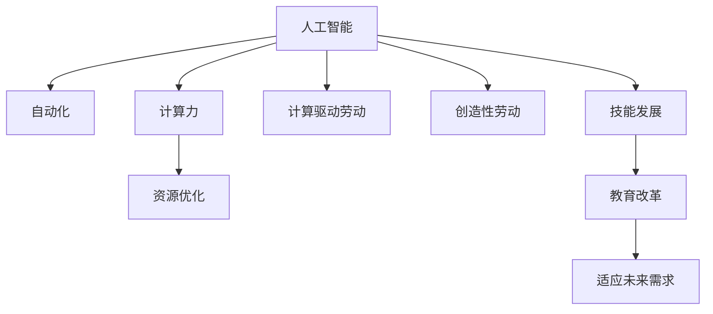

                 

# 人类计算：AI时代的未来就业市场与技能发展预测

> 关键词：人工智能, 计算, 就业市场, 技能发展, 自动化, 创造性劳动, 教育改革

## 1. 背景介绍

### 1.1 问题由来

人工智能（AI）技术的快速发展，正全面渗透到各个行业，从制造业到金融业，从医疗到教育，AI的变革力量正在改变我们的工作和生活。这一转型带来的不仅是技术上的革新，还有对就业市场和技能需求的重塑。在此背景下，理解AI时代就业市场变化、预测未来技能发展趋势变得尤为重要。

### 1.2 问题核心关键点

AI时代，许多传统岗位被自动化取代，一些新岗位出现，并且原有岗位的职责、技能要求发生重大变化。如何预测这些变化，以及如何在未来就业市场中保持竞争力，是摆在每个职业人士面前的重要课题。

## 2. 核心概念与联系

### 2.1 核心概念概述

为更好地理解AI时代就业市场与技能发展的动态变化，本节将介绍几个核心概念：

- **人工智能（AI）**：利用机器学习、深度学习等技术，使计算机能够执行人类智能任务。AI主要包括计算机视觉、自然语言处理、机器学习等领域。
- **自动化**：通过AI技术，自动完成重复性、标准化任务，提高生产效率。
- **计算力**：计算资源是支持AI技术运行的基础设施，包括CPU、GPU、TPU等。
- **计算驱动劳动**：AI时代，许多劳动通过计算完成，计算成为生产力核心。
- **创造性劳动**：人类通过智慧、创造力、情感等非计算元素，执行无法自动化的复杂任务。
- **技能发展**：随着技术进步，职业需求发生变迁，技能也需要更新迭代。
- **教育改革**：AI时代，教育系统需适应新的技术要求，培养适应未来需求的人才。

这些概念之间的联系可以通过以下Mermaid流程图来展示：



这个流程图展示了这个核心概念的关系：

1. AI技术推动自动化和计算力发展。
2. 自动化和计算力提高了生产效率。
3. 计算驱动劳动和创造性劳动共同构成未来工作形态。
4. 技能需求随技术进步而变化。
5. 教育改革促进技能适应未来的需求。

## 3. 核心算法原理 & 具体操作步骤

### 3.1 算法原理概述

AI时代就业市场与技能发展预测，本质上是一个多变量预测问题。该问题可以通过建立数学模型，利用历史数据和相关指标进行分析和预测。核心算法包括时间序列分析、回归分析、因子分析等。

以回归分析为例，假设未来就业市场需求可以用时间序列 $Y_t$ 表示，相关因素包括技术进步 $T_t$、经济环境 $E_t$、教育改革 $E_{edu}(t)$ 等，则模型可表示为：

$$
Y_t = f(T_t, E_t, E_{edu}(t)) + \epsilon_t
$$

其中 $f$ 表示模型函数，$\epsilon_t$ 为误差项。通过历史数据，可以拟合出最优函数 $f$，进行未来预测。

### 3.2 算法步骤详解

基于回归分析的预测模型构建流程如下：

**Step 1: 数据收集与预处理**

- 收集AI时代各行业的历史就业数据，如岗位数量、人员工资、人员流动率等。
- 收集影响就业市场变化的相关因素数据，如技术进步速率、经济环境指标、教育改革政策等。
- 进行数据清洗，处理缺失值和异常值，确保数据质量。

**Step 2: 特征工程**

- 选择相关特征，构建特征集 $X$，如技术进步水平、教育改革深度等。
- 对特征进行标准化和归一化处理，确保数据规模一致。

**Step 3: 模型训练**

- 选择适合的回归模型，如线性回归、岭回归等。
- 利用历史数据 $D=\{(X_i, Y_i)\}_{i=1}^N$ 训练模型，得到参数 $\theta$。
- 评估模型性能，如均方误差（MSE）、均方根误差（RMSE）等指标。

**Step 4: 模型预测**

- 使用训练好的模型 $f_{\theta}$ 对未来就业市场 $Y_t$ 进行预测。
- 结合其他预测模型，如时间序列分析、因子分析等，综合进行预测。

**Step 5: 结果解读与应用**

- 分析预测结果，识别关键因素对未来就业市场的影响。
- 结合行业趋势，制定相关策略，如教育改革、技能培训等。
- 定期更新模型，确保预测结果的准确性和时效性。

### 3.3 算法优缺点

基于回归分析的预测方法有以下优点：

- 模型简单，易于理解和实现。
- 能够利用多种影响因素，全面分析就业市场的变化。
- 可扩展性强，适用于不同行业和地区的预测。

同时，该方法也存在以下局限性：

- 数据质量直接影响预测结果，需要高质量的数据源。
- 历史数据可能无法覆盖所有影响因素，预测结果存在一定误差。
- 模型对异常值和噪声敏感，需要进行数据清洗和特征选择。

### 3.4 算法应用领域

基于回归分析的预测模型，在AI时代的就业市场预测中具有广泛应用，包括但不限于：

- 就业市场规模预测：预测不同行业、地区的就业规模变化。
- 岗位技能需求分析：识别未来岗位的技能需求变化趋势。
- 教育培训规划：制定教育培训策略，提升人力资源素质。
- 产业转型指导：指导企业进行产业结构调整，应对市场变化。
- 政策制定：辅助政府制定劳动就业和教育政策，促进经济健康发展。

## 4. 数学模型和公式 & 详细讲解 & 举例说明

### 4.1 数学模型构建

采用线性回归模型进行就业市场预测，模型形式为：

$$
Y_t = \beta_0 + \beta_1T_t + \beta_2E_t + \beta_3E_{edu}(t) + \epsilon_t
$$

其中，$Y_t$ 表示时间 $t$ 的就业市场规模，$\beta_0$ 为截距，$\beta_1$、$\beta_2$、$\beta_3$ 分别为技术进步、经济环境、教育改革的系数，$\epsilon_t$ 为误差项。

### 4.2 公式推导过程

线性回归模型中的系数可以通过最小二乘法进行估计：

$$
\hat{\beta} = (X^TX)^{-1}X^TY
$$

其中，$\hat{\beta}$ 为参数估计值，$X$ 为特征矩阵，$Y$ 为响应变量向量。

预测未来就业市场规模时，将新时期的特征值代入模型，得到预测值：

$$
\hat{Y}_t = \hat{\beta}_0 + \hat{\beta}_1T_t + \hat{\beta}_2E_t + \hat{\beta}_3E_{edu}(t)
$$

### 4.3 案例分析与讲解

假设我们收集了以下数据：

- 2015年至2025年各行业的就业市场数据。
- 同一时间段的技术进步、经济环境和教育改革数据。

构建线性回归模型，得到系数估计值。然后利用新时期的数据（2026年）进行预测，得到就业市场规模的预测值。通过对比实际数据与预测结果，评估模型的准确性，并进行模型迭代改进。

## 5. 项目实践：代码实例和详细解释说明

### 5.1 开发环境搭建

在进行就业市场预测前，我们需要准备好开发环境。以下是使用Python进行sklearn库的开发环境配置流程：

1. 安装Anaconda：从官网下载并安装Anaconda，用于创建独立的Python环境。

2. 创建并激活虚拟环境：
```bash
conda create -n sklearn-env python=3.8 
conda activate sklearn-env
```

3. 安装sklearn、pandas、numpy等库：
```bash
conda install sklearn pandas numpy
```

完成上述步骤后，即可在`sklearn-env`环境中开始预测实践。

### 5.2 源代码详细实现

以下是使用sklearn库进行就业市场预测的Python代码实现：

```python
import pandas as pd
from sklearn.linear_model import LinearRegression
from sklearn.model_selection import train_test_split

# 读取数据
data = pd.read_csv('employment_data.csv')

# 数据预处理
X = data[['technology_progress', 'economic_environment', 'education_reform']]
Y = data['employment_market']

# 特征选择
X_train, X_test, Y_train, Y_test = train_test_split(X, Y, test_size=0.2, random_state=42)

# 模型训练
model = LinearRegression()
model.fit(X_train, Y_train)

# 模型预测
Y_pred = model.predict(X_test)

# 评估模型
print(model.score(X_test, Y_test))
```

### 5.3 代码解读与分析

让我们再详细解读一下关键代码的实现细节：

**数据预处理**

- `pd.read_csv`：从文件中读取数据。
- `X`、`Y` 分别表示特征矩阵和响应变量向量。
- `train_test_split`：将数据集分为训练集和测试集，分别用于模型训练和评估。

**模型训练**

- `LinearRegression`：实例化线性回归模型。
- `fit`：使用训练数据拟合模型参数。

**模型预测**

- `predict`：利用测试数据进行预测。

**模型评估**

- `score`：计算模型在测试集上的得分，一般使用R^2分数。

以上代码实现了基本的就业市场预测流程。在实际应用中，还需要进行特征选择、模型调优、异常值处理等步骤，以提高预测的准确性和可靠性。

## 6. 实际应用场景

### 6.1 智能制造与工业自动化

AI时代，智能制造和工业自动化技术迅速发展，传统制造业岗位发生重大变化。AI驱动的自动化生产线、智能机器人等技术，大幅提升了生产效率，但同时也导致某些岗位被取代。预测这些变化，及时调整教育培训方向，为产业升级提供人才支持，是应对未来就业市场挑战的关键。

### 6.2 金融科技与金融监管

金融科技的兴起，改变了金融行业的运作模式。AI在风险管理、智能投顾、高频交易等领域广泛应用，大幅提升金融服务的智能化水平。预测金融科技对就业市场的影响，制定相关政策，平衡创新与风险，是金融监管的重要任务。

### 6.3 教育与职业培训

AI技术在教育领域的应用，推动了在线教育、智能辅导系统的兴起。通过预测未来技能需求变化，制定教育培训策略，提升教育资源的适配性，培养符合未来市场要求的人才，是教育改革的必由之路。

### 6.4 医疗健康与生物技术

AI在医疗健康领域的应用，包括智能诊断、个性化治疗、药物研发等，大幅提升了医疗服务的精准性和效率。预测AI技术对医疗就业市场的影响，制定相关政策，提升医疗服务质量，是医疗改革的重要方向。

## 7. 工具和资源推荐

### 7.1 学习资源推荐

为了帮助开发者系统掌握AI时代就业市场与技能发展的理论基础和实践技巧，这里推荐一些优质的学习资源：

1. 《机器学习实战》系列博文：由机器学习专家撰写，深入浅出地介绍了机器学习的基本概念和经典算法。
2. CS229《机器学习》课程：斯坦福大学开设的机器学习明星课程，涵盖机器学习的基本理论、算法与应用。
3. 《Deep Learning with Python》书籍：DeepLearning.ai推出的深度学习课程，介绍了深度学习的基本原理和应用。
4. Coursera、edX等在线学习平台：提供丰富的AI、机器学习、数据科学等课程，覆盖从基础到高级的各个层次。
5. Google AI博文：谷歌AI团队定期发布的AI技术文章，涵盖最新研究进展、最佳实践等。

通过对这些资源的学习实践，相信你一定能够快速掌握AI时代就业市场预测的理论基础和实践技巧，用于解决实际问题。

### 7.2 开发工具推荐

高效的开发离不开优秀的工具支持。以下是几款用于AI时代就业市场预测开发的常用工具：

1. Jupyter Notebook：开源的交互式笔记本，方便开发者进行数据探索、模型调试、结果展示等。
2. Python：灵活易用的编程语言，拥有丰富的机器学习库和工具支持。
3. R：统计分析领域的重要工具，拥有强大的数据处理和分析能力。
4. TensorBoard：TensorFlow配套的可视化工具，可实时监测模型训练状态，提供丰富的图表呈现方式。
5. Weights & Biases：模型训练的实验跟踪工具，可以记录和可视化模型训练过程中的各项指标，方便对比和调优。

合理利用这些工具，可以显著提升AI时代就业市场预测的开发效率，加快创新迭代的步伐。

### 7.3 相关论文推荐

AI时代就业市场预测的不断发展源于学界的持续研究。以下是几篇奠基性的相关论文，推荐阅读：

1. "The Rise of Supervised Learning: A Survey of Techniques and Algorithms"：综述了监督学习的基本理论和应用。
2. "The Impact of AI on Employment: A Quantitative Analysis"：分析了AI对就业市场的影响，并提出未来应对策略。
3. "Automating Jobs: A Review of Current Findings"：回顾了自动化技术对就业市场的影响，并探讨了未来趋势。
4. "The Future of Work: Job Displacement and Change in the Next Four Years"：预测了未来几年就业市场的变化，并提出应对策略。
5. "Economic Impacts of Automation Across Industries: A Comprehensive Analysis"：分析了自动化对不同行业就业市场的影响，并提出了相关政策建议。

这些论文代表了大语言模型微调技术的发展脉络。通过学习这些前沿成果，可以帮助研究者把握学科前进方向，激发更多的创新灵感。

## 8. 总结：未来发展趋势与挑战

### 8.1 总结

本文对AI时代就业市场与技能发展的预测方法进行了全面系统的介绍。首先阐述了AI时代就业市场变化的动因和核心概念，明确了预测在未来就业市场中的重要作用。其次，从原理到实践，详细讲解了预测的数学模型和算法流程，给出了预测任务开发的完整代码实例。同时，本文还广泛探讨了预测在智能制造、金融科技、教育培训、医疗健康等众多领域的应用前景，展示了预测技术的广泛应用。最后，本文精选了预测技术的各类学习资源，力求为读者提供全方位的技术指引。

通过本文的系统梳理，可以看到，AI时代就业市场预测在许多领域都具有重要的应用价值，可以为政策制定、企业决策、教育改革等提供有力的数据支持。相信随着学界和产业界的共同努力，这些预测技术将不断完善和提升，为AI时代的人才培养和产业发展提供更加科学、精准的指导。

### 8.2 未来发展趋势

展望未来，AI时代就业市场预测将呈现以下几个发展趋势：

1. **数据驱动决策**：越来越多的数据源将加入预测模型，提供更加全面和精细的决策依据。
2. **多因素融合**：预测模型将更加注重多因素的融合，考虑技术进步、经济环境、教育改革等多个维度的影响。
3. **实时预测**：通过实时数据分析和模型更新，预测结果将更加及时和准确。
4. **跨领域应用**：预测技术将在更多领域得到应用，为各行各业的决策提供有力支持。
5. **模型解释性**：预测模型将更加注重解释性，提升决策的可解释性和可信任度。

以上趋势凸显了AI时代就业市场预测技术的广阔前景。这些方向的探索发展，必将进一步提升预测模型的精确性和实用性，为AI时代的就业市场变化提供更加科学、全面的预测。

### 8.3 面临的挑战

尽管AI时代就业市场预测技术已经取得了显著进展，但在迈向更加智能化、普适化应用的过程中，仍面临诸多挑战：

1. **数据获取难度**：高质量、全面覆盖的数据获取难度大，部分行业的数据可能不充分。
2. **模型复杂性**：预测模型越来越复杂，需要更多的计算资源和专业知识。
3. **数据隐私保护**：预测过程中涉及大量个人和企业数据，数据隐私保护成为重要课题。
4. **模型解释性**：预测模型需要更高的解释性，确保预测结果的可理解和可解释。
5. **预测精度**：预测精度和可靠性仍是主要挑战，需要不断提高模型的预测能力。
6. **政策影响**：政府政策对就业市场的影响复杂多样，预测结果需要考虑政策因素。

这些挑战需要持续的技术创新和政策支持，才能逐步克服，确保预测模型的准确性和实用性。

### 8.4 研究展望

面对AI时代就业市场预测所面临的种种挑战，未来的研究需要在以下几个方面寻求新的突破：

1. **多模态数据融合**：将文本、图像、音频等多模态数据进行融合，提供更全面的预测依据。
2. **跨领域知识应用**：引入更多跨领域的知识图谱、规则库等，提高预测的准确性和鲁棒性。
3. **动态模型更新**：开发动态模型更新机制，适应快速变化的市场环境。
4. **增强模型解释性**：提高预测模型的解释性，确保决策过程透明和可信。
5. **公平性与公正性**：确保预测模型不带有偏见，避免对特定群体造成不公平影响。

这些研究方向将为AI时代就业市场预测技术的进一步发展提供新的思路，为政策制定、企业决策、教育改革等领域提供更加科学、可靠的数据支持。

## 9. 附录：常见问题与解答

**Q1: 如何评估预测模型的准确性？**

A: 预测模型的准确性评估通常通过以下几个指标：

1. **均方误差（MSE）**：衡量预测值与真实值之间的平均差异。
2. **均方根误差（RMSE）**：MSE的平方根，通常用于衡量预测值的绝对误差。
3. **决定系数（R^2）**：衡量预测值与真实值之间的相关性，取值范围为[0,1]。
4. **平均绝对误差（MAE）**：衡量预测值与真实值之间的平均绝对差异。

**Q2: 预测模型需要考虑哪些关键因素？**

A: 预测模型需要考虑以下关键因素：

1. **技术进步**：技术进步对就业市场的影响，包括自动化、人工智能等。
2. **经济环境**：宏观经济环境对就业市场的影响，包括GDP增长率、失业率等。
3. **教育改革**：教育系统对就业市场的影响，包括教育政策、教育资源等。
4. **社会因素**：社会因素对就业市场的影响，包括人口结构、劳动力市场等。

**Q3: 如何提升预测模型的泛化能力？**

A: 提升预测模型的泛化能力，通常需要以下措施：

1. **数据多样化**：收集多样化的数据，涵盖不同行业、地区、时间等。
2. **特征选择**：选择关键特征，减少噪声和不重要特征的影响。
3. **模型优化**：使用更加复杂的模型，如深度学习模型，提高模型的预测能力。
4. **模型集成**：结合多个模型，进行模型集成，提高预测的稳定性和准确性。
5. **模型调优**：通过超参数调优、模型正则化等手段，提升模型的泛化能力。

**Q4: 预测模型在实际应用中需要注意哪些问题？**

A: 预测模型在实际应用中需要注意以下问题：

1. **数据隐私**：确保数据来源合法，保护用户和企业隐私。
2. **模型鲁棒性**：模型需要具备鲁棒性，避免对异常值和噪声的敏感。
3. **实时更新**：模型需要具备实时更新的能力，适应快速变化的市场环境。
4. **政策影响**：预测结果需要考虑政府政策的影响，确保决策的合规性。

**Q5: 如何构建跨领域的预测模型？**

A: 构建跨领域的预测模型，通常需要以下步骤：

1. **数据集成**：收集跨领域的数据，进行数据整合和清洗。
2. **特征选择**：选择跨领域的关键特征，减少噪声和不重要特征的影响。
3. **模型融合**：结合多种模型，进行模型融合，提高预测的准确性。
4. **领域知识**：引入跨领域的知识图谱、规则库等，提高预测的鲁棒性。
5. **多模态数据**：考虑多模态数据的融合，提供更全面的预测依据。

这些步骤将有助于构建跨领域的预测模型，提高预测的准确性和可靠性。

---

作者：禅与计算机程序设计艺术 / Zen and the Art of Computer Programming

