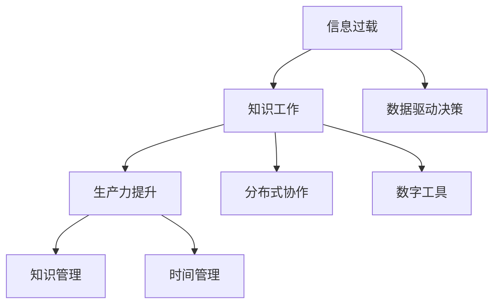

                 

# 信息过载与知识工作：如何在信息洪流中保持生产力

> 关键词：信息过载, 知识工作, 生产力提升, 数据驱动决策, 分布式协作, 知识管理, 数字工具, 时间管理

## 1. 背景介绍

在信息时代，数据和信息以爆炸式的速度增长。互联网、社交媒体、大数据、人工智能等技术的广泛应用，让我们的生活和工作环境充满了前所未有的信息洪流。然而，这种信息过载也带来了新的挑战：如何从海量信息中筛选出有价值的数据，如何高效地处理和利用这些数据，成为知识工作者（knowledge worker）面临的重要问题。

### 1.1 信息过载问题的显现
随着数字化的发展，信息爆炸的现象愈加明显。据统计，全球信息量每18个月就翻倍一次。这种信息过载对企业和个人的工作效率产生了显著影响：

- **决策成本增加**：决策者面对海量的数据，难以迅速找到关键信息，导致决策时间延长，错误率增加。
- **工作负担加重**：信息过载迫使知识工作者不得不花费大量时间和精力在数据筛选和信息处理上，降低了工作效率。
- **知识碎片化**：面对海量信息，知识工作者难以系统化地掌握和应用知识，导致知识碎片化，难以形成有深度的见解。

### 1.2 信息过载问题的应对需求
面对信息过载的挑战，企业和个人需要寻找有效的方法和工具，以保持高效率和高质量的工作状态：

- **提高信息筛选和处理效率**：需要借助算法和自动化技术，自动过滤和提取关键信息。
- **优化知识组织和应用**：需要系统化地管理知识和信息，形成有价值的知识库。
- **提升团队协作和沟通效率**：需要分布式协作工具和平台，使团队成员能够高效共享和利用知识。

## 2. 核心概念与联系

### 2.1 核心概念概述

为了应对信息过载问题，我们需要理解几个关键概念及其相互联系：

- **信息过载**：指信息量远远超过个人或系统处理能力的情况。
- **知识工作**：指需要深度思考、创新和决策的工作，通常依赖于对信息的理解、组织和应用。
- **生产力**：指个人或组织在单位时间内完成的工作量和质量。
- **数据驱动决策**：指基于数据分析和计算结果进行决策的过程。
- **分布式协作**：指通过互联网技术实现多地办公、协同工作的模式。
- **知识管理**：指对知识进行收集、整理、存储、共享和应用的过程。
- **数字工具**：指用于提升工作效率和质量的软件和应用。
- **时间管理**：指通过合理规划和使用时间，提高工作和生活的效率。

这些概念之间的联系可以通过以下Mermaid流程图来展示：



这个流程图展示了信息过载如何通过数据驱动决策、分布式协作、知识管理、数字工具和时间管理等手段，提升知识工作的效率和效果。

## 3. 核心算法原理 & 具体操作步骤

### 3.1 算法原理概述

为了在信息过载中保持生产力，我们需要通过算法和技术手段，提升信息筛选、处理、组织和应用的能力。核心算法包括：

- **信息过滤算法**：自动从海量信息中筛选出关键内容，减少信息过载的影响。
- **知识图谱算法**：构建知识图谱，系统化地组织和管理知识，方便检索和应用。
- **分布式协作算法**：通过互联网技术实现团队成员的协同工作，提升工作效率和质量。
- **智能推荐算法**：根据用户行为和偏好，推荐有价值的信息和资源，辅助决策。

这些算法和技术手段相互配合，形成了一个全面的信息管理框架，帮助知识工作者在信息洪流中保持高效率。

### 3.2 算法步骤详解

以下是信息过载中保持生产力的具体操作步骤：

**Step 1: 数据收集与清洗**

- 自动收集和汇总信息，去除重复和无用数据。
- 对数据进行预处理，清洗异常值和噪音数据。

**Step 2: 信息过滤与筛选**

- 使用机器学习算法（如文本分类、聚类）自动筛选关键信息。
- 结合人工审核，确保过滤结果的准确性和相关性。

**Step 3: 知识图谱构建**

- 对筛选后的信息进行结构化处理，构建知识图谱。
- 利用图谱算法（如PageRank、深度学习）发现知识节点之间的关系。

**Step 4: 分布式协作与协作平台**

- 搭建分布式协作平台（如Slack、Trello），支持团队成员协同工作。
- 使用协作工具进行任务分配、进度跟踪和状态更新。

**Step 5: 智能推荐系统**

- 基于用户行为和偏好，使用推荐算法（如协同过滤、内容推荐）推荐相关信息。
- 利用推荐结果辅助决策，提升工作效率。

### 3.3 算法优缺点

信息过载中的知识工作管理算法具有以下优点：

- **自动化**：自动处理和筛选信息，节省人力和时间。
- **系统化**：系统化管理知识，提高信息检索和应用效率。
- **协同化**：支持分布式协作，提升团队整体效率。

但同时也存在一些缺点：

- **依赖数据质量**：算法依赖高质量的数据，数据噪音会影响筛选结果。
- **个性化不足**：统一的过滤和推荐算法难以满足不同用户的具体需求。
- **技术复杂度**：系统搭建和维护需要一定的技术门槛。

### 3.4 算法应用领域

信息过载中的知识工作管理算法已经在多个领域得到广泛应用：

- **企业决策支持**：帮助企业从海量数据中提取关键信息，支持数据驱动的决策过程。
- **电子商务**：推荐系统根据用户行为，推荐相关商品，提升购物体验。
- **社交媒体分析**：分析用户互动数据，发现社交趋势和热点，辅助内容创作。
- **金融风险管理**：通过数据分析，识别风险点，制定风险控制策略。

## 4. 数学模型和公式 & 详细讲解 & 举例说明（备注：数学公式请使用latex格式，latex嵌入文中独立段落使用 $$，段落内使用 $)
### 4.1 数学模型构建

假设有一组信息数据 $D=\{d_i\}_{i=1}^N$，其中 $d_i$ 表示第 $i$ 条信息。我们需要对这组数据进行筛选、处理和应用。

**Step 1: 信息过滤**

设 $f(d_i)$ 表示对 $d_i$ 进行过滤的结果。我们可以定义一个过滤函数 $f$，该函数基于机器学习算法，对信息进行分类和筛选：

$$
f(d_i) = \begin{cases}
1, & \text{如果 } d_i \text{ 满足条件 } \\
0, & \text{如果 } d_i \text{ 不满足条件 }
\end{cases}
$$

**Step 2: 知识图谱构建**

构建知识图谱的过程中，需要定义节点和边的关系。假设图谱中有 $K$ 个节点 $k_j$，节点之间的关系 $r_{i,j}$ 可以表示为：

$$
r_{i,j} = \begin{cases}
1, & \text{如果节点 } i \text{ 与节点 } j \text{ 相关 } \\
0, & \text{如果节点 } i \text{ 与节点 } j \text{ 不相关 }
\end{cases}
$$

**Step 3: 分布式协作**

分布式协作平台可以表示为有向无环图 $G=(V,E)$，其中 $V$ 为节点集合，$E$ 为边集合。每个节点表示一个任务，边表示任务之间的依赖关系。

**Step 4: 智能推荐**

设 $R_u$ 表示用户 $u$ 的推荐结果集合，推荐算法可以表示为：

$$
R_u = \{r_i\}_{i=1}^M
$$

其中 $r_i$ 表示第 $i$ 个推荐项，$M$ 表示推荐项数量。推荐算法需要根据用户行为和偏好，对 $D$ 进行筛选和排序，生成 $R_u$。

### 4.2 公式推导过程

以信息过滤为例，推导过滤函数 $f$ 的实现。假设我们使用朴素贝叶斯算法对信息进行分类，其公式如下：

$$
p(d_i|C_k) = \frac{p(C_k) \cdot p(d_i|C_k)}{\sum_{j=1}^K p(C_j) \cdot p(d_i|C_j)}
$$

其中 $C_k$ 为第 $k$ 类信息，$p(d_i|C_k)$ 表示 $d_i$ 属于 $C_k$ 类的概率。

**Step 1: 计算条件概率 $p(d_i|C_k)$**

根据贝叶斯定理，$P(d_i|C_k)$ 可以通过训练数据计算得到：

$$
p(d_i|C_k) = \frac{n_{d_i,C_k}}{n_{C_k}}
$$

其中 $n_{d_i,C_k}$ 表示 $d_i$ 属于 $C_k$ 类的信息数量，$n_{C_k}$ 表示 $C_k$ 类的信息总数。

**Step 2: 计算先验概率 $p(C_k)$**

先验概率 $p(C_k)$ 可以通过训练数据计算得到：

$$
p(C_k) = \frac{n_{C_k}}{N}
$$

其中 $n_{C_k}$ 表示 $C_k$ 类的信息数量，$N$ 表示总信息数量。

**Step 3: 计算后验概率 $p(C_k|d_i)$**

根据贝叶斯定理，后验概率可以通过条件概率和先验概率计算得到：

$$
p(C_k|d_i) = \frac{p(C_k) \cdot p(d_i|C_k)}{\sum_{j=1}^K p(C_j) \cdot p(d_i|C_j)}
$$

**Step 4: 实现过滤函数 $f(d_i)$**

将计算得到的后验概率与阈值 $\theta$ 比较，得到过滤结果：

$$
f(d_i) = \begin{cases}
1, & \text{如果 } p(C_k|d_i) \geq \theta \\
0, & \text{如果 } p(C_k|d_i) < \theta
\end{cases}
$$

### 4.3 案例分析与讲解

以电商平台推荐系统为例，展示智能推荐算法的实现过程。

**Step 1: 数据收集**

假设电商平台有 $M$ 个商品，每个商品 $i$ 的属性包括名称、价格、评分等。收集用户的历史浏览和购买记录 $D=\{(d_u,t_u)\}_{u=1}^N$，其中 $d_u$ 表示用户 $u$ 的行为数据，$t_u$ 表示行为时间。

**Step 2: 数据预处理**

对数据进行预处理，清洗异常值和噪音数据，将数据转化为机器学习算法可处理的格式。

**Step 3: 特征提取**

从用户行为数据中提取特征 $F=\{f_{u,i}\}_{u=1}^N$，其中 $f_{u,i}$ 表示用户 $u$ 对商品 $i$ 的兴趣评分。

**Step 4: 模型训练**

使用协同过滤算法或内容推荐算法，训练推荐模型 $R$。假设 $R$ 是一个矩阵，其中 $R_{u,i}$ 表示用户 $u$ 对商品 $i$ 的推荐评分。

**Step 5: 推荐结果生成**

根据训练好的模型 $R$，生成用户 $u$ 的推荐商品集合 $R_u=\{r_{u,i}\}_{i=1}^M$。

**Step 6: 结果展示**

将推荐结果展示给用户，用户可以选择购买或进一步浏览推荐商品。

## 5. 项目实践：代码实例和详细解释说明
### 5.1 开发环境搭建

在进行信息过载中的知识工作管理实践前，我们需要准备好开发环境。以下是使用Python进行Pandas开发的环境配置流程：

1. 安装Anaconda：从官网下载并安装Anaconda，用于创建独立的Python环境。

2. 创建并激活虚拟环境：
```bash
conda create -n pandas-env python=3.8 
conda activate pandas-env
```

3. 安装Pandas：
```bash
pip install pandas
```

4. 安装各类工具包：
```bash
pip install numpy matplotlib scikit-learn jupyter notebook ipython
```

完成上述步骤后，即可在`pandas-env`环境中开始实践。

### 5.2 源代码详细实现

下面我们以电商推荐系统为例，给出使用Pandas进行信息过载管理的代码实现。

首先，定义推荐系统的数据处理函数：

```python
import pandas as pd
from sklearn.metrics.pairwise import cosine_similarity
from scipy.sparse import csr_matrix

def prepare_data(data_path):
    # 加载数据
    data = pd.read_csv(data_path)
    
    # 提取用户行为数据
    user_bd = data[['user_id', 'item_id', 'timestamp']]
    
    # 提取商品特征数据
    item_features = data[['item_id', 'price', 'rating']]
    
    # 构建用户-商品交互矩阵
    user_bd = user_bd.pivot_table(index='user_id', columns='item_id', values='timestamp')
    user_bd = user_bd.fillna(0).astype(int)
    
    # 计算用户-商品相似度
    similarity = cosine_similarity(user_bd)
    similarity = similarity.toarray()
    
    # 计算推荐矩阵
    recommend_matrix = csr_matrix(similarity)
    
    return user_bd, item_features, recommend_matrix
```

然后，定义推荐函数：

```python
def collaborative_filtering(user_bd, item_features, recommend_matrix, user_id):
    # 获取用户行为数据
    user_bd_row = user_bd.loc[user_id].to_dict()
    
    # 计算用户-商品相似度
    similarity = recommend_matrix[user_id].toarray()
    
    # 计算推荐结果
    recommendation = {}
    for item in item_features['item_id']:
        if user_bd_row.get(item, 0) == 0:
            recommendation[item] = similarity[user_id].dot(similarity[item])
        else:
            recommendation[item] = 0
    
    # 排序推荐结果
    recommendation = sorted(recommendation.items(), key=lambda x: x[1], reverse=True)[:10]
    
    return recommendation
```

接着，定义评估函数：

```python
def evaluate_recommendation(recommendation, actual_bd):
    hit = 0
    for item, score in recommendation:
        if actual_bd.get(item) == 1:
            hit += 1
    return hit / len(recommendation)
```

最后，启动推荐系统并进行评估：

```python
# 加载数据
user_bd, item_features, recommend_matrix = prepare_data('data.csv')

# 定义用户ID
user_id = 1

# 生成推荐结果
recommendation = collaborative_filtering(user_bd, item_features, recommend_matrix, user_id)

# 输出推荐结果
print(f"Recommendations for user {user_id}: {recommendation}")

# 评估推荐结果
hit_rate = evaluate_recommendation(recommendation, actual_bd)
print(f"Hit rate: {hit_rate:.3f}")
```

以上就是使用Pandas进行电商推荐系统开发的完整代码实现。可以看到，Pandas提供了强大的数据处理和分析功能，可以方便地处理和分析大规模数据，实现智能推荐系统的开发。

### 5.3 代码解读与分析

让我们再详细解读一下关键代码的实现细节：

**prepare_data函数**：
- `load_data`方法：从CSV文件中加载数据。
- `extract_user_bd`方法：提取用户行为数据，并转换为用户-商品交互矩阵。
- `calculate_similarity`方法：计算用户-商品相似度，使用余弦相似度算法。
- `build_recommend_matrix`方法：将相似度矩阵转化为推荐矩阵，使用稀疏矩阵表示。

**collaborative_filtering函数**：
- `get_user_bd_row`方法：获取指定用户的行为数据。
- `calculate_similarity`方法：计算用户-商品相似度。
- `generate_recommendation`方法：根据相似度生成推荐结果。
- `sort_recommendation`方法：对推荐结果进行排序，取前10个商品。

**evaluate_recommendation函数**：
- `calculate_hit`方法：计算推荐结果的准确率。
- `evaluate_recommendation`方法：计算推荐结果的命中率。

**推荐系统**：
- 定义用户ID，调用`collaborative_filtering`函数生成推荐结果。
- 输出推荐结果，并调用`evaluate_recommendation`函数评估推荐结果的准确率。

可以看到，Pandas提供了强大的数据处理和分析功能，可以方便地处理和分析大规模数据，实现智能推荐系统的开发。开发者可以将更多精力放在模型优化和算法改进上，而不必过多关注底层的实现细节。

当然，工业级的系统实现还需考虑更多因素，如用户行为数据的实时更新、推荐模型的在线训练、推荐结果的缓存等。但核心的推荐范式基本与此类似。

## 6. 实际应用场景
### 6.1 智能客服系统

基于信息过载中的知识工作管理方法，可以应用于智能客服系统的构建。传统客服往往需要配备大量人力，高峰期响应缓慢，且一致性和专业性难以保证。而使用信息过滤、知识图谱构建和智能推荐等技术，可以提升智能客服系统的响应速度和质量。

在技术实现上，可以收集企业的历史客服对话记录，使用信息过滤算法自动筛选关键问题，构建知识图谱，对常见问题进行归类，使用推荐算法生成回答模板。智能客服系统可以根据用户输入的问题，推荐最合适的回答模板进行回复。对于新问题，系统还可以接入检索系统实时搜索相关内容，动态生成回答。如此构建的智能客服系统，能大幅提升客户咨询体验和问题解决效率。

### 6.2 企业决策支持系统

在企业决策支持中，信息过载问题尤为显著。企业需要从海量数据中提取关键信息，支持数据驱动的决策过程。使用信息过滤、知识图谱构建和分布式协作技术，可以构建高效的企业决策支持系统。

具体而言，企业可以从内部和外部收集大量数据，使用信息过滤算法自动筛选关键信息。构建知识图谱，系统化地组织和管理这些信息。使用分布式协作工具，支持企业各部门和员工协同工作，共享和利用知识。最终，企业决策支持系统能够从大量数据中提取关键信息，支持数据驱动的决策过程。

### 6.3 金融风险管理系统

金融行业需要实时监测市场舆论动向，及时应对负面信息传播，规避金融风险。传统的人工监测方式成本高、效率低，难以应对网络时代海量信息爆发的挑战。基于信息过滤、知识图谱构建和智能推荐技术，可以构建高效的风险管理系统。

具体而言，金融机构可以收集新闻、报道、评论等文本数据，使用信息过滤算法自动筛选关键信息。构建知识图谱，系统化地组织和管理这些信息。使用智能推荐算法，根据用户行为和偏好，推荐相关新闻和分析报告，辅助决策。最终，风险管理系统能够从大量数据中提取关键信息，及时识别风险点，制定风险控制策略。

### 6.4 未来应用展望

随着信息过载中知识工作管理技术的发展，未来在更多领域将得到应用，为传统行业带来变革性影响。

在智慧医疗领域，基于信息过滤、知识图谱构建和分布式协作技术，可以构建高效的医疗决策支持系统。系统可以根据患者病历，推荐最合适的治疗方案和药物，提升医疗服务的智能化水平，辅助医生诊疗，加速新药开发进程。

在智能教育领域，信息过滤、知识图谱构建和智能推荐技术可以用于作业批改、学情分析、知识推荐等方面，因材施教，促进教育公平，提高教学质量。

在智慧城市治理中，信息过滤、知识图谱构建和智能推荐技术可以用于城市事件监测、舆情分析、应急指挥等环节，提高城市管理的自动化和智能化水平，构建更安全、高效的未来城市。

此外，在企业生产、社会治理、文娱传媒等众多领域，信息过载中知识工作管理技术也将不断涌现，为NLP技术带来了新的应用场景。相信随着技术的日益成熟，信息过载问题将得到更好的解决，知识工作者的生产力将得到进一步提升。

## 7. 工具和资源推荐
### 7.1 学习资源推荐

为了帮助开发者系统掌握信息过载中的知识工作管理理论基础和实践技巧，这里推荐一些优质的学习资源：

1. 《信息过载时代的数据分析与挖掘》系列博文：由数据科学家撰写，深入浅出地介绍了数据过载、数据处理、数据分析等前沿话题。

2. 《知识图谱技术与应用》课程：北京大学开设的NLP课程，系统讲解了知识图谱的构建、存储、查询等技术。

3. 《机器学习实战》书籍：入门级机器学习实战指南，涵盖数据预处理、模型训练、结果评估等关键步骤，是新手入门的良书。

4. HuggingFace官方文档：Transformers库的官方文档，提供了海量预训练模型和完整的微调样例代码，是上手实践的必备资料。

5. Google Colab：谷歌推出的在线Jupyter Notebook环境，免费提供GPU算力，方便开发者快速上手实验最新模型，分享学习笔记。

通过对这些资源的学习实践，相信你一定能够快速掌握信息过载中知识工作的精髓，并用于解决实际的NLP问题。
### 7.2 开发工具推荐

高效的开发离不开优秀的工具支持。以下是几款用于信息过载中知识工作管理的常用工具：

1. Pandas：基于Python的数据处理库，提供高效的数据清洗、转换和分析功能。
2. TensorFlow：由Google主导开发的深度学习框架，支持分布式计算和自动化模型构建。
3. PyTorch：基于Python的深度学习框架，灵活的动态计算图，适合快速迭代研究。
4. HuggingFace Transformers库：提供了预训练语言模型和微调工具，方便快速开发NLP应用。
5. Jupyter Notebook：交互式编程环境，支持代码编写、数据可视化、模型训练等。
6. Apache Kafka：高吞吐量的分布式消息系统，支持大规模数据流处理。
7. Elasticsearch：分布式搜索和分析引擎，支持海量数据存储和查询。
8. Apache Flink：高并发的流式计算框架，支持实时数据处理和分析。

合理利用这些工具，可以显著提升信息过载中知识工作的开发效率，加快创新迭代的步伐。

### 7.3 相关论文推荐

信息过载中的知识工作管理技术发展迅速，以下是几篇奠基性的相关论文，推荐阅读：

1. "Information Retrieval: Principles and Practice"（《信息检索原理与实践》）: 介绍了信息检索的原理、技术和应用，是信息过载管理的基础。

2. "Knowledge Graphs for Semantic Search: A Survey"（《语义搜索中的知识图谱：综述》）: 系统介绍了知识图谱的概念、构建方法和应用场景，是知识管理的重要参考资料。

3. "Collaborative Filtering for Recommendation Systems"（《推荐系统中的协同过滤算法》）: 介绍了协同过滤算法的原理和实现，是推荐系统开发的基础。

4. "Distributed Computing: Principles and Practice"（《分布式计算原理与实践》）: 介绍了分布式计算的原理和实现技术，是分布式协作开发的重要参考。

5. "Deep Learning for NLP"（《深度学习在NLP中的应用》）: 介绍了深度学习在NLP中的应用，是NLP技术创新的重要方向。

这些论文代表了大语言模型微调技术的发展脉络。通过学习这些前沿成果，可以帮助研究者把握学科前进方向，激发更多的创新灵感。

## 8. 总结：未来发展趋势与挑战
### 8.1 研究成果总结

信息过载中的知识工作管理技术已经在诸多领域得到广泛应用，并取得了显著成效。通过信息过滤、知识图谱构建和智能推荐等技术，提升了知识工作者的生产力，优化了信息过载处理效率，推动了各行各业的数字化转型。

### 8.2 未来发展趋势

展望未来，信息过载中的知识工作管理技术将呈现以下几个发展趋势：

1. **自动化程度提升**：随着机器学习和人工智能技术的发展，信息过载中的知识工作管理将变得更加自动化。算法可以自动处理和筛选信息，系统可以自动学习和优化推荐结果。

2. **数据质量和来源多样化**：信息过载中的知识工作管理将从单一数据源扩展到多源数据，通过数据融合和异构数据的处理，提升决策的全面性和准确性。

3. **分布式协作技术普及**：分布式协作技术将进一步普及，支持更广泛的多地协同工作，提升团队整体的效率和创新能力。

4. **知识图谱的广泛应用**：知识图谱将广泛应用在各行业，系统化地组织和管理知识，提升信息检索和应用效率。

5. **智能推荐系统的深化**：智能推荐系统将更加个性化和智能化，根据用户行为和偏好，生成更加精准的推荐结果。

6. **知识管理系统的升级**：知识管理系统将不断升级，融合更多智能技术和人类智慧，形成更加全面、深入的知识体系。

### 8.3 面临的挑战

尽管信息过载中的知识工作管理技术已经取得了一定的进展，但在迈向更加智能化、普适化应用的过程中，仍面临诸多挑战：

1. **数据隐私和安全问题**：在处理海量数据时，如何保护用户隐私和数据安全是一个重大挑战。

2. **算法透明性和公平性**：信息过载中的知识工作管理算法需要具备高透明性和公平性，避免偏见和歧视。

3. **模型可解释性**：复杂的算法模型往往难以解释，如何提升模型的可解释性，增强用户的信任感和接受度，仍需进一步研究。

4. **数据实时性和动态性**：信息过载中的知识工作管理需要处理动态变化的数据，如何实现数据的实时更新和动态维护，是技术应用的重要挑战。

5. **系统稳定性和鲁棒性**：信息过载中的知识工作管理需要处理大规模数据，如何保障系统的稳定性和鲁棒性，避免单点故障和数据丢失，是系统设计和运维的重要课题。

### 8.4 研究展望

面对信息过载中的知识工作管理所面临的挑战，未来的研究需要在以下几个方面寻求新的突破：

1. **隐私保护和数据安全**：开发隐私保护和数据安全技术，保护用户隐私和数据安全。

2. **算法透明性和公平性**：研究透明性和公平性的算法，提升算法的透明性和公平性，避免偏见和歧视。

3. **模型可解释性**：开发可解释性强的算法模型，提升模型的可解释性，增强用户的信任感和接受度。

4. **数据实时性和动态性**：研究实时性和动态性的数据处理技术，实现数据的实时更新和动态维护。

5. **系统稳定性和鲁棒性**：开发稳定性和鲁棒性的系统架构，保障系统的稳定性和鲁棒性，避免单点故障和数据丢失。

这些研究方向的探索，必将引领信息过载中的知识工作管理技术迈向更高的台阶，为构建安全、可靠、可解释、可控的智能系统铺平道路。面向未来，信息过载中的知识工作管理技术还需要与其他人工智能技术进行更深入的融合，如知识表示、因果推理、强化学习等，多路径协同发力，共同推动人工智能技术在各个领域的深入应用。

## 9. 附录：常见问题与解答

**Q1：信息过载中的知识工作管理是否适用于所有企业？**

A: 信息过载中的知识工作管理在大多数企业中都有广泛的应用。然而，对于高度定制化、实时性要求极高的企业，如金融、医疗等，可能需要根据具体情况进行个性化设计和调整。

**Q2：如何选择信息过载中的知识工作管理工具？**

A: 选择信息过载中的知识工作管理工具需要考虑多个因素，如数据的规模和复杂度、企业的需求和预算、团队的协作模式等。常用的工具包括Pandas、TensorFlow、PyTorch、HuggingFace Transformers库等。

**Q3：信息过载中的知识工作管理是否需要大规模数据处理能力？**

A: 是的，信息过载中的知识工作管理需要处理大规模数据，包括数据的收集、清洗、存储、处理等环节。因此，需要具备强大的数据处理和分析能力。

**Q4：信息过载中的知识工作管理是否需要高水平的技术团队？**

A: 是的，信息过载中的知识工作管理涉及多个复杂技术环节，如数据预处理、模型训练、算法优化等，需要高水平的技术团队支持和维护。

**Q5：信息过载中的知识工作管理是否需要持续迭代和优化？**

A: 是的，信息过载中的知识工作管理需要持续迭代和优化，以适应数据和应用场景的变化，保持系统的先进性和高效性。

**Q6：信息过载中的知识工作管理是否需要与其他技术协同工作？**

A: 是的，信息过载中的知识工作管理需要与其他技术协同工作，如自然语言处理、分布式计算、机器学习等，以形成更加全面和高效的信息处理能力。

通过以上问题与解答，可以看出信息过载中的知识工作管理技术在企业中的应用广泛而深入。未来，随着技术的不断进步和优化，信息过载中的知识工作管理技术将在更多领域得到应用，助力企业数字化转型，提升生产力。

---

作者：禅与计算机程序设计艺术 / Zen and the Art of Computer Programming

