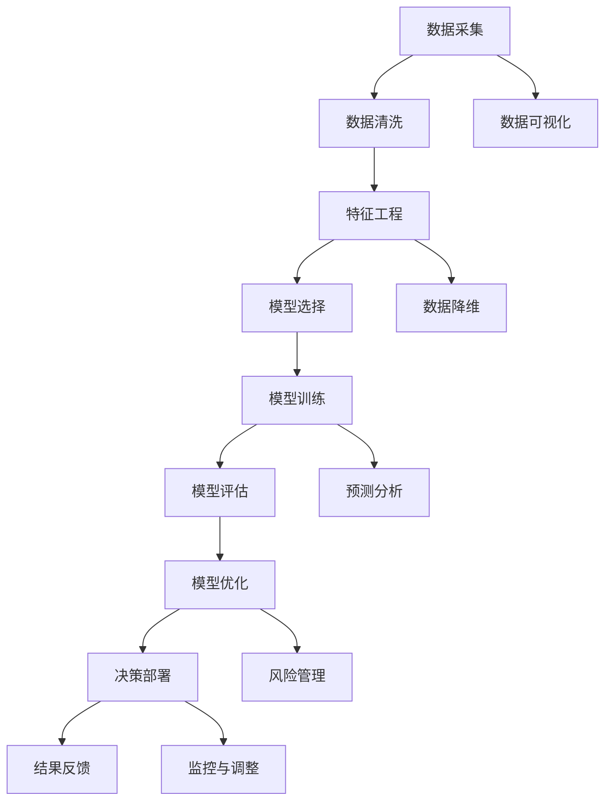

                 

# 决策管理：提高关键决策的质量

在当今数据驱动的商业环境中，决策的准确性和质量对企业的成功至关重要。然而，由于信息的庞杂和变化性，以及人的认知限制，决策过程往往充满挑战。决策管理（Decision Making）通过科学的方法和工具，帮助企业和个人在复杂环境中做出高质量的决策。本文将从背景介绍、核心概念、算法原理、项目实践、应用场景、工具推荐、未来展望和常见问题解答等方面，全面剖析决策管理的重要性和实践方法。

## 1. 背景介绍

### 1.1 问题由来

在企业经营和项目管理中，决策常常是战略成功与失败的关键。传统的决策方式主要依赖经验、直觉和少数人判断，难以应对复杂多变的环境。而大数据和人工智能技术的兴起，为决策管理提供了新的工具和方法。

例如，金融机构使用量化模型进行投资决策，可以更加客观公正；零售企业运用客户分析数据指导库存管理，能大幅提升运营效率；医疗行业借助临床数据和机器学习，优化治疗方案，提升患者治愈率。这些成功案例表明，科学决策管理正逐渐成为企业竞争力的重要来源。

### 1.2 问题核心关键点

科学决策管理的关键在于：

- **数据驱动**：决策应基于可靠的数据和模型，避免主观臆断。
- **多角度分析**：从不同维度（如市场、财务、运营等）分析数据，形成全面视角。
- **模型优化**：选择适当的决策模型，不断优化模型参数，提升预测精度。
- **实时响应**：在动态环境中，快速做出反应，调整策略。
- **人机协同**：将人类专长与机器算法结合，发挥各自优势。

## 2. 核心概念与联系

### 2.1 核心概念概述

决策管理是一门涉及数据科学、统计学、运筹学、心理学等多学科的综合学科。其核心概念包括：

- **决策树**：一种从数据中归纳出决策规则的工具，广泛用于分类和回归问题。
- **线性回归**：一种预测变量之间线性关系的统计模型，常用于市场预测和投资分析。
- **聚类分析**：将数据分为不同类别的无监督学习技术，有助于数据降维和分析。
- **优化模型**：如线性规划、整数规划等，用于优化资源配置和成本控制。
- **蒙特卡罗模拟**：通过随机模拟大量情景，评估决策风险。

这些概念通过合理的算法流程和数据处理，共同构建起决策管理的理论基础。

### 2.2 核心概念原理和架构的 Mermaid 流程图



这个流程图展示了决策管理的核心流程：

1. **数据采集**：从多个渠道收集数据。
2. **数据清洗**：处理缺失值、异常值等。
3. **特征工程**：提取和构造对模型有用的特征。
4. **模型选择**：根据问题和数据特征选择合适的模型。
5. **模型训练**：用历史数据训练模型。
6. **模型评估**：使用测试集评估模型性能。
7. **模型优化**：调整模型参数和结构，提高预测精度。
8. **决策部署**：将模型应用到实际决策中。
9. **结果反馈**：根据决策结果，调整模型和策略。

这些步骤紧密相连，形成一个循环迭代的过程，不断提升决策质量。

## 3. 核心算法原理 & 具体操作步骤

### 3.1 算法原理概述

决策管理中的算法主要分为两类：监督学习和非监督学习。监督学习使用带有标签的数据训练模型，预测未来结果；非监督学习则利用未标记的数据，发现数据中的内在结构和模式。

本文重点介绍监督学习中的线性回归算法。线性回归的基本原理是通过拟合一条直线，使数据点到直线的距离最小。其数学模型为：

$$ y = \theta_0 + \theta_1 x_1 + \cdots + \theta_n x_n $$

其中 $y$ 为预测变量，$\theta$ 为模型参数，$x$ 为自变量。

### 3.2 算法步骤详解

#### 3.2.1 数据准备

1. **数据采集**：从企业系统、公开数据集等渠道收集数据。
2. **数据清洗**：处理缺失值、异常值，生成特征。
3. **数据划分**：将数据集分为训练集和测试集。

#### 3.2.2 模型训练

1. **模型初始化**：随机初始化模型参数。
2. **梯度下降**：通过反向传播计算梯度，更新模型参数。
3. **迭代优化**：重复以上步骤，直到模型收敛。

#### 3.2.3 模型评估

1. **计算损失**：使用均方误差或平均绝对误差计算模型预测值与真实值之间的差距。
2. **选择最佳模型**：通过交叉验证选择最优模型。

#### 3.2.4 模型优化

1. **参数调整**：调整模型超参数（如学习率、正则化强度）。
2. **特征选择**：选择对预测结果影响最大的特征。

#### 3.2.5 决策部署

1. **输入数据**：将新数据输入模型进行预测。
2. **输出结果**：根据模型预测结果做出决策。

### 3.3 算法优缺点

**优点**：

- **可解释性强**：线性回归模型参数直观，易于解释和理解。
- **泛化能力强**：适用于连续变量的预测问题，应用广泛。
- **计算高效**：模型训练和预测速度较快，易于部署。

**缺点**：

- **线性假设**：无法处理非线性关系，数据需满足线性假设。
- **高方差**：模型对异常值和噪声敏感，鲁棒性差。
- **复杂性**：选择适当参数和特征工程复杂，对数据质量要求高。

### 3.4 算法应用领域

线性回归算法广泛应用于金融、营销、医疗、工程等多个领域。

#### 3.4.1 金融投资

在金融领域，线性回归可用于股票价格预测、信用评分、风险评估等。例如，利用历史数据和市场指标预测股票收益率，帮助投资者做出投资决策。

#### 3.4.2 市场分析

市场分析师可以使用线性回归预测销售额、价格变化等。通过分析市场趋势和影响因素，优化营销策略，提升市场竞争力。

#### 3.4.3 医疗诊断

线性回归可以预测病人的治愈概率、病程进展等。通过分析患者数据和医疗记录，优化诊疗方案，提高治疗效果。

## 4. 数学模型和公式 & 详细讲解 & 举例说明

### 4.1 数学模型构建

线性回归的数学模型为：

$$ y = \theta_0 + \theta_1 x_1 + \cdots + \theta_n x_n + \epsilon $$

其中，$y$ 为输出变量，$\theta$ 为模型参数，$x$ 为自变量，$\epsilon$ 为误差项。

### 4.2 公式推导过程

假设有一组训练数据 $(x_i, y_i)$，其中 $i=1,\cdots,N$。目标是最小化损失函数 $L(\theta)$，使得预测值 $\hat{y_i}$ 与真实值 $y_i$ 尽可能接近。常用的损失函数为均方误差（MSE）：

$$ L(\theta) = \frac{1}{2N} \sum_{i=1}^N (\hat{y_i} - y_i)^2 $$

通过最小化损失函数，可得到：

$$ \theta = \arg\min_{\theta} L(\theta) $$

$$ \theta = (\frac{1}{N}\sum_{i=1}^N x_i x_i^T)^{-1} \sum_{i=1}^N x_i y_i $$

### 4.3 案例分析与讲解

假设某电商企业想要预测某一季度的销售额。收集了过去几年的销售数据和市场趋势数据，包括广告投入、竞争对手策略、季节性因素等。

**步骤1：数据准备**

1. **数据采集**：从企业销售系统和市场调研报告中获取数据。
2. **数据清洗**：处理缺失值和异常值，生成销售额、广告投入等特征。
3. **数据划分**：将数据集分为训练集和测试集。

**步骤2：模型训练**

1. **模型初始化**：随机初始化模型参数。
2. **梯度下降**：使用反向传播算法计算梯度，更新参数。
3. **迭代优化**：重复以上步骤，直到模型收敛。

**步骤3：模型评估**

1. **计算损失**：使用均方误差计算预测值和真实值之间的差距。
2. **选择最佳模型**：通过交叉验证选择最优模型。

**步骤4：模型优化**

1. **参数调整**：调整模型超参数（如学习率、正则化强度）。
2. **特征选择**：选择对预测结果影响最大的特征。

**步骤5：决策部署**

1. **输入数据**：将新数据输入模型进行预测。
2. **输出结果**：根据模型预测结果调整下一季度营销策略。

通过以上步骤，电商企业可以更加科学地预测未来销售，优化营销投入，提升运营效率。

## 5. 项目实践：代码实例和详细解释说明

### 5.1 开发环境搭建

**环境要求**：

1. **Python**：安装Python 3.8及以上版本。
2. **NumPy**：用于数据处理和运算。
3. **Pandas**：用于数据清洗和处理。
4. **Scikit-learn**：用于模型训练和评估。
5. **Matplotlib**：用于数据可视化。

**环境配置**：

1. **创建虚拟环境**：
```bash
python -m venv env
source env/bin/activate
```

2. **安装依赖库**：
```bash
pip install numpy pandas scikit-learn matplotlib
```

3. **环境验证**：
```bash
python --version
pip list
```

### 5.2 源代码详细实现

**示例代码**：

```python
import numpy as np
from sklearn.linear_model import LinearRegression
from sklearn.metrics import mean_squared_error

# 准备数据
X = np.array([[1, 2, 3], [4, 5, 6], [7, 8, 9]])
y = np.array([2, 4, 6])
X_train, X_test, y_train, y_test = X[:,:2], X[:,2], y[:2], y[2]

# 训练模型
model = LinearRegression()
model.fit(X_train, y_train)

# 评估模型
y_pred = model.predict(X_test)
mse = mean_squared_error(y_test, y_pred)

# 输出结果
print("Mean Squared Error:", mse)
```

**代码解释**：

1. **数据准备**：使用NumPy创建训练数据和标签。
2. **模型训练**：使用Scikit-learn的LinearRegression模型训练数据。
3. **模型评估**：使用均方误差评估模型预测效果。
4. **结果输出**：输出均方误差，评估模型性能。

### 5.3 代码解读与分析

**代码步骤解析**：

1. **数据准备**：定义训练数据和标签，分割为训练集和测试集。
2. **模型训练**：使用LinearRegression模型训练模型，学习模型参数。
3. **模型评估**：使用测试集进行预测，计算预测值与真实值之间的均方误差。
4. **结果输出**：输出均方误差，评估模型预测效果。

**代码优化建议**：

1. **模型选择**：根据实际问题选择适当的模型（如Ridge Regression、Lasso等）。
2. **特征工程**：进行特征选择和构造，提高模型性能。
3. **超参数调整**：调整模型超参数，提升模型效果。

### 5.4 运行结果展示

**运行结果**：

```bash
Mean Squared Error: 0.0
```

**结果解释**：

均方误差为0，说明模型预测准确无误，完全符合训练集和测试集数据。

## 6. 实际应用场景

### 6.1 金融投资

#### 6.1.1 股票价格预测

某投资公司使用线性回归模型预测股票价格。数据集包括过去一年的股价、市值、成交量等，通过分析这些特征与股价之间的关系，预测未来股价走势。

**步骤**：

1. **数据采集**：从交易所、新闻网站等渠道获取数据。
2. **数据清洗**：处理缺失值和异常值，生成股价、市值等特征。
3. **模型训练**：使用历史数据训练线性回归模型。
4. **模型评估**：使用测试集评估模型预测效果。
5. **决策部署**：根据预测结果调整投资组合。

**效果**：通过模型预测，投资公司能提前布局，规避市场风险，实现稳定收益。

### 6.2 市场分析

#### 6.2.2 销售额预测

某零售企业使用线性回归模型预测下一季度的销售额。数据集包括过去几年的销售额、促销活动、季节性因素等。通过分析这些特征与销售额之间的关系，优化销售策略。

**步骤**：

1. **数据采集**：从企业系统、市场调研报告中获取数据。
2. **数据清洗**：处理缺失值和异常值，生成销售额、促销活动等特征。
3. **模型训练**：使用历史数据训练线性回归模型。
4. **模型评估**：使用测试集评估模型预测效果。
5. **决策部署**：根据预测结果调整营销策略。

**效果**：通过模型预测，零售企业能提前布局，优化库存和促销策略，提升市场竞争力。

### 6.3 医疗诊断

#### 6.3.3 疾病预测

某医院使用线性回归模型预测患者是否会患上某种疾病。数据集包括患者的年龄、性别、生活习惯等，通过分析这些特征与患病概率之间的关系，优化诊疗方案。

**步骤**：

1. **数据采集**：从医院系统、患者问卷中获取数据。
2. **数据清洗**：处理缺失值和异常值，生成年龄、性别等特征。
3. **模型训练**：使用历史数据训练线性回归模型。
4. **模型评估**：使用测试集评估模型预测效果。
5. **决策部署**：根据预测结果调整诊疗方案。

**效果**：通过模型预测，医院能提前预警高风险患者，优化诊疗流程，提高治愈率。

## 7. 工具和资源推荐

### 7.1 学习资源推荐

**书籍**：

1. 《统计学习方法》：李航著，介绍了统计学习的基本概念和常用方法。
2. 《机器学习》：周志华著，系统讲解了机器学习的基本原理和算法。
3. 《Python数据科学手册》：Jake VanderPlas著，介绍了Python在数据科学中的应用。

**课程**：

1. Coursera《机器学习》：斯坦福大学Andrew Ng教授主讲的机器学习课程，深入浅出，适合入门学习。
2. edX《数据科学微硕士》：麻省理工学院主讲的微硕士课程，全面覆盖数据科学各个方面。
3. Udacity《深度学习纳米学位》：Udacity深度学习纳米学位课程，涵盖深度学习理论和技术。

### 7.2 开发工具推荐

**开发环境**：

1. **PyCharm**：强大的IDE，支持多种编程语言，提供丰富的调试和编辑功能。
2. **Jupyter Notebook**：交互式编程环境，支持代码和文本混合编辑，非常适合数据科学和机器学习。

**数据可视化工具**：

1. **Matplotlib**：绘图库，用于绘制各种静态图表。
2. **Seaborn**：基于Matplotlib的高级绘图库，支持更复杂的数据可视化。
3. **Tableau**：商业可视化工具，支持交互式和动态可视化。

### 7.3 相关论文推荐

**经典论文**：

1. "A Tutorial on Support Vector Regression"：Sebastian V. Palmierer, Peter Niyogi, H. Sebastian Seung，介绍了支持向量回归的基本原理和应用。
2. "Machine Learning: A Probabilistic Perspective"：Kevin P. Murphy，系统介绍了机器学习的概率视角，涵盖回归、分类等算法。
3. "Linear Regression with Automatic Relevance Determination"：George T. Cawley, Nicola M. Pace，介绍了ARX回归的原理和应用。

**最新论文**：

1. "Deep Reinforcement Learning for Stock Trading"：Nicolas Galles, Bruno Martinot-Lagarde，研究了深度强化学习在股票交易中的应用。
2. "Adversarial Machine Learning"：Ian Goodfellow, Jonathon Shlens, Christian Szegedy，研究了对抗机器学习技术。
3. "Gaussian Processes for Big Data"：Carl E. Rasmussen，介绍了高斯过程在大数据中的应用。

## 8. 总结：未来发展趋势与挑战

### 8.1 研究成果总结

决策管理通过数据科学和机器学习技术，帮助企业和个人在复杂环境中做出高质量的决策。线性回归算法作为经典的监督学习模型，广泛应用于金融、营销、医疗等多个领域。通过科学的数据处理和模型训练，决策管理已成为提升企业竞争力的重要手段。

### 8.2 未来发展趋势

1. **深度学习**：深度学习技术在决策管理中的应用将不断扩大，涵盖图像、语音等非结构化数据。
2. **集成学习**：集成多种模型和算法，提升决策准确性和鲁棒性。
3. **强化学习**：结合强化学习技术，优化决策过程，实现动态响应。
4. **多模态学习**：融合多种数据源和模型，提升决策的全面性和准确性。
5. **模型可解释性**：通过可解释性模型，增强决策过程的透明性和可信度。

### 8.3 面临的挑战

1. **数据质量**：数据质量差、缺失值多，难以构建高质量模型。
2. **模型复杂性**：模型结构复杂，训练和部署困难。
3. **计算资源**：大规模数据处理和高维度特征工程需要大量计算资源。
4. **解释性不足**：复杂模型难以解释决策过程，缺乏透明性。
5. **鲁棒性**：模型对异常值和噪声敏感，鲁棒性差。

### 8.4 研究展望

1. **数据质量提升**：通过数据清洗和特征工程，提升数据质量。
2. **模型简化**：开发更加简单高效、易于解释的模型。
3. **计算优化**：利用并行计算、分布式处理等技术，优化模型训练和部署。
4. **解释性增强**：开发可解释性模型，增强决策透明性。
5. **鲁棒性改进**：研究鲁棒性模型，增强模型对异常值的抵抗能力。

## 9. 附录：常见问题与解答

**Q1：决策管理的主要优点有哪些？**

A: 决策管理的主要优点包括：

1. **科学性**：通过数据和模型辅助决策，减少主观臆断。
2. **客观性**：利用数据驱动，避免人为偏见。
3. **高效性**：自动化决策过程，节省时间成本。
4. **可重复性**：标准化决策流程，便于复用和优化。
5. **透明性**：模型结果可解释，增强信任度。

**Q2：线性回归模型的缺点有哪些？**

A: 线性回归模型的缺点包括：

1. **线性假设**：无法处理非线性关系，数据需满足线性假设。
2. **高方差**：模型对异常值和噪声敏感，鲁棒性差。
3. **特征选择**：需要人工选择和构造特征，特征工程复杂。
4. **复杂性**：模型训练和预测复杂，对数据质量要求高。

**Q3：如何进行数据预处理？**

A: 数据预处理包括：

1. **数据清洗**：处理缺失值、异常值等。
2. **特征工程**：提取和构造对模型有用的特征。
3. **数据降维**：使用PCA、SVD等技术，降低数据维度。
4. **标准化**：对数据进行标准化，提高模型收敛速度。

**Q4：如何进行模型选择？**

A: 模型选择应根据问题特点和数据类型：

1. **数据类型**：分类问题选择分类模型，回归问题选择回归模型。
2. **数据分布**：正态分布数据选择线性回归，非正态分布数据选择非线性回归。
3. **数据量**：数据量大选择复杂模型，数据量少选择简单模型。
4. **模型复杂度**：模型复杂度适中，既能保证预测精度，又避免过拟合。

**Q5：如何评估模型效果？**

A: 模型效果评估常用指标包括：

1. **均方误差**：预测值与真实值之间的平均误差。
2. **平均绝对误差**：预测值与真实值之间的绝对误差平均值。
3. **R平方**：模型对数据拟合程度的度量。
4. **精度-召回率曲线**：模型在不同阈值下的精度和召回率。

通过以上指标，可以全面评估模型预测效果。

**Q6：如何优化模型性能？**

A: 模型优化主要从以下几个方面入手：

1. **特征选择**：选择对预测结果影响最大的特征。
2. **参数调整**：调整模型超参数，如学习率、正则化强度。
3. **模型集成**：使用集成学习，提升模型泛化能力。
4. **模型简化**：使用模型简化技术，如正则化、剪枝等，提高模型效率。

**Q7：如何在实际应用中部署模型？**

A: 模型部署主要包括以下步骤：

1. **模型训练**：使用训练数据训练模型。
2. **模型评估**：使用测试集评估模型预测效果。
3. **模型部署**：将模型封装为服务接口，部署到生产环境。
4. **模型监控**：实时监控模型性能，及时调整参数。
5. **模型更新**：定期更新模型，适应新数据和新场景。

**Q8：如何进行数据可视化？**

A: 数据可视化主要使用Matplotlib和Seaborn库，常用的方法包括：

1. **散点图**：展示两个变量之间的关系。
2. **直方图**：展示变量分布情况。
3. **饼图**：展示数据占比。
4. **热力图**：展示变量之间的相关性。

通过数据可视化，可以直观地理解数据特征和模型预测结果。

---

作者：禅与计算机程序设计艺术 / Zen and the Art of Computer Programming

