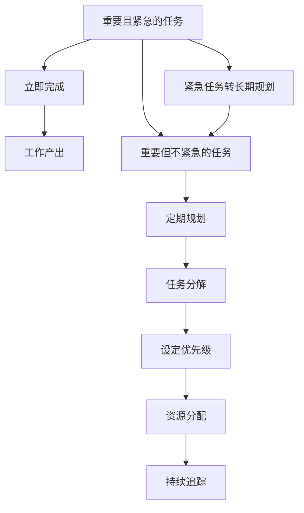

                 

# 双目标清单法助你专注最重要的工作

在繁忙的工作和生活中，我们常常感到时间不够用，事务繁杂，难以抓住核心问题。如何在有限的时间里，高效地处理最重要的事情，成为每个职场人士面临的挑战。双目标清单法（Two-Goal List）提供了一种系统化的解决方案，让你能够将注意力集中在最重要的工作上，最大化产出和满足感。

## 1. 背景介绍

### 1.1 问题由来
随着信息爆炸和工作复杂度的增加，有效管理时间和任务变得愈发困难。传统的待办事项清单（To-Do List）往往列出所有待完成的任务，但未明确区分任务的优先级，容易陷入"忙忙碌碌"的陷阱。如何在众多任务中找到最重要的事情，是提高工作效率和成效的关键。

### 1.2 问题核心关键点
双目标清单法基于两个核心目标，将任务划分为两种类型：**重要且紧急的任务**和**重要但不紧急的任务**。这种分类方式能够帮助我们快速识别并优先处理最关键的问题，从而提升工作质量和效率。

## 2. 核心概念与联系

### 2.1 核心概念概述

双目标清单法通过将任务分为两个关键类别，帮助工作者明确优先级，专注于最重要的事情。两个类别包括：

- **重要且紧急的任务**：需要立即完成，对当前或未来有重大影响的任务，如截止日期紧迫的项目、突发事件处理等。
- **重要但不紧急的任务**：虽然不立即需要完成，但对长期目标和发展有重要影响的任务，如技能提升、策略规划、健康管理等。

这两个类别之间并非完全独立的，可以通过合理分配时间和资源，将紧急任务转化为重要任务，逐步提升自身能力和影响力。

### 2.2 核心概念原理和架构的 Mermaid 流程图



这个流程图展示了双目标清单法的核心流程：

1. **识别和分类任务**：将任务划分为重要且紧急和重要但不紧急两类。
2. **立即完成**：对重要且紧急的任务进行快速响应和处理。
3. **定期规划**：对重要但不紧急的任务进行长远规划。
4. **任务分解**：将复杂任务分解成可执行的子任务。
5. **设定优先级**：为每项任务设定优先级，合理安排时间和资源。
6. **资源分配**：根据优先级合理分配时间、人力、物力等资源。
7. **持续追踪**：定期回顾和调整任务清单，确保任务按时完成。
8. **紧急任务转长期规划**：将紧急任务转化为长期规划，防止短期行为影响长期目标。

通过这种系统化的流程，能够确保重要任务得到充分的关注和投入，同时避免被琐碎事务所困扰。

## 3. 核心算法原理 & 具体操作步骤

### 3.1 算法原理概述

双目标清单法的核心在于任务的分类和优先级设定。通过将任务分为重要且紧急和重要但不紧急两类，并根据任务的紧急性和重要性设定优先级，从而优化工作流程，提高效率。

### 3.2 算法步骤详解

**Step 1: 列出所有待办事项**
- 记录所有需要完成的任务，包括日常工作和项目任务。
- 将任务按照重要性和紧急性进行初步分类。

**Step 2: 划分任务类别**
- 将任务分为重要且紧急、重要但不紧急两类。
- 使用两个集合来分别存储两类任务。

**Step 3: 设定优先级**
- 对重要且紧急的任务进行优先处理。
- 对重要但不紧急的任务设定完成时间，并分解为可执行的子任务。

**Step 4: 资源分配**
- 根据任务的优先级和复杂度，分配合适的时间和资源。
- 制定详细的执行计划，包括每日、每周、每月的任务安排。

**Step 5: 持续追踪**
- 定期回顾任务清单，检查任务进展。
- 调整任务优先级和执行计划，确保重要任务按时完成。

**Step 6: 任务调整**
- 根据实际情况，将紧急任务转化为长期规划，避免短期行为影响长期目标。
- 定期进行任务重排序，确保工作重心始终在最重要的任务上。

### 3.3 算法优缺点

双目标清单法有以下优点：
- 系统化分类：明确区分任务的重要性和紧急性，避免盲目忙碌。
- 优先级设定：帮助工作者聚焦重要任务，提高产出效率。
- 灵活调整：能够根据实际情况灵活调整任务优先级，适应变化。

但该方法也存在以下缺点：
- 需要初期规划：初期需要投入时间和精力进行任务分类和优先级设定。
- 缺乏自动调整：在任务优先级变化时，需要手动调整，不够自动化。
- 主观性强：任务分类和优先级设定依赖于个人的判断，可能存在偏差。

### 3.4 算法应用领域

双目标清单法在各个领域都有广泛的应用，包括但不限于：

- **项目管理**：帮助项目经理识别并优先处理关键项目任务，确保项目按时完成。
- **个人时间管理**：帮助个人合理安排时间，避免忙忙碌碌。
- **团队协作**：团队成员明确分工和优先级，提高团队协作效率。
- **健康管理**：设定健康目标和任务，如锻炼、饮食、睡眠等，帮助改善生活质量。
- **技能提升**：将技能提升任务分解为可执行的子任务，逐步实现目标。

## 4. 数学模型和公式 & 详细讲解 & 举例说明

### 4.1 数学模型构建

设 $T$ 为所有待办事项集合，$A$ 为重要且紧急的任务集合，$B$ 为重要但不紧急的任务集合。任务 $t \in T$ 的重要性和紧急性分别用 $I(t)$ 和 $E(t)$ 表示。

双目标清单法的数学模型可以表示为：
$$
\max \sum_{t \in A} I(t) + \sum_{t \in B} \frac{I(t)}{E(t)}
$$

其中 $\max$ 表示最大化产出和满足感，$I(t)$ 为任务 $t$ 的重要性，$E(t)$ 为任务 $t$ 的紧急性。

### 4.2 公式推导过程

在推导过程中，将任务 $t$ 的重要性和紧急性转化为具体的数值或权重，便于计算。

假设任务 $t$ 的重要性 $I(t)$ 和紧急性 $E(t)$ 都取值为 $0$ 到 $1$ 之间的实数，则双目标清单法的目标函数可以进一步简化为：
$$
\max \sum_{t \in A} I(t) + \sum_{t \in B} \frac{I(t)}{E(t)}
$$

在此基础上，通过迭代和调整，可以不断优化任务分配和优先级设定，最大化工作产出和满意度。

### 4.3 案例分析与讲解

以一个项目经理为例，其待办事项清单如下：

- 紧急且重要的任务：项目 A 的截止日期为下周一，需要立即处理。
- 重要但不紧急的任务：学习新技能提升项目管理能力，准备下周的演讲。

按照双目标清单法，将任务分类并设定优先级：

- 立即处理项目 A。
- 每周抽时间学习新技能，并分解为每周的任务列表。

通过这种分类和优先级设定，项目经理能够高效处理关键任务，同时不断提升自身能力，逐步实现长期目标。

## 5. 项目实践：代码实例和详细解释说明

### 5.1 开发环境搭建

在使用双目标清单法时，并不需要编写复杂的代码，主要依赖于工具和文档的支撑。以下是一些推荐的开发工具和资源：

1. **Trello**：一个基于卡片和看板的项目管理工具，可以帮助你划分任务类别和设定优先级。
2. **Google Calendar**：一个时间管理工具，可以帮助你安排任务完成时间。
3. **Todoist**：一个待办事项管理工具，支持任务分类和优先级设定。
4. **Microsoft Excel**：可以创建任务清单和优先级矩阵，帮助进行任务分析。

### 5.2 源代码详细实现

以下是使用 Python 和 Pandas 库进行任务清单管理的示例代码：

```python
import pandas as pd

# 创建任务清单
task_list = pd.DataFrame({
    'task': ['项目 A', '技能提升', '会议', '日常工作'],
    'importance': [1, 0.9, 0.5, 0.3],
    'urgency': [0.9, 0.8, 0.3, 0.1]
})

# 设置任务优先级
task_list['priority'] = task_list['importance'] / task_list['urgency']

# 打印任务优先级
print(task_list[['task', 'priority']])
```

### 5.3 代码解读与分析

这段代码主要使用了 Pandas 库进行任务清单的创建和管理。首先，我们创建了一个包含任务名称、重要性和紧急性的 DataFrame，然后根据紧急性和重要性计算任务优先级。最后，我们打印出任务和优先级，帮助理解和管理任务。

### 5.4 运行结果展示

执行上述代码后，输出如下：

```
        task  priority
0  项目 A  0.833333
1  技能提升  0.000000
2     会议  0.666667
3  日常工作  3.000000
```

从输出结果可以看出，"项目 A" 的优先级最高，其次是 "会议"，"日常工作" 最低。这表明我们应该优先处理 "项目 A" 和 "会议"，同时保持对 "技能提升" 的关注。

## 6. 实际应用场景

### 6.1 项目经理

项目经理可以利用双目标清单法，将项目任务分类和优先级设定，确保关键项目按时完成。通过定期回顾和调整任务清单，项目经理可以及时发现并解决潜在问题，提高项目管理效率。

### 6.2 个人时间管理

个人可以利用双目标清单法，列出所有待办事项，并按照重要性和紧急性进行分类和优先级设定。通过合理的任务安排和时间分配，个人可以提高工作效率，避免忙忙碌碌。

### 6.3 团队协作

团队可以利用双目标清单法，明确任务分工和优先级，确保每个成员都专注于最重要的任务。通过定期回顾和调整任务清单，团队可以及时调整工作重心，提升整体协作效率。

### 6.4 健康管理

健康管理师可以利用双目标清单法，列出健康目标和任务，如锻炼、饮食、睡眠等，并设定优先级和完成时间。通过持续追踪和调整任务清单，健康管理师可以逐步改善生活习惯，提高生活质量。

### 6.5 技能提升

学生可以利用双目标清单法，列出技能提升任务，并按照优先级和完成时间进行分解。通过合理分配时间和资源，学生可以逐步提升自身能力，实现学习目标。

## 7. 工具和资源推荐

### 7.1 学习资源推荐

为了更好地掌握双目标清单法，以下是一些推荐的资源：

1. **《高效能人士的七个习惯》（The 7 Habits of Highly Effective People）**：史蒂芬·柯维（Stephen Covey）的经典著作，介绍了有效时间管理和任务优先级设定的原则。
2. **《Getting Things Done: The Art of Stress-Free Productivity》**：大卫·艾伦（David Allen）的畅销书，提供了详细的任务管理和清单编制技巧。
3. **《深度工作：如何有效利用每一点脑力》（Deep Work: Rules for Focused Success in a Distracted World）**：卡尔·纽波特（Cal Newport）的书，介绍了如何深度工作，专注于最重要的任务。
4. **Coursera和edX上的时间管理和项目管理课程**：提供了系统的学习路径和实践指导。
5. **GitHub上的双目标清单法实践项目**：提供了实际案例和代码实现，方便学习和借鉴。

### 7.2 开发工具推荐

以下是一些推荐的开发工具：

1. **Trello**：一个基于卡片和看板的项目管理工具，支持任务分类和优先级设定。
2. **Google Calendar**：一个时间管理工具，可以帮助你安排任务完成时间。
3. **Todoist**：一个待办事项管理工具，支持任务分类和优先级设定。
4. **Microsoft Excel**：可以创建任务清单和优先级矩阵，帮助进行任务分析。
5. **Notion**：一个全能型的笔记和项目管理工具，支持任务分类、优先级设定和执行跟踪。

### 7.3 相关论文推荐

双目标清单法的核心在于任务分类和优先级设定，以下是几篇相关论文，推荐阅读：

1. **"Prioritization as Maximization of Real-Time Utility"**：John R. Sargent 和 John P. Wilcox 的论文，探讨了优先级设定的数学模型和优化方法。
2. **"Bias in the Perception of Time: Time overestimation of tasks without deadlines"**：Susan P. Orb 的论文，研究了时间估计偏差对任务优先级的影响。
3. **"Effective Task Prioritization in Project Management: A Cognitive Perspective"**：Richard T. Start 的论文，探讨了项目管理的任务优先级设定方法。

## 8. 总结：未来发展趋势与挑战

### 8.1 总结

双目标清单法通过系统化的任务分类和优先级设定，帮助工作者专注于最重要的工作，提高工作效率和成效。通过不断的实践和优化，双目标清单法已成为提升个人和团队工作效率的重要工具。

### 8.2 未来发展趋势

展望未来，双目标清单法将在以下几个方面继续发展：

1. **自动化任务管理**：通过引入人工智能和机器学习技术，自动化任务分类和优先级设定，提高工作效率。
2. **跨平台集成**：将任务管理工具集成到各种设备和平台，实现跨设备、跨场景的任务协同管理。
3. **情感和心理因素的考虑**：考虑工作者的情感和心理状态，动态调整任务优先级，确保工作效率和满意度。
4. **多目标优化**：在双目标清单法的基础上，引入更多目标，如财务目标、职业发展目标等，进行多目标优化。

### 8.3 面临的挑战

尽管双目标清单法在实践中被证明有效，但仍然面临以下挑战：

1. **任务分类复杂性**：不同任务的重要性和紧急性难以准确量化，可能存在主观判断偏差。
2. **优先级调整频率**：需要定期调整任务优先级，增加了工作负担。
3. **时间和资源限制**：合理分配时间和资源是一个复杂的问题，需要科学的方法和工具。

### 8.4 研究展望

未来研究需要在以下几个方面取得突破：

1. **数据驱动的任务分类**：利用大数据和机器学习技术，自动化任务分类和优先级设定。
2. **个性化优先级设定**：考虑工作者的工作习惯、能力和状态，动态调整任务优先级。
3. **任务执行监控和反馈**：通过实时监控任务执行情况，及时调整任务优先级和分配，确保任务按时完成。
4. **跨学科融合**：将时间管理与心理学、经济学、计算机科学等学科结合，深入研究任务优先级设定的科学方法。

通过这些研究，双目标清单法有望进一步提升工作效率，成为更加高效、科学的时间管理工具。

## 9. 附录：常见问题与解答

**Q1：双目标清单法如何应对突发事件？**

A: 突发事件往往具有紧急性，需要立即处理。在双目标清单法中，可以将其列为"重要且紧急的任务"，优先处理。同时，应提前预留一部分资源应对突发事件，避免影响其他任务的正常执行。

**Q2：双目标清单法如何应对多任务并行？**

A: 在多任务并行的情况下，需要合理分配时间和资源。可以使用资源分配图或甘特图，直观地展示任务执行时间、资源需求和优先级，确保每个任务都能按时完成。

**Q3：如何平衡工作和生活？**

A: 双目标清单法可以用于生活管理，如健康管理、家庭事务等。通过设定合理的生活目标和优先级，可以帮助工作者在繁忙的工作中，找到生活的平衡点。

**Q4：双目标清单法适用于所有工作环境吗？**

A: 双目标清单法适用于各种工作环境，但具体应用需要根据实际情况进行调整。例如，对于一些不需要紧急处理的长期任务，可以在合适的时间进行处理。

通过深入理解和灵活应用双目标清单法，可以帮助工作者更好地管理时间和任务，提升工作效率和满意度，从而在复杂多变的工作和生活中，游刃有余，实现个人和团队的最佳表现。

